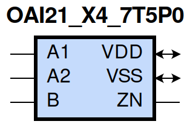
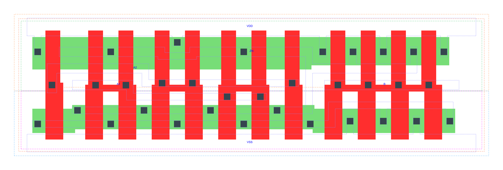

=======================================
gf180mcu_fd_sc_mcu7t5v0__oai21_x4
=======================================

**gf180mcu_fd_sc_mcu7t5v0__oai21_x4 symbol**

**gf180mcu_fd_sc_mcu7t5v0__oai21_x4 schematic**

.. image:: sc7_sch/OAI21_X4_sch.png
    :height: 300px
    :width: 500 px
    :align: center
    :alt: gf180mcu_fd_sc_mcu7t5v0__oai21_x4 schematic

**gf180mcu_fd_sc_mcu7t5v0__oai21_x4 layout**

.. include:: images.rst

OAI21_X4 is a 2-input OR into 2-input NAND, NAND[OR(A1,A2),B], 4X drive strength

|
| Attributes

============= ======================
**Attribute** **Value**
area          59.270400 µm\ :sup:`2`
============= ======================

|
| OUTPUT FUNCTIONS

============== ====================
**Output Pin** **Function**
ZN             (((!A1)&(!A2))|(!B))
============== ====================

|
| TRUTH TABLE FOR ZN

====== ====== ===== ======
**A1** **A2** **B** **ZN**
0      0      ?     1
?      ?      0     1
1      ?      1     0
?      1      1     0
====== ====== ===== ======

|
| FUNCTIONAL SCHEMATIC
| |image533|
| PIN CAPACITANCE (pf)

======= ======== ====================
**Pin** **Type** **Capacitance (pf)**
A2      input    0.0184
A1      input    0.0186
B       input    0.0165
======= ======== ====================

|
| DELAY AND OUTPUT TRANSITION TIME corresponding to min slew and load

+---------------+------------+--------------------+--------------+-------------------+----------------+---------------+
| **Input Pin** | **Output** | **When Condition** | **Tin (ns)** | **Out Load (pf)** | **Delay (ns)** | **Tout (ns)** |
+---------------+------------+--------------------+--------------+-------------------+----------------+---------------+
| A2(HL)        | ZN(LH)     | !A1&B              | 0.0100       | 0.0010            | 0.1356         | 0.0809        |
+---------------+------------+--------------------+--------------+-------------------+----------------+---------------+
| A2(LH)        | ZN(HL)     | !A1&B              | 0.0100       | 0.0010            | 0.0745         | 0.0499        |
+---------------+------------+--------------------+--------------+-------------------+----------------+---------------+
| A1(HL)        | ZN(LH)     | !A2&B              | 0.0100       | 0.0010            | 0.1076         | 0.0804        |
+---------------+------------+--------------------+--------------+-------------------+----------------+---------------+
| A1(LH)        | ZN(HL)     | !A2&B              | 0.0100       | 0.0010            | 0.0557         | 0.0339        |
+---------------+------------+--------------------+--------------+-------------------+----------------+---------------+
| B(LH)         | ZN(HL)     | !A1&A2             | 0.0100       | 0.0010            | 0.1000         | 0.0494        |
+---------------+------------+--------------------+--------------+-------------------+----------------+---------------+
| B(LH)         | ZN(HL)     | A1&!A2             | 0.0100       | 0.0010            | 0.0792         | 0.0346        |
+---------------+------------+--------------------+--------------+-------------------+----------------+---------------+
| B(LH)         | ZN(HL)     | A1&A2              | 0.0100       | 0.0010            | 0.0687         | 0.0335        |
+---------------+------------+--------------------+--------------+-------------------+----------------+---------------+
| B(HL)         | ZN(LH)     | !A1&A2             | 0.0100       | 0.0010            | 0.1211         | 0.1089        |
+---------------+------------+--------------------+--------------+-------------------+----------------+---------------+
| B(HL)         | ZN(LH)     | A1&!A2             | 0.0100       | 0.0010            | 0.1141         | 0.0819        |
+---------------+------------+--------------------+--------------+-------------------+----------------+---------------+
| B(HL)         | ZN(LH)     | A1&A2              | 0.0100       | 0.0010            | 0.1314         | 0.0942        |
+---------------+------------+--------------------+--------------+-------------------+----------------+---------------+

|
| DYNAMIC ENERGY

+---------------+--------------------+--------------+------------+-------------------+---------------------+
| **Input Pin** | **When Condition** | **Tin (ns)** | **Output** | **Out Load (pf)** | **Energy (uW/MHz)** |
+---------------+--------------------+--------------+------------+-------------------+---------------------+
| A1            | !A2&B              | 0.0100       | ZN(LH)     | 0.0010            | 0.4986              |
+---------------+--------------------+--------------+------------+-------------------+---------------------+
| B             | !A1&A2             | 0.0100       | ZN(HL)     | 0.0010            | 0.1219              |
+---------------+--------------------+--------------+------------+-------------------+---------------------+
| B             | A1&!A2             | 0.0100       | ZN(HL)     | 0.0010            | 0.0155              |
+---------------+--------------------+--------------+------------+-------------------+---------------------+
| B             | A1&A2              | 0.0100       | ZN(HL)     | 0.0010            | 0.0158              |
+---------------+--------------------+--------------+------------+-------------------+---------------------+
| A2            | !A1&B              | 0.0100       | ZN(LH)     | 0.0010            | 0.6067              |
+---------------+--------------------+--------------+------------+-------------------+---------------------+
| A1            | !A2&B              | 0.0100       | ZN(HL)     | 0.0010            | 0.0128              |
+---------------+--------------------+--------------+------------+-------------------+---------------------+
| B             | !A1&A2             | 0.0100       | ZN(LH)     | 0.0010            | 0.8996              |
+---------------+--------------------+--------------+------------+-------------------+---------------------+
| B             | A1&!A2             | 0.0100       | ZN(LH)     | 0.0010            | 0.7912              |
+---------------+--------------------+--------------+------------+-------------------+---------------------+
| B             | A1&A2              | 0.0100       | ZN(LH)     | 0.0010            | 0.8815              |
+---------------+--------------------+--------------+------------+-------------------+---------------------+
| A2            | !A1&B              | 0.0100       | ZN(HL)     | 0.0010            | 0.1089              |
+---------------+--------------------+--------------+------------+-------------------+---------------------+
| B(HL)         | !A1&!A2            | 0.0100       | n/a        | n/a               | 0.1436              |
+---------------+--------------------+--------------+------------+-------------------+---------------------+
| A2(LH)        | !A1&!B             | 0.0100       | n/a        | n/a               | 0.0534              |
+---------------+--------------------+--------------+------------+-------------------+---------------------+
| A2(LH)        | A1&!B              | 0.0100       | n/a        | n/a               | -0.1542             |
+---------------+--------------------+--------------+------------+-------------------+---------------------+
| A2(LH)        | A1&B               | 0.0100       | n/a        | n/a               | -0.1170             |
+---------------+--------------------+--------------+------------+-------------------+---------------------+
| A1(LH)        | !A2&!B             | 0.0100       | n/a        | n/a               | 0.0524              |
+---------------+--------------------+--------------+------------+-------------------+---------------------+
| A1(LH)        | A2&!B              | 0.0100       | n/a        | n/a               | -0.1558             |
+---------------+--------------------+--------------+------------+-------------------+---------------------+
| A1(LH)        | A2&B               | 0.0100       | n/a        | n/a               | -0.0404             |
+---------------+--------------------+--------------+------------+-------------------+---------------------+
| A2(HL)        | !A1&!B             | 0.0100       | n/a        | n/a               | 0.1590              |
+---------------+--------------------+--------------+------------+-------------------+---------------------+
| A2(HL)        | A1&!B              | 0.0100       | n/a        | n/a               | 0.1660              |
+---------------+--------------------+--------------+------------+-------------------+---------------------+
| A2(HL)        | A1&B               | 0.0100       | n/a        | n/a               | 0.1408              |
+---------------+--------------------+--------------+------------+-------------------+---------------------+
| B(LH)         | !A1&!A2            | 0.0100       | n/a        | n/a               | -0.1230             |
+---------------+--------------------+--------------+------------+-------------------+---------------------+
| A1(HL)        | !A2&!B             | 0.0100       | n/a        | n/a               | 0.1596              |
+---------------+--------------------+--------------+------------+-------------------+---------------------+
| A1(HL)        | A2&!B              | 0.0100       | n/a        | n/a               | 0.1663              |
+---------------+--------------------+--------------+------------+-------------------+---------------------+
| A1(HL)        | A2&B               | 0.0100       | n/a        | n/a               | 0.1111              |
+---------------+--------------------+--------------+------------+-------------------+---------------------+

|
| LEAKAGE POWER

================== ==============
**When Condition** **Power (nW)**
!A1&!A2&!B         0.2515
!A1&!A2&B          0.2536
!A1&A2&!B          0.4902
A1&!A2&!B          0.4902
A1&A2&!B           0.4914
!A1&A2&B           0.4037
A1&!A2&B           0.2610
A1&A2&B            0.2610
================== ==============

