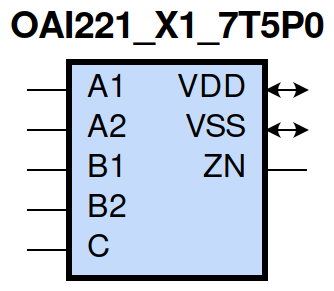
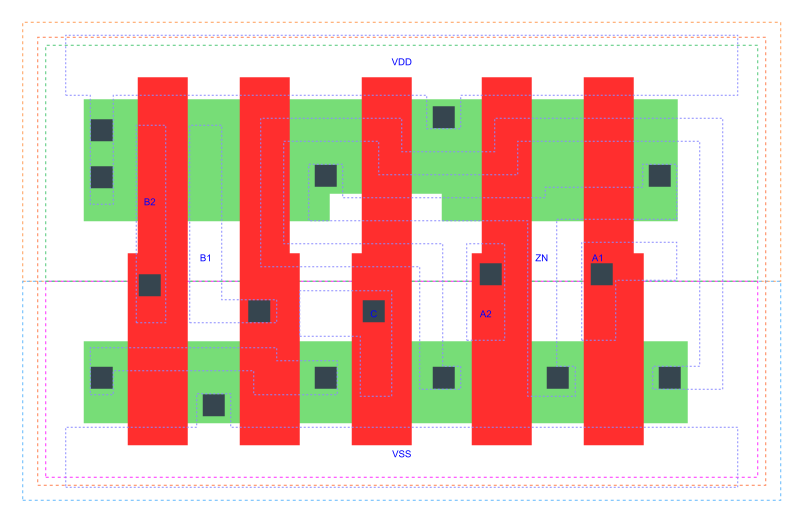

=======================================
gf180mcu_fd_sc_mcu7t5v0__oai221_x1
=======================================

**gf180mcu_fd_sc_mcu7t5v0__oai221_x1 symbol**

**gf180mcu_fd_sc_mcu7t5v0__oai221_x1 schematic**

.. image:: sc7_sch/OAI221_X1_sch.png
    :height: 300px
    :width: 500 px
    :align: center
    :alt: gf180mcu_fd_sc_mcu7t5v0__oai221_x1 schematic

**gf180mcu_fd_sc_mcu7t5v0__oai221_x1 layout**

.. include:: images.rst

OAI221_X1 is a two 2-input OR into 3-input NAND, NAND[OR(A1,A2),OR(B1,B2),C], 1X drive strength

|
| Attributes

============= ======================
**Attribute** **Value**
area          26.342400 µm\ :sup:`2`
============= ======================

|
| OUTPUT FUNCTIONS

============== ==================================
**Output Pin** **Function**
ZN             (((!A1)&(!A2))|((!B1)&(!B2))|(!C))
============== ==================================

|
| TRUTH TABLE FOR ZN

====== ====== ====== ====== ===== ======
**A1** **A2** **B1** **B2** **C** **ZN**
0      0      ?      ?      ?     1
?      ?      0      0      ?     1
?      ?      ?      ?      0     1
1      ?      1      ?      1     0
1      ?      ?      1      1     0
?      1      1      ?      1     0
?      1      ?      1      1     0
====== ====== ====== ====== ===== ======

|
| FUNCTIONAL SCHEMATIC
| |image536|
| PIN CAPACITANCE (pf)

======= ======== ====================
**Pin** **Type** **Capacitance (pf)**
B2      input    0.0047
B1      input    0.0051
C       input    0.0044
A2      input    0.0047
A1      input    0.0049
======= ======== ====================

|
| DELAY AND OUTPUT TRANSITION TIME corresponding to min slew and load

+---------------+------------+--------------------+--------------+-------------------+----------------+---------------+
| **Input Pin** | **Output** | **When Condition** | **Tin (ns)** | **Out Load (pf)** | **Delay (ns)** | **Tout (ns)** |
+---------------+------------+--------------------+--------------+-------------------+----------------+---------------+
| B2(HL)        | ZN(LH)     | !A1&A2&!B1&C       | 0.0100       | 0.0010            | 0.3236         | 0.2788        |
+---------------+------------+--------------------+--------------+-------------------+----------------+---------------+
| B2(HL)        | ZN(LH)     | A1&!A2&!B1&C       | 0.0100       | 0.0010            | 0.3074         | 0.2310        |
+---------------+------------+--------------------+--------------+-------------------+----------------+---------------+
| B2(HL)        | ZN(LH)     | A1&A2&!B1&C        | 0.0100       | 0.0010            | 0.3384         | 0.2513        |
+---------------+------------+--------------------+--------------+-------------------+----------------+---------------+
| B2(LH)        | ZN(HL)     | !A1&A2&!B1&C       | 0.0100       | 0.0010            | 0.2415         | 0.1226        |
+---------------+------------+--------------------+--------------+-------------------+----------------+---------------+
| B2(LH)        | ZN(HL)     | A1&!A2&!B1&C       | 0.0100       | 0.0010            | 0.2070         | 0.1006        |
+---------------+------------+--------------------+--------------+-------------------+----------------+---------------+
| B2(LH)        | ZN(HL)     | A1&A2&!B1&C        | 0.0100       | 0.0010            | 0.1817         | 0.1020        |
+---------------+------------+--------------------+--------------+-------------------+----------------+---------------+
| B1(HL)        | ZN(LH)     | !A1&A2&!B2&C       | 0.0100       | 0.0010            | 0.2995         | 0.2788        |
+---------------+------------+--------------------+--------------+-------------------+----------------+---------------+
| B1(HL)        | ZN(LH)     | A1&!A2&!B2&C       | 0.0100       | 0.0010            | 0.2832         | 0.2306        |
+---------------+------------+--------------------+--------------+-------------------+----------------+---------------+
| B1(HL)        | ZN(LH)     | A1&A2&!B2&C        | 0.0100       | 0.0010            | 0.3143         | 0.2515        |
+---------------+------------+--------------------+--------------+-------------------+----------------+---------------+
| B1(LH)        | ZN(HL)     | !A1&A2&!B2&C       | 0.0100       | 0.0010            | 0.2102         | 0.1003        |
+---------------+------------+--------------------+--------------+-------------------+----------------+---------------+
| B1(LH)        | ZN(HL)     | A1&!A2&!B2&C       | 0.0100       | 0.0010            | 0.1768         | 0.0774        |
+---------------+------------+--------------------+--------------+-------------------+----------------+---------------+
| B1(LH)        | ZN(HL)     | A1&A2&!B2&C        | 0.0100       | 0.0010            | 0.1570         | 0.0826        |
+---------------+------------+--------------------+--------------+-------------------+----------------+---------------+
| C(HL)         | ZN(LH)     | !A1&A2&!B1&B2      | 0.0100       | 0.0010            | 0.1837         | 0.1875        |
+---------------+------------+--------------------+--------------+-------------------+----------------+---------------+
| C(HL)         | ZN(LH)     | !A1&A2&B1&!B2      | 0.0100       | 0.0010            | 0.1741         | 0.1554        |
+---------------+------------+--------------------+--------------+-------------------+----------------+---------------+
| C(HL)         | ZN(LH)     | !A1&A2&B1&B2       | 0.0100       | 0.0010            | 0.1731         | 0.1552        |
+---------------+------------+--------------------+--------------+-------------------+----------------+---------------+
| C(HL)         | ZN(LH)     | A1&!A2&!B1&B2      | 0.0100       | 0.0010            | 0.1742         | 0.1552        |
+---------------+------------+--------------------+--------------+-------------------+----------------+---------------+
| C(HL)         | ZN(LH)     | A1&!A2&B1&!B2      | 0.0100       | 0.0010            | 0.1656         | 0.1243        |
+---------------+------------+--------------------+--------------+-------------------+----------------+---------------+
| C(HL)         | ZN(LH)     | A1&!A2&B1&B2       | 0.0100       | 0.0010            | 0.1647         | 0.1242        |
+---------------+------------+--------------------+--------------+-------------------+----------------+---------------+
| C(HL)         | ZN(LH)     | A1&A2&!B1&B2       | 0.0100       | 0.0010            | 0.1931         | 0.1680        |
+---------------+------------+--------------------+--------------+-------------------+----------------+---------------+
| C(HL)         | ZN(LH)     | A1&A2&B1&!B2       | 0.0100       | 0.0010            | 0.1851         | 0.1378        |
+---------------+------------+--------------------+--------------+-------------------+----------------+---------------+
| C(HL)         | ZN(LH)     | A1&A2&B1&B2        | 0.0100       | 0.0010            | 0.1840         | 0.1378        |
+---------------+------------+--------------------+--------------+-------------------+----------------+---------------+
| C(LH)         | ZN(HL)     | !A1&A2&!B1&B2      | 0.0100       | 0.0010            | 0.2156         | 0.1228        |
+---------------+------------+--------------------+--------------+-------------------+----------------+---------------+
| C(LH)         | ZN(HL)     | !A1&A2&B1&!B2      | 0.0100       | 0.0010            | 0.1808         | 0.1003        |
+---------------+------------+--------------------+--------------+-------------------+----------------+---------------+
| C(LH)         | ZN(HL)     | !A1&A2&B1&B2       | 0.0100       | 0.0010            | 0.1570         | 0.0824        |
+---------------+------------+--------------------+--------------+-------------------+----------------+---------------+
| C(LH)         | ZN(HL)     | A1&!A2&!B1&B2      | 0.0100       | 0.0010            | 0.1812         | 0.1005        |
+---------------+------------+--------------------+--------------+-------------------+----------------+---------------+
| C(LH)         | ZN(HL)     | A1&!A2&B1&!B2      | 0.0100       | 0.0010            | 0.1476         | 0.0777        |
+---------------+------------+--------------------+--------------+-------------------+----------------+---------------+
| C(LH)         | ZN(HL)     | A1&!A2&B1&B2       | 0.0100       | 0.0010            | 0.1293         | 0.0634        |
+---------------+------------+--------------------+--------------+-------------------+----------------+---------------+
| C(LH)         | ZN(HL)     | A1&A2&!B1&B2       | 0.0100       | 0.0010            | 0.1560         | 0.1021        |
+---------------+------------+--------------------+--------------+-------------------+----------------+---------------+
| C(LH)         | ZN(HL)     | A1&A2&B1&!B2       | 0.0100       | 0.0010            | 0.1286         | 0.0825        |
+---------------+------------+--------------------+--------------+-------------------+----------------+---------------+
| C(LH)         | ZN(HL)     | A1&A2&B1&B2        | 0.0100       | 0.0010            | 0.1107         | 0.0631        |
+---------------+------------+--------------------+--------------+-------------------+----------------+---------------+
| A2(HL)        | ZN(LH)     | !A1&!B1&B2&C       | 0.0100       | 0.0010            | 0.1714         | 0.1487        |
+---------------+------------+--------------------+--------------+-------------------+----------------+---------------+
| A2(HL)        | ZN(LH)     | !A1&B1&!B2&C       | 0.0100       | 0.0010            | 0.1619         | 0.1082        |
+---------------+------------+--------------------+--------------+-------------------+----------------+---------------+
| A2(HL)        | ZN(LH)     | !A1&B1&B2&C        | 0.0100       | 0.0010            | 0.1618         | 0.1082        |
+---------------+------------+--------------------+--------------+-------------------+----------------+---------------+
| A2(LH)        | ZN(HL)     | !A1&!B1&B2&C       | 0.0100       | 0.0010            | 0.1517         | 0.1215        |
+---------------+------------+--------------------+--------------+-------------------+----------------+---------------+
| A2(LH)        | ZN(HL)     | !A1&B1&!B2&C       | 0.0100       | 0.0010            | 0.1171         | 0.0973        |
+---------------+------------+--------------------+--------------+-------------------+----------------+---------------+
| A2(LH)        | ZN(HL)     | !A1&B1&B2&C        | 0.0100       | 0.0010            | 0.1078         | 0.0813        |
+---------------+------------+--------------------+--------------+-------------------+----------------+---------------+
| A1(HL)        | ZN(LH)     | !A2&!B1&B2&C       | 0.0100       | 0.0010            | 0.1469         | 0.1485        |
+---------------+------------+--------------------+--------------+-------------------+----------------+---------------+
| A1(HL)        | ZN(LH)     | !A2&B1&!B2&C       | 0.0100       | 0.0010            | 0.1374         | 0.1080        |
+---------------+------------+--------------------+--------------+-------------------+----------------+---------------+
| A1(HL)        | ZN(LH)     | !A2&B1&B2&C        | 0.0100       | 0.0010            | 0.1373         | 0.1080        |
+---------------+------------+--------------------+--------------+-------------------+----------------+---------------+
| A1(LH)        | ZN(HL)     | !A2&!B1&B2&C       | 0.0100       | 0.0010            | 0.1207         | 0.0978        |
+---------------+------------+--------------------+--------------+-------------------+----------------+---------------+
| A1(LH)        | ZN(HL)     | !A2&B1&!B2&C       | 0.0100       | 0.0010            | 0.0886         | 0.0720        |
+---------------+------------+--------------------+--------------+-------------------+----------------+---------------+
| A1(LH)        | ZN(HL)     | !A2&B1&B2&C        | 0.0100       | 0.0010            | 0.0834         | 0.0608        |
+---------------+------------+--------------------+--------------+-------------------+----------------+---------------+

|
| DYNAMIC ENERGY

+---------------+--------------------+--------------+------------+-------------------+---------------------+
| **Input Pin** | **When Condition** | **Tin (ns)** | **Output** | **Out Load (pf)** | **Energy (uW/MHz)** |
+---------------+--------------------+--------------+------------+-------------------+---------------------+
| C             | !A1&A2&!B1&B2      | 0.0100       | ZN(LH)     | 0.0010            | 0.3105              |
+---------------+--------------------+--------------+------------+-------------------+---------------------+
| C             | !A1&A2&B1&!B2      | 0.0100       | ZN(LH)     | 0.0010            | 0.2808              |
+---------------+--------------------+--------------+------------+-------------------+---------------------+
| C             | !A1&A2&B1&B2       | 0.0100       | ZN(LH)     | 0.0010            | 0.2797              |
+---------------+--------------------+--------------+------------+-------------------+---------------------+
| C             | A1&!A2&!B1&B2      | 0.0100       | ZN(LH)     | 0.0010            | 0.2808              |
+---------------+--------------------+--------------+------------+-------------------+---------------------+
| C             | A1&!A2&B1&!B2      | 0.0100       | ZN(LH)     | 0.0010            | 0.2510              |
+---------------+--------------------+--------------+------------+-------------------+---------------------+
| C             | A1&!A2&B1&B2       | 0.0100       | ZN(LH)     | 0.0010            | 0.2500              |
+---------------+--------------------+--------------+------------+-------------------+---------------------+
| C             | A1&A2&!B1&B2       | 0.0100       | ZN(LH)     | 0.0010            | 0.3034              |
+---------------+--------------------+--------------+------------+-------------------+---------------------+
| C             | A1&A2&B1&!B2       | 0.0100       | ZN(LH)     | 0.0010            | 0.2736              |
+---------------+--------------------+--------------+------------+-------------------+---------------------+
| C             | A1&A2&B1&B2        | 0.0100       | ZN(LH)     | 0.0010            | 0.2723              |
+---------------+--------------------+--------------+------------+-------------------+---------------------+
| C             | !A1&A2&!B1&B2      | 0.0100       | ZN(HL)     | 0.0010            | 0.0819              |
+---------------+--------------------+--------------+------------+-------------------+---------------------+
| C             | !A1&A2&B1&!B2      | 0.0100       | ZN(HL)     | 0.0010            | 0.0573              |
+---------------+--------------------+--------------+------------+-------------------+---------------------+
| C             | !A1&A2&B1&B2       | 0.0100       | ZN(HL)     | 0.0010            | 0.0573              |
+---------------+--------------------+--------------+------------+-------------------+---------------------+
| C             | A1&!A2&!B1&B2      | 0.0100       | ZN(HL)     | 0.0010            | 0.0574              |
+---------------+--------------------+--------------+------------+-------------------+---------------------+
| C             | A1&!A2&B1&!B2      | 0.0100       | ZN(HL)     | 0.0010            | 0.0325              |
+---------------+--------------------+--------------+------------+-------------------+---------------------+
| C             | A1&!A2&B1&B2       | 0.0100       | ZN(HL)     | 0.0010            | 0.0326              |
+---------------+--------------------+--------------+------------+-------------------+---------------------+
| C             | A1&A2&!B1&B2       | 0.0100       | ZN(HL)     | 0.0010            | 0.0573              |
+---------------+--------------------+--------------+------------+-------------------+---------------------+
| C             | A1&A2&B1&!B2       | 0.0100       | ZN(HL)     | 0.0010            | 0.0326              |
+---------------+--------------------+--------------+------------+-------------------+---------------------+
| C             | A1&A2&B1&B2        | 0.0100       | ZN(HL)     | 0.0010            | 0.0325              |
+---------------+--------------------+--------------+------------+-------------------+---------------------+
| A1            | !A2&!B1&B2&C       | 0.0100       | ZN(LH)     | 0.0010            | 0.1724              |
+---------------+--------------------+--------------+------------+-------------------+---------------------+
| A1            | !A2&B1&!B2&C       | 0.0100       | ZN(LH)     | 0.0010            | 0.1426              |
+---------------+--------------------+--------------+------------+-------------------+---------------------+
| A1            | !A2&B1&B2&C        | 0.0100       | ZN(LH)     | 0.0010            | 0.1426              |
+---------------+--------------------+--------------+------------+-------------------+---------------------+
| B2            | !A1&A2&!B1&C       | 0.0100       | ZN(LH)     | 0.0010            | 0.3894              |
+---------------+--------------------+--------------+------------+-------------------+---------------------+
| B2            | A1&!A2&!B1&C       | 0.0100       | ZN(LH)     | 0.0010            | 0.3596              |
+---------------+--------------------+--------------+------------+-------------------+---------------------+
| B2            | A1&A2&!B1&C        | 0.0100       | ZN(LH)     | 0.0010            | 0.3817              |
+---------------+--------------------+--------------+------------+-------------------+---------------------+
| B1            | !A1&A2&!B2&C       | 0.0100       | ZN(LH)     | 0.0010            | 0.3595              |
+---------------+--------------------+--------------+------------+-------------------+---------------------+
| B1            | A1&!A2&!B2&C       | 0.0100       | ZN(LH)     | 0.0010            | 0.3300              |
+---------------+--------------------+--------------+------------+-------------------+---------------------+
| B1            | A1&A2&!B2&C        | 0.0100       | ZN(LH)     | 0.0010            | 0.3522              |
+---------------+--------------------+--------------+------------+-------------------+---------------------+
| A2            | !A1&!B1&B2&C       | 0.0100       | ZN(LH)     | 0.0010            | 0.2023              |
+---------------+--------------------+--------------+------------+-------------------+---------------------+
| A2            | !A1&B1&!B2&C       | 0.0100       | ZN(LH)     | 0.0010            | 0.1726              |
+---------------+--------------------+--------------+------------+-------------------+---------------------+
| A2            | !A1&B1&B2&C        | 0.0100       | ZN(LH)     | 0.0010            | 0.1725              |
+---------------+--------------------+--------------+------------+-------------------+---------------------+
| B1            | !A1&A2&!B2&C       | 0.0100       | ZN(HL)     | 0.0010            | 0.0546              |
+---------------+--------------------+--------------+------------+-------------------+---------------------+
| B1            | A1&!A2&!B2&C       | 0.0100       | ZN(HL)     | 0.0010            | 0.0297              |
+---------------+--------------------+--------------+------------+-------------------+---------------------+
| B1            | A1&A2&!B2&C        | 0.0100       | ZN(HL)     | 0.0010            | 0.0298              |
+---------------+--------------------+--------------+------------+-------------------+---------------------+
| A1            | !A2&!B1&B2&C       | 0.0100       | ZN(HL)     | 0.0010            | 0.0549              |
+---------------+--------------------+--------------+------------+-------------------+---------------------+
| A1            | !A2&B1&!B2&C       | 0.0100       | ZN(HL)     | 0.0010            | 0.0299              |
+---------------+--------------------+--------------+------------+-------------------+---------------------+
| A1            | !A2&B1&B2&C        | 0.0100       | ZN(HL)     | 0.0010            | 0.0299              |
+---------------+--------------------+--------------+------------+-------------------+---------------------+
| B2            | !A1&A2&!B1&C       | 0.0100       | ZN(HL)     | 0.0010            | 0.0755              |
+---------------+--------------------+--------------+------------+-------------------+---------------------+
| B2            | A1&!A2&!B1&C       | 0.0100       | ZN(HL)     | 0.0010            | 0.0510              |
+---------------+--------------------+--------------+------------+-------------------+---------------------+
| B2            | A1&A2&!B1&C        | 0.0100       | ZN(HL)     | 0.0010            | 0.0509              |
+---------------+--------------------+--------------+------------+-------------------+---------------------+
| A2            | !A1&!B1&B2&C       | 0.0100       | ZN(HL)     | 0.0010            | 0.0757              |
+---------------+--------------------+--------------+------------+-------------------+---------------------+
| A2            | !A1&B1&!B2&C       | 0.0100       | ZN(HL)     | 0.0010            | 0.0512              |
+---------------+--------------------+--------------+------------+-------------------+---------------------+
| A2            | !A1&B1&B2&C        | 0.0100       | ZN(HL)     | 0.0010            | 0.0511              |
+---------------+--------------------+--------------+------------+-------------------+---------------------+
| A1(LH)        | !A2&!B1&!B2&!C     | 0.0100       | n/a        | n/a               | 0.0454              |
+---------------+--------------------+--------------+------------+-------------------+---------------------+
| A1(LH)        | !A2&!B1&!B2&C      | 0.0100       | n/a        | n/a               | 0.1196              |
+---------------+--------------------+--------------+------------+-------------------+---------------------+
| A1(LH)        | !A2&!B1&B2&!C      | 0.0100       | n/a        | n/a               | 0.0455              |
+---------------+--------------------+--------------+------------+-------------------+---------------------+
| A1(LH)        | !A2&B1&!B2&!C      | 0.0100       | n/a        | n/a               | 0.0455              |
+---------------+--------------------+--------------+------------+-------------------+---------------------+
| A1(LH)        | !A2&B1&B2&!C       | 0.0100       | n/a        | n/a               | 0.0455              |
+---------------+--------------------+--------------+------------+-------------------+---------------------+
| A1(LH)        | A2&!B1&!B2&!C      | 0.0100       | n/a        | n/a               | -0.0431             |
+---------------+--------------------+--------------+------------+-------------------+---------------------+
| A1(LH)        | A2&!B1&!B2&C       | 0.0100       | n/a        | n/a               | -0.0430             |
+---------------+--------------------+--------------+------------+-------------------+---------------------+
| A1(LH)        | A2&!B1&B2&!C       | 0.0100       | n/a        | n/a               | -0.0430             |
+---------------+--------------------+--------------+------------+-------------------+---------------------+
| A1(LH)        | A2&B1&!B2&!C       | 0.0100       | n/a        | n/a               | -0.0430             |
+---------------+--------------------+--------------+------------+-------------------+---------------------+
| A1(LH)        | A2&B1&B2&!C        | 0.0100       | n/a        | n/a               | -0.0430             |
+---------------+--------------------+--------------+------------+-------------------+---------------------+
| A1(LH)        | A2&!B1&B2&C        | 0.0100       | n/a        | n/a               | -0.0111             |
+---------------+--------------------+--------------+------------+-------------------+---------------------+
| A1(LH)        | A2&B1&!B2&C        | 0.0100       | n/a        | n/a               | -0.0111             |
+---------------+--------------------+--------------+------------+-------------------+---------------------+
| A1(LH)        | A2&B1&B2&C         | 0.0100       | n/a        | n/a               | -0.0111             |
+---------------+--------------------+--------------+------------+-------------------+---------------------+
| C(HL)         | !A1&!A2&!B1&!B2    | 0.0100       | n/a        | n/a               | 0.0408              |
+---------------+--------------------+--------------+------------+-------------------+---------------------+
| C(HL)         | !A1&!A2&!B1&B2     | 0.0100       | n/a        | n/a               | 0.0373              |
+---------------+--------------------+--------------+------------+-------------------+---------------------+
| C(HL)         | !A1&!A2&B1&!B2     | 0.0100       | n/a        | n/a               | 0.0373              |
+---------------+--------------------+--------------+------------+-------------------+---------------------+
| C(HL)         | !A1&!A2&B1&B2      | 0.0100       | n/a        | n/a               | 0.0363              |
+---------------+--------------------+--------------+------------+-------------------+---------------------+
| C(HL)         | !A1&A2&!B1&!B2     | 0.0100       | n/a        | n/a               | 0.0312              |
+---------------+--------------------+--------------+------------+-------------------+---------------------+
| C(HL)         | A1&!A2&!B1&!B2     | 0.0100       | n/a        | n/a               | 0.0313              |
+---------------+--------------------+--------------+------------+-------------------+---------------------+
| C(HL)         | A1&A2&!B1&!B2      | 0.0100       | n/a        | n/a               | 0.0313              |
+---------------+--------------------+--------------+------------+-------------------+---------------------+
| B2(LH)        | !A1&!A2&!B1&!C     | 0.0100       | n/a        | n/a               | -0.0393             |
+---------------+--------------------+--------------+------------+-------------------+---------------------+
| B2(LH)        | !A1&!A2&!B1&C      | 0.0100       | n/a        | n/a               | -0.0394             |
+---------------+--------------------+--------------+------------+-------------------+---------------------+
| B2(LH)        | !A1&!A2&B1&!C      | 0.0100       | n/a        | n/a               | -0.0380             |
+---------------+--------------------+--------------+------------+-------------------+---------------------+
| B2(LH)        | !A1&!A2&B1&C       | 0.0100       | n/a        | n/a               | -0.0380             |
+---------------+--------------------+--------------+------------+-------------------+---------------------+
| B2(LH)        | !A1&A2&!B1&!C      | 0.0100       | n/a        | n/a               | -0.0394             |
+---------------+--------------------+--------------+------------+-------------------+---------------------+
| B2(LH)        | !A1&A2&B1&!C       | 0.0100       | n/a        | n/a               | -0.0380             |
+---------------+--------------------+--------------+------------+-------------------+---------------------+
| B2(LH)        | A1&!A2&!B1&!C      | 0.0100       | n/a        | n/a               | -0.0394             |
+---------------+--------------------+--------------+------------+-------------------+---------------------+
| B2(LH)        | A1&!A2&B1&!C       | 0.0100       | n/a        | n/a               | -0.0380             |
+---------------+--------------------+--------------+------------+-------------------+---------------------+
| B2(LH)        | A1&A2&!B1&!C       | 0.0100       | n/a        | n/a               | -0.0394             |
+---------------+--------------------+--------------+------------+-------------------+---------------------+
| B2(LH)        | A1&A2&B1&!C        | 0.0100       | n/a        | n/a               | -0.0380             |
+---------------+--------------------+--------------+------------+-------------------+---------------------+
| B2(LH)        | !A1&A2&B1&C        | 0.0100       | n/a        | n/a               | -0.0328             |
+---------------+--------------------+--------------+------------+-------------------+---------------------+
| B2(LH)        | A1&!A2&B1&C        | 0.0100       | n/a        | n/a               | -0.0328             |
+---------------+--------------------+--------------+------------+-------------------+---------------------+
| B2(LH)        | A1&A2&B1&C         | 0.0100       | n/a        | n/a               | -0.0328             |
+---------------+--------------------+--------------+------------+-------------------+---------------------+
| A2(HL)        | !A1&!B1&!B2&!C     | 0.0100       | n/a        | n/a               | 0.0440              |
+---------------+--------------------+--------------+------------+-------------------+---------------------+
| A2(HL)        | !A1&!B1&!B2&C      | 0.0100       | n/a        | n/a               | 0.0440              |
+---------------+--------------------+--------------+------------+-------------------+---------------------+
| A2(HL)        | !A1&!B1&B2&!C      | 0.0100       | n/a        | n/a               | 0.0440              |
+---------------+--------------------+--------------+------------+-------------------+---------------------+
| A2(HL)        | !A1&B1&!B2&!C      | 0.0100       | n/a        | n/a               | 0.0440              |
+---------------+--------------------+--------------+------------+-------------------+---------------------+
| A2(HL)        | !A1&B1&B2&!C       | 0.0100       | n/a        | n/a               | 0.0440              |
+---------------+--------------------+--------------+------------+-------------------+---------------------+
| A2(HL)        | A1&!B1&!B2&!C      | 0.0100       | n/a        | n/a               | 0.0441              |
+---------------+--------------------+--------------+------------+-------------------+---------------------+
| A2(HL)        | A1&!B1&!B2&C       | 0.0100       | n/a        | n/a               | 0.0443              |
+---------------+--------------------+--------------+------------+-------------------+---------------------+
| A2(HL)        | A1&!B1&B2&!C       | 0.0100       | n/a        | n/a               | 0.0441              |
+---------------+--------------------+--------------+------------+-------------------+---------------------+
| A2(HL)        | A1&B1&!B2&!C       | 0.0100       | n/a        | n/a               | 0.0441              |
+---------------+--------------------+--------------+------------+-------------------+---------------------+
| A2(HL)        | A1&B1&B2&!C        | 0.0100       | n/a        | n/a               | 0.0441              |
+---------------+--------------------+--------------+------------+-------------------+---------------------+
| A2(HL)        | A1&!B1&B2&C        | 0.0100       | n/a        | n/a               | 0.0393              |
+---------------+--------------------+--------------+------------+-------------------+---------------------+
| A2(HL)        | A1&B1&!B2&C        | 0.0100       | n/a        | n/a               | 0.0393              |
+---------------+--------------------+--------------+------------+-------------------+---------------------+
| A2(HL)        | A1&B1&B2&C         | 0.0100       | n/a        | n/a               | 0.0393              |
+---------------+--------------------+--------------+------------+-------------------+---------------------+
| B1(HL)        | !A1&!A2&!B2&!C     | 0.0100       | n/a        | n/a               | 0.0398              |
+---------------+--------------------+--------------+------------+-------------------+---------------------+
| B1(HL)        | !A1&!A2&!B2&C      | 0.0100       | n/a        | n/a               | 0.0398              |
+---------------+--------------------+--------------+------------+-------------------+---------------------+
| B1(HL)        | !A1&!A2&B2&!C      | 0.0100       | n/a        | n/a               | 0.0396              |
+---------------+--------------------+--------------+------------+-------------------+---------------------+
| B1(HL)        | !A1&!A2&B2&C       | 0.0100       | n/a        | n/a               | 0.0397              |
+---------------+--------------------+--------------+------------+-------------------+---------------------+
| B1(HL)        | !A1&A2&!B2&!C      | 0.0100       | n/a        | n/a               | 0.0398              |
+---------------+--------------------+--------------+------------+-------------------+---------------------+
| B1(HL)        | !A1&A2&B2&!C       | 0.0100       | n/a        | n/a               | 0.0397              |
+---------------+--------------------+--------------+------------+-------------------+---------------------+
| B1(HL)        | A1&!A2&!B2&!C      | 0.0100       | n/a        | n/a               | 0.0398              |
+---------------+--------------------+--------------+------------+-------------------+---------------------+
| B1(HL)        | A1&!A2&B2&!C       | 0.0100       | n/a        | n/a               | 0.0397              |
+---------------+--------------------+--------------+------------+-------------------+---------------------+
| B1(HL)        | A1&A2&!B2&!C       | 0.0100       | n/a        | n/a               | 0.0398              |
+---------------+--------------------+--------------+------------+-------------------+---------------------+
| B1(HL)        | A1&A2&B2&!C        | 0.0100       | n/a        | n/a               | 0.0397              |
+---------------+--------------------+--------------+------------+-------------------+---------------------+
| B1(HL)        | !A1&A2&B2&C        | 0.0100       | n/a        | n/a               | 0.0264              |
+---------------+--------------------+--------------+------------+-------------------+---------------------+
| B1(HL)        | A1&!A2&B2&C        | 0.0100       | n/a        | n/a               | 0.0264              |
+---------------+--------------------+--------------+------------+-------------------+---------------------+
| B1(HL)        | A1&A2&B2&C         | 0.0100       | n/a        | n/a               | 0.0264              |
+---------------+--------------------+--------------+------------+-------------------+---------------------+
| B2(HL)        | !A1&!A2&!B1&!C     | 0.0100       | n/a        | n/a               | 0.0395              |
+---------------+--------------------+--------------+------------+-------------------+---------------------+
| B2(HL)        | !A1&!A2&!B1&C      | 0.0100       | n/a        | n/a               | 0.0396              |
+---------------+--------------------+--------------+------------+-------------------+---------------------+
| B2(HL)        | !A1&!A2&B1&!C      | 0.0100       | n/a        | n/a               | 0.0393              |
+---------------+--------------------+--------------+------------+-------------------+---------------------+
| B2(HL)        | !A1&!A2&B1&C       | 0.0100       | n/a        | n/a               | 0.0393              |
+---------------+--------------------+--------------+------------+-------------------+---------------------+
| B2(HL)        | !A1&A2&!B1&!C      | 0.0100       | n/a        | n/a               | 0.0395              |
+---------------+--------------------+--------------+------------+-------------------+---------------------+
| B2(HL)        | !A1&A2&B1&!C       | 0.0100       | n/a        | n/a               | 0.0393              |
+---------------+--------------------+--------------+------------+-------------------+---------------------+
| B2(HL)        | A1&!A2&!B1&!C      | 0.0100       | n/a        | n/a               | 0.0395              |
+---------------+--------------------+--------------+------------+-------------------+---------------------+
| B2(HL)        | A1&!A2&B1&!C       | 0.0100       | n/a        | n/a               | 0.0393              |
+---------------+--------------------+--------------+------------+-------------------+---------------------+
| B2(HL)        | A1&A2&!B1&!C       | 0.0100       | n/a        | n/a               | 0.0395              |
+---------------+--------------------+--------------+------------+-------------------+---------------------+
| B2(HL)        | A1&A2&B1&!C        | 0.0100       | n/a        | n/a               | 0.0393              |
+---------------+--------------------+--------------+------------+-------------------+---------------------+
| B2(HL)        | !A1&A2&B1&C        | 0.0100       | n/a        | n/a               | 0.0393              |
+---------------+--------------------+--------------+------------+-------------------+---------------------+
| B2(HL)        | A1&!A2&B1&C        | 0.0100       | n/a        | n/a               | 0.0393              |
+---------------+--------------------+--------------+------------+-------------------+---------------------+
| B2(HL)        | A1&A2&B1&C         | 0.0100       | n/a        | n/a               | 0.0393              |
+---------------+--------------------+--------------+------------+-------------------+---------------------+
| A1(HL)        | !A2&!B1&!B2&!C     | 0.0100       | n/a        | n/a               | 0.0443              |
+---------------+--------------------+--------------+------------+-------------------+---------------------+
| A1(HL)        | !A2&!B1&!B2&C      | 0.0100       | n/a        | n/a               | 0.0443              |
+---------------+--------------------+--------------+------------+-------------------+---------------------+
| A1(HL)        | !A2&!B1&B2&!C      | 0.0100       | n/a        | n/a               | 0.0443              |
+---------------+--------------------+--------------+------------+-------------------+---------------------+
| A1(HL)        | !A2&B1&!B2&!C      | 0.0100       | n/a        | n/a               | 0.0443              |
+---------------+--------------------+--------------+------------+-------------------+---------------------+
| A1(HL)        | !A2&B1&B2&!C       | 0.0100       | n/a        | n/a               | 0.0443              |
+---------------+--------------------+--------------+------------+-------------------+---------------------+
| A1(HL)        | A2&!B1&!B2&!C      | 0.0100       | n/a        | n/a               | 0.0443              |
+---------------+--------------------+--------------+------------+-------------------+---------------------+
| A1(HL)        | A2&!B1&!B2&C       | 0.0100       | n/a        | n/a               | 0.0445              |
+---------------+--------------------+--------------+------------+-------------------+---------------------+
| A1(HL)        | A2&!B1&B2&!C       | 0.0100       | n/a        | n/a               | 0.0443              |
+---------------+--------------------+--------------+------------+-------------------+---------------------+
| A1(HL)        | A2&B1&!B2&!C       | 0.0100       | n/a        | n/a               | 0.0443              |
+---------------+--------------------+--------------+------------+-------------------+---------------------+
| A1(HL)        | A2&B1&B2&!C        | 0.0100       | n/a        | n/a               | 0.0443              |
+---------------+--------------------+--------------+------------+-------------------+---------------------+
| A1(HL)        | A2&!B1&B2&C        | 0.0100       | n/a        | n/a               | 0.0264              |
+---------------+--------------------+--------------+------------+-------------------+---------------------+
| A1(HL)        | A2&B1&!B2&C        | 0.0100       | n/a        | n/a               | 0.0264              |
+---------------+--------------------+--------------+------------+-------------------+---------------------+
| A1(HL)        | A2&B1&B2&C         | 0.0100       | n/a        | n/a               | 0.0264              |
+---------------+--------------------+--------------+------------+-------------------+---------------------+
| B1(LH)        | !A1&!A2&!B2&!C     | 0.0100       | n/a        | n/a               | -0.0397             |
+---------------+--------------------+--------------+------------+-------------------+---------------------+
| B1(LH)        | !A1&!A2&!B2&C      | 0.0100       | n/a        | n/a               | -0.0398             |
+---------------+--------------------+--------------+------------+-------------------+---------------------+
| B1(LH)        | !A1&!A2&B2&!C      | 0.0100       | n/a        | n/a               | -0.0385             |
+---------------+--------------------+--------------+------------+-------------------+---------------------+
| B1(LH)        | !A1&!A2&B2&C       | 0.0100       | n/a        | n/a               | -0.0385             |
+---------------+--------------------+--------------+------------+-------------------+---------------------+
| B1(LH)        | !A1&A2&!B2&!C      | 0.0100       | n/a        | n/a               | -0.0397             |
+---------------+--------------------+--------------+------------+-------------------+---------------------+
| B1(LH)        | !A1&A2&B2&!C       | 0.0100       | n/a        | n/a               | -0.0385             |
+---------------+--------------------+--------------+------------+-------------------+---------------------+
| B1(LH)        | A1&!A2&!B2&!C      | 0.0100       | n/a        | n/a               | -0.0397             |
+---------------+--------------------+--------------+------------+-------------------+---------------------+
| B1(LH)        | A1&!A2&B2&!C       | 0.0100       | n/a        | n/a               | -0.0385             |
+---------------+--------------------+--------------+------------+-------------------+---------------------+
| B1(LH)        | A1&A2&!B2&!C       | 0.0100       | n/a        | n/a               | -0.0397             |
+---------------+--------------------+--------------+------------+-------------------+---------------------+
| B1(LH)        | A1&A2&B2&!C        | 0.0100       | n/a        | n/a               | -0.0385             |
+---------------+--------------------+--------------+------------+-------------------+---------------------+
| B1(LH)        | !A1&A2&B2&C        | 0.0100       | n/a        | n/a               | -0.0111             |
+---------------+--------------------+--------------+------------+-------------------+---------------------+
| B1(LH)        | A1&!A2&B2&C        | 0.0100       | n/a        | n/a               | -0.0111             |
+---------------+--------------------+--------------+------------+-------------------+---------------------+
| B1(LH)        | A1&A2&B2&C         | 0.0100       | n/a        | n/a               | -0.0111             |
+---------------+--------------------+--------------+------------+-------------------+---------------------+
| C(LH)         | !A1&!A2&!B1&!B2    | 0.0100       | n/a        | n/a               | -0.0306             |
+---------------+--------------------+--------------+------------+-------------------+---------------------+
| C(LH)         | !A1&!A2&!B1&B2     | 0.0100       | n/a        | n/a               | -0.0305             |
+---------------+--------------------+--------------+------------+-------------------+---------------------+
| C(LH)         | !A1&!A2&B1&!B2     | 0.0100       | n/a        | n/a               | -0.0305             |
+---------------+--------------------+--------------+------------+-------------------+---------------------+
| C(LH)         | !A1&!A2&B1&B2      | 0.0100       | n/a        | n/a               | -0.0306             |
+---------------+--------------------+--------------+------------+-------------------+---------------------+
| C(LH)         | !A1&A2&!B1&!B2     | 0.0100       | n/a        | n/a               | 0.0075              |
+---------------+--------------------+--------------+------------+-------------------+---------------------+
| C(LH)         | A1&!A2&!B1&!B2     | 0.0100       | n/a        | n/a               | 0.0074              |
+---------------+--------------------+--------------+------------+-------------------+---------------------+
| C(LH)         | A1&A2&!B1&!B2      | 0.0100       | n/a        | n/a               | 0.0076              |
+---------------+--------------------+--------------+------------+-------------------+---------------------+
| A2(LH)        | !A1&!B1&!B2&!C     | 0.0100       | n/a        | n/a               | 0.0459              |
+---------------+--------------------+--------------+------------+-------------------+---------------------+
| A2(LH)        | !A1&!B1&!B2&C      | 0.0100       | n/a        | n/a               | 0.1200              |
+---------------+--------------------+--------------+------------+-------------------+---------------------+
| A2(LH)        | !A1&!B1&B2&!C      | 0.0100       | n/a        | n/a               | 0.0460              |
+---------------+--------------------+--------------+------------+-------------------+---------------------+
| A2(LH)        | !A1&B1&!B2&!C      | 0.0100       | n/a        | n/a               | 0.0460              |
+---------------+--------------------+--------------+------------+-------------------+---------------------+
| A2(LH)        | !A1&B1&B2&!C       | 0.0100       | n/a        | n/a               | 0.0460              |
+---------------+--------------------+--------------+------------+-------------------+---------------------+
| A2(LH)        | A1&!B1&!B2&!C      | 0.0100       | n/a        | n/a               | -0.0425             |
+---------------+--------------------+--------------+------------+-------------------+---------------------+
| A2(LH)        | A1&!B1&!B2&C       | 0.0100       | n/a        | n/a               | -0.0425             |
+---------------+--------------------+--------------+------------+-------------------+---------------------+
| A2(LH)        | A1&!B1&B2&!C       | 0.0100       | n/a        | n/a               | -0.0425             |
+---------------+--------------------+--------------+------------+-------------------+---------------------+
| A2(LH)        | A1&B1&!B2&!C       | 0.0100       | n/a        | n/a               | -0.0425             |
+---------------+--------------------+--------------+------------+-------------------+---------------------+
| A2(LH)        | A1&B1&B2&!C        | 0.0100       | n/a        | n/a               | -0.0425             |
+---------------+--------------------+--------------+------------+-------------------+---------------------+
| A2(LH)        | A1&!B1&B2&C        | 0.0100       | n/a        | n/a               | -0.0329             |
+---------------+--------------------+--------------+------------+-------------------+---------------------+
| A2(LH)        | A1&B1&!B2&C        | 0.0100       | n/a        | n/a               | -0.0329             |
+---------------+--------------------+--------------+------------+-------------------+---------------------+
| A2(LH)        | A1&B1&B2&C         | 0.0100       | n/a        | n/a               | -0.0329             |
+---------------+--------------------+--------------+------------+-------------------+---------------------+

|
| LEAKAGE POWER

================== ==============
**When Condition** **Power (nW)**
!A1&!A2&!B1&!B2&!C 0.1004
!A1&!A2&!B1&!B2&C  0.1005
!A1&!A2&!B1&B2&!C  0.1004
!A1&!A2&!B1&B2&C   0.1009
!A1&!A2&B1&!B2&!C  0.1004
!A1&!A2&B1&!B2&C   0.1009
!A1&!A2&B1&B2&!C   0.1004
!A1&!A2&B1&B2&C    0.1009
!A1&A2&!B1&!B2&!C  0.1627
!A1&A2&!B1&!B2&C   0.2210
!A1&A2&!B1&B2&!C   0.1628
!A1&A2&B1&!B2&!C   0.1628
!A1&A2&B1&B2&!C    0.1628
A1&!A2&!B1&!B2&!C  0.1627
A1&!A2&!B1&!B2&C   0.2210
A1&!A2&!B1&B2&!C   0.1628
A1&!A2&B1&!B2&!C   0.1628
A1&!A2&B1&B2&!C    0.1628
A1&A2&!B1&!B2&!C   0.1630
A1&A2&!B1&!B2&C    0.2214
A1&A2&!B1&B2&!C    0.1632
A1&A2&B1&!B2&!C    0.1632
A1&A2&B1&B2&!C     0.1632
!A1&A2&!B1&B2&C    0.2006
!A1&A2&B1&!B2&C    0.1649
!A1&A2&B1&B2&C     0.1649
A1&!A2&!B1&B2&C    0.1649
A1&!A2&B1&!B2&C    0.1293
A1&!A2&B1&B2&C     0.1293
A1&A2&!B1&B2&C     0.1649
A1&A2&B1&!B2&C     0.1293
A1&A2&B1&B2&C      0.1293
================== ==============

