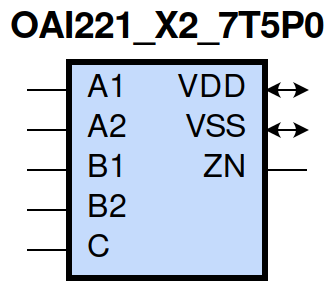
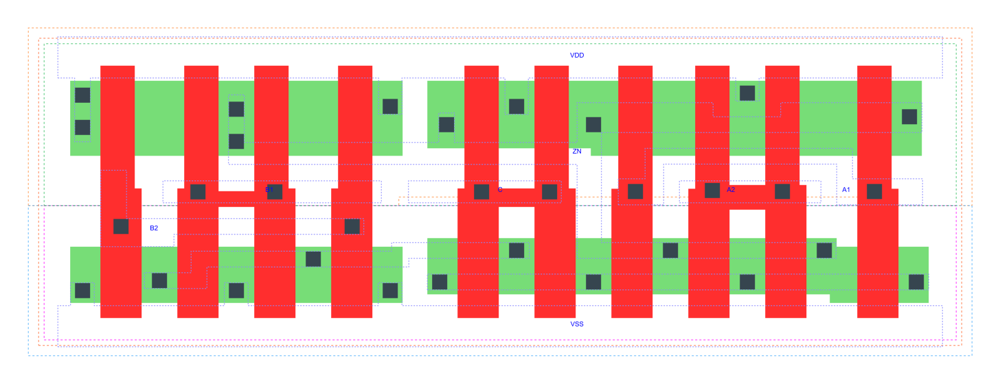

=======================================
gf180mcu_fd_sc_mcu7t5v0__oai221_x2
=======================================

**gf180mcu_fd_sc_mcu7t5v0__oai221_x2 symbol**

**gf180mcu_fd_sc_mcu7t5v0__oai221_x2 schematic**

.. image:: sc7_sch/OAI221_X2_sch.png
    :height: 300px
    :width: 500 px
    :align: center
    :alt: gf180mcu_fd_sc_mcu7t5v0__oai221_x2 schematic

**gf180mcu_fd_sc_mcu7t5v0__oai221_x2 layout**

.. include:: images.rst

OAI221_X2 is a two 2-input OR into 3-input NAND, NAND[OR(A1,A2),OR(B1,B2),C], 2X drive strength

|
| Attributes

============= ======================
**Attribute** **Value**
area          50.489600 µm\ :sup:`2`
============= ======================

|
| OUTPUT FUNCTIONS

============== ==================================
**Output Pin** **Function**
ZN             (((!A1)&(!A2))|((!B1)&(!B2))|(!C))
============== ==================================

|
| TRUTH TABLE FOR ZN

====== ====== ====== ====== ===== ======
**A1** **A2** **B1** **B2** **C** **ZN**
0      0      ?      ?      ?     1
?      ?      0      0      ?     1
?      ?      ?      ?      0     1
1      ?      1      ?      1     0
1      ?      ?      1      1     0
?      1      1      ?      1     0
?      1      ?      1      1     0
====== ====== ====== ====== ===== ======

|
| FUNCTIONAL SCHEMATIC
| |image539|
| PIN CAPACITANCE (pf)

======= ======== ====================
**Pin** **Type** **Capacitance (pf)**
B2      input    0.0093
B1      input    0.0092
C       input    0.0084
A1      input    0.0096
A2      input    0.0087
======= ======== ====================

|
| DELAY AND OUTPUT TRANSITION TIME corresponding to min slew and load

+---------------+------------+--------------------+--------------+-------------------+----------------+---------------+
| **Input Pin** | **Output** | **When Condition** | **Tin (ns)** | **Out Load (pf)** | **Delay (ns)** | **Tout (ns)** |
+---------------+------------+--------------------+--------------+-------------------+----------------+---------------+
| B2(HL)        | ZN(LH)     | !A1&A2&!B1&C       | 0.0100       | 0.0010            | 0.3226         | 0.2760        |
+---------------+------------+--------------------+--------------+-------------------+----------------+---------------+
| B2(HL)        | ZN(LH)     | A1&!A2&!B1&C       | 0.0100       | 0.0010            | 0.3070         | 0.2253        |
+---------------+------------+--------------------+--------------+-------------------+----------------+---------------+
| B2(HL)        | ZN(LH)     | A1&A2&!B1&C        | 0.0100       | 0.0010            | 0.3368         | 0.2466        |
+---------------+------------+--------------------+--------------+-------------------+----------------+---------------+
| B2(LH)        | ZN(HL)     | !A1&A2&!B1&C       | 0.0100       | 0.0010            | 0.2162         | 0.1155        |
+---------------+------------+--------------------+--------------+-------------------+----------------+---------------+
| B2(LH)        | ZN(HL)     | A1&!A2&!B1&C       | 0.0100       | 0.0010            | 0.1831         | 0.0936        |
+---------------+------------+--------------------+--------------+-------------------+----------------+---------------+
| B2(LH)        | ZN(HL)     | A1&A2&!B1&C        | 0.0100       | 0.0010            | 0.1617         | 0.0932        |
+---------------+------------+--------------------+--------------+-------------------+----------------+---------------+
| B1(HL)        | ZN(LH)     | !A1&A2&!B2&C       | 0.0100       | 0.0010            | 0.2952         | 0.2761        |
+---------------+------------+--------------------+--------------+-------------------+----------------+---------------+
| B1(HL)        | ZN(LH)     | A1&!A2&!B2&C       | 0.0100       | 0.0010            | 0.2796         | 0.2257        |
+---------------+------------+--------------------+--------------+-------------------+----------------+---------------+
| B1(HL)        | ZN(LH)     | A1&A2&!B2&C        | 0.0100       | 0.0010            | 0.3097         | 0.2467        |
+---------------+------------+--------------------+--------------+-------------------+----------------+---------------+
| B1(LH)        | ZN(HL)     | !A1&A2&!B2&C       | 0.0100       | 0.0010            | 0.1864         | 0.0940        |
+---------------+------------+--------------------+--------------+-------------------+----------------+---------------+
| B1(LH)        | ZN(HL)     | A1&!A2&!B2&C       | 0.0100       | 0.0010            | 0.1551         | 0.0718        |
+---------------+------------+--------------------+--------------+-------------------+----------------+---------------+
| B1(LH)        | ZN(HL)     | A1&A2&!B2&C        | 0.0100       | 0.0010            | 0.1387         | 0.0742        |
+---------------+------------+--------------------+--------------+-------------------+----------------+---------------+
| C(HL)         | ZN(LH)     | !A1&A2&!B1&B2      | 0.0100       | 0.0010            | 0.1526         | 0.1570        |
+---------------+------------+--------------------+--------------+-------------------+----------------+---------------+
| C(HL)         | ZN(LH)     | !A1&A2&B1&!B2      | 0.0100       | 0.0010            | 0.1454         | 0.1283        |
+---------------+------------+--------------------+--------------+-------------------+----------------+---------------+
| C(HL)         | ZN(LH)     | !A1&A2&B1&B2       | 0.0100       | 0.0010            | 0.1446         | 0.1284        |
+---------------+------------+--------------------+--------------+-------------------+----------------+---------------+
| C(HL)         | ZN(LH)     | A1&!A2&!B1&B2      | 0.0100       | 0.0010            | 0.1456         | 0.1284        |
+---------------+------------+--------------------+--------------+-------------------+----------------+---------------+
| C(HL)         | ZN(LH)     | A1&!A2&B1&!B2      | 0.0100       | 0.0010            | 0.1392         | 0.1019        |
+---------------+------------+--------------------+--------------+-------------------+----------------+---------------+
| C(HL)         | ZN(LH)     | A1&!A2&B1&B2       | 0.0100       | 0.0010            | 0.1379         | 0.1019        |
+---------------+------------+--------------------+--------------+-------------------+----------------+---------------+
| C(HL)         | ZN(LH)     | A1&A2&!B1&B2       | 0.0100       | 0.0010            | 0.1619         | 0.1402        |
+---------------+------------+--------------------+--------------+-------------------+----------------+---------------+
| C(HL)         | ZN(LH)     | A1&A2&B1&!B2       | 0.0100       | 0.0010            | 0.1555         | 0.1138        |
+---------------+------------+--------------------+--------------+-------------------+----------------+---------------+
| C(HL)         | ZN(LH)     | A1&A2&B1&B2        | 0.0100       | 0.0010            | 0.1546         | 0.1138        |
+---------------+------------+--------------------+--------------+-------------------+----------------+---------------+
| C(LH)         | ZN(HL)     | !A1&A2&!B1&B2      | 0.0100       | 0.0010            | 0.1939         | 0.1155        |
+---------------+------------+--------------------+--------------+-------------------+----------------+---------------+
| C(LH)         | ZN(HL)     | !A1&A2&B1&!B2      | 0.0100       | 0.0010            | 0.1608         | 0.0937        |
+---------------+------------+--------------------+--------------+-------------------+----------------+---------------+
| C(LH)         | ZN(HL)     | !A1&A2&B1&B2       | 0.0100       | 0.0010            | 0.1396         | 0.0772        |
+---------------+------------+--------------------+--------------+-------------------+----------------+---------------+
| C(LH)         | ZN(HL)     | A1&!A2&!B1&B2      | 0.0100       | 0.0010            | 0.1608         | 0.0938        |
+---------------+------------+--------------------+--------------+-------------------+----------------+---------------+
| C(LH)         | ZN(HL)     | A1&!A2&B1&!B2      | 0.0100       | 0.0010            | 0.1297         | 0.0716        |
+---------------+------------+--------------------+--------------+-------------------+----------------+---------------+
| C(LH)         | ZN(HL)     | A1&!A2&B1&B2       | 0.0100       | 0.0010            | 0.1134         | 0.0590        |
+---------------+------------+--------------------+--------------+-------------------+----------------+---------------+
| C(LH)         | ZN(HL)     | A1&A2&!B1&B2       | 0.0100       | 0.0010            | 0.1392         | 0.0931        |
+---------------+------------+--------------------+--------------+-------------------+----------------+---------------+
| C(LH)         | ZN(HL)     | A1&A2&B1&!B2       | 0.0100       | 0.0010            | 0.1138         | 0.0741        |
+---------------+------------+--------------------+--------------+-------------------+----------------+---------------+
| C(LH)         | ZN(HL)     | A1&A2&B1&B2        | 0.0100       | 0.0010            | 0.0977         | 0.0572        |
+---------------+------------+--------------------+--------------+-------------------+----------------+---------------+
| A1(HL)        | ZN(LH)     | !A2&!B1&B2&C       | 0.0100       | 0.0010            | 0.1560         | 0.1581        |
+---------------+------------+--------------------+--------------+-------------------+----------------+---------------+
| A1(HL)        | ZN(LH)     | !A2&B1&!B2&C       | 0.0100       | 0.0010            | 0.1464         | 0.1142        |
+---------------+------------+--------------------+--------------+-------------------+----------------+---------------+
| A1(HL)        | ZN(LH)     | !A2&B1&B2&C        | 0.0100       | 0.0010            | 0.1463         | 0.1141        |
+---------------+------------+--------------------+--------------+-------------------+----------------+---------------+
| A1(LH)        | ZN(HL)     | !A2&!B1&B2&C       | 0.0100       | 0.0010            | 0.1187         | 0.0927        |
+---------------+------------+--------------------+--------------+-------------------+----------------+---------------+
| A1(LH)        | ZN(HL)     | !A2&B1&!B2&C       | 0.0100       | 0.0010            | 0.0881         | 0.0696        |
+---------------+------------+--------------------+--------------+-------------------+----------------+---------------+
| A1(LH)        | ZN(HL)     | !A2&B1&B2&C        | 0.0100       | 0.0010            | 0.0816         | 0.0583        |
+---------------+------------+--------------------+--------------+-------------------+----------------+---------------+
| A2(HL)        | ZN(LH)     | !A1&!B1&B2&C       | 0.0100       | 0.0010            | 0.1837         | 0.1582        |
+---------------+------------+--------------------+--------------+-------------------+----------------+---------------+
| A2(HL)        | ZN(LH)     | !A1&B1&!B2&C       | 0.0100       | 0.0010            | 0.1740         | 0.1143        |
+---------------+------------+--------------------+--------------+-------------------+----------------+---------------+
| A2(HL)        | ZN(LH)     | !A1&B1&B2&C        | 0.0100       | 0.0010            | 0.1739         | 0.1143        |
+---------------+------------+--------------------+--------------+-------------------+----------------+---------------+
| A2(LH)        | ZN(HL)     | !A1&!B1&B2&C       | 0.0100       | 0.0010            | 0.1491         | 0.1154        |
+---------------+------------+--------------------+--------------+-------------------+----------------+---------------+
| A2(LH)        | ZN(HL)     | !A1&B1&!B2&C       | 0.0100       | 0.0010            | 0.1160         | 0.0931        |
+---------------+------------+--------------------+--------------+-------------------+----------------+---------------+
| A2(LH)        | ZN(HL)     | !A1&B1&B2&C        | 0.0100       | 0.0010            | 0.1052         | 0.0775        |
+---------------+------------+--------------------+--------------+-------------------+----------------+---------------+

|
| DYNAMIC ENERGY

+---------------+--------------------+--------------+------------+-------------------+---------------------+
| **Input Pin** | **When Condition** | **Tin (ns)** | **Output** | **Out Load (pf)** | **Energy (uW/MHz)** |
+---------------+--------------------+--------------+------------+-------------------+---------------------+
| C             | !A1&A2&!B1&B2      | 0.0100       | ZN(LH)     | 0.0010            | 0.5619              |
+---------------+--------------------+--------------+------------+-------------------+---------------------+
| C             | !A1&A2&B1&!B2      | 0.0100       | ZN(LH)     | 0.0010            | 0.5081              |
+---------------+--------------------+--------------+------------+-------------------+---------------------+
| C             | !A1&A2&B1&B2       | 0.0100       | ZN(LH)     | 0.0010            | 0.5058              |
+---------------+--------------------+--------------+------------+-------------------+---------------------+
| C             | A1&!A2&!B1&B2      | 0.0100       | ZN(LH)     | 0.0010            | 0.5084              |
+---------------+--------------------+--------------+------------+-------------------+---------------------+
| C             | A1&!A2&B1&!B2      | 0.0100       | ZN(LH)     | 0.0010            | 0.4544              |
+---------------+--------------------+--------------+------------+-------------------+---------------------+
| C             | A1&!A2&B1&B2       | 0.0100       | ZN(LH)     | 0.0010            | 0.4525              |
+---------------+--------------------+--------------+------------+-------------------+---------------------+
| C             | A1&A2&!B1&B2       | 0.0100       | ZN(LH)     | 0.0010            | 0.5536              |
+---------------+--------------------+--------------+------------+-------------------+---------------------+
| C             | A1&A2&B1&!B2       | 0.0100       | ZN(LH)     | 0.0010            | 0.5000              |
+---------------+--------------------+--------------+------------+-------------------+---------------------+
| C             | A1&A2&B1&B2        | 0.0100       | ZN(LH)     | 0.0010            | 0.4969              |
+---------------+--------------------+--------------+------------+-------------------+---------------------+
| C             | !A1&A2&!B1&B2      | 0.0100       | ZN(HL)     | 0.0010            | 0.1566              |
+---------------+--------------------+--------------+------------+-------------------+---------------------+
| C             | !A1&A2&B1&!B2      | 0.0100       | ZN(HL)     | 0.0010            | 0.1051              |
+---------------+--------------------+--------------+------------+-------------------+---------------------+
| C             | !A1&A2&B1&B2       | 0.0100       | ZN(HL)     | 0.0010            | 0.1051              |
+---------------+--------------------+--------------+------------+-------------------+---------------------+
| C             | A1&!A2&!B1&B2      | 0.0100       | ZN(HL)     | 0.0010            | 0.1049              |
+---------------+--------------------+--------------+------------+-------------------+---------------------+
| C             | A1&!A2&B1&!B2      | 0.0100       | ZN(HL)     | 0.0010            | 0.0532              |
+---------------+--------------------+--------------+------------+-------------------+---------------------+
| C             | A1&!A2&B1&B2       | 0.0100       | ZN(HL)     | 0.0010            | 0.0532              |
+---------------+--------------------+--------------+------------+-------------------+---------------------+
| C             | A1&A2&!B1&B2       | 0.0100       | ZN(HL)     | 0.0010            | 0.1050              |
+---------------+--------------------+--------------+------------+-------------------+---------------------+
| C             | A1&A2&B1&!B2       | 0.0100       | ZN(HL)     | 0.0010            | 0.0532              |
+---------------+--------------------+--------------+------------+-------------------+---------------------+
| C             | A1&A2&B1&B2        | 0.0100       | ZN(HL)     | 0.0010            | 0.0531              |
+---------------+--------------------+--------------+------------+-------------------+---------------------+
| A1            | !A2&!B1&B2&C       | 0.0100       | ZN(LH)     | 0.0010            | 0.3504              |
+---------------+--------------------+--------------+------------+-------------------+---------------------+
| A1            | !A2&B1&!B2&C       | 0.0100       | ZN(LH)     | 0.0010            | 0.2966              |
+---------------+--------------------+--------------+------------+-------------------+---------------------+
| A1            | !A2&B1&B2&C        | 0.0100       | ZN(LH)     | 0.0010            | 0.2964              |
+---------------+--------------------+--------------+------------+-------------------+---------------------+
| B2            | !A1&A2&!B1&C       | 0.0100       | ZN(LH)     | 0.0010            | 0.7010              |
+---------------+--------------------+--------------+------------+-------------------+---------------------+
| B2            | A1&!A2&!B1&C       | 0.0100       | ZN(LH)     | 0.0010            | 0.6471              |
+---------------+--------------------+--------------+------------+-------------------+---------------------+
| B2            | A1&A2&!B1&C        | 0.0100       | ZN(LH)     | 0.0010            | 0.6910              |
+---------------+--------------------+--------------+------------+-------------------+---------------------+
| B1            | !A1&A2&!B2&C       | 0.0100       | ZN(LH)     | 0.0010            | 0.6470              |
+---------------+--------------------+--------------+------------+-------------------+---------------------+
| B1            | A1&!A2&!B2&C       | 0.0100       | ZN(LH)     | 0.0010            | 0.5930              |
+---------------+--------------------+--------------+------------+-------------------+---------------------+
| B1            | A1&A2&!B2&C        | 0.0100       | ZN(LH)     | 0.0010            | 0.6371              |
+---------------+--------------------+--------------+------------+-------------------+---------------------+
| A2            | !A1&!B1&B2&C       | 0.0100       | ZN(LH)     | 0.0010            | 0.4047              |
+---------------+--------------------+--------------+------------+-------------------+---------------------+
| A2            | !A1&B1&!B2&C       | 0.0100       | ZN(LH)     | 0.0010            | 0.3508              |
+---------------+--------------------+--------------+------------+-------------------+---------------------+
| A2            | !A1&B1&B2&C        | 0.0100       | ZN(LH)     | 0.0010            | 0.3506              |
+---------------+--------------------+--------------+------------+-------------------+---------------------+
| B1            | !A1&A2&!B2&C       | 0.0100       | ZN(HL)     | 0.0010            | 0.1054              |
+---------------+--------------------+--------------+------------+-------------------+---------------------+
| B1            | A1&!A2&!B2&C       | 0.0100       | ZN(HL)     | 0.0010            | 0.0533              |
+---------------+--------------------+--------------+------------+-------------------+---------------------+
| B1            | A1&A2&!B2&C        | 0.0100       | ZN(HL)     | 0.0010            | 0.0532              |
+---------------+--------------------+--------------+------------+-------------------+---------------------+
| A1            | !A2&!B1&B2&C       | 0.0100       | ZN(HL)     | 0.0010            | 0.1053              |
+---------------+--------------------+--------------+------------+-------------------+---------------------+
| A1            | !A2&B1&!B2&C       | 0.0100       | ZN(HL)     | 0.0010            | 0.0536              |
+---------------+--------------------+--------------+------------+-------------------+---------------------+
| A1            | !A2&B1&B2&C        | 0.0100       | ZN(HL)     | 0.0010            | 0.0535              |
+---------------+--------------------+--------------+------------+-------------------+---------------------+
| B2            | !A1&A2&!B1&C       | 0.0100       | ZN(HL)     | 0.0010            | 0.1503              |
+---------------+--------------------+--------------+------------+-------------------+---------------------+
| B2            | A1&!A2&!B1&C       | 0.0100       | ZN(HL)     | 0.0010            | 0.0987              |
+---------------+--------------------+--------------+------------+-------------------+---------------------+
| B2            | A1&A2&!B1&C        | 0.0100       | ZN(HL)     | 0.0010            | 0.0988              |
+---------------+--------------------+--------------+------------+-------------------+---------------------+
| A2            | !A1&!B1&B2&C       | 0.0100       | ZN(HL)     | 0.0010            | 0.1509              |
+---------------+--------------------+--------------+------------+-------------------+---------------------+
| A2            | !A1&B1&!B2&C       | 0.0100       | ZN(HL)     | 0.0010            | 0.0996              |
+---------------+--------------------+--------------+------------+-------------------+---------------------+
| A2            | !A1&B1&B2&C        | 0.0100       | ZN(HL)     | 0.0010            | 0.0995              |
+---------------+--------------------+--------------+------------+-------------------+---------------------+
| A1(LH)        | !A2&!B1&!B2&!C     | 0.0100       | n/a        | n/a               | 0.0316              |
+---------------+--------------------+--------------+------------+-------------------+---------------------+
| A1(LH)        | !A2&!B1&!B2&C      | 0.0100       | n/a        | n/a               | 0.1708              |
+---------------+--------------------+--------------+------------+-------------------+---------------------+
| A1(LH)        | !A2&!B1&B2&!C      | 0.0100       | n/a        | n/a               | 0.0316              |
+---------------+--------------------+--------------+------------+-------------------+---------------------+
| A1(LH)        | !A2&B1&!B2&!C      | 0.0100       | n/a        | n/a               | 0.0316              |
+---------------+--------------------+--------------+------------+-------------------+---------------------+
| A1(LH)        | !A2&B1&B2&!C       | 0.0100       | n/a        | n/a               | 0.0316              |
+---------------+--------------------+--------------+------------+-------------------+---------------------+
| A1(LH)        | A2&!B1&!B2&!C      | 0.0100       | n/a        | n/a               | -0.0780             |
+---------------+--------------------+--------------+------------+-------------------+---------------------+
| A1(LH)        | A2&!B1&!B2&C       | 0.0100       | n/a        | n/a               | -0.0778             |
+---------------+--------------------+--------------+------------+-------------------+---------------------+
| A1(LH)        | A2&!B1&B2&!C       | 0.0100       | n/a        | n/a               | -0.0779             |
+---------------+--------------------+--------------+------------+-------------------+---------------------+
| A1(LH)        | A2&B1&!B2&!C       | 0.0100       | n/a        | n/a               | -0.0779             |
+---------------+--------------------+--------------+------------+-------------------+---------------------+
| A1(LH)        | A2&B1&B2&!C        | 0.0100       | n/a        | n/a               | -0.0779             |
+---------------+--------------------+--------------+------------+-------------------+---------------------+
| A1(LH)        | A2&!B1&B2&C        | 0.0100       | n/a        | n/a               | -0.0202             |
+---------------+--------------------+--------------+------------+-------------------+---------------------+
| A1(LH)        | A2&B1&!B2&C        | 0.0100       | n/a        | n/a               | -0.0202             |
+---------------+--------------------+--------------+------------+-------------------+---------------------+
| A1(LH)        | A2&B1&B2&C         | 0.0100       | n/a        | n/a               | -0.0202             |
+---------------+--------------------+--------------+------------+-------------------+---------------------+
| C(HL)         | !A1&!A2&!B1&!B2    | 0.0100       | n/a        | n/a               | 0.0889              |
+---------------+--------------------+--------------+------------+-------------------+---------------------+
| C(HL)         | !A1&!A2&!B1&B2     | 0.0100       | n/a        | n/a               | 0.0795              |
+---------------+--------------------+--------------+------------+-------------------+---------------------+
| C(HL)         | !A1&!A2&B1&!B2     | 0.0100       | n/a        | n/a               | 0.0795              |
+---------------+--------------------+--------------+------------+-------------------+---------------------+
| C(HL)         | !A1&!A2&B1&B2      | 0.0100       | n/a        | n/a               | 0.0774              |
+---------------+--------------------+--------------+------------+-------------------+---------------------+
| C(HL)         | !A1&A2&!B1&!B2     | 0.0100       | n/a        | n/a               | 0.0682              |
+---------------+--------------------+--------------+------------+-------------------+---------------------+
| C(HL)         | A1&!A2&!B1&!B2     | 0.0100       | n/a        | n/a               | 0.0682              |
+---------------+--------------------+--------------+------------+-------------------+---------------------+
| C(HL)         | A1&A2&!B1&!B2      | 0.0100       | n/a        | n/a               | 0.0681              |
+---------------+--------------------+--------------+------------+-------------------+---------------------+
| B2(LH)        | !A1&!A2&!B1&!C     | 0.0100       | n/a        | n/a               | -0.0703             |
+---------------+--------------------+--------------+------------+-------------------+---------------------+
| B2(LH)        | !A1&!A2&!B1&C      | 0.0100       | n/a        | n/a               | -0.0704             |
+---------------+--------------------+--------------+------------+-------------------+---------------------+
| B2(LH)        | !A1&!A2&B1&!C      | 0.0100       | n/a        | n/a               | -0.0680             |
+---------------+--------------------+--------------+------------+-------------------+---------------------+
| B2(LH)        | !A1&!A2&B1&C       | 0.0100       | n/a        | n/a               | -0.0680             |
+---------------+--------------------+--------------+------------+-------------------+---------------------+
| B2(LH)        | !A1&A2&!B1&!C      | 0.0100       | n/a        | n/a               | -0.0704             |
+---------------+--------------------+--------------+------------+-------------------+---------------------+
| B2(LH)        | !A1&A2&B1&!C       | 0.0100       | n/a        | n/a               | -0.0680             |
+---------------+--------------------+--------------+------------+-------------------+---------------------+
| B2(LH)        | A1&!A2&!B1&!C      | 0.0100       | n/a        | n/a               | -0.0703             |
+---------------+--------------------+--------------+------------+-------------------+---------------------+
| B2(LH)        | A1&!A2&B1&!C       | 0.0100       | n/a        | n/a               | -0.0680             |
+---------------+--------------------+--------------+------------+-------------------+---------------------+
| B2(LH)        | A1&A2&!B1&!C       | 0.0100       | n/a        | n/a               | -0.0704             |
+---------------+--------------------+--------------+------------+-------------------+---------------------+
| B2(LH)        | A1&A2&B1&!C        | 0.0100       | n/a        | n/a               | -0.0680             |
+---------------+--------------------+--------------+------------+-------------------+---------------------+
| B2(LH)        | !A1&A2&B1&C        | 0.0100       | n/a        | n/a               | -0.0586             |
+---------------+--------------------+--------------+------------+-------------------+---------------------+
| B2(LH)        | A1&!A2&B1&C        | 0.0100       | n/a        | n/a               | -0.0586             |
+---------------+--------------------+--------------+------------+-------------------+---------------------+
| B2(LH)        | A1&A2&B1&C         | 0.0100       | n/a        | n/a               | -0.0586             |
+---------------+--------------------+--------------+------------+-------------------+---------------------+
| A2(HL)        | !A1&!B1&!B2&!C     | 0.0100       | n/a        | n/a               | 0.0795              |
+---------------+--------------------+--------------+------------+-------------------+---------------------+
| A2(HL)        | !A1&!B1&!B2&C      | 0.0100       | n/a        | n/a               | 0.0796              |
+---------------+--------------------+--------------+------------+-------------------+---------------------+
| A2(HL)        | !A1&!B1&B2&!C      | 0.0100       | n/a        | n/a               | 0.0795              |
+---------------+--------------------+--------------+------------+-------------------+---------------------+
| A2(HL)        | !A1&B1&!B2&!C      | 0.0100       | n/a        | n/a               | 0.0795              |
+---------------+--------------------+--------------+------------+-------------------+---------------------+
| A2(HL)        | !A1&B1&B2&!C       | 0.0100       | n/a        | n/a               | 0.0795              |
+---------------+--------------------+--------------+------------+-------------------+---------------------+
| A2(HL)        | A1&!B1&!B2&!C      | 0.0100       | n/a        | n/a               | 0.0826              |
+---------------+--------------------+--------------+------------+-------------------+---------------------+
| A2(HL)        | A1&!B1&!B2&C       | 0.0100       | n/a        | n/a               | 0.0827              |
+---------------+--------------------+--------------+------------+-------------------+---------------------+
| A2(HL)        | A1&!B1&B2&!C       | 0.0100       | n/a        | n/a               | 0.0826              |
+---------------+--------------------+--------------+------------+-------------------+---------------------+
| A2(HL)        | A1&B1&!B2&!C       | 0.0100       | n/a        | n/a               | 0.0826              |
+---------------+--------------------+--------------+------------+-------------------+---------------------+
| A2(HL)        | A1&B1&B2&!C        | 0.0100       | n/a        | n/a               | 0.0826              |
+---------------+--------------------+--------------+------------+-------------------+---------------------+
| A2(HL)        | A1&!B1&B2&C        | 0.0100       | n/a        | n/a               | 0.0702              |
+---------------+--------------------+--------------+------------+-------------------+---------------------+
| A2(HL)        | A1&B1&!B2&C        | 0.0100       | n/a        | n/a               | 0.0702              |
+---------------+--------------------+--------------+------------+-------------------+---------------------+
| A2(HL)        | A1&B1&B2&C         | 0.0100       | n/a        | n/a               | 0.0702              |
+---------------+--------------------+--------------+------------+-------------------+---------------------+
| B1(HL)        | !A1&!A2&!B2&!C     | 0.0100       | n/a        | n/a               | 0.0710              |
+---------------+--------------------+--------------+------------+-------------------+---------------------+
| B1(HL)        | !A1&!A2&!B2&C      | 0.0100       | n/a        | n/a               | 0.0719              |
+---------------+--------------------+--------------+------------+-------------------+---------------------+
| B1(HL)        | !A1&!A2&B2&!C      | 0.0100       | n/a        | n/a               | 0.0707              |
+---------------+--------------------+--------------+------------+-------------------+---------------------+
| B1(HL)        | !A1&!A2&B2&C       | 0.0100       | n/a        | n/a               | 0.0708              |
+---------------+--------------------+--------------+------------+-------------------+---------------------+
| B1(HL)        | !A1&A2&!B2&!C      | 0.0100       | n/a        | n/a               | 0.0724              |
+---------------+--------------------+--------------+------------+-------------------+---------------------+
| B1(HL)        | !A1&A2&B2&!C       | 0.0100       | n/a        | n/a               | 0.0708              |
+---------------+--------------------+--------------+------------+-------------------+---------------------+
| B1(HL)        | A1&!A2&!B2&!C      | 0.0100       | n/a        | n/a               | 0.0724              |
+---------------+--------------------+--------------+------------+-------------------+---------------------+
| B1(HL)        | A1&!A2&B2&!C       | 0.0100       | n/a        | n/a               | 0.0708              |
+---------------+--------------------+--------------+------------+-------------------+---------------------+
| B1(HL)        | A1&A2&!B2&!C       | 0.0100       | n/a        | n/a               | 0.0723              |
+---------------+--------------------+--------------+------------+-------------------+---------------------+
| B1(HL)        | A1&A2&B2&!C        | 0.0100       | n/a        | n/a               | 0.0707              |
+---------------+--------------------+--------------+------------+-------------------+---------------------+
| B1(HL)        | !A1&A2&B2&C        | 0.0100       | n/a        | n/a               | 0.0546              |
+---------------+--------------------+--------------+------------+-------------------+---------------------+
| B1(HL)        | A1&!A2&B2&C        | 0.0100       | n/a        | n/a               | 0.0545              |
+---------------+--------------------+--------------+------------+-------------------+---------------------+
| B1(HL)        | A1&A2&B2&C         | 0.0100       | n/a        | n/a               | 0.0545              |
+---------------+--------------------+--------------+------------+-------------------+---------------------+
| B2(HL)        | !A1&!A2&!B1&!C     | 0.0100       | n/a        | n/a               | 0.0706              |
+---------------+--------------------+--------------+------------+-------------------+---------------------+
| B2(HL)        | !A1&!A2&!B1&C      | 0.0100       | n/a        | n/a               | 0.0716              |
+---------------+--------------------+--------------+------------+-------------------+---------------------+
| B2(HL)        | !A1&!A2&B1&!C      | 0.0100       | n/a        | n/a               | 0.0704              |
+---------------+--------------------+--------------+------------+-------------------+---------------------+
| B2(HL)        | !A1&!A2&B1&C       | 0.0100       | n/a        | n/a               | 0.0704              |
+---------------+--------------------+--------------+------------+-------------------+---------------------+
| B2(HL)        | !A1&A2&!B1&!C      | 0.0100       | n/a        | n/a               | 0.0720              |
+---------------+--------------------+--------------+------------+-------------------+---------------------+
| B2(HL)        | !A1&A2&B1&!C       | 0.0100       | n/a        | n/a               | 0.0704              |
+---------------+--------------------+--------------+------------+-------------------+---------------------+
| B2(HL)        | A1&!A2&!B1&!C      | 0.0100       | n/a        | n/a               | 0.0720              |
+---------------+--------------------+--------------+------------+-------------------+---------------------+
| B2(HL)        | A1&!A2&B1&!C       | 0.0100       | n/a        | n/a               | 0.0704              |
+---------------+--------------------+--------------+------------+-------------------+---------------------+
| B2(HL)        | A1&A2&!B1&!C       | 0.0100       | n/a        | n/a               | 0.0719              |
+---------------+--------------------+--------------+------------+-------------------+---------------------+
| B2(HL)        | A1&A2&B1&!C        | 0.0100       | n/a        | n/a               | 0.0704              |
+---------------+--------------------+--------------+------------+-------------------+---------------------+
| B2(HL)        | !A1&A2&B1&C        | 0.0100       | n/a        | n/a               | 0.0704              |
+---------------+--------------------+--------------+------------+-------------------+---------------------+
| B2(HL)        | A1&!A2&B1&C        | 0.0100       | n/a        | n/a               | 0.0704              |
+---------------+--------------------+--------------+------------+-------------------+---------------------+
| B2(HL)        | A1&A2&B1&C         | 0.0100       | n/a        | n/a               | 0.0704              |
+---------------+--------------------+--------------+------------+-------------------+---------------------+
| A1(HL)        | !A2&!B1&!B2&!C     | 0.0100       | n/a        | n/a               | 0.0800              |
+---------------+--------------------+--------------+------------+-------------------+---------------------+
| A1(HL)        | !A2&!B1&!B2&C      | 0.0100       | n/a        | n/a               | 0.0800              |
+---------------+--------------------+--------------+------------+-------------------+---------------------+
| A1(HL)        | !A2&!B1&B2&!C      | 0.0100       | n/a        | n/a               | 0.0800              |
+---------------+--------------------+--------------+------------+-------------------+---------------------+
| A1(HL)        | !A2&B1&!B2&!C      | 0.0100       | n/a        | n/a               | 0.0800              |
+---------------+--------------------+--------------+------------+-------------------+---------------------+
| A1(HL)        | !A2&B1&B2&!C       | 0.0100       | n/a        | n/a               | 0.0800              |
+---------------+--------------------+--------------+------------+-------------------+---------------------+
| A1(HL)        | A2&!B1&!B2&!C      | 0.0100       | n/a        | n/a               | 0.0829              |
+---------------+--------------------+--------------+------------+-------------------+---------------------+
| A1(HL)        | A2&!B1&!B2&C       | 0.0100       | n/a        | n/a               | 0.0829              |
+---------------+--------------------+--------------+------------+-------------------+---------------------+
| A1(HL)        | A2&!B1&B2&!C       | 0.0100       | n/a        | n/a               | 0.0830              |
+---------------+--------------------+--------------+------------+-------------------+---------------------+
| A1(HL)        | A2&B1&!B2&!C       | 0.0100       | n/a        | n/a               | 0.0829              |
+---------------+--------------------+--------------+------------+-------------------+---------------------+
| A1(HL)        | A2&B1&B2&!C        | 0.0100       | n/a        | n/a               | 0.0829              |
+---------------+--------------------+--------------+------------+-------------------+---------------------+
| A1(HL)        | A2&!B1&B2&C        | 0.0100       | n/a        | n/a               | 0.0549              |
+---------------+--------------------+--------------+------------+-------------------+---------------------+
| A1(HL)        | A2&B1&!B2&C        | 0.0100       | n/a        | n/a               | 0.0549              |
+---------------+--------------------+--------------+------------+-------------------+---------------------+
| A1(HL)        | A2&B1&B2&C         | 0.0100       | n/a        | n/a               | 0.0549              |
+---------------+--------------------+--------------+------------+-------------------+---------------------+
| B1(LH)        | !A1&!A2&!B2&!C     | 0.0100       | n/a        | n/a               | -0.0709             |
+---------------+--------------------+--------------+------------+-------------------+---------------------+
| B1(LH)        | !A1&!A2&!B2&C      | 0.0100       | n/a        | n/a               | -0.0710             |
+---------------+--------------------+--------------+------------+-------------------+---------------------+
| B1(LH)        | !A1&!A2&B2&!C      | 0.0100       | n/a        | n/a               | -0.0689             |
+---------------+--------------------+--------------+------------+-------------------+---------------------+
| B1(LH)        | !A1&!A2&B2&C       | 0.0100       | n/a        | n/a               | -0.0687             |
+---------------+--------------------+--------------+------------+-------------------+---------------------+
| B1(LH)        | !A1&A2&!B2&!C      | 0.0100       | n/a        | n/a               | -0.0709             |
+---------------+--------------------+--------------+------------+-------------------+---------------------+
| B1(LH)        | !A1&A2&B2&!C       | 0.0100       | n/a        | n/a               | -0.0688             |
+---------------+--------------------+--------------+------------+-------------------+---------------------+
| B1(LH)        | A1&!A2&!B2&!C      | 0.0100       | n/a        | n/a               | -0.0709             |
+---------------+--------------------+--------------+------------+-------------------+---------------------+
| B1(LH)        | A1&!A2&B2&!C       | 0.0100       | n/a        | n/a               | -0.0688             |
+---------------+--------------------+--------------+------------+-------------------+---------------------+
| B1(LH)        | A1&A2&!B2&!C       | 0.0100       | n/a        | n/a               | -0.0709             |
+---------------+--------------------+--------------+------------+-------------------+---------------------+
| B1(LH)        | A1&A2&B2&!C        | 0.0100       | n/a        | n/a               | -0.0688             |
+---------------+--------------------+--------------+------------+-------------------+---------------------+
| B1(LH)        | !A1&A2&B2&C        | 0.0100       | n/a        | n/a               | -0.0202             |
+---------------+--------------------+--------------+------------+-------------------+---------------------+
| B1(LH)        | A1&!A2&B2&C        | 0.0100       | n/a        | n/a               | -0.0202             |
+---------------+--------------------+--------------+------------+-------------------+---------------------+
| B1(LH)        | A1&A2&B2&C         | 0.0100       | n/a        | n/a               | -0.0202             |
+---------------+--------------------+--------------+------------+-------------------+---------------------+
| C(LH)         | !A1&!A2&!B1&!B2    | 0.0100       | n/a        | n/a               | -0.0637             |
+---------------+--------------------+--------------+------------+-------------------+---------------------+
| C(LH)         | !A1&!A2&!B1&B2     | 0.0100       | n/a        | n/a               | -0.0635             |
+---------------+--------------------+--------------+------------+-------------------+---------------------+
| C(LH)         | !A1&!A2&B1&!B2     | 0.0100       | n/a        | n/a               | -0.0635             |
+---------------+--------------------+--------------+------------+-------------------+---------------------+
| C(LH)         | !A1&!A2&B1&B2      | 0.0100       | n/a        | n/a               | -0.0635             |
+---------------+--------------------+--------------+------------+-------------------+---------------------+
| C(LH)         | !A1&A2&!B1&!B2     | 0.0100       | n/a        | n/a               | 0.0079              |
+---------------+--------------------+--------------+------------+-------------------+---------------------+
| C(LH)         | A1&!A2&!B1&!B2     | 0.0100       | n/a        | n/a               | 0.0079              |
+---------------+--------------------+--------------+------------+-------------------+---------------------+
| C(LH)         | A1&A2&!B1&!B2      | 0.0100       | n/a        | n/a               | 0.0080              |
+---------------+--------------------+--------------+------------+-------------------+---------------------+
| A2(LH)        | !A1&!B1&!B2&!C     | 0.0100       | n/a        | n/a               | 0.0323              |
+---------------+--------------------+--------------+------------+-------------------+---------------------+
| A2(LH)        | !A1&!B1&!B2&C      | 0.0100       | n/a        | n/a               | 0.1716              |
+---------------+--------------------+--------------+------------+-------------------+---------------------+
| A2(LH)        | !A1&!B1&B2&!C      | 0.0100       | n/a        | n/a               | 0.0323              |
+---------------+--------------------+--------------+------------+-------------------+---------------------+
| A2(LH)        | !A1&B1&!B2&!C      | 0.0100       | n/a        | n/a               | 0.0323              |
+---------------+--------------------+--------------+------------+-------------------+---------------------+
| A2(LH)        | !A1&B1&B2&!C       | 0.0100       | n/a        | n/a               | 0.0323              |
+---------------+--------------------+--------------+------------+-------------------+---------------------+
| A2(LH)        | A1&!B1&!B2&!C      | 0.0100       | n/a        | n/a               | -0.0771             |
+---------------+--------------------+--------------+------------+-------------------+---------------------+
| A2(LH)        | A1&!B1&!B2&C       | 0.0100       | n/a        | n/a               | -0.0770             |
+---------------+--------------------+--------------+------------+-------------------+---------------------+
| A2(LH)        | A1&!B1&B2&!C       | 0.0100       | n/a        | n/a               | -0.0770             |
+---------------+--------------------+--------------+------------+-------------------+---------------------+
| A2(LH)        | A1&B1&!B2&!C       | 0.0100       | n/a        | n/a               | -0.0770             |
+---------------+--------------------+--------------+------------+-------------------+---------------------+
| A2(LH)        | A1&B1&B2&!C        | 0.0100       | n/a        | n/a               | -0.0770             |
+---------------+--------------------+--------------+------------+-------------------+---------------------+
| A2(LH)        | A1&!B1&B2&C        | 0.0100       | n/a        | n/a               | -0.0586             |
+---------------+--------------------+--------------+------------+-------------------+---------------------+
| A2(LH)        | A1&B1&!B2&C        | 0.0100       | n/a        | n/a               | -0.0586             |
+---------------+--------------------+--------------+------------+-------------------+---------------------+
| A2(LH)        | A1&B1&B2&C         | 0.0100       | n/a        | n/a               | -0.0586             |
+---------------+--------------------+--------------+------------+-------------------+---------------------+

|
| LEAKAGE POWER

================== ==============
**When Condition** **Power (nW)**
!A1&!A2&!B1&!B2&!C 0.1508
!A1&!A2&!B1&!B2&C  0.1510
!A1&!A2&!B1&B2&!C  0.1508
!A1&!A2&!B1&B2&C   0.1518
!A1&!A2&B1&!B2&!C  0.1508
!A1&!A2&B1&!B2&C   0.1518
!A1&!A2&B1&B2&!C   0.1508
!A1&!A2&B1&B2&C    0.1518
!A1&A2&!B1&!B2&!C  0.2701
!A1&A2&!B1&!B2&C   0.3880
!A1&A2&!B1&B2&!C   0.2704
!A1&A2&B1&!B2&!C   0.2704
!A1&A2&B1&B2&!C    0.2704
A1&!A2&!B1&!B2&!C  0.2701
A1&!A2&!B1&!B2&C   0.3880
A1&!A2&!B1&B2&!C   0.2704
A1&!A2&B1&!B2&!C   0.2704
A1&!A2&B1&B2&!C    0.2704
A1&A2&!B1&!B2&!C   0.2707
A1&A2&!B1&!B2&C    0.3886
A1&A2&!B1&B2&!C    0.2710
A1&A2&B1&!B2&!C    0.2710
A1&A2&B1&B2&!C     0.2710
!A1&A2&!B1&B2&C    0.3511
!A1&A2&B1&!B2&C    0.2797
!A1&A2&B1&B2&C     0.2797
A1&!A2&!B1&B2&C    0.2797
A1&!A2&B1&!B2&C    0.2084
A1&!A2&B1&B2&C     0.2084
A1&A2&!B1&B2&C     0.2797
A1&A2&B1&!B2&C     0.2084
A1&A2&B1&B2&C      0.2084
================== ==============

