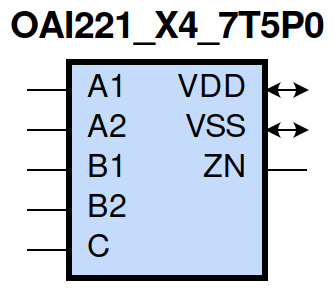
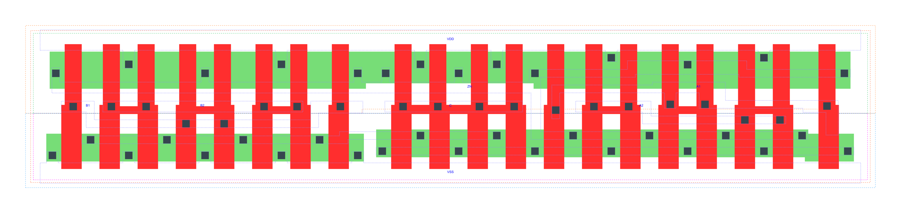

=======================================
gf180mcu_fd_sc_mcu7t5v0__oai221_x4
=======================================

**gf180mcu_fd_sc_mcu7t5v0__oai221_x4 symbol**

**gf180mcu_fd_sc_mcu7t5v0__oai221_x4 schematic**

.. image:: sc7_sch/OAI221_X4_sch.png
    :height: 300px
    :width: 500 px
    :align: center
    :alt: gf180mcu_fd_sc_mcu7t5v0__oai221_x4 schematic

**gf180mcu_fd_sc_mcu7t5v0__oai221_x4 layout**

.. include:: images.rst

OAI221_X4 is a two 2-input OR into 3-input NAND, NAND[OR(A1,A2),OR(B1,B2),C], 4X drive strength

|
| Attributes

============= ======================
**Attribute** **Value**
area          94.393600 µm\ :sup:`2`
============= ======================

|
| OUTPUT FUNCTIONS

============== ==================================
**Output Pin** **Function**
ZN             (((!A1)&(!A2))|((!B1)&(!B2))|(!C))
============== ==================================

|
| TRUTH TABLE FOR ZN

====== ====== ====== ====== ===== ======
**A1** **A2** **B1** **B2** **C** **ZN**
0      0      ?      ?      ?     1
?      ?      0      0      ?     1
?      ?      ?      ?      0     1
1      ?      1      ?      1     0
1      ?      ?      1      1     0
?      1      1      ?      1     0
?      1      ?      1      1     0
====== ====== ====== ====== ===== ======

|
| FUNCTIONAL SCHEMATIC
| |image542|
| PIN CAPACITANCE (pf)

======= ======== ====================
**Pin** **Type** **Capacitance (pf)**
B1      input    0.0191
B2      input    0.0178
C       input    0.0164
A1      input    0.0191
A2      input    0.0180
======= ======== ====================

|
| DELAY AND OUTPUT TRANSITION TIME corresponding to min slew and load

+---------------+------------+--------------------+--------------+-------------------+----------------+---------------+
| **Input Pin** | **Output** | **When Condition** | **Tin (ns)** | **Out Load (pf)** | **Delay (ns)** | **Tout (ns)** |
+---------------+------------+--------------------+--------------+-------------------+----------------+---------------+
| B1(HL)        | ZN(LH)     | !A1&A2&!B2&C       | 0.0100       | 0.0010            | 0.2878         | 0.2699        |
+---------------+------------+--------------------+--------------+-------------------+----------------+---------------+
| B1(HL)        | ZN(LH)     | A1&!A2&!B2&C       | 0.0100       | 0.0010            | 0.2723         | 0.2192        |
+---------------+------------+--------------------+--------------+-------------------+----------------+---------------+
| B1(HL)        | ZN(LH)     | A1&A2&!B2&C        | 0.0100       | 0.0010            | 0.3022         | 0.2405        |
+---------------+------------+--------------------+--------------+-------------------+----------------+---------------+
| B1(LH)        | ZN(HL)     | !A1&A2&!B2&C       | 0.0100       | 0.0010            | 0.1822         | 0.0913        |
+---------------+------------+--------------------+--------------+-------------------+----------------+---------------+
| B1(LH)        | ZN(HL)     | A1&!A2&!B2&C       | 0.0100       | 0.0010            | 0.1511         | 0.0691        |
+---------------+------------+--------------------+--------------+-------------------+----------------+---------------+
| B1(LH)        | ZN(HL)     | A1&A2&!B2&C        | 0.0100       | 0.0010            | 0.1354         | 0.0718        |
+---------------+------------+--------------------+--------------+-------------------+----------------+---------------+
| B2(HL)        | ZN(LH)     | !A1&A2&!B1&C       | 0.0100       | 0.0010            | 0.3149         | 0.2700        |
+---------------+------------+--------------------+--------------+-------------------+----------------+---------------+
| B2(HL)        | ZN(LH)     | A1&!A2&!B1&C       | 0.0100       | 0.0010            | 0.2994         | 0.2192        |
+---------------+------------+--------------------+--------------+-------------------+----------------+---------------+
| B2(HL)        | ZN(LH)     | A1&A2&!B1&C        | 0.0100       | 0.0010            | 0.3290         | 0.2404        |
+---------------+------------+--------------------+--------------+-------------------+----------------+---------------+
| B2(LH)        | ZN(HL)     | !A1&A2&!B1&C       | 0.0100       | 0.0010            | 0.2122         | 0.1127        |
+---------------+------------+--------------------+--------------+-------------------+----------------+---------------+
| B2(LH)        | ZN(HL)     | A1&!A2&!B1&C       | 0.0100       | 0.0010            | 0.1791         | 0.0909        |
+---------------+------------+--------------------+--------------+-------------------+----------------+---------------+
| B2(LH)        | ZN(HL)     | A1&A2&!B1&C        | 0.0100       | 0.0010            | 0.1584         | 0.0907        |
+---------------+------------+--------------------+--------------+-------------------+----------------+---------------+
| C(HL)         | ZN(LH)     | !A1&A2&!B1&B2      | 0.0100       | 0.0010            | 0.1558         | 0.1616        |
+---------------+------------+--------------------+--------------+-------------------+----------------+---------------+
| C(HL)         | ZN(LH)     | !A1&A2&B1&!B2      | 0.0100       | 0.0010            | 0.1482         | 0.1314        |
+---------------+------------+--------------------+--------------+-------------------+----------------+---------------+
| C(HL)         | ZN(LH)     | !A1&A2&B1&B2       | 0.0100       | 0.0010            | 0.1471         | 0.1314        |
+---------------+------------+--------------------+--------------+-------------------+----------------+---------------+
| C(HL)         | ZN(LH)     | A1&!A2&!B1&B2      | 0.0100       | 0.0010            | 0.1483         | 0.1311        |
+---------------+------------+--------------------+--------------+-------------------+----------------+---------------+
| C(HL)         | ZN(LH)     | A1&!A2&B1&!B2      | 0.0100       | 0.0010            | 0.1415         | 0.1034        |
+---------------+------------+--------------------+--------------+-------------------+----------------+---------------+
| C(HL)         | ZN(LH)     | A1&!A2&B1&B2       | 0.0100       | 0.0010            | 0.1403         | 0.1035        |
+---------------+------------+--------------------+--------------+-------------------+----------------+---------------+
| C(HL)         | ZN(LH)     | A1&A2&!B1&B2       | 0.0100       | 0.0010            | 0.1654         | 0.1434        |
+---------------+------------+--------------------+--------------+-------------------+----------------+---------------+
| C(HL)         | ZN(LH)     | A1&A2&B1&!B2       | 0.0100       | 0.0010            | 0.1588         | 0.1159        |
+---------------+------------+--------------------+--------------+-------------------+----------------+---------------+
| C(HL)         | ZN(LH)     | A1&A2&B1&B2        | 0.0100       | 0.0010            | 0.1575         | 0.1159        |
+---------------+------------+--------------------+--------------+-------------------+----------------+---------------+
| C(LH)         | ZN(HL)     | !A1&A2&!B1&B2      | 0.0100       | 0.0010            | 0.1890         | 0.1127        |
+---------------+------------+--------------------+--------------+-------------------+----------------+---------------+
| C(LH)         | ZN(HL)     | !A1&A2&B1&!B2      | 0.0100       | 0.0010            | 0.1561         | 0.0910        |
+---------------+------------+--------------------+--------------+-------------------+----------------+---------------+
| C(LH)         | ZN(HL)     | !A1&A2&B1&B2       | 0.0100       | 0.0010            | 0.1356         | 0.0754        |
+---------------+------------+--------------------+--------------+-------------------+----------------+---------------+
| C(LH)         | ZN(HL)     | A1&!A2&!B1&B2      | 0.0100       | 0.0010            | 0.1558         | 0.0908        |
+---------------+------------+--------------------+--------------+-------------------+----------------+---------------+
| C(LH)         | ZN(HL)     | A1&!A2&B1&!B2      | 0.0100       | 0.0010            | 0.1251         | 0.0693        |
+---------------+------------+--------------------+--------------+-------------------+----------------+---------------+
| C(LH)         | ZN(HL)     | A1&!A2&B1&B2       | 0.0100       | 0.0010            | 0.1096         | 0.0568        |
+---------------+------------+--------------------+--------------+-------------------+----------------+---------------+
| C(LH)         | ZN(HL)     | A1&A2&!B1&B2       | 0.0100       | 0.0010            | 0.1352         | 0.0907        |
+---------------+------------+--------------------+--------------+-------------------+----------------+---------------+
| C(LH)         | ZN(HL)     | A1&A2&B1&!B2       | 0.0100       | 0.0010            | 0.1099         | 0.0718        |
+---------------+------------+--------------------+--------------+-------------------+----------------+---------------+
| C(LH)         | ZN(HL)     | A1&A2&B1&B2        | 0.0100       | 0.0010            | 0.0946         | 0.0553        |
+---------------+------------+--------------------+--------------+-------------------+----------------+---------------+
| A1(HL)        | ZN(LH)     | !A2&!B1&B2&C       | 0.0100       | 0.0010            | 0.1509         | 0.1532        |
+---------------+------------+--------------------+--------------+-------------------+----------------+---------------+
| A1(HL)        | ZN(LH)     | !A2&B1&!B2&C       | 0.0100       | 0.0010            | 0.1413         | 0.1100        |
+---------------+------------+--------------------+--------------+-------------------+----------------+---------------+
| A1(HL)        | ZN(LH)     | !A2&B1&B2&C        | 0.0100       | 0.0010            | 0.1412         | 0.1099        |
+---------------+------------+--------------------+--------------+-------------------+----------------+---------------+
| A1(LH)        | ZN(HL)     | !A2&!B1&B2&C       | 0.0100       | 0.0010            | 0.1162         | 0.0901        |
+---------------+------------+--------------------+--------------+-------------------+----------------+---------------+
| A1(LH)        | ZN(HL)     | !A2&B1&!B2&C       | 0.0100       | 0.0010            | 0.0858         | 0.0669        |
+---------------+------------+--------------------+--------------+-------------------+----------------+---------------+
| A1(LH)        | ZN(HL)     | !A2&B1&B2&C        | 0.0100       | 0.0010            | 0.0795         | 0.0562        |
+---------------+------------+--------------------+--------------+-------------------+----------------+---------------+
| A2(HL)        | ZN(LH)     | !A1&!B1&B2&C       | 0.0100       | 0.0010            | 0.1785         | 0.1532        |
+---------------+------------+--------------------+--------------+-------------------+----------------+---------------+
| A2(HL)        | ZN(LH)     | !A1&B1&!B2&C       | 0.0100       | 0.0010            | 0.1690         | 0.1100        |
+---------------+------------+--------------------+--------------+-------------------+----------------+---------------+
| A2(HL)        | ZN(LH)     | !A1&B1&B2&C        | 0.0100       | 0.0010            | 0.1688         | 0.1101        |
+---------------+------------+--------------------+--------------+-------------------+----------------+---------------+
| A2(LH)        | ZN(HL)     | !A1&!B1&B2&C       | 0.0100       | 0.0010            | 0.1465         | 0.1127        |
+---------------+------------+--------------------+--------------+-------------------+----------------+---------------+
| A2(LH)        | ZN(HL)     | !A1&B1&!B2&C       | 0.0100       | 0.0010            | 0.1136         | 0.0905        |
+---------------+------------+--------------------+--------------+-------------------+----------------+---------------+
| A2(LH)        | ZN(HL)     | !A1&B1&B2&C        | 0.0100       | 0.0010            | 0.1030         | 0.0753        |
+---------------+------------+--------------------+--------------+-------------------+----------------+---------------+

|
| DYNAMIC ENERGY

+---------------+--------------------+--------------+------------+-------------------+---------------------+
| **Input Pin** | **When Condition** | **Tin (ns)** | **Output** | **Out Load (pf)** | **Energy (uW/MHz)** |
+---------------+--------------------+--------------+------------+-------------------+---------------------+
| C             | !A1&A2&!B1&B2      | 0.0100       | ZN(LH)     | 0.0010            | 1.1073              |
+---------------+--------------------+--------------+------------+-------------------+---------------------+
| C             | !A1&A2&B1&!B2      | 0.0100       | ZN(LH)     | 0.0010            | 1.0001              |
+---------------+--------------------+--------------+------------+-------------------+---------------------+
| C             | !A1&A2&B1&B2       | 0.0100       | ZN(LH)     | 0.0010            | 0.9954              |
+---------------+--------------------+--------------+------------+-------------------+---------------------+
| C             | A1&!A2&!B1&B2      | 0.0100       | ZN(LH)     | 0.0010            | 0.9999              |
+---------------+--------------------+--------------+------------+-------------------+---------------------+
| C             | A1&!A2&B1&!B2      | 0.0100       | ZN(LH)     | 0.0010            | 0.8921              |
+---------------+--------------------+--------------+------------+-------------------+---------------------+
| C             | A1&!A2&B1&B2       | 0.0100       | ZN(LH)     | 0.0010            | 0.8877              |
+---------------+--------------------+--------------+------------+-------------------+---------------------+
| C             | A1&A2&!B1&B2       | 0.0100       | ZN(LH)     | 0.0010            | 1.0902              |
+---------------+--------------------+--------------+------------+-------------------+---------------------+
| C             | A1&A2&B1&!B2       | 0.0100       | ZN(LH)     | 0.0010            | 0.9828              |
+---------------+--------------------+--------------+------------+-------------------+---------------------+
| C             | A1&A2&B1&B2        | 0.0100       | ZN(LH)     | 0.0010            | 0.9789              |
+---------------+--------------------+--------------+------------+-------------------+---------------------+
| C             | !A1&A2&!B1&B2      | 0.0100       | ZN(HL)     | 0.0010            | 0.3120              |
+---------------+--------------------+--------------+------------+-------------------+---------------------+
| C             | !A1&A2&B1&!B2      | 0.0100       | ZN(HL)     | 0.0010            | 0.2108              |
+---------------+--------------------+--------------+------------+-------------------+---------------------+
| C             | !A1&A2&B1&B2       | 0.0100       | ZN(HL)     | 0.0010            | 0.2109              |
+---------------+--------------------+--------------+------------+-------------------+---------------------+
| C             | A1&!A2&!B1&B2      | 0.0100       | ZN(HL)     | 0.0010            | 0.2088              |
+---------------+--------------------+--------------+------------+-------------------+---------------------+
| C             | A1&!A2&B1&!B2      | 0.0100       | ZN(HL)     | 0.0010            | 0.1075              |
+---------------+--------------------+--------------+------------+-------------------+---------------------+
| C             | A1&!A2&B1&B2       | 0.0100       | ZN(HL)     | 0.0010            | 0.1072              |
+---------------+--------------------+--------------+------------+-------------------+---------------------+
| C             | A1&A2&!B1&B2       | 0.0100       | ZN(HL)     | 0.0010            | 0.2090              |
+---------------+--------------------+--------------+------------+-------------------+---------------------+
| C             | A1&A2&B1&!B2       | 0.0100       | ZN(HL)     | 0.0010            | 0.1072              |
+---------------+--------------------+--------------+------------+-------------------+---------------------+
| C             | A1&A2&B1&B2        | 0.0100       | ZN(HL)     | 0.0010            | 0.1071              |
+---------------+--------------------+--------------+------------+-------------------+---------------------+
| A1            | !A2&!B1&B2&C       | 0.0100       | ZN(LH)     | 0.0010            | 0.7023              |
+---------------+--------------------+--------------+------------+-------------------+---------------------+
| A1            | !A2&B1&!B2&C       | 0.0100       | ZN(LH)     | 0.0010            | 0.5949              |
+---------------+--------------------+--------------+------------+-------------------+---------------------+
| A1            | !A2&B1&B2&C        | 0.0100       | ZN(LH)     | 0.0010            | 0.5943              |
+---------------+--------------------+--------------+------------+-------------------+---------------------+
| B2            | !A1&A2&!B1&C       | 0.0100       | ZN(LH)     | 0.0010            | 1.3922              |
+---------------+--------------------+--------------+------------+-------------------+---------------------+
| B2            | A1&!A2&!B1&C       | 0.0100       | ZN(LH)     | 0.0010            | 1.2848              |
+---------------+--------------------+--------------+------------+-------------------+---------------------+
| B2            | A1&A2&!B1&C        | 0.0100       | ZN(LH)     | 0.0010            | 1.3724              |
+---------------+--------------------+--------------+------------+-------------------+---------------------+
| B1            | !A1&A2&!B2&C       | 0.0100       | ZN(LH)     | 0.0010            | 1.2847              |
+---------------+--------------------+--------------+------------+-------------------+---------------------+
| B1            | A1&!A2&!B2&C       | 0.0100       | ZN(LH)     | 0.0010            | 1.1773              |
+---------------+--------------------+--------------+------------+-------------------+---------------------+
| B1            | A1&A2&!B2&C        | 0.0100       | ZN(LH)     | 0.0010            | 1.2651              |
+---------------+--------------------+--------------+------------+-------------------+---------------------+
| A2            | !A1&!B1&B2&C       | 0.0100       | ZN(LH)     | 0.0010            | 0.8110              |
+---------------+--------------------+--------------+------------+-------------------+---------------------+
| A2            | !A1&B1&!B2&C       | 0.0100       | ZN(LH)     | 0.0010            | 0.7035              |
+---------------+--------------------+--------------+------------+-------------------+---------------------+
| A2            | !A1&B1&B2&C        | 0.0100       | ZN(LH)     | 0.0010            | 0.7031              |
+---------------+--------------------+--------------+------------+-------------------+---------------------+
| B1            | !A1&A2&!B2&C       | 0.0100       | ZN(HL)     | 0.0010            | 0.2077              |
+---------------+--------------------+--------------+------------+-------------------+---------------------+
| B1            | A1&!A2&!B2&C       | 0.0100       | ZN(HL)     | 0.0010            | 0.1036              |
+---------------+--------------------+--------------+------------+-------------------+---------------------+
| B1            | A1&A2&!B2&C        | 0.0100       | ZN(HL)     | 0.0010            | 0.1035              |
+---------------+--------------------+--------------+------------+-------------------+---------------------+
| A1            | !A2&!B1&B2&C       | 0.0100       | ZN(HL)     | 0.0010            | 0.2060              |
+---------------+--------------------+--------------+------------+-------------------+---------------------+
| A1            | !A2&B1&!B2&C       | 0.0100       | ZN(HL)     | 0.0010            | 0.1041              |
+---------------+--------------------+--------------+------------+-------------------+---------------------+
| A1            | !A2&B1&B2&C        | 0.0100       | ZN(HL)     | 0.0010            | 0.1040              |
+---------------+--------------------+--------------+------------+-------------------+---------------------+
| B2            | !A1&A2&!B1&C       | 0.0100       | ZN(HL)     | 0.0010            | 0.2955              |
+---------------+--------------------+--------------+------------+-------------------+---------------------+
| B2            | A1&!A2&!B1&C       | 0.0100       | ZN(HL)     | 0.0010            | 0.1927              |
+---------------+--------------------+--------------+------------+-------------------+---------------------+
| B2            | A1&A2&!B1&C        | 0.0100       | ZN(HL)     | 0.0010            | 0.1927              |
+---------------+--------------------+--------------+------------+-------------------+---------------------+
| A2            | !A1&!B1&B2&C       | 0.0100       | ZN(HL)     | 0.0010            | 0.2968              |
+---------------+--------------------+--------------+------------+-------------------+---------------------+
| A2            | !A1&B1&!B2&C       | 0.0100       | ZN(HL)     | 0.0010            | 0.1958              |
+---------------+--------------------+--------------+------------+-------------------+---------------------+
| A2            | !A1&B1&B2&C        | 0.0100       | ZN(HL)     | 0.0010            | 0.1956              |
+---------------+--------------------+--------------+------------+-------------------+---------------------+
| A1(LH)        | !A2&!B1&!B2&!C     | 0.0100       | n/a        | n/a               | 0.0518              |
+---------------+--------------------+--------------+------------+-------------------+---------------------+
| A1(LH)        | !A2&!B1&!B2&C      | 0.0100       | n/a        | n/a               | 0.3301              |
+---------------+--------------------+--------------+------------+-------------------+---------------------+
| A1(LH)        | !A2&!B1&B2&!C      | 0.0100       | n/a        | n/a               | 0.0519              |
+---------------+--------------------+--------------+------------+-------------------+---------------------+
| A1(LH)        | !A2&B1&!B2&!C      | 0.0100       | n/a        | n/a               | 0.0519              |
+---------------+--------------------+--------------+------------+-------------------+---------------------+
| A1(LH)        | !A2&B1&B2&!C       | 0.0100       | n/a        | n/a               | 0.0519              |
+---------------+--------------------+--------------+------------+-------------------+---------------------+
| A1(LH)        | A2&!B1&!B2&!C      | 0.0100       | n/a        | n/a               | -0.1560             |
+---------------+--------------------+--------------+------------+-------------------+---------------------+
| A1(LH)        | A2&!B1&!B2&C       | 0.0100       | n/a        | n/a               | -0.1554             |
+---------------+--------------------+--------------+------------+-------------------+---------------------+
| A1(LH)        | A2&!B1&B2&!C       | 0.0100       | n/a        | n/a               | -0.1557             |
+---------------+--------------------+--------------+------------+-------------------+---------------------+
| A1(LH)        | A2&B1&!B2&!C       | 0.0100       | n/a        | n/a               | -0.1557             |
+---------------+--------------------+--------------+------------+-------------------+---------------------+
| A1(LH)        | A2&B1&B2&!C        | 0.0100       | n/a        | n/a               | -0.1557             |
+---------------+--------------------+--------------+------------+-------------------+---------------------+
| A1(LH)        | A2&!B1&B2&C        | 0.0100       | n/a        | n/a               | -0.0403             |
+---------------+--------------------+--------------+------------+-------------------+---------------------+
| A1(LH)        | A2&B1&!B2&C        | 0.0100       | n/a        | n/a               | -0.0403             |
+---------------+--------------------+--------------+------------+-------------------+---------------------+
| A1(LH)        | A2&B1&B2&C         | 0.0100       | n/a        | n/a               | -0.0403             |
+---------------+--------------------+--------------+------------+-------------------+---------------------+
| C(HL)         | !A1&!A2&!B1&!B2    | 0.0100       | n/a        | n/a               | 0.1719              |
+---------------+--------------------+--------------+------------+-------------------+---------------------+
| C(HL)         | !A1&!A2&!B1&B2     | 0.0100       | n/a        | n/a               | 0.1525              |
+---------------+--------------------+--------------+------------+-------------------+---------------------+
| C(HL)         | !A1&!A2&B1&!B2     | 0.0100       | n/a        | n/a               | 0.1525              |
+---------------+--------------------+--------------+------------+-------------------+---------------------+
| C(HL)         | !A1&!A2&B1&B2      | 0.0100       | n/a        | n/a               | 0.1486              |
+---------------+--------------------+--------------+------------+-------------------+---------------------+
| C(HL)         | !A1&A2&!B1&!B2     | 0.0100       | n/a        | n/a               | 0.1302              |
+---------------+--------------------+--------------+------------+-------------------+---------------------+
| C(HL)         | A1&!A2&!B1&!B2     | 0.0100       | n/a        | n/a               | 0.1302              |
+---------------+--------------------+--------------+------------+-------------------+---------------------+
| C(HL)         | A1&A2&!B1&!B2      | 0.0100       | n/a        | n/a               | 0.1299              |
+---------------+--------------------+--------------+------------+-------------------+---------------------+
| B2(LH)        | !A1&!A2&!B1&!C     | 0.0100       | n/a        | n/a               | -0.1405             |
+---------------+--------------------+--------------+------------+-------------------+---------------------+
| B2(LH)        | !A1&!A2&!B1&C      | 0.0100       | n/a        | n/a               | -0.1405             |
+---------------+--------------------+--------------+------------+-------------------+---------------------+
| B2(LH)        | !A1&!A2&B1&!C      | 0.0100       | n/a        | n/a               | -0.1360             |
+---------------+--------------------+--------------+------------+-------------------+---------------------+
| B2(LH)        | !A1&!A2&B1&C       | 0.0100       | n/a        | n/a               | -0.1360             |
+---------------+--------------------+--------------+------------+-------------------+---------------------+
| B2(LH)        | !A1&A2&!B1&!C      | 0.0100       | n/a        | n/a               | -0.1406             |
+---------------+--------------------+--------------+------------+-------------------+---------------------+
| B2(LH)        | !A1&A2&B1&!C       | 0.0100       | n/a        | n/a               | -0.1360             |
+---------------+--------------------+--------------+------------+-------------------+---------------------+
| B2(LH)        | A1&!A2&!B1&!C      | 0.0100       | n/a        | n/a               | -0.1405             |
+---------------+--------------------+--------------+------------+-------------------+---------------------+
| B2(LH)        | A1&!A2&B1&!C       | 0.0100       | n/a        | n/a               | -0.1360             |
+---------------+--------------------+--------------+------------+-------------------+---------------------+
| B2(LH)        | A1&A2&!B1&!C       | 0.0100       | n/a        | n/a               | -0.1405             |
+---------------+--------------------+--------------+------------+-------------------+---------------------+
| B2(LH)        | A1&A2&B1&!C        | 0.0100       | n/a        | n/a               | -0.1360             |
+---------------+--------------------+--------------+------------+-------------------+---------------------+
| B2(LH)        | !A1&A2&B1&C        | 0.0100       | n/a        | n/a               | -0.1172             |
+---------------+--------------------+--------------+------------+-------------------+---------------------+
| B2(LH)        | A1&!A2&B1&C        | 0.0100       | n/a        | n/a               | -0.1172             |
+---------------+--------------------+--------------+------------+-------------------+---------------------+
| B2(LH)        | A1&A2&B1&C         | 0.0100       | n/a        | n/a               | -0.1172             |
+---------------+--------------------+--------------+------------+-------------------+---------------------+
| A2(HL)        | !A1&!B1&!B2&!C     | 0.0100       | n/a        | n/a               | 0.1590              |
+---------------+--------------------+--------------+------------+-------------------+---------------------+
| A2(HL)        | !A1&!B1&!B2&C      | 0.0100       | n/a        | n/a               | 0.1591              |
+---------------+--------------------+--------------+------------+-------------------+---------------------+
| A2(HL)        | !A1&!B1&B2&!C      | 0.0100       | n/a        | n/a               | 0.1590              |
+---------------+--------------------+--------------+------------+-------------------+---------------------+
| A2(HL)        | !A1&B1&!B2&!C      | 0.0100       | n/a        | n/a               | 0.1590              |
+---------------+--------------------+--------------+------------+-------------------+---------------------+
| A2(HL)        | !A1&B1&B2&!C       | 0.0100       | n/a        | n/a               | 0.1590              |
+---------------+--------------------+--------------+------------+-------------------+---------------------+
| A2(HL)        | A1&!B1&!B2&!C      | 0.0100       | n/a        | n/a               | 0.1660              |
+---------------+--------------------+--------------+------------+-------------------+---------------------+
| A2(HL)        | A1&!B1&!B2&C       | 0.0100       | n/a        | n/a               | 0.1659              |
+---------------+--------------------+--------------+------------+-------------------+---------------------+
| A2(HL)        | A1&!B1&B2&!C       | 0.0100       | n/a        | n/a               | 0.1661              |
+---------------+--------------------+--------------+------------+-------------------+---------------------+
| A2(HL)        | A1&B1&!B2&!C       | 0.0100       | n/a        | n/a               | 0.1661              |
+---------------+--------------------+--------------+------------+-------------------+---------------------+
| A2(HL)        | A1&B1&B2&!C        | 0.0100       | n/a        | n/a               | 0.1660              |
+---------------+--------------------+--------------+------------+-------------------+---------------------+
| A2(HL)        | A1&!B1&B2&C        | 0.0100       | n/a        | n/a               | 0.1406              |
+---------------+--------------------+--------------+------------+-------------------+---------------------+
| A2(HL)        | A1&B1&!B2&C        | 0.0100       | n/a        | n/a               | 0.1406              |
+---------------+--------------------+--------------+------------+-------------------+---------------------+
| A2(HL)        | A1&B1&B2&C         | 0.0100       | n/a        | n/a               | 0.1406              |
+---------------+--------------------+--------------+------------+-------------------+---------------------+
| B1(HL)        | !A1&!A2&!B2&!C     | 0.0100       | n/a        | n/a               | 0.1416              |
+---------------+--------------------+--------------+------------+-------------------+---------------------+
| B1(HL)        | !A1&!A2&!B2&C      | 0.0100       | n/a        | n/a               | 0.1439              |
+---------------+--------------------+--------------+------------+-------------------+---------------------+
| B1(HL)        | !A1&!A2&B2&!C      | 0.0100       | n/a        | n/a               | 0.1412              |
+---------------+--------------------+--------------+------------+-------------------+---------------------+
| B1(HL)        | !A1&!A2&B2&C       | 0.0100       | n/a        | n/a               | 0.1412              |
+---------------+--------------------+--------------+------------+-------------------+---------------------+
| B1(HL)        | !A1&A2&!B2&!C      | 0.0100       | n/a        | n/a               | 0.1449              |
+---------------+--------------------+--------------+------------+-------------------+---------------------+
| B1(HL)        | !A1&A2&B2&!C       | 0.0100       | n/a        | n/a               | 0.1413              |
+---------------+--------------------+--------------+------------+-------------------+---------------------+
| B1(HL)        | A1&!A2&!B2&!C      | 0.0100       | n/a        | n/a               | 0.1450              |
+---------------+--------------------+--------------+------------+-------------------+---------------------+
| B1(HL)        | A1&!A2&B2&!C       | 0.0100       | n/a        | n/a               | 0.1412              |
+---------------+--------------------+--------------+------------+-------------------+---------------------+
| B1(HL)        | A1&A2&!B2&!C       | 0.0100       | n/a        | n/a               | 0.1447              |
+---------------+--------------------+--------------+------------+-------------------+---------------------+
| B1(HL)        | A1&A2&B2&!C        | 0.0100       | n/a        | n/a               | 0.1412              |
+---------------+--------------------+--------------+------------+-------------------+---------------------+
| B1(HL)        | !A1&A2&B2&C        | 0.0100       | n/a        | n/a               | 0.1073              |
+---------------+--------------------+--------------+------------+-------------------+---------------------+
| B1(HL)        | A1&!A2&B2&C        | 0.0100       | n/a        | n/a               | 0.1073              |
+---------------+--------------------+--------------+------------+-------------------+---------------------+
| B1(HL)        | A1&A2&B2&C         | 0.0100       | n/a        | n/a               | 0.1073              |
+---------------+--------------------+--------------+------------+-------------------+---------------------+
| B2(HL)        | !A1&!A2&!B1&!C     | 0.0100       | n/a        | n/a               | 0.1410              |
+---------------+--------------------+--------------+------------+-------------------+---------------------+
| B2(HL)        | !A1&!A2&!B1&C      | 0.0100       | n/a        | n/a               | 0.1434              |
+---------------+--------------------+--------------+------------+-------------------+---------------------+
| B2(HL)        | !A1&!A2&B1&!C      | 0.0100       | n/a        | n/a               | 0.1409              |
+---------------+--------------------+--------------+------------+-------------------+---------------------+
| B2(HL)        | !A1&!A2&B1&C       | 0.0100       | n/a        | n/a               | 0.1408              |
+---------------+--------------------+--------------+------------+-------------------+---------------------+
| B2(HL)        | !A1&A2&!B1&!C      | 0.0100       | n/a        | n/a               | 0.1444              |
+---------------+--------------------+--------------+------------+-------------------+---------------------+
| B2(HL)        | !A1&A2&B1&!C       | 0.0100       | n/a        | n/a               | 0.1409              |
+---------------+--------------------+--------------+------------+-------------------+---------------------+
| B2(HL)        | A1&!A2&!B1&!C      | 0.0100       | n/a        | n/a               | 0.1444              |
+---------------+--------------------+--------------+------------+-------------------+---------------------+
| B2(HL)        | A1&!A2&B1&!C       | 0.0100       | n/a        | n/a               | 0.1407              |
+---------------+--------------------+--------------+------------+-------------------+---------------------+
| B2(HL)        | A1&A2&!B1&!C       | 0.0100       | n/a        | n/a               | 0.1442              |
+---------------+--------------------+--------------+------------+-------------------+---------------------+
| B2(HL)        | A1&A2&B1&!C        | 0.0100       | n/a        | n/a               | 0.1409              |
+---------------+--------------------+--------------+------------+-------------------+---------------------+
| B2(HL)        | !A1&A2&B1&C        | 0.0100       | n/a        | n/a               | 0.1407              |
+---------------+--------------------+--------------+------------+-------------------+---------------------+
| B2(HL)        | A1&!A2&B1&C        | 0.0100       | n/a        | n/a               | 0.1407              |
+---------------+--------------------+--------------+------------+-------------------+---------------------+
| B2(HL)        | A1&A2&B1&C         | 0.0100       | n/a        | n/a               | 0.1407              |
+---------------+--------------------+--------------+------------+-------------------+---------------------+
| A1(HL)        | !A2&!B1&!B2&!C     | 0.0100       | n/a        | n/a               | 0.1597              |
+---------------+--------------------+--------------+------------+-------------------+---------------------+
| A1(HL)        | !A2&!B1&!B2&C      | 0.0100       | n/a        | n/a               | 0.1596              |
+---------------+--------------------+--------------+------------+-------------------+---------------------+
| A1(HL)        | !A2&!B1&B2&!C      | 0.0100       | n/a        | n/a               | 0.1596              |
+---------------+--------------------+--------------+------------+-------------------+---------------------+
| A1(HL)        | !A2&B1&!B2&!C      | 0.0100       | n/a        | n/a               | 0.1596              |
+---------------+--------------------+--------------+------------+-------------------+---------------------+
| A1(HL)        | !A2&B1&B2&!C       | 0.0100       | n/a        | n/a               | 0.1596              |
+---------------+--------------------+--------------+------------+-------------------+---------------------+
| A1(HL)        | A2&!B1&!B2&!C      | 0.0100       | n/a        | n/a               | 0.1663              |
+---------------+--------------------+--------------+------------+-------------------+---------------------+
| A1(HL)        | A2&!B1&!B2&C       | 0.0100       | n/a        | n/a               | 0.1660              |
+---------------+--------------------+--------------+------------+-------------------+---------------------+
| A1(HL)        | A2&!B1&B2&!C       | 0.0100       | n/a        | n/a               | 0.1664              |
+---------------+--------------------+--------------+------------+-------------------+---------------------+
| A1(HL)        | A2&B1&!B2&!C       | 0.0100       | n/a        | n/a               | 0.1663              |
+---------------+--------------------+--------------+------------+-------------------+---------------------+
| A1(HL)        | A2&B1&B2&!C        | 0.0100       | n/a        | n/a               | 0.1663              |
+---------------+--------------------+--------------+------------+-------------------+---------------------+
| A1(HL)        | A2&!B1&B2&C        | 0.0100       | n/a        | n/a               | 0.1093              |
+---------------+--------------------+--------------+------------+-------------------+---------------------+
| A1(HL)        | A2&B1&!B2&C        | 0.0100       | n/a        | n/a               | 0.1094              |
+---------------+--------------------+--------------+------------+-------------------+---------------------+
| A1(HL)        | A2&B1&B2&C         | 0.0100       | n/a        | n/a               | 0.1094              |
+---------------+--------------------+--------------+------------+-------------------+---------------------+
| B1(LH)        | !A1&!A2&!B2&!C     | 0.0100       | n/a        | n/a               | -0.1415             |
+---------------+--------------------+--------------+------------+-------------------+---------------------+
| B1(LH)        | !A1&!A2&!B2&C      | 0.0100       | n/a        | n/a               | -0.1416             |
+---------------+--------------------+--------------+------------+-------------------+---------------------+
| B1(LH)        | !A1&!A2&B2&!C      | 0.0100       | n/a        | n/a               | -0.1378             |
+---------------+--------------------+--------------+------------+-------------------+---------------------+
| B1(LH)        | !A1&!A2&B2&C       | 0.0100       | n/a        | n/a               | -0.1373             |
+---------------+--------------------+--------------+------------+-------------------+---------------------+
| B1(LH)        | !A1&A2&!B2&!C      | 0.0100       | n/a        | n/a               | -0.1414             |
+---------------+--------------------+--------------+------------+-------------------+---------------------+
| B1(LH)        | !A1&A2&B2&!C       | 0.0100       | n/a        | n/a               | -0.1375             |
+---------------+--------------------+--------------+------------+-------------------+---------------------+
| B1(LH)        | A1&!A2&!B2&!C      | 0.0100       | n/a        | n/a               | -0.1415             |
+---------------+--------------------+--------------+------------+-------------------+---------------------+
| B1(LH)        | A1&!A2&B2&!C       | 0.0100       | n/a        | n/a               | -0.1376             |
+---------------+--------------------+--------------+------------+-------------------+---------------------+
| B1(LH)        | A1&A2&!B2&!C       | 0.0100       | n/a        | n/a               | -0.1415             |
+---------------+--------------------+--------------+------------+-------------------+---------------------+
| B1(LH)        | A1&A2&B2&!C        | 0.0100       | n/a        | n/a               | -0.1376             |
+---------------+--------------------+--------------+------------+-------------------+---------------------+
| B1(LH)        | !A1&A2&B2&C        | 0.0100       | n/a        | n/a               | -0.0403             |
+---------------+--------------------+--------------+------------+-------------------+---------------------+
| B1(LH)        | A1&!A2&B2&C        | 0.0100       | n/a        | n/a               | -0.0403             |
+---------------+--------------------+--------------+------------+-------------------+---------------------+
| B1(LH)        | A1&A2&B2&C         | 0.0100       | n/a        | n/a               | -0.0403             |
+---------------+--------------------+--------------+------------+-------------------+---------------------+
| C(LH)         | !A1&!A2&!B1&!B2    | 0.0100       | n/a        | n/a               | -0.1206             |
+---------------+--------------------+--------------+------------+-------------------+---------------------+
| C(LH)         | !A1&!A2&!B1&B2     | 0.0100       | n/a        | n/a               | -0.1202             |
+---------------+--------------------+--------------+------------+-------------------+---------------------+
| C(LH)         | !A1&!A2&B1&!B2     | 0.0100       | n/a        | n/a               | -0.1201             |
+---------------+--------------------+--------------+------------+-------------------+---------------------+
| C(LH)         | !A1&!A2&B1&B2      | 0.0100       | n/a        | n/a               | -0.1202             |
+---------------+--------------------+--------------+------------+-------------------+---------------------+
| C(LH)         | !A1&A2&!B1&!B2     | 0.0100       | n/a        | n/a               | 0.0231              |
+---------------+--------------------+--------------+------------+-------------------+---------------------+
| C(LH)         | A1&!A2&!B1&!B2     | 0.0100       | n/a        | n/a               | 0.0230              |
+---------------+--------------------+--------------+------------+-------------------+---------------------+
| C(LH)         | A1&A2&!B1&!B2      | 0.0100       | n/a        | n/a               | 0.0232              |
+---------------+--------------------+--------------+------------+-------------------+---------------------+
| A2(LH)        | !A1&!B1&!B2&!C     | 0.0100       | n/a        | n/a               | 0.0528              |
+---------------+--------------------+--------------+------------+-------------------+---------------------+
| A2(LH)        | !A1&!B1&!B2&C      | 0.0100       | n/a        | n/a               | 0.3316              |
+---------------+--------------------+--------------+------------+-------------------+---------------------+
| A2(LH)        | !A1&!B1&B2&!C      | 0.0100       | n/a        | n/a               | 0.0530              |
+---------------+--------------------+--------------+------------+-------------------+---------------------+
| A2(LH)        | !A1&B1&!B2&!C      | 0.0100       | n/a        | n/a               | 0.0529              |
+---------------+--------------------+--------------+------------+-------------------+---------------------+
| A2(LH)        | !A1&B1&B2&!C       | 0.0100       | n/a        | n/a               | 0.0530              |
+---------------+--------------------+--------------+------------+-------------------+---------------------+
| A2(LH)        | A1&!B1&!B2&!C      | 0.0100       | n/a        | n/a               | -0.1542             |
+---------------+--------------------+--------------+------------+-------------------+---------------------+
| A2(LH)        | A1&!B1&!B2&C       | 0.0100       | n/a        | n/a               | -0.1541             |
+---------------+--------------------+--------------+------------+-------------------+---------------------+
| A2(LH)        | A1&!B1&B2&!C       | 0.0100       | n/a        | n/a               | -0.1542             |
+---------------+--------------------+--------------+------------+-------------------+---------------------+
| A2(LH)        | A1&B1&!B2&!C       | 0.0100       | n/a        | n/a               | -0.1542             |
+---------------+--------------------+--------------+------------+-------------------+---------------------+
| A2(LH)        | A1&B1&B2&!C        | 0.0100       | n/a        | n/a               | -0.1542             |
+---------------+--------------------+--------------+------------+-------------------+---------------------+
| A2(LH)        | A1&!B1&B2&C        | 0.0100       | n/a        | n/a               | -0.1171             |
+---------------+--------------------+--------------+------------+-------------------+---------------------+
| A2(LH)        | A1&B1&!B2&C        | 0.0100       | n/a        | n/a               | -0.1171             |
+---------------+--------------------+--------------+------------+-------------------+---------------------+
| A2(LH)        | A1&B1&B2&C         | 0.0100       | n/a        | n/a               | -0.1171             |
+---------------+--------------------+--------------+------------+-------------------+---------------------+

|
| LEAKAGE POWER

================== ==============
**When Condition** **Power (nW)**
!A1&!A2&!B1&!B2&!C 0.2515
!A1&!A2&!B1&!B2&C  0.2520
!A1&!A2&!B1&B2&!C  0.2515
!A1&!A2&!B1&B2&C   0.2536
!A1&!A2&B1&!B2&!C  0.2515
!A1&!A2&B1&!B2&C   0.2536
!A1&!A2&B1&B2&!C   0.2515
!A1&!A2&B1&B2&C    0.2536
!A1&A2&!B1&!B2&!C  0.4903
!A1&A2&!B1&!B2&C   0.7260
!A1&A2&!B1&B2&!C   0.4908
!A1&A2&B1&!B2&!C   0.4908
!A1&A2&B1&B2&!C    0.4908
A1&!A2&!B1&!B2&!C  0.4903
A1&!A2&!B1&!B2&C   0.7260
A1&!A2&!B1&B2&!C   0.4908
A1&!A2&B1&!B2&!C   0.4908
A1&!A2&B1&B2&!C    0.4908
A1&A2&!B1&!B2&!C   0.4915
A1&A2&!B1&!B2&C    0.7274
A1&A2&!B1&B2&!C    0.4920
A1&A2&B1&!B2&!C    0.4920
A1&A2&B1&B2&!C     0.4920
!A1&A2&!B1&B2&C    0.6521
!A1&A2&B1&!B2&C    0.5093
!A1&A2&B1&B2&C     0.5093
A1&!A2&!B1&B2&C    0.5093
A1&!A2&B1&!B2&C    0.3666
A1&!A2&B1&B2&C     0.3666
A1&A2&!B1&B2&C     0.5093
A1&A2&B1&!B2&C     0.3666
A1&A2&B1&B2&C      0.3666
================== ==============

