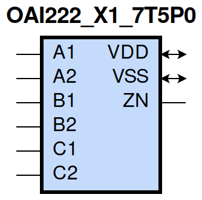
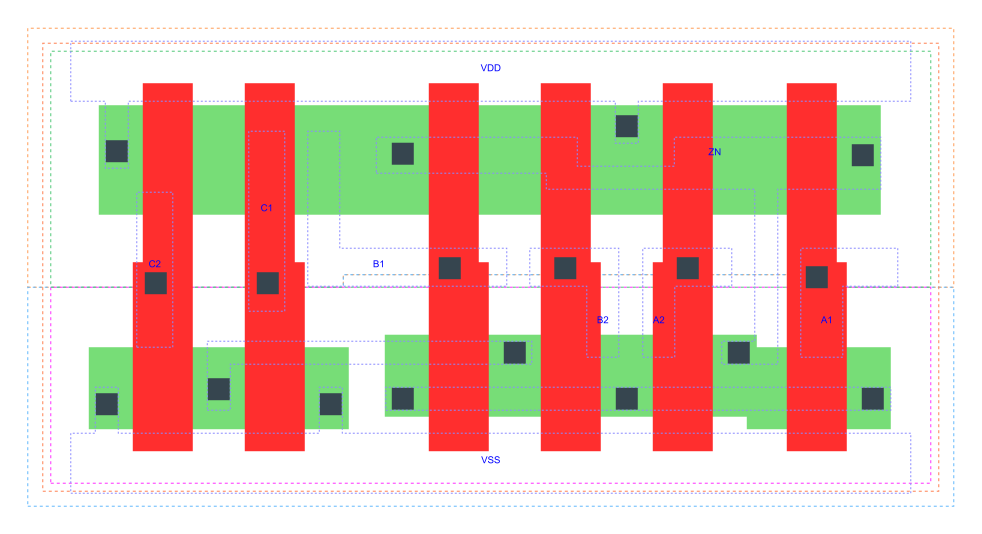

=======================================
gf180mcu_fd_sc_mcu7t5v0__oai222_x1
=======================================

**gf180mcu_fd_sc_mcu7t5v0__oai222_x1 symbol**

**gf180mcu_fd_sc_mcu7t5v0__oai222_x1 schematic**

.. image:: sc7_sch/OAI222_X1_sch.png
    :height: 300px
    :width: 500 px
    :align: center
    :alt: gf180mcu_fd_sc_mcu7t5v0__oai222_x1 schematic

**gf180mcu_fd_sc_mcu7t5v0__oai222_x1 layout**

.. include:: images.rst

OAI222_X1 is a three 2-input OR into 3-input NAND, NAND[OR(A1,A2),OR(B1,B2),OR(C1,C2)], 1X drive strength

|
| Attributes

============= ======================
**Attribute** **Value**
area          32.928000 µm\ :sup:`2`
============= ======================

|
| OUTPUT FUNCTIONS

============== ===========================================
**Output Pin** **Function**
ZN             (((!A1)&(!A2))|((!B1)&(!B2))|((!C1)&(!C2)))
============== ===========================================

|
| TRUTH TABLE FOR ZN

====== ====== ====== ====== ====== ====== ======
**A1** **A2** **B1** **B2** **C1** **C2** **ZN**
0      0      ?      ?      ?      ?      1
?      ?      0      0      ?      ?      1
?      ?      ?      ?      0      0      1
1      ?      1      ?      1      ?      0
1      ?      1      ?      ?      1      0
1      ?      ?      1      1      ?      0
1      ?      ?      1      ?      1      0
?      1      1      ?      1      ?      0
?      1      1      ?      ?      1      0
?      1      ?      1      1      ?      0
?      1      ?      1      ?      1      0
====== ====== ====== ====== ====== ====== ======

|
| FUNCTIONAL SCHEMATIC
| |image545|
| PIN CAPACITANCE (pf)

======= ======== ====================
**Pin** **Type** **Capacitance (pf)**
C2      input    0.0043
C1      input    0.0045
B1      input    0.0049
B2      input    0.0045
A2      input    0.0045
A1      input    0.0046
======= ======== ====================

|
| DELAY AND OUTPUT TRANSITION TIME corresponding to min slew and load

+---------------+------------+--------------------+--------------+-------------------+----------------+---------------+
| **Input Pin** | **Output** | **When Condition** | **Tin (ns)** | **Out Load (pf)** | **Delay (ns)** | **Tout (ns)** |
+---------------+------------+--------------------+--------------+-------------------+----------------+---------------+
| C2(LH)        | ZN(HL)     | !A1&A2&!B1&B2&!C1  | 0.0100       | 0.0010            | 0.2744         | 0.1474        |
+---------------+------------+--------------------+--------------+-------------------+----------------+---------------+
| C2(LH)        | ZN(HL)     | !A1&A2&B1&!B2&!C1  | 0.0100       | 0.0010            | 0.2417         | 0.1263        |
+---------------+------------+--------------------+--------------+-------------------+----------------+---------------+
| C2(LH)        | ZN(HL)     | !A1&A2&B1&B2&!C1   | 0.0100       | 0.0010            | 0.2160         | 0.1056        |
+---------------+------------+--------------------+--------------+-------------------+----------------+---------------+
| C2(LH)        | ZN(HL)     | A1&!A2&!B1&B2&!C1  | 0.0100       | 0.0010            | 0.2406         | 0.1255        |
+---------------+------------+--------------------+--------------+-------------------+----------------+---------------+
| C2(LH)        | ZN(HL)     | A1&!A2&B1&!B2&!C1  | 0.0100       | 0.0010            | 0.2085         | 0.1047        |
+---------------+------------+--------------------+--------------+-------------------+----------------+---------------+
| C2(LH)        | ZN(HL)     | A1&!A2&B1&B2&!C1   | 0.0100       | 0.0010            | 0.1880         | 0.0880        |
+---------------+------------+--------------------+--------------+-------------------+----------------+---------------+
| C2(LH)        | ZN(HL)     | A1&A2&!B1&B2&!C1   | 0.0100       | 0.0010            | 0.2099         | 0.1223        |
+---------------+------------+--------------------+--------------+-------------------+----------------+---------------+
| C2(LH)        | ZN(HL)     | A1&A2&B1&!B2&!C1   | 0.0100       | 0.0010            | 0.1834         | 0.1044        |
+---------------+------------+--------------------+--------------+-------------------+----------------+---------------+
| C2(LH)        | ZN(HL)     | A1&A2&B1&B2&!C1    | 0.0100       | 0.0010            | 0.1580         | 0.0832        |
+---------------+------------+--------------------+--------------+-------------------+----------------+---------------+
| C2(HL)        | ZN(LH)     | !A1&A2&!B1&B2&!C1  | 0.0100       | 0.0010            | 0.3911         | 0.3681        |
+---------------+------------+--------------------+--------------+-------------------+----------------+---------------+
| C2(HL)        | ZN(LH)     | !A1&A2&B1&!B2&!C1  | 0.0100       | 0.0010            | 0.3726         | 0.3192        |
+---------------+------------+--------------------+--------------+-------------------+----------------+---------------+
| C2(HL)        | ZN(LH)     | !A1&A2&B1&B2&!C1   | 0.0100       | 0.0010            | 0.3931         | 0.3347        |
+---------------+------------+--------------------+--------------+-------------------+----------------+---------------+
| C2(HL)        | ZN(LH)     | A1&!A2&!B1&B2&!C1  | 0.0100       | 0.0010            | 0.3723         | 0.3172        |
+---------------+------------+--------------------+--------------+-------------------+----------------+---------------+
| C2(HL)        | ZN(LH)     | A1&!A2&B1&!B2&!C1  | 0.0100       | 0.0010            | 0.3555         | 0.2673        |
+---------------+------------+--------------------+--------------+-------------------+----------------+---------------+
| C2(HL)        | ZN(LH)     | A1&!A2&B1&B2&!C1   | 0.0100       | 0.0010            | 0.3751         | 0.2827        |
+---------------+------------+--------------------+--------------+-------------------+----------------+---------------+
| C2(HL)        | ZN(LH)     | A1&A2&!B1&B2&!C1   | 0.0100       | 0.0010            | 0.4037         | 0.3379        |
+---------------+------------+--------------------+--------------+-------------------+----------------+---------------+
| C2(HL)        | ZN(LH)     | A1&A2&B1&!B2&!C1   | 0.0100       | 0.0010            | 0.3880         | 0.2899        |
+---------------+------------+--------------------+--------------+-------------------+----------------+---------------+
| C2(HL)        | ZN(LH)     | A1&A2&B1&B2&!C1    | 0.0100       | 0.0010            | 0.4101         | 0.3063        |
+---------------+------------+--------------------+--------------+-------------------+----------------+---------------+
| C1(LH)        | ZN(HL)     | !A1&A2&!B1&B2&!C2  | 0.0100       | 0.0010            | 0.2459         | 0.1269        |
+---------------+------------+--------------------+--------------+-------------------+----------------+---------------+
| C1(LH)        | ZN(HL)     | !A1&A2&B1&!B2&!C2  | 0.0100       | 0.0010            | 0.2138         | 0.1061        |
+---------------+------------+--------------------+--------------+-------------------+----------------+---------------+
| C1(LH)        | ZN(HL)     | !A1&A2&B1&B2&!C2   | 0.0100       | 0.0010            | 0.1922         | 0.0887        |
+---------------+------------+--------------------+--------------+-------------------+----------------+---------------+
| C1(LH)        | ZN(HL)     | A1&!A2&!B1&B2&!C2  | 0.0100       | 0.0010            | 0.2128         | 0.1053        |
+---------------+------------+--------------------+--------------+-------------------+----------------+---------------+
| C1(LH)        | ZN(HL)     | A1&!A2&B1&!B2&!C2  | 0.0100       | 0.0010            | 0.1819         | 0.0839        |
+---------------+------------+--------------------+--------------+-------------------+----------------+---------------+
| C1(LH)        | ZN(HL)     | A1&!A2&B1&B2&!C2   | 0.0100       | 0.0010            | 0.1653         | 0.0711        |
+---------------+------------+--------------------+--------------+-------------------+----------------+---------------+
| C1(LH)        | ZN(HL)     | A1&A2&!B1&B2&!C2   | 0.0100       | 0.0010            | 0.1867         | 0.1049        |
+---------------+------------+--------------------+--------------+-------------------+----------------+---------------+
| C1(LH)        | ZN(HL)     | A1&A2&B1&!B2&!C2   | 0.0100       | 0.0010            | 0.1615         | 0.0866        |
+---------------+------------+--------------------+--------------+-------------------+----------------+---------------+
| C1(LH)        | ZN(HL)     | A1&A2&B1&B2&!C2    | 0.0100       | 0.0010            | 0.1408         | 0.0695        |
+---------------+------------+--------------------+--------------+-------------------+----------------+---------------+
| C1(HL)        | ZN(LH)     | !A1&A2&!B1&B2&!C2  | 0.0100       | 0.0010            | 0.3668         | 0.3681        |
+---------------+------------+--------------------+--------------+-------------------+----------------+---------------+
| C1(HL)        | ZN(LH)     | !A1&A2&B1&!B2&!C2  | 0.0100       | 0.0010            | 0.3484         | 0.3190        |
+---------------+------------+--------------------+--------------+-------------------+----------------+---------------+
| C1(HL)        | ZN(LH)     | !A1&A2&B1&B2&!C2   | 0.0100       | 0.0010            | 0.3689         | 0.3347        |
+---------------+------------+--------------------+--------------+-------------------+----------------+---------------+
| C1(HL)        | ZN(LH)     | A1&!A2&!B1&B2&!C2  | 0.0100       | 0.0010            | 0.3481         | 0.3173        |
+---------------+------------+--------------------+--------------+-------------------+----------------+---------------+
| C1(HL)        | ZN(LH)     | A1&!A2&B1&!B2&!C2  | 0.0100       | 0.0010            | 0.3314         | 0.2677        |
+---------------+------------+--------------------+--------------+-------------------+----------------+---------------+
| C1(HL)        | ZN(LH)     | A1&!A2&B1&B2&!C2   | 0.0100       | 0.0010            | 0.3512         | 0.2826        |
+---------------+------------+--------------------+--------------+-------------------+----------------+---------------+
| C1(HL)        | ZN(LH)     | A1&A2&!B1&B2&!C2   | 0.0100       | 0.0010            | 0.3794         | 0.3379        |
+---------------+------------+--------------------+--------------+-------------------+----------------+---------------+
| C1(HL)        | ZN(LH)     | A1&A2&B1&!B2&!C2   | 0.0100       | 0.0010            | 0.3639         | 0.2901        |
+---------------+------------+--------------------+--------------+-------------------+----------------+---------------+
| C1(HL)        | ZN(LH)     | A1&A2&B1&B2&!C2    | 0.0100       | 0.0010            | 0.3859         | 0.3063        |
+---------------+------------+--------------------+--------------+-------------------+----------------+---------------+
| B1(LH)        | ZN(HL)     | !A1&A2&!B2&!C1&C2  | 0.0100       | 0.0010            | 0.2179         | 0.1262        |
+---------------+------------+--------------------+--------------+-------------------+----------------+---------------+
| B1(LH)        | ZN(HL)     | !A1&A2&!B2&C1&!C2  | 0.0100       | 0.0010            | 0.1866         | 0.1059        |
+---------------+------------+--------------------+--------------+-------------------+----------------+---------------+
| B1(LH)        | ZN(HL)     | !A1&A2&!B2&C1&C2   | 0.0100       | 0.0010            | 0.1624         | 0.0874        |
+---------------+------------+--------------------+--------------+-------------------+----------------+---------------+
| B1(LH)        | ZN(HL)     | A1&!A2&!B2&!C1&C2  | 0.0100       | 0.0010            | 0.1846         | 0.1043        |
+---------------+------------+--------------------+--------------+-------------------+----------------+---------------+
| B1(LH)        | ZN(HL)     | A1&!A2&!B2&C1&!C2  | 0.0100       | 0.0010            | 0.1549         | 0.0839        |
+---------------+------------+--------------------+--------------+-------------------+----------------+---------------+
| B1(LH)        | ZN(HL)     | A1&!A2&!B2&C1&C2   | 0.0100       | 0.0010            | 0.1357         | 0.0687        |
+---------------+------------+--------------------+--------------+-------------------+----------------+---------------+
| B1(LH)        | ZN(HL)     | A1&A2&!B2&!C1&C2   | 0.0100       | 0.0010            | 0.1589         | 0.1043        |
+---------------+------------+--------------------+--------------+-------------------+----------------+---------------+
| B1(LH)        | ZN(HL)     | A1&A2&!B2&C1&!C2   | 0.0100       | 0.0010            | 0.1343         | 0.0866        |
+---------------+------------+--------------------+--------------+-------------------+----------------+---------------+
| B1(LH)        | ZN(HL)     | A1&A2&!B2&C1&C2    | 0.0100       | 0.0010            | 0.1156         | 0.0666        |
+---------------+------------+--------------------+--------------+-------------------+----------------+---------------+
| B1(HL)        | ZN(LH)     | !A1&A2&!B2&!C1&C2  | 0.0100       | 0.0010            | 0.2943         | 0.3034        |
+---------------+------------+--------------------+--------------+-------------------+----------------+---------------+
| B1(HL)        | ZN(LH)     | !A1&A2&!B2&C1&!C2  | 0.0100       | 0.0010            | 0.2793         | 0.2586        |
+---------------+------------+--------------------+--------------+-------------------+----------------+---------------+
| B1(HL)        | ZN(LH)     | !A1&A2&!B2&C1&C2   | 0.0100       | 0.0010            | 0.2779         | 0.2586        |
+---------------+------------+--------------------+--------------+-------------------+----------------+---------------+
| B1(HL)        | ZN(LH)     | A1&!A2&!B2&!C1&C2  | 0.0100       | 0.0010            | 0.2790         | 0.2550        |
+---------------+------------+--------------------+--------------+-------------------+----------------+---------------+
| B1(HL)        | ZN(LH)     | A1&!A2&!B2&C1&!C2  | 0.0100       | 0.0010            | 0.2660         | 0.2107        |
+---------------+------------+--------------------+--------------+-------------------+----------------+---------------+
| B1(HL)        | ZN(LH)     | A1&!A2&!B2&C1&C2   | 0.0100       | 0.0010            | 0.2646         | 0.2106        |
+---------------+------------+--------------------+--------------+-------------------+----------------+---------------+
| B1(HL)        | ZN(LH)     | A1&A2&!B2&!C1&C2   | 0.0100       | 0.0010            | 0.3051         | 0.2743        |
+---------------+------------+--------------------+--------------+-------------------+----------------+---------------+
| B1(HL)        | ZN(LH)     | A1&A2&!B2&C1&!C2   | 0.0100       | 0.0010            | 0.2924         | 0.2306        |
+---------------+------------+--------------------+--------------+-------------------+----------------+---------------+
| B1(HL)        | ZN(LH)     | A1&A2&!B2&C1&C2    | 0.0100       | 0.0010            | 0.2909         | 0.2306        |
+---------------+------------+--------------------+--------------+-------------------+----------------+---------------+
| B2(HL)        | ZN(LH)     | !A1&A2&!B1&!C1&C2  | 0.0100       | 0.0010            | 0.3202         | 0.3033        |
+---------------+------------+--------------------+--------------+-------------------+----------------+---------------+
| B2(HL)        | ZN(LH)     | !A1&A2&!B1&C1&!C2  | 0.0100       | 0.0010            | 0.3052         | 0.2587        |
+---------------+------------+--------------------+--------------+-------------------+----------------+---------------+
| B2(HL)        | ZN(LH)     | !A1&A2&!B1&C1&C2   | 0.0100       | 0.0010            | 0.3038         | 0.2586        |
+---------------+------------+--------------------+--------------+-------------------+----------------+---------------+
| B2(HL)        | ZN(LH)     | A1&!A2&!B1&!C1&C2  | 0.0100       | 0.0010            | 0.3049         | 0.2550        |
+---------------+------------+--------------------+--------------+-------------------+----------------+---------------+
| B2(HL)        | ZN(LH)     | A1&!A2&!B1&C1&!C2  | 0.0100       | 0.0010            | 0.2919         | 0.2103        |
+---------------+------------+--------------------+--------------+-------------------+----------------+---------------+
| B2(HL)        | ZN(LH)     | A1&!A2&!B1&C1&C2   | 0.0100       | 0.0010            | 0.2904         | 0.2102        |
+---------------+------------+--------------------+--------------+-------------------+----------------+---------------+
| B2(HL)        | ZN(LH)     | A1&A2&!B1&!C1&C2   | 0.0100       | 0.0010            | 0.3311         | 0.2744        |
+---------------+------------+--------------------+--------------+-------------------+----------------+---------------+
| B2(HL)        | ZN(LH)     | A1&A2&!B1&C1&!C2   | 0.0100       | 0.0010            | 0.3185         | 0.2306        |
+---------------+------------+--------------------+--------------+-------------------+----------------+---------------+
| B2(HL)        | ZN(LH)     | A1&A2&!B1&C1&C2    | 0.0100       | 0.0010            | 0.3169         | 0.2304        |
+---------------+------------+--------------------+--------------+-------------------+----------------+---------------+
| B2(LH)        | ZN(HL)     | !A1&A2&!B1&!C1&C2  | 0.0100       | 0.0010            | 0.2476         | 0.1475        |
+---------------+------------+--------------------+--------------+-------------------+----------------+---------------+
| B2(LH)        | ZN(HL)     | !A1&A2&!B1&C1&!C2  | 0.0100       | 0.0010            | 0.2157         | 0.1269        |
+---------------+------------+--------------------+--------------+-------------------+----------------+---------------+
| B2(LH)        | ZN(HL)     | !A1&A2&!B1&C1&C2   | 0.0100       | 0.0010            | 0.1870         | 0.1051        |
+---------------+------------+--------------------+--------------+-------------------+----------------+---------------+
| B2(LH)        | ZN(HL)     | A1&!A2&!B1&!C1&C2  | 0.0100       | 0.0010            | 0.2135         | 0.1254        |
+---------------+------------+--------------------+--------------+-------------------+----------------+---------------+
| B2(LH)        | ZN(HL)     | A1&!A2&!B1&C1&!C2  | 0.0100       | 0.0010            | 0.1825         | 0.1050        |
+---------------+------------+--------------------+--------------+-------------------+----------------+---------------+
| B2(LH)        | ZN(HL)     | A1&!A2&!B1&C1&C2   | 0.0100       | 0.0010            | 0.1589         | 0.0870        |
+---------------+------------+--------------------+--------------+-------------------+----------------+---------------+
| B2(LH)        | ZN(HL)     | A1&A2&!B1&!C1&C2   | 0.0100       | 0.0010            | 0.1829         | 0.1222        |
+---------------+------------+--------------------+--------------+-------------------+----------------+---------------+
| B2(LH)        | ZN(HL)     | A1&A2&!B1&C1&!C2   | 0.0100       | 0.0010            | 0.1570         | 0.1050        |
+---------------+------------+--------------------+--------------+-------------------+----------------+---------------+
| B2(LH)        | ZN(HL)     | A1&A2&!B1&C1&C2    | 0.0100       | 0.0010            | 0.1334         | 0.0812        |
+---------------+------------+--------------------+--------------+-------------------+----------------+---------------+
| A2(HL)        | ZN(LH)     | !A1&!B1&B2&!C1&C2  | 0.0100       | 0.0010            | 0.2141         | 0.2180        |
+---------------+------------+--------------------+--------------+-------------------+----------------+---------------+
| A2(HL)        | ZN(LH)     | !A1&!B1&B2&C1&!C2  | 0.0100       | 0.0010            | 0.2024         | 0.1746        |
+---------------+------------+--------------------+--------------+-------------------+----------------+---------------+
| A2(HL)        | ZN(LH)     | !A1&!B1&B2&C1&C2   | 0.0100       | 0.0010            | 0.2023         | 0.1746        |
+---------------+------------+--------------------+--------------+-------------------+----------------+---------------+
| A2(HL)        | ZN(LH)     | !A1&B1&!B2&!C1&C2  | 0.0100       | 0.0010            | 0.2024         | 0.1731        |
+---------------+------------+--------------------+--------------+-------------------+----------------+---------------+
| A2(HL)        | ZN(LH)     | !A1&B1&!B2&C1&!C2  | 0.0100       | 0.0010            | 0.1924         | 0.1316        |
+---------------+------------+--------------------+--------------+-------------------+----------------+---------------+
| A2(HL)        | ZN(LH)     | !A1&B1&!B2&C1&C2   | 0.0100       | 0.0010            | 0.1923         | 0.1316        |
+---------------+------------+--------------------+--------------+-------------------+----------------+---------------+
| A2(HL)        | ZN(LH)     | !A1&B1&B2&!C1&C2   | 0.0100       | 0.0010            | 0.2016         | 0.1731        |
+---------------+------------+--------------------+--------------+-------------------+----------------+---------------+
| A2(HL)        | ZN(LH)     | !A1&B1&B2&C1&!C2   | 0.0100       | 0.0010            | 0.1916         | 0.1316        |
+---------------+------------+--------------------+--------------+-------------------+----------------+---------------+
| A2(HL)        | ZN(LH)     | !A1&B1&B2&C1&C2    | 0.0100       | 0.0010            | 0.1914         | 0.1316        |
+---------------+------------+--------------------+--------------+-------------------+----------------+---------------+
| A2(LH)        | ZN(HL)     | !A1&!B1&B2&!C1&C2  | 0.0100       | 0.0010            | 0.1884         | 0.1474        |
+---------------+------------+--------------------+--------------+-------------------+----------------+---------------+
| A2(LH)        | ZN(HL)     | !A1&!B1&B2&C1&!C2  | 0.0100       | 0.0010            | 0.1565         | 0.1264        |
+---------------+------------+--------------------+--------------+-------------------+----------------+---------------+
| A2(LH)        | ZN(HL)     | !A1&!B1&B2&C1&C2   | 0.0100       | 0.0010            | 0.1413         | 0.1051        |
+---------------+------------+--------------------+--------------+-------------------+----------------+---------------+
| A2(LH)        | ZN(HL)     | !A1&B1&!B2&!C1&C2  | 0.0100       | 0.0010            | 0.1556         | 0.1256        |
+---------------+------------+--------------------+--------------+-------------------+----------------+---------------+
| A2(LH)        | ZN(HL)     | !A1&B1&!B2&C1&!C2  | 0.0100       | 0.0010            | 0.1245         | 0.1042        |
+---------------+------------+--------------------+--------------+-------------------+----------------+---------------+
| A2(LH)        | ZN(HL)     | !A1&B1&!B2&C1&C2   | 0.0100       | 0.0010            | 0.1140         | 0.0869        |
+---------------+------------+--------------------+--------------+-------------------+----------------+---------------+
| A2(LH)        | ZN(HL)     | !A1&B1&B2&!C1&C2   | 0.0100       | 0.0010            | 0.1347         | 0.1042        |
+---------------+------------+--------------------+--------------+-------------------+----------------+---------------+
| A2(LH)        | ZN(HL)     | !A1&B1&B2&C1&!C2   | 0.0100       | 0.0010            | 0.1083         | 0.0863        |
+---------------+------------+--------------------+--------------+-------------------+----------------+---------------+
| A2(LH)        | ZN(HL)     | !A1&B1&B2&C1&C2    | 0.0100       | 0.0010            | 0.0981         | 0.0696        |
+---------------+------------+--------------------+--------------+-------------------+----------------+---------------+
| A1(HL)        | ZN(LH)     | !A2&!B1&B2&!C1&C2  | 0.0100       | 0.0010            | 0.1863         | 0.2180        |
+---------------+------------+--------------------+--------------+-------------------+----------------+---------------+
| A1(HL)        | ZN(LH)     | !A2&!B1&B2&C1&!C2  | 0.0100       | 0.0010            | 0.1748         | 0.1744        |
+---------------+------------+--------------------+--------------+-------------------+----------------+---------------+
| A1(HL)        | ZN(LH)     | !A2&!B1&B2&C1&C2   | 0.0100       | 0.0010            | 0.1747         | 0.1746        |
+---------------+------------+--------------------+--------------+-------------------+----------------+---------------+
| A1(HL)        | ZN(LH)     | !A2&B1&!B2&!C1&C2  | 0.0100       | 0.0010            | 0.1747         | 0.1728        |
+---------------+------------+--------------------+--------------+-------------------+----------------+---------------+
| A1(HL)        | ZN(LH)     | !A2&B1&!B2&C1&!C2  | 0.0100       | 0.0010            | 0.1646         | 0.1315        |
+---------------+------------+--------------------+--------------+-------------------+----------------+---------------+
| A1(HL)        | ZN(LH)     | !A2&B1&!B2&C1&C2   | 0.0100       | 0.0010            | 0.1645         | 0.1315        |
+---------------+------------+--------------------+--------------+-------------------+----------------+---------------+
| A1(HL)        | ZN(LH)     | !A2&B1&B2&!C1&C2   | 0.0100       | 0.0010            | 0.1737         | 0.1728        |
+---------------+------------+--------------------+--------------+-------------------+----------------+---------------+
| A1(HL)        | ZN(LH)     | !A2&B1&B2&C1&!C2   | 0.0100       | 0.0010            | 0.1638         | 0.1315        |
+---------------+------------+--------------------+--------------+-------------------+----------------+---------------+
| A1(HL)        | ZN(LH)     | !A2&B1&B2&C1&C2    | 0.0100       | 0.0010            | 0.1636         | 0.1315        |
+---------------+------------+--------------------+--------------+-------------------+----------------+---------------+
| A1(LH)        | ZN(HL)     | !A2&!B1&B2&!C1&C2  | 0.0100       | 0.0010            | 0.1575         | 0.1247        |
+---------------+------------+--------------------+--------------+-------------------+----------------+---------------+
| A1(LH)        | ZN(HL)     | !A2&!B1&B2&C1&!C2  | 0.0100       | 0.0010            | 0.1265         | 0.1034        |
+---------------+------------+--------------------+--------------+-------------------+----------------+---------------+
| A1(LH)        | ZN(HL)     | !A2&!B1&B2&C1&C2   | 0.0100       | 0.0010            | 0.1158         | 0.0862        |
+---------------+------------+--------------------+--------------+-------------------+----------------+---------------+
| A1(LH)        | ZN(HL)     | !A2&B1&!B2&!C1&C2  | 0.0100       | 0.0010            | 0.1256         | 0.1023        |
+---------------+------------+--------------------+--------------+-------------------+----------------+---------------+
| A1(LH)        | ZN(HL)     | !A2&B1&!B2&C1&!C2  | 0.0100       | 0.0010            | 0.0964         | 0.0797        |
+---------------+------------+--------------------+--------------+-------------------+----------------+---------------+
| A1(LH)        | ZN(HL)     | !A2&B1&!B2&C1&C2   | 0.0100       | 0.0010            | 0.0902         | 0.0675        |
+---------------+------------+--------------------+--------------+-------------------+----------------+---------------+
| A1(LH)        | ZN(HL)     | !A2&B1&B2&!C1&C2   | 0.0100       | 0.0010            | 0.1096         | 0.0844        |
+---------------+------------+--------------------+--------------+-------------------+----------------+---------------+
| A1(LH)        | ZN(HL)     | !A2&B1&B2&C1&!C2   | 0.0100       | 0.0010            | 0.0854         | 0.0655        |
+---------------+------------+--------------------+--------------+-------------------+----------------+---------------+
| A1(LH)        | ZN(HL)     | !A2&B1&B2&C1&C2    | 0.0100       | 0.0010            | 0.0792         | 0.0540        |
+---------------+------------+--------------------+--------------+-------------------+----------------+---------------+

|
| DYNAMIC ENERGY

+---------------+---------------------+--------------+------------+-------------------+---------------------+
| **Input Pin** | **When Condition**  | **Tin (ns)** | **Output** | **Out Load (pf)** | **Energy (uW/MHz)** |
+---------------+---------------------+--------------+------------+-------------------+---------------------+
| A1            | !A2&!B1&B2&!C1&C2   | 0.0100       | ZN(LH)     | 0.0010            | 0.1985              |
+---------------+---------------------+--------------+------------+-------------------+---------------------+
| A1            | !A2&!B1&B2&C1&!C2   | 0.0100       | ZN(LH)     | 0.0010            | 0.1721              |
+---------------+---------------------+--------------+------------+-------------------+---------------------+
| A1            | !A2&!B1&B2&C1&C2    | 0.0100       | ZN(LH)     | 0.0010            | 0.1721              |
+---------------+---------------------+--------------+------------+-------------------+---------------------+
| A1            | !A2&B1&!B2&!C1&C2   | 0.0100       | ZN(LH)     | 0.0010            | 0.1718              |
+---------------+---------------------+--------------+------------+-------------------+---------------------+
| A1            | !A2&B1&!B2&C1&!C2   | 0.0100       | ZN(LH)     | 0.0010            | 0.1454              |
+---------------+---------------------+--------------+------------+-------------------+---------------------+
| A1            | !A2&B1&!B2&C1&C2    | 0.0100       | ZN(LH)     | 0.0010            | 0.1453              |
+---------------+---------------------+--------------+------------+-------------------+---------------------+
| A1            | !A2&B1&B2&!C1&C2    | 0.0100       | ZN(LH)     | 0.0010            | 0.1712              |
+---------------+---------------------+--------------+------------+-------------------+---------------------+
| A1            | !A2&B1&B2&C1&!C2    | 0.0100       | ZN(LH)     | 0.0010            | 0.1447              |
+---------------+---------------------+--------------+------------+-------------------+---------------------+
| A1            | !A2&B1&B2&C1&C2     | 0.0100       | ZN(LH)     | 0.0010            | 0.1447              |
+---------------+---------------------+--------------+------------+-------------------+---------------------+
| B2            | !A1&A2&!B1&!C1&C2   | 0.0100       | ZN(LH)     | 0.0010            | 0.3314              |
+---------------+---------------------+--------------+------------+-------------------+---------------------+
| B2            | !A1&A2&!B1&C1&!C2   | 0.0100       | ZN(LH)     | 0.0010            | 0.3050              |
+---------------+---------------------+--------------+------------+-------------------+---------------------+
| B2            | !A1&A2&!B1&C1&C2    | 0.0100       | ZN(LH)     | 0.0010            | 0.3040              |
+---------------+---------------------+--------------+------------+-------------------+---------------------+
| B2            | A1&!A2&!B1&!C1&C2   | 0.0100       | ZN(LH)     | 0.0010            | 0.3046              |
+---------------+---------------------+--------------+------------+-------------------+---------------------+
| B2            | A1&!A2&!B1&C1&!C2   | 0.0100       | ZN(LH)     | 0.0010            | 0.2780              |
+---------------+---------------------+--------------+------------+-------------------+---------------------+
| B2            | A1&!A2&!B1&C1&C2    | 0.0100       | ZN(LH)     | 0.0010            | 0.2770              |
+---------------+---------------------+--------------+------------+-------------------+---------------------+
| B2            | A1&A2&!B1&!C1&C2    | 0.0100       | ZN(LH)     | 0.0010            | 0.3272              |
+---------------+---------------------+--------------+------------+-------------------+---------------------+
| B2            | A1&A2&!B1&C1&!C2    | 0.0100       | ZN(LH)     | 0.0010            | 0.3006              |
+---------------+---------------------+--------------+------------+-------------------+---------------------+
| B2            | A1&A2&!B1&C1&C2     | 0.0100       | ZN(LH)     | 0.0010            | 0.2997              |
+---------------+---------------------+--------------+------------+-------------------+---------------------+
| B1            | !A1&A2&!B2&!C1&C2   | 0.0100       | ZN(HL)     | 0.0010            | 0.0921              |
+---------------+---------------------+--------------+------------+-------------------+---------------------+
| B1            | !A1&A2&!B2&C1&!C2   | 0.0100       | ZN(HL)     | 0.0010            | 0.0696              |
+---------------+---------------------+--------------+------------+-------------------+---------------------+
| B1            | !A1&A2&!B2&C1&C2    | 0.0100       | ZN(HL)     | 0.0010            | 0.0696              |
+---------------+---------------------+--------------+------------+-------------------+---------------------+
| B1            | A1&!A2&!B2&!C1&C2   | 0.0100       | ZN(HL)     | 0.0010            | 0.0660              |
+---------------+---------------------+--------------+------------+-------------------+---------------------+
| B1            | A1&!A2&!B2&C1&!C2   | 0.0100       | ZN(HL)     | 0.0010            | 0.0437              |
+---------------+---------------------+--------------+------------+-------------------+---------------------+
| B1            | A1&!A2&!B2&C1&C2    | 0.0100       | ZN(HL)     | 0.0010            | 0.0435              |
+---------------+---------------------+--------------+------------+-------------------+---------------------+
| B1            | A1&A2&!B2&!C1&C2    | 0.0100       | ZN(HL)     | 0.0010            | 0.0660              |
+---------------+---------------------+--------------+------------+-------------------+---------------------+
| B1            | A1&A2&!B2&C1&!C2    | 0.0100       | ZN(HL)     | 0.0010            | 0.0436              |
+---------------+---------------------+--------------+------------+-------------------+---------------------+
| B1            | A1&A2&!B2&C1&C2     | 0.0100       | ZN(HL)     | 0.0010            | 0.0435              |
+---------------+---------------------+--------------+------------+-------------------+---------------------+
| A2            | !A1&!B1&B2&!C1&C2   | 0.0100       | ZN(LH)     | 0.0010            | 0.2256              |
+---------------+---------------------+--------------+------------+-------------------+---------------------+
| A2            | !A1&!B1&B2&C1&!C2   | 0.0100       | ZN(LH)     | 0.0010            | 0.1992              |
+---------------+---------------------+--------------+------------+-------------------+---------------------+
| A2            | !A1&!B1&B2&C1&C2    | 0.0100       | ZN(LH)     | 0.0010            | 0.1991              |
+---------------+---------------------+--------------+------------+-------------------+---------------------+
| A2            | !A1&B1&!B2&!C1&C2   | 0.0100       | ZN(LH)     | 0.0010            | 0.1989              |
+---------------+---------------------+--------------+------------+-------------------+---------------------+
| A2            | !A1&B1&!B2&C1&!C2   | 0.0100       | ZN(LH)     | 0.0010            | 0.1724              |
+---------------+---------------------+--------------+------------+-------------------+---------------------+
| A2            | !A1&B1&!B2&C1&C2    | 0.0100       | ZN(LH)     | 0.0010            | 0.1724              |
+---------------+---------------------+--------------+------------+-------------------+---------------------+
| A2            | !A1&B1&B2&!C1&C2    | 0.0100       | ZN(LH)     | 0.0010            | 0.1983              |
+---------------+---------------------+--------------+------------+-------------------+---------------------+
| A2            | !A1&B1&B2&C1&!C2    | 0.0100       | ZN(LH)     | 0.0010            | 0.1718              |
+---------------+---------------------+--------------+------------+-------------------+---------------------+
| A2            | !A1&B1&B2&C1&C2     | 0.0100       | ZN(LH)     | 0.0010            | 0.1717              |
+---------------+---------------------+--------------+------------+-------------------+---------------------+
| B1            | !A1&A2&!B2&!C1&C2   | 0.0100       | ZN(LH)     | 0.0010            | 0.3046              |
+---------------+---------------------+--------------+------------+-------------------+---------------------+
| B1            | !A1&A2&!B2&C1&!C2   | 0.0100       | ZN(LH)     | 0.0010            | 0.2781              |
+---------------+---------------------+--------------+------------+-------------------+---------------------+
| B1            | !A1&A2&!B2&C1&C2    | 0.0100       | ZN(LH)     | 0.0010            | 0.2772              |
+---------------+---------------------+--------------+------------+-------------------+---------------------+
| B1            | A1&!A2&!B2&!C1&C2   | 0.0100       | ZN(LH)     | 0.0010            | 0.2777              |
+---------------+---------------------+--------------+------------+-------------------+---------------------+
| B1            | A1&!A2&!B2&C1&!C2   | 0.0100       | ZN(LH)     | 0.0010            | 0.2513              |
+---------------+---------------------+--------------+------------+-------------------+---------------------+
| B1            | A1&!A2&!B2&C1&C2    | 0.0100       | ZN(LH)     | 0.0010            | 0.2503              |
+---------------+---------------------+--------------+------------+-------------------+---------------------+
| B1            | A1&A2&!B2&!C1&C2    | 0.0100       | ZN(LH)     | 0.0010            | 0.3003              |
+---------------+---------------------+--------------+------------+-------------------+---------------------+
| B1            | A1&A2&!B2&C1&!C2    | 0.0100       | ZN(LH)     | 0.0010            | 0.2738              |
+---------------+---------------------+--------------+------------+-------------------+---------------------+
| B1            | A1&A2&!B2&C1&C2     | 0.0100       | ZN(LH)     | 0.0010            | 0.2729              |
+---------------+---------------------+--------------+------------+-------------------+---------------------+
| C1            | !A1&A2&!B1&B2&!C2   | 0.0100       | ZN(HL)     | 0.0010            | 0.0940              |
+---------------+---------------------+--------------+------------+-------------------+---------------------+
| C1            | !A1&A2&B1&!B2&!C2   | 0.0100       | ZN(HL)     | 0.0010            | 0.0700              |
+---------------+---------------------+--------------+------------+-------------------+---------------------+
| C1            | !A1&A2&B1&B2&!C2    | 0.0100       | ZN(HL)     | 0.0010            | 0.0698              |
+---------------+---------------------+--------------+------------+-------------------+---------------------+
| C1            | A1&!A2&!B1&B2&!C2   | 0.0100       | ZN(HL)     | 0.0010            | 0.0680              |
+---------------+---------------------+--------------+------------+-------------------+---------------------+
| C1            | A1&!A2&B1&!B2&!C2   | 0.0100       | ZN(HL)     | 0.0010            | 0.0437              |
+---------------+---------------------+--------------+------------+-------------------+---------------------+
| C1            | A1&!A2&B1&B2&!C2    | 0.0100       | ZN(HL)     | 0.0010            | 0.0438              |
+---------------+---------------------+--------------+------------+-------------------+---------------------+
| C1            | A1&A2&!B1&B2&!C2    | 0.0100       | ZN(HL)     | 0.0010            | 0.0679              |
+---------------+---------------------+--------------+------------+-------------------+---------------------+
| C1            | A1&A2&B1&!B2&!C2    | 0.0100       | ZN(HL)     | 0.0010            | 0.0438              |
+---------------+---------------------+--------------+------------+-------------------+---------------------+
| C1            | A1&A2&B1&B2&!C2     | 0.0100       | ZN(HL)     | 0.0010            | 0.0438              |
+---------------+---------------------+--------------+------------+-------------------+---------------------+
| A2            | !A1&!B1&B2&!C1&C2   | 0.0100       | ZN(HL)     | 0.0010            | 0.1131              |
+---------------+---------------------+--------------+------------+-------------------+---------------------+
| A2            | !A1&!B1&B2&C1&!C2   | 0.0100       | ZN(HL)     | 0.0010            | 0.0908              |
+---------------+---------------------+--------------+------------+-------------------+---------------------+
| A2            | !A1&!B1&B2&C1&C2    | 0.0100       | ZN(HL)     | 0.0010            | 0.0908              |
+---------------+---------------------+--------------+------------+-------------------+---------------------+
| A2            | !A1&B1&!B2&!C1&C2   | 0.0100       | ZN(HL)     | 0.0010            | 0.0892              |
+---------------+---------------------+--------------+------------+-------------------+---------------------+
| A2            | !A1&B1&!B2&C1&!C2   | 0.0100       | ZN(HL)     | 0.0010            | 0.0669              |
+---------------+---------------------+--------------+------------+-------------------+---------------------+
| A2            | !A1&B1&!B2&C1&C2    | 0.0100       | ZN(HL)     | 0.0010            | 0.0668              |
+---------------+---------------------+--------------+------------+-------------------+---------------------+
| A2            | !A1&B1&B2&!C1&C2    | 0.0100       | ZN(HL)     | 0.0010            | 0.0891              |
+---------------+---------------------+--------------+------------+-------------------+---------------------+
| A2            | !A1&B1&B2&C1&!C2    | 0.0100       | ZN(HL)     | 0.0010            | 0.0668              |
+---------------+---------------------+--------------+------------+-------------------+---------------------+
| A2            | !A1&B1&B2&C1&C2     | 0.0100       | ZN(HL)     | 0.0010            | 0.0667              |
+---------------+---------------------+--------------+------------+-------------------+---------------------+
| C2            | !A1&A2&!B1&B2&!C1   | 0.0100       | ZN(HL)     | 0.0010            | 0.1127              |
+---------------+---------------------+--------------+------------+-------------------+---------------------+
| C2            | !A1&A2&B1&!B2&!C1   | 0.0100       | ZN(HL)     | 0.0010            | 0.0887              |
+---------------+---------------------+--------------+------------+-------------------+---------------------+
| C2            | !A1&A2&B1&B2&!C1    | 0.0100       | ZN(HL)     | 0.0010            | 0.0886              |
+---------------+---------------------+--------------+------------+-------------------+---------------------+
| C2            | A1&!A2&!B1&B2&!C1   | 0.0100       | ZN(HL)     | 0.0010            | 0.0867              |
+---------------+---------------------+--------------+------------+-------------------+---------------------+
| C2            | A1&!A2&B1&!B2&!C1   | 0.0100       | ZN(HL)     | 0.0010            | 0.0628              |
+---------------+---------------------+--------------+------------+-------------------+---------------------+
| C2            | A1&!A2&B1&B2&!C1    | 0.0100       | ZN(HL)     | 0.0010            | 0.0628              |
+---------------+---------------------+--------------+------------+-------------------+---------------------+
| C2            | A1&A2&!B1&B2&!C1    | 0.0100       | ZN(HL)     | 0.0010            | 0.0867              |
+---------------+---------------------+--------------+------------+-------------------+---------------------+
| C2            | A1&A2&B1&!B2&!C1    | 0.0100       | ZN(HL)     | 0.0010            | 0.0627              |
+---------------+---------------------+--------------+------------+-------------------+---------------------+
| C2            | A1&A2&B1&B2&!C1     | 0.0100       | ZN(HL)     | 0.0010            | 0.0626              |
+---------------+---------------------+--------------+------------+-------------------+---------------------+
| C1            | !A1&A2&!B1&B2&!C2   | 0.0100       | ZN(LH)     | 0.0010            | 0.3839              |
+---------------+---------------------+--------------+------------+-------------------+---------------------+
| C1            | !A1&A2&B1&!B2&!C2   | 0.0100       | ZN(LH)     | 0.0010            | 0.3572              |
+---------------+---------------------+--------------+------------+-------------------+---------------------+
| C1            | !A1&A2&B1&B2&!C2    | 0.0100       | ZN(LH)     | 0.0010            | 0.3789              |
+---------------+---------------------+--------------+------------+-------------------+---------------------+
| C1            | A1&!A2&!B1&B2&!C2   | 0.0100       | ZN(LH)     | 0.0010            | 0.3571              |
+---------------+---------------------+--------------+------------+-------------------+---------------------+
| C1            | A1&!A2&B1&!B2&!C2   | 0.0100       | ZN(LH)     | 0.0010            | 0.3304              |
+---------------+---------------------+--------------+------------+-------------------+---------------------+
| C1            | A1&!A2&B1&B2&!C2    | 0.0100       | ZN(LH)     | 0.0010            | 0.3522              |
+---------------+---------------------+--------------+------------+-------------------+---------------------+
| C1            | A1&A2&!B1&B2&!C2    | 0.0100       | ZN(LH)     | 0.0010            | 0.3793              |
+---------------+---------------------+--------------+------------+-------------------+---------------------+
| C1            | A1&A2&B1&!B2&!C2    | 0.0100       | ZN(LH)     | 0.0010            | 0.3524              |
+---------------+---------------------+--------------+------------+-------------------+---------------------+
| C1            | A1&A2&B1&B2&!C2     | 0.0100       | ZN(LH)     | 0.0010            | 0.3743              |
+---------------+---------------------+--------------+------------+-------------------+---------------------+
| C2            | !A1&A2&!B1&B2&!C1   | 0.0100       | ZN(LH)     | 0.0010            | 0.4103              |
+---------------+---------------------+--------------+------------+-------------------+---------------------+
| C2            | !A1&A2&B1&!B2&!C1   | 0.0100       | ZN(LH)     | 0.0010            | 0.3836              |
+---------------+---------------------+--------------+------------+-------------------+---------------------+
| C2            | !A1&A2&B1&B2&!C1    | 0.0100       | ZN(LH)     | 0.0010            | 0.4054              |
+---------------+---------------------+--------------+------------+-------------------+---------------------+
| C2            | A1&!A2&!B1&B2&!C1   | 0.0100       | ZN(LH)     | 0.0010            | 0.3835              |
+---------------+---------------------+--------------+------------+-------------------+---------------------+
| C2            | A1&!A2&B1&!B2&!C1   | 0.0100       | ZN(LH)     | 0.0010            | 0.3568              |
+---------------+---------------------+--------------+------------+-------------------+---------------------+
| C2            | A1&!A2&B1&B2&!C1    | 0.0100       | ZN(LH)     | 0.0010            | 0.3784              |
+---------------+---------------------+--------------+------------+-------------------+---------------------+
| C2            | A1&A2&!B1&B2&!C1    | 0.0100       | ZN(LH)     | 0.0010            | 0.4056              |
+---------------+---------------------+--------------+------------+-------------------+---------------------+
| C2            | A1&A2&B1&!B2&!C1    | 0.0100       | ZN(LH)     | 0.0010            | 0.3789              |
+---------------+---------------------+--------------+------------+-------------------+---------------------+
| C2            | A1&A2&B1&B2&!C1     | 0.0100       | ZN(LH)     | 0.0010            | 0.4008              |
+---------------+---------------------+--------------+------------+-------------------+---------------------+
| A1            | !A2&!B1&B2&!C1&C2   | 0.0100       | ZN(HL)     | 0.0010            | 0.0904              |
+---------------+---------------------+--------------+------------+-------------------+---------------------+
| A1            | !A2&!B1&B2&C1&!C2   | 0.0100       | ZN(HL)     | 0.0010            | 0.0680              |
+---------------+---------------------+--------------+------------+-------------------+---------------------+
| A1            | !A2&!B1&B2&C1&C2    | 0.0100       | ZN(HL)     | 0.0010            | 0.0680              |
+---------------+---------------------+--------------+------------+-------------------+---------------------+
| A1            | !A2&B1&!B2&!C1&C2   | 0.0100       | ZN(HL)     | 0.0010            | 0.0663              |
+---------------+---------------------+--------------+------------+-------------------+---------------------+
| A1            | !A2&B1&!B2&C1&!C2   | 0.0100       | ZN(HL)     | 0.0010            | 0.0439              |
+---------------+---------------------+--------------+------------+-------------------+---------------------+
| A1            | !A2&B1&!B2&C1&C2    | 0.0100       | ZN(HL)     | 0.0010            | 0.0439              |
+---------------+---------------------+--------------+------------+-------------------+---------------------+
| A1            | !A2&B1&B2&!C1&C2    | 0.0100       | ZN(HL)     | 0.0010            | 0.0662              |
+---------------+---------------------+--------------+------------+-------------------+---------------------+
| A1            | !A2&B1&B2&C1&!C2    | 0.0100       | ZN(HL)     | 0.0010            | 0.0439              |
+---------------+---------------------+--------------+------------+-------------------+---------------------+
| A1            | !A2&B1&B2&C1&C2     | 0.0100       | ZN(HL)     | 0.0010            | 0.0437              |
+---------------+---------------------+--------------+------------+-------------------+---------------------+
| B2            | !A1&A2&!B1&!C1&C2   | 0.0100       | ZN(HL)     | 0.0010            | 0.1126              |
+---------------+---------------------+--------------+------------+-------------------+---------------------+
| B2            | !A1&A2&!B1&C1&!C2   | 0.0100       | ZN(HL)     | 0.0010            | 0.0903              |
+---------------+---------------------+--------------+------------+-------------------+---------------------+
| B2            | !A1&A2&!B1&C1&C2    | 0.0100       | ZN(HL)     | 0.0010            | 0.0902              |
+---------------+---------------------+--------------+------------+-------------------+---------------------+
| B2            | A1&!A2&!B1&!C1&C2   | 0.0100       | ZN(HL)     | 0.0010            | 0.0866              |
+---------------+---------------------+--------------+------------+-------------------+---------------------+
| B2            | A1&!A2&!B1&C1&!C2   | 0.0100       | ZN(HL)     | 0.0010            | 0.0644              |
+---------------+---------------------+--------------+------------+-------------------+---------------------+
| B2            | A1&!A2&!B1&C1&C2    | 0.0100       | ZN(HL)     | 0.0010            | 0.0644              |
+---------------+---------------------+--------------+------------+-------------------+---------------------+
| B2            | A1&A2&!B1&!C1&C2    | 0.0100       | ZN(HL)     | 0.0010            | 0.0866              |
+---------------+---------------------+--------------+------------+-------------------+---------------------+
| B2            | A1&A2&!B1&C1&!C2    | 0.0100       | ZN(HL)     | 0.0010            | 0.0644              |
+---------------+---------------------+--------------+------------+-------------------+---------------------+
| B2            | A1&A2&!B1&C1&C2     | 0.0100       | ZN(HL)     | 0.0010            | 0.0643              |
+---------------+---------------------+--------------+------------+-------------------+---------------------+
| B2(LH)        | !A1&!A2&!B1&!C1&!C2 | 0.0100       | n/a        | n/a               | -0.0352             |
+---------------+---------------------+--------------+------------+-------------------+---------------------+
| B2(LH)        | !A1&!A2&!B1&!C1&C2  | 0.0100       | n/a        | n/a               | -0.0352             |
+---------------+---------------------+--------------+------------+-------------------+---------------------+
| B2(LH)        | !A1&!A2&!B1&C1&!C2  | 0.0100       | n/a        | n/a               | -0.0352             |
+---------------+---------------------+--------------+------------+-------------------+---------------------+
| B2(LH)        | !A1&!A2&!B1&C1&C2   | 0.0100       | n/a        | n/a               | -0.0353             |
+---------------+---------------------+--------------+------------+-------------------+---------------------+
| B2(LH)        | !A1&!A2&B1&!C1&!C2  | 0.0100       | n/a        | n/a               | -0.0340             |
+---------------+---------------------+--------------+------------+-------------------+---------------------+
| B2(LH)        | !A1&!A2&B1&!C1&C2   | 0.0100       | n/a        | n/a               | -0.0340             |
+---------------+---------------------+--------------+------------+-------------------+---------------------+
| B2(LH)        | !A1&!A2&B1&C1&!C2   | 0.0100       | n/a        | n/a               | -0.0340             |
+---------------+---------------------+--------------+------------+-------------------+---------------------+
| B2(LH)        | !A1&!A2&B1&C1&C2    | 0.0100       | n/a        | n/a               | -0.0340             |
+---------------+---------------------+--------------+------------+-------------------+---------------------+
| B2(LH)        | !A1&A2&!B1&!C1&!C2  | 0.0100       | n/a        | n/a               | 0.0123              |
+---------------+---------------------+--------------+------------+-------------------+---------------------+
| B2(LH)        | !A1&A2&B1&!C1&!C2   | 0.0100       | n/a        | n/a               | -0.0340             |
+---------------+---------------------+--------------+------------+-------------------+---------------------+
| B2(LH)        | A1&!A2&!B1&!C1&!C2  | 0.0100       | n/a        | n/a               | 0.0123              |
+---------------+---------------------+--------------+------------+-------------------+---------------------+
| B2(LH)        | A1&!A2&B1&!C1&!C2   | 0.0100       | n/a        | n/a               | -0.0340             |
+---------------+---------------------+--------------+------------+-------------------+---------------------+
| B2(LH)        | A1&A2&!B1&!C1&!C2   | 0.0100       | n/a        | n/a               | 0.0124              |
+---------------+---------------------+--------------+------------+-------------------+---------------------+
| B2(LH)        | A1&A2&B1&!C1&!C2    | 0.0100       | n/a        | n/a               | -0.0340             |
+---------------+---------------------+--------------+------------+-------------------+---------------------+
| B2(LH)        | !A1&A2&B1&!C1&C2    | 0.0100       | n/a        | n/a               | -0.0293             |
+---------------+---------------------+--------------+------------+-------------------+---------------------+
| B2(LH)        | !A1&A2&B1&C1&!C2    | 0.0100       | n/a        | n/a               | -0.0294             |
+---------------+---------------------+--------------+------------+-------------------+---------------------+
| B2(LH)        | !A1&A2&B1&C1&C2     | 0.0100       | n/a        | n/a               | -0.0293             |
+---------------+---------------------+--------------+------------+-------------------+---------------------+
| B2(LH)        | A1&!A2&B1&!C1&C2    | 0.0100       | n/a        | n/a               | -0.0293             |
+---------------+---------------------+--------------+------------+-------------------+---------------------+
| B2(LH)        | A1&!A2&B1&C1&!C2    | 0.0100       | n/a        | n/a               | -0.0293             |
+---------------+---------------------+--------------+------------+-------------------+---------------------+
| B2(LH)        | A1&!A2&B1&C1&C2     | 0.0100       | n/a        | n/a               | -0.0293             |
+---------------+---------------------+--------------+------------+-------------------+---------------------+
| B2(LH)        | A1&A2&B1&!C1&C2     | 0.0100       | n/a        | n/a               | -0.0293             |
+---------------+---------------------+--------------+------------+-------------------+---------------------+
| B2(LH)        | A1&A2&B1&C1&!C2     | 0.0100       | n/a        | n/a               | -0.0294             |
+---------------+---------------------+--------------+------------+-------------------+---------------------+
| B2(LH)        | A1&A2&B1&C1&C2      | 0.0100       | n/a        | n/a               | -0.0294             |
+---------------+---------------------+--------------+------------+-------------------+---------------------+
| C2(HL)        | !A1&!A2&!B1&!B2&!C1 | 0.0100       | n/a        | n/a               | 0.0354              |
+---------------+---------------------+--------------+------------+-------------------+---------------------+
| C2(HL)        | !A1&!A2&!B1&!B2&C1  | 0.0100       | n/a        | n/a               | 0.0352              |
+---------------+---------------------+--------------+------------+-------------------+---------------------+
| C2(HL)        | !A1&!A2&!B1&B2&!C1  | 0.0100       | n/a        | n/a               | 0.0355              |
+---------------+---------------------+--------------+------------+-------------------+---------------------+
| C2(HL)        | !A1&!A2&!B1&B2&C1   | 0.0100       | n/a        | n/a               | 0.0352              |
+---------------+---------------------+--------------+------------+-------------------+---------------------+
| C2(HL)        | !A1&!A2&B1&!B2&!C1  | 0.0100       | n/a        | n/a               | 0.0355              |
+---------------+---------------------+--------------+------------+-------------------+---------------------+
| C2(HL)        | !A1&!A2&B1&!B2&C1   | 0.0100       | n/a        | n/a               | 0.0352              |
+---------------+---------------------+--------------+------------+-------------------+---------------------+
| C2(HL)        | !A1&!A2&B1&B2&!C1   | 0.0100       | n/a        | n/a               | 0.0355              |
+---------------+---------------------+--------------+------------+-------------------+---------------------+
| C2(HL)        | !A1&!A2&B1&B2&C1    | 0.0100       | n/a        | n/a               | 0.0352              |
+---------------+---------------------+--------------+------------+-------------------+---------------------+
| C2(HL)        | !A1&A2&!B1&!B2&!C1  | 0.0100       | n/a        | n/a               | 0.0357              |
+---------------+---------------------+--------------+------------+-------------------+---------------------+
| C2(HL)        | !A1&A2&!B1&!B2&C1   | 0.0100       | n/a        | n/a               | 0.0352              |
+---------------+---------------------+--------------+------------+-------------------+---------------------+
| C2(HL)        | A1&!A2&!B1&!B2&!C1  | 0.0100       | n/a        | n/a               | 0.0357              |
+---------------+---------------------+--------------+------------+-------------------+---------------------+
| C2(HL)        | A1&!A2&!B1&!B2&C1   | 0.0100       | n/a        | n/a               | 0.0352              |
+---------------+---------------------+--------------+------------+-------------------+---------------------+
| C2(HL)        | A1&A2&!B1&!B2&!C1   | 0.0100       | n/a        | n/a               | 0.0357              |
+---------------+---------------------+--------------+------------+-------------------+---------------------+
| C2(HL)        | A1&A2&!B1&!B2&C1    | 0.0100       | n/a        | n/a               | 0.0352              |
+---------------+---------------------+--------------+------------+-------------------+---------------------+
| C2(HL)        | !A1&A2&!B1&B2&C1    | 0.0100       | n/a        | n/a               | 0.0352              |
+---------------+---------------------+--------------+------------+-------------------+---------------------+
| C2(HL)        | !A1&A2&B1&!B2&C1    | 0.0100       | n/a        | n/a               | 0.0352              |
+---------------+---------------------+--------------+------------+-------------------+---------------------+
| C2(HL)        | !A1&A2&B1&B2&C1     | 0.0100       | n/a        | n/a               | 0.0352              |
+---------------+---------------------+--------------+------------+-------------------+---------------------+
| C2(HL)        | A1&!A2&!B1&B2&C1    | 0.0100       | n/a        | n/a               | 0.0352              |
+---------------+---------------------+--------------+------------+-------------------+---------------------+
| C2(HL)        | A1&!A2&B1&!B2&C1    | 0.0100       | n/a        | n/a               | 0.0352              |
+---------------+---------------------+--------------+------------+-------------------+---------------------+
| C2(HL)        | A1&!A2&B1&B2&C1     | 0.0100       | n/a        | n/a               | 0.0352              |
+---------------+---------------------+--------------+------------+-------------------+---------------------+
| C2(HL)        | A1&A2&!B1&B2&C1     | 0.0100       | n/a        | n/a               | 0.0352              |
+---------------+---------------------+--------------+------------+-------------------+---------------------+
| C2(HL)        | A1&A2&B1&!B2&C1     | 0.0100       | n/a        | n/a               | 0.0352              |
+---------------+---------------------+--------------+------------+-------------------+---------------------+
| C2(HL)        | A1&A2&B1&B2&C1      | 0.0100       | n/a        | n/a               | 0.0352              |
+---------------+---------------------+--------------+------------+-------------------+---------------------+
| B2(HL)        | !A1&!A2&!B1&!C1&!C2 | 0.0100       | n/a        | n/a               | 0.0459              |
+---------------+---------------------+--------------+------------+-------------------+---------------------+
| B2(HL)        | !A1&!A2&!B1&!C1&C2  | 0.0100       | n/a        | n/a               | 0.0417              |
+---------------+---------------------+--------------+------------+-------------------+---------------------+
| B2(HL)        | !A1&!A2&!B1&C1&!C2  | 0.0100       | n/a        | n/a               | 0.0417              |
+---------------+---------------------+--------------+------------+-------------------+---------------------+
| B2(HL)        | !A1&!A2&!B1&C1&C2   | 0.0100       | n/a        | n/a               | 0.0409              |
+---------------+---------------------+--------------+------------+-------------------+---------------------+
| B2(HL)        | !A1&!A2&B1&!C1&!C2  | 0.0100       | n/a        | n/a               | 0.0469              |
+---------------+---------------------+--------------+------------+-------------------+---------------------+
| B2(HL)        | !A1&!A2&B1&!C1&C2   | 0.0100       | n/a        | n/a               | 0.0352              |
+---------------+---------------------+--------------+------------+-------------------+---------------------+
| B2(HL)        | !A1&!A2&B1&C1&!C2   | 0.0100       | n/a        | n/a               | 0.0352              |
+---------------+---------------------+--------------+------------+-------------------+---------------------+
| B2(HL)        | !A1&!A2&B1&C1&C2    | 0.0100       | n/a        | n/a               | 0.0352              |
+---------------+---------------------+--------------+------------+-------------------+---------------------+
| B2(HL)        | !A1&A2&!B1&!C1&!C2  | 0.0100       | n/a        | n/a               | 0.0366              |
+---------------+---------------------+--------------+------------+-------------------+---------------------+
| B2(HL)        | !A1&A2&B1&!C1&!C2   | 0.0100       | n/a        | n/a               | 0.0373              |
+---------------+---------------------+--------------+------------+-------------------+---------------------+
| B2(HL)        | A1&!A2&!B1&!C1&!C2  | 0.0100       | n/a        | n/a               | 0.0366              |
+---------------+---------------------+--------------+------------+-------------------+---------------------+
| B2(HL)        | A1&!A2&B1&!C1&!C2   | 0.0100       | n/a        | n/a               | 0.0373              |
+---------------+---------------------+--------------+------------+-------------------+---------------------+
| B2(HL)        | A1&A2&!B1&!C1&!C2   | 0.0100       | n/a        | n/a               | 0.0366              |
+---------------+---------------------+--------------+------------+-------------------+---------------------+
| B2(HL)        | A1&A2&B1&!C1&!C2    | 0.0100       | n/a        | n/a               | 0.0372              |
+---------------+---------------------+--------------+------------+-------------------+---------------------+
| B2(HL)        | !A1&A2&B1&!C1&C2    | 0.0100       | n/a        | n/a               | 0.0352              |
+---------------+---------------------+--------------+------------+-------------------+---------------------+
| B2(HL)        | !A1&A2&B1&C1&!C2    | 0.0100       | n/a        | n/a               | 0.0352              |
+---------------+---------------------+--------------+------------+-------------------+---------------------+
| B2(HL)        | !A1&A2&B1&C1&C2     | 0.0100       | n/a        | n/a               | 0.0352              |
+---------------+---------------------+--------------+------------+-------------------+---------------------+
| B2(HL)        | A1&!A2&B1&!C1&C2    | 0.0100       | n/a        | n/a               | 0.0352              |
+---------------+---------------------+--------------+------------+-------------------+---------------------+
| B2(HL)        | A1&!A2&B1&C1&!C2    | 0.0100       | n/a        | n/a               | 0.0352              |
+---------------+---------------------+--------------+------------+-------------------+---------------------+
| B2(HL)        | A1&!A2&B1&C1&C2     | 0.0100       | n/a        | n/a               | 0.0352              |
+---------------+---------------------+--------------+------------+-------------------+---------------------+
| B2(HL)        | A1&A2&B1&!C1&C2     | 0.0100       | n/a        | n/a               | 0.0352              |
+---------------+---------------------+--------------+------------+-------------------+---------------------+
| B2(HL)        | A1&A2&B1&C1&!C2     | 0.0100       | n/a        | n/a               | 0.0352              |
+---------------+---------------------+--------------+------------+-------------------+---------------------+
| B2(HL)        | A1&A2&B1&C1&C2      | 0.0100       | n/a        | n/a               | 0.0352              |
+---------------+---------------------+--------------+------------+-------------------+---------------------+
| C2(LH)        | !A1&!A2&!B1&!B2&!C1 | 0.0100       | n/a        | n/a               | -0.0353             |
+---------------+---------------------+--------------+------------+-------------------+---------------------+
| C2(LH)        | !A1&!A2&!B1&!B2&C1  | 0.0100       | n/a        | n/a               | -0.0341             |
+---------------+---------------------+--------------+------------+-------------------+---------------------+
| C2(LH)        | !A1&!A2&!B1&B2&!C1  | 0.0100       | n/a        | n/a               | -0.0353             |
+---------------+---------------------+--------------+------------+-------------------+---------------------+
| C2(LH)        | !A1&!A2&!B1&B2&C1   | 0.0100       | n/a        | n/a               | -0.0341             |
+---------------+---------------------+--------------+------------+-------------------+---------------------+
| C2(LH)        | !A1&!A2&B1&!B2&!C1  | 0.0100       | n/a        | n/a               | -0.0353             |
+---------------+---------------------+--------------+------------+-------------------+---------------------+
| C2(LH)        | !A1&!A2&B1&!B2&C1   | 0.0100       | n/a        | n/a               | -0.0341             |
+---------------+---------------------+--------------+------------+-------------------+---------------------+
| C2(LH)        | !A1&!A2&B1&B2&!C1   | 0.0100       | n/a        | n/a               | -0.0353             |
+---------------+---------------------+--------------+------------+-------------------+---------------------+
| C2(LH)        | !A1&!A2&B1&B2&C1    | 0.0100       | n/a        | n/a               | -0.0341             |
+---------------+---------------------+--------------+------------+-------------------+---------------------+
| C2(LH)        | !A1&A2&!B1&!B2&!C1  | 0.0100       | n/a        | n/a               | -0.0354             |
+---------------+---------------------+--------------+------------+-------------------+---------------------+
| C2(LH)        | !A1&A2&!B1&!B2&C1   | 0.0100       | n/a        | n/a               | -0.0341             |
+---------------+---------------------+--------------+------------+-------------------+---------------------+
| C2(LH)        | A1&!A2&!B1&!B2&!C1  | 0.0100       | n/a        | n/a               | -0.0353             |
+---------------+---------------------+--------------+------------+-------------------+---------------------+
| C2(LH)        | A1&!A2&!B1&!B2&C1   | 0.0100       | n/a        | n/a               | -0.0341             |
+---------------+---------------------+--------------+------------+-------------------+---------------------+
| C2(LH)        | A1&A2&!B1&!B2&!C1   | 0.0100       | n/a        | n/a               | -0.0353             |
+---------------+---------------------+--------------+------------+-------------------+---------------------+
| C2(LH)        | A1&A2&!B1&!B2&C1    | 0.0100       | n/a        | n/a               | -0.0341             |
+---------------+---------------------+--------------+------------+-------------------+---------------------+
| C2(LH)        | !A1&A2&!B1&B2&C1    | 0.0100       | n/a        | n/a               | -0.0294             |
+---------------+---------------------+--------------+------------+-------------------+---------------------+
| C2(LH)        | !A1&A2&B1&!B2&C1    | 0.0100       | n/a        | n/a               | -0.0294             |
+---------------+---------------------+--------------+------------+-------------------+---------------------+
| C2(LH)        | !A1&A2&B1&B2&C1     | 0.0100       | n/a        | n/a               | -0.0295             |
+---------------+---------------------+--------------+------------+-------------------+---------------------+
| C2(LH)        | A1&!A2&!B1&B2&C1    | 0.0100       | n/a        | n/a               | -0.0294             |
+---------------+---------------------+--------------+------------+-------------------+---------------------+
| C2(LH)        | A1&!A2&B1&!B2&C1    | 0.0100       | n/a        | n/a               | -0.0295             |
+---------------+---------------------+--------------+------------+-------------------+---------------------+
| C2(LH)        | A1&!A2&B1&B2&C1     | 0.0100       | n/a        | n/a               | -0.0295             |
+---------------+---------------------+--------------+------------+-------------------+---------------------+
| C2(LH)        | A1&A2&!B1&B2&C1     | 0.0100       | n/a        | n/a               | -0.0294             |
+---------------+---------------------+--------------+------------+-------------------+---------------------+
| C2(LH)        | A1&A2&B1&!B2&C1     | 0.0100       | n/a        | n/a               | -0.0294             |
+---------------+---------------------+--------------+------------+-------------------+---------------------+
| C2(LH)        | A1&A2&B1&B2&C1      | 0.0100       | n/a        | n/a               | -0.0295             |
+---------------+---------------------+--------------+------------+-------------------+---------------------+
| A2(LH)        | !A1&!B1&!B2&!C1&!C2 | 0.0100       | n/a        | n/a               | 0.0395              |
+---------------+---------------------+--------------+------------+-------------------+---------------------+
| A2(LH)        | !A1&!B1&!B2&!C1&C2  | 0.0100       | n/a        | n/a               | 0.0395              |
+---------------+---------------------+--------------+------------+-------------------+---------------------+
| A2(LH)        | !A1&!B1&!B2&C1&!C2  | 0.0100       | n/a        | n/a               | 0.0395              |
+---------------+---------------------+--------------+------------+-------------------+---------------------+
| A2(LH)        | !A1&!B1&!B2&C1&C2   | 0.0100       | n/a        | n/a               | 0.0395              |
+---------------+---------------------+--------------+------------+-------------------+---------------------+
| A2(LH)        | !A1&!B1&B2&!C1&!C2  | 0.0100       | n/a        | n/a               | 0.1221              |
+---------------+---------------------+--------------+------------+-------------------+---------------------+
| A2(LH)        | !A1&B1&!B2&!C1&!C2  | 0.0100       | n/a        | n/a               | 0.1221              |
+---------------+---------------------+--------------+------------+-------------------+---------------------+
| A2(LH)        | !A1&B1&B2&!C1&!C2   | 0.0100       | n/a        | n/a               | 0.1432              |
+---------------+---------------------+--------------+------------+-------------------+---------------------+
| A2(LH)        | A1&!B1&!B2&!C1&!C2  | 0.0100       | n/a        | n/a               | -0.0385             |
+---------------+---------------------+--------------+------------+-------------------+---------------------+
| A2(LH)        | A1&!B1&!B2&!C1&C2   | 0.0100       | n/a        | n/a               | -0.0385             |
+---------------+---------------------+--------------+------------+-------------------+---------------------+
| A2(LH)        | A1&!B1&!B2&C1&!C2   | 0.0100       | n/a        | n/a               | -0.0385             |
+---------------+---------------------+--------------+------------+-------------------+---------------------+
| A2(LH)        | A1&!B1&!B2&C1&C2    | 0.0100       | n/a        | n/a               | -0.0385             |
+---------------+---------------------+--------------+------------+-------------------+---------------------+
| A2(LH)        | A1&!B1&B2&!C1&!C2   | 0.0100       | n/a        | n/a               | -0.0385             |
+---------------+---------------------+--------------+------------+-------------------+---------------------+
| A2(LH)        | A1&B1&!B2&!C1&!C2   | 0.0100       | n/a        | n/a               | -0.0385             |
+---------------+---------------------+--------------+------------+-------------------+---------------------+
| A2(LH)        | A1&B1&B2&!C1&!C2    | 0.0100       | n/a        | n/a               | -0.0385             |
+---------------+---------------------+--------------+------------+-------------------+---------------------+
| A2(LH)        | A1&!B1&B2&!C1&C2    | 0.0100       | n/a        | n/a               | -0.0293             |
+---------------+---------------------+--------------+------------+-------------------+---------------------+
| A2(LH)        | A1&!B1&B2&C1&!C2    | 0.0100       | n/a        | n/a               | -0.0293             |
+---------------+---------------------+--------------+------------+-------------------+---------------------+
| A2(LH)        | A1&!B1&B2&C1&C2     | 0.0100       | n/a        | n/a               | -0.0292             |
+---------------+---------------------+--------------+------------+-------------------+---------------------+
| A2(LH)        | A1&B1&!B2&!C1&C2    | 0.0100       | n/a        | n/a               | -0.0293             |
+---------------+---------------------+--------------+------------+-------------------+---------------------+
| A2(LH)        | A1&B1&!B2&C1&!C2    | 0.0100       | n/a        | n/a               | -0.0293             |
+---------------+---------------------+--------------+------------+-------------------+---------------------+
| A2(LH)        | A1&B1&!B2&C1&C2     | 0.0100       | n/a        | n/a               | -0.0293             |
+---------------+---------------------+--------------+------------+-------------------+---------------------+
| A2(LH)        | A1&B1&B2&!C1&C2     | 0.0100       | n/a        | n/a               | -0.0293             |
+---------------+---------------------+--------------+------------+-------------------+---------------------+
| A2(LH)        | A1&B1&B2&C1&!C2     | 0.0100       | n/a        | n/a               | -0.0292             |
+---------------+---------------------+--------------+------------+-------------------+---------------------+
| A2(LH)        | A1&B1&B2&C1&C2      | 0.0100       | n/a        | n/a               | -0.0292             |
+---------------+---------------------+--------------+------------+-------------------+---------------------+
| A1(LH)        | !A2&!B1&!B2&!C1&!C2 | 0.0100       | n/a        | n/a               | 0.0390              |
+---------------+---------------------+--------------+------------+-------------------+---------------------+
| A1(LH)        | !A2&!B1&!B2&!C1&C2  | 0.0100       | n/a        | n/a               | 0.0391              |
+---------------+---------------------+--------------+------------+-------------------+---------------------+
| A1(LH)        | !A2&!B1&!B2&C1&!C2  | 0.0100       | n/a        | n/a               | 0.0391              |
+---------------+---------------------+--------------+------------+-------------------+---------------------+
| A1(LH)        | !A2&!B1&!B2&C1&C2   | 0.0100       | n/a        | n/a               | 0.0391              |
+---------------+---------------------+--------------+------------+-------------------+---------------------+
| A1(LH)        | !A2&!B1&B2&!C1&!C2  | 0.0100       | n/a        | n/a               | 0.1217              |
+---------------+---------------------+--------------+------------+-------------------+---------------------+
| A1(LH)        | !A2&B1&!B2&!C1&!C2  | 0.0100       | n/a        | n/a               | 0.1217              |
+---------------+---------------------+--------------+------------+-------------------+---------------------+
| A1(LH)        | !A2&B1&B2&!C1&!C2   | 0.0100       | n/a        | n/a               | 0.1428              |
+---------------+---------------------+--------------+------------+-------------------+---------------------+
| A1(LH)        | A2&!B1&!B2&!C1&!C2  | 0.0100       | n/a        | n/a               | -0.0390             |
+---------------+---------------------+--------------+------------+-------------------+---------------------+
| A1(LH)        | A2&!B1&!B2&!C1&C2   | 0.0100       | n/a        | n/a               | -0.0390             |
+---------------+---------------------+--------------+------------+-------------------+---------------------+
| A1(LH)        | A2&!B1&!B2&C1&!C2   | 0.0100       | n/a        | n/a               | -0.0389             |
+---------------+---------------------+--------------+------------+-------------------+---------------------+
| A1(LH)        | A2&!B1&!B2&C1&C2    | 0.0100       | n/a        | n/a               | -0.0389             |
+---------------+---------------------+--------------+------------+-------------------+---------------------+
| A1(LH)        | A2&!B1&B2&!C1&!C2   | 0.0100       | n/a        | n/a               | -0.0390             |
+---------------+---------------------+--------------+------------+-------------------+---------------------+
| A1(LH)        | A2&B1&!B2&!C1&!C2   | 0.0100       | n/a        | n/a               | -0.0389             |
+---------------+---------------------+--------------+------------+-------------------+---------------------+
| A1(LH)        | A2&B1&B2&!C1&!C2    | 0.0100       | n/a        | n/a               | -0.0389             |
+---------------+---------------------+--------------+------------+-------------------+---------------------+
| A1(LH)        | A2&!B1&B2&!C1&C2    | 0.0100       | n/a        | n/a               | -0.0101             |
+---------------+---------------------+--------------+------------+-------------------+---------------------+
| A1(LH)        | A2&!B1&B2&C1&!C2    | 0.0100       | n/a        | n/a               | -0.0101             |
+---------------+---------------------+--------------+------------+-------------------+---------------------+
| A1(LH)        | A2&!B1&B2&C1&C2     | 0.0100       | n/a        | n/a               | -0.0101             |
+---------------+---------------------+--------------+------------+-------------------+---------------------+
| A1(LH)        | A2&B1&!B2&!C1&C2    | 0.0100       | n/a        | n/a               | -0.0101             |
+---------------+---------------------+--------------+------------+-------------------+---------------------+
| A1(LH)        | A2&B1&!B2&C1&!C2    | 0.0100       | n/a        | n/a               | -0.0101             |
+---------------+---------------------+--------------+------------+-------------------+---------------------+
| A1(LH)        | A2&B1&!B2&C1&C2     | 0.0100       | n/a        | n/a               | -0.0101             |
+---------------+---------------------+--------------+------------+-------------------+---------------------+
| A1(LH)        | A2&B1&B2&!C1&C2     | 0.0100       | n/a        | n/a               | -0.0101             |
+---------------+---------------------+--------------+------------+-------------------+---------------------+
| A1(LH)        | A2&B1&B2&C1&!C2     | 0.0100       | n/a        | n/a               | -0.0101             |
+---------------+---------------------+--------------+------------+-------------------+---------------------+
| A1(LH)        | A2&B1&B2&C1&C2      | 0.0100       | n/a        | n/a               | -0.0101             |
+---------------+---------------------+--------------+------------+-------------------+---------------------+
| C1(LH)        | !A1&!A2&!B1&!B2&!C2 | 0.0100       | n/a        | n/a               | -0.0356             |
+---------------+---------------------+--------------+------------+-------------------+---------------------+
| C1(LH)        | !A1&!A2&!B1&!B2&C2  | 0.0100       | n/a        | n/a               | -0.0345             |
+---------------+---------------------+--------------+------------+-------------------+---------------------+
| C1(LH)        | !A1&!A2&!B1&B2&!C2  | 0.0100       | n/a        | n/a               | -0.0356             |
+---------------+---------------------+--------------+------------+-------------------+---------------------+
| C1(LH)        | !A1&!A2&!B1&B2&C2   | 0.0100       | n/a        | n/a               | -0.0345             |
+---------------+---------------------+--------------+------------+-------------------+---------------------+
| C1(LH)        | !A1&!A2&B1&!B2&!C2  | 0.0100       | n/a        | n/a               | -0.0356             |
+---------------+---------------------+--------------+------------+-------------------+---------------------+
| C1(LH)        | !A1&!A2&B1&!B2&C2   | 0.0100       | n/a        | n/a               | -0.0345             |
+---------------+---------------------+--------------+------------+-------------------+---------------------+
| C1(LH)        | !A1&!A2&B1&B2&!C2   | 0.0100       | n/a        | n/a               | -0.0356             |
+---------------+---------------------+--------------+------------+-------------------+---------------------+
| C1(LH)        | !A1&!A2&B1&B2&C2    | 0.0100       | n/a        | n/a               | -0.0345             |
+---------------+---------------------+--------------+------------+-------------------+---------------------+
| C1(LH)        | !A1&A2&!B1&!B2&!C2  | 0.0100       | n/a        | n/a               | -0.0357             |
+---------------+---------------------+--------------+------------+-------------------+---------------------+
| C1(LH)        | !A1&A2&!B1&!B2&C2   | 0.0100       | n/a        | n/a               | -0.0345             |
+---------------+---------------------+--------------+------------+-------------------+---------------------+
| C1(LH)        | A1&!A2&!B1&!B2&!C2  | 0.0100       | n/a        | n/a               | -0.0357             |
+---------------+---------------------+--------------+------------+-------------------+---------------------+
| C1(LH)        | A1&!A2&!B1&!B2&C2   | 0.0100       | n/a        | n/a               | -0.0345             |
+---------------+---------------------+--------------+------------+-------------------+---------------------+
| C1(LH)        | A1&A2&!B1&!B2&!C2   | 0.0100       | n/a        | n/a               | -0.0357             |
+---------------+---------------------+--------------+------------+-------------------+---------------------+
| C1(LH)        | A1&A2&!B1&!B2&C2    | 0.0100       | n/a        | n/a               | -0.0345             |
+---------------+---------------------+--------------+------------+-------------------+---------------------+
| C1(LH)        | !A1&A2&!B1&B2&C2    | 0.0100       | n/a        | n/a               | -0.0100             |
+---------------+---------------------+--------------+------------+-------------------+---------------------+
| C1(LH)        | !A1&A2&B1&!B2&C2    | 0.0100       | n/a        | n/a               | -0.0100             |
+---------------+---------------------+--------------+------------+-------------------+---------------------+
| C1(LH)        | !A1&A2&B1&B2&C2     | 0.0100       | n/a        | n/a               | -0.0100             |
+---------------+---------------------+--------------+------------+-------------------+---------------------+
| C1(LH)        | A1&!A2&!B1&B2&C2    | 0.0100       | n/a        | n/a               | -0.0100             |
+---------------+---------------------+--------------+------------+-------------------+---------------------+
| C1(LH)        | A1&!A2&B1&!B2&C2    | 0.0100       | n/a        | n/a               | -0.0100             |
+---------------+---------------------+--------------+------------+-------------------+---------------------+
| C1(LH)        | A1&!A2&B1&B2&C2     | 0.0100       | n/a        | n/a               | -0.0100             |
+---------------+---------------------+--------------+------------+-------------------+---------------------+
| C1(LH)        | A1&A2&!B1&B2&C2     | 0.0100       | n/a        | n/a               | -0.0100             |
+---------------+---------------------+--------------+------------+-------------------+---------------------+
| C1(LH)        | A1&A2&B1&!B2&C2     | 0.0100       | n/a        | n/a               | -0.0100             |
+---------------+---------------------+--------------+------------+-------------------+---------------------+
| C1(LH)        | A1&A2&B1&B2&C2      | 0.0100       | n/a        | n/a               | -0.0100             |
+---------------+---------------------+--------------+------------+-------------------+---------------------+
| A2(HL)        | !A1&!B1&!B2&!C1&!C2 | 0.0100       | n/a        | n/a               | 0.0400              |
+---------------+---------------------+--------------+------------+-------------------+---------------------+
| A2(HL)        | !A1&!B1&!B2&!C1&C2  | 0.0100       | n/a        | n/a               | 0.0399              |
+---------------+---------------------+--------------+------------+-------------------+---------------------+
| A2(HL)        | !A1&!B1&!B2&C1&!C2  | 0.0100       | n/a        | n/a               | 0.0400              |
+---------------+---------------------+--------------+------------+-------------------+---------------------+
| A2(HL)        | !A1&!B1&!B2&C1&C2   | 0.0100       | n/a        | n/a               | 0.0399              |
+---------------+---------------------+--------------+------------+-------------------+---------------------+
| A2(HL)        | !A1&!B1&B2&!C1&!C2  | 0.0100       | n/a        | n/a               | 0.0400              |
+---------------+---------------------+--------------+------------+-------------------+---------------------+
| A2(HL)        | !A1&B1&!B2&!C1&!C2  | 0.0100       | n/a        | n/a               | 0.0400              |
+---------------+---------------------+--------------+------------+-------------------+---------------------+
| A2(HL)        | !A1&B1&B2&!C1&!C2   | 0.0100       | n/a        | n/a               | 0.0400              |
+---------------+---------------------+--------------+------------+-------------------+---------------------+
| A2(HL)        | A1&!B1&!B2&!C1&!C2  | 0.0100       | n/a        | n/a               | 0.0404              |
+---------------+---------------------+--------------+------------+-------------------+---------------------+
| A2(HL)        | A1&!B1&!B2&!C1&C2   | 0.0100       | n/a        | n/a               | 0.0405              |
+---------------+---------------------+--------------+------------+-------------------+---------------------+
| A2(HL)        | A1&!B1&!B2&C1&!C2   | 0.0100       | n/a        | n/a               | 0.0405              |
+---------------+---------------------+--------------+------------+-------------------+---------------------+
| A2(HL)        | A1&!B1&!B2&C1&C2    | 0.0100       | n/a        | n/a               | 0.0405              |
+---------------+---------------------+--------------+------------+-------------------+---------------------+
| A2(HL)        | A1&!B1&B2&!C1&!C2   | 0.0100       | n/a        | n/a               | 0.0406              |
+---------------+---------------------+--------------+------------+-------------------+---------------------+
| A2(HL)        | A1&B1&!B2&!C1&!C2   | 0.0100       | n/a        | n/a               | 0.0406              |
+---------------+---------------------+--------------+------------+-------------------+---------------------+
| A2(HL)        | A1&B1&B2&!C1&!C2    | 0.0100       | n/a        | n/a               | 0.0405              |
+---------------+---------------------+--------------+------------+-------------------+---------------------+
| A2(HL)        | A1&!B1&B2&!C1&C2    | 0.0100       | n/a        | n/a               | 0.0352              |
+---------------+---------------------+--------------+------------+-------------------+---------------------+
| A2(HL)        | A1&!B1&B2&C1&!C2    | 0.0100       | n/a        | n/a               | 0.0352              |
+---------------+---------------------+--------------+------------+-------------------+---------------------+
| A2(HL)        | A1&!B1&B2&C1&C2     | 0.0100       | n/a        | n/a               | 0.0352              |
+---------------+---------------------+--------------+------------+-------------------+---------------------+
| A2(HL)        | A1&B1&!B2&!C1&C2    | 0.0100       | n/a        | n/a               | 0.0352              |
+---------------+---------------------+--------------+------------+-------------------+---------------------+
| A2(HL)        | A1&B1&!B2&C1&!C2    | 0.0100       | n/a        | n/a               | 0.0352              |
+---------------+---------------------+--------------+------------+-------------------+---------------------+
| A2(HL)        | A1&B1&!B2&C1&C2     | 0.0100       | n/a        | n/a               | 0.0352              |
+---------------+---------------------+--------------+------------+-------------------+---------------------+
| A2(HL)        | A1&B1&B2&!C1&C2     | 0.0100       | n/a        | n/a               | 0.0352              |
+---------------+---------------------+--------------+------------+-------------------+---------------------+
| A2(HL)        | A1&B1&B2&C1&!C2     | 0.0100       | n/a        | n/a               | 0.0352              |
+---------------+---------------------+--------------+------------+-------------------+---------------------+
| A2(HL)        | A1&B1&B2&C1&C2      | 0.0100       | n/a        | n/a               | 0.0352              |
+---------------+---------------------+--------------+------------+-------------------+---------------------+
| B1(HL)        | !A1&!A2&!B2&!C1&!C2 | 0.0100       | n/a        | n/a               | 0.0460              |
+---------------+---------------------+--------------+------------+-------------------+---------------------+
| B1(HL)        | !A1&!A2&!B2&!C1&C2  | 0.0100       | n/a        | n/a               | 0.0419              |
+---------------+---------------------+--------------+------------+-------------------+---------------------+
| B1(HL)        | !A1&!A2&!B2&C1&!C2  | 0.0100       | n/a        | n/a               | 0.0419              |
+---------------+---------------------+--------------+------------+-------------------+---------------------+
| B1(HL)        | !A1&!A2&!B2&C1&C2   | 0.0100       | n/a        | n/a               | 0.0410              |
+---------------+---------------------+--------------+------------+-------------------+---------------------+
| B1(HL)        | !A1&!A2&B2&!C1&!C2  | 0.0100       | n/a        | n/a               | 0.0470              |
+---------------+---------------------+--------------+------------+-------------------+---------------------+
| B1(HL)        | !A1&!A2&B2&!C1&C2   | 0.0100       | n/a        | n/a               | 0.0355              |
+---------------+---------------------+--------------+------------+-------------------+---------------------+
| B1(HL)        | !A1&!A2&B2&C1&!C2   | 0.0100       | n/a        | n/a               | 0.0355              |
+---------------+---------------------+--------------+------------+-------------------+---------------------+
| B1(HL)        | !A1&!A2&B2&C1&C2    | 0.0100       | n/a        | n/a               | 0.0356              |
+---------------+---------------------+--------------+------------+-------------------+---------------------+
| B1(HL)        | !A1&A2&!B2&!C1&!C2  | 0.0100       | n/a        | n/a               | 0.0369              |
+---------------+---------------------+--------------+------------+-------------------+---------------------+
| B1(HL)        | !A1&A2&B2&!C1&!C2   | 0.0100       | n/a        | n/a               | 0.0377              |
+---------------+---------------------+--------------+------------+-------------------+---------------------+
| B1(HL)        | A1&!A2&!B2&!C1&!C2  | 0.0100       | n/a        | n/a               | 0.0369              |
+---------------+---------------------+--------------+------------+-------------------+---------------------+
| B1(HL)        | A1&!A2&B2&!C1&!C2   | 0.0100       | n/a        | n/a               | 0.0377              |
+---------------+---------------------+--------------+------------+-------------------+---------------------+
| B1(HL)        | A1&A2&!B2&!C1&!C2   | 0.0100       | n/a        | n/a               | 0.0368              |
+---------------+---------------------+--------------+------------+-------------------+---------------------+
| B1(HL)        | A1&A2&B2&!C1&!C2    | 0.0100       | n/a        | n/a               | 0.0376              |
+---------------+---------------------+--------------+------------+-------------------+---------------------+
| B1(HL)        | !A1&A2&B2&!C1&C2    | 0.0100       | n/a        | n/a               | 0.0256              |
+---------------+---------------------+--------------+------------+-------------------+---------------------+
| B1(HL)        | !A1&A2&B2&C1&!C2    | 0.0100       | n/a        | n/a               | 0.0256              |
+---------------+---------------------+--------------+------------+-------------------+---------------------+
| B1(HL)        | !A1&A2&B2&C1&C2     | 0.0100       | n/a        | n/a               | 0.0256              |
+---------------+---------------------+--------------+------------+-------------------+---------------------+
| B1(HL)        | A1&!A2&B2&!C1&C2    | 0.0100       | n/a        | n/a               | 0.0256              |
+---------------+---------------------+--------------+------------+-------------------+---------------------+
| B1(HL)        | A1&!A2&B2&C1&!C2    | 0.0100       | n/a        | n/a               | 0.0256              |
+---------------+---------------------+--------------+------------+-------------------+---------------------+
| B1(HL)        | A1&!A2&B2&C1&C2     | 0.0100       | n/a        | n/a               | 0.0256              |
+---------------+---------------------+--------------+------------+-------------------+---------------------+
| B1(HL)        | A1&A2&B2&!C1&C2     | 0.0100       | n/a        | n/a               | 0.0256              |
+---------------+---------------------+--------------+------------+-------------------+---------------------+
| B1(HL)        | A1&A2&B2&C1&!C2     | 0.0100       | n/a        | n/a               | 0.0256              |
+---------------+---------------------+--------------+------------+-------------------+---------------------+
| B1(HL)        | A1&A2&B2&C1&C2      | 0.0100       | n/a        | n/a               | 0.0256              |
+---------------+---------------------+--------------+------------+-------------------+---------------------+
| C1(HL)        | !A1&!A2&!B1&!B2&!C2 | 0.0100       | n/a        | n/a               | 0.0356              |
+---------------+---------------------+--------------+------------+-------------------+---------------------+
| C1(HL)        | !A1&!A2&!B1&!B2&C2  | 0.0100       | n/a        | n/a               | 0.0355              |
+---------------+---------------------+--------------+------------+-------------------+---------------------+
| C1(HL)        | !A1&!A2&!B1&B2&!C2  | 0.0100       | n/a        | n/a               | 0.0357              |
+---------------+---------------------+--------------+------------+-------------------+---------------------+
| C1(HL)        | !A1&!A2&!B1&B2&C2   | 0.0100       | n/a        | n/a               | 0.0356              |
+---------------+---------------------+--------------+------------+-------------------+---------------------+
| C1(HL)        | !A1&!A2&B1&!B2&!C2  | 0.0100       | n/a        | n/a               | 0.0357              |
+---------------+---------------------+--------------+------------+-------------------+---------------------+
| C1(HL)        | !A1&!A2&B1&!B2&C2   | 0.0100       | n/a        | n/a               | 0.0356              |
+---------------+---------------------+--------------+------------+-------------------+---------------------+
| C1(HL)        | !A1&!A2&B1&B2&!C2   | 0.0100       | n/a        | n/a               | 0.0357              |
+---------------+---------------------+--------------+------------+-------------------+---------------------+
| C1(HL)        | !A1&!A2&B1&B2&C2    | 0.0100       | n/a        | n/a               | 0.0356              |
+---------------+---------------------+--------------+------------+-------------------+---------------------+
| C1(HL)        | !A1&A2&!B1&!B2&!C2  | 0.0100       | n/a        | n/a               | 0.0359              |
+---------------+---------------------+--------------+------------+-------------------+---------------------+
| C1(HL)        | !A1&A2&!B1&!B2&C2   | 0.0100       | n/a        | n/a               | 0.0356              |
+---------------+---------------------+--------------+------------+-------------------+---------------------+
| C1(HL)        | A1&!A2&!B1&!B2&!C2  | 0.0100       | n/a        | n/a               | 0.0359              |
+---------------+---------------------+--------------+------------+-------------------+---------------------+
| C1(HL)        | A1&!A2&!B1&!B2&C2   | 0.0100       | n/a        | n/a               | 0.0356              |
+---------------+---------------------+--------------+------------+-------------------+---------------------+
| C1(HL)        | A1&A2&!B1&!B2&!C2   | 0.0100       | n/a        | n/a               | 0.0359              |
+---------------+---------------------+--------------+------------+-------------------+---------------------+
| C1(HL)        | A1&A2&!B1&!B2&C2    | 0.0100       | n/a        | n/a               | 0.0356              |
+---------------+---------------------+--------------+------------+-------------------+---------------------+
| C1(HL)        | !A1&A2&!B1&B2&C2    | 0.0100       | n/a        | n/a               | 0.0239              |
+---------------+---------------------+--------------+------------+-------------------+---------------------+
| C1(HL)        | !A1&A2&B1&!B2&C2    | 0.0100       | n/a        | n/a               | 0.0239              |
+---------------+---------------------+--------------+------------+-------------------+---------------------+
| C1(HL)        | !A1&A2&B1&B2&C2     | 0.0100       | n/a        | n/a               | 0.0239              |
+---------------+---------------------+--------------+------------+-------------------+---------------------+
| C1(HL)        | A1&!A2&!B1&B2&C2    | 0.0100       | n/a        | n/a               | 0.0239              |
+---------------+---------------------+--------------+------------+-------------------+---------------------+
| C1(HL)        | A1&!A2&B1&!B2&C2    | 0.0100       | n/a        | n/a               | 0.0239              |
+---------------+---------------------+--------------+------------+-------------------+---------------------+
| C1(HL)        | A1&!A2&B1&B2&C2     | 0.0100       | n/a        | n/a               | 0.0239              |
+---------------+---------------------+--------------+------------+-------------------+---------------------+
| C1(HL)        | A1&A2&!B1&B2&C2     | 0.0100       | n/a        | n/a               | 0.0239              |
+---------------+---------------------+--------------+------------+-------------------+---------------------+
| C1(HL)        | A1&A2&B1&!B2&C2     | 0.0100       | n/a        | n/a               | 0.0239              |
+---------------+---------------------+--------------+------------+-------------------+---------------------+
| C1(HL)        | A1&A2&B1&B2&C2      | 0.0100       | n/a        | n/a               | 0.0239              |
+---------------+---------------------+--------------+------------+-------------------+---------------------+
| A1(HL)        | !A2&!B1&!B2&!C1&!C2 | 0.0100       | n/a        | n/a               | 0.0401              |
+---------------+---------------------+--------------+------------+-------------------+---------------------+
| A1(HL)        | !A2&!B1&!B2&!C1&C2  | 0.0100       | n/a        | n/a               | 0.0401              |
+---------------+---------------------+--------------+------------+-------------------+---------------------+
| A1(HL)        | !A2&!B1&!B2&C1&!C2  | 0.0100       | n/a        | n/a               | 0.0401              |
+---------------+---------------------+--------------+------------+-------------------+---------------------+
| A1(HL)        | !A2&!B1&!B2&C1&C2   | 0.0100       | n/a        | n/a               | 0.0401              |
+---------------+---------------------+--------------+------------+-------------------+---------------------+
| A1(HL)        | !A2&!B1&B2&!C1&!C2  | 0.0100       | n/a        | n/a               | 0.0401              |
+---------------+---------------------+--------------+------------+-------------------+---------------------+
| A1(HL)        | !A2&B1&!B2&!C1&!C2  | 0.0100       | n/a        | n/a               | 0.0401              |
+---------------+---------------------+--------------+------------+-------------------+---------------------+
| A1(HL)        | !A2&B1&B2&!C1&!C2   | 0.0100       | n/a        | n/a               | 0.0401              |
+---------------+---------------------+--------------+------------+-------------------+---------------------+
| A1(HL)        | A2&!B1&!B2&!C1&!C2  | 0.0100       | n/a        | n/a               | 0.0406              |
+---------------+---------------------+--------------+------------+-------------------+---------------------+
| A1(HL)        | A2&!B1&!B2&!C1&C2   | 0.0100       | n/a        | n/a               | 0.0406              |
+---------------+---------------------+--------------+------------+-------------------+---------------------+
| A1(HL)        | A2&!B1&!B2&C1&!C2   | 0.0100       | n/a        | n/a               | 0.0406              |
+---------------+---------------------+--------------+------------+-------------------+---------------------+
| A1(HL)        | A2&!B1&!B2&C1&C2    | 0.0100       | n/a        | n/a               | 0.0406              |
+---------------+---------------------+--------------+------------+-------------------+---------------------+
| A1(HL)        | A2&!B1&B2&!C1&!C2   | 0.0100       | n/a        | n/a               | 0.0408              |
+---------------+---------------------+--------------+------------+-------------------+---------------------+
| A1(HL)        | A2&B1&!B2&!C1&!C2   | 0.0100       | n/a        | n/a               | 0.0408              |
+---------------+---------------------+--------------+------------+-------------------+---------------------+
| A1(HL)        | A2&B1&B2&!C1&!C2    | 0.0100       | n/a        | n/a               | 0.0407              |
+---------------+---------------------+--------------+------------+-------------------+---------------------+
| A1(HL)        | A2&!B1&B2&!C1&C2    | 0.0100       | n/a        | n/a               | 0.0276              |
+---------------+---------------------+--------------+------------+-------------------+---------------------+
| A1(HL)        | A2&!B1&B2&C1&!C2    | 0.0100       | n/a        | n/a               | 0.0276              |
+---------------+---------------------+--------------+------------+-------------------+---------------------+
| A1(HL)        | A2&!B1&B2&C1&C2     | 0.0100       | n/a        | n/a               | 0.0276              |
+---------------+---------------------+--------------+------------+-------------------+---------------------+
| A1(HL)        | A2&B1&!B2&!C1&C2    | 0.0100       | n/a        | n/a               | 0.0276              |
+---------------+---------------------+--------------+------------+-------------------+---------------------+
| A1(HL)        | A2&B1&!B2&C1&!C2    | 0.0100       | n/a        | n/a               | 0.0276              |
+---------------+---------------------+--------------+------------+-------------------+---------------------+
| A1(HL)        | A2&B1&!B2&C1&C2     | 0.0100       | n/a        | n/a               | 0.0276              |
+---------------+---------------------+--------------+------------+-------------------+---------------------+
| A1(HL)        | A2&B1&B2&!C1&C2     | 0.0100       | n/a        | n/a               | 0.0276              |
+---------------+---------------------+--------------+------------+-------------------+---------------------+
| A1(HL)        | A2&B1&B2&C1&!C2     | 0.0100       | n/a        | n/a               | 0.0276              |
+---------------+---------------------+--------------+------------+-------------------+---------------------+
| A1(HL)        | A2&B1&B2&C1&C2      | 0.0100       | n/a        | n/a               | 0.0276              |
+---------------+---------------------+--------------+------------+-------------------+---------------------+
| B1(LH)        | !A1&!A2&!B2&!C1&!C2 | 0.0100       | n/a        | n/a               | -0.0357             |
+---------------+---------------------+--------------+------------+-------------------+---------------------+
| B1(LH)        | !A1&!A2&!B2&!C1&C2  | 0.0100       | n/a        | n/a               | -0.0356             |
+---------------+---------------------+--------------+------------+-------------------+---------------------+
| B1(LH)        | !A1&!A2&!B2&C1&!C2  | 0.0100       | n/a        | n/a               | -0.0356             |
+---------------+---------------------+--------------+------------+-------------------+---------------------+
| B1(LH)        | !A1&!A2&!B2&C1&C2   | 0.0100       | n/a        | n/a               | -0.0356             |
+---------------+---------------------+--------------+------------+-------------------+---------------------+
| B1(LH)        | !A1&!A2&B2&!C1&!C2  | 0.0100       | n/a        | n/a               | -0.0345             |
+---------------+---------------------+--------------+------------+-------------------+---------------------+
| B1(LH)        | !A1&!A2&B2&!C1&C2   | 0.0100       | n/a        | n/a               | -0.0345             |
+---------------+---------------------+--------------+------------+-------------------+---------------------+
| B1(LH)        | !A1&!A2&B2&C1&!C2   | 0.0100       | n/a        | n/a               | -0.0345             |
+---------------+---------------------+--------------+------------+-------------------+---------------------+
| B1(LH)        | !A1&!A2&B2&C1&C2    | 0.0100       | n/a        | n/a               | -0.0345             |
+---------------+---------------------+--------------+------------+-------------------+---------------------+
| B1(LH)        | !A1&A2&!B2&!C1&!C2  | 0.0100       | n/a        | n/a               | 0.0120              |
+---------------+---------------------+--------------+------------+-------------------+---------------------+
| B1(LH)        | !A1&A2&B2&!C1&!C2   | 0.0100       | n/a        | n/a               | -0.0345             |
+---------------+---------------------+--------------+------------+-------------------+---------------------+
| B1(LH)        | A1&!A2&!B2&!C1&!C2  | 0.0100       | n/a        | n/a               | 0.0120              |
+---------------+---------------------+--------------+------------+-------------------+---------------------+
| B1(LH)        | A1&!A2&B2&!C1&!C2   | 0.0100       | n/a        | n/a               | -0.0345             |
+---------------+---------------------+--------------+------------+-------------------+---------------------+
| B1(LH)        | A1&A2&!B2&!C1&!C2   | 0.0100       | n/a        | n/a               | 0.0121              |
+---------------+---------------------+--------------+------------+-------------------+---------------------+
| B1(LH)        | A1&A2&B2&!C1&!C2    | 0.0100       | n/a        | n/a               | -0.0345             |
+---------------+---------------------+--------------+------------+-------------------+---------------------+
| B1(LH)        | !A1&A2&B2&!C1&C2    | 0.0100       | n/a        | n/a               | -0.0100             |
+---------------+---------------------+--------------+------------+-------------------+---------------------+
| B1(LH)        | !A1&A2&B2&C1&!C2    | 0.0100       | n/a        | n/a               | -0.0100             |
+---------------+---------------------+--------------+------------+-------------------+---------------------+
| B1(LH)        | !A1&A2&B2&C1&C2     | 0.0100       | n/a        | n/a               | -0.0101             |
+---------------+---------------------+--------------+------------+-------------------+---------------------+
| B1(LH)        | A1&!A2&B2&!C1&C2    | 0.0100       | n/a        | n/a               | -0.0100             |
+---------------+---------------------+--------------+------------+-------------------+---------------------+
| B1(LH)        | A1&!A2&B2&C1&!C2    | 0.0100       | n/a        | n/a               | -0.0100             |
+---------------+---------------------+--------------+------------+-------------------+---------------------+
| B1(LH)        | A1&!A2&B2&C1&C2     | 0.0100       | n/a        | n/a               | -0.0100             |
+---------------+---------------------+--------------+------------+-------------------+---------------------+
| B1(LH)        | A1&A2&B2&!C1&C2     | 0.0100       | n/a        | n/a               | -0.0100             |
+---------------+---------------------+--------------+------------+-------------------+---------------------+
| B1(LH)        | A1&A2&B2&C1&!C2     | 0.0100       | n/a        | n/a               | -0.0100             |
+---------------+---------------------+--------------+------------+-------------------+---------------------+
| B1(LH)        | A1&A2&B2&C1&C2      | 0.0100       | n/a        | n/a               | -0.0101             |
+---------------+---------------------+--------------+------------+-------------------+---------------------+

|
| LEAKAGE POWER

======================= ==============
**When Condition**      **Power (nW)**
!A1&!A2&!B1&!B2&!C1&!C2 0.1004
!A1&!A2&!B1&!B2&!C1&C2  0.1004
!A1&!A2&!B1&!B2&C1&!C2  0.1004
!A1&!A2&!B1&!B2&C1&C2   0.1004
!A1&!A2&!B1&B2&!C1&!C2  0.1006
!A1&!A2&!B1&B2&!C1&C2   0.1009
!A1&!A2&!B1&B2&C1&!C2   0.1009
!A1&!A2&!B1&B2&C1&C2    0.1009
!A1&!A2&B1&!B2&!C1&!C2  0.1006
!A1&!A2&B1&!B2&!C1&C2   0.1009
!A1&!A2&B1&!B2&C1&!C2   0.1009
!A1&!A2&B1&!B2&C1&C2    0.1009
!A1&!A2&B1&B2&!C1&!C2   0.1006
!A1&!A2&B1&B2&!C1&C2    0.1009
!A1&!A2&B1&B2&C1&!C2    0.1009
!A1&!A2&B1&B2&C1&C2     0.1009
!A1&A2&!B1&!B2&!C1&!C2  0.1800
!A1&A2&!B1&!B2&!C1&C2   0.1803
!A1&A2&!B1&!B2&C1&!C2   0.1803
!A1&A2&!B1&!B2&C1&C2    0.1803
!A1&A2&!B1&B2&!C1&!C2   0.2583
!A1&A2&B1&!B2&!C1&!C2   0.2583
!A1&A2&B1&B2&!C1&!C2    0.2586
A1&!A2&!B1&!B2&!C1&!C2  0.1800
A1&!A2&!B1&!B2&!C1&C2   0.1803
A1&!A2&!B1&!B2&C1&!C2   0.1803
A1&!A2&!B1&!B2&C1&C2    0.1803
A1&!A2&!B1&B2&!C1&!C2   0.2582
A1&!A2&B1&!B2&!C1&!C2   0.2583
A1&!A2&B1&B2&!C1&!C2    0.2586
A1&A2&!B1&!B2&!C1&!C2   0.1804
A1&A2&!B1&!B2&!C1&C2    0.1807
A1&A2&!B1&!B2&C1&!C2    0.1807
A1&A2&!B1&!B2&C1&C2     0.1807
A1&A2&!B1&B2&!C1&!C2    0.2587
A1&A2&B1&!B2&!C1&!C2    0.2587
A1&A2&B1&B2&!C1&!C2     0.2591
!A1&A2&!B1&B2&!C1&C2    0.2363
!A1&A2&!B1&B2&C1&!C2    0.2006
!A1&A2&!B1&B2&C1&C2     0.2006
!A1&A2&B1&!B2&!C1&C2    0.2006
!A1&A2&B1&!B2&C1&!C2    0.1649
!A1&A2&B1&!B2&C1&C2     0.1649
!A1&A2&B1&B2&!C1&C2     0.2006
!A1&A2&B1&B2&C1&!C2     0.1649
!A1&A2&B1&B2&C1&C2      0.1649
A1&!A2&!B1&B2&!C1&C2    0.2006
A1&!A2&!B1&B2&C1&!C2    0.1649
A1&!A2&!B1&B2&C1&C2     0.1649
A1&!A2&B1&!B2&!C1&C2    0.1649
A1&!A2&B1&!B2&C1&!C2    0.1293
A1&!A2&B1&!B2&C1&C2     0.1293
A1&!A2&B1&B2&!C1&C2     0.1649
A1&!A2&B1&B2&C1&!C2     0.1293
A1&!A2&B1&B2&C1&C2      0.1293
A1&A2&!B1&B2&!C1&C2     0.2006
A1&A2&!B1&B2&C1&!C2     0.1649
A1&A2&!B1&B2&C1&C2      0.1649
A1&A2&B1&!B2&!C1&C2     0.1649
A1&A2&B1&!B2&C1&!C2     0.1293
A1&A2&B1&!B2&C1&C2      0.1293
A1&A2&B1&B2&!C1&C2      0.1649
A1&A2&B1&B2&C1&!C2      0.1293
A1&A2&B1&B2&C1&C2       0.1293
======================= ==============

