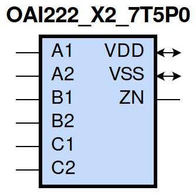
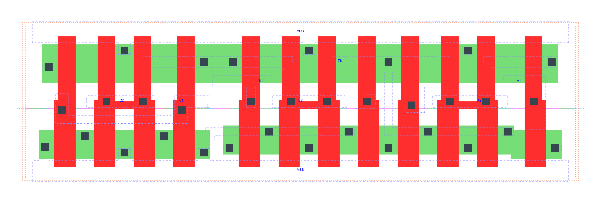

=======================================
gf180mcu_fd_sc_mcu7t5v0__oai222_x2
=======================================

**gf180mcu_fd_sc_mcu7t5v0__oai222_x2 symbol**

**gf180mcu_fd_sc_mcu7t5v0__oai222_x2 schematic**

.. image:: sc7_sch/OAI222_X2_sch.png
    :height: 300px
    :width: 500 px
    :align: center
    :alt: gf180mcu_fd_sc_mcu7t5v0__oai222_x2 schematic

**gf180mcu_fd_sc_mcu7t5v0__oai222_x2 layout**

.. include:: images.rst

OAI222_X2 is a three 2-input OR into 3-input NAND, NAND[OR(A1,A2),OR(B1,B2),OR(C1,C2)], 2X drive strength

|
| Attributes

============= ======================
**Attribute** **Value**
area          59.270400 µm\ :sup:`2`
============= ======================

|
| OUTPUT FUNCTIONS

============== ===========================================
**Output Pin** **Function**
ZN             (((!A1)&(!A2))|((!B1)&(!B2))|((!C1)&(!C2)))
============== ===========================================

|
| TRUTH TABLE FOR ZN

====== ====== ====== ====== ====== ====== ======
**A1** **A2** **B1** **B2** **C1** **C2** **ZN**
0      0      ?      ?      ?      ?      1
?      ?      0      0      ?      ?      1
?      ?      ?      ?      0      0      1
1      ?      1      ?      1      ?      0
1      ?      1      ?      ?      1      0
1      ?      ?      1      1      ?      0
1      ?      ?      1      ?      1      0
?      1      1      ?      1      ?      0
?      1      1      ?      ?      1      0
?      1      ?      1      1      ?      0
?      1      ?      1      ?      1      0
====== ====== ====== ====== ====== ====== ======

|
| FUNCTIONAL SCHEMATIC
| |image548|
| PIN CAPACITANCE (pf)

======= ======== ====================
**Pin** **Type** **Capacitance (pf)**
C1      input    0.0095
C2      input    0.0085
B1      input    0.0096
B2      input    0.0085
A1      input    0.0097
A2      input    0.0087
======= ======== ====================

|
| DELAY AND OUTPUT TRANSITION TIME corresponding to min slew and load

+---------------+------------+--------------------+--------------+-------------------+----------------+---------------+
| **Input Pin** | **Output** | **When Condition** | **Tin (ns)** | **Out Load (pf)** | **Delay (ns)** | **Tout (ns)** |
+---------------+------------+--------------------+--------------+-------------------+----------------+---------------+
| C1(LH)        | ZN(HL)     | !A1&A2&!B1&B2&!C2  | 0.0100       | 0.0010            | 0.2404         | 0.1239        |
+---------------+------------+--------------------+--------------+-------------------+----------------+---------------+
| C1(LH)        | ZN(HL)     | !A1&A2&B1&!B2&!C2  | 0.0100       | 0.0010            | 0.2082         | 0.1025        |
+---------------+------------+--------------------+--------------+-------------------+----------------+---------------+
| C1(LH)        | ZN(HL)     | !A1&A2&B1&B2&!C2   | 0.0100       | 0.0010            | 0.1878         | 0.0864        |
+---------------+------------+--------------------+--------------+-------------------+----------------+---------------+
| C1(LH)        | ZN(HL)     | A1&!A2&!B1&B2&!C2  | 0.0100       | 0.0010            | 0.2074         | 0.1020        |
+---------------+------------+--------------------+--------------+-------------------+----------------+---------------+
| C1(LH)        | ZN(HL)     | A1&!A2&B1&!B2&!C2  | 0.0100       | 0.0010            | 0.1764         | 0.0806        |
+---------------+------------+--------------------+--------------+-------------------+----------------+---------------+
| C1(LH)        | ZN(HL)     | A1&!A2&B1&B2&!C2   | 0.0100       | 0.0010            | 0.1608         | 0.0684        |
+---------------+------------+--------------------+--------------+-------------------+----------------+---------------+
| C1(LH)        | ZN(HL)     | A1&A2&!B1&B2&!C2   | 0.0100       | 0.0010            | 0.1825         | 0.1019        |
+---------------+------------+--------------------+--------------+-------------------+----------------+---------------+
| C1(LH)        | ZN(HL)     | A1&A2&B1&!B2&!C2   | 0.0100       | 0.0010            | 0.1572         | 0.0834        |
+---------------+------------+--------------------+--------------+-------------------+----------------+---------------+
| C1(LH)        | ZN(HL)     | A1&A2&B1&B2&!C2    | 0.0100       | 0.0010            | 0.1375         | 0.0672        |
+---------------+------------+--------------------+--------------+-------------------+----------------+---------------+
| C1(HL)        | ZN(LH)     | !A1&A2&!B1&B2&!C2  | 0.0100       | 0.0010            | 0.3576         | 0.3610        |
+---------------+------------+--------------------+--------------+-------------------+----------------+---------------+
| C1(HL)        | ZN(LH)     | !A1&A2&B1&!B2&!C2  | 0.0100       | 0.0010            | 0.3392         | 0.3123        |
+---------------+------------+--------------------+--------------+-------------------+----------------+---------------+
| C1(HL)        | ZN(LH)     | !A1&A2&B1&B2&!C2   | 0.0100       | 0.0010            | 0.3598         | 0.3278        |
+---------------+------------+--------------------+--------------+-------------------+----------------+---------------+
| C1(HL)        | ZN(LH)     | A1&!A2&!B1&B2&!C2  | 0.0100       | 0.0010            | 0.3390         | 0.3103        |
+---------------+------------+--------------------+--------------+-------------------+----------------+---------------+
| C1(HL)        | ZN(LH)     | A1&!A2&B1&!B2&!C2  | 0.0100       | 0.0010            | 0.3221         | 0.2609        |
+---------------+------------+--------------------+--------------+-------------------+----------------+---------------+
| C1(HL)        | ZN(LH)     | A1&!A2&B1&B2&!C2   | 0.0100       | 0.0010            | 0.3420         | 0.2757        |
+---------------+------------+--------------------+--------------+-------------------+----------------+---------------+
| C1(HL)        | ZN(LH)     | A1&A2&!B1&B2&!C2   | 0.0100       | 0.0010            | 0.3702         | 0.3309        |
+---------------+------------+--------------------+--------------+-------------------+----------------+---------------+
| C1(HL)        | ZN(LH)     | A1&A2&B1&!B2&!C2   | 0.0100       | 0.0010            | 0.3547         | 0.2831        |
+---------------+------------+--------------------+--------------+-------------------+----------------+---------------+
| C1(HL)        | ZN(LH)     | A1&A2&B1&B2&!C2    | 0.0100       | 0.0010            | 0.3769         | 0.2992        |
+---------------+------------+--------------------+--------------+-------------------+----------------+---------------+
| C2(LH)        | ZN(HL)     | !A1&A2&!B1&B2&!C1  | 0.0100       | 0.0010            | 0.2710         | 0.1455        |
+---------------+------------+--------------------+--------------+-------------------+----------------+---------------+
| C2(LH)        | ZN(HL)     | !A1&A2&B1&!B2&!C1  | 0.0100       | 0.0010            | 0.2379         | 0.1242        |
+---------------+------------+--------------------+--------------+-------------------+----------------+---------------+
| C2(LH)        | ZN(HL)     | !A1&A2&B1&B2&!C1   | 0.0100       | 0.0010            | 0.2131         | 0.1039        |
+---------------+------------+--------------------+--------------+-------------------+----------------+---------------+
| C2(LH)        | ZN(HL)     | A1&!A2&!B1&B2&!C1  | 0.0100       | 0.0010            | 0.2368         | 0.1234        |
+---------------+------------+--------------------+--------------+-------------------+----------------+---------------+
| C2(LH)        | ZN(HL)     | A1&!A2&B1&!B2&!C1  | 0.0100       | 0.0010            | 0.2046         | 0.1022        |
+---------------+------------+--------------------+--------------+-------------------+----------------+---------------+
| C2(LH)        | ZN(HL)     | A1&!A2&B1&B2&!C1   | 0.0100       | 0.0010            | 0.1849         | 0.0864        |
+---------------+------------+--------------------+--------------+-------------------+----------------+---------------+
| C2(LH)        | ZN(HL)     | A1&A2&!B1&B2&!C1   | 0.0100       | 0.0010            | 0.2071         | 0.1201        |
+---------------+------------+--------------------+--------------+-------------------+----------------+---------------+
| C2(LH)        | ZN(HL)     | A1&A2&B1&!B2&!C1   | 0.0100       | 0.0010            | 0.1803         | 0.1023        |
+---------------+------------+--------------------+--------------+-------------------+----------------+---------------+
| C2(LH)        | ZN(HL)     | A1&A2&B1&B2&!C1    | 0.0100       | 0.0010            | 0.1556         | 0.0817        |
+---------------+------------+--------------------+--------------+-------------------+----------------+---------------+
| C2(HL)        | ZN(LH)     | !A1&A2&!B1&B2&!C1  | 0.0100       | 0.0010            | 0.3842         | 0.3612        |
+---------------+------------+--------------------+--------------+-------------------+----------------+---------------+
| C2(HL)        | ZN(LH)     | !A1&A2&B1&!B2&!C1  | 0.0100       | 0.0010            | 0.3658         | 0.3123        |
+---------------+------------+--------------------+--------------+-------------------+----------------+---------------+
| C2(HL)        | ZN(LH)     | !A1&A2&B1&B2&!C1   | 0.0100       | 0.0010            | 0.3864         | 0.3278        |
+---------------+------------+--------------------+--------------+-------------------+----------------+---------------+
| C2(HL)        | ZN(LH)     | A1&!A2&!B1&B2&!C1  | 0.0100       | 0.0010            | 0.3656         | 0.3104        |
+---------------+------------+--------------------+--------------+-------------------+----------------+---------------+
| C2(HL)        | ZN(LH)     | A1&!A2&B1&!B2&!C1  | 0.0100       | 0.0010            | 0.3490         | 0.2606        |
+---------------+------------+--------------------+--------------+-------------------+----------------+---------------+
| C2(HL)        | ZN(LH)     | A1&!A2&B1&B2&!C1   | 0.0100       | 0.0010            | 0.3689         | 0.2756        |
+---------------+------------+--------------------+--------------+-------------------+----------------+---------------+
| C2(HL)        | ZN(LH)     | A1&A2&!B1&B2&!C1   | 0.0100       | 0.0010            | 0.3968         | 0.3309        |
+---------------+------------+--------------------+--------------+-------------------+----------------+---------------+
| C2(HL)        | ZN(LH)     | A1&A2&B1&!B2&!C1   | 0.0100       | 0.0010            | 0.3813         | 0.2829        |
+---------------+------------+--------------------+--------------+-------------------+----------------+---------------+
| C2(HL)        | ZN(LH)     | A1&A2&B1&B2&!C1    | 0.0100       | 0.0010            | 0.4033         | 0.2993        |
+---------------+------------+--------------------+--------------+-------------------+----------------+---------------+
| B1(LH)        | ZN(HL)     | !A1&A2&!B2&!C1&C2  | 0.0100       | 0.0010            | 0.2133         | 0.1241        |
+---------------+------------+--------------------+--------------+-------------------+----------------+---------------+
| B1(LH)        | ZN(HL)     | !A1&A2&!B2&C1&!C2  | 0.0100       | 0.0010            | 0.1804         | 0.1026        |
+---------------+------------+--------------------+--------------+-------------------+----------------+---------------+
| B1(LH)        | ZN(HL)     | !A1&A2&!B2&C1&C2   | 0.0100       | 0.0010            | 0.1571         | 0.0846        |
+---------------+------------+--------------------+--------------+-------------------+----------------+---------------+
| B1(LH)        | ZN(HL)     | A1&!A2&!B2&!C1&C2  | 0.0100       | 0.0010            | 0.1797         | 0.1021        |
+---------------+------------+--------------------+--------------+-------------------+----------------+---------------+
| B1(LH)        | ZN(HL)     | A1&!A2&!B2&C1&!C2  | 0.0100       | 0.0010            | 0.1487         | 0.0808        |
+---------------+------------+--------------------+--------------+-------------------+----------------+---------------+
| B1(LH)        | ZN(HL)     | A1&!A2&!B2&C1&C2   | 0.0100       | 0.0010            | 0.1304         | 0.0660        |
+---------------+------------+--------------------+--------------+-------------------+----------------+---------------+
| B1(LH)        | ZN(HL)     | A1&A2&!B2&!C1&C2   | 0.0100       | 0.0010            | 0.1548         | 0.1022        |
+---------------+------------+--------------------+--------------+-------------------+----------------+---------------+
| B1(LH)        | ZN(HL)     | A1&A2&!B2&C1&!C2   | 0.0100       | 0.0010            | 0.1293         | 0.0835        |
+---------------+------------+--------------------+--------------+-------------------+----------------+---------------+
| B1(LH)        | ZN(HL)     | A1&A2&!B2&C1&C2    | 0.0100       | 0.0010            | 0.1114         | 0.0641        |
+---------------+------------+--------------------+--------------+-------------------+----------------+---------------+
| B1(HL)        | ZN(LH)     | !A1&A2&!B2&!C1&C2  | 0.0100       | 0.0010            | 0.2837         | 0.2969        |
+---------------+------------+--------------------+--------------+-------------------+----------------+---------------+
| B1(HL)        | ZN(LH)     | !A1&A2&!B2&C1&!C2  | 0.0100       | 0.0010            | 0.2687         | 0.2495        |
+---------------+------------+--------------------+--------------+-------------------+----------------+---------------+
| B1(HL)        | ZN(LH)     | !A1&A2&!B2&C1&C2   | 0.0100       | 0.0010            | 0.2673         | 0.2495        |
+---------------+------------+--------------------+--------------+-------------------+----------------+---------------+
| B1(HL)        | ZN(LH)     | A1&!A2&!B2&!C1&C2  | 0.0100       | 0.0010            | 0.2687         | 0.2485        |
+---------------+------------+--------------------+--------------+-------------------+----------------+---------------+
| B1(HL)        | ZN(LH)     | A1&!A2&!B2&C1&!C2  | 0.0100       | 0.0010            | 0.2556         | 0.2016        |
+---------------+------------+--------------------+--------------+-------------------+----------------+---------------+
| B1(HL)        | ZN(LH)     | A1&!A2&!B2&C1&C2   | 0.0100       | 0.0010            | 0.2543         | 0.2020        |
+---------------+------------+--------------------+--------------+-------------------+----------------+---------------+
| B1(HL)        | ZN(LH)     | A1&A2&!B2&!C1&C2   | 0.0100       | 0.0010            | 0.2946         | 0.2680        |
+---------------+------------+--------------------+--------------+-------------------+----------------+---------------+
| B1(HL)        | ZN(LH)     | A1&A2&!B2&C1&!C2   | 0.0100       | 0.0010            | 0.2820         | 0.2217        |
+---------------+------------+--------------------+--------------+-------------------+----------------+---------------+
| B1(HL)        | ZN(LH)     | A1&A2&!B2&C1&C2    | 0.0100       | 0.0010            | 0.2802         | 0.2217        |
+---------------+------------+--------------------+--------------+-------------------+----------------+---------------+
| B2(HL)        | ZN(LH)     | !A1&A2&!B1&!C1&C2  | 0.0100       | 0.0010            | 0.3097         | 0.2967        |
+---------------+------------+--------------------+--------------+-------------------+----------------+---------------+
| B2(HL)        | ZN(LH)     | !A1&A2&!B1&C1&!C2  | 0.0100       | 0.0010            | 0.2946         | 0.2494        |
+---------------+------------+--------------------+--------------+-------------------+----------------+---------------+
| B2(HL)        | ZN(LH)     | !A1&A2&!B1&C1&C2   | 0.0100       | 0.0010            | 0.2933         | 0.2494        |
+---------------+------------+--------------------+--------------+-------------------+----------------+---------------+
| B2(HL)        | ZN(LH)     | A1&!A2&!B1&!C1&C2  | 0.0100       | 0.0010            | 0.2948         | 0.2485        |
+---------------+------------+--------------------+--------------+-------------------+----------------+---------------+
| B2(HL)        | ZN(LH)     | A1&!A2&!B1&C1&!C2  | 0.0100       | 0.0010            | 0.2816         | 0.2019        |
+---------------+------------+--------------------+--------------+-------------------+----------------+---------------+
| B2(HL)        | ZN(LH)     | A1&!A2&!B1&C1&C2   | 0.0100       | 0.0010            | 0.2803         | 0.2015        |
+---------------+------------+--------------------+--------------+-------------------+----------------+---------------+
| B2(HL)        | ZN(LH)     | A1&A2&!B1&!C1&C2   | 0.0100       | 0.0010            | 0.3206         | 0.2680        |
+---------------+------------+--------------------+--------------+-------------------+----------------+---------------+
| B2(HL)        | ZN(LH)     | A1&A2&!B1&C1&!C2   | 0.0100       | 0.0010            | 0.3080         | 0.2217        |
+---------------+------------+--------------------+--------------+-------------------+----------------+---------------+
| B2(HL)        | ZN(LH)     | A1&A2&!B1&C1&C2    | 0.0100       | 0.0010            | 0.3066         | 0.2217        |
+---------------+------------+--------------------+--------------+-------------------+----------------+---------------+
| B2(LH)        | ZN(HL)     | !A1&A2&!B1&!C1&C2  | 0.0100       | 0.0010            | 0.2432         | 0.1457        |
+---------------+------------+--------------------+--------------+-------------------+----------------+---------------+
| B2(LH)        | ZN(HL)     | !A1&A2&!B1&C1&!C2  | 0.0100       | 0.0010            | 0.2095         | 0.1238        |
+---------------+------------+--------------------+--------------+-------------------+----------------+---------------+
| B2(LH)        | ZN(HL)     | !A1&A2&!B1&C1&C2   | 0.0100       | 0.0010            | 0.1818         | 0.1024        |
+---------------+------------+--------------------+--------------+-------------------+----------------+---------------+
| B2(LH)        | ZN(HL)     | A1&!A2&!B1&!C1&C2  | 0.0100       | 0.0010            | 0.2090         | 0.1234        |
+---------------+------------+--------------------+--------------+-------------------+----------------+---------------+
| B2(LH)        | ZN(HL)     | A1&!A2&!B1&C1&!C2  | 0.0100       | 0.0010            | 0.1765         | 0.1021        |
+---------------+------------+--------------------+--------------+-------------------+----------------+---------------+
| B2(LH)        | ZN(HL)     | A1&!A2&!B1&C1&C2   | 0.0100       | 0.0010            | 0.1536         | 0.0840        |
+---------------+------------+--------------------+--------------+-------------------+----------------+---------------+
| B2(LH)        | ZN(HL)     | A1&A2&!B1&!C1&C2   | 0.0100       | 0.0010            | 0.1790         | 0.1203        |
+---------------+------------+--------------------+--------------+-------------------+----------------+---------------+
| B2(LH)        | ZN(HL)     | A1&A2&!B1&C1&!C2   | 0.0100       | 0.0010            | 0.1519         | 0.1019        |
+---------------+------------+--------------------+--------------+-------------------+----------------+---------------+
| B2(LH)        | ZN(HL)     | A1&A2&!B1&C1&C2    | 0.0100       | 0.0010            | 0.1292         | 0.0786        |
+---------------+------------+--------------------+--------------+-------------------+----------------+---------------+
| A1(HL)        | ZN(LH)     | !A2&!B1&B2&!C1&C2  | 0.0100       | 0.0010            | 0.1808         | 0.2154        |
+---------------+------------+--------------------+--------------+-------------------+----------------+---------------+
| A1(HL)        | ZN(LH)     | !A2&!B1&B2&C1&!C2  | 0.0100       | 0.0010            | 0.1693         | 0.1691        |
+---------------+------------+--------------------+--------------+-------------------+----------------+---------------+
| A1(HL)        | ZN(LH)     | !A2&!B1&B2&C1&C2   | 0.0100       | 0.0010            | 0.1694         | 0.1694        |
+---------------+------------+--------------------+--------------+-------------------+----------------+---------------+
| A1(HL)        | ZN(LH)     | !A2&B1&!B2&!C1&C2  | 0.0100       | 0.0010            | 0.1693         | 0.1700        |
+---------------+------------+--------------------+--------------+-------------------+----------------+---------------+
| A1(HL)        | ZN(LH)     | !A2&B1&!B2&C1&!C2  | 0.0100       | 0.0010            | 0.1594         | 0.1265        |
+---------------+------------+--------------------+--------------+-------------------+----------------+---------------+
| A1(HL)        | ZN(LH)     | !A2&B1&!B2&C1&C2   | 0.0100       | 0.0010            | 0.1592         | 0.1266        |
+---------------+------------+--------------------+--------------+-------------------+----------------+---------------+
| A1(HL)        | ZN(LH)     | !A2&B1&B2&!C1&C2   | 0.0100       | 0.0010            | 0.1684         | 0.1702        |
+---------------+------------+--------------------+--------------+-------------------+----------------+---------------+
| A1(HL)        | ZN(LH)     | !A2&B1&B2&C1&!C2   | 0.0100       | 0.0010            | 0.1584         | 0.1265        |
+---------------+------------+--------------------+--------------+-------------------+----------------+---------------+
| A1(HL)        | ZN(LH)     | !A2&B1&B2&C1&C2    | 0.0100       | 0.0010            | 0.1583         | 0.1265        |
+---------------+------------+--------------------+--------------+-------------------+----------------+---------------+
| A1(LH)        | ZN(HL)     | !A2&!B1&B2&!C1&C2  | 0.0100       | 0.0010            | 0.1560         | 0.1226        |
+---------------+------------+--------------------+--------------+-------------------+----------------+---------------+
| A1(LH)        | ZN(HL)     | !A2&!B1&B2&C1&!C2  | 0.0100       | 0.0010            | 0.1235         | 0.1003        |
+---------------+------------+--------------------+--------------+-------------------+----------------+---------------+
| A1(LH)        | ZN(HL)     | !A2&!B1&B2&C1&C2   | 0.0100       | 0.0010            | 0.1130         | 0.0836        |
+---------------+------------+--------------------+--------------+-------------------+----------------+---------------+
| A1(LH)        | ZN(HL)     | !A2&B1&!B2&!C1&C2  | 0.0100       | 0.0010            | 0.1237         | 0.1004        |
+---------------+------------+--------------------+--------------+-------------------+----------------+---------------+
| A1(LH)        | ZN(HL)     | !A2&B1&!B2&C1&!C2  | 0.0100       | 0.0010            | 0.0934         | 0.0766        |
+---------------+------------+--------------------+--------------+-------------------+----------------+---------------+
| A1(LH)        | ZN(HL)     | !A2&B1&!B2&C1&C2   | 0.0100       | 0.0010            | 0.0874         | 0.0648        |
+---------------+------------+--------------------+--------------+-------------------+----------------+---------------+
| A1(LH)        | ZN(HL)     | !A2&B1&B2&!C1&C2   | 0.0100       | 0.0010            | 0.1076         | 0.0828        |
+---------------+------------+--------------------+--------------+-------------------+----------------+---------------+
| A1(LH)        | ZN(HL)     | !A2&B1&B2&C1&!C2   | 0.0100       | 0.0010            | 0.0826         | 0.0629        |
+---------------+------------+--------------------+--------------+-------------------+----------------+---------------+
| A1(LH)        | ZN(HL)     | !A2&B1&B2&C1&C2    | 0.0100       | 0.0010            | 0.0767         | 0.0519        |
+---------------+------------+--------------------+--------------+-------------------+----------------+---------------+
| A2(HL)        | ZN(LH)     | !A1&!B1&B2&!C1&C2  | 0.0100       | 0.0010            | 0.2088         | 0.2151        |
+---------------+------------+--------------------+--------------+-------------------+----------------+---------------+
| A2(HL)        | ZN(LH)     | !A1&!B1&B2&C1&!C2  | 0.0100       | 0.0010            | 0.1971         | 0.1694        |
+---------------+------------+--------------------+--------------+-------------------+----------------+---------------+
| A2(HL)        | ZN(LH)     | !A1&!B1&B2&C1&C2   | 0.0100       | 0.0010            | 0.1971         | 0.1694        |
+---------------+------------+--------------------+--------------+-------------------+----------------+---------------+
| A2(HL)        | ZN(LH)     | !A1&B1&!B2&!C1&C2  | 0.0100       | 0.0010            | 0.1970         | 0.1701        |
+---------------+------------+--------------------+--------------+-------------------+----------------+---------------+
| A2(HL)        | ZN(LH)     | !A1&B1&!B2&C1&!C2  | 0.0100       | 0.0010            | 0.1871         | 0.1266        |
+---------------+------------+--------------------+--------------+-------------------+----------------+---------------+
| A2(HL)        | ZN(LH)     | !A1&B1&!B2&C1&C2   | 0.0100       | 0.0010            | 0.1870         | 0.1266        |
+---------------+------------+--------------------+--------------+-------------------+----------------+---------------+
| A2(HL)        | ZN(LH)     | !A1&B1&B2&!C1&C2   | 0.0100       | 0.0010            | 0.1961         | 0.1701        |
+---------------+------------+--------------------+--------------+-------------------+----------------+---------------+
| A2(HL)        | ZN(LH)     | !A1&B1&B2&C1&!C2   | 0.0100       | 0.0010            | 0.1865         | 0.1266        |
+---------------+------------+--------------------+--------------+-------------------+----------------+---------------+
| A2(HL)        | ZN(LH)     | !A1&B1&B2&C1&C2    | 0.0100       | 0.0010            | 0.1864         | 0.1266        |
+---------------+------------+--------------------+--------------+-------------------+----------------+---------------+
| A2(LH)        | ZN(HL)     | !A1&!B1&B2&!C1&C2  | 0.0100       | 0.0010            | 0.1873         | 0.1454        |
+---------------+------------+--------------------+--------------+-------------------+----------------+---------------+
| A2(LH)        | ZN(HL)     | !A1&!B1&B2&C1&!C2  | 0.0100       | 0.0010            | 0.1536         | 0.1232        |
+---------------+------------+--------------------+--------------+-------------------+----------------+---------------+
| A2(LH)        | ZN(HL)     | !A1&!B1&B2&C1&C2   | 0.0100       | 0.0010            | 0.1388         | 0.1024        |
+---------------+------------+--------------------+--------------+-------------------+----------------+---------------+
| A2(LH)        | ZN(HL)     | !A1&B1&!B2&!C1&C2  | 0.0100       | 0.0010            | 0.1541         | 0.1235        |
+---------------+------------+--------------------+--------------+-------------------+----------------+---------------+
| A2(LH)        | ZN(HL)     | !A1&B1&!B2&C1&!C2  | 0.0100       | 0.0010            | 0.1214         | 0.1011        |
+---------------+------------+--------------------+--------------+-------------------+----------------+---------------+
| A2(LH)        | ZN(HL)     | !A1&B1&!B2&C1&C2   | 0.0100       | 0.0010            | 0.1112         | 0.0845        |
+---------------+------------+--------------------+--------------+-------------------+----------------+---------------+
| A2(LH)        | ZN(HL)     | !A1&B1&B2&!C1&C2   | 0.0100       | 0.0010            | 0.1331         | 0.1026        |
+---------------+------------+--------------------+--------------+-------------------+----------------+---------------+
| A2(LH)        | ZN(HL)     | !A1&B1&B2&C1&!C2   | 0.0100       | 0.0010            | 0.1056         | 0.0838        |
+---------------+------------+--------------------+--------------+-------------------+----------------+---------------+
| A2(LH)        | ZN(HL)     | !A1&B1&B2&C1&C2    | 0.0100       | 0.0010            | 0.0956         | 0.0676        |
+---------------+------------+--------------------+--------------+-------------------+----------------+---------------+

|
| DYNAMIC ENERGY

+---------------+---------------------+--------------+------------+-------------------+---------------------+
| **Input Pin** | **When Condition**  | **Tin (ns)** | **Output** | **Out Load (pf)** | **Energy (uW/MHz)** |
+---------------+---------------------+--------------+------------+-------------------+---------------------+
| A1            | !A2&!B1&B2&!C1&C2   | 0.0100       | ZN(LH)     | 0.0010            | 0.4213              |
+---------------+---------------------+--------------+------------+-------------------+---------------------+
| A1            | !A2&!B1&B2&C1&!C2   | 0.0100       | ZN(LH)     | 0.0010            | 0.3677              |
+---------------+---------------------+--------------+------------+-------------------+---------------------+
| A1            | !A2&!B1&B2&C1&C2    | 0.0100       | ZN(LH)     | 0.0010            | 0.3678              |
+---------------+---------------------+--------------+------------+-------------------+---------------------+
| A1            | !A2&B1&!B2&!C1&C2   | 0.0100       | ZN(LH)     | 0.0010            | 0.3681              |
+---------------+---------------------+--------------+------------+-------------------+---------------------+
| A1            | !A2&B1&!B2&C1&!C2   | 0.0100       | ZN(LH)     | 0.0010            | 0.3144              |
+---------------+---------------------+--------------+------------+-------------------+---------------------+
| A1            | !A2&B1&!B2&C1&C2    | 0.0100       | ZN(LH)     | 0.0010            | 0.3144              |
+---------------+---------------------+--------------+------------+-------------------+---------------------+
| A1            | !A2&B1&B2&!C1&C2    | 0.0100       | ZN(LH)     | 0.0010            | 0.3667              |
+---------------+---------------------+--------------+------------+-------------------+---------------------+
| A1            | !A2&B1&B2&C1&!C2    | 0.0100       | ZN(LH)     | 0.0010            | 0.3132              |
+---------------+---------------------+--------------+------------+-------------------+---------------------+
| A1            | !A2&B1&B2&C1&C2     | 0.0100       | ZN(LH)     | 0.0010            | 0.3130              |
+---------------+---------------------+--------------+------------+-------------------+---------------------+
| B2            | !A1&A2&!B1&!C1&C2   | 0.0100       | ZN(LH)     | 0.0010            | 0.6763              |
+---------------+---------------------+--------------+------------+-------------------+---------------------+
| B2            | !A1&A2&!B1&C1&!C2   | 0.0100       | ZN(LH)     | 0.0010            | 0.6228              |
+---------------+---------------------+--------------+------------+-------------------+---------------------+
| B2            | !A1&A2&!B1&C1&C2    | 0.0100       | ZN(LH)     | 0.0010            | 0.6209              |
+---------------+---------------------+--------------+------------+-------------------+---------------------+
| B2            | A1&!A2&!B1&!C1&C2   | 0.0100       | ZN(LH)     | 0.0010            | 0.6227              |
+---------------+---------------------+--------------+------------+-------------------+---------------------+
| B2            | A1&!A2&!B1&C1&!C2   | 0.0100       | ZN(LH)     | 0.0010            | 0.5688              |
+---------------+---------------------+--------------+------------+-------------------+---------------------+
| B2            | A1&!A2&!B1&C1&C2    | 0.0100       | ZN(LH)     | 0.0010            | 0.5671              |
+---------------+---------------------+--------------+------------+-------------------+---------------------+
| B2            | A1&A2&!B1&!C1&C2    | 0.0100       | ZN(LH)     | 0.0010            | 0.6678              |
+---------------+---------------------+--------------+------------+-------------------+---------------------+
| B2            | A1&A2&!B1&C1&!C2    | 0.0100       | ZN(LH)     | 0.0010            | 0.6142              |
+---------------+---------------------+--------------+------------+-------------------+---------------------+
| B2            | A1&A2&!B1&C1&C2     | 0.0100       | ZN(LH)     | 0.0010            | 0.6122              |
+---------------+---------------------+--------------+------------+-------------------+---------------------+
| B1            | !A1&A2&!B2&!C1&C2   | 0.0100       | ZN(HL)     | 0.0010            | 0.1744              |
+---------------+---------------------+--------------+------------+-------------------+---------------------+
| B1            | !A1&A2&!B2&C1&!C2   | 0.0100       | ZN(HL)     | 0.0010            | 0.1245              |
+---------------+---------------------+--------------+------------+-------------------+---------------------+
| B1            | !A1&A2&!B2&C1&C2    | 0.0100       | ZN(HL)     | 0.0010            | 0.1245              |
+---------------+---------------------+--------------+------------+-------------------+---------------------+
| B1            | A1&!A2&!B2&!C1&C2   | 0.0100       | ZN(HL)     | 0.0010            | 0.1226              |
+---------------+---------------------+--------------+------------+-------------------+---------------------+
| B1            | A1&!A2&!B2&C1&!C2   | 0.0100       | ZN(HL)     | 0.0010            | 0.0728              |
+---------------+---------------------+--------------+------------+-------------------+---------------------+
| B1            | A1&!A2&!B2&C1&C2    | 0.0100       | ZN(HL)     | 0.0010            | 0.0726              |
+---------------+---------------------+--------------+------------+-------------------+---------------------+
| B1            | A1&A2&!B2&!C1&C2    | 0.0100       | ZN(HL)     | 0.0010            | 0.1227              |
+---------------+---------------------+--------------+------------+-------------------+---------------------+
| B1            | A1&A2&!B2&C1&!C2    | 0.0100       | ZN(HL)     | 0.0010            | 0.0727              |
+---------------+---------------------+--------------+------------+-------------------+---------------------+
| B1            | A1&A2&!B2&C1&C2     | 0.0100       | ZN(HL)     | 0.0010            | 0.0726              |
+---------------+---------------------+--------------+------------+-------------------+---------------------+
| A2            | !A1&!B1&B2&!C1&C2   | 0.0100       | ZN(LH)     | 0.0010            | 0.4758              |
+---------------+---------------------+--------------+------------+-------------------+---------------------+
| A2            | !A1&!B1&B2&C1&!C2   | 0.0100       | ZN(LH)     | 0.0010            | 0.4221              |
+---------------+---------------------+--------------+------------+-------------------+---------------------+
| A2            | !A1&!B1&B2&C1&C2    | 0.0100       | ZN(LH)     | 0.0010            | 0.4221              |
+---------------+---------------------+--------------+------------+-------------------+---------------------+
| A2            | !A1&B1&!B2&!C1&C2   | 0.0100       | ZN(LH)     | 0.0010            | 0.4224              |
+---------------+---------------------+--------------+------------+-------------------+---------------------+
| A2            | !A1&B1&!B2&C1&!C2   | 0.0100       | ZN(LH)     | 0.0010            | 0.3687              |
+---------------+---------------------+--------------+------------+-------------------+---------------------+
| A2            | !A1&B1&!B2&C1&C2    | 0.0100       | ZN(LH)     | 0.0010            | 0.3686              |
+---------------+---------------------+--------------+------------+-------------------+---------------------+
| A2            | !A1&B1&B2&!C1&C2    | 0.0100       | ZN(LH)     | 0.0010            | 0.4210              |
+---------------+---------------------+--------------+------------+-------------------+---------------------+
| A2            | !A1&B1&B2&C1&!C2    | 0.0100       | ZN(LH)     | 0.0010            | 0.3675              |
+---------------+---------------------+--------------+------------+-------------------+---------------------+
| A2            | !A1&B1&B2&C1&C2     | 0.0100       | ZN(LH)     | 0.0010            | 0.3673              |
+---------------+---------------------+--------------+------------+-------------------+---------------------+
| B1            | !A1&A2&!B2&!C1&C2   | 0.0100       | ZN(LH)     | 0.0010            | 0.6229              |
+---------------+---------------------+--------------+------------+-------------------+---------------------+
| B1            | !A1&A2&!B2&C1&!C2   | 0.0100       | ZN(LH)     | 0.0010            | 0.5693              |
+---------------+---------------------+--------------+------------+-------------------+---------------------+
| B1            | !A1&A2&!B2&C1&C2    | 0.0100       | ZN(LH)     | 0.0010            | 0.5673              |
+---------------+---------------------+--------------+------------+-------------------+---------------------+
| B1            | A1&!A2&!B2&!C1&C2   | 0.0100       | ZN(LH)     | 0.0010            | 0.5691              |
+---------------+---------------------+--------------+------------+-------------------+---------------------+
| B1            | A1&!A2&!B2&C1&!C2   | 0.0100       | ZN(LH)     | 0.0010            | 0.5154              |
+---------------+---------------------+--------------+------------+-------------------+---------------------+
| B1            | A1&!A2&!B2&C1&C2    | 0.0100       | ZN(LH)     | 0.0010            | 0.5134              |
+---------------+---------------------+--------------+------------+-------------------+---------------------+
| B1            | A1&A2&!B2&!C1&C2    | 0.0100       | ZN(LH)     | 0.0010            | 0.6143              |
+---------------+---------------------+--------------+------------+-------------------+---------------------+
| B1            | A1&A2&!B2&C1&!C2    | 0.0100       | ZN(LH)     | 0.0010            | 0.5605              |
+---------------+---------------------+--------------+------------+-------------------+---------------------+
| B1            | A1&A2&!B2&C1&C2     | 0.0100       | ZN(LH)     | 0.0010            | 0.5589              |
+---------------+---------------------+--------------+------------+-------------------+---------------------+
| C1            | !A1&A2&!B1&B2&!C2   | 0.0100       | ZN(HL)     | 0.0010            | 0.1731              |
+---------------+---------------------+--------------+------------+-------------------+---------------------+
| C1            | !A1&A2&B1&!B2&!C2   | 0.0100       | ZN(HL)     | 0.0010            | 0.1247              |
+---------------+---------------------+--------------+------------+-------------------+---------------------+
| C1            | !A1&A2&B1&B2&!C2    | 0.0100       | ZN(HL)     | 0.0010            | 0.1246              |
+---------------+---------------------+--------------+------------+-------------------+---------------------+
| C1            | A1&!A2&!B1&B2&!C2   | 0.0100       | ZN(HL)     | 0.0010            | 0.1213              |
+---------------+---------------------+--------------+------------+-------------------+---------------------+
| C1            | A1&!A2&B1&!B2&!C2   | 0.0100       | ZN(HL)     | 0.0010            | 0.0729              |
+---------------+---------------------+--------------+------------+-------------------+---------------------+
| C1            | A1&!A2&B1&B2&!C2    | 0.0100       | ZN(HL)     | 0.0010            | 0.0727              |
+---------------+---------------------+--------------+------------+-------------------+---------------------+
| C1            | A1&A2&!B1&B2&!C2    | 0.0100       | ZN(HL)     | 0.0010            | 0.1212              |
+---------------+---------------------+--------------+------------+-------------------+---------------------+
| C1            | A1&A2&B1&!B2&!C2    | 0.0100       | ZN(HL)     | 0.0010            | 0.0729              |
+---------------+---------------------+--------------+------------+-------------------+---------------------+
| C1            | A1&A2&B1&B2&!C2     | 0.0100       | ZN(HL)     | 0.0010            | 0.0728              |
+---------------+---------------------+--------------+------------+-------------------+---------------------+
| A2            | !A1&!B1&B2&!C1&C2   | 0.0100       | ZN(HL)     | 0.0010            | 0.2165              |
+---------------+---------------------+--------------+------------+-------------------+---------------------+
| A2            | !A1&!B1&B2&C1&!C2   | 0.0100       | ZN(HL)     | 0.0010            | 0.1668              |
+---------------+---------------------+--------------+------------+-------------------+---------------------+
| A2            | !A1&!B1&B2&C1&C2    | 0.0100       | ZN(HL)     | 0.0010            | 0.1667              |
+---------------+---------------------+--------------+------------+-------------------+---------------------+
| A2            | !A1&B1&!B2&!C1&C2   | 0.0100       | ZN(HL)     | 0.0010            | 0.1684              |
+---------------+---------------------+--------------+------------+-------------------+---------------------+
| A2            | !A1&B1&!B2&C1&!C2   | 0.0100       | ZN(HL)     | 0.0010            | 0.1189              |
+---------------+---------------------+--------------+------------+-------------------+---------------------+
| A2            | !A1&B1&!B2&C1&C2    | 0.0100       | ZN(HL)     | 0.0010            | 0.1188              |
+---------------+---------------------+--------------+------------+-------------------+---------------------+
| A2            | !A1&B1&B2&!C1&C2    | 0.0100       | ZN(HL)     | 0.0010            | 0.1684              |
+---------------+---------------------+--------------+------------+-------------------+---------------------+
| A2            | !A1&B1&B2&C1&!C2    | 0.0100       | ZN(HL)     | 0.0010            | 0.1189              |
+---------------+---------------------+--------------+------------+-------------------+---------------------+
| A2            | !A1&B1&B2&C1&C2     | 0.0100       | ZN(HL)     | 0.0010            | 0.1187              |
+---------------+---------------------+--------------+------------+-------------------+---------------------+
| C2            | !A1&A2&!B1&B2&!C1   | 0.0100       | ZN(HL)     | 0.0010            | 0.2158              |
+---------------+---------------------+--------------+------------+-------------------+---------------------+
| C2            | !A1&A2&B1&!B2&!C1   | 0.0100       | ZN(HL)     | 0.0010            | 0.1677              |
+---------------+---------------------+--------------+------------+-------------------+---------------------+
| C2            | !A1&A2&B1&B2&!C1    | 0.0100       | ZN(HL)     | 0.0010            | 0.1676              |
+---------------+---------------------+--------------+------------+-------------------+---------------------+
| C2            | A1&!A2&!B1&B2&!C1   | 0.0100       | ZN(HL)     | 0.0010            | 0.1641              |
+---------------+---------------------+--------------+------------+-------------------+---------------------+
| C2            | A1&!A2&B1&!B2&!C1   | 0.0100       | ZN(HL)     | 0.0010            | 0.1161              |
+---------------+---------------------+--------------+------------+-------------------+---------------------+
| C2            | A1&!A2&B1&B2&!C1    | 0.0100       | ZN(HL)     | 0.0010            | 0.1163              |
+---------------+---------------------+--------------+------------+-------------------+---------------------+
| C2            | A1&A2&!B1&B2&!C1    | 0.0100       | ZN(HL)     | 0.0010            | 0.1640              |
+---------------+---------------------+--------------+------------+-------------------+---------------------+
| C2            | A1&A2&B1&!B2&!C1    | 0.0100       | ZN(HL)     | 0.0010            | 0.1162              |
+---------------+---------------------+--------------+------------+-------------------+---------------------+
| C2            | A1&A2&B1&B2&!C1     | 0.0100       | ZN(HL)     | 0.0010            | 0.1161              |
+---------------+---------------------+--------------+------------+-------------------+---------------------+
| C1            | !A1&A2&!B1&B2&!C2   | 0.0100       | ZN(LH)     | 0.0010            | 0.7853              |
+---------------+---------------------+--------------+------------+-------------------+---------------------+
| C1            | !A1&A2&B1&!B2&!C2   | 0.0100       | ZN(LH)     | 0.0010            | 0.7318              |
+---------------+---------------------+--------------+------------+-------------------+---------------------+
| C1            | !A1&A2&B1&B2&!C2    | 0.0100       | ZN(LH)     | 0.0010            | 0.7754              |
+---------------+---------------------+--------------+------------+-------------------+---------------------+
| C1            | A1&!A2&!B1&B2&!C2   | 0.0100       | ZN(LH)     | 0.0010            | 0.7315              |
+---------------+---------------------+--------------+------------+-------------------+---------------------+
| C1            | A1&!A2&B1&!B2&!C2   | 0.0100       | ZN(LH)     | 0.0010            | 0.6782              |
+---------------+---------------------+--------------+------------+-------------------+---------------------+
| C1            | A1&!A2&B1&B2&!C2    | 0.0100       | ZN(LH)     | 0.0010            | 0.7218              |
+---------------+---------------------+--------------+------------+-------------------+---------------------+
| C1            | A1&A2&!B1&B2&!C2    | 0.0100       | ZN(LH)     | 0.0010            | 0.7757              |
+---------------+---------------------+--------------+------------+-------------------+---------------------+
| C1            | A1&A2&B1&!B2&!C2    | 0.0100       | ZN(LH)     | 0.0010            | 0.7224              |
+---------------+---------------------+--------------+------------+-------------------+---------------------+
| C1            | A1&A2&B1&B2&!C2     | 0.0100       | ZN(LH)     | 0.0010            | 0.7662              |
+---------------+---------------------+--------------+------------+-------------------+---------------------+
| C2            | !A1&A2&!B1&B2&!C1   | 0.0100       | ZN(LH)     | 0.0010            | 0.8388              |
+---------------+---------------------+--------------+------------+-------------------+---------------------+
| C2            | !A1&A2&B1&!B2&!C1   | 0.0100       | ZN(LH)     | 0.0010            | 0.7856              |
+---------------+---------------------+--------------+------------+-------------------+---------------------+
| C2            | !A1&A2&B1&B2&!C1    | 0.0100       | ZN(LH)     | 0.0010            | 0.8290              |
+---------------+---------------------+--------------+------------+-------------------+---------------------+
| C2            | A1&!A2&!B1&B2&!C1   | 0.0100       | ZN(LH)     | 0.0010            | 0.7852              |
+---------------+---------------------+--------------+------------+-------------------+---------------------+
| C2            | A1&!A2&B1&!B2&!C1   | 0.0100       | ZN(LH)     | 0.0010            | 0.7319              |
+---------------+---------------------+--------------+------------+-------------------+---------------------+
| C2            | A1&!A2&B1&B2&!C1    | 0.0100       | ZN(LH)     | 0.0010            | 0.7754              |
+---------------+---------------------+--------------+------------+-------------------+---------------------+
| C2            | A1&A2&!B1&B2&!C1    | 0.0100       | ZN(LH)     | 0.0010            | 0.8293              |
+---------------+---------------------+--------------+------------+-------------------+---------------------+
| C2            | A1&A2&B1&!B2&!C1    | 0.0100       | ZN(LH)     | 0.0010            | 0.7759              |
+---------------+---------------------+--------------+------------+-------------------+---------------------+
| C2            | A1&A2&B1&B2&!C1     | 0.0100       | ZN(LH)     | 0.0010            | 0.8197              |
+---------------+---------------------+--------------+------------+-------------------+---------------------+
| A1            | !A2&!B1&B2&!C1&C2   | 0.0100       | ZN(HL)     | 0.0010            | 0.1714              |
+---------------+---------------------+--------------+------------+-------------------+---------------------+
| A1            | !A2&!B1&B2&C1&!C2   | 0.0100       | ZN(HL)     | 0.0010            | 0.1215              |
+---------------+---------------------+--------------+------------+-------------------+---------------------+
| A1            | !A2&!B1&B2&C1&C2    | 0.0100       | ZN(HL)     | 0.0010            | 0.1215              |
+---------------+---------------------+--------------+------------+-------------------+---------------------+
| A1            | !A2&B1&!B2&!C1&C2   | 0.0100       | ZN(HL)     | 0.0010            | 0.1231              |
+---------------+---------------------+--------------+------------+-------------------+---------------------+
| A1            | !A2&B1&!B2&C1&!C2   | 0.0100       | ZN(HL)     | 0.0010            | 0.0732              |
+---------------+---------------------+--------------+------------+-------------------+---------------------+
| A1            | !A2&B1&!B2&C1&C2    | 0.0100       | ZN(HL)     | 0.0010            | 0.0732              |
+---------------+---------------------+--------------+------------+-------------------+---------------------+
| A1            | !A2&B1&B2&!C1&C2    | 0.0100       | ZN(HL)     | 0.0010            | 0.1230              |
+---------------+---------------------+--------------+------------+-------------------+---------------------+
| A1            | !A2&B1&B2&C1&!C2    | 0.0100       | ZN(HL)     | 0.0010            | 0.0732              |
+---------------+---------------------+--------------+------------+-------------------+---------------------+
| A1            | !A2&B1&B2&C1&C2     | 0.0100       | ZN(HL)     | 0.0010            | 0.0730              |
+---------------+---------------------+--------------+------------+-------------------+---------------------+
| B2            | !A1&A2&!B1&!C1&C2   | 0.0100       | ZN(HL)     | 0.0010            | 0.2156              |
+---------------+---------------------+--------------+------------+-------------------+---------------------+
| B2            | !A1&A2&!B1&C1&!C2   | 0.0100       | ZN(HL)     | 0.0010            | 0.1658              |
+---------------+---------------------+--------------+------------+-------------------+---------------------+
| B2            | !A1&A2&!B1&C1&C2    | 0.0100       | ZN(HL)     | 0.0010            | 0.1658              |
+---------------+---------------------+--------------+------------+-------------------+---------------------+
| B2            | A1&!A2&!B1&!C1&C2   | 0.0100       | ZN(HL)     | 0.0010            | 0.1638              |
+---------------+---------------------+--------------+------------+-------------------+---------------------+
| B2            | A1&!A2&!B1&C1&!C2   | 0.0100       | ZN(HL)     | 0.0010            | 0.1145              |
+---------------+---------------------+--------------+------------+-------------------+---------------------+
| B2            | A1&!A2&!B1&C1&C2    | 0.0100       | ZN(HL)     | 0.0010            | 0.1145              |
+---------------+---------------------+--------------+------------+-------------------+---------------------+
| B2            | A1&A2&!B1&!C1&C2    | 0.0100       | ZN(HL)     | 0.0010            | 0.1639              |
+---------------+---------------------+--------------+------------+-------------------+---------------------+
| B2            | A1&A2&!B1&C1&!C2    | 0.0100       | ZN(HL)     | 0.0010            | 0.1143              |
+---------------+---------------------+--------------+------------+-------------------+---------------------+
| B2            | A1&A2&!B1&C1&C2     | 0.0100       | ZN(HL)     | 0.0010            | 0.1143              |
+---------------+---------------------+--------------+------------+-------------------+---------------------+
| B2(LH)        | !A1&!A2&!B1&!C1&!C2 | 0.0100       | n/a        | n/a               | -0.0702             |
+---------------+---------------------+--------------+------------+-------------------+---------------------+
| B2(LH)        | !A1&!A2&!B1&!C1&C2  | 0.0100       | n/a        | n/a               | -0.0703             |
+---------------+---------------------+--------------+------------+-------------------+---------------------+
| B2(LH)        | !A1&!A2&!B1&C1&!C2  | 0.0100       | n/a        | n/a               | -0.0703             |
+---------------+---------------------+--------------+------------+-------------------+---------------------+
| B2(LH)        | !A1&!A2&!B1&C1&C2   | 0.0100       | n/a        | n/a               | -0.0703             |
+---------------+---------------------+--------------+------------+-------------------+---------------------+
| B2(LH)        | !A1&!A2&B1&!C1&!C2  | 0.0100       | n/a        | n/a               | -0.0681             |
+---------------+---------------------+--------------+------------+-------------------+---------------------+
| B2(LH)        | !A1&!A2&B1&!C1&C2   | 0.0100       | n/a        | n/a               | -0.0681             |
+---------------+---------------------+--------------+------------+-------------------+---------------------+
| B2(LH)        | !A1&!A2&B1&C1&!C2   | 0.0100       | n/a        | n/a               | -0.0681             |
+---------------+---------------------+--------------+------------+-------------------+---------------------+
| B2(LH)        | !A1&!A2&B1&C1&C2    | 0.0100       | n/a        | n/a               | -0.0681             |
+---------------+---------------------+--------------+------------+-------------------+---------------------+
| B2(LH)        | !A1&A2&!B1&!C1&!C2  | 0.0100       | n/a        | n/a               | 0.0294              |
+---------------+---------------------+--------------+------------+-------------------+---------------------+
| B2(LH)        | !A1&A2&B1&!C1&!C2   | 0.0100       | n/a        | n/a               | -0.0681             |
+---------------+---------------------+--------------+------------+-------------------+---------------------+
| B2(LH)        | A1&!A2&!B1&!C1&!C2  | 0.0100       | n/a        | n/a               | 0.0293              |
+---------------+---------------------+--------------+------------+-------------------+---------------------+
| B2(LH)        | A1&!A2&B1&!C1&!C2   | 0.0100       | n/a        | n/a               | -0.0681             |
+---------------+---------------------+--------------+------------+-------------------+---------------------+
| B2(LH)        | A1&A2&!B1&!C1&!C2   | 0.0100       | n/a        | n/a               | 0.0295              |
+---------------+---------------------+--------------+------------+-------------------+---------------------+
| B2(LH)        | A1&A2&B1&!C1&!C2    | 0.0100       | n/a        | n/a               | -0.0681             |
+---------------+---------------------+--------------+------------+-------------------+---------------------+
| B2(LH)        | !A1&A2&B1&!C1&C2    | 0.0100       | n/a        | n/a               | -0.0587             |
+---------------+---------------------+--------------+------------+-------------------+---------------------+
| B2(LH)        | !A1&A2&B1&C1&!C2    | 0.0100       | n/a        | n/a               | -0.0587             |
+---------------+---------------------+--------------+------------+-------------------+---------------------+
| B2(LH)        | !A1&A2&B1&C1&C2     | 0.0100       | n/a        | n/a               | -0.0587             |
+---------------+---------------------+--------------+------------+-------------------+---------------------+
| B2(LH)        | A1&!A2&B1&!C1&C2    | 0.0100       | n/a        | n/a               | -0.0587             |
+---------------+---------------------+--------------+------------+-------------------+---------------------+
| B2(LH)        | A1&!A2&B1&C1&!C2    | 0.0100       | n/a        | n/a               | -0.0587             |
+---------------+---------------------+--------------+------------+-------------------+---------------------+
| B2(LH)        | A1&!A2&B1&C1&C2     | 0.0100       | n/a        | n/a               | -0.0587             |
+---------------+---------------------+--------------+------------+-------------------+---------------------+
| B2(LH)        | A1&A2&B1&!C1&C2     | 0.0100       | n/a        | n/a               | -0.0587             |
+---------------+---------------------+--------------+------------+-------------------+---------------------+
| B2(LH)        | A1&A2&B1&C1&!C2     | 0.0100       | n/a        | n/a               | -0.0587             |
+---------------+---------------------+--------------+------------+-------------------+---------------------+
| B2(LH)        | A1&A2&B1&C1&C2      | 0.0100       | n/a        | n/a               | -0.0587             |
+---------------+---------------------+--------------+------------+-------------------+---------------------+
| C2(HL)        | !A1&!A2&!B1&!B2&!C1 | 0.0100       | n/a        | n/a               | 0.0706              |
+---------------+---------------------+--------------+------------+-------------------+---------------------+
| C2(HL)        | !A1&!A2&!B1&!B2&C1  | 0.0100       | n/a        | n/a               | 0.0704              |
+---------------+---------------------+--------------+------------+-------------------+---------------------+
| C2(HL)        | !A1&!A2&!B1&B2&!C1  | 0.0100       | n/a        | n/a               | 0.0709              |
+---------------+---------------------+--------------+------------+-------------------+---------------------+
| C2(HL)        | !A1&!A2&!B1&B2&C1   | 0.0100       | n/a        | n/a               | 0.0704              |
+---------------+---------------------+--------------+------------+-------------------+---------------------+
| C2(HL)        | !A1&!A2&B1&!B2&!C1  | 0.0100       | n/a        | n/a               | 0.0709              |
+---------------+---------------------+--------------+------------+-------------------+---------------------+
| C2(HL)        | !A1&!A2&B1&!B2&C1   | 0.0100       | n/a        | n/a               | 0.0704              |
+---------------+---------------------+--------------+------------+-------------------+---------------------+
| C2(HL)        | !A1&!A2&B1&B2&!C1   | 0.0100       | n/a        | n/a               | 0.0708              |
+---------------+---------------------+--------------+------------+-------------------+---------------------+
| C2(HL)        | !A1&!A2&B1&B2&C1    | 0.0100       | n/a        | n/a               | 0.0704              |
+---------------+---------------------+--------------+------------+-------------------+---------------------+
| C2(HL)        | !A1&A2&!B1&!B2&!C1  | 0.0100       | n/a        | n/a               | 0.0716              |
+---------------+---------------------+--------------+------------+-------------------+---------------------+
| C2(HL)        | !A1&A2&!B1&!B2&C1   | 0.0100       | n/a        | n/a               | 0.0704              |
+---------------+---------------------+--------------+------------+-------------------+---------------------+
| C2(HL)        | A1&!A2&!B1&!B2&!C1  | 0.0100       | n/a        | n/a               | 0.0716              |
+---------------+---------------------+--------------+------------+-------------------+---------------------+
| C2(HL)        | A1&!A2&!B1&!B2&C1   | 0.0100       | n/a        | n/a               | 0.0704              |
+---------------+---------------------+--------------+------------+-------------------+---------------------+
| C2(HL)        | A1&A2&!B1&!B2&!C1   | 0.0100       | n/a        | n/a               | 0.0715              |
+---------------+---------------------+--------------+------------+-------------------+---------------------+
| C2(HL)        | A1&A2&!B1&!B2&C1    | 0.0100       | n/a        | n/a               | 0.0704              |
+---------------+---------------------+--------------+------------+-------------------+---------------------+
| C2(HL)        | !A1&A2&!B1&B2&C1    | 0.0100       | n/a        | n/a               | 0.0704              |
+---------------+---------------------+--------------+------------+-------------------+---------------------+
| C2(HL)        | !A1&A2&B1&!B2&C1    | 0.0100       | n/a        | n/a               | 0.0704              |
+---------------+---------------------+--------------+------------+-------------------+---------------------+
| C2(HL)        | !A1&A2&B1&B2&C1     | 0.0100       | n/a        | n/a               | 0.0704              |
+---------------+---------------------+--------------+------------+-------------------+---------------------+
| C2(HL)        | A1&!A2&!B1&B2&C1    | 0.0100       | n/a        | n/a               | 0.0703              |
+---------------+---------------------+--------------+------------+-------------------+---------------------+
| C2(HL)        | A1&!A2&B1&!B2&C1    | 0.0100       | n/a        | n/a               | 0.0703              |
+---------------+---------------------+--------------+------------+-------------------+---------------------+
| C2(HL)        | A1&!A2&B1&B2&C1     | 0.0100       | n/a        | n/a               | 0.0704              |
+---------------+---------------------+--------------+------------+-------------------+---------------------+
| C2(HL)        | A1&A2&!B1&B2&C1     | 0.0100       | n/a        | n/a               | 0.0703              |
+---------------+---------------------+--------------+------------+-------------------+---------------------+
| C2(HL)        | A1&A2&B1&!B2&C1     | 0.0100       | n/a        | n/a               | 0.0703              |
+---------------+---------------------+--------------+------------+-------------------+---------------------+
| C2(HL)        | A1&A2&B1&B2&C1      | 0.0100       | n/a        | n/a               | 0.0704              |
+---------------+---------------------+--------------+------------+-------------------+---------------------+
| B2(HL)        | !A1&!A2&!B1&!C1&!C2 | 0.0100       | n/a        | n/a               | 0.0923              |
+---------------+---------------------+--------------+------------+-------------------+---------------------+
| B2(HL)        | !A1&!A2&!B1&!C1&C2  | 0.0100       | n/a        | n/a               | 0.0838              |
+---------------+---------------------+--------------+------------+-------------------+---------------------+
| B2(HL)        | !A1&!A2&!B1&C1&!C2  | 0.0100       | n/a        | n/a               | 0.0838              |
+---------------+---------------------+--------------+------------+-------------------+---------------------+
| B2(HL)        | !A1&!A2&!B1&C1&C2   | 0.0100       | n/a        | n/a               | 0.0821              |
+---------------+---------------------+--------------+------------+-------------------+---------------------+
| B2(HL)        | !A1&!A2&B1&!C1&!C2  | 0.0100       | n/a        | n/a               | 0.0945              |
+---------------+---------------------+--------------+------------+-------------------+---------------------+
| B2(HL)        | !A1&!A2&B1&!C1&C2   | 0.0100       | n/a        | n/a               | 0.0704              |
+---------------+---------------------+--------------+------------+-------------------+---------------------+
| B2(HL)        | !A1&!A2&B1&C1&!C2   | 0.0100       | n/a        | n/a               | 0.0704              |
+---------------+---------------------+--------------+------------+-------------------+---------------------+
| B2(HL)        | !A1&!A2&B1&C1&C2    | 0.0100       | n/a        | n/a               | 0.0704              |
+---------------+---------------------+--------------+------------+-------------------+---------------------+
| B2(HL)        | !A1&A2&!B1&!C1&!C2  | 0.0100       | n/a        | n/a               | 0.0735              |
+---------------+---------------------+--------------+------------+-------------------+---------------------+
| B2(HL)        | !A1&A2&B1&!C1&!C2   | 0.0100       | n/a        | n/a               | 0.0749              |
+---------------+---------------------+--------------+------------+-------------------+---------------------+
| B2(HL)        | A1&!A2&!B1&!C1&!C2  | 0.0100       | n/a        | n/a               | 0.0735              |
+---------------+---------------------+--------------+------------+-------------------+---------------------+
| B2(HL)        | A1&!A2&B1&!C1&!C2   | 0.0100       | n/a        | n/a               | 0.0749              |
+---------------+---------------------+--------------+------------+-------------------+---------------------+
| B2(HL)        | A1&A2&!B1&!C1&!C2   | 0.0100       | n/a        | n/a               | 0.0734              |
+---------------+---------------------+--------------+------------+-------------------+---------------------+
| B2(HL)        | A1&A2&B1&!C1&!C2    | 0.0100       | n/a        | n/a               | 0.0747              |
+---------------+---------------------+--------------+------------+-------------------+---------------------+
| B2(HL)        | !A1&A2&B1&!C1&C2    | 0.0100       | n/a        | n/a               | 0.0704              |
+---------------+---------------------+--------------+------------+-------------------+---------------------+
| B2(HL)        | !A1&A2&B1&C1&!C2    | 0.0100       | n/a        | n/a               | 0.0704              |
+---------------+---------------------+--------------+------------+-------------------+---------------------+
| B2(HL)        | !A1&A2&B1&C1&C2     | 0.0100       | n/a        | n/a               | 0.0703              |
+---------------+---------------------+--------------+------------+-------------------+---------------------+
| B2(HL)        | A1&!A2&B1&!C1&C2    | 0.0100       | n/a        | n/a               | 0.0704              |
+---------------+---------------------+--------------+------------+-------------------+---------------------+
| B2(HL)        | A1&!A2&B1&C1&!C2    | 0.0100       | n/a        | n/a               | 0.0704              |
+---------------+---------------------+--------------+------------+-------------------+---------------------+
| B2(HL)        | A1&!A2&B1&C1&C2     | 0.0100       | n/a        | n/a               | 0.0703              |
+---------------+---------------------+--------------+------------+-------------------+---------------------+
| B2(HL)        | A1&A2&B1&!C1&C2     | 0.0100       | n/a        | n/a               | 0.0703              |
+---------------+---------------------+--------------+------------+-------------------+---------------------+
| B2(HL)        | A1&A2&B1&C1&!C2     | 0.0100       | n/a        | n/a               | 0.0703              |
+---------------+---------------------+--------------+------------+-------------------+---------------------+
| B2(HL)        | A1&A2&B1&C1&C2      | 0.0100       | n/a        | n/a               | 0.0704              |
+---------------+---------------------+--------------+------------+-------------------+---------------------+
| C2(LH)        | !A1&!A2&!B1&!B2&!C1 | 0.0100       | n/a        | n/a               | -0.0703             |
+---------------+---------------------+--------------+------------+-------------------+---------------------+
| C2(LH)        | !A1&!A2&!B1&!B2&C1  | 0.0100       | n/a        | n/a               | -0.0680             |
+---------------+---------------------+--------------+------------+-------------------+---------------------+
| C2(LH)        | !A1&!A2&!B1&B2&!C1  | 0.0100       | n/a        | n/a               | -0.0704             |
+---------------+---------------------+--------------+------------+-------------------+---------------------+
| C2(LH)        | !A1&!A2&!B1&B2&C1   | 0.0100       | n/a        | n/a               | -0.0680             |
+---------------+---------------------+--------------+------------+-------------------+---------------------+
| C2(LH)        | !A1&!A2&B1&!B2&!C1  | 0.0100       | n/a        | n/a               | -0.0703             |
+---------------+---------------------+--------------+------------+-------------------+---------------------+
| C2(LH)        | !A1&!A2&B1&!B2&C1   | 0.0100       | n/a        | n/a               | -0.0680             |
+---------------+---------------------+--------------+------------+-------------------+---------------------+
| C2(LH)        | !A1&!A2&B1&B2&!C1   | 0.0100       | n/a        | n/a               | -0.0704             |
+---------------+---------------------+--------------+------------+-------------------+---------------------+
| C2(LH)        | !A1&!A2&B1&B2&C1    | 0.0100       | n/a        | n/a               | -0.0680             |
+---------------+---------------------+--------------+------------+-------------------+---------------------+
| C2(LH)        | !A1&A2&!B1&!B2&!C1  | 0.0100       | n/a        | n/a               | -0.0704             |
+---------------+---------------------+--------------+------------+-------------------+---------------------+
| C2(LH)        | !A1&A2&!B1&!B2&C1   | 0.0100       | n/a        | n/a               | -0.0680             |
+---------------+---------------------+--------------+------------+-------------------+---------------------+
| C2(LH)        | A1&!A2&!B1&!B2&!C1  | 0.0100       | n/a        | n/a               | -0.0704             |
+---------------+---------------------+--------------+------------+-------------------+---------------------+
| C2(LH)        | A1&!A2&!B1&!B2&C1   | 0.0100       | n/a        | n/a               | -0.0680             |
+---------------+---------------------+--------------+------------+-------------------+---------------------+
| C2(LH)        | A1&A2&!B1&!B2&!C1   | 0.0100       | n/a        | n/a               | -0.0704             |
+---------------+---------------------+--------------+------------+-------------------+---------------------+
| C2(LH)        | A1&A2&!B1&!B2&C1    | 0.0100       | n/a        | n/a               | -0.0680             |
+---------------+---------------------+--------------+------------+-------------------+---------------------+
| C2(LH)        | !A1&A2&!B1&B2&C1    | 0.0100       | n/a        | n/a               | -0.0586             |
+---------------+---------------------+--------------+------------+-------------------+---------------------+
| C2(LH)        | !A1&A2&B1&!B2&C1    | 0.0100       | n/a        | n/a               | -0.0586             |
+---------------+---------------------+--------------+------------+-------------------+---------------------+
| C2(LH)        | !A1&A2&B1&B2&C1     | 0.0100       | n/a        | n/a               | -0.0586             |
+---------------+---------------------+--------------+------------+-------------------+---------------------+
| C2(LH)        | A1&!A2&!B1&B2&C1    | 0.0100       | n/a        | n/a               | -0.0586             |
+---------------+---------------------+--------------+------------+-------------------+---------------------+
| C2(LH)        | A1&!A2&B1&!B2&C1    | 0.0100       | n/a        | n/a               | -0.0586             |
+---------------+---------------------+--------------+------------+-------------------+---------------------+
| C2(LH)        | A1&!A2&B1&B2&C1     | 0.0100       | n/a        | n/a               | -0.0586             |
+---------------+---------------------+--------------+------------+-------------------+---------------------+
| C2(LH)        | A1&A2&!B1&B2&C1     | 0.0100       | n/a        | n/a               | -0.0586             |
+---------------+---------------------+--------------+------------+-------------------+---------------------+
| C2(LH)        | A1&A2&B1&!B2&C1     | 0.0100       | n/a        | n/a               | -0.0586             |
+---------------+---------------------+--------------+------------+-------------------+---------------------+
| C2(LH)        | A1&A2&B1&B2&C1      | 0.0100       | n/a        | n/a               | -0.0586             |
+---------------+---------------------+--------------+------------+-------------------+---------------------+
| A2(LH)        | !A1&!B1&!B2&!C1&!C2 | 0.0100       | n/a        | n/a               | 0.0682              |
+---------------+---------------------+--------------+------------+-------------------+---------------------+
| A2(LH)        | !A1&!B1&!B2&!C1&C2  | 0.0100       | n/a        | n/a               | 0.0682              |
+---------------+---------------------+--------------+------------+-------------------+---------------------+
| A2(LH)        | !A1&!B1&!B2&C1&!C2  | 0.0100       | n/a        | n/a               | 0.0682              |
+---------------+---------------------+--------------+------------+-------------------+---------------------+
| A2(LH)        | !A1&!B1&!B2&C1&C2   | 0.0100       | n/a        | n/a               | 0.0682              |
+---------------+---------------------+--------------+------------+-------------------+---------------------+
| A2(LH)        | !A1&!B1&B2&!C1&!C2  | 0.0100       | n/a        | n/a               | 0.2376              |
+---------------+---------------------+--------------+------------+-------------------+---------------------+
| A2(LH)        | !A1&B1&!B2&!C1&!C2  | 0.0100       | n/a        | n/a               | 0.2376              |
+---------------+---------------------+--------------+------------+-------------------+---------------------+
| A2(LH)        | !A1&B1&B2&!C1&!C2   | 0.0100       | n/a        | n/a               | 0.2797              |
+---------------+---------------------+--------------+------------+-------------------+---------------------+
| A2(LH)        | A1&!B1&!B2&!C1&!C2  | 0.0100       | n/a        | n/a               | -0.0771             |
+---------------+---------------------+--------------+------------+-------------------+---------------------+
| A2(LH)        | A1&!B1&!B2&!C1&C2   | 0.0100       | n/a        | n/a               | -0.0771             |
+---------------+---------------------+--------------+------------+-------------------+---------------------+
| A2(LH)        | A1&!B1&!B2&C1&!C2   | 0.0100       | n/a        | n/a               | -0.0771             |
+---------------+---------------------+--------------+------------+-------------------+---------------------+
| A2(LH)        | A1&!B1&!B2&C1&C2    | 0.0100       | n/a        | n/a               | -0.0771             |
+---------------+---------------------+--------------+------------+-------------------+---------------------+
| A2(LH)        | A1&!B1&B2&!C1&!C2   | 0.0100       | n/a        | n/a               | -0.0771             |
+---------------+---------------------+--------------+------------+-------------------+---------------------+
| A2(LH)        | A1&B1&!B2&!C1&!C2   | 0.0100       | n/a        | n/a               | -0.0771             |
+---------------+---------------------+--------------+------------+-------------------+---------------------+
| A2(LH)        | A1&B1&B2&!C1&!C2    | 0.0100       | n/a        | n/a               | -0.0771             |
+---------------+---------------------+--------------+------------+-------------------+---------------------+
| A2(LH)        | A1&!B1&B2&!C1&C2    | 0.0100       | n/a        | n/a               | -0.0586             |
+---------------+---------------------+--------------+------------+-------------------+---------------------+
| A2(LH)        | A1&!B1&B2&C1&!C2    | 0.0100       | n/a        | n/a               | -0.0586             |
+---------------+---------------------+--------------+------------+-------------------+---------------------+
| A2(LH)        | A1&!B1&B2&C1&C2     | 0.0100       | n/a        | n/a               | -0.0586             |
+---------------+---------------------+--------------+------------+-------------------+---------------------+
| A2(LH)        | A1&B1&!B2&!C1&C2    | 0.0100       | n/a        | n/a               | -0.0586             |
+---------------+---------------------+--------------+------------+-------------------+---------------------+
| A2(LH)        | A1&B1&!B2&C1&!C2    | 0.0100       | n/a        | n/a               | -0.0586             |
+---------------+---------------------+--------------+------------+-------------------+---------------------+
| A2(LH)        | A1&B1&!B2&C1&C2     | 0.0100       | n/a        | n/a               | -0.0586             |
+---------------+---------------------+--------------+------------+-------------------+---------------------+
| A2(LH)        | A1&B1&B2&!C1&C2     | 0.0100       | n/a        | n/a               | -0.0586             |
+---------------+---------------------+--------------+------------+-------------------+---------------------+
| A2(LH)        | A1&B1&B2&C1&!C2     | 0.0100       | n/a        | n/a               | -0.0586             |
+---------------+---------------------+--------------+------------+-------------------+---------------------+
| A2(LH)        | A1&B1&B2&C1&C2      | 0.0100       | n/a        | n/a               | -0.0585             |
+---------------+---------------------+--------------+------------+-------------------+---------------------+
| A1(LH)        | !A2&!B1&!B2&!C1&!C2 | 0.0100       | n/a        | n/a               | 0.0674              |
+---------------+---------------------+--------------+------------+-------------------+---------------------+
| A1(LH)        | !A2&!B1&!B2&!C1&C2  | 0.0100       | n/a        | n/a               | 0.0675              |
+---------------+---------------------+--------------+------------+-------------------+---------------------+
| A1(LH)        | !A2&!B1&!B2&C1&!C2  | 0.0100       | n/a        | n/a               | 0.0675              |
+---------------+---------------------+--------------+------------+-------------------+---------------------+
| A1(LH)        | !A2&!B1&!B2&C1&C2   | 0.0100       | n/a        | n/a               | 0.0675              |
+---------------+---------------------+--------------+------------+-------------------+---------------------+
| A1(LH)        | !A2&!B1&B2&!C1&!C2  | 0.0100       | n/a        | n/a               | 0.2368              |
+---------------+---------------------+--------------+------------+-------------------+---------------------+
| A1(LH)        | !A2&B1&!B2&!C1&!C2  | 0.0100       | n/a        | n/a               | 0.2368              |
+---------------+---------------------+--------------+------------+-------------------+---------------------+
| A1(LH)        | !A2&B1&B2&!C1&!C2   | 0.0100       | n/a        | n/a               | 0.2790              |
+---------------+---------------------+--------------+------------+-------------------+---------------------+
| A1(LH)        | A2&!B1&!B2&!C1&!C2  | 0.0100       | n/a        | n/a               | -0.0779             |
+---------------+---------------------+--------------+------------+-------------------+---------------------+
| A1(LH)        | A2&!B1&!B2&!C1&C2   | 0.0100       | n/a        | n/a               | -0.0778             |
+---------------+---------------------+--------------+------------+-------------------+---------------------+
| A1(LH)        | A2&!B1&!B2&C1&!C2   | 0.0100       | n/a        | n/a               | -0.0778             |
+---------------+---------------------+--------------+------------+-------------------+---------------------+
| A1(LH)        | A2&!B1&!B2&C1&C2    | 0.0100       | n/a        | n/a               | -0.0778             |
+---------------+---------------------+--------------+------------+-------------------+---------------------+
| A1(LH)        | A2&!B1&B2&!C1&!C2   | 0.0100       | n/a        | n/a               | -0.0778             |
+---------------+---------------------+--------------+------------+-------------------+---------------------+
| A1(LH)        | A2&B1&!B2&!C1&!C2   | 0.0100       | n/a        | n/a               | -0.0778             |
+---------------+---------------------+--------------+------------+-------------------+---------------------+
| A1(LH)        | A2&B1&B2&!C1&!C2    | 0.0100       | n/a        | n/a               | -0.0778             |
+---------------+---------------------+--------------+------------+-------------------+---------------------+
| A1(LH)        | A2&!B1&B2&!C1&C2    | 0.0100       | n/a        | n/a               | -0.0202             |
+---------------+---------------------+--------------+------------+-------------------+---------------------+
| A1(LH)        | A2&!B1&B2&C1&!C2    | 0.0100       | n/a        | n/a               | -0.0202             |
+---------------+---------------------+--------------+------------+-------------------+---------------------+
| A1(LH)        | A2&!B1&B2&C1&C2     | 0.0100       | n/a        | n/a               | -0.0202             |
+---------------+---------------------+--------------+------------+-------------------+---------------------+
| A1(LH)        | A2&B1&!B2&!C1&C2    | 0.0100       | n/a        | n/a               | -0.0202             |
+---------------+---------------------+--------------+------------+-------------------+---------------------+
| A1(LH)        | A2&B1&!B2&C1&!C2    | 0.0100       | n/a        | n/a               | -0.0202             |
+---------------+---------------------+--------------+------------+-------------------+---------------------+
| A1(LH)        | A2&B1&!B2&C1&C2     | 0.0100       | n/a        | n/a               | -0.0202             |
+---------------+---------------------+--------------+------------+-------------------+---------------------+
| A1(LH)        | A2&B1&B2&!C1&C2     | 0.0100       | n/a        | n/a               | -0.0202             |
+---------------+---------------------+--------------+------------+-------------------+---------------------+
| A1(LH)        | A2&B1&B2&C1&!C2     | 0.0100       | n/a        | n/a               | -0.0202             |
+---------------+---------------------+--------------+------------+-------------------+---------------------+
| A1(LH)        | A2&B1&B2&C1&C2      | 0.0100       | n/a        | n/a               | -0.0202             |
+---------------+---------------------+--------------+------------+-------------------+---------------------+
| C1(LH)        | !A1&!A2&!B1&!B2&!C2 | 0.0100       | n/a        | n/a               | -0.0709             |
+---------------+---------------------+--------------+------------+-------------------+---------------------+
| C1(LH)        | !A1&!A2&!B1&!B2&C2  | 0.0100       | n/a        | n/a               | -0.0689             |
+---------------+---------------------+--------------+------------+-------------------+---------------------+
| C1(LH)        | !A1&!A2&!B1&B2&!C2  | 0.0100       | n/a        | n/a               | -0.0710             |
+---------------+---------------------+--------------+------------+-------------------+---------------------+
| C1(LH)        | !A1&!A2&!B1&B2&C2   | 0.0100       | n/a        | n/a               | -0.0689             |
+---------------+---------------------+--------------+------------+-------------------+---------------------+
| C1(LH)        | !A1&!A2&B1&!B2&!C2  | 0.0100       | n/a        | n/a               | -0.0710             |
+---------------+---------------------+--------------+------------+-------------------+---------------------+
| C1(LH)        | !A1&!A2&B1&!B2&C2   | 0.0100       | n/a        | n/a               | -0.0688             |
+---------------+---------------------+--------------+------------+-------------------+---------------------+
| C1(LH)        | !A1&!A2&B1&B2&!C2   | 0.0100       | n/a        | n/a               | -0.0710             |
+---------------+---------------------+--------------+------------+-------------------+---------------------+
| C1(LH)        | !A1&!A2&B1&B2&C2    | 0.0100       | n/a        | n/a               | -0.0688             |
+---------------+---------------------+--------------+------------+-------------------+---------------------+
| C1(LH)        | !A1&A2&!B1&!B2&!C2  | 0.0100       | n/a        | n/a               | -0.0710             |
+---------------+---------------------+--------------+------------+-------------------+---------------------+
| C1(LH)        | !A1&A2&!B1&!B2&C2   | 0.0100       | n/a        | n/a               | -0.0688             |
+---------------+---------------------+--------------+------------+-------------------+---------------------+
| C1(LH)        | A1&!A2&!B1&!B2&!C2  | 0.0100       | n/a        | n/a               | -0.0709             |
+---------------+---------------------+--------------+------------+-------------------+---------------------+
| C1(LH)        | A1&!A2&!B1&!B2&C2   | 0.0100       | n/a        | n/a               | -0.0688             |
+---------------+---------------------+--------------+------------+-------------------+---------------------+
| C1(LH)        | A1&A2&!B1&!B2&!C2   | 0.0100       | n/a        | n/a               | -0.0709             |
+---------------+---------------------+--------------+------------+-------------------+---------------------+
| C1(LH)        | A1&A2&!B1&!B2&C2    | 0.0100       | n/a        | n/a               | -0.0688             |
+---------------+---------------------+--------------+------------+-------------------+---------------------+
| C1(LH)        | !A1&A2&!B1&B2&C2    | 0.0100       | n/a        | n/a               | -0.0202             |
+---------------+---------------------+--------------+------------+-------------------+---------------------+
| C1(LH)        | !A1&A2&B1&!B2&C2    | 0.0100       | n/a        | n/a               | -0.0202             |
+---------------+---------------------+--------------+------------+-------------------+---------------------+
| C1(LH)        | !A1&A2&B1&B2&C2     | 0.0100       | n/a        | n/a               | -0.0202             |
+---------------+---------------------+--------------+------------+-------------------+---------------------+
| C1(LH)        | A1&!A2&!B1&B2&C2    | 0.0100       | n/a        | n/a               | -0.0202             |
+---------------+---------------------+--------------+------------+-------------------+---------------------+
| C1(LH)        | A1&!A2&B1&!B2&C2    | 0.0100       | n/a        | n/a               | -0.0202             |
+---------------+---------------------+--------------+------------+-------------------+---------------------+
| C1(LH)        | A1&!A2&B1&B2&C2     | 0.0100       | n/a        | n/a               | -0.0202             |
+---------------+---------------------+--------------+------------+-------------------+---------------------+
| C1(LH)        | A1&A2&!B1&B2&C2     | 0.0100       | n/a        | n/a               | -0.0202             |
+---------------+---------------------+--------------+------------+-------------------+---------------------+
| C1(LH)        | A1&A2&B1&!B2&C2     | 0.0100       | n/a        | n/a               | -0.0202             |
+---------------+---------------------+--------------+------------+-------------------+---------------------+
| C1(LH)        | A1&A2&B1&B2&C2      | 0.0100       | n/a        | n/a               | -0.0201             |
+---------------+---------------------+--------------+------------+-------------------+---------------------+
| A2(HL)        | !A1&!B1&!B2&!C1&!C2 | 0.0100       | n/a        | n/a               | 0.0796              |
+---------------+---------------------+--------------+------------+-------------------+---------------------+
| A2(HL)        | !A1&!B1&!B2&!C1&C2  | 0.0100       | n/a        | n/a               | 0.0796              |
+---------------+---------------------+--------------+------------+-------------------+---------------------+
| A2(HL)        | !A1&!B1&!B2&C1&!C2  | 0.0100       | n/a        | n/a               | 0.0796              |
+---------------+---------------------+--------------+------------+-------------------+---------------------+
| A2(HL)        | !A1&!B1&!B2&C1&C2   | 0.0100       | n/a        | n/a               | 0.0796              |
+---------------+---------------------+--------------+------------+-------------------+---------------------+
| A2(HL)        | !A1&!B1&B2&!C1&!C2  | 0.0100       | n/a        | n/a               | 0.0796              |
+---------------+---------------------+--------------+------------+-------------------+---------------------+
| A2(HL)        | !A1&B1&!B2&!C1&!C2  | 0.0100       | n/a        | n/a               | 0.0796              |
+---------------+---------------------+--------------+------------+-------------------+---------------------+
| A2(HL)        | !A1&B1&B2&!C1&!C2   | 0.0100       | n/a        | n/a               | 0.0796              |
+---------------+---------------------+--------------+------------+-------------------+---------------------+
| A2(HL)        | A1&!B1&!B2&!C1&!C2  | 0.0100       | n/a        | n/a               | 0.0811              |
+---------------+---------------------+--------------+------------+-------------------+---------------------+
| A2(HL)        | A1&!B1&!B2&!C1&C2   | 0.0100       | n/a        | n/a               | 0.0812              |
+---------------+---------------------+--------------+------------+-------------------+---------------------+
| A2(HL)        | A1&!B1&!B2&C1&!C2   | 0.0100       | n/a        | n/a               | 0.0812              |
+---------------+---------------------+--------------+------------+-------------------+---------------------+
| A2(HL)        | A1&!B1&!B2&C1&C2    | 0.0100       | n/a        | n/a               | 0.0812              |
+---------------+---------------------+--------------+------------+-------------------+---------------------+
| A2(HL)        | A1&!B1&B2&!C1&!C2   | 0.0100       | n/a        | n/a               | 0.0815              |
+---------------+---------------------+--------------+------------+-------------------+---------------------+
| A2(HL)        | A1&B1&!B2&!C1&!C2   | 0.0100       | n/a        | n/a               | 0.0815              |
+---------------+---------------------+--------------+------------+-------------------+---------------------+
| A2(HL)        | A1&B1&B2&!C1&!C2    | 0.0100       | n/a        | n/a               | 0.0812              |
+---------------+---------------------+--------------+------------+-------------------+---------------------+
| A2(HL)        | A1&!B1&B2&!C1&C2    | 0.0100       | n/a        | n/a               | 0.0703              |
+---------------+---------------------+--------------+------------+-------------------+---------------------+
| A2(HL)        | A1&!B1&B2&C1&!C2    | 0.0100       | n/a        | n/a               | 0.0703              |
+---------------+---------------------+--------------+------------+-------------------+---------------------+
| A2(HL)        | A1&!B1&B2&C1&C2     | 0.0100       | n/a        | n/a               | 0.0703              |
+---------------+---------------------+--------------+------------+-------------------+---------------------+
| A2(HL)        | A1&B1&!B2&!C1&C2    | 0.0100       | n/a        | n/a               | 0.0703              |
+---------------+---------------------+--------------+------------+-------------------+---------------------+
| A2(HL)        | A1&B1&!B2&C1&!C2    | 0.0100       | n/a        | n/a               | 0.0703              |
+---------------+---------------------+--------------+------------+-------------------+---------------------+
| A2(HL)        | A1&B1&!B2&C1&C2     | 0.0100       | n/a        | n/a               | 0.0703              |
+---------------+---------------------+--------------+------------+-------------------+---------------------+
| A2(HL)        | A1&B1&B2&!C1&C2     | 0.0100       | n/a        | n/a               | 0.0703              |
+---------------+---------------------+--------------+------------+-------------------+---------------------+
| A2(HL)        | A1&B1&B2&C1&!C2     | 0.0100       | n/a        | n/a               | 0.0703              |
+---------------+---------------------+--------------+------------+-------------------+---------------------+
| A2(HL)        | A1&B1&B2&C1&C2      | 0.0100       | n/a        | n/a               | 0.0703              |
+---------------+---------------------+--------------+------------+-------------------+---------------------+
| B1(HL)        | !A1&!A2&!B2&!C1&!C2 | 0.0100       | n/a        | n/a               | 0.0926              |
+---------------+---------------------+--------------+------------+-------------------+---------------------+
| B1(HL)        | !A1&!A2&!B2&!C1&C2  | 0.0100       | n/a        | n/a               | 0.0841              |
+---------------+---------------------+--------------+------------+-------------------+---------------------+
| B1(HL)        | !A1&!A2&!B2&C1&!C2  | 0.0100       | n/a        | n/a               | 0.0841              |
+---------------+---------------------+--------------+------------+-------------------+---------------------+
| B1(HL)        | !A1&!A2&!B2&C1&C2   | 0.0100       | n/a        | n/a               | 0.0824              |
+---------------+---------------------+--------------+------------+-------------------+---------------------+
| B1(HL)        | !A1&!A2&B2&!C1&!C2  | 0.0100       | n/a        | n/a               | 0.0946              |
+---------------+---------------------+--------------+------------+-------------------+---------------------+
| B1(HL)        | !A1&!A2&B2&!C1&C2   | 0.0100       | n/a        | n/a               | 0.0708              |
+---------------+---------------------+--------------+------------+-------------------+---------------------+
| B1(HL)        | !A1&!A2&B2&C1&!C2   | 0.0100       | n/a        | n/a               | 0.0708              |
+---------------+---------------------+--------------+------------+-------------------+---------------------+
| B1(HL)        | !A1&!A2&B2&C1&C2    | 0.0100       | n/a        | n/a               | 0.0708              |
+---------------+---------------------+--------------+------------+-------------------+---------------------+
| B1(HL)        | !A1&A2&!B2&!C1&!C2  | 0.0100       | n/a        | n/a               | 0.0740              |
+---------------+---------------------+--------------+------------+-------------------+---------------------+
| B1(HL)        | !A1&A2&B2&!C1&!C2   | 0.0100       | n/a        | n/a               | 0.0755              |
+---------------+---------------------+--------------+------------+-------------------+---------------------+
| B1(HL)        | A1&!A2&!B2&!C1&!C2  | 0.0100       | n/a        | n/a               | 0.0740              |
+---------------+---------------------+--------------+------------+-------------------+---------------------+
| B1(HL)        | A1&!A2&B2&!C1&!C2   | 0.0100       | n/a        | n/a               | 0.0754              |
+---------------+---------------------+--------------+------------+-------------------+---------------------+
| B1(HL)        | A1&A2&!B2&!C1&!C2   | 0.0100       | n/a        | n/a               | 0.0739              |
+---------------+---------------------+--------------+------------+-------------------+---------------------+
| B1(HL)        | A1&A2&B2&!C1&!C2    | 0.0100       | n/a        | n/a               | 0.0753              |
+---------------+---------------------+--------------+------------+-------------------+---------------------+
| B1(HL)        | !A1&A2&B2&!C1&C2    | 0.0100       | n/a        | n/a               | 0.0512              |
+---------------+---------------------+--------------+------------+-------------------+---------------------+
| B1(HL)        | !A1&A2&B2&C1&!C2    | 0.0100       | n/a        | n/a               | 0.0512              |
+---------------+---------------------+--------------+------------+-------------------+---------------------+
| B1(HL)        | !A1&A2&B2&C1&C2     | 0.0100       | n/a        | n/a               | 0.0512              |
+---------------+---------------------+--------------+------------+-------------------+---------------------+
| B1(HL)        | A1&!A2&B2&!C1&C2    | 0.0100       | n/a        | n/a               | 0.0512              |
+---------------+---------------------+--------------+------------+-------------------+---------------------+
| B1(HL)        | A1&!A2&B2&C1&!C2    | 0.0100       | n/a        | n/a               | 0.0512              |
+---------------+---------------------+--------------+------------+-------------------+---------------------+
| B1(HL)        | A1&!A2&B2&C1&C2     | 0.0100       | n/a        | n/a               | 0.0512              |
+---------------+---------------------+--------------+------------+-------------------+---------------------+
| B1(HL)        | A1&A2&B2&!C1&C2     | 0.0100       | n/a        | n/a               | 0.0512              |
+---------------+---------------------+--------------+------------+-------------------+---------------------+
| B1(HL)        | A1&A2&B2&C1&!C2     | 0.0100       | n/a        | n/a               | 0.0512              |
+---------------+---------------------+--------------+------------+-------------------+---------------------+
| B1(HL)        | A1&A2&B2&C1&C2      | 0.0100       | n/a        | n/a               | 0.0512              |
+---------------+---------------------+--------------+------------+-------------------+---------------------+
| C1(HL)        | !A1&!A2&!B1&!B2&!C2 | 0.0100       | n/a        | n/a               | 0.0710              |
+---------------+---------------------+--------------+------------+-------------------+---------------------+
| C1(HL)        | !A1&!A2&!B1&!B2&C2  | 0.0100       | n/a        | n/a               | 0.0707              |
+---------------+---------------------+--------------+------------+-------------------+---------------------+
| C1(HL)        | !A1&!A2&!B1&B2&!C2  | 0.0100       | n/a        | n/a               | 0.0712              |
+---------------+---------------------+--------------+------------+-------------------+---------------------+
| C1(HL)        | !A1&!A2&!B1&B2&C2   | 0.0100       | n/a        | n/a               | 0.0708              |
+---------------+---------------------+--------------+------------+-------------------+---------------------+
| C1(HL)        | !A1&!A2&B1&!B2&!C2  | 0.0100       | n/a        | n/a               | 0.0712              |
+---------------+---------------------+--------------+------------+-------------------+---------------------+
| C1(HL)        | !A1&!A2&B1&!B2&C2   | 0.0100       | n/a        | n/a               | 0.0708              |
+---------------+---------------------+--------------+------------+-------------------+---------------------+
| C1(HL)        | !A1&!A2&B1&B2&!C2   | 0.0100       | n/a        | n/a               | 0.0711              |
+---------------+---------------------+--------------+------------+-------------------+---------------------+
| C1(HL)        | !A1&!A2&B1&B2&C2    | 0.0100       | n/a        | n/a               | 0.0707              |
+---------------+---------------------+--------------+------------+-------------------+---------------------+
| C1(HL)        | !A1&A2&!B1&!B2&!C2  | 0.0100       | n/a        | n/a               | 0.0719              |
+---------------+---------------------+--------------+------------+-------------------+---------------------+
| C1(HL)        | !A1&A2&!B1&!B2&C2   | 0.0100       | n/a        | n/a               | 0.0708              |
+---------------+---------------------+--------------+------------+-------------------+---------------------+
| C1(HL)        | A1&!A2&!B1&!B2&!C2  | 0.0100       | n/a        | n/a               | 0.0719              |
+---------------+---------------------+--------------+------------+-------------------+---------------------+
| C1(HL)        | A1&!A2&!B1&!B2&C2   | 0.0100       | n/a        | n/a               | 0.0708              |
+---------------+---------------------+--------------+------------+-------------------+---------------------+
| C1(HL)        | A1&A2&!B1&!B2&!C2   | 0.0100       | n/a        | n/a               | 0.0719              |
+---------------+---------------------+--------------+------------+-------------------+---------------------+
| C1(HL)        | A1&A2&!B1&!B2&C2    | 0.0100       | n/a        | n/a               | 0.0708              |
+---------------+---------------------+--------------+------------+-------------------+---------------------+
| C1(HL)        | !A1&A2&!B1&B2&C2    | 0.0100       | n/a        | n/a               | 0.0528              |
+---------------+---------------------+--------------+------------+-------------------+---------------------+
| C1(HL)        | !A1&A2&B1&!B2&C2    | 0.0100       | n/a        | n/a               | 0.0529              |
+---------------+---------------------+--------------+------------+-------------------+---------------------+
| C1(HL)        | !A1&A2&B1&B2&C2     | 0.0100       | n/a        | n/a               | 0.0529              |
+---------------+---------------------+--------------+------------+-------------------+---------------------+
| C1(HL)        | A1&!A2&!B1&B2&C2    | 0.0100       | n/a        | n/a               | 0.0528              |
+---------------+---------------------+--------------+------------+-------------------+---------------------+
| C1(HL)        | A1&!A2&B1&!B2&C2    | 0.0100       | n/a        | n/a               | 0.0529              |
+---------------+---------------------+--------------+------------+-------------------+---------------------+
| C1(HL)        | A1&!A2&B1&B2&C2     | 0.0100       | n/a        | n/a               | 0.0529              |
+---------------+---------------------+--------------+------------+-------------------+---------------------+
| C1(HL)        | A1&A2&!B1&B2&C2     | 0.0100       | n/a        | n/a               | 0.0528              |
+---------------+---------------------+--------------+------------+-------------------+---------------------+
| C1(HL)        | A1&A2&B1&!B2&C2     | 0.0100       | n/a        | n/a               | 0.0529              |
+---------------+---------------------+--------------+------------+-------------------+---------------------+
| C1(HL)        | A1&A2&B1&B2&C2      | 0.0100       | n/a        | n/a               | 0.0529              |
+---------------+---------------------+--------------+------------+-------------------+---------------------+
| A1(HL)        | !A2&!B1&!B2&!C1&!C2 | 0.0100       | n/a        | n/a               | 0.0799              |
+---------------+---------------------+--------------+------------+-------------------+---------------------+
| A1(HL)        | !A2&!B1&!B2&!C1&C2  | 0.0100       | n/a        | n/a               | 0.0800              |
+---------------+---------------------+--------------+------------+-------------------+---------------------+
| A1(HL)        | !A2&!B1&!B2&C1&!C2  | 0.0100       | n/a        | n/a               | 0.0800              |
+---------------+---------------------+--------------+------------+-------------------+---------------------+
| A1(HL)        | !A2&!B1&!B2&C1&C2   | 0.0100       | n/a        | n/a               | 0.0800              |
+---------------+---------------------+--------------+------------+-------------------+---------------------+
| A1(HL)        | !A2&!B1&B2&!C1&!C2  | 0.0100       | n/a        | n/a               | 0.0800              |
+---------------+---------------------+--------------+------------+-------------------+---------------------+
| A1(HL)        | !A2&B1&!B2&!C1&!C2  | 0.0100       | n/a        | n/a               | 0.0800              |
+---------------+---------------------+--------------+------------+-------------------+---------------------+
| A1(HL)        | !A2&B1&B2&!C1&!C2   | 0.0100       | n/a        | n/a               | 0.0800              |
+---------------+---------------------+--------------+------------+-------------------+---------------------+
| A1(HL)        | A2&!B1&!B2&!C1&!C2  | 0.0100       | n/a        | n/a               | 0.0813              |
+---------------+---------------------+--------------+------------+-------------------+---------------------+
| A1(HL)        | A2&!B1&!B2&!C1&C2   | 0.0100       | n/a        | n/a               | 0.0814              |
+---------------+---------------------+--------------+------------+-------------------+---------------------+
| A1(HL)        | A2&!B1&!B2&C1&!C2   | 0.0100       | n/a        | n/a               | 0.0814              |
+---------------+---------------------+--------------+------------+-------------------+---------------------+
| A1(HL)        | A2&!B1&!B2&C1&C2    | 0.0100       | n/a        | n/a               | 0.0814              |
+---------------+---------------------+--------------+------------+-------------------+---------------------+
| A1(HL)        | A2&!B1&B2&!C1&!C2   | 0.0100       | n/a        | n/a               | 0.0817              |
+---------------+---------------------+--------------+------------+-------------------+---------------------+
| A1(HL)        | A2&B1&!B2&!C1&!C2   | 0.0100       | n/a        | n/a               | 0.0817              |
+---------------+---------------------+--------------+------------+-------------------+---------------------+
| A1(HL)        | A2&B1&B2&!C1&!C2    | 0.0100       | n/a        | n/a               | 0.0814              |
+---------------+---------------------+--------------+------------+-------------------+---------------------+
| A1(HL)        | A2&!B1&B2&!C1&C2    | 0.0100       | n/a        | n/a               | 0.0549              |
+---------------+---------------------+--------------+------------+-------------------+---------------------+
| A1(HL)        | A2&!B1&B2&C1&!C2    | 0.0100       | n/a        | n/a               | 0.0549              |
+---------------+---------------------+--------------+------------+-------------------+---------------------+
| A1(HL)        | A2&!B1&B2&C1&C2     | 0.0100       | n/a        | n/a               | 0.0549              |
+---------------+---------------------+--------------+------------+-------------------+---------------------+
| A1(HL)        | A2&B1&!B2&!C1&C2    | 0.0100       | n/a        | n/a               | 0.0549              |
+---------------+---------------------+--------------+------------+-------------------+---------------------+
| A1(HL)        | A2&B1&!B2&C1&!C2    | 0.0100       | n/a        | n/a               | 0.0549              |
+---------------+---------------------+--------------+------------+-------------------+---------------------+
| A1(HL)        | A2&B1&!B2&C1&C2     | 0.0100       | n/a        | n/a               | 0.0549              |
+---------------+---------------------+--------------+------------+-------------------+---------------------+
| A1(HL)        | A2&B1&B2&!C1&C2     | 0.0100       | n/a        | n/a               | 0.0549              |
+---------------+---------------------+--------------+------------+-------------------+---------------------+
| A1(HL)        | A2&B1&B2&C1&!C2     | 0.0100       | n/a        | n/a               | 0.0549              |
+---------------+---------------------+--------------+------------+-------------------+---------------------+
| A1(HL)        | A2&B1&B2&C1&C2      | 0.0100       | n/a        | n/a               | 0.0549              |
+---------------+---------------------+--------------+------------+-------------------+---------------------+
| B1(LH)        | !A1&!A2&!B2&!C1&!C2 | 0.0100       | n/a        | n/a               | -0.0710             |
+---------------+---------------------+--------------+------------+-------------------+---------------------+
| B1(LH)        | !A1&!A2&!B2&!C1&C2  | 0.0100       | n/a        | n/a               | -0.0710             |
+---------------+---------------------+--------------+------------+-------------------+---------------------+
| B1(LH)        | !A1&!A2&!B2&C1&!C2  | 0.0100       | n/a        | n/a               | -0.0709             |
+---------------+---------------------+--------------+------------+-------------------+---------------------+
| B1(LH)        | !A1&!A2&!B2&C1&C2   | 0.0100       | n/a        | n/a               | -0.0710             |
+---------------+---------------------+--------------+------------+-------------------+---------------------+
| B1(LH)        | !A1&!A2&B2&!C1&!C2  | 0.0100       | n/a        | n/a               | -0.0689             |
+---------------+---------------------+--------------+------------+-------------------+---------------------+
| B1(LH)        | !A1&!A2&B2&!C1&C2   | 0.0100       | n/a        | n/a               | -0.0689             |
+---------------+---------------------+--------------+------------+-------------------+---------------------+
| B1(LH)        | !A1&!A2&B2&C1&!C2   | 0.0100       | n/a        | n/a               | -0.0689             |
+---------------+---------------------+--------------+------------+-------------------+---------------------+
| B1(LH)        | !A1&!A2&B2&C1&C2    | 0.0100       | n/a        | n/a               | -0.0688             |
+---------------+---------------------+--------------+------------+-------------------+---------------------+
| B1(LH)        | !A1&A2&!B2&!C1&!C2  | 0.0100       | n/a        | n/a               | 0.0288              |
+---------------+---------------------+--------------+------------+-------------------+---------------------+
| B1(LH)        | !A1&A2&B2&!C1&!C2   | 0.0100       | n/a        | n/a               | -0.0689             |
+---------------+---------------------+--------------+------------+-------------------+---------------------+
| B1(LH)        | A1&!A2&!B2&!C1&!C2  | 0.0100       | n/a        | n/a               | 0.0287              |
+---------------+---------------------+--------------+------------+-------------------+---------------------+
| B1(LH)        | A1&!A2&B2&!C1&!C2   | 0.0100       | n/a        | n/a               | -0.0688             |
+---------------+---------------------+--------------+------------+-------------------+---------------------+
| B1(LH)        | A1&A2&!B2&!C1&!C2   | 0.0100       | n/a        | n/a               | 0.0289              |
+---------------+---------------------+--------------+------------+-------------------+---------------------+
| B1(LH)        | A1&A2&B2&!C1&!C2    | 0.0100       | n/a        | n/a               | -0.0689             |
+---------------+---------------------+--------------+------------+-------------------+---------------------+
| B1(LH)        | !A1&A2&B2&!C1&C2    | 0.0100       | n/a        | n/a               | -0.0201             |
+---------------+---------------------+--------------+------------+-------------------+---------------------+
| B1(LH)        | !A1&A2&B2&C1&!C2    | 0.0100       | n/a        | n/a               | -0.0201             |
+---------------+---------------------+--------------+------------+-------------------+---------------------+
| B1(LH)        | !A1&A2&B2&C1&C2     | 0.0100       | n/a        | n/a               | -0.0201             |
+---------------+---------------------+--------------+------------+-------------------+---------------------+
| B1(LH)        | A1&!A2&B2&!C1&C2    | 0.0100       | n/a        | n/a               | -0.0201             |
+---------------+---------------------+--------------+------------+-------------------+---------------------+
| B1(LH)        | A1&!A2&B2&C1&!C2    | 0.0100       | n/a        | n/a               | -0.0201             |
+---------------+---------------------+--------------+------------+-------------------+---------------------+
| B1(LH)        | A1&!A2&B2&C1&C2     | 0.0100       | n/a        | n/a               | -0.0201             |
+---------------+---------------------+--------------+------------+-------------------+---------------------+
| B1(LH)        | A1&A2&B2&!C1&C2     | 0.0100       | n/a        | n/a               | -0.0201             |
+---------------+---------------------+--------------+------------+-------------------+---------------------+
| B1(LH)        | A1&A2&B2&C1&!C2     | 0.0100       | n/a        | n/a               | -0.0201             |
+---------------+---------------------+--------------+------------+-------------------+---------------------+
| B1(LH)        | A1&A2&B2&C1&C2      | 0.0100       | n/a        | n/a               | -0.0201             |
+---------------+---------------------+--------------+------------+-------------------+---------------------+

|
| LEAKAGE POWER

======================= ==============
**When Condition**      **Power (nW)**
!A1&!A2&!B1&!B2&!C1&!C2 0.1509
!A1&!A2&!B1&!B2&!C1&C2  0.1509
!A1&!A2&!B1&!B2&C1&!C2  0.1509
!A1&!A2&!B1&!B2&C1&C2   0.1509
!A1&!A2&!B1&B2&!C1&!C2  0.1511
!A1&!A2&!B1&B2&!C1&C2   0.1518
!A1&!A2&!B1&B2&C1&!C2   0.1518
!A1&!A2&!B1&B2&C1&C2    0.1518
!A1&!A2&B1&!B2&!C1&!C2  0.1511
!A1&!A2&B1&!B2&!C1&C2   0.1518
!A1&!A2&B1&!B2&C1&!C2   0.1518
!A1&!A2&B1&!B2&C1&C2    0.1518
!A1&!A2&B1&B2&!C1&!C2   0.1511
!A1&!A2&B1&B2&!C1&C2    0.1518
!A1&!A2&B1&B2&C1&!C2    0.1518
!A1&!A2&B1&B2&C1&C2     0.1518
!A1&A2&!B1&!B2&!C1&!C2  0.3100
!A1&A2&!B1&!B2&!C1&C2   0.3106
!A1&A2&!B1&!B2&C1&!C2   0.3106
!A1&A2&!B1&!B2&C1&C2    0.3106
!A1&A2&!B1&B2&!C1&!C2   0.4662
!A1&A2&B1&!B2&!C1&!C2   0.4662
!A1&A2&B1&B2&!C1&!C2    0.4668
A1&!A2&!B1&!B2&!C1&!C2  0.3100
A1&!A2&!B1&!B2&!C1&C2   0.3106
A1&!A2&!B1&!B2&C1&!C2   0.3106
A1&!A2&!B1&!B2&C1&C2    0.3106
A1&!A2&!B1&B2&!C1&!C2   0.4662
A1&!A2&B1&!B2&!C1&!C2   0.4662
A1&!A2&B1&B2&!C1&!C2    0.4668
A1&A2&!B1&!B2&!C1&!C2   0.3108
A1&A2&!B1&!B2&!C1&C2    0.3114
A1&A2&!B1&!B2&C1&!C2    0.3114
A1&A2&!B1&!B2&C1&C2     0.3114
A1&A2&!B1&B2&!C1&!C2    0.4671
A1&A2&B1&!B2&!C1&!C2    0.4671
A1&A2&B1&B2&!C1&!C2     0.4678
!A1&A2&!B1&B2&!C1&C2    0.4226
!A1&A2&!B1&B2&C1&!C2    0.3512
!A1&A2&!B1&B2&C1&C2     0.3512
!A1&A2&B1&!B2&!C1&C2    0.3512
!A1&A2&B1&!B2&C1&!C2    0.2799
!A1&A2&B1&!B2&C1&C2     0.2799
!A1&A2&B1&B2&!C1&C2     0.3512
!A1&A2&B1&B2&C1&!C2     0.2799
!A1&A2&B1&B2&C1&C2      0.2799
A1&!A2&!B1&B2&!C1&C2    0.3512
A1&!A2&!B1&B2&C1&!C2    0.2799
A1&!A2&!B1&B2&C1&C2     0.2799
A1&!A2&B1&!B2&!C1&C2    0.2799
A1&!A2&B1&!B2&C1&!C2    0.2085
A1&!A2&B1&!B2&C1&C2     0.2085
A1&!A2&B1&B2&!C1&C2     0.2799
A1&!A2&B1&B2&C1&!C2     0.2085
A1&!A2&B1&B2&C1&C2      0.2085
A1&A2&!B1&B2&!C1&C2     0.3512
A1&A2&!B1&B2&C1&!C2     0.2799
A1&A2&!B1&B2&C1&C2      0.2799
A1&A2&B1&!B2&!C1&C2     0.2799
A1&A2&B1&!B2&C1&!C2     0.2085
A1&A2&B1&!B2&C1&C2      0.2085
A1&A2&B1&B2&!C1&C2      0.2799
A1&A2&B1&B2&C1&!C2      0.2085
A1&A2&B1&B2&C1&C2       0.2085
======================= ==============

