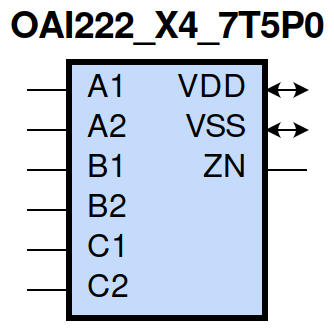
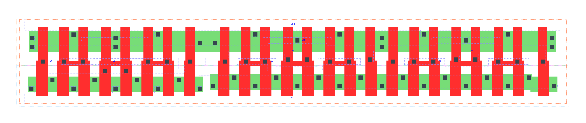

=======================================
gf180mcu_fd_sc_mcu7t5v0__oai222_x4
=======================================

**gf180mcu_fd_sc_mcu7t5v0__oai222_x4 symbol**

**gf180mcu_fd_sc_mcu7t5v0__oai222_x4 schematic**

.. image:: sc7_sch/OAI222_X4_sch.png
    :height: 300px
    :width: 500 px
    :align: center
    :alt: gf180mcu_fd_sc_mcu7t5v0__oai222_x4 schematic

**gf180mcu_fd_sc_mcu7t5v0__oai222_x4 layout**

.. include:: images.rst

OAI222_X4 is a three 2-input OR into 3-input NAND, NAND[OR(A1,A2),OR(B1,B2),OR(C1,C2)], 4X drive strength

|
| Attributes

============= =======================
**Attribute** **Value**
area          111.955200 µm\ :sup:`2`
============= =======================

|
| OUTPUT FUNCTIONS

============== ===========================================
**Output Pin** **Function**
ZN             (((!A1)&(!A2))|((!B1)&(!B2))|((!C1)&(!C2)))
============== ===========================================

|
| TRUTH TABLE FOR ZN

====== ====== ====== ====== ====== ====== ======
**A1** **A2** **B1** **B2** **C1** **C2** **ZN**
0      0      ?      ?      ?      ?      1
?      ?      0      0      ?      ?      1
?      ?      ?      ?      0      0      1
1      ?      1      ?      1      ?      0
1      ?      1      ?      ?      1      0
1      ?      ?      1      1      ?      0
1      ?      ?      1      ?      1      0
?      1      1      ?      1      ?      0
?      1      1      ?      ?      1      0
?      1      ?      1      1      ?      0
?      1      ?      1      ?      1      0
====== ====== ====== ====== ====== ====== ======

|
| FUNCTIONAL SCHEMATIC
| |image551|
| PIN CAPACITANCE (pf)

======= ======== ====================
**Pin** **Type** **Capacitance (pf)**
C1      input    0.0191
C2      input    0.0174
B1      input    0.0191
B2      input    0.0177
A1      input    0.0192
A2      input    0.0180
======= ======== ====================

|
| DELAY AND OUTPUT TRANSITION TIME corresponding to min slew and load

+---------------+------------+--------------------+--------------+-------------------+----------------+---------------+
| **Input Pin** | **Output** | **When Condition** | **Tin (ns)** | **Out Load (pf)** | **Delay (ns)** | **Tout (ns)** |
+---------------+------------+--------------------+--------------+-------------------+----------------+---------------+
| C1(LH)        | ZN(HL)     | !A1&A2&!B1&B2&!C2  | 0.0100       | 0.0010            | 0.2324         | 0.1173        |
+---------------+------------+--------------------+--------------+-------------------+----------------+---------------+
| C1(LH)        | ZN(HL)     | !A1&A2&B1&!B2&!C2  | 0.0100       | 0.0010            | 0.1996         | 0.0961        |
+---------------+------------+--------------------+--------------+-------------------+----------------+---------------+
| C1(LH)        | ZN(HL)     | !A1&A2&B1&B2&!C2   | 0.0100       | 0.0010            | 0.1805         | 0.0807        |
+---------------+------------+--------------------+--------------+-------------------+----------------+---------------+
| C1(LH)        | ZN(HL)     | A1&!A2&!B1&B2&!C2  | 0.0100       | 0.0010            | 0.1991         | 0.0957        |
+---------------+------------+--------------------+--------------+-------------------+----------------+---------------+
| C1(LH)        | ZN(HL)     | A1&!A2&B1&!B2&!C2  | 0.0100       | 0.0010            | 0.1679         | 0.0740        |
+---------------+------------+--------------------+--------------+-------------------+----------------+---------------+
| C1(LH)        | ZN(HL)     | A1&!A2&B1&B2&!C2   | 0.0100       | 0.0010            | 0.1537         | 0.0630        |
+---------------+------------+--------------------+--------------+-------------------+----------------+---------------+
| C1(LH)        | ZN(HL)     | A1&A2&!B1&B2&!C2   | 0.0100       | 0.0010            | 0.1757         | 0.0965        |
+---------------+------------+--------------------+--------------+-------------------+----------------+---------------+
| C1(LH)        | ZN(HL)     | A1&A2&B1&!B2&!C2   | 0.0100       | 0.0010            | 0.1503         | 0.0778        |
+---------------+------------+--------------------+--------------+-------------------+----------------+---------------+
| C1(LH)        | ZN(HL)     | A1&A2&B1&B2&!C2    | 0.0100       | 0.0010            | 0.1320         | 0.0629        |
+---------------+------------+--------------------+--------------+-------------------+----------------+---------------+
| C1(HL)        | ZN(LH)     | !A1&A2&!B1&B2&!C2  | 0.0100       | 0.0010            | 0.3442         | 0.3510        |
+---------------+------------+--------------------+--------------+-------------------+----------------+---------------+
| C1(HL)        | ZN(LH)     | !A1&A2&B1&!B2&!C2  | 0.0100       | 0.0010            | 0.3256         | 0.3010        |
+---------------+------------+--------------------+--------------+-------------------+----------------+---------------+
| C1(HL)        | ZN(LH)     | !A1&A2&B1&B2&!C2   | 0.0100       | 0.0010            | 0.3462         | 0.3164        |
+---------------+------------+--------------------+--------------+-------------------+----------------+---------------+
| C1(HL)        | ZN(LH)     | A1&!A2&!B1&B2&!C2  | 0.0100       | 0.0010            | 0.3255         | 0.3000        |
+---------------+------------+--------------------+--------------+-------------------+----------------+---------------+
| C1(HL)        | ZN(LH)     | A1&!A2&B1&!B2&!C2  | 0.0100       | 0.0010            | 0.3085         | 0.2491        |
+---------------+------------+--------------------+--------------+-------------------+----------------+---------------+
| C1(HL)        | ZN(LH)     | A1&!A2&B1&B2&!C2   | 0.0100       | 0.0010            | 0.3283         | 0.2637        |
+---------------+------------+--------------------+--------------+-------------------+----------------+---------------+
| C1(HL)        | ZN(LH)     | A1&A2&!B1&B2&!C2   | 0.0100       | 0.0010            | 0.3570         | 0.3203        |
+---------------+------------+--------------------+--------------+-------------------+----------------+---------------+
| C1(HL)        | ZN(LH)     | A1&A2&B1&!B2&!C2   | 0.0100       | 0.0010            | 0.3415         | 0.2711        |
+---------------+------------+--------------------+--------------+-------------------+----------------+---------------+
| C1(HL)        | ZN(LH)     | A1&A2&B1&B2&!C2    | 0.0100       | 0.0010            | 0.3636         | 0.2874        |
+---------------+------------+--------------------+--------------+-------------------+----------------+---------------+
| C2(LH)        | ZN(HL)     | !A1&A2&!B1&B2&!C1  | 0.0100       | 0.0010            | 0.2634         | 0.1395        |
+---------------+------------+--------------------+--------------+-------------------+----------------+---------------+
| C2(LH)        | ZN(HL)     | !A1&A2&B1&!B2&!C1  | 0.0100       | 0.0010            | 0.2296         | 0.1176        |
+---------------+------------+--------------------+--------------+-------------------+----------------+---------------+
| C2(LH)        | ZN(HL)     | !A1&A2&B1&B2&!C1   | 0.0100       | 0.0010            | 0.2061         | 0.0986        |
+---------------+------------+--------------------+--------------+-------------------+----------------+---------------+
| C2(LH)        | ZN(HL)     | A1&!A2&!B1&B2&!C1  | 0.0100       | 0.0010            | 0.2291         | 0.1171        |
+---------------+------------+--------------------+--------------+-------------------+----------------+---------------+
| C2(LH)        | ZN(HL)     | A1&!A2&B1&!B2&!C1  | 0.0100       | 0.0010            | 0.1964         | 0.0957        |
+---------------+------------+--------------------+--------------+-------------------+----------------+---------------+
| C2(LH)        | ZN(HL)     | A1&!A2&B1&B2&!C1   | 0.0100       | 0.0010            | 0.1777         | 0.0805        |
+---------------+------------+--------------------+--------------+-------------------+----------------+---------------+
| C2(LH)        | ZN(HL)     | A1&A2&!B1&B2&!C1   | 0.0100       | 0.0010            | 0.2005         | 0.1149        |
+---------------+------------+--------------------+--------------+-------------------+----------------+---------------+
| C2(LH)        | ZN(HL)     | A1&A2&B1&!B2&!C1   | 0.0100       | 0.0010            | 0.1735         | 0.0967        |
+---------------+------------+--------------------+--------------+-------------------+----------------+---------------+
| C2(LH)        | ZN(HL)     | A1&A2&B1&B2&!C1    | 0.0100       | 0.0010            | 0.1502         | 0.0775        |
+---------------+------------+--------------------+--------------+-------------------+----------------+---------------+
| C2(HL)        | ZN(LH)     | !A1&A2&!B1&B2&!C1  | 0.0100       | 0.0010            | 0.3713         | 0.3509        |
+---------------+------------+--------------------+--------------+-------------------+----------------+---------------+
| C2(HL)        | ZN(LH)     | !A1&A2&B1&!B2&!C1  | 0.0100       | 0.0010            | 0.3526         | 0.3009        |
+---------------+------------+--------------------+--------------+-------------------+----------------+---------------+
| C2(HL)        | ZN(LH)     | !A1&A2&B1&B2&!C1   | 0.0100       | 0.0010            | 0.3733         | 0.3163        |
+---------------+------------+--------------------+--------------+-------------------+----------------+---------------+
| C2(HL)        | ZN(LH)     | A1&!A2&!B1&B2&!C1  | 0.0100       | 0.0010            | 0.3525         | 0.2999        |
+---------------+------------+--------------------+--------------+-------------------+----------------+---------------+
| C2(HL)        | ZN(LH)     | A1&!A2&B1&!B2&!C1  | 0.0100       | 0.0010            | 0.3356         | 0.2491        |
+---------------+------------+--------------------+--------------+-------------------+----------------+---------------+
| C2(HL)        | ZN(LH)     | A1&!A2&B1&B2&!C1   | 0.0100       | 0.0010            | 0.3556         | 0.2636        |
+---------------+------------+--------------------+--------------+-------------------+----------------+---------------+
| C2(HL)        | ZN(LH)     | A1&A2&!B1&B2&!C1   | 0.0100       | 0.0010            | 0.3841         | 0.3202        |
+---------------+------------+--------------------+--------------+-------------------+----------------+---------------+
| C2(HL)        | ZN(LH)     | A1&A2&B1&!B2&!C1   | 0.0100       | 0.0010            | 0.3684         | 0.2712        |
+---------------+------------+--------------------+--------------+-------------------+----------------+---------------+
| C2(HL)        | ZN(LH)     | A1&A2&B1&B2&!C1    | 0.0100       | 0.0010            | 0.3906         | 0.2873        |
+---------------+------------+--------------------+--------------+-------------------+----------------+---------------+
| B1(LH)        | ZN(HL)     | !A1&A2&!B2&!C1&C2  | 0.0100       | 0.0010            | 0.2037         | 0.1175        |
+---------------+------------+--------------------+--------------+-------------------+----------------+---------------+
| B1(LH)        | ZN(HL)     | !A1&A2&!B2&C1&!C2  | 0.0100       | 0.0010            | 0.1707         | 0.0957        |
+---------------+------------+--------------------+--------------+-------------------+----------------+---------------+
| B1(LH)        | ZN(HL)     | !A1&A2&!B2&C1&C2   | 0.0100       | 0.0010            | 0.1487         | 0.0788        |
+---------------+------------+--------------------+--------------+-------------------+----------------+---------------+
| B1(LH)        | ZN(HL)     | A1&!A2&!B2&!C1&C2  | 0.0100       | 0.0010            | 0.1705         | 0.0955        |
+---------------+------------+--------------------+--------------+-------------------+----------------+---------------+
| B1(LH)        | ZN(HL)     | A1&!A2&!B2&C1&!C2  | 0.0100       | 0.0010            | 0.1392         | 0.0738        |
+---------------+------------+--------------------+--------------+-------------------+----------------+---------------+
| B1(LH)        | ZN(HL)     | A1&!A2&!B2&C1&C2   | 0.0100       | 0.0010            | 0.1223         | 0.0605        |
+---------------+------------+--------------------+--------------+-------------------+----------------+---------------+
| B1(LH)        | ZN(HL)     | A1&A2&!B2&!C1&C2   | 0.0100       | 0.0010            | 0.1469         | 0.0967        |
+---------------+------------+--------------------+--------------+-------------------+----------------+---------------+
| B1(LH)        | ZN(HL)     | A1&A2&!B2&C1&!C2   | 0.0100       | 0.0010            | 0.1213         | 0.0776        |
+---------------+------------+--------------------+--------------+-------------------+----------------+---------------+
| B1(LH)        | ZN(HL)     | A1&A2&!B2&C1&C2    | 0.0100       | 0.0010            | 0.1049         | 0.0593        |
+---------------+------------+--------------------+--------------+-------------------+----------------+---------------+
| B1(HL)        | ZN(LH)     | !A1&A2&!B2&!C1&C2  | 0.0100       | 0.0010            | 0.2682         | 0.2837        |
+---------------+------------+--------------------+--------------+-------------------+----------------+---------------+
| B1(HL)        | ZN(LH)     | !A1&A2&!B2&C1&!C2  | 0.0100       | 0.0010            | 0.2531         | 0.2361        |
+---------------+------------+--------------------+--------------+-------------------+----------------+---------------+
| B1(HL)        | ZN(LH)     | !A1&A2&!B2&C1&C2   | 0.0100       | 0.0010            | 0.2517         | 0.2361        |
+---------------+------------+--------------------+--------------+-------------------+----------------+---------------+
| B1(HL)        | ZN(LH)     | A1&!A2&!B2&!C1&C2  | 0.0100       | 0.0010            | 0.2532         | 0.2357        |
+---------------+------------+--------------------+--------------+-------------------+----------------+---------------+
| B1(HL)        | ZN(LH)     | A1&!A2&!B2&C1&!C2  | 0.0100       | 0.0010            | 0.2404         | 0.1885        |
+---------------+------------+--------------------+--------------+-------------------+----------------+---------------+
| B1(HL)        | ZN(LH)     | A1&!A2&!B2&C1&C2   | 0.0100       | 0.0010            | 0.2387         | 0.1885        |
+---------------+------------+--------------------+--------------+-------------------+----------------+---------------+
| B1(HL)        | ZN(LH)     | A1&A2&!B2&!C1&C2   | 0.0100       | 0.0010            | 0.2790         | 0.2551        |
+---------------+------------+--------------------+--------------+-------------------+----------------+---------------+
| B1(HL)        | ZN(LH)     | A1&A2&!B2&C1&!C2   | 0.0100       | 0.0010            | 0.2665         | 0.2083        |
+---------------+------------+--------------------+--------------+-------------------+----------------+---------------+
| B1(HL)        | ZN(LH)     | A1&A2&!B2&C1&C2    | 0.0100       | 0.0010            | 0.2652         | 0.2082        |
+---------------+------------+--------------------+--------------+-------------------+----------------+---------------+
| B2(HL)        | ZN(LH)     | !A1&A2&!B1&!C1&C2  | 0.0100       | 0.0010            | 0.2948         | 0.2840        |
+---------------+------------+--------------------+--------------+-------------------+----------------+---------------+
| B2(HL)        | ZN(LH)     | !A1&A2&!B1&C1&!C2  | 0.0100       | 0.0010            | 0.2799         | 0.2362        |
+---------------+------------+--------------------+--------------+-------------------+----------------+---------------+
| B2(HL)        | ZN(LH)     | !A1&A2&!B1&C1&C2   | 0.0100       | 0.0010            | 0.2785         | 0.2361        |
+---------------+------------+--------------------+--------------+-------------------+----------------+---------------+
| B2(HL)        | ZN(LH)     | A1&!A2&!B1&!C1&C2  | 0.0100       | 0.0010            | 0.2799         | 0.2358        |
+---------------+------------+--------------------+--------------+-------------------+----------------+---------------+
| B2(HL)        | ZN(LH)     | A1&!A2&!B1&C1&!C2  | 0.0100       | 0.0010            | 0.2670         | 0.1886        |
+---------------+------------+--------------------+--------------+-------------------+----------------+---------------+
| B2(HL)        | ZN(LH)     | A1&!A2&!B1&C1&C2   | 0.0100       | 0.0010            | 0.2655         | 0.1884        |
+---------------+------------+--------------------+--------------+-------------------+----------------+---------------+
| B2(HL)        | ZN(LH)     | A1&A2&!B1&!C1&C2   | 0.0100       | 0.0010            | 0.3058         | 0.2550        |
+---------------+------------+--------------------+--------------+-------------------+----------------+---------------+
| B2(HL)        | ZN(LH)     | A1&A2&!B1&C1&!C2   | 0.0100       | 0.0010            | 0.2934         | 0.2083        |
+---------------+------------+--------------------+--------------+-------------------+----------------+---------------+
| B2(HL)        | ZN(LH)     | A1&A2&!B1&C1&C2    | 0.0100       | 0.0010            | 0.2921         | 0.2082        |
+---------------+------------+--------------------+--------------+-------------------+----------------+---------------+
| B2(LH)        | ZN(HL)     | !A1&A2&!B1&!C1&C2  | 0.0100       | 0.0010            | 0.2344         | 0.1391        |
+---------------+------------+--------------------+--------------+-------------------+----------------+---------------+
| B2(LH)        | ZN(HL)     | !A1&A2&!B1&C1&!C2  | 0.0100       | 0.0010            | 0.2004         | 0.1172        |
+---------------+------------+--------------------+--------------+-------------------+----------------+---------------+
| B2(LH)        | ZN(HL)     | !A1&A2&!B1&C1&C2   | 0.0100       | 0.0010            | 0.1741         | 0.0971        |
+---------------+------------+--------------------+--------------+-------------------+----------------+---------------+
| B2(LH)        | ZN(HL)     | A1&!A2&!B1&!C1&C2  | 0.0100       | 0.0010            | 0.2003         | 0.1171        |
+---------------+------------+--------------------+--------------+-------------------+----------------+---------------+
| B2(LH)        | ZN(HL)     | A1&!A2&!B1&C1&!C2  | 0.0100       | 0.0010            | 0.1674         | 0.0955        |
+---------------+------------+--------------------+--------------+-------------------+----------------+---------------+
| B2(LH)        | ZN(HL)     | A1&!A2&!B1&C1&C2   | 0.0100       | 0.0010            | 0.1459         | 0.0784        |
+---------------+------------+--------------------+--------------+-------------------+----------------+---------------+
| B2(LH)        | ZN(HL)     | A1&A2&!B1&!C1&C2   | 0.0100       | 0.0010            | 0.1716         | 0.1149        |
+---------------+------------+--------------------+--------------+-------------------+----------------+---------------+
| B2(LH)        | ZN(HL)     | A1&A2&!B1&C1&!C2   | 0.0100       | 0.0010            | 0.1443         | 0.0965        |
+---------------+------------+--------------------+--------------+-------------------+----------------+---------------+
| B2(LH)        | ZN(HL)     | A1&A2&!B1&C1&C2    | 0.0100       | 0.0010            | 0.1229         | 0.0744        |
+---------------+------------+--------------------+--------------+-------------------+----------------+---------------+
| A1(HL)        | ZN(LH)     | !A2&!B1&B2&!C1&C2  | 0.0100       | 0.0010            | 0.1677         | 0.2050        |
+---------------+------------+--------------------+--------------+-------------------+----------------+---------------+
| A1(HL)        | ZN(LH)     | !A2&!B1&B2&C1&!C2  | 0.0100       | 0.0010            | 0.1563         | 0.1584        |
+---------------+------------+--------------------+--------------+-------------------+----------------+---------------+
| A1(HL)        | ZN(LH)     | !A2&!B1&B2&C1&C2   | 0.0100       | 0.0010            | 0.1562         | 0.1582        |
+---------------+------------+--------------------+--------------+-------------------+----------------+---------------+
| A1(HL)        | ZN(LH)     | !A2&B1&!B2&!C1&C2  | 0.0100       | 0.0010            | 0.1563         | 0.1587        |
+---------------+------------+--------------------+--------------+-------------------+----------------+---------------+
| A1(HL)        | ZN(LH)     | !A2&B1&!B2&C1&!C2  | 0.0100       | 0.0010            | 0.1466         | 0.1153        |
+---------------+------------+--------------------+--------------+-------------------+----------------+---------------+
| A1(HL)        | ZN(LH)     | !A2&B1&!B2&C1&C2   | 0.0100       | 0.0010            | 0.1465         | 0.1152        |
+---------------+------------+--------------------+--------------+-------------------+----------------+---------------+
| A1(HL)        | ZN(LH)     | !A2&B1&B2&!C1&C2   | 0.0100       | 0.0010            | 0.1554         | 0.1588        |
+---------------+------------+--------------------+--------------+-------------------+----------------+---------------+
| A1(HL)        | ZN(LH)     | !A2&B1&B2&C1&!C2   | 0.0100       | 0.0010            | 0.1458         | 0.1151        |
+---------------+------------+--------------------+--------------+-------------------+----------------+---------------+
| A1(HL)        | ZN(LH)     | !A2&B1&B2&C1&C2    | 0.0100       | 0.0010            | 0.1455         | 0.1153        |
+---------------+------------+--------------------+--------------+-------------------+----------------+---------------+
| A1(LH)        | ZN(HL)     | !A2&!B1&B2&!C1&C2  | 0.0100       | 0.0010            | 0.1487         | 0.1164        |
+---------------+------------+--------------------+--------------+-------------------+----------------+---------------+
| A1(LH)        | ZN(HL)     | !A2&!B1&B2&C1&!C2  | 0.0100       | 0.0010            | 0.1158         | 0.0937        |
+---------------+------------+--------------------+--------------+-------------------+----------------+---------------+
| A1(LH)        | ZN(HL)     | !A2&!B1&B2&C1&C2   | 0.0100       | 0.0010            | 0.1063         | 0.0779        |
+---------------+------------+--------------------+--------------+-------------------+----------------+---------------+
| A1(LH)        | ZN(HL)     | !A2&B1&!B2&!C1&C2  | 0.0100       | 0.0010            | 0.1160         | 0.0939        |
+---------------+------------+--------------------+--------------+-------------------+----------------+---------------+
| A1(LH)        | ZN(HL)     | !A2&B1&!B2&C1&!C2  | 0.0100       | 0.0010            | 0.0858         | 0.0697        |
+---------------+------------+--------------------+--------------+-------------------+----------------+---------------+
| A1(LH)        | ZN(HL)     | !A2&B1&!B2&C1&C2   | 0.0100       | 0.0010            | 0.0806         | 0.0588        |
+---------------+------------+--------------------+--------------+-------------------+----------------+---------------+
| A1(LH)        | ZN(HL)     | !A2&B1&B2&!C1&C2   | 0.0100       | 0.0010            | 0.1007         | 0.0770        |
+---------------+------------+--------------------+--------------+-------------------+----------------+---------------+
| A1(LH)        | ZN(HL)     | !A2&B1&B2&C1&!C2   | 0.0100       | 0.0010            | 0.0758         | 0.0568        |
+---------------+------------+--------------------+--------------+-------------------+----------------+---------------+
| A1(LH)        | ZN(HL)     | !A2&B1&B2&C1&C2    | 0.0100       | 0.0010            | 0.0708         | 0.0471        |
+---------------+------------+--------------------+--------------+-------------------+----------------+---------------+
| A2(HL)        | ZN(LH)     | !A1&!B1&B2&!C1&C2  | 0.0100       | 0.0010            | 0.1956         | 0.2050        |
+---------------+------------+--------------------+--------------+-------------------+----------------+---------------+
| A2(HL)        | ZN(LH)     | !A1&!B1&B2&C1&!C2  | 0.0100       | 0.0010            | 0.1842         | 0.1584        |
+---------------+------------+--------------------+--------------+-------------------+----------------+---------------+
| A2(HL)        | ZN(LH)     | !A1&!B1&B2&C1&C2   | 0.0100       | 0.0010            | 0.1841         | 0.1583        |
+---------------+------------+--------------------+--------------+-------------------+----------------+---------------+
| A2(HL)        | ZN(LH)     | !A1&B1&!B2&!C1&C2  | 0.0100       | 0.0010            | 0.1842         | 0.1587        |
+---------------+------------+--------------------+--------------+-------------------+----------------+---------------+
| A2(HL)        | ZN(LH)     | !A1&B1&!B2&C1&!C2  | 0.0100       | 0.0010            | 0.1745         | 0.1153        |
+---------------+------------+--------------------+--------------+-------------------+----------------+---------------+
| A2(HL)        | ZN(LH)     | !A1&B1&!B2&C1&C2   | 0.0100       | 0.0010            | 0.1744         | 0.1154        |
+---------------+------------+--------------------+--------------+-------------------+----------------+---------------+
| A2(HL)        | ZN(LH)     | !A1&B1&B2&!C1&C2   | 0.0100       | 0.0010            | 0.1832         | 0.1588        |
+---------------+------------+--------------------+--------------+-------------------+----------------+---------------+
| A2(HL)        | ZN(LH)     | !A1&B1&B2&C1&!C2   | 0.0100       | 0.0010            | 0.1736         | 0.1153        |
+---------------+------------+--------------------+--------------+-------------------+----------------+---------------+
| A2(HL)        | ZN(LH)     | !A1&B1&B2&C1&C2    | 0.0100       | 0.0010            | 0.1735         | 0.1153        |
+---------------+------------+--------------------+--------------+-------------------+----------------+---------------+
| A2(LH)        | ZN(HL)     | !A1&!B1&B2&!C1&C2  | 0.0100       | 0.0010            | 0.1801         | 0.1390        |
+---------------+------------+--------------------+--------------+-------------------+----------------+---------------+
| A2(LH)        | ZN(HL)     | !A1&!B1&B2&C1&!C2  | 0.0100       | 0.0010            | 0.1460         | 0.1165        |
+---------------+------------+--------------------+--------------+-------------------+----------------+---------------+
| A2(LH)        | ZN(HL)     | !A1&!B1&B2&C1&C2   | 0.0100       | 0.0010            | 0.1320         | 0.0971        |
+---------------+------------+--------------------+--------------+-------------------+----------------+---------------+
| A2(LH)        | ZN(HL)     | !A1&B1&!B2&!C1&C2  | 0.0100       | 0.0010            | 0.1462         | 0.1168        |
+---------------+------------+--------------------+--------------+-------------------+----------------+---------------+
| A2(LH)        | ZN(HL)     | !A1&B1&!B2&C1&!C2  | 0.0100       | 0.0010            | 0.1133         | 0.0941        |
+---------------+------------+--------------------+--------------+-------------------+----------------+---------------+
| A2(LH)        | ZN(HL)     | !A1&B1&!B2&C1&C2   | 0.0100       | 0.0010            | 0.1042         | 0.0785        |
+---------------+------------+--------------------+--------------+-------------------+----------------+---------------+
| A2(LH)        | ZN(HL)     | !A1&B1&B2&!C1&C2   | 0.0100       | 0.0010            | 0.1261         | 0.0971        |
+---------------+------------+--------------------+--------------+-------------------+----------------+---------------+
| A2(LH)        | ZN(HL)     | !A1&B1&B2&C1&!C2   | 0.0100       | 0.0010            | 0.0985         | 0.0774        |
+---------------+------------+--------------------+--------------+-------------------+----------------+---------------+
| A2(LH)        | ZN(HL)     | !A1&B1&B2&C1&C2    | 0.0100       | 0.0010            | 0.0895         | 0.0629        |
+---------------+------------+--------------------+--------------+-------------------+----------------+---------------+

|
| DYNAMIC ENERGY

+---------------+---------------------+--------------+------------+-------------------+---------------------+
| **Input Pin** | **When Condition**  | **Tin (ns)** | **Output** | **Out Load (pf)** | **Energy (uW/MHz)** |
+---------------+---------------------+--------------+------------+-------------------+---------------------+
| A1            | !A2&!B1&B2&!C1&C2   | 0.0100       | ZN(LH)     | 0.0010            | 0.8367              |
+---------------+---------------------+--------------+------------+-------------------+---------------------+
| A1            | !A2&!B1&B2&C1&!C2   | 0.0100       | ZN(LH)     | 0.0010            | 0.7294              |
+---------------+---------------------+--------------+------------+-------------------+---------------------+
| A1            | !A2&!B1&B2&C1&C2    | 0.0100       | ZN(LH)     | 0.0010            | 0.7293              |
+---------------+---------------------+--------------+------------+-------------------+---------------------+
| A1            | !A2&B1&!B2&!C1&C2   | 0.0100       | ZN(LH)     | 0.0010            | 0.7298              |
+---------------+---------------------+--------------+------------+-------------------+---------------------+
| A1            | !A2&B1&!B2&C1&!C2   | 0.0100       | ZN(LH)     | 0.0010            | 0.6223              |
+---------------+---------------------+--------------+------------+-------------------+---------------------+
| A1            | !A2&B1&!B2&C1&C2    | 0.0100       | ZN(LH)     | 0.0010            | 0.6220              |
+---------------+---------------------+--------------+------------+-------------------+---------------------+
| A1            | !A2&B1&B2&!C1&C2    | 0.0100       | ZN(LH)     | 0.0010            | 0.7271              |
+---------------+---------------------+--------------+------------+-------------------+---------------------+
| A1            | !A2&B1&B2&C1&!C2    | 0.0100       | ZN(LH)     | 0.0010            | 0.6196              |
+---------------+---------------------+--------------+------------+-------------------+---------------------+
| A1            | !A2&B1&B2&C1&C2     | 0.0100       | ZN(LH)     | 0.0010            | 0.6193              |
+---------------+---------------------+--------------+------------+-------------------+---------------------+
| B2            | !A1&A2&!B1&!C1&C2   | 0.0100       | ZN(LH)     | 0.0010            | 1.3366              |
+---------------+---------------------+--------------+------------+-------------------+---------------------+
| B2            | !A1&A2&!B1&C1&!C2   | 0.0100       | ZN(LH)     | 0.0010            | 1.2293              |
+---------------+---------------------+--------------+------------+-------------------+---------------------+
| B2            | !A1&A2&!B1&C1&C2    | 0.0100       | ZN(LH)     | 0.0010            | 1.2256              |
+---------------+---------------------+--------------+------------+-------------------+---------------------+
| B2            | A1&!A2&!B1&!C1&C2   | 0.0100       | ZN(LH)     | 0.0010            | 1.2292              |
+---------------+---------------------+--------------+------------+-------------------+---------------------+
| B2            | A1&!A2&!B1&C1&!C2   | 0.0100       | ZN(LH)     | 0.0010            | 1.1212              |
+---------------+---------------------+--------------+------------+-------------------+---------------------+
| B2            | A1&!A2&!B1&C1&C2    | 0.0100       | ZN(LH)     | 0.0010            | 1.1176              |
+---------------+---------------------+--------------+------------+-------------------+---------------------+
| B2            | A1&A2&!B1&!C1&C2    | 0.0100       | ZN(LH)     | 0.0010            | 1.3195              |
+---------------+---------------------+--------------+------------+-------------------+---------------------+
| B2            | A1&A2&!B1&C1&!C2    | 0.0100       | ZN(LH)     | 0.0010            | 1.2115              |
+---------------+---------------------+--------------+------------+-------------------+---------------------+
| B2            | A1&A2&!B1&C1&C2     | 0.0100       | ZN(LH)     | 0.0010            | 1.2078              |
+---------------+---------------------+--------------+------------+-------------------+---------------------+
| B1            | !A1&A2&!B2&!C1&C2   | 0.0100       | ZN(HL)     | 0.0010            | 0.3118              |
+---------------+---------------------+--------------+------------+-------------------+---------------------+
| B1            | !A1&A2&!B2&C1&!C2   | 0.0100       | ZN(HL)     | 0.0010            | 0.2102              |
+---------------+---------------------+--------------+------------+-------------------+---------------------+
| B1            | !A1&A2&!B2&C1&C2    | 0.0100       | ZN(HL)     | 0.0010            | 0.2102              |
+---------------+---------------------+--------------+------------+-------------------+---------------------+
| B1            | A1&!A2&!B2&!C1&C2   | 0.0100       | ZN(HL)     | 0.0010            | 0.2081              |
+---------------+---------------------+--------------+------------+-------------------+---------------------+
| B1            | A1&!A2&!B2&C1&!C2   | 0.0100       | ZN(HL)     | 0.0010            | 0.1066              |
+---------------+---------------------+--------------+------------+-------------------+---------------------+
| B1            | A1&!A2&!B2&C1&C2    | 0.0100       | ZN(HL)     | 0.0010            | 0.1067              |
+---------------+---------------------+--------------+------------+-------------------+---------------------+
| B1            | A1&A2&!B2&!C1&C2    | 0.0100       | ZN(HL)     | 0.0010            | 0.2085              |
+---------------+---------------------+--------------+------------+-------------------+---------------------+
| B1            | A1&A2&!B2&C1&!C2    | 0.0100       | ZN(HL)     | 0.0010            | 0.1068              |
+---------------+---------------------+--------------+------------+-------------------+---------------------+
| B1            | A1&A2&!B2&C1&C2     | 0.0100       | ZN(HL)     | 0.0010            | 0.1067              |
+---------------+---------------------+--------------+------------+-------------------+---------------------+
| A2            | !A1&!B1&B2&!C1&C2   | 0.0100       | ZN(LH)     | 0.0010            | 0.9455              |
+---------------+---------------------+--------------+------------+-------------------+---------------------+
| A2            | !A1&!B1&B2&C1&!C2   | 0.0100       | ZN(LH)     | 0.0010            | 0.8382              |
+---------------+---------------------+--------------+------------+-------------------+---------------------+
| A2            | !A1&!B1&B2&C1&C2    | 0.0100       | ZN(LH)     | 0.0010            | 0.8380              |
+---------------+---------------------+--------------+------------+-------------------+---------------------+
| A2            | !A1&B1&!B2&!C1&C2   | 0.0100       | ZN(LH)     | 0.0010            | 0.8387              |
+---------------+---------------------+--------------+------------+-------------------+---------------------+
| A2            | !A1&B1&!B2&C1&!C2   | 0.0100       | ZN(LH)     | 0.0010            | 0.7309              |
+---------------+---------------------+--------------+------------+-------------------+---------------------+
| A2            | !A1&B1&!B2&C1&C2    | 0.0100       | ZN(LH)     | 0.0010            | 0.7306              |
+---------------+---------------------+--------------+------------+-------------------+---------------------+
| A2            | !A1&B1&B2&!C1&C2    | 0.0100       | ZN(LH)     | 0.0010            | 0.8360              |
+---------------+---------------------+--------------+------------+-------------------+---------------------+
| A2            | !A1&B1&B2&C1&!C2    | 0.0100       | ZN(LH)     | 0.0010            | 0.7284              |
+---------------+---------------------+--------------+------------+-------------------+---------------------+
| A2            | !A1&B1&B2&C1&C2     | 0.0100       | ZN(LH)     | 0.0010            | 0.7280              |
+---------------+---------------------+--------------+------------+-------------------+---------------------+
| B1            | !A1&A2&!B2&!C1&C2   | 0.0100       | ZN(LH)     | 0.0010            | 1.2294              |
+---------------+---------------------+--------------+------------+-------------------+---------------------+
| B1            | !A1&A2&!B2&C1&!C2   | 0.0100       | ZN(LH)     | 0.0010            | 1.1216              |
+---------------+---------------------+--------------+------------+-------------------+---------------------+
| B1            | !A1&A2&!B2&C1&C2    | 0.0100       | ZN(LH)     | 0.0010            | 1.1179              |
+---------------+---------------------+--------------+------------+-------------------+---------------------+
| B1            | A1&!A2&!B2&!C1&C2   | 0.0100       | ZN(LH)     | 0.0010            | 1.1217              |
+---------------+---------------------+--------------+------------+-------------------+---------------------+
| B1            | A1&!A2&!B2&C1&!C2   | 0.0100       | ZN(LH)     | 0.0010            | 1.0141              |
+---------------+---------------------+--------------+------------+-------------------+---------------------+
| B1            | A1&!A2&!B2&C1&C2    | 0.0100       | ZN(LH)     | 0.0010            | 1.0100              |
+---------------+---------------------+--------------+------------+-------------------+---------------------+
| B1            | A1&A2&!B2&!C1&C2    | 0.0100       | ZN(LH)     | 0.0010            | 1.2120              |
+---------------+---------------------+--------------+------------+-------------------+---------------------+
| B1            | A1&A2&!B2&C1&!C2    | 0.0100       | ZN(LH)     | 0.0010            | 1.1044              |
+---------------+---------------------+--------------+------------+-------------------+---------------------+
| B1            | A1&A2&!B2&C1&C2     | 0.0100       | ZN(LH)     | 0.0010            | 1.1002              |
+---------------+---------------------+--------------+------------+-------------------+---------------------+
| C1            | !A1&A2&!B1&B2&!C2   | 0.0100       | ZN(HL)     | 0.0010            | 0.3105              |
+---------------+---------------------+--------------+------------+-------------------+---------------------+
| C1            | !A1&A2&B1&!B2&!C2   | 0.0100       | ZN(HL)     | 0.0010            | 0.2111              |
+---------------+---------------------+--------------+------------+-------------------+---------------------+
| C1            | !A1&A2&B1&B2&!C2    | 0.0100       | ZN(HL)     | 0.0010            | 0.2109              |
+---------------+---------------------+--------------+------------+-------------------+---------------------+
| C1            | A1&!A2&!B1&B2&!C2   | 0.0100       | ZN(HL)     | 0.0010            | 0.2074              |
+---------------+---------------------+--------------+------------+-------------------+---------------------+
| C1            | A1&!A2&B1&!B2&!C2   | 0.0100       | ZN(HL)     | 0.0010            | 0.1070              |
+---------------+---------------------+--------------+------------+-------------------+---------------------+
| C1            | A1&!A2&B1&B2&!C2    | 0.0100       | ZN(HL)     | 0.0010            | 0.1068              |
+---------------+---------------------+--------------+------------+-------------------+---------------------+
| C1            | A1&A2&!B1&B2&!C2    | 0.0100       | ZN(HL)     | 0.0010            | 0.2071              |
+---------------+---------------------+--------------+------------+-------------------+---------------------+
| C1            | A1&A2&B1&!B2&!C2    | 0.0100       | ZN(HL)     | 0.0010            | 0.1072              |
+---------------+---------------------+--------------+------------+-------------------+---------------------+
| C1            | A1&A2&B1&B2&!C2     | 0.0100       | ZN(HL)     | 0.0010            | 0.1071              |
+---------------+---------------------+--------------+------------+-------------------+---------------------+
| A2            | !A1&!B1&B2&!C1&C2   | 0.0100       | ZN(HL)     | 0.0010            | 0.3994              |
+---------------+---------------------+--------------+------------+-------------------+---------------------+
| A2            | !A1&!B1&B2&C1&!C2   | 0.0100       | ZN(HL)     | 0.0010            | 0.2984              |
+---------------+---------------------+--------------+------------+-------------------+---------------------+
| A2            | !A1&!B1&B2&C1&C2    | 0.0100       | ZN(HL)     | 0.0010            | 0.2986              |
+---------------+---------------------+--------------+------------+-------------------+---------------------+
| A2            | !A1&B1&!B2&!C1&C2   | 0.0100       | ZN(HL)     | 0.0010            | 0.3002              |
+---------------+---------------------+--------------+------------+-------------------+---------------------+
| A2            | !A1&B1&!B2&C1&!C2   | 0.0100       | ZN(HL)     | 0.0010            | 0.1991              |
+---------------+---------------------+--------------+------------+-------------------+---------------------+
| A2            | !A1&B1&!B2&C1&C2    | 0.0100       | ZN(HL)     | 0.0010            | 0.1989              |
+---------------+---------------------+--------------+------------+-------------------+---------------------+
| A2            | !A1&B1&B2&!C1&C2    | 0.0100       | ZN(HL)     | 0.0010            | 0.3005              |
+---------------+---------------------+--------------+------------+-------------------+---------------------+
| A2            | !A1&B1&B2&C1&!C2    | 0.0100       | ZN(HL)     | 0.0010            | 0.1991              |
+---------------+---------------------+--------------+------------+-------------------+---------------------+
| A2            | !A1&B1&B2&C1&C2     | 0.0100       | ZN(HL)     | 0.0010            | 0.1989              |
+---------------+---------------------+--------------+------------+-------------------+---------------------+
| C2            | !A1&A2&!B1&B2&!C1   | 0.0100       | ZN(HL)     | 0.0010            | 0.3983              |
+---------------+---------------------+--------------+------------+-------------------+---------------------+
| C2            | !A1&A2&B1&!B2&!C1   | 0.0100       | ZN(HL)     | 0.0010            | 0.2988              |
+---------------+---------------------+--------------+------------+-------------------+---------------------+
| C2            | !A1&A2&B1&B2&!C1    | 0.0100       | ZN(HL)     | 0.0010            | 0.2988              |
+---------------+---------------------+--------------+------------+-------------------+---------------------+
| C2            | A1&!A2&!B1&B2&!C1   | 0.0100       | ZN(HL)     | 0.0010            | 0.2952              |
+---------------+---------------------+--------------+------------+-------------------+---------------------+
| C2            | A1&!A2&B1&!B2&!C1   | 0.0100       | ZN(HL)     | 0.0010            | 0.1959              |
+---------------+---------------------+--------------+------------+-------------------+---------------------+
| C2            | A1&!A2&B1&B2&!C1    | 0.0100       | ZN(HL)     | 0.0010            | 0.1957              |
+---------------+---------------------+--------------+------------+-------------------+---------------------+
| C2            | A1&A2&!B1&B2&!C1    | 0.0100       | ZN(HL)     | 0.0010            | 0.2951              |
+---------------+---------------------+--------------+------------+-------------------+---------------------+
| C2            | A1&A2&B1&!B2&!C1    | 0.0100       | ZN(HL)     | 0.0010            | 0.1960              |
+---------------+---------------------+--------------+------------+-------------------+---------------------+
| C2            | A1&A2&B1&B2&!C1     | 0.0100       | ZN(HL)     | 0.0010            | 0.1958              |
+---------------+---------------------+--------------+------------+-------------------+---------------------+
| C1            | !A1&A2&!B1&B2&!C2   | 0.0100       | ZN(LH)     | 0.0010            | 1.5638              |
+---------------+---------------------+--------------+------------+-------------------+---------------------+
| C1            | !A1&A2&B1&!B2&!C2   | 0.0100       | ZN(LH)     | 0.0010            | 1.4568              |
+---------------+---------------------+--------------+------------+-------------------+---------------------+
| C1            | !A1&A2&B1&B2&!C2    | 0.0100       | ZN(LH)     | 0.0010            | 1.5438              |
+---------------+---------------------+--------------+------------+-------------------+---------------------+
| C1            | A1&!A2&!B1&B2&!C2   | 0.0100       | ZN(LH)     | 0.0010            | 1.4563              |
+---------------+---------------------+--------------+------------+-------------------+---------------------+
| C1            | A1&!A2&B1&!B2&!C2   | 0.0100       | ZN(LH)     | 0.0010            | 1.3489              |
+---------------+---------------------+--------------+------------+-------------------+---------------------+
| C1            | A1&!A2&B1&B2&!C2    | 0.0100       | ZN(LH)     | 0.0010            | 1.4363              |
+---------------+---------------------+--------------+------------+-------------------+---------------------+
| C1            | A1&A2&!B1&B2&!C2    | 0.0100       | ZN(LH)     | 0.0010            | 1.5447              |
+---------------+---------------------+--------------+------------+-------------------+---------------------+
| C1            | A1&A2&B1&!B2&!C2    | 0.0100       | ZN(LH)     | 0.0010            | 1.4376              |
+---------------+---------------------+--------------+------------+-------------------+---------------------+
| C1            | A1&A2&B1&B2&!C2     | 0.0100       | ZN(LH)     | 0.0010            | 1.5250              |
+---------------+---------------------+--------------+------------+-------------------+---------------------+
| C2            | !A1&A2&!B1&B2&!C1   | 0.0100       | ZN(LH)     | 0.0010            | 1.6715              |
+---------------+---------------------+--------------+------------+-------------------+---------------------+
| C2            | !A1&A2&B1&!B2&!C1   | 0.0100       | ZN(LH)     | 0.0010            | 1.5644              |
+---------------+---------------------+--------------+------------+-------------------+---------------------+
| C2            | !A1&A2&B1&B2&!C1    | 0.0100       | ZN(LH)     | 0.0010            | 1.6514              |
+---------------+---------------------+--------------+------------+-------------------+---------------------+
| C2            | A1&!A2&!B1&B2&!C1   | 0.0100       | ZN(LH)     | 0.0010            | 1.5639              |
+---------------+---------------------+--------------+------------+-------------------+---------------------+
| C2            | A1&!A2&B1&!B2&!C1   | 0.0100       | ZN(LH)     | 0.0010            | 1.4564              |
+---------------+---------------------+--------------+------------+-------------------+---------------------+
| C2            | A1&!A2&B1&B2&!C1    | 0.0100       | ZN(LH)     | 0.0010            | 1.5439              |
+---------------+---------------------+--------------+------------+-------------------+---------------------+
| C2            | A1&A2&!B1&B2&!C1    | 0.0100       | ZN(LH)     | 0.0010            | 1.6521              |
+---------------+---------------------+--------------+------------+-------------------+---------------------+
| C2            | A1&A2&B1&!B2&!C1    | 0.0100       | ZN(LH)     | 0.0010            | 1.5447              |
+---------------+---------------------+--------------+------------+-------------------+---------------------+
| C2            | A1&A2&B1&B2&!C1     | 0.0100       | ZN(LH)     | 0.0010            | 1.6323              |
+---------------+---------------------+--------------+------------+-------------------+---------------------+
| A1            | !A2&!B1&B2&!C1&C2   | 0.0100       | ZN(HL)     | 0.0010            | 0.3094              |
+---------------+---------------------+--------------+------------+-------------------+---------------------+
| A1            | !A2&!B1&B2&C1&!C2   | 0.0100       | ZN(HL)     | 0.0010            | 0.2079              |
+---------------+---------------------+--------------+------------+-------------------+---------------------+
| A1            | !A2&!B1&B2&C1&C2    | 0.0100       | ZN(HL)     | 0.0010            | 0.2075              |
+---------------+---------------------+--------------+------------+-------------------+---------------------+
| A1            | !A2&B1&!B2&!C1&C2   | 0.0100       | ZN(HL)     | 0.0010            | 0.2096              |
+---------------+---------------------+--------------+------------+-------------------+---------------------+
| A1            | !A2&B1&!B2&C1&!C2   | 0.0100       | ZN(HL)     | 0.0010            | 0.1078              |
+---------------+---------------------+--------------+------------+-------------------+---------------------+
| A1            | !A2&B1&!B2&C1&C2    | 0.0100       | ZN(HL)     | 0.0010            | 0.1075              |
+---------------+---------------------+--------------+------------+-------------------+---------------------+
| A1            | !A2&B1&B2&!C1&C2    | 0.0100       | ZN(HL)     | 0.0010            | 0.2093              |
+---------------+---------------------+--------------+------------+-------------------+---------------------+
| A1            | !A2&B1&B2&C1&!C2    | 0.0100       | ZN(HL)     | 0.0010            | 0.1075              |
+---------------+---------------------+--------------+------------+-------------------+---------------------+
| A1            | !A2&B1&B2&C1&C2     | 0.0100       | ZN(HL)     | 0.0010            | 0.1073              |
+---------------+---------------------+--------------+------------+-------------------+---------------------+
| B2            | !A1&A2&!B1&!C1&C2   | 0.0100       | ZN(HL)     | 0.0010            | 0.3977              |
+---------------+---------------------+--------------+------------+-------------------+---------------------+
| B2            | !A1&A2&!B1&C1&!C2   | 0.0100       | ZN(HL)     | 0.0010            | 0.2968              |
+---------------+---------------------+--------------+------------+-------------------+---------------------+
| B2            | !A1&A2&!B1&C1&C2    | 0.0100       | ZN(HL)     | 0.0010            | 0.2968              |
+---------------+---------------------+--------------+------------+-------------------+---------------------+
| B2            | A1&!A2&!B1&!C1&C2   | 0.0100       | ZN(HL)     | 0.0010            | 0.2947              |
+---------------+---------------------+--------------+------------+-------------------+---------------------+
| B2            | A1&!A2&!B1&C1&!C2   | 0.0100       | ZN(HL)     | 0.0010            | 0.1944              |
+---------------+---------------------+--------------+------------+-------------------+---------------------+
| B2            | A1&!A2&!B1&C1&C2    | 0.0100       | ZN(HL)     | 0.0010            | 0.1941              |
+---------------+---------------------+--------------+------------+-------------------+---------------------+
| B2            | A1&A2&!B1&!C1&C2    | 0.0100       | ZN(HL)     | 0.0010            | 0.2949              |
+---------------+---------------------+--------------+------------+-------------------+---------------------+
| B2            | A1&A2&!B1&C1&!C2    | 0.0100       | ZN(HL)     | 0.0010            | 0.1941              |
+---------------+---------------------+--------------+------------+-------------------+---------------------+
| B2            | A1&A2&!B1&C1&C2     | 0.0100       | ZN(HL)     | 0.0010            | 0.1941              |
+---------------+---------------------+--------------+------------+-------------------+---------------------+
| B2(LH)        | !A1&!A2&!B1&!C1&!C2 | 0.0100       | n/a        | n/a               | -0.1402             |
+---------------+---------------------+--------------+------------+-------------------+---------------------+
| B2(LH)        | !A1&!A2&!B1&!C1&C2  | 0.0100       | n/a        | n/a               | -0.1404             |
+---------------+---------------------+--------------+------------+-------------------+---------------------+
| B2(LH)        | !A1&!A2&!B1&C1&!C2  | 0.0100       | n/a        | n/a               | -0.1403             |
+---------------+---------------------+--------------+------------+-------------------+---------------------+
| B2(LH)        | !A1&!A2&!B1&C1&C2   | 0.0100       | n/a        | n/a               | -0.1404             |
+---------------+---------------------+--------------+------------+-------------------+---------------------+
| B2(LH)        | !A1&!A2&B1&!C1&!C2  | 0.0100       | n/a        | n/a               | -0.1361             |
+---------------+---------------------+--------------+------------+-------------------+---------------------+
| B2(LH)        | !A1&!A2&B1&!C1&C2   | 0.0100       | n/a        | n/a               | -0.1361             |
+---------------+---------------------+--------------+------------+-------------------+---------------------+
| B2(LH)        | !A1&!A2&B1&C1&!C2   | 0.0100       | n/a        | n/a               | -0.1361             |
+---------------+---------------------+--------------+------------+-------------------+---------------------+
| B2(LH)        | !A1&!A2&B1&C1&C2    | 0.0100       | n/a        | n/a               | -0.1361             |
+---------------+---------------------+--------------+------------+-------------------+---------------------+
| B2(LH)        | !A1&A2&!B1&!C1&!C2  | 0.0100       | n/a        | n/a               | 0.0683              |
+---------------+---------------------+--------------+------------+-------------------+---------------------+
| B2(LH)        | !A1&A2&B1&!C1&!C2   | 0.0100       | n/a        | n/a               | -0.1361             |
+---------------+---------------------+--------------+------------+-------------------+---------------------+
| B2(LH)        | A1&!A2&!B1&!C1&!C2  | 0.0100       | n/a        | n/a               | 0.0682              |
+---------------+---------------------+--------------+------------+-------------------+---------------------+
| B2(LH)        | A1&!A2&B1&!C1&!C2   | 0.0100       | n/a        | n/a               | -0.1361             |
+---------------+---------------------+--------------+------------+-------------------+---------------------+
| B2(LH)        | A1&A2&!B1&!C1&!C2   | 0.0100       | n/a        | n/a               | 0.0685              |
+---------------+---------------------+--------------+------------+-------------------+---------------------+
| B2(LH)        | A1&A2&B1&!C1&!C2    | 0.0100       | n/a        | n/a               | -0.1361             |
+---------------+---------------------+--------------+------------+-------------------+---------------------+
| B2(LH)        | !A1&A2&B1&!C1&C2    | 0.0100       | n/a        | n/a               | -0.1174             |
+---------------+---------------------+--------------+------------+-------------------+---------------------+
| B2(LH)        | !A1&A2&B1&C1&!C2    | 0.0100       | n/a        | n/a               | -0.1173             |
+---------------+---------------------+--------------+------------+-------------------+---------------------+
| B2(LH)        | !A1&A2&B1&C1&C2     | 0.0100       | n/a        | n/a               | -0.1173             |
+---------------+---------------------+--------------+------------+-------------------+---------------------+
| B2(LH)        | A1&!A2&B1&!C1&C2    | 0.0100       | n/a        | n/a               | -0.1174             |
+---------------+---------------------+--------------+------------+-------------------+---------------------+
| B2(LH)        | A1&!A2&B1&C1&!C2    | 0.0100       | n/a        | n/a               | -0.1174             |
+---------------+---------------------+--------------+------------+-------------------+---------------------+
| B2(LH)        | A1&!A2&B1&C1&C2     | 0.0100       | n/a        | n/a               | -0.1173             |
+---------------+---------------------+--------------+------------+-------------------+---------------------+
| B2(LH)        | A1&A2&B1&!C1&C2     | 0.0100       | n/a        | n/a               | -0.1173             |
+---------------+---------------------+--------------+------------+-------------------+---------------------+
| B2(LH)        | A1&A2&B1&C1&!C2     | 0.0100       | n/a        | n/a               | -0.1173             |
+---------------+---------------------+--------------+------------+-------------------+---------------------+
| B2(LH)        | A1&A2&B1&C1&C2      | 0.0100       | n/a        | n/a               | -0.1173             |
+---------------+---------------------+--------------+------------+-------------------+---------------------+
| C2(HL)        | !A1&!A2&!B1&!B2&!C1 | 0.0100       | n/a        | n/a               | 0.1411              |
+---------------+---------------------+--------------+------------+-------------------+---------------------+
| C2(HL)        | !A1&!A2&!B1&!B2&C1  | 0.0100       | n/a        | n/a               | 0.1408              |
+---------------+---------------------+--------------+------------+-------------------+---------------------+
| C2(HL)        | !A1&!A2&!B1&B2&!C1  | 0.0100       | n/a        | n/a               | 0.1416              |
+---------------+---------------------+--------------+------------+-------------------+---------------------+
| C2(HL)        | !A1&!A2&!B1&B2&C1   | 0.0100       | n/a        | n/a               | 0.1408              |
+---------------+---------------------+--------------+------------+-------------------+---------------------+
| C2(HL)        | !A1&!A2&B1&!B2&!C1  | 0.0100       | n/a        | n/a               | 0.1416              |
+---------------+---------------------+--------------+------------+-------------------+---------------------+
| C2(HL)        | !A1&!A2&B1&!B2&C1   | 0.0100       | n/a        | n/a               | 0.1408              |
+---------------+---------------------+--------------+------------+-------------------+---------------------+
| C2(HL)        | !A1&!A2&B1&B2&!C1   | 0.0100       | n/a        | n/a               | 0.1415              |
+---------------+---------------------+--------------+------------+-------------------+---------------------+
| C2(HL)        | !A1&!A2&B1&B2&C1    | 0.0100       | n/a        | n/a               | 0.1408              |
+---------------+---------------------+--------------+------------+-------------------+---------------------+
| C2(HL)        | !A1&A2&!B1&!B2&!C1  | 0.0100       | n/a        | n/a               | 0.1432              |
+---------------+---------------------+--------------+------------+-------------------+---------------------+
| C2(HL)        | !A1&A2&!B1&!B2&C1   | 0.0100       | n/a        | n/a               | 0.1408              |
+---------------+---------------------+--------------+------------+-------------------+---------------------+
| C2(HL)        | A1&!A2&!B1&!B2&!C1  | 0.0100       | n/a        | n/a               | 0.1432              |
+---------------+---------------------+--------------+------------+-------------------+---------------------+
| C2(HL)        | A1&!A2&!B1&!B2&C1   | 0.0100       | n/a        | n/a               | 0.1408              |
+---------------+---------------------+--------------+------------+-------------------+---------------------+
| C2(HL)        | A1&A2&!B1&!B2&!C1   | 0.0100       | n/a        | n/a               | 0.1431              |
+---------------+---------------------+--------------+------------+-------------------+---------------------+
| C2(HL)        | A1&A2&!B1&!B2&C1    | 0.0100       | n/a        | n/a               | 0.1408              |
+---------------+---------------------+--------------+------------+-------------------+---------------------+
| C2(HL)        | !A1&A2&!B1&B2&C1    | 0.0100       | n/a        | n/a               | 0.1408              |
+---------------+---------------------+--------------+------------+-------------------+---------------------+
| C2(HL)        | !A1&A2&B1&!B2&C1    | 0.0100       | n/a        | n/a               | 0.1407              |
+---------------+---------------------+--------------+------------+-------------------+---------------------+
| C2(HL)        | !A1&A2&B1&B2&C1     | 0.0100       | n/a        | n/a               | 0.1408              |
+---------------+---------------------+--------------+------------+-------------------+---------------------+
| C2(HL)        | A1&!A2&!B1&B2&C1    | 0.0100       | n/a        | n/a               | 0.1408              |
+---------------+---------------------+--------------+------------+-------------------+---------------------+
| C2(HL)        | A1&!A2&B1&!B2&C1    | 0.0100       | n/a        | n/a               | 0.1408              |
+---------------+---------------------+--------------+------------+-------------------+---------------------+
| C2(HL)        | A1&!A2&B1&B2&C1     | 0.0100       | n/a        | n/a               | 0.1408              |
+---------------+---------------------+--------------+------------+-------------------+---------------------+
| C2(HL)        | A1&A2&!B1&B2&C1     | 0.0100       | n/a        | n/a               | 0.1408              |
+---------------+---------------------+--------------+------------+-------------------+---------------------+
| C2(HL)        | A1&A2&B1&!B2&C1     | 0.0100       | n/a        | n/a               | 0.1408              |
+---------------+---------------------+--------------+------------+-------------------+---------------------+
| C2(HL)        | A1&A2&B1&B2&C1      | 0.0100       | n/a        | n/a               | 0.1408              |
+---------------+---------------------+--------------+------------+-------------------+---------------------+
| B2(HL)        | !A1&!A2&!B1&!C1&!C2 | 0.0100       | n/a        | n/a               | 0.1847              |
+---------------+---------------------+--------------+------------+-------------------+---------------------+
| B2(HL)        | !A1&!A2&!B1&!C1&C2  | 0.0100       | n/a        | n/a               | 0.1677              |
+---------------+---------------------+--------------+------------+-------------------+---------------------+
| B2(HL)        | !A1&!A2&!B1&C1&!C2  | 0.0100       | n/a        | n/a               | 0.1678              |
+---------------+---------------------+--------------+------------+-------------------+---------------------+
| B2(HL)        | !A1&!A2&!B1&C1&C2   | 0.0100       | n/a        | n/a               | 0.1645              |
+---------------+---------------------+--------------+------------+-------------------+---------------------+
| B2(HL)        | !A1&!A2&B1&!C1&!C2  | 0.0100       | n/a        | n/a               | 0.1893              |
+---------------+---------------------+--------------+------------+-------------------+---------------------+
| B2(HL)        | !A1&!A2&B1&!C1&C2   | 0.0100       | n/a        | n/a               | 0.1408              |
+---------------+---------------------+--------------+------------+-------------------+---------------------+
| B2(HL)        | !A1&!A2&B1&C1&!C2   | 0.0100       | n/a        | n/a               | 0.1408              |
+---------------+---------------------+--------------+------------+-------------------+---------------------+
| B2(HL)        | !A1&!A2&B1&C1&C2    | 0.0100       | n/a        | n/a               | 0.1407              |
+---------------+---------------------+--------------+------------+-------------------+---------------------+
| B2(HL)        | !A1&A2&!B1&!C1&!C2  | 0.0100       | n/a        | n/a               | 0.1476              |
+---------------+---------------------+--------------+------------+-------------------+---------------------+
| B2(HL)        | !A1&A2&B1&!C1&!C2   | 0.0100       | n/a        | n/a               | 0.1499              |
+---------------+---------------------+--------------+------------+-------------------+---------------------+
| B2(HL)        | A1&!A2&!B1&!C1&!C2  | 0.0100       | n/a        | n/a               | 0.1476              |
+---------------+---------------------+--------------+------------+-------------------+---------------------+
| B2(HL)        | A1&!A2&B1&!C1&!C2   | 0.0100       | n/a        | n/a               | 0.1499              |
+---------------+---------------------+--------------+------------+-------------------+---------------------+
| B2(HL)        | A1&A2&!B1&!C1&!C2   | 0.0100       | n/a        | n/a               | 0.1474              |
+---------------+---------------------+--------------+------------+-------------------+---------------------+
| B2(HL)        | A1&A2&B1&!C1&!C2    | 0.0100       | n/a        | n/a               | 0.1496              |
+---------------+---------------------+--------------+------------+-------------------+---------------------+
| B2(HL)        | !A1&A2&B1&!C1&C2    | 0.0100       | n/a        | n/a               | 0.1407              |
+---------------+---------------------+--------------+------------+-------------------+---------------------+
| B2(HL)        | !A1&A2&B1&C1&!C2    | 0.0100       | n/a        | n/a               | 0.1407              |
+---------------+---------------------+--------------+------------+-------------------+---------------------+
| B2(HL)        | !A1&A2&B1&C1&C2     | 0.0100       | n/a        | n/a               | 0.1407              |
+---------------+---------------------+--------------+------------+-------------------+---------------------+
| B2(HL)        | A1&!A2&B1&!C1&C2    | 0.0100       | n/a        | n/a               | 0.1407              |
+---------------+---------------------+--------------+------------+-------------------+---------------------+
| B2(HL)        | A1&!A2&B1&C1&!C2    | 0.0100       | n/a        | n/a               | 0.1407              |
+---------------+---------------------+--------------+------------+-------------------+---------------------+
| B2(HL)        | A1&!A2&B1&C1&C2     | 0.0100       | n/a        | n/a               | 0.1407              |
+---------------+---------------------+--------------+------------+-------------------+---------------------+
| B2(HL)        | A1&A2&B1&!C1&C2     | 0.0100       | n/a        | n/a               | 0.1406              |
+---------------+---------------------+--------------+------------+-------------------+---------------------+
| B2(HL)        | A1&A2&B1&C1&!C2     | 0.0100       | n/a        | n/a               | 0.1406              |
+---------------+---------------------+--------------+------------+-------------------+---------------------+
| B2(HL)        | A1&A2&B1&C1&C2      | 0.0100       | n/a        | n/a               | 0.1406              |
+---------------+---------------------+--------------+------------+-------------------+---------------------+
| C2(LH)        | !A1&!A2&!B1&!B2&!C1 | 0.0100       | n/a        | n/a               | -0.1405             |
+---------------+---------------------+--------------+------------+-------------------+---------------------+
| C2(LH)        | !A1&!A2&!B1&!B2&C1  | 0.0100       | n/a        | n/a               | -0.1360             |
+---------------+---------------------+--------------+------------+-------------------+---------------------+
| C2(LH)        | !A1&!A2&!B1&B2&!C1  | 0.0100       | n/a        | n/a               | -0.1405             |
+---------------+---------------------+--------------+------------+-------------------+---------------------+
| C2(LH)        | !A1&!A2&!B1&B2&C1   | 0.0100       | n/a        | n/a               | -0.1360             |
+---------------+---------------------+--------------+------------+-------------------+---------------------+
| C2(LH)        | !A1&!A2&B1&!B2&!C1  | 0.0100       | n/a        | n/a               | -0.1405             |
+---------------+---------------------+--------------+------------+-------------------+---------------------+
| C2(LH)        | !A1&!A2&B1&!B2&C1   | 0.0100       | n/a        | n/a               | -0.1360             |
+---------------+---------------------+--------------+------------+-------------------+---------------------+
| C2(LH)        | !A1&!A2&B1&B2&!C1   | 0.0100       | n/a        | n/a               | -0.1404             |
+---------------+---------------------+--------------+------------+-------------------+---------------------+
| C2(LH)        | !A1&!A2&B1&B2&C1    | 0.0100       | n/a        | n/a               | -0.1360             |
+---------------+---------------------+--------------+------------+-------------------+---------------------+
| C2(LH)        | !A1&A2&!B1&!B2&!C1  | 0.0100       | n/a        | n/a               | -0.1406             |
+---------------+---------------------+--------------+------------+-------------------+---------------------+
| C2(LH)        | !A1&A2&!B1&!B2&C1   | 0.0100       | n/a        | n/a               | -0.1360             |
+---------------+---------------------+--------------+------------+-------------------+---------------------+
| C2(LH)        | A1&!A2&!B1&!B2&!C1  | 0.0100       | n/a        | n/a               | -0.1405             |
+---------------+---------------------+--------------+------------+-------------------+---------------------+
| C2(LH)        | A1&!A2&!B1&!B2&C1   | 0.0100       | n/a        | n/a               | -0.1360             |
+---------------+---------------------+--------------+------------+-------------------+---------------------+
| C2(LH)        | A1&A2&!B1&!B2&!C1   | 0.0100       | n/a        | n/a               | -0.1405             |
+---------------+---------------------+--------------+------------+-------------------+---------------------+
| C2(LH)        | A1&A2&!B1&!B2&C1    | 0.0100       | n/a        | n/a               | -0.1360             |
+---------------+---------------------+--------------+------------+-------------------+---------------------+
| C2(LH)        | !A1&A2&!B1&B2&C1    | 0.0100       | n/a        | n/a               | -0.1172             |
+---------------+---------------------+--------------+------------+-------------------+---------------------+
| C2(LH)        | !A1&A2&B1&!B2&C1    | 0.0100       | n/a        | n/a               | -0.1172             |
+---------------+---------------------+--------------+------------+-------------------+---------------------+
| C2(LH)        | !A1&A2&B1&B2&C1     | 0.0100       | n/a        | n/a               | -0.1172             |
+---------------+---------------------+--------------+------------+-------------------+---------------------+
| C2(LH)        | A1&!A2&!B1&B2&C1    | 0.0100       | n/a        | n/a               | -0.1172             |
+---------------+---------------------+--------------+------------+-------------------+---------------------+
| C2(LH)        | A1&!A2&B1&!B2&C1    | 0.0100       | n/a        | n/a               | -0.1172             |
+---------------+---------------------+--------------+------------+-------------------+---------------------+
| C2(LH)        | A1&!A2&B1&B2&C1     | 0.0100       | n/a        | n/a               | -0.1172             |
+---------------+---------------------+--------------+------------+-------------------+---------------------+
| C2(LH)        | A1&A2&!B1&B2&C1     | 0.0100       | n/a        | n/a               | -0.1172             |
+---------------+---------------------+--------------+------------+-------------------+---------------------+
| C2(LH)        | A1&A2&B1&!B2&C1     | 0.0100       | n/a        | n/a               | -0.1172             |
+---------------+---------------------+--------------+------------+-------------------+---------------------+
| C2(LH)        | A1&A2&B1&B2&C1      | 0.0100       | n/a        | n/a               | -0.1172             |
+---------------+---------------------+--------------+------------+-------------------+---------------------+
| A2(LH)        | !A1&!B1&!B2&!C1&!C2 | 0.0100       | n/a        | n/a               | 0.1252              |
+---------------+---------------------+--------------+------------+-------------------+---------------------+
| A2(LH)        | !A1&!B1&!B2&!C1&C2  | 0.0100       | n/a        | n/a               | 0.1254              |
+---------------+---------------------+--------------+------------+-------------------+---------------------+
| A2(LH)        | !A1&!B1&!B2&C1&!C2  | 0.0100       | n/a        | n/a               | 0.1254              |
+---------------+---------------------+--------------+------------+-------------------+---------------------+
| A2(LH)        | !A1&!B1&!B2&C1&C2   | 0.0100       | n/a        | n/a               | 0.1253              |
+---------------+---------------------+--------------+------------+-------------------+---------------------+
| A2(LH)        | !A1&!B1&B2&!C1&!C2  | 0.0100       | n/a        | n/a               | 0.4732              |
+---------------+---------------------+--------------+------------+-------------------+---------------------+
| A2(LH)        | !A1&B1&!B2&!C1&!C2  | 0.0100       | n/a        | n/a               | 0.4732              |
+---------------+---------------------+--------------+------------+-------------------+---------------------+
| A2(LH)        | !A1&B1&B2&!C1&!C2   | 0.0100       | n/a        | n/a               | 0.5576              |
+---------------+---------------------+--------------+------------+-------------------+---------------------+
| A2(LH)        | A1&!B1&!B2&!C1&!C2  | 0.0100       | n/a        | n/a               | -0.1542             |
+---------------+---------------------+--------------+------------+-------------------+---------------------+
| A2(LH)        | A1&!B1&!B2&!C1&C2   | 0.0100       | n/a        | n/a               | -0.1542             |
+---------------+---------------------+--------------+------------+-------------------+---------------------+
| A2(LH)        | A1&!B1&!B2&C1&!C2   | 0.0100       | n/a        | n/a               | -0.1542             |
+---------------+---------------------+--------------+------------+-------------------+---------------------+
| A2(LH)        | A1&!B1&!B2&C1&C2    | 0.0100       | n/a        | n/a               | -0.1542             |
+---------------+---------------------+--------------+------------+-------------------+---------------------+
| A2(LH)        | A1&!B1&B2&!C1&!C2   | 0.0100       | n/a        | n/a               | -0.1542             |
+---------------+---------------------+--------------+------------+-------------------+---------------------+
| A2(LH)        | A1&B1&!B2&!C1&!C2   | 0.0100       | n/a        | n/a               | -0.1542             |
+---------------+---------------------+--------------+------------+-------------------+---------------------+
| A2(LH)        | A1&B1&B2&!C1&!C2    | 0.0100       | n/a        | n/a               | -0.1542             |
+---------------+---------------------+--------------+------------+-------------------+---------------------+
| A2(LH)        | A1&!B1&B2&!C1&C2    | 0.0100       | n/a        | n/a               | -0.1171             |
+---------------+---------------------+--------------+------------+-------------------+---------------------+
| A2(LH)        | A1&!B1&B2&C1&!C2    | 0.0100       | n/a        | n/a               | -0.1171             |
+---------------+---------------------+--------------+------------+-------------------+---------------------+
| A2(LH)        | A1&!B1&B2&C1&C2     | 0.0100       | n/a        | n/a               | -0.1171             |
+---------------+---------------------+--------------+------------+-------------------+---------------------+
| A2(LH)        | A1&B1&!B2&!C1&C2    | 0.0100       | n/a        | n/a               | -0.1171             |
+---------------+---------------------+--------------+------------+-------------------+---------------------+
| A2(LH)        | A1&B1&!B2&C1&!C2    | 0.0100       | n/a        | n/a               | -0.1171             |
+---------------+---------------------+--------------+------------+-------------------+---------------------+
| A2(LH)        | A1&B1&!B2&C1&C2     | 0.0100       | n/a        | n/a               | -0.1171             |
+---------------+---------------------+--------------+------------+-------------------+---------------------+
| A2(LH)        | A1&B1&B2&!C1&C2     | 0.0100       | n/a        | n/a               | -0.1171             |
+---------------+---------------------+--------------+------------+-------------------+---------------------+
| A2(LH)        | A1&B1&B2&C1&!C2     | 0.0100       | n/a        | n/a               | -0.1171             |
+---------------+---------------------+--------------+------------+-------------------+---------------------+
| A2(LH)        | A1&B1&B2&C1&C2      | 0.0100       | n/a        | n/a               | -0.1170             |
+---------------+---------------------+--------------+------------+-------------------+---------------------+
| A1(LH)        | !A2&!B1&!B2&!C1&!C2 | 0.0100       | n/a        | n/a               | 0.1242              |
+---------------+---------------------+--------------+------------+-------------------+---------------------+
| A1(LH)        | !A2&!B1&!B2&!C1&C2  | 0.0100       | n/a        | n/a               | 0.1243              |
+---------------+---------------------+--------------+------------+-------------------+---------------------+
| A1(LH)        | !A2&!B1&!B2&C1&!C2  | 0.0100       | n/a        | n/a               | 0.1242              |
+---------------+---------------------+--------------+------------+-------------------+---------------------+
| A1(LH)        | !A2&!B1&!B2&C1&C2   | 0.0100       | n/a        | n/a               | 0.1242              |
+---------------+---------------------+--------------+------------+-------------------+---------------------+
| A1(LH)        | !A2&!B1&B2&!C1&!C2  | 0.0100       | n/a        | n/a               | 0.4720              |
+---------------+---------------------+--------------+------------+-------------------+---------------------+
| A1(LH)        | !A2&B1&!B2&!C1&!C2  | 0.0100       | n/a        | n/a               | 0.4720              |
+---------------+---------------------+--------------+------------+-------------------+---------------------+
| A1(LH)        | !A2&B1&B2&!C1&!C2   | 0.0100       | n/a        | n/a               | 0.5564              |
+---------------+---------------------+--------------+------------+-------------------+---------------------+
| A1(LH)        | A2&!B1&!B2&!C1&!C2  | 0.0100       | n/a        | n/a               | -0.1557             |
+---------------+---------------------+--------------+------------+-------------------+---------------------+
| A1(LH)        | A2&!B1&!B2&!C1&C2   | 0.0100       | n/a        | n/a               | -0.1554             |
+---------------+---------------------+--------------+------------+-------------------+---------------------+
| A1(LH)        | A2&!B1&!B2&C1&!C2   | 0.0100       | n/a        | n/a               | -0.1554             |
+---------------+---------------------+--------------+------------+-------------------+---------------------+
| A1(LH)        | A2&!B1&!B2&C1&C2    | 0.0100       | n/a        | n/a               | -0.1554             |
+---------------+---------------------+--------------+------------+-------------------+---------------------+
| A1(LH)        | A2&!B1&B2&!C1&!C2   | 0.0100       | n/a        | n/a               | -0.1553             |
+---------------+---------------------+--------------+------------+-------------------+---------------------+
| A1(LH)        | A2&B1&!B2&!C1&!C2   | 0.0100       | n/a        | n/a               | -0.1555             |
+---------------+---------------------+--------------+------------+-------------------+---------------------+
| A1(LH)        | A2&B1&B2&!C1&!C2    | 0.0100       | n/a        | n/a               | -0.1555             |
+---------------+---------------------+--------------+------------+-------------------+---------------------+
| A1(LH)        | A2&!B1&B2&!C1&C2    | 0.0100       | n/a        | n/a               | -0.0403             |
+---------------+---------------------+--------------+------------+-------------------+---------------------+
| A1(LH)        | A2&!B1&B2&C1&!C2    | 0.0100       | n/a        | n/a               | -0.0403             |
+---------------+---------------------+--------------+------------+-------------------+---------------------+
| A1(LH)        | A2&!B1&B2&C1&C2     | 0.0100       | n/a        | n/a               | -0.0403             |
+---------------+---------------------+--------------+------------+-------------------+---------------------+
| A1(LH)        | A2&B1&!B2&!C1&C2    | 0.0100       | n/a        | n/a               | -0.0403             |
+---------------+---------------------+--------------+------------+-------------------+---------------------+
| A1(LH)        | A2&B1&!B2&C1&!C2    | 0.0100       | n/a        | n/a               | -0.0403             |
+---------------+---------------------+--------------+------------+-------------------+---------------------+
| A1(LH)        | A2&B1&!B2&C1&C2     | 0.0100       | n/a        | n/a               | -0.0403             |
+---------------+---------------------+--------------+------------+-------------------+---------------------+
| A1(LH)        | A2&B1&B2&!C1&C2     | 0.0100       | n/a        | n/a               | -0.0403             |
+---------------+---------------------+--------------+------------+-------------------+---------------------+
| A1(LH)        | A2&B1&B2&C1&!C2     | 0.0100       | n/a        | n/a               | -0.0403             |
+---------------+---------------------+--------------+------------+-------------------+---------------------+
| A1(LH)        | A2&B1&B2&C1&C2      | 0.0100       | n/a        | n/a               | -0.0403             |
+---------------+---------------------+--------------+------------+-------------------+---------------------+
| C1(LH)        | !A1&!A2&!B1&!B2&!C2 | 0.0100       | n/a        | n/a               | -0.1416             |
+---------------+---------------------+--------------+------------+-------------------+---------------------+
| C1(LH)        | !A1&!A2&!B1&!B2&C2  | 0.0100       | n/a        | n/a               | -0.1376             |
+---------------+---------------------+--------------+------------+-------------------+---------------------+
| C1(LH)        | !A1&!A2&!B1&B2&!C2  | 0.0100       | n/a        | n/a               | -0.1415             |
+---------------+---------------------+--------------+------------+-------------------+---------------------+
| C1(LH)        | !A1&!A2&!B1&B2&C2   | 0.0100       | n/a        | n/a               | -0.1374             |
+---------------+---------------------+--------------+------------+-------------------+---------------------+
| C1(LH)        | !A1&!A2&B1&!B2&!C2  | 0.0100       | n/a        | n/a               | -0.1415             |
+---------------+---------------------+--------------+------------+-------------------+---------------------+
| C1(LH)        | !A1&!A2&B1&!B2&C2   | 0.0100       | n/a        | n/a               | -0.1374             |
+---------------+---------------------+--------------+------------+-------------------+---------------------+
| C1(LH)        | !A1&!A2&B1&B2&!C2   | 0.0100       | n/a        | n/a               | -0.1415             |
+---------------+---------------------+--------------+------------+-------------------+---------------------+
| C1(LH)        | !A1&!A2&B1&B2&C2    | 0.0100       | n/a        | n/a               | -0.1374             |
+---------------+---------------------+--------------+------------+-------------------+---------------------+
| C1(LH)        | !A1&A2&!B1&!B2&!C2  | 0.0100       | n/a        | n/a               | -0.1415             |
+---------------+---------------------+--------------+------------+-------------------+---------------------+
| C1(LH)        | !A1&A2&!B1&!B2&C2   | 0.0100       | n/a        | n/a               | -0.1373             |
+---------------+---------------------+--------------+------------+-------------------+---------------------+
| C1(LH)        | A1&!A2&!B1&!B2&!C2  | 0.0100       | n/a        | n/a               | -0.1415             |
+---------------+---------------------+--------------+------------+-------------------+---------------------+
| C1(LH)        | A1&!A2&!B1&!B2&C2   | 0.0100       | n/a        | n/a               | -0.1373             |
+---------------+---------------------+--------------+------------+-------------------+---------------------+
| C1(LH)        | A1&A2&!B1&!B2&!C2   | 0.0100       | n/a        | n/a               | -0.1415             |
+---------------+---------------------+--------------+------------+-------------------+---------------------+
| C1(LH)        | A1&A2&!B1&!B2&C2    | 0.0100       | n/a        | n/a               | -0.1374             |
+---------------+---------------------+--------------+------------+-------------------+---------------------+
| C1(LH)        | !A1&A2&!B1&B2&C2    | 0.0100       | n/a        | n/a               | -0.0403             |
+---------------+---------------------+--------------+------------+-------------------+---------------------+
| C1(LH)        | !A1&A2&B1&!B2&C2    | 0.0100       | n/a        | n/a               | -0.0402             |
+---------------+---------------------+--------------+------------+-------------------+---------------------+
| C1(LH)        | !A1&A2&B1&B2&C2     | 0.0100       | n/a        | n/a               | -0.0403             |
+---------------+---------------------+--------------+------------+-------------------+---------------------+
| C1(LH)        | A1&!A2&!B1&B2&C2    | 0.0100       | n/a        | n/a               | -0.0402             |
+---------------+---------------------+--------------+------------+-------------------+---------------------+
| C1(LH)        | A1&!A2&B1&!B2&C2    | 0.0100       | n/a        | n/a               | -0.0402             |
+---------------+---------------------+--------------+------------+-------------------+---------------------+
| C1(LH)        | A1&!A2&B1&B2&C2     | 0.0100       | n/a        | n/a               | -0.0403             |
+---------------+---------------------+--------------+------------+-------------------+---------------------+
| C1(LH)        | A1&A2&!B1&B2&C2     | 0.0100       | n/a        | n/a               | -0.0403             |
+---------------+---------------------+--------------+------------+-------------------+---------------------+
| C1(LH)        | A1&A2&B1&!B2&C2     | 0.0100       | n/a        | n/a               | -0.0402             |
+---------------+---------------------+--------------+------------+-------------------+---------------------+
| C1(LH)        | A1&A2&B1&B2&C2      | 0.0100       | n/a        | n/a               | -0.0403             |
+---------------+---------------------+--------------+------------+-------------------+---------------------+
| A2(HL)        | !A1&!B1&!B2&!C1&!C2 | 0.0100       | n/a        | n/a               | 0.1589              |
+---------------+---------------------+--------------+------------+-------------------+---------------------+
| A2(HL)        | !A1&!B1&!B2&!C1&C2  | 0.0100       | n/a        | n/a               | 0.1589              |
+---------------+---------------------+--------------+------------+-------------------+---------------------+
| A2(HL)        | !A1&!B1&!B2&C1&!C2  | 0.0100       | n/a        | n/a               | 0.1589              |
+---------------+---------------------+--------------+------------+-------------------+---------------------+
| A2(HL)        | !A1&!B1&!B2&C1&C2   | 0.0100       | n/a        | n/a               | 0.1589              |
+---------------+---------------------+--------------+------------+-------------------+---------------------+
| A2(HL)        | !A1&!B1&B2&!C1&!C2  | 0.0100       | n/a        | n/a               | 0.1589              |
+---------------+---------------------+--------------+------------+-------------------+---------------------+
| A2(HL)        | !A1&B1&!B2&!C1&!C2  | 0.0100       | n/a        | n/a               | 0.1589              |
+---------------+---------------------+--------------+------------+-------------------+---------------------+
| A2(HL)        | !A1&B1&B2&!C1&!C2   | 0.0100       | n/a        | n/a               | 0.1589              |
+---------------+---------------------+--------------+------------+-------------------+---------------------+
| A2(HL)        | A1&!B1&!B2&!C1&!C2  | 0.0100       | n/a        | n/a               | 0.1626              |
+---------------+---------------------+--------------+------------+-------------------+---------------------+
| A2(HL)        | A1&!B1&!B2&!C1&C2   | 0.0100       | n/a        | n/a               | 0.1626              |
+---------------+---------------------+--------------+------------+-------------------+---------------------+
| A2(HL)        | A1&!B1&!B2&C1&!C2   | 0.0100       | n/a        | n/a               | 0.1626              |
+---------------+---------------------+--------------+------------+-------------------+---------------------+
| A2(HL)        | A1&!B1&!B2&C1&C2    | 0.0100       | n/a        | n/a               | 0.1626              |
+---------------+---------------------+--------------+------------+-------------------+---------------------+
| A2(HL)        | A1&!B1&B2&!C1&!C2   | 0.0100       | n/a        | n/a               | 0.1632              |
+---------------+---------------------+--------------+------------+-------------------+---------------------+
| A2(HL)        | A1&B1&!B2&!C1&!C2   | 0.0100       | n/a        | n/a               | 0.1632              |
+---------------+---------------------+--------------+------------+-------------------+---------------------+
| A2(HL)        | A1&B1&B2&!C1&!C2    | 0.0100       | n/a        | n/a               | 0.1626              |
+---------------+---------------------+--------------+------------+-------------------+---------------------+
| A2(HL)        | A1&!B1&B2&!C1&C2    | 0.0100       | n/a        | n/a               | 0.1406              |
+---------------+---------------------+--------------+------------+-------------------+---------------------+
| A2(HL)        | A1&!B1&B2&C1&!C2    | 0.0100       | n/a        | n/a               | 0.1406              |
+---------------+---------------------+--------------+------------+-------------------+---------------------+
| A2(HL)        | A1&!B1&B2&C1&C2     | 0.0100       | n/a        | n/a               | 0.1406              |
+---------------+---------------------+--------------+------------+-------------------+---------------------+
| A2(HL)        | A1&B1&!B2&!C1&C2    | 0.0100       | n/a        | n/a               | 0.1406              |
+---------------+---------------------+--------------+------------+-------------------+---------------------+
| A2(HL)        | A1&B1&!B2&C1&!C2    | 0.0100       | n/a        | n/a               | 0.1406              |
+---------------+---------------------+--------------+------------+-------------------+---------------------+
| A2(HL)        | A1&B1&!B2&C1&C2     | 0.0100       | n/a        | n/a               | 0.1406              |
+---------------+---------------------+--------------+------------+-------------------+---------------------+
| A2(HL)        | A1&B1&B2&!C1&C2     | 0.0100       | n/a        | n/a               | 0.1406              |
+---------------+---------------------+--------------+------------+-------------------+---------------------+
| A2(HL)        | A1&B1&B2&C1&!C2     | 0.0100       | n/a        | n/a               | 0.1406              |
+---------------+---------------------+--------------+------------+-------------------+---------------------+
| A2(HL)        | A1&B1&B2&C1&C2      | 0.0100       | n/a        | n/a               | 0.1406              |
+---------------+---------------------+--------------+------------+-------------------+---------------------+
| B1(HL)        | !A1&!A2&!B2&!C1&!C2 | 0.0100       | n/a        | n/a               | 0.1851              |
+---------------+---------------------+--------------+------------+-------------------+---------------------+
| B1(HL)        | !A1&!A2&!B2&!C1&C2  | 0.0100       | n/a        | n/a               | 0.1683              |
+---------------+---------------------+--------------+------------+-------------------+---------------------+
| B1(HL)        | !A1&!A2&!B2&C1&!C2  | 0.0100       | n/a        | n/a               | 0.1682              |
+---------------+---------------------+--------------+------------+-------------------+---------------------+
| B1(HL)        | !A1&!A2&!B2&C1&C2   | 0.0100       | n/a        | n/a               | 0.1651              |
+---------------+---------------------+--------------+------------+-------------------+---------------------+
| B1(HL)        | !A1&!A2&B2&!C1&!C2  | 0.0100       | n/a        | n/a               | 0.1890              |
+---------------+---------------------+--------------+------------+-------------------+---------------------+
| B1(HL)        | !A1&!A2&B2&!C1&C2   | 0.0100       | n/a        | n/a               | 0.1412              |
+---------------+---------------------+--------------+------------+-------------------+---------------------+
| B1(HL)        | !A1&!A2&B2&C1&!C2   | 0.0100       | n/a        | n/a               | 0.1411              |
+---------------+---------------------+--------------+------------+-------------------+---------------------+
| B1(HL)        | !A1&!A2&B2&C1&C2    | 0.0100       | n/a        | n/a               | 0.1412              |
+---------------+---------------------+--------------+------------+-------------------+---------------------+
| B1(HL)        | !A1&A2&!B2&!C1&!C2  | 0.0100       | n/a        | n/a               | 0.1482              |
+---------------+---------------------+--------------+------------+-------------------+---------------------+
| B1(HL)        | !A1&A2&B2&!C1&!C2   | 0.0100       | n/a        | n/a               | 0.1506              |
+---------------+---------------------+--------------+------------+-------------------+---------------------+
| B1(HL)        | A1&!A2&!B2&!C1&!C2  | 0.0100       | n/a        | n/a               | 0.1482              |
+---------------+---------------------+--------------+------------+-------------------+---------------------+
| B1(HL)        | A1&!A2&B2&!C1&!C2   | 0.0100       | n/a        | n/a               | 0.1505              |
+---------------+---------------------+--------------+------------+-------------------+---------------------+
| B1(HL)        | A1&A2&!B2&!C1&!C2   | 0.0100       | n/a        | n/a               | 0.1480              |
+---------------+---------------------+--------------+------------+-------------------+---------------------+
| B1(HL)        | A1&A2&B2&!C1&!C2    | 0.0100       | n/a        | n/a               | 0.1502              |
+---------------+---------------------+--------------+------------+-------------------+---------------------+
| B1(HL)        | !A1&A2&B2&!C1&C2    | 0.0100       | n/a        | n/a               | 0.1058              |
+---------------+---------------------+--------------+------------+-------------------+---------------------+
| B1(HL)        | !A1&A2&B2&C1&!C2    | 0.0100       | n/a        | n/a               | 0.1058              |
+---------------+---------------------+--------------+------------+-------------------+---------------------+
| B1(HL)        | !A1&A2&B2&C1&C2     | 0.0100       | n/a        | n/a               | 0.1057              |
+---------------+---------------------+--------------+------------+-------------------+---------------------+
| B1(HL)        | A1&!A2&B2&!C1&C2    | 0.0100       | n/a        | n/a               | 0.1058              |
+---------------+---------------------+--------------+------------+-------------------+---------------------+
| B1(HL)        | A1&!A2&B2&C1&!C2    | 0.0100       | n/a        | n/a               | 0.1058              |
+---------------+---------------------+--------------+------------+-------------------+---------------------+
| B1(HL)        | A1&!A2&B2&C1&C2     | 0.0100       | n/a        | n/a               | 0.1058              |
+---------------+---------------------+--------------+------------+-------------------+---------------------+
| B1(HL)        | A1&A2&B2&!C1&C2     | 0.0100       | n/a        | n/a               | 0.1057              |
+---------------+---------------------+--------------+------------+-------------------+---------------------+
| B1(HL)        | A1&A2&B2&C1&!C2     | 0.0100       | n/a        | n/a               | 0.1057              |
+---------------+---------------------+--------------+------------+-------------------+---------------------+
| B1(HL)        | A1&A2&B2&C1&C2      | 0.0100       | n/a        | n/a               | 0.1058              |
+---------------+---------------------+--------------+------------+-------------------+---------------------+
| C1(HL)        | !A1&!A2&!B1&!B2&!C2 | 0.0100       | n/a        | n/a               | 0.1416              |
+---------------+---------------------+--------------+------------+-------------------+---------------------+
| C1(HL)        | !A1&!A2&!B1&!B2&C2  | 0.0100       | n/a        | n/a               | 0.1411              |
+---------------+---------------------+--------------+------------+-------------------+---------------------+
| C1(HL)        | !A1&!A2&!B1&B2&!C2  | 0.0100       | n/a        | n/a               | 0.1421              |
+---------------+---------------------+--------------+------------+-------------------+---------------------+
| C1(HL)        | !A1&!A2&!B1&B2&C2   | 0.0100       | n/a        | n/a               | 0.1413              |
+---------------+---------------------+--------------+------------+-------------------+---------------------+
| C1(HL)        | !A1&!A2&B1&!B2&!C2  | 0.0100       | n/a        | n/a               | 0.1421              |
+---------------+---------------------+--------------+------------+-------------------+---------------------+
| C1(HL)        | !A1&!A2&B1&!B2&C2   | 0.0100       | n/a        | n/a               | 0.1412              |
+---------------+---------------------+--------------+------------+-------------------+---------------------+
| C1(HL)        | !A1&!A2&B1&B2&!C2   | 0.0100       | n/a        | n/a               | 0.1419              |
+---------------+---------------------+--------------+------------+-------------------+---------------------+
| C1(HL)        | !A1&!A2&B1&B2&C2    | 0.0100       | n/a        | n/a               | 0.1412              |
+---------------+---------------------+--------------+------------+-------------------+---------------------+
| C1(HL)        | !A1&A2&!B1&!B2&!C2  | 0.0100       | n/a        | n/a               | 0.1437              |
+---------------+---------------------+--------------+------------+-------------------+---------------------+
| C1(HL)        | !A1&A2&!B1&!B2&C2   | 0.0100       | n/a        | n/a               | 0.1412              |
+---------------+---------------------+--------------+------------+-------------------+---------------------+
| C1(HL)        | A1&!A2&!B1&!B2&!C2  | 0.0100       | n/a        | n/a               | 0.1437              |
+---------------+---------------------+--------------+------------+-------------------+---------------------+
| C1(HL)        | A1&!A2&!B1&!B2&C2   | 0.0100       | n/a        | n/a               | 0.1411              |
+---------------+---------------------+--------------+------------+-------------------+---------------------+
| C1(HL)        | A1&A2&!B1&!B2&!C2   | 0.0100       | n/a        | n/a               | 0.1436              |
+---------------+---------------------+--------------+------------+-------------------+---------------------+
| C1(HL)        | A1&A2&!B1&!B2&C2    | 0.0100       | n/a        | n/a               | 0.1411              |
+---------------+---------------------+--------------+------------+-------------------+---------------------+
| C1(HL)        | !A1&A2&!B1&B2&C2    | 0.0100       | n/a        | n/a               | 0.1073              |
+---------------+---------------------+--------------+------------+-------------------+---------------------+
| C1(HL)        | !A1&A2&B1&!B2&C2    | 0.0100       | n/a        | n/a               | 0.1073              |
+---------------+---------------------+--------------+------------+-------------------+---------------------+
| C1(HL)        | !A1&A2&B1&B2&C2     | 0.0100       | n/a        | n/a               | 0.1074              |
+---------------+---------------------+--------------+------------+-------------------+---------------------+
| C1(HL)        | A1&!A2&!B1&B2&C2    | 0.0100       | n/a        | n/a               | 0.1073              |
+---------------+---------------------+--------------+------------+-------------------+---------------------+
| C1(HL)        | A1&!A2&B1&!B2&C2    | 0.0100       | n/a        | n/a               | 0.1073              |
+---------------+---------------------+--------------+------------+-------------------+---------------------+
| C1(HL)        | A1&!A2&B1&B2&C2     | 0.0100       | n/a        | n/a               | 0.1074              |
+---------------+---------------------+--------------+------------+-------------------+---------------------+
| C1(HL)        | A1&A2&!B1&B2&C2     | 0.0100       | n/a        | n/a               | 0.1073              |
+---------------+---------------------+--------------+------------+-------------------+---------------------+
| C1(HL)        | A1&A2&B1&!B2&C2     | 0.0100       | n/a        | n/a               | 0.1073              |
+---------------+---------------------+--------------+------------+-------------------+---------------------+
| C1(HL)        | A1&A2&B1&B2&C2      | 0.0100       | n/a        | n/a               | 0.1074              |
+---------------+---------------------+--------------+------------+-------------------+---------------------+
| A1(HL)        | !A2&!B1&!B2&!C1&!C2 | 0.0100       | n/a        | n/a               | 0.1597              |
+---------------+---------------------+--------------+------------+-------------------+---------------------+
| A1(HL)        | !A2&!B1&!B2&!C1&C2  | 0.0100       | n/a        | n/a               | 0.1597              |
+---------------+---------------------+--------------+------------+-------------------+---------------------+
| A1(HL)        | !A2&!B1&!B2&C1&!C2  | 0.0100       | n/a        | n/a               | 0.1597              |
+---------------+---------------------+--------------+------------+-------------------+---------------------+
| A1(HL)        | !A2&!B1&!B2&C1&C2   | 0.0100       | n/a        | n/a               | 0.1597              |
+---------------+---------------------+--------------+------------+-------------------+---------------------+
| A1(HL)        | !A2&!B1&B2&!C1&!C2  | 0.0100       | n/a        | n/a               | 0.1598              |
+---------------+---------------------+--------------+------------+-------------------+---------------------+
| A1(HL)        | !A2&B1&!B2&!C1&!C2  | 0.0100       | n/a        | n/a               | 0.1597              |
+---------------+---------------------+--------------+------------+-------------------+---------------------+
| A1(HL)        | !A2&B1&B2&!C1&!C2   | 0.0100       | n/a        | n/a               | 0.1597              |
+---------------+---------------------+--------------+------------+-------------------+---------------------+
| A1(HL)        | A2&!B1&!B2&!C1&!C2  | 0.0100       | n/a        | n/a               | 0.1630              |
+---------------+---------------------+--------------+------------+-------------------+---------------------+
| A1(HL)        | A2&!B1&!B2&!C1&C2   | 0.0100       | n/a        | n/a               | 0.1630              |
+---------------+---------------------+--------------+------------+-------------------+---------------------+
| A1(HL)        | A2&!B1&!B2&C1&!C2   | 0.0100       | n/a        | n/a               | 0.1629              |
+---------------+---------------------+--------------+------------+-------------------+---------------------+
| A1(HL)        | A2&!B1&!B2&C1&C2    | 0.0100       | n/a        | n/a               | 0.1629              |
+---------------+---------------------+--------------+------------+-------------------+---------------------+
| A1(HL)        | A2&!B1&B2&!C1&!C2   | 0.0100       | n/a        | n/a               | 0.1636              |
+---------------+---------------------+--------------+------------+-------------------+---------------------+
| A1(HL)        | A2&B1&!B2&!C1&!C2   | 0.0100       | n/a        | n/a               | 0.1635              |
+---------------+---------------------+--------------+------------+-------------------+---------------------+
| A1(HL)        | A2&B1&B2&!C1&!C2    | 0.0100       | n/a        | n/a               | 0.1629              |
+---------------+---------------------+--------------+------------+-------------------+---------------------+
| A1(HL)        | A2&!B1&B2&!C1&C2    | 0.0100       | n/a        | n/a               | 0.1094              |
+---------------+---------------------+--------------+------------+-------------------+---------------------+
| A1(HL)        | A2&!B1&B2&C1&!C2    | 0.0100       | n/a        | n/a               | 0.1094              |
+---------------+---------------------+--------------+------------+-------------------+---------------------+
| A1(HL)        | A2&!B1&B2&C1&C2     | 0.0100       | n/a        | n/a               | 0.1094              |
+---------------+---------------------+--------------+------------+-------------------+---------------------+
| A1(HL)        | A2&B1&!B2&!C1&C2    | 0.0100       | n/a        | n/a               | 0.1094              |
+---------------+---------------------+--------------+------------+-------------------+---------------------+
| A1(HL)        | A2&B1&!B2&C1&!C2    | 0.0100       | n/a        | n/a               | 0.1094              |
+---------------+---------------------+--------------+------------+-------------------+---------------------+
| A1(HL)        | A2&B1&!B2&C1&C2     | 0.0100       | n/a        | n/a               | 0.1094              |
+---------------+---------------------+--------------+------------+-------------------+---------------------+
| A1(HL)        | A2&B1&B2&!C1&C2     | 0.0100       | n/a        | n/a               | 0.1094              |
+---------------+---------------------+--------------+------------+-------------------+---------------------+
| A1(HL)        | A2&B1&B2&C1&!C2     | 0.0100       | n/a        | n/a               | 0.1094              |
+---------------+---------------------+--------------+------------+-------------------+---------------------+
| A1(HL)        | A2&B1&B2&C1&C2      | 0.0100       | n/a        | n/a               | 0.1094              |
+---------------+---------------------+--------------+------------+-------------------+---------------------+
| B1(LH)        | !A1&!A2&!B2&!C1&!C2 | 0.0100       | n/a        | n/a               | -0.1418             |
+---------------+---------------------+--------------+------------+-------------------+---------------------+
| B1(LH)        | !A1&!A2&!B2&!C1&C2  | 0.0100       | n/a        | n/a               | -0.1416             |
+---------------+---------------------+--------------+------------+-------------------+---------------------+
| B1(LH)        | !A1&!A2&!B2&C1&!C2  | 0.0100       | n/a        | n/a               | -0.1416             |
+---------------+---------------------+--------------+------------+-------------------+---------------------+
| B1(LH)        | !A1&!A2&!B2&C1&C2   | 0.0100       | n/a        | n/a               | -0.1416             |
+---------------+---------------------+--------------+------------+-------------------+---------------------+
| B1(LH)        | !A1&!A2&B2&!C1&!C2  | 0.0100       | n/a        | n/a               | -0.1377             |
+---------------+---------------------+--------------+------------+-------------------+---------------------+
| B1(LH)        | !A1&!A2&B2&!C1&C2   | 0.0100       | n/a        | n/a               | -0.1375             |
+---------------+---------------------+--------------+------------+-------------------+---------------------+
| B1(LH)        | !A1&!A2&B2&C1&!C2   | 0.0100       | n/a        | n/a               | -0.1374             |
+---------------+---------------------+--------------+------------+-------------------+---------------------+
| B1(LH)        | !A1&!A2&B2&C1&C2    | 0.0100       | n/a        | n/a               | -0.1375             |
+---------------+---------------------+--------------+------------+-------------------+---------------------+
| B1(LH)        | !A1&A2&!B2&!C1&!C2  | 0.0100       | n/a        | n/a               | 0.0673              |
+---------------+---------------------+--------------+------------+-------------------+---------------------+
| B1(LH)        | !A1&A2&B2&!C1&!C2   | 0.0100       | n/a        | n/a               | -0.1376             |
+---------------+---------------------+--------------+------------+-------------------+---------------------+
| B1(LH)        | A1&!A2&!B2&!C1&!C2  | 0.0100       | n/a        | n/a               | 0.0672              |
+---------------+---------------------+--------------+------------+-------------------+---------------------+
| B1(LH)        | A1&!A2&B2&!C1&!C2   | 0.0100       | n/a        | n/a               | -0.1375             |
+---------------+---------------------+--------------+------------+-------------------+---------------------+
| B1(LH)        | A1&A2&!B2&!C1&!C2   | 0.0100       | n/a        | n/a               | 0.0675              |
+---------------+---------------------+--------------+------------+-------------------+---------------------+
| B1(LH)        | A1&A2&B2&!C1&!C2    | 0.0100       | n/a        | n/a               | -0.1375             |
+---------------+---------------------+--------------+------------+-------------------+---------------------+
| B1(LH)        | !A1&A2&B2&!C1&C2    | 0.0100       | n/a        | n/a               | -0.0404             |
+---------------+---------------------+--------------+------------+-------------------+---------------------+
| B1(LH)        | !A1&A2&B2&C1&!C2    | 0.0100       | n/a        | n/a               | -0.0404             |
+---------------+---------------------+--------------+------------+-------------------+---------------------+
| B1(LH)        | !A1&A2&B2&C1&C2     | 0.0100       | n/a        | n/a               | -0.0404             |
+---------------+---------------------+--------------+------------+-------------------+---------------------+
| B1(LH)        | A1&!A2&B2&!C1&C2    | 0.0100       | n/a        | n/a               | -0.0404             |
+---------------+---------------------+--------------+------------+-------------------+---------------------+
| B1(LH)        | A1&!A2&B2&C1&!C2    | 0.0100       | n/a        | n/a               | -0.0403             |
+---------------+---------------------+--------------+------------+-------------------+---------------------+
| B1(LH)        | A1&!A2&B2&C1&C2     | 0.0100       | n/a        | n/a               | -0.0404             |
+---------------+---------------------+--------------+------------+-------------------+---------------------+
| B1(LH)        | A1&A2&B2&!C1&C2     | 0.0100       | n/a        | n/a               | -0.0404             |
+---------------+---------------------+--------------+------------+-------------------+---------------------+
| B1(LH)        | A1&A2&B2&C1&!C2     | 0.0100       | n/a        | n/a               | -0.0403             |
+---------------+---------------------+--------------+------------+-------------------+---------------------+
| B1(LH)        | A1&A2&B2&C1&C2      | 0.0100       | n/a        | n/a               | -0.0403             |
+---------------+---------------------+--------------+------------+-------------------+---------------------+

|
| LEAKAGE POWER

======================= ==============
**When Condition**      **Power (nW)**
!A1&!A2&!B1&!B2&!C1&!C2 0.2517
!A1&!A2&!B1&!B2&!C1&C2  0.2518
!A1&!A2&!B1&!B2&C1&!C2  0.2518
!A1&!A2&!B1&!B2&C1&C2   0.2518
!A1&!A2&!B1&B2&!C1&!C2  0.2522
!A1&!A2&!B1&B2&!C1&C2   0.2536
!A1&!A2&!B1&B2&C1&!C2   0.2536
!A1&!A2&!B1&B2&C1&C2    0.2536
!A1&!A2&B1&!B2&!C1&!C2  0.2522
!A1&!A2&B1&!B2&!C1&C2   0.2536
!A1&!A2&B1&!B2&C1&!C2   0.2536
!A1&!A2&B1&!B2&C1&C2    0.2536
!A1&!A2&B1&B2&!C1&!C2   0.2522
!A1&!A2&B1&B2&!C1&C2    0.2536
!A1&!A2&B1&B2&C1&!C2    0.2536
!A1&!A2&B1&B2&C1&C2     0.2536
!A1&A2&!B1&!B2&!C1&!C2  0.5700
!A1&A2&!B1&!B2&!C1&C2   0.5713
!A1&A2&!B1&!B2&C1&!C2   0.5713
!A1&A2&!B1&!B2&C1&C2    0.5713
!A1&A2&!B1&B2&!C1&!C2   0.8819
!A1&A2&B1&!B2&!C1&!C2   0.8819
!A1&A2&B1&B2&!C1&!C2    0.8832
A1&!A2&!B1&!B2&!C1&!C2  0.5700
A1&!A2&!B1&!B2&!C1&C2   0.5713
A1&!A2&!B1&!B2&C1&!C2   0.5713
A1&!A2&!B1&!B2&C1&C2    0.5713
A1&!A2&!B1&B2&!C1&!C2   0.8819
A1&!A2&B1&!B2&!C1&!C2   0.8819
A1&!A2&B1&B2&!C1&!C2    0.8832
A1&A2&!B1&!B2&!C1&!C2   0.5716
A1&A2&!B1&!B2&!C1&C2    0.5729
A1&A2&!B1&!B2&C1&!C2    0.5729
A1&A2&!B1&!B2&C1&C2     0.5729
A1&A2&!B1&B2&!C1&!C2    0.8838
A1&A2&B1&!B2&!C1&!C2    0.8838
A1&A2&B1&B2&!C1&!C2     0.8851
!A1&A2&!B1&B2&!C1&C2    0.7953
!A1&A2&!B1&B2&C1&!C2    0.6525
!A1&A2&!B1&B2&C1&C2     0.6525
!A1&A2&B1&!B2&!C1&C2    0.6525
!A1&A2&B1&!B2&C1&!C2    0.5097
!A1&A2&B1&!B2&C1&C2     0.5097
!A1&A2&B1&B2&!C1&C2     0.6525
!A1&A2&B1&B2&C1&!C2     0.5097
!A1&A2&B1&B2&C1&C2      0.5097
A1&!A2&!B1&B2&!C1&C2    0.6525
A1&!A2&!B1&B2&C1&!C2    0.5097
A1&!A2&!B1&B2&C1&C2     0.5097
A1&!A2&B1&!B2&!C1&C2    0.5097
A1&!A2&B1&!B2&C1&!C2    0.3670
A1&!A2&B1&!B2&C1&C2     0.3670
A1&!A2&B1&B2&!C1&C2     0.5097
A1&!A2&B1&B2&C1&!C2     0.3670
A1&!A2&B1&B2&C1&C2      0.3670
A1&A2&!B1&B2&!C1&C2     0.6525
A1&A2&!B1&B2&C1&!C2     0.5097
A1&A2&!B1&B2&C1&C2      0.5097
A1&A2&B1&!B2&!C1&C2     0.5097
A1&A2&B1&!B2&C1&!C2     0.3670
A1&A2&B1&!B2&C1&C2      0.3670
A1&A2&B1&B2&!C1&C2      0.5097
A1&A2&B1&B2&C1&!C2      0.3670
A1&A2&B1&B2&C1&C2       0.3670
======================= ==============

