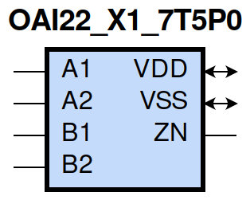
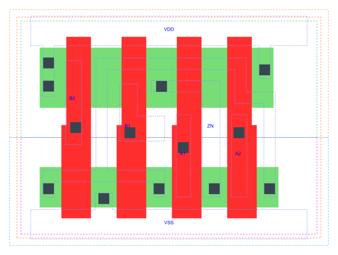

=======================================
gf180mcu_fd_sc_mcu7t5v0__oai22_x1
=======================================

**gf180mcu_fd_sc_mcu7t5v0__oai22_x1 symbol**

**gf180mcu_fd_sc_mcu7t5v0__oai22_x1 schematic**

.. image:: sc7_sch/OAI22_X1_sch.png
    :height: 300px
    :width: 500 px
    :align: center
    :alt: gf180mcu_fd_sc_mcu7t5v0__oai22_x1 schematic

**gf180mcu_fd_sc_mcu7t5v0__oai22_x1 layout**

.. include:: images.rst

OAI22_X1 is a two 2-input OR into 2-input NAND, NAND[OR(A1,A2),OR(B1,B2)], 1X drive strength

|
| Attributes

============= ======================
**Attribute** **Value**
area          21.952000 µm\ :sup:`2`
============= ======================

|
| OUTPUT FUNCTIONS

============== =============================
**Output Pin** **Function**
ZN             (((!A1)&(!A2))|((!B1)&(!B2)))
============== =============================

|
| TRUTH TABLE FOR ZN

====== ====== ====== ====== ======
**A1** **A2** **B1** **B2** **ZN**
0      0      ?      ?      1
?      ?      0      0      1
1      ?      1      ?      0
1      ?      ?      1      0
?      1      1      ?      0
?      1      ?      1      0
====== ====== ====== ====== ======

|
| FUNCTIONAL SCHEMATIC
| |image554|
| PIN CAPACITANCE (pf)

======= ======== ====================
**Pin** **Type** **Capacitance (pf)**
B2      input    0.0047
B1      input    0.0048
A1      input    0.0049
A2      input    0.0048
======= ======== ====================

|
| DELAY AND OUTPUT TRANSITION TIME corresponding to min slew and load

+---------------+------------+--------------------+--------------+-------------------+----------------+---------------+
| **Input Pin** | **Output** | **When Condition** | **Tin (ns)** | **Out Load (pf)** | **Delay (ns)** | **Tout (ns)** |
+---------------+------------+--------------------+--------------+-------------------+----------------+---------------+
| B2(HL)        | ZN(LH)     | !A1&A2&!B1         | 0.0100       | 0.0010            | 0.2486         | 0.2111        |
+---------------+------------+--------------------+--------------+-------------------+----------------+---------------+
| B2(HL)        | ZN(LH)     | A1&!A2&!B1         | 0.0100       | 0.0010            | 0.2350         | 0.1654        |
+---------------+------------+--------------------+--------------+-------------------+----------------+---------------+
| B2(HL)        | ZN(LH)     | A1&A2&!B1          | 0.0100       | 0.0010            | 0.2614         | 0.1841        |
+---------------+------------+--------------------+--------------+-------------------+----------------+---------------+
| B2(LH)        | ZN(HL)     | !A1&A2&!B1         | 0.0100       | 0.0010            | 0.1508         | 0.0724        |
+---------------+------------+--------------------+--------------+-------------------+----------------+---------------+
| B2(LH)        | ZN(HL)     | A1&!A2&!B1         | 0.0100       | 0.0010            | 0.1254         | 0.0567        |
+---------------+------------+--------------------+--------------+-------------------+----------------+---------------+
| B2(LH)        | ZN(HL)     | A1&A2&!B1          | 0.0100       | 0.0010            | 0.1047         | 0.0529        |
+---------------+------------+--------------------+--------------+-------------------+----------------+---------------+
| B1(HL)        | ZN(LH)     | !A1&A2&!B2         | 0.0100       | 0.0010            | 0.2227         | 0.2113        |
+---------------+------------+--------------------+--------------+-------------------+----------------+---------------+
| B1(HL)        | ZN(LH)     | A1&!A2&!B2         | 0.0100       | 0.0010            | 0.2089         | 0.1655        |
+---------------+------------+--------------------+--------------+-------------------+----------------+---------------+
| B1(HL)        | ZN(LH)     | A1&A2&!B2          | 0.0100       | 0.0010            | 0.2357         | 0.1841        |
+---------------+------------+--------------------+--------------+-------------------+----------------+---------------+
| B1(LH)        | ZN(HL)     | !A1&A2&!B2         | 0.0100       | 0.0010            | 0.1270         | 0.0561        |
+---------------+------------+--------------------+--------------+-------------------+----------------+---------------+
| B1(LH)        | ZN(HL)     | A1&!A2&!B2         | 0.0100       | 0.0010            | 0.1038         | 0.0407        |
+---------------+------------+--------------------+--------------+-------------------+----------------+---------------+
| B1(LH)        | ZN(HL)     | A1&A2&!B2          | 0.0100       | 0.0010            | 0.0887         | 0.0404        |
+---------------+------------+--------------------+--------------+-------------------+----------------+---------------+
| A1(HL)        | ZN(LH)     | !A2&!B1&B2         | 0.0100       | 0.0010            | 0.1169         | 0.1234        |
+---------------+------------+--------------------+--------------+-------------------+----------------+---------------+
| A1(HL)        | ZN(LH)     | !A2&B1&!B2         | 0.0100       | 0.0010            | 0.1082         | 0.0829        |
+---------------+------------+--------------------+--------------+-------------------+----------------+---------------+
| A1(HL)        | ZN(LH)     | !A2&B1&B2          | 0.0100       | 0.0010            | 0.1074         | 0.0825        |
+---------------+------------+--------------------+--------------+-------------------+----------------+---------------+
| A1(LH)        | ZN(HL)     | !A2&!B1&B2         | 0.0100       | 0.0010            | 0.0834         | 0.0556        |
+---------------+------------+--------------------+--------------+-------------------+----------------+---------------+
| A1(LH)        | ZN(HL)     | !A2&B1&!B2         | 0.0100       | 0.0010            | 0.0603         | 0.0383        |
+---------------+------------+--------------------+--------------+-------------------+----------------+---------------+
| A1(LH)        | ZN(HL)     | !A2&B1&B2          | 0.0100       | 0.0010            | 0.0534         | 0.0301        |
+---------------+------------+--------------------+--------------+-------------------+----------------+---------------+
| A2(HL)        | ZN(LH)     | !A1&!B1&B2         | 0.0100       | 0.0010            | 0.1417         | 0.1235        |
+---------------+------------+--------------------+--------------+-------------------+----------------+---------------+
| A2(HL)        | ZN(LH)     | !A1&B1&!B2         | 0.0100       | 0.0010            | 0.1329         | 0.0828        |
+---------------+------------+--------------------+--------------+-------------------+----------------+---------------+
| A2(HL)        | ZN(LH)     | !A1&B1&B2          | 0.0100       | 0.0010            | 0.1320         | 0.0828        |
+---------------+------------+--------------------+--------------+-------------------+----------------+---------------+
| A2(LH)        | ZN(HL)     | !A1&!B1&B2         | 0.0100       | 0.0010            | 0.1064         | 0.0721        |
+---------------+------------+--------------------+--------------+-------------------+----------------+---------------+
| A2(LH)        | ZN(HL)     | !A1&B1&!B2         | 0.0100       | 0.0010            | 0.0804         | 0.0554        |
+---------------+------------+--------------------+--------------+-------------------+----------------+---------------+
| A2(LH)        | ZN(HL)     | !A1&B1&B2          | 0.0100       | 0.0010            | 0.0688         | 0.0429        |
+---------------+------------+--------------------+--------------+-------------------+----------------+---------------+

|
| DYNAMIC ENERGY

+---------------+--------------------+--------------+------------+-------------------+---------------------+
| **Input Pin** | **When Condition** | **Tin (ns)** | **Output** | **Out Load (pf)** | **Energy (uW/MHz)** |
+---------------+--------------------+--------------+------------+-------------------+---------------------+
| A1            | !A2&!B1&B2         | 0.0100       | ZN(LH)     | 0.0010            | 0.1500              |
+---------------+--------------------+--------------+------------+-------------------+---------------------+
| A1            | !A2&B1&!B2         | 0.0100       | ZN(LH)     | 0.0010            | 0.1199              |
+---------------+--------------------+--------------+------------+-------------------+---------------------+
| A1            | !A2&B1&B2          | 0.0100       | ZN(LH)     | 0.0010            | 0.1193              |
+---------------+--------------------+--------------+------------+-------------------+---------------------+
| B2            | !A1&A2&!B1         | 0.0100       | ZN(LH)     | 0.0010            | 0.3056              |
+---------------+--------------------+--------------+------------+-------------------+---------------------+
| B2            | A1&!A2&!B1         | 0.0100       | ZN(LH)     | 0.0010            | 0.2759              |
+---------------+--------------------+--------------+------------+-------------------+---------------------+
| B2            | A1&A2&!B1          | 0.0100       | ZN(LH)     | 0.0010            | 0.2984              |
+---------------+--------------------+--------------+------------+-------------------+---------------------+
| B1            | !A1&A2&!B2         | 0.0100       | ZN(LH)     | 0.0010            | 0.2754              |
+---------------+--------------------+--------------+------------+-------------------+---------------------+
| B1            | A1&!A2&!B2         | 0.0100       | ZN(LH)     | 0.0010            | 0.2457              |
+---------------+--------------------+--------------+------------+-------------------+---------------------+
| B1            | A1&A2&!B2          | 0.0100       | ZN(LH)     | 0.0010            | 0.2683              |
+---------------+--------------------+--------------+------------+-------------------+---------------------+
| A2            | !A1&!B1&B2         | 0.0100       | ZN(LH)     | 0.0010            | 0.1800              |
+---------------+--------------------+--------------+------------+-------------------+---------------------+
| A2            | !A1&B1&!B2         | 0.0100       | ZN(LH)     | 0.0010            | 0.1499              |
+---------------+--------------------+--------------+------------+-------------------+---------------------+
| A2            | !A1&B1&B2          | 0.0100       | ZN(LH)     | 0.0010            | 0.1493              |
+---------------+--------------------+--------------+------------+-------------------+---------------------+
| B1            | !A1&A2&!B2         | 0.0100       | ZN(HL)     | 0.0010            | 0.0323              |
+---------------+--------------------+--------------+------------+-------------------+---------------------+
| B1            | A1&!A2&!B2         | 0.0100       | ZN(HL)     | 0.0010            | 0.0070              |
+---------------+--------------------+--------------+------------+-------------------+---------------------+
| B1            | A1&A2&!B2          | 0.0100       | ZN(HL)     | 0.0010            | 0.0071              |
+---------------+--------------------+--------------+------------+-------------------+---------------------+
| A1            | !A2&!B1&B2         | 0.0100       | ZN(HL)     | 0.0010            | 0.0343              |
+---------------+--------------------+--------------+------------+-------------------+---------------------+
| A1            | !A2&B1&!B2         | 0.0100       | ZN(HL)     | 0.0010            | 0.0074              |
+---------------+--------------------+--------------+------------+-------------------+---------------------+
| A1            | !A2&B1&B2          | 0.0100       | ZN(HL)     | 0.0010            | 0.0074              |
+---------------+--------------------+--------------+------------+-------------------+---------------------+
| B2            | !A1&A2&!B1         | 0.0100       | ZN(HL)     | 0.0010            | 0.0555              |
+---------------+--------------------+--------------+------------+-------------------+---------------------+
| B2            | A1&!A2&!B1         | 0.0100       | ZN(HL)     | 0.0010            | 0.0308              |
+---------------+--------------------+--------------+------------+-------------------+---------------------+
| B2            | A1&A2&!B1          | 0.0100       | ZN(HL)     | 0.0010            | 0.0308              |
+---------------+--------------------+--------------+------------+-------------------+---------------------+
| A2            | !A1&!B1&B2         | 0.0100       | ZN(HL)     | 0.0010            | 0.0557              |
+---------------+--------------------+--------------+------------+-------------------+---------------------+
| A2            | !A1&B1&!B2         | 0.0100       | ZN(HL)     | 0.0010            | 0.0292              |
+---------------+--------------------+--------------+------------+-------------------+---------------------+
| A2            | !A1&B1&B2          | 0.0100       | ZN(HL)     | 0.0010            | 0.0292              |
+---------------+--------------------+--------------+------------+-------------------+---------------------+
| A1(LH)        | !A2&!B1&!B2        | 0.0100       | n/a        | n/a               | 0.0559              |
+---------------+--------------------+--------------+------------+-------------------+---------------------+
| A1(LH)        | A2&!B1&!B2         | 0.0100       | n/a        | n/a               | -0.0430             |
+---------------+--------------------+--------------+------------+-------------------+---------------------+
| A1(LH)        | A2&!B1&B2          | 0.0100       | n/a        | n/a               | -0.0111             |
+---------------+--------------------+--------------+------------+-------------------+---------------------+
| A1(LH)        | A2&B1&!B2          | 0.0100       | n/a        | n/a               | -0.0111             |
+---------------+--------------------+--------------+------------+-------------------+---------------------+
| A1(LH)        | A2&B1&B2           | 0.0100       | n/a        | n/a               | -0.0111             |
+---------------+--------------------+--------------+------------+-------------------+---------------------+
| B2(LH)        | !A1&!A2&!B1        | 0.0100       | n/a        | n/a               | -0.0393             |
+---------------+--------------------+--------------+------------+-------------------+---------------------+
| B2(LH)        | !A1&!A2&B1         | 0.0100       | n/a        | n/a               | -0.0379             |
+---------------+--------------------+--------------+------------+-------------------+---------------------+
| B2(LH)        | !A1&A2&B1          | 0.0100       | n/a        | n/a               | -0.0327             |
+---------------+--------------------+--------------+------------+-------------------+---------------------+
| B2(LH)        | A1&!A2&B1          | 0.0100       | n/a        | n/a               | -0.0327             |
+---------------+--------------------+--------------+------------+-------------------+---------------------+
| B2(LH)        | A1&A2&B1           | 0.0100       | n/a        | n/a               | -0.0327             |
+---------------+--------------------+--------------+------------+-------------------+---------------------+
| A2(HL)        | !A1&!B1&!B2        | 0.0100       | n/a        | n/a               | 0.0441              |
+---------------+--------------------+--------------+------------+-------------------+---------------------+
| A2(HL)        | A1&!B1&!B2         | 0.0100       | n/a        | n/a               | 0.0440              |
+---------------+--------------------+--------------+------------+-------------------+---------------------+
| A2(HL)        | A1&!B1&B2          | 0.0100       | n/a        | n/a               | 0.0393              |
+---------------+--------------------+--------------+------------+-------------------+---------------------+
| A2(HL)        | A1&B1&!B2          | 0.0100       | n/a        | n/a               | 0.0393              |
+---------------+--------------------+--------------+------------+-------------------+---------------------+
| A2(HL)        | A1&B1&B2           | 0.0100       | n/a        | n/a               | 0.0393              |
+---------------+--------------------+--------------+------------+-------------------+---------------------+
| B1(HL)        | !A1&!A2&!B2        | 0.0100       | n/a        | n/a               | 0.0423              |
+---------------+--------------------+--------------+------------+-------------------+---------------------+
| B1(HL)        | !A1&!A2&B2         | 0.0100       | n/a        | n/a               | 0.0397              |
+---------------+--------------------+--------------+------------+-------------------+---------------------+
| B1(HL)        | !A1&A2&B2          | 0.0100       | n/a        | n/a               | 0.0282              |
+---------------+--------------------+--------------+------------+-------------------+---------------------+
| B1(HL)        | A1&!A2&B2          | 0.0100       | n/a        | n/a               | 0.0282              |
+---------------+--------------------+--------------+------------+-------------------+---------------------+
| B1(HL)        | A1&A2&B2           | 0.0100       | n/a        | n/a               | 0.0282              |
+---------------+--------------------+--------------+------------+-------------------+---------------------+
| B2(HL)        | !A1&!A2&!B1        | 0.0100       | n/a        | n/a               | 0.0420              |
+---------------+--------------------+--------------+------------+-------------------+---------------------+
| B2(HL)        | !A1&!A2&B1         | 0.0100       | n/a        | n/a               | 0.0393              |
+---------------+--------------------+--------------+------------+-------------------+---------------------+
| B2(HL)        | !A1&A2&B1          | 0.0100       | n/a        | n/a               | 0.0393              |
+---------------+--------------------+--------------+------------+-------------------+---------------------+
| B2(HL)        | A1&!A2&B1          | 0.0100       | n/a        | n/a               | 0.0393              |
+---------------+--------------------+--------------+------------+-------------------+---------------------+
| B2(HL)        | A1&A2&B1           | 0.0100       | n/a        | n/a               | 0.0393              |
+---------------+--------------------+--------------+------------+-------------------+---------------------+
| A1(HL)        | !A2&!B1&!B2        | 0.0100       | n/a        | n/a               | 0.0443              |
+---------------+--------------------+--------------+------------+-------------------+---------------------+
| A1(HL)        | A2&!B1&!B2         | 0.0100       | n/a        | n/a               | 0.0443              |
+---------------+--------------------+--------------+------------+-------------------+---------------------+
| A1(HL)        | A2&!B1&B2          | 0.0100       | n/a        | n/a               | 0.0264              |
+---------------+--------------------+--------------+------------+-------------------+---------------------+
| A1(HL)        | A2&B1&!B2          | 0.0100       | n/a        | n/a               | 0.0264              |
+---------------+--------------------+--------------+------------+-------------------+---------------------+
| A1(HL)        | A2&B1&B2           | 0.0100       | n/a        | n/a               | 0.0264              |
+---------------+--------------------+--------------+------------+-------------------+---------------------+
| B1(LH)        | !A1&!A2&!B2        | 0.0100       | n/a        | n/a               | -0.0398             |
+---------------+--------------------+--------------+------------+-------------------+---------------------+
| B1(LH)        | !A1&!A2&B2         | 0.0100       | n/a        | n/a               | -0.0385             |
+---------------+--------------------+--------------+------------+-------------------+---------------------+
| B1(LH)        | !A1&A2&B2          | 0.0100       | n/a        | n/a               | -0.0112             |
+---------------+--------------------+--------------+------------+-------------------+---------------------+
| B1(LH)        | A1&!A2&B2          | 0.0100       | n/a        | n/a               | -0.0112             |
+---------------+--------------------+--------------+------------+-------------------+---------------------+
| B1(LH)        | A1&A2&B2           | 0.0100       | n/a        | n/a               | -0.0112             |
+---------------+--------------------+--------------+------------+-------------------+---------------------+
| A2(LH)        | !A1&!B1&!B2        | 0.0100       | n/a        | n/a               | 0.0563              |
+---------------+--------------------+--------------+------------+-------------------+---------------------+
| A2(LH)        | A1&!B1&!B2         | 0.0100       | n/a        | n/a               | -0.0426             |
+---------------+--------------------+--------------+------------+-------------------+---------------------+
| A2(LH)        | A1&!B1&B2          | 0.0100       | n/a        | n/a               | -0.0329             |
+---------------+--------------------+--------------+------------+-------------------+---------------------+
| A2(LH)        | A1&B1&!B2          | 0.0100       | n/a        | n/a               | -0.0329             |
+---------------+--------------------+--------------+------------+-------------------+---------------------+
| A2(LH)        | A1&B1&B2           | 0.0100       | n/a        | n/a               | -0.0329             |
+---------------+--------------------+--------------+------------+-------------------+---------------------+

|
| LEAKAGE POWER

================== ==============
**When Condition** **Power (nW)**
!A1&!A2&!B1&!B2    0.1004
!A1&!A2&!B1&B2     0.1009
!A1&!A2&B1&!B2     0.1009
!A1&!A2&B1&B2      0.1009
!A1&A2&!B1&!B2     0.1806
A1&!A2&!B1&!B2     0.1806
A1&A2&!B1&!B2      0.1810
!A1&A2&!B1&B2      0.1743
!A1&A2&B1&!B2      0.1386
!A1&A2&B1&B2       0.1386
A1&!A2&!B1&B2      0.1386
A1&!A2&B1&!B2      0.1030
A1&!A2&B1&B2       0.1030
A1&A2&!B1&B2       0.1386
A1&A2&B1&!B2       0.1030
A1&A2&B1&B2        0.1030
================== ==============

