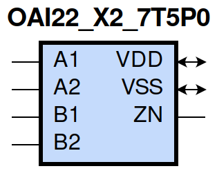
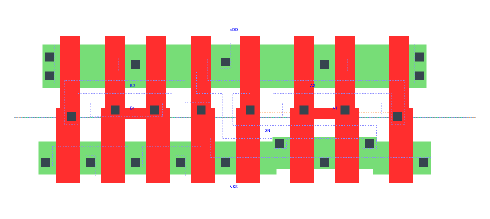

=======================================
gf180mcu_fd_sc_mcu7t5v0__oai22_x2
=======================================

**gf180mcu_fd_sc_mcu7t5v0__oai22_x2 symbol**

**gf180mcu_fd_sc_mcu7t5v0__oai22_x2 schematic**

.. image:: sc7_sch/OAI22_X2_sch.png
    :height: 300px
    :width: 500 px
    :align: center
    :alt: gf180mcu_fd_sc_mcu7t5v0__oai22_x2 schematic

**gf180mcu_fd_sc_mcu7t5v0__oai22_x2 layout**

.. include:: images.rst

OAI22_X2 is a two 2-input OR into 2-input NAND, NAND[OR(A1,A2),OR(B1,B2)], 2X drive strength

|
| Attributes

============= ======================
**Attribute** **Value**
area          41.708800 µm\ :sup:`2`
============= ======================

|
| OUTPUT FUNCTIONS

============== =============================
**Output Pin** **Function**
ZN             (((!A1)&(!A2))|((!B1)&(!B2)))
============== =============================

|
| TRUTH TABLE FOR ZN

====== ====== ====== ====== ======
**A1** **A2** **B1** **B2** **ZN**
0      0      ?      ?      1
?      ?      0      0      1
1      ?      1      ?      0
1      ?      ?      1      0
?      1      1      ?      0
?      1      ?      1      0
====== ====== ====== ====== ======

|
| FUNCTIONAL SCHEMATIC
| |image557|
| PIN CAPACITANCE (pf)

======= ======== ====================
**Pin** **Type** **Capacitance (pf)**
B2      input    0.0093
B1      input    0.0088
A2      input    0.0094
A1      input    0.0091
======= ======== ====================

|
| DELAY AND OUTPUT TRANSITION TIME corresponding to min slew and load

+---------------+------------+--------------------+--------------+-------------------+----------------+---------------+
| **Input Pin** | **Output** | **When Condition** | **Tin (ns)** | **Out Load (pf)** | **Delay (ns)** | **Tout (ns)** |
+---------------+------------+--------------------+--------------+-------------------+----------------+---------------+
| B2(HL)        | ZN(LH)     | !A1&A2&!B1         | 0.0100       | 0.0010            | 0.2482         | 0.2125        |
+---------------+------------+--------------------+--------------+-------------------+----------------+---------------+
| B2(HL)        | ZN(LH)     | A1&!A2&!B1         | 0.0100       | 0.0010            | 0.2352         | 0.1626        |
+---------------+------------+--------------------+--------------+-------------------+----------------+---------------+
| B2(HL)        | ZN(LH)     | A1&A2&!B1          | 0.0100       | 0.0010            | 0.2620         | 0.1826        |
+---------------+------------+--------------------+--------------+-------------------+----------------+---------------+
| B2(LH)        | ZN(HL)     | !A1&A2&!B1         | 0.0100       | 0.0010            | 0.1356         | 0.0696        |
+---------------+------------+--------------------+--------------+-------------------+----------------+---------------+
| B2(LH)        | ZN(HL)     | A1&!A2&!B1         | 0.0100       | 0.0010            | 0.1114         | 0.0538        |
+---------------+------------+--------------------+--------------+-------------------+----------------+---------------+
| B2(LH)        | ZN(HL)     | A1&A2&!B1          | 0.0100       | 0.0010            | 0.0929         | 0.0491        |
+---------------+------------+--------------------+--------------+-------------------+----------------+---------------+
| B1(HL)        | ZN(LH)     | !A1&A2&!B2         | 0.0100       | 0.0010            | 0.2219         | 0.2124        |
+---------------+------------+--------------------+--------------+-------------------+----------------+---------------+
| B1(HL)        | ZN(LH)     | A1&!A2&!B2         | 0.0100       | 0.0010            | 0.2092         | 0.1627        |
+---------------+------------+--------------------+--------------+-------------------+----------------+---------------+
| B1(HL)        | ZN(LH)     | A1&A2&!B2          | 0.0100       | 0.0010            | 0.2358         | 0.1827        |
+---------------+------------+--------------------+--------------+-------------------+----------------+---------------+
| B1(LH)        | ZN(HL)     | !A1&A2&!B2         | 0.0100       | 0.0010            | 0.1145         | 0.0547        |
+---------------+------------+--------------------+--------------+-------------------+----------------+---------------+
| B1(LH)        | ZN(HL)     | A1&!A2&!B2         | 0.0100       | 0.0010            | 0.0926         | 0.0393        |
+---------------+------------+--------------------+--------------+-------------------+----------------+---------------+
| B1(LH)        | ZN(HL)     | A1&A2&!B2          | 0.0100       | 0.0010            | 0.0794         | 0.0379        |
+---------------+------------+--------------------+--------------+-------------------+----------------+---------------+
| A2(HL)        | ZN(LH)     | !A1&!B1&B2         | 0.0100       | 0.0010            | 0.1570         | 0.1322        |
+---------------+------------+--------------------+--------------+-------------------+----------------+---------------+
| A2(HL)        | ZN(LH)     | !A1&B1&!B2         | 0.0100       | 0.0010            | 0.1478         | 0.0906        |
+---------------+------------+--------------------+--------------+-------------------+----------------+---------------+
| A2(HL)        | ZN(LH)     | !A1&B1&B2          | 0.0100       | 0.0010            | 0.1467         | 0.0907        |
+---------------+------------+--------------------+--------------+-------------------+----------------+---------------+
| A2(LH)        | ZN(HL)     | !A1&!B1&B2         | 0.0100       | 0.0010            | 0.1026         | 0.0697        |
+---------------+------------+--------------------+--------------+-------------------+----------------+---------------+
| A2(LH)        | ZN(HL)     | !A1&B1&!B2         | 0.0100       | 0.0010            | 0.0792         | 0.0550        |
+---------------+------------+--------------------+--------------+-------------------+----------------+---------------+
| A2(LH)        | ZN(HL)     | !A1&B1&B2          | 0.0100       | 0.0010            | 0.0665         | 0.0423        |
+---------------+------------+--------------------+--------------+-------------------+----------------+---------------+
| A1(HL)        | ZN(LH)     | !A2&!B1&B2         | 0.0100       | 0.0010            | 0.1276         | 0.1318        |
+---------------+------------+--------------------+--------------+-------------------+----------------+---------------+
| A1(HL)        | ZN(LH)     | !A2&B1&!B2         | 0.0100       | 0.0010            | 0.1185         | 0.0903        |
+---------------+------------+--------------------+--------------+-------------------+----------------+---------------+
| A1(HL)        | ZN(LH)     | !A2&B1&B2          | 0.0100       | 0.0010            | 0.1175         | 0.0903        |
+---------------+------------+--------------------+--------------+-------------------+----------------+---------------+
| A1(LH)        | ZN(HL)     | !A2&!B1&B2         | 0.0100       | 0.0010            | 0.0803         | 0.0534        |
+---------------+------------+--------------------+--------------+-------------------+----------------+---------------+
| A1(LH)        | ZN(HL)     | !A2&B1&!B2         | 0.0100       | 0.0010            | 0.0597         | 0.0383        |
+---------------+------------+--------------------+--------------+-------------------+----------------+---------------+
| A1(LH)        | ZN(HL)     | !A2&B1&B2          | 0.0100       | 0.0010            | 0.0520         | 0.0299        |
+---------------+------------+--------------------+--------------+-------------------+----------------+---------------+

|
| DYNAMIC ENERGY

+---------------+--------------------+--------------+------------+-------------------+---------------------+
| **Input Pin** | **When Condition** | **Tin (ns)** | **Output** | **Out Load (pf)** | **Energy (uW/MHz)** |
+---------------+--------------------+--------------+------------+-------------------+---------------------+
| A1            | !A2&!B1&B2         | 0.0100       | ZN(LH)     | 0.0010            | 0.3178              |
+---------------+--------------------+--------------+------------+-------------------+---------------------+
| A1            | !A2&B1&!B2         | 0.0100       | ZN(LH)     | 0.0010            | 0.2642              |
+---------------+--------------------+--------------+------------+-------------------+---------------------+
| A1            | !A2&B1&B2          | 0.0100       | ZN(LH)     | 0.0010            | 0.2624              |
+---------------+--------------------+--------------+------------+-------------------+---------------------+
| B2            | !A1&A2&!B1         | 0.0100       | ZN(LH)     | 0.0010            | 0.5647              |
+---------------+--------------------+--------------+------------+-------------------+---------------------+
| B2            | A1&!A2&!B1         | 0.0100       | ZN(LH)     | 0.0010            | 0.5105              |
+---------------+--------------------+--------------+------------+-------------------+---------------------+
| B2            | A1&A2&!B1          | 0.0100       | ZN(LH)     | 0.0010            | 0.5554              |
+---------------+--------------------+--------------+------------+-------------------+---------------------+
| B1            | !A1&A2&!B2         | 0.0100       | ZN(LH)     | 0.0010            | 0.5109              |
+---------------+--------------------+--------------+------------+-------------------+---------------------+
| B1            | A1&!A2&!B2         | 0.0100       | ZN(LH)     | 0.0010            | 0.4568              |
+---------------+--------------------+--------------+------------+-------------------+---------------------+
| B1            | A1&A2&!B2          | 0.0100       | ZN(LH)     | 0.0010            | 0.5016              |
+---------------+--------------------+--------------+------------+-------------------+---------------------+
| A2            | !A1&!B1&B2         | 0.0100       | ZN(LH)     | 0.0010            | 0.3722              |
+---------------+--------------------+--------------+------------+-------------------+---------------------+
| A2            | !A1&B1&!B2         | 0.0100       | ZN(LH)     | 0.0010            | 0.3186              |
+---------------+--------------------+--------------+------------+-------------------+---------------------+
| A2            | !A1&B1&B2          | 0.0100       | ZN(LH)     | 0.0010            | 0.3170              |
+---------------+--------------------+--------------+------------+-------------------+---------------------+
| B1            | !A1&A2&!B2         | 0.0100       | ZN(HL)     | 0.0010            | 0.0655              |
+---------------+--------------------+--------------+------------+-------------------+---------------------+
| B1            | A1&!A2&!B2         | 0.0100       | ZN(HL)     | 0.0010            | 0.0091              |
+---------------+--------------------+--------------+------------+-------------------+---------------------+
| B1            | A1&A2&!B2          | 0.0100       | ZN(HL)     | 0.0010            | 0.0093              |
+---------------+--------------------+--------------+------------+-------------------+---------------------+
| A1            | !A2&!B1&B2         | 0.0100       | ZN(HL)     | 0.0010            | 0.0581              |
+---------------+--------------------+--------------+------------+-------------------+---------------------+
| A1            | !A2&B1&!B2         | 0.0100       | ZN(HL)     | 0.0010            | 0.0094              |
+---------------+--------------------+--------------+------------+-------------------+---------------------+
| A1            | !A2&B1&B2          | 0.0100       | ZN(HL)     | 0.0010            | 0.0093              |
+---------------+--------------------+--------------+------------+-------------------+---------------------+
| B2            | !A1&A2&!B1         | 0.0100       | ZN(HL)     | 0.0010            | 0.1073              |
+---------------+--------------------+--------------+------------+-------------------+---------------------+
| B2            | A1&!A2&!B1         | 0.0100       | ZN(HL)     | 0.0010            | 0.0522              |
+---------------+--------------------+--------------+------------+-------------------+---------------------+
| B2            | A1&A2&!B1          | 0.0100       | ZN(HL)     | 0.0010            | 0.0522              |
+---------------+--------------------+--------------+------------+-------------------+---------------------+
| A2            | !A1&!B1&B2         | 0.0100       | ZN(HL)     | 0.0010            | 0.1084              |
+---------------+--------------------+--------------+------------+-------------------+---------------------+
| A2            | !A1&B1&!B2         | 0.0100       | ZN(HL)     | 0.0010            | 0.0602              |
+---------------+--------------------+--------------+------------+-------------------+---------------------+
| A2            | !A1&B1&B2          | 0.0100       | ZN(HL)     | 0.0010            | 0.0602              |
+---------------+--------------------+--------------+------------+-------------------+---------------------+
| A1(LH)        | !A2&!B1&!B2        | 0.0100       | n/a        | n/a               | 0.0629              |
+---------------+--------------------+--------------+------------+-------------------+---------------------+
| A1(LH)        | A2&!B1&!B2         | 0.0100       | n/a        | n/a               | -0.0777             |
+---------------+--------------------+--------------+------------+-------------------+---------------------+
| A1(LH)        | A2&!B1&B2          | 0.0100       | n/a        | n/a               | -0.0203             |
+---------------+--------------------+--------------+------------+-------------------+---------------------+
| A1(LH)        | A2&B1&!B2          | 0.0100       | n/a        | n/a               | -0.0203             |
+---------------+--------------------+--------------+------------+-------------------+---------------------+
| A1(LH)        | A2&B1&B2           | 0.0100       | n/a        | n/a               | -0.0203             |
+---------------+--------------------+--------------+------------+-------------------+---------------------+
| B2(LH)        | !A1&!A2&!B1        | 0.0100       | n/a        | n/a               | -0.0703             |
+---------------+--------------------+--------------+------------+-------------------+---------------------+
| B2(LH)        | !A1&!A2&B1         | 0.0100       | n/a        | n/a               | -0.0680             |
+---------------+--------------------+--------------+------------+-------------------+---------------------+
| B2(LH)        | !A1&A2&B1          | 0.0100       | n/a        | n/a               | -0.0587             |
+---------------+--------------------+--------------+------------+-------------------+---------------------+
| B2(LH)        | A1&!A2&B1          | 0.0100       | n/a        | n/a               | -0.0587             |
+---------------+--------------------+--------------+------------+-------------------+---------------------+
| B2(LH)        | A1&A2&B1           | 0.0100       | n/a        | n/a               | -0.0587             |
+---------------+--------------------+--------------+------------+-------------------+---------------------+
| A2(HL)        | !A1&!B1&!B2        | 0.0100       | n/a        | n/a               | 0.0797              |
+---------------+--------------------+--------------+------------+-------------------+---------------------+
| A2(HL)        | A1&!B1&!B2         | 0.0100       | n/a        | n/a               | 0.0816              |
+---------------+--------------------+--------------+------------+-------------------+---------------------+
| A2(HL)        | A1&!B1&B2          | 0.0100       | n/a        | n/a               | 0.0704              |
+---------------+--------------------+--------------+------------+-------------------+---------------------+
| A2(HL)        | A1&B1&!B2          | 0.0100       | n/a        | n/a               | 0.0702              |
+---------------+--------------------+--------------+------------+-------------------+---------------------+
| A2(HL)        | A1&B1&B2           | 0.0100       | n/a        | n/a               | 0.0703              |
+---------------+--------------------+--------------+------------+-------------------+---------------------+
| B1(HL)        | !A1&!A2&!B2        | 0.0100       | n/a        | n/a               | 0.0788              |
+---------------+--------------------+--------------+------------+-------------------+---------------------+
| B1(HL)        | !A1&!A2&B2         | 0.0100       | n/a        | n/a               | 0.0707              |
+---------------+--------------------+--------------+------------+-------------------+---------------------+
| B1(HL)        | !A1&A2&B2          | 0.0100       | n/a        | n/a               | 0.0512              |
+---------------+--------------------+--------------+------------+-------------------+---------------------+
| B1(HL)        | A1&!A2&B2          | 0.0100       | n/a        | n/a               | 0.0512              |
+---------------+--------------------+--------------+------------+-------------------+---------------------+
| B1(HL)        | A1&A2&B2           | 0.0100       | n/a        | n/a               | 0.0512              |
+---------------+--------------------+--------------+------------+-------------------+---------------------+
| B2(HL)        | !A1&!A2&!B1        | 0.0100       | n/a        | n/a               | 0.0785              |
+---------------+--------------------+--------------+------------+-------------------+---------------------+
| B2(HL)        | !A1&!A2&B1         | 0.0100       | n/a        | n/a               | 0.0704              |
+---------------+--------------------+--------------+------------+-------------------+---------------------+
| B2(HL)        | !A1&A2&B1          | 0.0100       | n/a        | n/a               | 0.0703              |
+---------------+--------------------+--------------+------------+-------------------+---------------------+
| B2(HL)        | A1&!A2&B1          | 0.0100       | n/a        | n/a               | 0.0703              |
+---------------+--------------------+--------------+------------+-------------------+---------------------+
| B2(HL)        | A1&A2&B1           | 0.0100       | n/a        | n/a               | 0.0703              |
+---------------+--------------------+--------------+------------+-------------------+---------------------+
| A1(HL)        | !A2&!B1&!B2        | 0.0100       | n/a        | n/a               | 0.0800              |
+---------------+--------------------+--------------+------------+-------------------+---------------------+
| A1(HL)        | A2&!B1&!B2         | 0.0100       | n/a        | n/a               | 0.0815              |
+---------------+--------------------+--------------+------------+-------------------+---------------------+
| A1(HL)        | A2&!B1&B2          | 0.0100       | n/a        | n/a               | 0.0586              |
+---------------+--------------------+--------------+------------+-------------------+---------------------+
| A1(HL)        | A2&B1&!B2          | 0.0100       | n/a        | n/a               | 0.0585              |
+---------------+--------------------+--------------+------------+-------------------+---------------------+
| A1(HL)        | A2&B1&B2           | 0.0100       | n/a        | n/a               | 0.0585              |
+---------------+--------------------+--------------+------------+-------------------+---------------------+
| B1(LH)        | !A1&!A2&!B2        | 0.0100       | n/a        | n/a               | -0.0710             |
+---------------+--------------------+--------------+------------+-------------------+---------------------+
| B1(LH)        | !A1&!A2&B2         | 0.0100       | n/a        | n/a               | -0.0688             |
+---------------+--------------------+--------------+------------+-------------------+---------------------+
| B1(LH)        | !A1&A2&B2          | 0.0100       | n/a        | n/a               | -0.0201             |
+---------------+--------------------+--------------+------------+-------------------+---------------------+
| B1(LH)        | A1&!A2&B2          | 0.0100       | n/a        | n/a               | -0.0201             |
+---------------+--------------------+--------------+------------+-------------------+---------------------+
| B1(LH)        | A1&A2&B2           | 0.0100       | n/a        | n/a               | -0.0201             |
+---------------+--------------------+--------------+------------+-------------------+---------------------+
| A2(LH)        | !A1&!B1&!B2        | 0.0100       | n/a        | n/a               | 0.0636              |
+---------------+--------------------+--------------+------------+-------------------+---------------------+
| A2(LH)        | A1&!B1&!B2         | 0.0100       | n/a        | n/a               | -0.0770             |
+---------------+--------------------+--------------+------------+-------------------+---------------------+
| A2(LH)        | A1&!B1&B2          | 0.0100       | n/a        | n/a               | -0.0584             |
+---------------+--------------------+--------------+------------+-------------------+---------------------+
| A2(LH)        | A1&B1&!B2          | 0.0100       | n/a        | n/a               | -0.0584             |
+---------------+--------------------+--------------+------------+-------------------+---------------------+
| A2(LH)        | A1&B1&B2           | 0.0100       | n/a        | n/a               | -0.0584             |
+---------------+--------------------+--------------+------------+-------------------+---------------------+

|
| LEAKAGE POWER

================== ==============
**When Condition** **Power (nW)**
!A1&!A2&!B1&!B2    0.1509
!A1&!A2&!B1&B2     0.1518
!A1&!A2&B1&!B2     0.1518
!A1&!A2&B1&B2      0.1518
!A1&A2&!B1&!B2     0.3095
A1&!A2&!B1&!B2     0.3095
A1&A2&!B1&!B2      0.3103
!A1&A2&!B1&B2      0.2984
!A1&A2&B1&!B2      0.2270
!A1&A2&B1&B2       0.2270
A1&!A2&!B1&B2      0.2270
A1&!A2&B1&!B2      0.1557
A1&!A2&B1&B2       0.1557
A1&A2&!B1&B2       0.2270
A1&A2&B1&!B2       0.1557
A1&A2&B1&B2        0.1557
================== ==============

