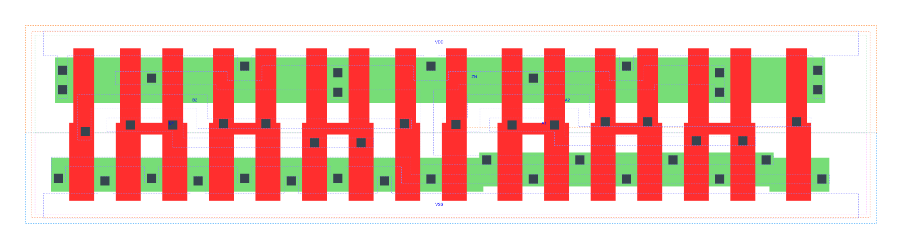

=======================================
gf180mcu_fd_sc_mcu7t5v0__oai22_x4
=======================================

**gf180mcu_fd_sc_mcu7t5v0__oai22_x4 symbol**

.. image:: sc7_sym/OAI22_X4_sym.png
    :height: 250px
    :width: 400 px
    :align: center
    :alt: gf180mcu_fd_sc_mcu7t5v0__oai22_x4 symbol

**gf180mcu_fd_sc_mcu7t5v0__oai22_x4 schematic**

.. image:: sc7_sch/OAI22_X4_sch.png
    :height: 300px
    :width: 500 px
    :align: center
    :alt: gf180mcu_fd_sc_mcu7t5v0__oai22_x4 schematic

**gf180mcu_fd_sc_mcu7t5v0__oai22_x4 layout**

.. include:: images.rst

OAI22_X4 is a two 2-input OR into 2-input NAND, NAND[OR(A1,A2),OR(B1,B2)], 4X drive strength

|
| Attributes

============= ======================
**Attribute** **Value**
area          76.832000 µm\ :sup:`2`
============= ======================

|
| OUTPUT FUNCTIONS

============== =============================
**Output Pin** **Function**
ZN             (((!A1)&(!A2))|((!B1)&(!B2)))
============== =============================

|
| TRUTH TABLE FOR ZN

====== ====== ====== ====== ======
**A1** **A2** **B1** **B2** **ZN**
0      0      ?      ?      1
?      ?      0      0      1
1      ?      1      ?      0
1      ?      ?      1      0
?      1      1      ?      0
?      1      ?      1      0
====== ====== ====== ====== ======

|
| FUNCTIONAL SCHEMATIC
| |image560|
| PIN CAPACITANCE (pf)

======= ======== ====================
**Pin** **Type** **Capacitance (pf)**
B2      input    0.0183
B1      input    0.0184
A2      input    0.0185
A1      input    0.0187
======= ======== ====================

|
| DELAY AND OUTPUT TRANSITION TIME corresponding to min slew and load

+---------------+------------+--------------------+--------------+-------------------+----------------+---------------+
| **Input Pin** | **Output** | **When Condition** | **Tin (ns)** | **Out Load (pf)** | **Delay (ns)** | **Tout (ns)** |
+---------------+------------+--------------------+--------------+-------------------+----------------+---------------+
| B2(HL)        | ZN(LH)     | !A1&A2&!B1         | 0.0100       | 0.0010            | 0.2447         | 0.2087        |
+---------------+------------+--------------------+--------------+-------------------+----------------+---------------+
| B2(HL)        | ZN(LH)     | A1&!A2&!B1         | 0.0100       | 0.0010            | 0.2319         | 0.1598        |
+---------------+------------+--------------------+--------------+-------------------+----------------+---------------+
| B2(HL)        | ZN(LH)     | A1&A2&!B1          | 0.0100       | 0.0010            | 0.2588         | 0.1797        |
+---------------+------------+--------------------+--------------+-------------------+----------------+---------------+
| B2(LH)        | ZN(HL)     | !A1&A2&!B1         | 0.0100       | 0.0010            | 0.1343         | 0.0686        |
+---------------+------------+--------------------+--------------+-------------------+----------------+---------------+
| B2(LH)        | ZN(HL)     | A1&!A2&!B1         | 0.0100       | 0.0010            | 0.1102         | 0.0530        |
+---------------+------------+--------------------+--------------+-------------------+----------------+---------------+
| B2(LH)        | ZN(HL)     | A1&A2&!B1          | 0.0100       | 0.0010            | 0.0920         | 0.0486        |
+---------------+------------+--------------------+--------------+-------------------+----------------+---------------+
| B1(HL)        | ZN(LH)     | !A1&A2&!B2         | 0.0100       | 0.0010            | 0.2180         | 0.2086        |
+---------------+------------+--------------------+--------------+-------------------+----------------+---------------+
| B1(HL)        | ZN(LH)     | A1&!A2&!B2         | 0.0100       | 0.0010            | 0.2052         | 0.1600        |
+---------------+------------+--------------------+--------------+-------------------+----------------+---------------+
| B1(HL)        | ZN(LH)     | A1&A2&!B2          | 0.0100       | 0.0010            | 0.2317         | 0.1798        |
+---------------+------------+--------------------+--------------+-------------------+----------------+---------------+
| B1(LH)        | ZN(HL)     | !A1&A2&!B2         | 0.0100       | 0.0010            | 0.1127         | 0.0534        |
+---------------+------------+--------------------+--------------+-------------------+----------------+---------------+
| B1(LH)        | ZN(HL)     | A1&!A2&!B2         | 0.0100       | 0.0010            | 0.0912         | 0.0384        |
+---------------+------------+--------------------+--------------+-------------------+----------------+---------------+
| B1(LH)        | ZN(HL)     | A1&A2&!B2          | 0.0100       | 0.0010            | 0.0783         | 0.0371        |
+---------------+------------+--------------------+--------------+-------------------+----------------+---------------+
| A2(HL)        | ZN(LH)     | !A1&!B1&B2         | 0.0100       | 0.0010            | 0.1533         | 0.1303        |
+---------------+------------+--------------------+--------------+-------------------+----------------+---------------+
| A2(HL)        | ZN(LH)     | !A1&B1&!B2         | 0.0100       | 0.0010            | 0.1443         | 0.0882        |
+---------------+------------+--------------------+--------------+-------------------+----------------+---------------+
| A2(HL)        | ZN(LH)     | !A1&B1&B2          | 0.0100       | 0.0010            | 0.1433         | 0.0882        |
+---------------+------------+--------------------+--------------+-------------------+----------------+---------------+
| A2(LH)        | ZN(HL)     | !A1&!B1&B2         | 0.0100       | 0.0010            | 0.1016         | 0.0688        |
+---------------+------------+--------------------+--------------+-------------------+----------------+---------------+
| A2(LH)        | ZN(HL)     | !A1&B1&!B2         | 0.0100       | 0.0010            | 0.0778         | 0.0537        |
+---------------+------------+--------------------+--------------+-------------------+----------------+---------------+
| A2(LH)        | ZN(HL)     | !A1&B1&B2          | 0.0100       | 0.0010            | 0.0655         | 0.0416        |
+---------------+------------+--------------------+--------------+-------------------+----------------+---------------+
| A1(HL)        | ZN(LH)     | !A2&!B1&B2         | 0.0100       | 0.0010            | 0.1249         | 0.1300        |
+---------------+------------+--------------------+--------------+-------------------+----------------+---------------+
| A1(HL)        | ZN(LH)     | !A2&B1&!B2         | 0.0100       | 0.0010            | 0.1157         | 0.0879        |
+---------------+------------+--------------------+--------------+-------------------+----------------+---------------+
| A1(HL)        | ZN(LH)     | !A2&B1&B2          | 0.0100       | 0.0010            | 0.1146         | 0.0879        |
+---------------+------------+--------------------+--------------+-------------------+----------------+---------------+
| A1(LH)        | ZN(HL)     | !A2&!B1&B2         | 0.0100       | 0.0010            | 0.0795         | 0.0526        |
+---------------+------------+--------------------+--------------+-------------------+----------------+---------------+
| A1(LH)        | ZN(HL)     | !A2&B1&!B2         | 0.0100       | 0.0010            | 0.0587         | 0.0372        |
+---------------+------------+--------------------+--------------+-------------------+----------------+---------------+
| A1(LH)        | ZN(HL)     | !A2&B1&B2          | 0.0100       | 0.0010            | 0.0511         | 0.0291        |
+---------------+------------+--------------------+--------------+-------------------+----------------+---------------+

|
| DYNAMIC ENERGY

+---------------+--------------------+--------------+------------+-------------------+---------------------+
| **Input Pin** | **When Condition** | **Tin (ns)** | **Output** | **Out Load (pf)** | **Energy (uW/MHz)** |
+---------------+--------------------+--------------+------------+-------------------+---------------------+
| A1            | !A2&!B1&B2         | 0.0100       | ZN(LH)     | 0.0010            | 0.6462              |
+---------------+--------------------+--------------+------------+-------------------+---------------------+
| A1            | !A2&B1&!B2         | 0.0100       | ZN(LH)     | 0.0010            | 0.5384              |
+---------------+--------------------+--------------+------------+-------------------+---------------------+
| A1            | !A2&B1&B2          | 0.0100       | ZN(LH)     | 0.0010            | 0.5348              |
+---------------+--------------------+--------------+------------+-------------------+---------------------+
| B2            | !A1&A2&!B1         | 0.0100       | ZN(LH)     | 0.0010            | 1.1366              |
+---------------+--------------------+--------------+------------+-------------------+---------------------+
| B2            | A1&!A2&!B1         | 0.0100       | ZN(LH)     | 0.0010            | 1.0281              |
+---------------+--------------------+--------------+------------+-------------------+---------------------+
| B2            | A1&A2&!B1          | 0.0100       | ZN(LH)     | 0.0010            | 1.1180              |
+---------------+--------------------+--------------+------------+-------------------+---------------------+
| B1            | !A1&A2&!B2         | 0.0100       | ZN(LH)     | 0.0010            | 1.0281              |
+---------------+--------------------+--------------+------------+-------------------+---------------------+
| B1            | A1&!A2&!B2         | 0.0100       | ZN(LH)     | 0.0010            | 0.9199              |
+---------------+--------------------+--------------+------------+-------------------+---------------------+
| B1            | A1&A2&!B2          | 0.0100       | ZN(LH)     | 0.0010            | 1.0096              |
+---------------+--------------------+--------------+------------+-------------------+---------------------+
| A2            | !A1&!B1&B2         | 0.0100       | ZN(LH)     | 0.0010            | 0.7554              |
+---------------+--------------------+--------------+------------+-------------------+---------------------+
| A2            | !A1&B1&!B2         | 0.0100       | ZN(LH)     | 0.0010            | 0.6473              |
+---------------+--------------------+--------------+------------+-------------------+---------------------+
| A2            | !A1&B1&B2          | 0.0100       | ZN(LH)     | 0.0010            | 0.6442              |
+---------------+--------------------+--------------+------------+-------------------+---------------------+
| B1            | !A1&A2&!B2         | 0.0100       | ZN(HL)     | 0.0010            | 0.1269              |
+---------------+--------------------+--------------+------------+-------------------+---------------------+
| B1            | A1&!A2&!B2         | 0.0100       | ZN(HL)     | 0.0010            | 0.0181              |
+---------------+--------------------+--------------+------------+-------------------+---------------------+
| B1            | A1&A2&!B2          | 0.0100       | ZN(HL)     | 0.0010            | 0.0183              |
+---------------+--------------------+--------------+------------+-------------------+---------------------+
| A1            | !A2&!B1&B2         | 0.0100       | ZN(HL)     | 0.0010            | 0.1196              |
+---------------+--------------------+--------------+------------+-------------------+---------------------+
| A1            | !A2&B1&!B2         | 0.0100       | ZN(HL)     | 0.0010            | 0.0187              |
+---------------+--------------------+--------------+------------+-------------------+---------------------+
| A1            | !A2&B1&B2          | 0.0100       | ZN(HL)     | 0.0010            | 0.0186              |
+---------------+--------------------+--------------+------------+-------------------+---------------------+
| B2            | !A1&A2&!B1         | 0.0100       | ZN(HL)     | 0.0010            | 0.2145              |
+---------------+--------------------+--------------+------------+-------------------+---------------------+
| B2            | A1&!A2&!B1         | 0.0100       | ZN(HL)     | 0.0010            | 0.1081              |
+---------------+--------------------+--------------+------------+-------------------+---------------------+
| B2            | A1&A2&!B1          | 0.0100       | ZN(HL)     | 0.0010            | 0.1077              |
+---------------+--------------------+--------------+------------+-------------------+---------------------+
| A2            | !A1&!B1&B2         | 0.0100       | ZN(HL)     | 0.0010            | 0.2154              |
+---------------+--------------------+--------------+------------+-------------------+---------------------+
| A2            | !A1&B1&!B2         | 0.0100       | ZN(HL)     | 0.0010            | 0.1162              |
+---------------+--------------------+--------------+------------+-------------------+---------------------+
| A2            | !A1&B1&B2          | 0.0100       | ZN(HL)     | 0.0010            | 0.1158              |
+---------------+--------------------+--------------+------------+-------------------+---------------------+
| A1(LH)        | !A2&!B1&!B2        | 0.0100       | n/a        | n/a               | 0.1217              |
+---------------+--------------------+--------------+------------+-------------------+---------------------+
| A1(LH)        | A2&!B1&!B2         | 0.0100       | n/a        | n/a               | -0.1554             |
+---------------+--------------------+--------------+------------+-------------------+---------------------+
| A1(LH)        | A2&!B1&B2          | 0.0100       | n/a        | n/a               | -0.0404             |
+---------------+--------------------+--------------+------------+-------------------+---------------------+
| A1(LH)        | A2&B1&!B2          | 0.0100       | n/a        | n/a               | -0.0404             |
+---------------+--------------------+--------------+------------+-------------------+---------------------+
| A1(LH)        | A2&B1&B2           | 0.0100       | n/a        | n/a               | -0.0404             |
+---------------+--------------------+--------------+------------+-------------------+---------------------+
| B2(LH)        | !A1&!A2&!B1        | 0.0100       | n/a        | n/a               | -0.1404             |
+---------------+--------------------+--------------+------------+-------------------+---------------------+
| B2(LH)        | !A1&!A2&B1         | 0.0100       | n/a        | n/a               | -0.1360             |
+---------------+--------------------+--------------+------------+-------------------+---------------------+
| B2(LH)        | !A1&A2&B1          | 0.0100       | n/a        | n/a               | -0.1171             |
+---------------+--------------------+--------------+------------+-------------------+---------------------+
| B2(LH)        | A1&!A2&B1          | 0.0100       | n/a        | n/a               | -0.1172             |
+---------------+--------------------+--------------+------------+-------------------+---------------------+
| B2(LH)        | A1&A2&B1           | 0.0100       | n/a        | n/a               | -0.1171             |
+---------------+--------------------+--------------+------------+-------------------+---------------------+
| A2(HL)        | !A1&!B1&!B2        | 0.0100       | n/a        | n/a               | 0.1590              |
+---------------+--------------------+--------------+------------+-------------------+---------------------+
| A2(HL)        | A1&!B1&!B2         | 0.0100       | n/a        | n/a               | 0.1628              |
+---------------+--------------------+--------------+------------+-------------------+---------------------+
| A2(HL)        | A1&!B1&B2          | 0.0100       | n/a        | n/a               | 0.1407              |
+---------------+--------------------+--------------+------------+-------------------+---------------------+
| A2(HL)        | A1&B1&!B2          | 0.0100       | n/a        | n/a               | 0.1407              |
+---------------+--------------------+--------------+------------+-------------------+---------------------+
| A2(HL)        | A1&B1&B2           | 0.0100       | n/a        | n/a               | 0.1407              |
+---------------+--------------------+--------------+------------+-------------------+---------------------+
| B1(HL)        | !A1&!A2&!B2        | 0.0100       | n/a        | n/a               | 0.1577              |
+---------------+--------------------+--------------+------------+-------------------+---------------------+
| B1(HL)        | !A1&!A2&B2         | 0.0100       | n/a        | n/a               | 0.1412              |
+---------------+--------------------+--------------+------------+-------------------+---------------------+
| B1(HL)        | !A1&A2&B2          | 0.0100       | n/a        | n/a               | 0.1057              |
+---------------+--------------------+--------------+------------+-------------------+---------------------+
| B1(HL)        | A1&!A2&B2          | 0.0100       | n/a        | n/a               | 0.1057              |
+---------------+--------------------+--------------+------------+-------------------+---------------------+
| B1(HL)        | A1&A2&B2           | 0.0100       | n/a        | n/a               | 0.1057              |
+---------------+--------------------+--------------+------------+-------------------+---------------------+
| B2(HL)        | !A1&!A2&!B1        | 0.0100       | n/a        | n/a               | 0.1572              |
+---------------+--------------------+--------------+------------+-------------------+---------------------+
| B2(HL)        | !A1&!A2&B1         | 0.0100       | n/a        | n/a               | 0.1409              |
+---------------+--------------------+--------------+------------+-------------------+---------------------+
| B2(HL)        | !A1&A2&B1          | 0.0100       | n/a        | n/a               | 0.1409              |
+---------------+--------------------+--------------+------------+-------------------+---------------------+
| B2(HL)        | A1&!A2&B1          | 0.0100       | n/a        | n/a               | 0.1408              |
+---------------+--------------------+--------------+------------+-------------------+---------------------+
| B2(HL)        | A1&A2&B1           | 0.0100       | n/a        | n/a               | 0.1408              |
+---------------+--------------------+--------------+------------+-------------------+---------------------+
| A1(HL)        | !A2&!B1&!B2        | 0.0100       | n/a        | n/a               | 0.1597              |
+---------------+--------------------+--------------+------------+-------------------+---------------------+
| A1(HL)        | A2&!B1&!B2         | 0.0100       | n/a        | n/a               | 0.1629              |
+---------------+--------------------+--------------+------------+-------------------+---------------------+
| A1(HL)        | A2&!B1&B2          | 0.0100       | n/a        | n/a               | 0.1131              |
+---------------+--------------------+--------------+------------+-------------------+---------------------+
| A1(HL)        | A2&B1&!B2          | 0.0100       | n/a        | n/a               | 0.1131              |
+---------------+--------------------+--------------+------------+-------------------+---------------------+
| A1(HL)        | A2&B1&B2           | 0.0100       | n/a        | n/a               | 0.1131              |
+---------------+--------------------+--------------+------------+-------------------+---------------------+
| B1(LH)        | !A1&!A2&!B2        | 0.0100       | n/a        | n/a               | -0.1416             |
+---------------+--------------------+--------------+------------+-------------------+---------------------+
| B1(LH)        | !A1&!A2&B2         | 0.0100       | n/a        | n/a               | -0.1375             |
+---------------+--------------------+--------------+------------+-------------------+---------------------+
| B1(LH)        | !A1&A2&B2          | 0.0100       | n/a        | n/a               | -0.0401             |
+---------------+--------------------+--------------+------------+-------------------+---------------------+
| B1(LH)        | A1&!A2&B2          | 0.0100       | n/a        | n/a               | -0.0401             |
+---------------+--------------------+--------------+------------+-------------------+---------------------+
| B1(LH)        | A1&A2&B2           | 0.0100       | n/a        | n/a               | -0.0401             |
+---------------+--------------------+--------------+------------+-------------------+---------------------+
| A2(LH)        | !A1&!B1&!B2        | 0.0100       | n/a        | n/a               | 0.1229              |
+---------------+--------------------+--------------+------------+-------------------+---------------------+
| A2(LH)        | A1&!B1&!B2         | 0.0100       | n/a        | n/a               | -0.1540             |
+---------------+--------------------+--------------+------------+-------------------+---------------------+
| A2(LH)        | A1&!B1&B2          | 0.0100       | n/a        | n/a               | -0.1170             |
+---------------+--------------------+--------------+------------+-------------------+---------------------+
| A2(LH)        | A1&B1&!B2          | 0.0100       | n/a        | n/a               | -0.1170             |
+---------------+--------------------+--------------+------------+-------------------+---------------------+
| A2(LH)        | A1&B1&B2           | 0.0100       | n/a        | n/a               | -0.1169             |
+---------------+--------------------+--------------+------------+-------------------+---------------------+

|
| LEAKAGE POWER

================== ==============
**When Condition** **Power (nW)**
!A1&!A2&!B1&!B2    0.2518
!A1&!A2&!B1&B2     0.2536
!A1&!A2&B1&!B2     0.2536
!A1&!A2&B1&B2      0.2536
!A1&A2&!B1&!B2     0.5716
A1&!A2&!B1&!B2     0.5716
A1&A2&!B1&!B2      0.5731
!A1&A2&!B1&B2      0.5468
!A1&A2&B1&!B2      0.4041
!A1&A2&B1&B2       0.4041
A1&!A2&!B1&B2      0.4041
A1&!A2&B1&!B2      0.2613
A1&!A2&B1&B2       0.2614
A1&A2&!B1&B2       0.4041
A1&A2&B1&!B2       0.2614
A1&A2&B1&B2        0.2614
================== ==============

