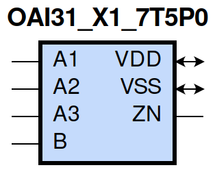
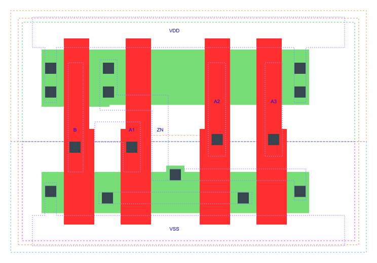

=======================================
gf180mcu_fd_sc_mcu7t5v0__oai31_x1
=======================================

**gf180mcu_fd_sc_mcu7t5v0__oai31_x1 symbol**

**gf180mcu_fd_sc_mcu7t5v0__oai31_x1 schematic**

.. image:: sc7_sch/OAI31_X1_sch.png
    :height: 300px
    :width: 500 px
    :align: center
    :alt: gf180mcu_fd_sc_mcu7t5v0__oai31_x1 schematic

**gf180mcu_fd_sc_mcu7t5v0__oai31_x1 layout**

.. include:: images.rst

OAI31_X1 is a 3-input OR into 2-input NAND, NAND[OR(A1,A2,A3),B], 1X drive strength

|
| Attributes

============= ======================
**Attribute** **Value**
area          24.147200 µm\ :sup:`2`
============= ======================

|
| OUTPUT FUNCTIONS

============== ==========================
**Output Pin** **Function**
ZN             (((!A1)&(!A2)&(!A3))|(!B))
============== ==========================

|
| TRUTH TABLE FOR ZN

====== ====== ====== ===== ======
**A1** **A2** **A3** **B** **ZN**
0      0      0      ?     1
?      ?      ?      0     1
1      ?      ?      1     0
?      1      ?      1     0
?      ?      1      1     0
====== ====== ====== ===== ======

|
| FUNCTIONAL SCHEMATIC
| |image563|
| PIN CAPACITANCE (pf)

======= ======== ====================
**Pin** **Type** **Capacitance (pf)**
B       input    0.0047
A1      input    0.0047
A2      input    0.0043
A3      input    0.0044
======= ======== ====================

|
| DELAY AND OUTPUT TRANSITION TIME corresponding to min slew and load

+---------------+------------+--------------------+--------------+-------------------+----------------+---------------+
| **Input Pin** | **Output** | **When Condition** | **Tin (ns)** | **Out Load (pf)** | **Delay (ns)** | **Tout (ns)** |
+---------------+------------+--------------------+--------------+-------------------+----------------+---------------+
| B(LH)         | ZN(HL)     | !A1&!A2&A3         | 0.0100       | 0.0010            | 0.1359         | 0.0807        |
+---------------+------------+--------------------+--------------+-------------------+----------------+---------------+
| B(LH)         | ZN(HL)     | !A1&A2&!A3         | 0.0100       | 0.0010            | 0.1274         | 0.0696        |
+---------------+------------+--------------------+--------------+-------------------+----------------+---------------+
| B(LH)         | ZN(HL)     | !A1&A2&A3          | 0.0100       | 0.0010            | 0.1045         | 0.0603        |
+---------------+------------+--------------------+--------------+-------------------+----------------+---------------+
| B(LH)         | ZN(HL)     | A1&!A2&!A3         | 0.0100       | 0.0010            | 0.1033         | 0.0520        |
+---------------+------------+--------------------+--------------+-------------------+----------------+---------------+
| B(LH)         | ZN(HL)     | A1&!A2&A3          | 0.0100       | 0.0010            | 0.0873         | 0.0470        |
+---------------+------------+--------------------+--------------+-------------------+----------------+---------------+
| B(LH)         | ZN(HL)     | A1&A2&!A3          | 0.0100       | 0.0010            | 0.0873         | 0.0471        |
+---------------+------------+--------------------+--------------+-------------------+----------------+---------------+
| B(LH)         | ZN(HL)     | A1&A2&A3           | 0.0100       | 0.0010            | 0.0852         | 0.0520        |
+---------------+------------+--------------------+--------------+-------------------+----------------+---------------+
| B(HL)         | ZN(LH)     | !A1&!A2&A3         | 0.0100       | 0.0010            | 0.1314         | 0.1207        |
+---------------+------------+--------------------+--------------+-------------------+----------------+---------------+
| B(HL)         | ZN(LH)     | !A1&A2&!A3         | 0.0100       | 0.0010            | 0.1314         | 0.1167        |
+---------------+------------+--------------------+--------------+-------------------+----------------+---------------+
| B(HL)         | ZN(LH)     | !A1&A2&A3          | 0.0100       | 0.0010            | 0.1459         | 0.1270        |
+---------------+------------+--------------------+--------------+-------------------+----------------+---------------+
| B(HL)         | ZN(LH)     | A1&!A2&!A3         | 0.0100       | 0.0010            | 0.1257         | 0.0925        |
+---------------+------------+--------------------+--------------+-------------------+----------------+---------------+
| B(HL)         | ZN(LH)     | A1&!A2&A3          | 0.0100       | 0.0010            | 0.1404         | 0.1031        |
+---------------+------------+--------------------+--------------+-------------------+----------------+---------------+
| B(HL)         | ZN(LH)     | A1&A2&!A3          | 0.0100       | 0.0010            | 0.1403         | 0.1031        |
+---------------+------------+--------------------+--------------+-------------------+----------------+---------------+
| B(HL)         | ZN(LH)     | A1&A2&A3           | 0.0100       | 0.0010            | 0.1532         | 0.1128        |
+---------------+------------+--------------------+--------------+-------------------+----------------+---------------+
| A1(HL)        | ZN(LH)     | !A2&!A3&B          | 0.0100       | 0.0010            | 0.2051         | 0.1848        |
+---------------+------------+--------------------+--------------+-------------------+----------------+---------------+
| A1(LH)        | ZN(HL)     | !A2&!A3&B          | 0.0100       | 0.0010            | 0.0760         | 0.0517        |
+---------------+------------+--------------------+--------------+-------------------+----------------+---------------+
| A2(HL)        | ZN(LH)     | !A1&!A3&B          | 0.0100       | 0.0010            | 0.2761         | 0.1862        |
+---------------+------------+--------------------+--------------+-------------------+----------------+---------------+
| A2(LH)        | ZN(HL)     | !A1&!A3&B          | 0.0100       | 0.0010            | 0.0994         | 0.0699        |
+---------------+------------+--------------------+--------------+-------------------+----------------+---------------+
| A3(LH)        | ZN(HL)     | !A1&!A2&B          | 0.0100       | 0.0010            | 0.1051         | 0.0825        |
+---------------+------------+--------------------+--------------+-------------------+----------------+---------------+
| A3(HL)        | ZN(LH)     | !A1&!A2&B          | 0.0100       | 0.0010            | 0.2994         | 0.1863        |
+---------------+------------+--------------------+--------------+-------------------+----------------+---------------+

|
| DYNAMIC ENERGY

+---------------+--------------------+--------------+------------+-------------------+---------------------+
| **Input Pin** | **When Condition** | **Tin (ns)** | **Output** | **Out Load (pf)** | **Energy (uW/MHz)** |
+---------------+--------------------+--------------+------------+-------------------+---------------------+
| A1            | !A2&!A3&B          | 0.0100       | ZN(LH)     | 0.0010            | 0.1608              |
+---------------+--------------------+--------------+------------+-------------------+---------------------+
| B             | !A1&!A2&A3         | 0.0100       | ZN(HL)     | 0.0010            | 0.0609              |
+---------------+--------------------+--------------+------------+-------------------+---------------------+
| B             | !A1&A2&!A3         | 0.0100       | ZN(HL)     | 0.0010            | 0.0389              |
+---------------+--------------------+--------------+------------+-------------------+---------------------+
| B             | !A1&A2&A3          | 0.0100       | ZN(HL)     | 0.0010            | 0.0391              |
+---------------+--------------------+--------------+------------+-------------------+---------------------+
| B             | A1&!A2&!A3         | 0.0100       | ZN(HL)     | 0.0010            | 0.0073              |
+---------------+--------------------+--------------+------------+-------------------+---------------------+
| B             | A1&!A2&A3          | 0.0100       | ZN(HL)     | 0.0010            | 0.0074              |
+---------------+--------------------+--------------+------------+-------------------+---------------------+
| B             | A1&A2&!A3          | 0.0100       | ZN(HL)     | 0.0010            | 0.0074              |
+---------------+--------------------+--------------+------------+-------------------+---------------------+
| B             | A1&A2&A3           | 0.0100       | ZN(HL)     | 0.0010            | 0.0074              |
+---------------+--------------------+--------------+------------+-------------------+---------------------+
| A2            | !A1&!A3&B          | 0.0100       | ZN(LH)     | 0.0010            | 0.1881              |
+---------------+--------------------+--------------+------------+-------------------+---------------------+
| A3            | !A1&!A2&B          | 0.0100       | ZN(HL)     | 0.0010            | 0.0606              |
+---------------+--------------------+--------------+------------+-------------------+---------------------+
| A1            | !A2&!A3&B          | 0.0100       | ZN(HL)     | 0.0010            | 0.0104              |
+---------------+--------------------+--------------+------------+-------------------+---------------------+
| B             | !A1&!A2&A3         | 0.0100       | ZN(LH)     | 0.0010            | 0.2977              |
+---------------+--------------------+--------------+------------+-------------------+---------------------+
| B             | !A1&A2&!A3         | 0.0100       | ZN(LH)     | 0.0010            | 0.2720              |
+---------------+--------------------+--------------+------------+-------------------+---------------------+
| B             | !A1&A2&A3          | 0.0100       | ZN(LH)     | 0.0010            | 0.2943              |
+---------------+--------------------+--------------+------------+-------------------+---------------------+
| B             | A1&!A2&!A3         | 0.0100       | ZN(LH)     | 0.0010            | 0.2446              |
+---------------+--------------------+--------------+------------+-------------------+---------------------+
| B             | A1&!A2&A3          | 0.0100       | ZN(LH)     | 0.0010            | 0.2670              |
+---------------+--------------------+--------------+------------+-------------------+---------------------+
| B             | A1&A2&!A3          | 0.0100       | ZN(LH)     | 0.0010            | 0.2670              |
+---------------+--------------------+--------------+------------+-------------------+---------------------+
| B             | A1&A2&A3           | 0.0100       | ZN(LH)     | 0.0010            | 0.2888              |
+---------------+--------------------+--------------+------------+-------------------+---------------------+
| A2            | !A1&!A3&B          | 0.0100       | ZN(HL)     | 0.0010            | 0.0412              |
+---------------+--------------------+--------------+------------+-------------------+---------------------+
| A3            | !A1&!A2&B          | 0.0100       | ZN(LH)     | 0.0010            | 0.2139              |
+---------------+--------------------+--------------+------------+-------------------+---------------------+
| B(HL)         | !A1&!A2&!A3        | 0.0100       | n/a        | n/a               | 0.0416              |
+---------------+--------------------+--------------+------------+-------------------+---------------------+
| A3(LH)        | !A1&!A2&!B         | 0.0100       | n/a        | n/a               | 0.0198              |
+---------------+--------------------+--------------+------------+-------------------+---------------------+
| A3(LH)        | !A1&A2&!B          | 0.0100       | n/a        | n/a               | -0.0386             |
+---------------+--------------------+--------------+------------+-------------------+---------------------+
| A3(LH)        | A1&!A2&!B          | 0.0100       | n/a        | n/a               | -0.0352             |
+---------------+--------------------+--------------+------------+-------------------+---------------------+
| A3(LH)        | A1&A2&!B           | 0.0100       | n/a        | n/a               | -0.0380             |
+---------------+--------------------+--------------+------------+-------------------+---------------------+
| A3(LH)        | !A1&A2&B           | 0.0100       | n/a        | n/a               | -0.0310             |
+---------------+--------------------+--------------+------------+-------------------+---------------------+
| A3(LH)        | A1&!A2&B           | 0.0100       | n/a        | n/a               | -0.0301             |
+---------------+--------------------+--------------+------------+-------------------+---------------------+
| A3(LH)        | A1&A2&B            | 0.0100       | n/a        | n/a               | -0.0335             |
+---------------+--------------------+--------------+------------+-------------------+---------------------+
| A2(LH)        | !A1&!A3&!B         | 0.0100       | n/a        | n/a               | 0.0197              |
+---------------+--------------------+--------------+------------+-------------------+---------------------+
| A2(LH)        | !A1&A3&!B          | 0.0100       | n/a        | n/a               | -0.0388             |
+---------------+--------------------+--------------+------------+-------------------+---------------------+
| A2(LH)        | A1&!A3&!B          | 0.0100       | n/a        | n/a               | -0.0386             |
+---------------+--------------------+--------------+------------+-------------------+---------------------+
| A2(LH)        | A1&A3&!B           | 0.0100       | n/a        | n/a               | -0.0373             |
+---------------+--------------------+--------------+------------+-------------------+---------------------+
| A2(LH)        | !A1&A3&B           | 0.0100       | n/a        | n/a               | -0.0111             |
+---------------+--------------------+--------------+------------+-------------------+---------------------+
| A2(LH)        | A1&!A3&B           | 0.0100       | n/a        | n/a               | -0.0288             |
+---------------+--------------------+--------------+------------+-------------------+---------------------+
| A2(LH)        | A1&A3&B            | 0.0100       | n/a        | n/a               | -0.0256             |
+---------------+--------------------+--------------+------------+-------------------+---------------------+
| A1(LH)        | !A2&!A3&!B         | 0.0100       | n/a        | n/a               | 0.0196              |
+---------------+--------------------+--------------+------------+-------------------+---------------------+
| A1(LH)        | !A2&A3&!B          | 0.0100       | n/a        | n/a               | -0.0355             |
+---------------+--------------------+--------------+------------+-------------------+---------------------+
| A1(LH)        | A2&!A3&!B          | 0.0100       | n/a        | n/a               | -0.0389             |
+---------------+--------------------+--------------+------------+-------------------+---------------------+
| A1(LH)        | A2&A3&!B           | 0.0100       | n/a        | n/a               | -0.0380             |
+---------------+--------------------+--------------+------------+-------------------+---------------------+
| A1(LH)        | !A2&A3&B           | 0.0100       | n/a        | n/a               | -0.0100             |
+---------------+--------------------+--------------+------------+-------------------+---------------------+
| A1(LH)        | A2&!A3&B           | 0.0100       | n/a        | n/a               | -0.0103             |
+---------------+--------------------+--------------+------------+-------------------+---------------------+
| A1(LH)        | A2&A3&B            | 0.0100       | n/a        | n/a               | -0.0103             |
+---------------+--------------------+--------------+------------+-------------------+---------------------+
| A3(HL)        | !A1&!A2&!B         | 0.0100       | n/a        | n/a               | 0.0398              |
+---------------+--------------------+--------------+------------+-------------------+---------------------+
| A3(HL)        | !A1&A2&!B          | 0.0100       | n/a        | n/a               | 0.0413              |
+---------------+--------------------+--------------+------------+-------------------+---------------------+
| A3(HL)        | A1&!A2&!B          | 0.0100       | n/a        | n/a               | 0.0413              |
+---------------+--------------------+--------------+------------+-------------------+---------------------+
| A3(HL)        | A1&A2&!B           | 0.0100       | n/a        | n/a               | 0.0414              |
+---------------+--------------------+--------------+------------+-------------------+---------------------+
| A3(HL)        | !A1&A2&B           | 0.0100       | n/a        | n/a               | 0.0352              |
+---------------+--------------------+--------------+------------+-------------------+---------------------+
| A3(HL)        | A1&!A2&B           | 0.0100       | n/a        | n/a               | 0.0352              |
+---------------+--------------------+--------------+------------+-------------------+---------------------+
| A3(HL)        | A1&A2&B            | 0.0100       | n/a        | n/a               | 0.0352              |
+---------------+--------------------+--------------+------------+-------------------+---------------------+
| A2(HL)        | !A1&!A3&!B         | 0.0100       | n/a        | n/a               | 0.0399              |
+---------------+--------------------+--------------+------------+-------------------+---------------------+
| A2(HL)        | !A1&A3&!B          | 0.0100       | n/a        | n/a               | 0.0412              |
+---------------+--------------------+--------------+------------+-------------------+---------------------+
| A2(HL)        | A1&!A3&!B          | 0.0100       | n/a        | n/a               | 0.0413              |
+---------------+--------------------+--------------+------------+-------------------+---------------------+
| A2(HL)        | A1&A3&!B           | 0.0100       | n/a        | n/a               | 0.0287              |
+---------------+--------------------+--------------+------------+-------------------+---------------------+
| A2(HL)        | !A1&A3&B           | 0.0100       | n/a        | n/a               | 0.0222              |
+---------------+--------------------+--------------+------------+-------------------+---------------------+
| A2(HL)        | A1&!A3&B           | 0.0100       | n/a        | n/a               | 0.0352              |
+---------------+--------------------+--------------+------------+-------------------+---------------------+
| A2(HL)        | A1&A3&B            | 0.0100       | n/a        | n/a               | 0.0225              |
+---------------+--------------------+--------------+------------+-------------------+---------------------+
| B(LH)         | !A1&!A2&!A3        | 0.0100       | n/a        | n/a               | -0.0367             |
+---------------+--------------------+--------------+------------+-------------------+---------------------+
| A1(HL)        | !A2&!A3&!B         | 0.0100       | n/a        | n/a               | 0.0400              |
+---------------+--------------------+--------------+------------+-------------------+---------------------+
| A1(HL)        | !A2&A3&!B          | 0.0100       | n/a        | n/a               | 0.0414              |
+---------------+--------------------+--------------+------------+-------------------+---------------------+
| A1(HL)        | A2&!A3&!B          | 0.0100       | n/a        | n/a               | 0.0414              |
+---------------+--------------------+--------------+------------+-------------------+---------------------+
| A1(HL)        | A2&A3&!B           | 0.0100       | n/a        | n/a               | 0.0415              |
+---------------+--------------------+--------------+------------+-------------------+---------------------+
| A1(HL)        | !A2&A3&B           | 0.0100       | n/a        | n/a               | 0.0551              |
+---------------+--------------------+--------------+------------+-------------------+---------------------+
| A1(HL)        | A2&!A3&B           | 0.0100       | n/a        | n/a               | 0.0330              |
+---------------+--------------------+--------------+------------+-------------------+---------------------+
| A1(HL)        | A2&A3&B            | 0.0100       | n/a        | n/a               | 0.0330              |
+---------------+--------------------+--------------+------------+-------------------+---------------------+

|
| LEAKAGE POWER

================== ==============
**When Condition** **Power (nW)**
!A1&!A2&!A3&!B     0.1255
!A1&!A2&!A3&B      0.1263
!A1&!A2&A3&!B      0.2050
!A1&A2&!A3&!B      0.2050
!A1&A2&A3&!B       0.2054
A1&!A2&!A3&!B      0.2050
A1&!A2&A3&!B       0.2054
A1&A2&!A3&!B       0.2054
A1&A2&A3&!B        0.2056
!A1&!A2&A3&B       0.1739
!A1&A2&!A3&B       0.1385
!A1&A2&A3&B        0.1385
A1&!A2&!A3&B       0.1029
A1&!A2&A3&B        0.1029
A1&A2&!A3&B        0.1029
A1&A2&A3&B         0.1029
================== ==============

