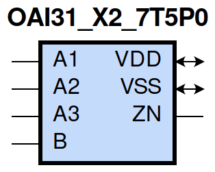
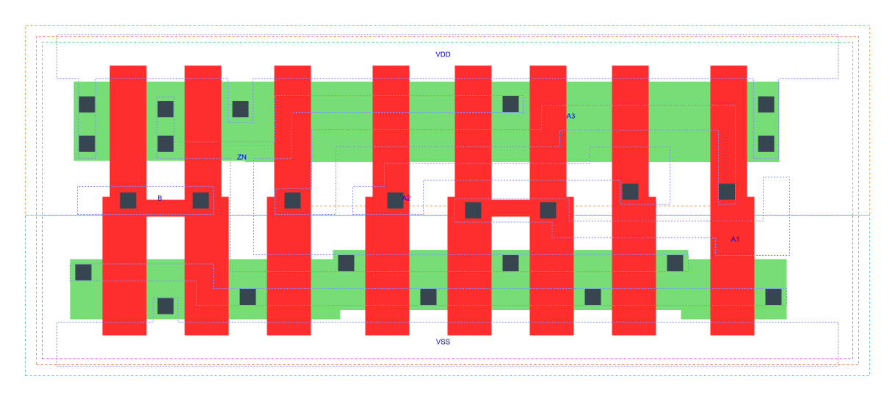

=======================================
gf180mcu_fd_sc_mcu7t5v0__oai31_x2
=======================================

**gf180mcu_fd_sc_mcu7t5v0__oai31_x2 symbol**

**gf180mcu_fd_sc_mcu7t5v0__oai31_x2 schematic**

.. image:: sc7_sch/OAI31_X2_sch.png
    :height: 300px
    :width: 500 px
    :align: center
    :alt: gf180mcu_fd_sc_mcu7t5v0__oai31_x2 schematic

**gf180mcu_fd_sc_mcu7t5v0__oai31_x2 layout**

.. include:: images.rst

OAI31_X2 is a 3-input OR into 2-input NAND, NAND[OR(A1,A2,A3),B], 2X drive strength

|
| Attributes

============= ======================
**Attribute** **Value**
area          41.708800 µm\ :sup:`2`
============= ======================

|
| OUTPUT FUNCTIONS

============== ==========================
**Output Pin** **Function**
ZN             (((!A1)&(!A2)&(!A3))|(!B))
============== ==========================

|
| TRUTH TABLE FOR ZN

====== ====== ====== ===== ======
**A1** **A2** **A3** **B** **ZN**
0      0      0      ?     1
?      ?      ?      0     1
1      ?      ?      1     0
?      1      ?      1     0
?      ?      1      1     0
====== ====== ====== ===== ======

|
| FUNCTIONAL SCHEMATIC
| |image566|
| PIN CAPACITANCE (pf)

======= ======== ====================
**Pin** **Type** **Capacitance (pf)**
B       input    0.0087
A3      input    0.0102
A2      input    0.0095
A1      input    0.0098
======= ======== ====================

|
| DELAY AND OUTPUT TRANSITION TIME corresponding to min slew and load

+---------------+------------+--------------------+--------------+-------------------+----------------+---------------+
| **Input Pin** | **Output** | **When Condition** | **Tin (ns)** | **Out Load (pf)** | **Delay (ns)** | **Tout (ns)** |
+---------------+------------+--------------------+--------------+-------------------+----------------+---------------+
| B(LH)         | ZN(HL)     | !A1&!A2&A3         | 0.0100       | 0.0010            | 0.1295         | 0.0724        |
+---------------+------------+--------------------+--------------+-------------------+----------------+---------------+
| B(LH)         | ZN(HL)     | !A1&A2&!A3         | 0.0100       | 0.0010            | 0.1207         | 0.0608        |
+---------------+------------+--------------------+--------------+-------------------+----------------+---------------+
| B(LH)         | ZN(HL)     | !A1&A2&A3          | 0.0100       | 0.0010            | 0.1003         | 0.0544        |
+---------------+------------+--------------------+--------------+-------------------+----------------+---------------+
| B(LH)         | ZN(HL)     | A1&!A2&!A3         | 0.0100       | 0.0010            | 0.0994         | 0.0461        |
+---------------+------------+--------------------+--------------+-------------------+----------------+---------------+
| B(LH)         | ZN(HL)     | A1&!A2&A3          | 0.0100       | 0.0010            | 0.0847         | 0.0432        |
+---------------+------------+--------------------+--------------+-------------------+----------------+---------------+
| B(LH)         | ZN(HL)     | A1&A2&!A3          | 0.0100       | 0.0010            | 0.0848         | 0.0432        |
+---------------+------------+--------------------+--------------+-------------------+----------------+---------------+
| B(LH)         | ZN(HL)     | A1&A2&A3           | 0.0100       | 0.0010            | 0.0824         | 0.0490        |
+---------------+------------+--------------------+--------------+-------------------+----------------+---------------+
| B(HL)         | ZN(LH)     | !A1&!A2&A3         | 0.0100       | 0.0010            | 0.1344         | 0.1237        |
+---------------+------------+--------------------+--------------+-------------------+----------------+---------------+
| B(HL)         | ZN(LH)     | !A1&A2&!A3         | 0.0100       | 0.0010            | 0.1341         | 0.1178        |
+---------------+------------+--------------------+--------------+-------------------+----------------+---------------+
| B(HL)         | ZN(LH)     | !A1&A2&A3          | 0.0100       | 0.0010            | 0.1505         | 0.1285        |
+---------------+------------+--------------------+--------------+-------------------+----------------+---------------+
| B(HL)         | ZN(LH)     | A1&!A2&!A3         | 0.0100       | 0.0010            | 0.1279         | 0.0939        |
+---------------+------------+--------------------+--------------+-------------------+----------------+---------------+
| B(HL)         | ZN(LH)     | A1&!A2&A3          | 0.0100       | 0.0010            | 0.1444         | 0.1053        |
+---------------+------------+--------------------+--------------+-------------------+----------------+---------------+
| B(HL)         | ZN(LH)     | A1&A2&!A3          | 0.0100       | 0.0010            | 0.1445         | 0.1053        |
+---------------+------------+--------------------+--------------+-------------------+----------------+---------------+
| B(HL)         | ZN(LH)     | A1&A2&A3           | 0.0100       | 0.0010            | 0.1583         | 0.1158        |
+---------------+------------+--------------------+--------------+-------------------+----------------+---------------+
| A3(LH)        | ZN(HL)     | !A1&!A2&B          | 0.0100       | 0.0010            | 0.0935         | 0.0748        |
+---------------+------------+--------------------+--------------+-------------------+----------------+---------------+
| A3(HL)        | ZN(LH)     | !A1&!A2&B          | 0.0100       | 0.0010            | 0.2711         | 0.1636        |
+---------------+------------+--------------------+--------------+-------------------+----------------+---------------+
| A2(HL)        | ZN(LH)     | !A1&!A3&B          | 0.0100       | 0.0010            | 0.2435         | 0.1636        |
+---------------+------------+--------------------+--------------+-------------------+----------------+---------------+
| A2(LH)        | ZN(HL)     | !A1&!A3&B          | 0.0100       | 0.0010            | 0.0875         | 0.0609        |
+---------------+------------+--------------------+--------------+-------------------+----------------+---------------+
| A1(HL)        | ZN(LH)     | !A2&!A3&B          | 0.0100       | 0.0010            | 0.1837         | 0.1622        |
+---------------+------------+--------------------+--------------+-------------------+----------------+---------------+
| A1(LH)        | ZN(HL)     | !A2&!A3&B          | 0.0100       | 0.0010            | 0.0674         | 0.0451        |
+---------------+------------+--------------------+--------------+-------------------+----------------+---------------+

|
| DYNAMIC ENERGY

+---------------+--------------------+--------------+------------+-------------------+---------------------+
| **Input Pin** | **When Condition** | **Tin (ns)** | **Output** | **Out Load (pf)** | **Energy (uW/MHz)** |
+---------------+--------------------+--------------+------------+-------------------+---------------------+
| A1            | !A2&!A3&B          | 0.0100       | ZN(LH)     | 0.0010            | 0.3117              |
+---------------+--------------------+--------------+------------+-------------------+---------------------+
| B             | !A1&!A2&A3         | 0.0100       | ZN(HL)     | 0.0010            | 0.1089              |
+---------------+--------------------+--------------+------------+-------------------+---------------------+
| B             | !A1&A2&!A3         | 0.0100       | ZN(HL)     | 0.0010            | 0.0543              |
+---------------+--------------------+--------------+------------+-------------------+---------------------+
| B             | !A1&A2&A3          | 0.0100       | ZN(HL)     | 0.0010            | 0.0543              |
+---------------+--------------------+--------------+------------+-------------------+---------------------+
| B             | A1&!A2&!A3         | 0.0100       | ZN(HL)     | 0.0010            | 0.0058              |
+---------------+--------------------+--------------+------------+-------------------+---------------------+
| B             | A1&!A2&A3          | 0.0100       | ZN(HL)     | 0.0010            | 0.0058              |
+---------------+--------------------+--------------+------------+-------------------+---------------------+
| B             | A1&A2&!A3          | 0.0100       | ZN(HL)     | 0.0010            | 0.0058              |
+---------------+--------------------+--------------+------------+-------------------+---------------------+
| B             | A1&A2&A3           | 0.0100       | ZN(HL)     | 0.0010            | 0.0059              |
+---------------+--------------------+--------------+------------+-------------------+---------------------+
| A2            | !A1&!A3&B          | 0.0100       | ZN(LH)     | 0.0010            | 0.3657              |
+---------------+--------------------+--------------+------------+-------------------+---------------------+
| A3            | !A1&!A2&B          | 0.0100       | ZN(HL)     | 0.0010            | 0.1070              |
+---------------+--------------------+--------------+------------+-------------------+---------------------+
| A1            | !A2&!A3&B          | 0.0100       | ZN(HL)     | 0.0010            | 0.0102              |
+---------------+--------------------+--------------+------------+-------------------+---------------------+
| B             | !A1&!A2&A3         | 0.0100       | ZN(LH)     | 0.0010            | 0.6137              |
+---------------+--------------------+--------------+------------+-------------------+---------------------+
| B             | !A1&A2&!A3         | 0.0100       | ZN(LH)     | 0.0010            | 0.5604              |
+---------------+--------------------+--------------+------------+-------------------+---------------------+
| B             | !A1&A2&A3          | 0.0100       | ZN(LH)     | 0.0010            | 0.6054              |
+---------------+--------------------+--------------+------------+-------------------+---------------------+
| B             | A1&!A2&!A3         | 0.0100       | ZN(LH)     | 0.0010            | 0.5067              |
+---------------+--------------------+--------------+------------+-------------------+---------------------+
| B             | A1&!A2&A3          | 0.0100       | ZN(LH)     | 0.0010            | 0.5519              |
+---------------+--------------------+--------------+------------+-------------------+---------------------+
| B             | A1&A2&!A3          | 0.0100       | ZN(LH)     | 0.0010            | 0.5515              |
+---------------+--------------------+--------------+------------+-------------------+---------------------+
| B             | A1&A2&A3           | 0.0100       | ZN(LH)     | 0.0010            | 0.5958              |
+---------------+--------------------+--------------+------------+-------------------+---------------------+
| A2            | !A1&!A3&B          | 0.0100       | ZN(HL)     | 0.0010            | 0.0563              |
+---------------+--------------------+--------------+------------+-------------------+---------------------+
| A3            | !A1&!A2&B          | 0.0100       | ZN(LH)     | 0.0010            | 0.4185              |
+---------------+--------------------+--------------+------------+-------------------+---------------------+
| B(HL)         | !A1&!A2&!A3        | 0.0100       | n/a        | n/a               | 0.0789              |
+---------------+--------------------+--------------+------------+-------------------+---------------------+
| A3(LH)        | !A1&!A2&!B         | 0.0100       | n/a        | n/a               | 0.0675              |
+---------------+--------------------+--------------+------------+-------------------+---------------------+
| A3(LH)        | !A1&A2&!B          | 0.0100       | n/a        | n/a               | -0.0771             |
+---------------+--------------------+--------------+------------+-------------------+---------------------+
| A3(LH)        | A1&!A2&!B          | 0.0100       | n/a        | n/a               | -0.0700             |
+---------------+--------------------+--------------+------------+-------------------+---------------------+
| A3(LH)        | A1&A2&!B           | 0.0100       | n/a        | n/a               | -0.0755             |
+---------------+--------------------+--------------+------------+-------------------+---------------------+
| A3(LH)        | !A1&A2&B           | 0.0100       | n/a        | n/a               | -0.0608             |
+---------------+--------------------+--------------+------------+-------------------+---------------------+
| A3(LH)        | A1&!A2&B           | 0.0100       | n/a        | n/a               | -0.0594             |
+---------------+--------------------+--------------+------------+-------------------+---------------------+
| A3(LH)        | A1&A2&B            | 0.0100       | n/a        | n/a               | -0.0664             |
+---------------+--------------------+--------------+------------+-------------------+---------------------+
| A2(LH)        | !A1&!A3&!B         | 0.0100       | n/a        | n/a               | 0.0673              |
+---------------+--------------------+--------------+------------+-------------------+---------------------+
| A2(LH)        | !A1&A3&!B          | 0.0100       | n/a        | n/a               | -0.0774             |
+---------------+--------------------+--------------+------------+-------------------+---------------------+
| A2(LH)        | A1&!A3&!B          | 0.0100       | n/a        | n/a               | -0.0774             |
+---------------+--------------------+--------------+------------+-------------------+---------------------+
| A2(LH)        | A1&A3&!B           | 0.0100       | n/a        | n/a               | -0.0747             |
+---------------+--------------------+--------------+------------+-------------------+---------------------+
| A2(LH)        | !A1&A3&B           | 0.0100       | n/a        | n/a               | -0.0217             |
+---------------+--------------------+--------------+------------+-------------------+---------------------+
| A2(LH)        | A1&!A3&B           | 0.0100       | n/a        | n/a               | -0.0586             |
+---------------+--------------------+--------------+------------+-------------------+---------------------+
| A2(LH)        | A1&A3&B            | 0.0100       | n/a        | n/a               | -0.0515             |
+---------------+--------------------+--------------+------------+-------------------+---------------------+
| A1(LH)        | !A2&!A3&!B         | 0.0100       | n/a        | n/a               | 0.0670              |
+---------------+--------------------+--------------+------------+-------------------+---------------------+
| A1(LH)        | !A2&A3&!B          | 0.0100       | n/a        | n/a               | -0.0707             |
+---------------+--------------------+--------------+------------+-------------------+---------------------+
| A1(LH)        | A2&!A3&!B          | 0.0100       | n/a        | n/a               | -0.0780             |
+---------------+--------------------+--------------+------------+-------------------+---------------------+
| A1(LH)        | A2&A3&!B           | 0.0100       | n/a        | n/a               | -0.0766             |
+---------------+--------------------+--------------+------------+-------------------+---------------------+
| A1(LH)        | !A2&A3&B           | 0.0100       | n/a        | n/a               | -0.0198             |
+---------------+--------------------+--------------+------------+-------------------+---------------------+
| A1(LH)        | A2&!A3&B           | 0.0100       | n/a        | n/a               | -0.0201             |
+---------------+--------------------+--------------+------------+-------------------+---------------------+
| A1(LH)        | A2&A3&B            | 0.0100       | n/a        | n/a               | -0.0201             |
+---------------+--------------------+--------------+------------+-------------------+---------------------+
| A3(HL)        | !A1&!A2&!B         | 0.0100       | n/a        | n/a               | 0.0795              |
+---------------+--------------------+--------------+------------+-------------------+---------------------+
| A3(HL)        | !A1&A2&!B          | 0.0100       | n/a        | n/a               | 0.0811              |
+---------------+--------------------+--------------+------------+-------------------+---------------------+
| A3(HL)        | A1&!A2&!B          | 0.0100       | n/a        | n/a               | 0.0810              |
+---------------+--------------------+--------------+------------+-------------------+---------------------+
| A3(HL)        | A1&A2&!B           | 0.0100       | n/a        | n/a               | 0.0813              |
+---------------+--------------------+--------------+------------+-------------------+---------------------+
| A3(HL)        | !A1&A2&B           | 0.0100       | n/a        | n/a               | 0.0705              |
+---------------+--------------------+--------------+------------+-------------------+---------------------+
| A3(HL)        | A1&!A2&B           | 0.0100       | n/a        | n/a               | 0.0704              |
+---------------+--------------------+--------------+------------+-------------------+---------------------+
| A3(HL)        | A1&A2&B            | 0.0100       | n/a        | n/a               | 0.0703              |
+---------------+--------------------+--------------+------------+-------------------+---------------------+
| A2(HL)        | !A1&!A3&!B         | 0.0100       | n/a        | n/a               | 0.0796              |
+---------------+--------------------+--------------+------------+-------------------+---------------------+
| A2(HL)        | !A1&A3&!B          | 0.0100       | n/a        | n/a               | 0.0808              |
+---------------+--------------------+--------------+------------+-------------------+---------------------+
| A2(HL)        | A1&!A3&!B          | 0.0100       | n/a        | n/a               | 0.0812              |
+---------------+--------------------+--------------+------------+-------------------+---------------------+
| A2(HL)        | A1&A3&!B           | 0.0100       | n/a        | n/a               | 0.0552              |
+---------------+--------------------+--------------+------------+-------------------+---------------------+
| A2(HL)        | !A1&A3&B           | 0.0100       | n/a        | n/a               | 0.0559              |
+---------------+--------------------+--------------+------------+-------------------+---------------------+
| A2(HL)        | A1&!A3&B           | 0.0100       | n/a        | n/a               | 0.0705              |
+---------------+--------------------+--------------+------------+-------------------+---------------------+
| A2(HL)        | A1&A3&B            | 0.0100       | n/a        | n/a               | 0.0442              |
+---------------+--------------------+--------------+------------+-------------------+---------------------+
| B(LH)         | !A1&!A2&!A3        | 0.0100       | n/a        | n/a               | -0.0698             |
+---------------+--------------------+--------------+------------+-------------------+---------------------+
| A1(HL)        | !A2&!A3&!B         | 0.0100       | n/a        | n/a               | 0.0799              |
+---------------+--------------------+--------------+------------+-------------------+---------------------+
| A1(HL)        | !A2&A3&!B          | 0.0100       | n/a        | n/a               | 0.0813              |
+---------------+--------------------+--------------+------------+-------------------+---------------------+
| A1(HL)        | A2&!A3&!B          | 0.0100       | n/a        | n/a               | 0.0813              |
+---------------+--------------------+--------------+------------+-------------------+---------------------+
| A1(HL)        | A2&A3&!B           | 0.0100       | n/a        | n/a               | 0.0815              |
+---------------+--------------------+--------------+------------+-------------------+---------------------+
| A1(HL)        | !A2&A3&B           | 0.0100       | n/a        | n/a               | 0.1059              |
+---------------+--------------------+--------------+------------+-------------------+---------------------+
| A1(HL)        | A2&!A3&B           | 0.0100       | n/a        | n/a               | 0.0512              |
+---------------+--------------------+--------------+------------+-------------------+---------------------+
| A1(HL)        | A2&A3&B            | 0.0100       | n/a        | n/a               | 0.0512              |
+---------------+--------------------+--------------+------------+-------------------+---------------------+

|
| LEAKAGE POWER

================== ==============
**When Condition** **Power (nW)**
!A1&!A2&!A3&!B     0.2011
!A1&!A2&!A3&B      0.2027
!A1&!A2&A3&!B      0.3606
!A1&A2&!A3&!B      0.3606
!A1&A2&A3&!B       0.3613
A1&!A2&!A3&!B      0.3606
A1&!A2&A3&!B       0.3613
A1&A2&!A3&!B       0.3613
A1&A2&A3&!B        0.3618
!A1&!A2&A3&B       0.2978
!A1&A2&!A3&B       0.2270
!A1&A2&A3&B        0.2270
A1&!A2&!A3&B       0.1557
A1&!A2&A3&B        0.1557
A1&A2&!A3&B        0.1557
A1&A2&A3&B         0.1557
================== ==============

