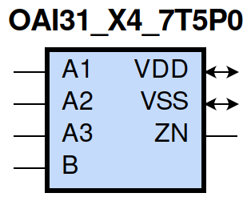
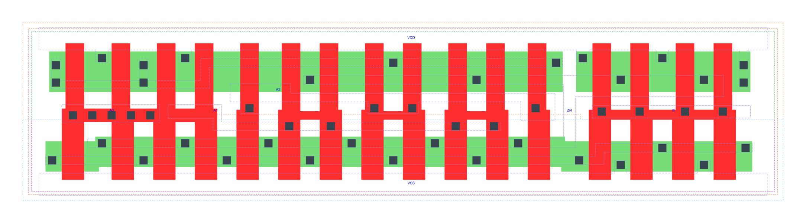

=======================================
gf180mcu_fd_sc_mcu7t5v0__oai31_x4
=======================================

**gf180mcu_fd_sc_mcu7t5v0__oai31_x4 symbol**

**gf180mcu_fd_sc_mcu7t5v0__oai31_x4 schematic**

**gf180mcu_fd_sc_mcu7t5v0__oai31_x4 layout**

.. include:: images.rst

OAI31_X4 is a 3-input OR into 2-input NAND, NAND[OR(A1,A2,A3),B], 4X drive strength

|
| Attributes

============= ======================
**Attribute** **Value**
area          76.832000 µm\ :sup:`2`
============= ======================

|
| OUTPUT FUNCTIONS

============== ==========================
**Output Pin** **Function**
ZN             (((!A1)&(!A2)&(!A3))|(!B))
============== ==========================

|
| TRUTH TABLE FOR ZN

====== ====== ====== ===== ======
**A1** **A2** **A3** **B** **ZN**
0      0      0      ?     1
?      ?      ?      0     1
1      ?      ?      1     0
?      1      ?      1     0
?      ?      1      1     0
====== ====== ====== ===== ======

|
| FUNCTIONAL SCHEMATIC
| |image569|
| PIN CAPACITANCE (pf)

======= ======== ====================
**Pin** **Type** **Capacitance (pf)**
A3      input    0.0169
A1      input    0.0191
A2      input    0.0187
B       input    0.0173
======= ======== ====================

|
| DELAY AND OUTPUT TRANSITION TIME corresponding to min slew and load

+---------------+------------+--------------------+--------------+-------------------+----------------+---------------+
| **Input Pin** | **Output** | **When Condition** | **Tin (ns)** | **Out Load (pf)** | **Delay (ns)** | **Tout (ns)** |
+---------------+------------+--------------------+--------------+-------------------+----------------+---------------+
| A3(LH)        | ZN(HL)     | !A1&!A2&B          | 0.0100       | 0.0010            | 0.0902         | 0.0738        |
+---------------+------------+--------------------+--------------+-------------------+----------------+---------------+
| A3(HL)        | ZN(LH)     | !A1&!A2&B          | 0.0100       | 0.0010            | 0.2708         | 0.1550        |
+---------------+------------+--------------------+--------------+-------------------+----------------+---------------+
| A1(HL)        | ZN(LH)     | !A2&!A3&B          | 0.0100       | 0.0010            | 0.1692         | 0.1520        |
+---------------+------------+--------------------+--------------+-------------------+----------------+---------------+
| A1(LH)        | ZN(HL)     | !A2&!A3&B          | 0.0100       | 0.0010            | 0.0640         | 0.0420        |
+---------------+------------+--------------------+--------------+-------------------+----------------+---------------+
| A2(HL)        | ZN(LH)     | !A1&!A3&B          | 0.0100       | 0.0010            | 0.2303         | 0.1545        |
+---------------+------------+--------------------+--------------+-------------------+----------------+---------------+
| A2(LH)        | ZN(HL)     | !A1&!A3&B          | 0.0100       | 0.0010            | 0.0840         | 0.0581        |
+---------------+------------+--------------------+--------------+-------------------+----------------+---------------+
| B(LH)         | ZN(HL)     | !A1&!A2&A3         | 0.0100       | 0.0010            | 0.1259         | 0.0713        |
+---------------+------------+--------------------+--------------+-------------------+----------------+---------------+
| B(LH)         | ZN(HL)     | !A1&A2&!A3         | 0.0100       | 0.0010            | 0.1168         | 0.0577        |
+---------------+------------+--------------------+--------------+-------------------+----------------+---------------+
| B(LH)         | ZN(HL)     | !A1&A2&A3          | 0.0100       | 0.0010            | 0.0972         | 0.0522        |
+---------------+------------+--------------------+--------------+-------------------+----------------+---------------+
| B(LH)         | ZN(HL)     | A1&!A2&!A3         | 0.0100       | 0.0010            | 0.0955         | 0.0430        |
+---------------+------------+--------------------+--------------+-------------------+----------------+---------------+
| B(LH)         | ZN(HL)     | A1&!A2&A3          | 0.0100       | 0.0010            | 0.0816         | 0.0408        |
+---------------+------------+--------------------+--------------+-------------------+----------------+---------------+
| B(LH)         | ZN(HL)     | A1&A2&!A3          | 0.0100       | 0.0010            | 0.0816         | 0.0408        |
+---------------+------------+--------------------+--------------+-------------------+----------------+---------------+
| B(LH)         | ZN(HL)     | A1&A2&A3           | 0.0100       | 0.0010            | 0.0795         | 0.0467        |
+---------------+------------+--------------------+--------------+-------------------+----------------+---------------+
| B(HL)         | ZN(LH)     | !A1&!A2&A3         | 0.0100       | 0.0010            | 0.1270         | 0.1173        |
+---------------+------------+--------------------+--------------+-------------------+----------------+---------------+
| B(HL)         | ZN(LH)     | !A1&A2&!A3         | 0.0100       | 0.0010            | 0.1271         | 0.1117        |
+---------------+------------+--------------------+--------------+-------------------+----------------+---------------+
| B(HL)         | ZN(LH)     | !A1&A2&A3          | 0.0100       | 0.0010            | 0.1430         | 0.1225        |
+---------------+------------+--------------------+--------------+-------------------+----------------+---------------+
| B(HL)         | ZN(LH)     | A1&!A2&!A3         | 0.0100       | 0.0010            | 0.1207         | 0.0882        |
+---------------+------------+--------------------+--------------+-------------------+----------------+---------------+
| B(HL)         | ZN(LH)     | A1&!A2&A3          | 0.0100       | 0.0010            | 0.1370         | 0.0993        |
+---------------+------------+--------------------+--------------+-------------------+----------------+---------------+
| B(HL)         | ZN(LH)     | A1&A2&!A3          | 0.0100       | 0.0010            | 0.1371         | 0.0993        |
+---------------+------------+--------------------+--------------+-------------------+----------------+---------------+
| B(HL)         | ZN(LH)     | A1&A2&A3           | 0.0100       | 0.0010            | 0.1509         | 0.1099        |
+---------------+------------+--------------------+--------------+-------------------+----------------+---------------+

|
| DYNAMIC ENERGY

+---------------+--------------------+--------------+------------+-------------------+---------------------+
| **Input Pin** | **When Condition** | **Tin (ns)** | **Output** | **Out Load (pf)** | **Energy (uW/MHz)** |
+---------------+--------------------+--------------+------------+-------------------+---------------------+
| A1            | !A2&!A3&B          | 0.0100       | ZN(LH)     | 0.0010            | 0.6051              |
+---------------+--------------------+--------------+------------+-------------------+---------------------+
| B             | !A1&!A2&A3         | 0.0100       | ZN(HL)     | 0.0010            | 0.2160              |
+---------------+--------------------+--------------+------------+-------------------+---------------------+
| B             | !A1&A2&!A3         | 0.0100       | ZN(HL)     | 0.0010            | 0.1114              |
+---------------+--------------------+--------------+------------+-------------------+---------------------+
| B             | !A1&A2&A3          | 0.0100       | ZN(HL)     | 0.0010            | 0.1111              |
+---------------+--------------------+--------------+------------+-------------------+---------------------+
| B             | A1&!A2&!A3         | 0.0100       | ZN(HL)     | 0.0010            | 0.0105              |
+---------------+--------------------+--------------+------------+-------------------+---------------------+
| B             | A1&!A2&A3          | 0.0100       | ZN(HL)     | 0.0010            | 0.0105              |
+---------------+--------------------+--------------+------------+-------------------+---------------------+
| B             | A1&A2&!A3          | 0.0100       | ZN(HL)     | 0.0010            | 0.0105              |
+---------------+--------------------+--------------+------------+-------------------+---------------------+
| B             | A1&A2&A3           | 0.0100       | ZN(HL)     | 0.0010            | 0.0105              |
+---------------+--------------------+--------------+------------+-------------------+---------------------+
| A2            | !A1&!A3&B          | 0.0100       | ZN(LH)     | 0.0010            | 0.7136              |
+---------------+--------------------+--------------+------------+-------------------+---------------------+
| A3            | !A1&!A2&B          | 0.0100       | ZN(HL)     | 0.0010            | 0.2147              |
+---------------+--------------------+--------------+------------+-------------------+---------------------+
| A1            | !A2&!A3&B          | 0.0100       | ZN(HL)     | 0.0010            | 0.0205              |
+---------------+--------------------+--------------+------------+-------------------+---------------------+
| B             | !A1&!A2&A3         | 0.0100       | ZN(LH)     | 0.0010            | 1.2746              |
+---------------+--------------------+--------------+------------+-------------------+---------------------+
| B             | !A1&A2&!A3         | 0.0100       | ZN(LH)     | 0.0010            | 1.0996              |
+---------------+--------------------+--------------+------------+-------------------+---------------------+
| B             | !A1&A2&A3          | 0.0100       | ZN(LH)     | 0.0010            | 1.1892              |
+---------------+--------------------+--------------+------------+-------------------+---------------------+
| B             | A1&!A2&!A3         | 0.0100       | ZN(LH)     | 0.0010            | 0.9913              |
+---------------+--------------------+--------------+------------+-------------------+---------------------+
| B             | A1&!A2&A3          | 0.0100       | ZN(LH)     | 0.0010            | 1.0814              |
+---------------+--------------------+--------------+------------+-------------------+---------------------+
| B             | A1&A2&!A3          | 0.0100       | ZN(LH)     | 0.0010            | 1.0815              |
+---------------+--------------------+--------------+------------+-------------------+---------------------+
| B             | A1&A2&A3           | 0.0100       | ZN(LH)     | 0.0010            | 1.1710              |
+---------------+--------------------+--------------+------------+-------------------+---------------------+
| A2            | !A1&!A3&B          | 0.0100       | ZN(HL)     | 0.0010            | 0.1155              |
+---------------+--------------------+--------------+------------+-------------------+---------------------+
| A3            | !A1&!A2&B          | 0.0100       | ZN(LH)     | 0.0010            | 0.8885              |
+---------------+--------------------+--------------+------------+-------------------+---------------------+
| B(HL)         | !A1&!A2&!A3        | 0.0100       | n/a        | n/a               | 0.1597              |
+---------------+--------------------+--------------+------------+-------------------+---------------------+
| A3(LH)        | !A1&!A2&!B         | 0.0100       | n/a        | n/a               | 0.1283              |
+---------------+--------------------+--------------+------------+-------------------+---------------------+
| A3(LH)        | !A1&A2&!B          | 0.0100       | n/a        | n/a               | -0.1453             |
+---------------+--------------------+--------------+------------+-------------------+---------------------+
| A3(LH)        | A1&!A2&!B          | 0.0100       | n/a        | n/a               | -0.1337             |
+---------------+--------------------+--------------+------------+-------------------+---------------------+
| A3(LH)        | A1&A2&!B           | 0.0100       | n/a        | n/a               | -0.1426             |
+---------------+--------------------+--------------+------------+-------------------+---------------------+
| A3(LH)        | !A1&A2&B           | 0.0100       | n/a        | n/a               | -0.1151             |
+---------------+--------------------+--------------+------------+-------------------+---------------------+
| A3(LH)        | A1&!A2&B           | 0.0100       | n/a        | n/a               | -0.1142             |
+---------------+--------------------+--------------+------------+-------------------+---------------------+
| A3(LH)        | A1&A2&B            | 0.0100       | n/a        | n/a               | -0.1243             |
+---------------+--------------------+--------------+------------+-------------------+---------------------+
| A2(LH)        | !A1&!A3&!B         | 0.0100       | n/a        | n/a               | 0.1280              |
+---------------+--------------------+--------------+------------+-------------------+---------------------+
| A2(LH)        | !A1&A3&!B          | 0.0100       | n/a        | n/a               | -0.1459             |
+---------------+--------------------+--------------+------------+-------------------+---------------------+
| A2(LH)        | A1&!A3&!B          | 0.0100       | n/a        | n/a               | -0.1549             |
+---------------+--------------------+--------------+------------+-------------------+---------------------+
| A2(LH)        | A1&A3&!B           | 0.0100       | n/a        | n/a               | -0.1397             |
+---------------+--------------------+--------------+------------+-------------------+---------------------+
| A2(LH)        | !A1&A3&B           | 0.0100       | n/a        | n/a               | -0.0388             |
+---------------+--------------------+--------------+------------+-------------------+---------------------+
| A2(LH)        | A1&!A3&B           | 0.0100       | n/a        | n/a               | -0.1171             |
+---------------+--------------------+--------------+------------+-------------------+---------------------+
| A2(LH)        | A1&A3&B            | 0.0100       | n/a        | n/a               | -0.0921             |
+---------------+--------------------+--------------+------------+-------------------+---------------------+
| A1(LH)        | !A2&!A3&!B         | 0.0100       | n/a        | n/a               | 0.1275              |
+---------------+--------------------+--------------+------------+-------------------+---------------------+
| A1(LH)        | !A2&A3&!B          | 0.0100       | n/a        | n/a               | -0.1345             |
+---------------+--------------------+--------------+------------+-------------------+---------------------+
| A1(LH)        | A2&!A3&!B          | 0.0100       | n/a        | n/a               | -0.1559             |
+---------------+--------------------+--------------+------------+-------------------+---------------------+
| A1(LH)        | A2&A3&!B           | 0.0100       | n/a        | n/a               | -0.1499             |
+---------------+--------------------+--------------+------------+-------------------+---------------------+
| A1(LH)        | !A2&A3&B           | 0.0100       | n/a        | n/a               | -0.0370             |
+---------------+--------------------+--------------+------------+-------------------+---------------------+
| A1(LH)        | A2&!A3&B           | 0.0100       | n/a        | n/a               | -0.0401             |
+---------------+--------------------+--------------+------------+-------------------+---------------------+
| A1(LH)        | A2&A3&B            | 0.0100       | n/a        | n/a               | -0.0401             |
+---------------+--------------------+--------------+------------+-------------------+---------------------+
| A3(HL)        | !A1&!A2&!B         | 0.0100       | n/a        | n/a               | 0.1591              |
+---------------+--------------------+--------------+------------+-------------------+---------------------+
| A3(HL)        | !A1&A2&!B          | 0.0100       | n/a        | n/a               | 0.1626              |
+---------------+--------------------+--------------+------------+-------------------+---------------------+
| A3(HL)        | A1&!A2&!B          | 0.0100       | n/a        | n/a               | 0.1625              |
+---------------+--------------------+--------------+------------+-------------------+---------------------+
| A3(HL)        | A1&A2&!B           | 0.0100       | n/a        | n/a               | 0.1629              |
+---------------+--------------------+--------------+------------+-------------------+---------------------+
| A3(HL)        | !A1&A2&B           | 0.0100       | n/a        | n/a               | 0.1407              |
+---------------+--------------------+--------------+------------+-------------------+---------------------+
| A3(HL)        | A1&!A2&B           | 0.0100       | n/a        | n/a               | 0.1408              |
+---------------+--------------------+--------------+------------+-------------------+---------------------+
| A3(HL)        | A1&A2&B            | 0.0100       | n/a        | n/a               | 0.1407              |
+---------------+--------------------+--------------+------------+-------------------+---------------------+
| A2(HL)        | !A1&!A3&!B         | 0.0100       | n/a        | n/a               | 0.1591              |
+---------------+--------------------+--------------+------------+-------------------+---------------------+
| A2(HL)        | !A1&A3&!B          | 0.0100       | n/a        | n/a               | 0.1622              |
+---------------+--------------------+--------------+------------+-------------------+---------------------+
| A2(HL)        | A1&!A3&!B          | 0.0100       | n/a        | n/a               | 0.1626              |
+---------------+--------------------+--------------+------------+-------------------+---------------------+
| A2(HL)        | A1&A3&!B           | 0.0100       | n/a        | n/a               | 0.0985              |
+---------------+--------------------+--------------+------------+-------------------+---------------------+
| A2(HL)        | !A1&A3&B           | 0.0100       | n/a        | n/a               | 0.1072              |
+---------------+--------------------+--------------+------------+-------------------+---------------------+
| A2(HL)        | A1&!A3&B           | 0.0100       | n/a        | n/a               | 0.1410              |
+---------------+--------------------+--------------+------------+-------------------+---------------------+
| A2(HL)        | A1&A3&B            | 0.0100       | n/a        | n/a               | 0.0763              |
+---------------+--------------------+--------------+------------+-------------------+---------------------+
| B(LH)         | !A1&!A2&!A3        | 0.0100       | n/a        | n/a               | -0.1413             |
+---------------+--------------------+--------------+------------+-------------------+---------------------+
| A1(HL)        | !A2&!A3&!B         | 0.0100       | n/a        | n/a               | 0.1595              |
+---------------+--------------------+--------------+------------+-------------------+---------------------+
| A1(HL)        | !A2&A3&!B          | 0.0100       | n/a        | n/a               | 0.1629              |
+---------------+--------------------+--------------+------------+-------------------+---------------------+
| A1(HL)        | A2&!A3&!B          | 0.0100       | n/a        | n/a               | 0.1626              |
+---------------+--------------------+--------------+------------+-------------------+---------------------+
| A1(HL)        | A2&A3&!B           | 0.0100       | n/a        | n/a               | 0.1629              |
+---------------+--------------------+--------------+------------+-------------------+---------------------+
| A1(HL)        | !A2&A3&B           | 0.0100       | n/a        | n/a               | 0.2109              |
+---------------+--------------------+--------------+------------+-------------------+---------------------+
| A1(HL)        | A2&!A3&B           | 0.0100       | n/a        | n/a               | 0.1058              |
+---------------+--------------------+--------------+------------+-------------------+---------------------+
| A1(HL)        | A2&A3&B            | 0.0100       | n/a        | n/a               | 0.1058              |
+---------------+--------------------+--------------+------------+-------------------+---------------------+

|
| LEAKAGE POWER

================== ==============
**When Condition** **Power (nW)**
!A1&!A2&!A3&!B     0.3521
!A1&!A2&!A3&B      0.3554
!A1&!A2&A3&!B      0.6705
!A1&A2&!A3&!B      0.6705
!A1&A2&A3&!B       0.6721
A1&!A2&!A3&!B      0.6705
A1&!A2&A3&!B       0.6721
A1&A2&!A3&!B       0.6720
A1&A2&A3&!B        0.6730
!A1&!A2&A3&B       0.5455
!A1&A2&!A3&B       0.4041
!A1&A2&A3&B        0.4041
A1&!A2&!A3&B       0.2613
A1&!A2&A3&B        0.2614
A1&A2&!A3&B        0.2614
A1&A2&A3&B         0.2614
================== ==============

