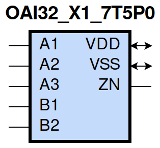
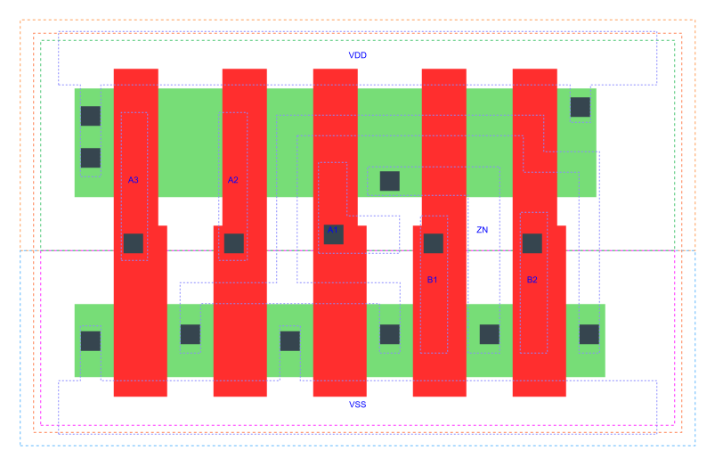

=======================================
gf180mcu_fd_sc_mcu7t5v0__oai32_x1
=======================================

**gf180mcu_fd_sc_mcu7t5v0__oai32_x1 symbol**

**gf180mcu_fd_sc_mcu7t5v0__oai32_x1 schematic**

.. image:: sc7_sch/OAI32_X1_sch.png
    :height: 300px
    :width: 500 px
    :align: center
    :alt: gf180mcu_fd_sc_mcu7t5v0__oai32_x1 schematic

**gf180mcu_fd_sc_mcu7t5v0__oai32_x1 layout**

.. include:: images.rst

OAI32_X1 is a 3-input OR and a 2-input OR into 2-input NAND, NAND[OR(A1,A2,A3),OR(B1,B2)], 1X drive strength

|
| Attributes

============= ======================
**Attribute** **Value**
area          26.342400 µm\ :sup:`2`
============= ======================

|
| OUTPUT FUNCTIONS

============== ===================================
**Output Pin** **Function**
ZN             (((!A1)&(!A2)&(!A3))|((!B1)&(!B2)))
============== ===================================

|
| TRUTH TABLE FOR ZN

====== ====== ====== ====== ====== ======
**A1** **A2** **A3** **B1** **B2** **ZN**
0      0      0      ?      ?      1
?      ?      ?      0      0      1
1      ?      ?      1      ?      0
1      ?      ?      ?      1      0
?      1      ?      1      ?      0
?      1      ?      ?      1      0
?      ?      1      1      ?      0
?      ?      1      ?      1      0
====== ====== ====== ====== ====== ======

|
| FUNCTIONAL SCHEMATIC
| |image572|
| PIN CAPACITANCE (pf)

======= ======== ====================
**Pin** **Type** **Capacitance (pf)**
A3      input    0.0045
A2      input    0.0046
A1      input    0.0049
B1      input    0.0050
B2      input    0.0047
======= ======== ====================

|
| DELAY AND OUTPUT TRANSITION TIME corresponding to min slew and load

+---------------+------------+--------------------+--------------+-------------------+----------------+---------------+
| **Input Pin** | **Output** | **When Condition** | **Tin (ns)** | **Out Load (pf)** | **Delay (ns)** | **Tout (ns)** |
+---------------+------------+--------------------+--------------+-------------------+----------------+---------------+
| A3(LH)        | ZN(HL)     | !A1&!A2&!B1&B2     | 0.0100       | 0.0010            | 0.1645         | 0.0864        |
+---------------+------------+--------------------+--------------+-------------------+----------------+---------------+
| A3(LH)        | ZN(HL)     | !A1&!A2&B1&!B2     | 0.0100       | 0.0010            | 0.1358         | 0.0694        |
+---------------+------------+--------------------+--------------+-------------------+----------------+---------------+
| A3(LH)        | ZN(HL)     | !A1&!A2&B1&B2      | 0.0100       | 0.0010            | 0.1107         | 0.0633        |
+---------------+------------+--------------------+--------------+-------------------+----------------+---------------+
| A3(HL)        | ZN(LH)     | !A1&!A2&!B1&B2     | 0.0100       | 0.0010            | 0.4040         | 0.3250        |
+---------------+------------+--------------------+--------------+-------------------+----------------+---------------+
| A3(HL)        | ZN(LH)     | !A1&!A2&B1&!B2     | 0.0100       | 0.0010            | 0.3819         | 0.2586        |
+---------------+------------+--------------------+--------------+-------------------+----------------+---------------+
| A3(HL)        | ZN(LH)     | !A1&!A2&B1&B2      | 0.0100       | 0.0010            | 0.4178         | 0.2855        |
+---------------+------------+--------------------+--------------+-------------------+----------------+---------------+
| A2(HL)        | ZN(LH)     | !A1&!A3&!B1&B2     | 0.0100       | 0.0010            | 0.3779         | 0.3249        |
+---------------+------------+--------------------+--------------+-------------------+----------------+---------------+
| A2(HL)        | ZN(LH)     | !A1&!A3&B1&!B2     | 0.0100       | 0.0010            | 0.3558         | 0.2588        |
+---------------+------------+--------------------+--------------+-------------------+----------------+---------------+
| A2(HL)        | ZN(LH)     | !A1&!A3&B1&B2      | 0.0100       | 0.0010            | 0.3917         | 0.2856        |
+---------------+------------+--------------------+--------------+-------------------+----------------+---------------+
| A2(LH)        | ZN(HL)     | !A1&!A3&!B1&B2     | 0.0100       | 0.0010            | 0.1529         | 0.0721        |
+---------------+------------+--------------------+--------------+-------------------+----------------+---------------+
| A2(LH)        | ZN(HL)     | !A1&!A3&B1&!B2     | 0.0100       | 0.0010            | 0.1278         | 0.0565        |
+---------------+------------+--------------------+--------------+-------------------+----------------+---------------+
| A2(LH)        | ZN(HL)     | !A1&!A3&B1&B2      | 0.0100       | 0.0010            | 0.1066         | 0.0529        |
+---------------+------------+--------------------+--------------+-------------------+----------------+---------------+
| A1(HL)        | ZN(LH)     | !A2&!A3&!B1&B2     | 0.0100       | 0.0010            | 0.3216         | 0.3247        |
+---------------+------------+--------------------+--------------+-------------------+----------------+---------------+
| A1(HL)        | ZN(LH)     | !A2&!A3&B1&!B2     | 0.0100       | 0.0010            | 0.2997         | 0.2582        |
+---------------+------------+--------------------+--------------+-------------------+----------------+---------------+
| A1(HL)        | ZN(LH)     | !A2&!A3&B1&B2      | 0.0100       | 0.0010            | 0.3351         | 0.2853        |
+---------------+------------+--------------------+--------------+-------------------+----------------+---------------+
| A1(LH)        | ZN(HL)     | !A2&!A3&!B1&B2     | 0.0100       | 0.0010            | 0.1287         | 0.0563        |
+---------------+------------+--------------------+--------------+-------------------+----------------+---------------+
| A1(LH)        | ZN(HL)     | !A2&!A3&B1&!B2     | 0.0100       | 0.0010            | 0.1054         | 0.0412        |
+---------------+------------+--------------------+--------------+-------------------+----------------+---------------+
| A1(LH)        | ZN(HL)     | !A2&!A3&B1&B2      | 0.0100       | 0.0010            | 0.0899         | 0.0410        |
+---------------+------------+--------------------+--------------+-------------------+----------------+---------------+
| B1(HL)        | ZN(LH)     | !A1&!A2&A3&!B2     | 0.0100       | 0.0010            | 0.1177         | 0.1394        |
+---------------+------------+--------------------+--------------+-------------------+----------------+---------------+
| B1(HL)        | ZN(LH)     | !A1&A2&!A3&!B2     | 0.0100       | 0.0010            | 0.1177         | 0.1226        |
+---------------+------------+--------------------+--------------+-------------------+----------------+---------------+
| B1(HL)        | ZN(LH)     | !A1&A2&A3&!B2      | 0.0100       | 0.0010            | 0.1167         | 0.1227        |
+---------------+------------+--------------------+--------------+-------------------+----------------+---------------+
| B1(HL)        | ZN(LH)     | A1&!A2&!A3&!B2     | 0.0100       | 0.0010            | 0.1088         | 0.0832        |
+---------------+------------+--------------------+--------------+-------------------+----------------+---------------+
| B1(HL)        | ZN(LH)     | A1&!A2&A3&!B2      | 0.0100       | 0.0010            | 0.1080         | 0.0832        |
+---------------+------------+--------------------+--------------+-------------------+----------------+---------------+
| B1(HL)        | ZN(LH)     | A1&A2&!A3&!B2      | 0.0100       | 0.0010            | 0.1080         | 0.0832        |
+---------------+------------+--------------------+--------------+-------------------+----------------+---------------+
| B1(HL)        | ZN(LH)     | A1&A2&A3&!B2       | 0.0100       | 0.0010            | 0.1076         | 0.0832        |
+---------------+------------+--------------------+--------------+-------------------+----------------+---------------+
| B1(LH)        | ZN(HL)     | !A1&!A2&A3&!B2     | 0.0100       | 0.0010            | 0.0924         | 0.0683        |
+---------------+------------+--------------------+--------------+-------------------+----------------+---------------+
| B1(LH)        | ZN(HL)     | !A1&A2&!A3&!B2     | 0.0100       | 0.0010            | 0.0831         | 0.0554        |
+---------------+------------+--------------------+--------------+-------------------+----------------+---------------+
| B1(LH)        | ZN(HL)     | !A1&A2&A3&!B2      | 0.0100       | 0.0010            | 0.0713         | 0.0426        |
+---------------+------------+--------------------+--------------+-------------------+----------------+---------------+
| B1(LH)        | ZN(HL)     | A1&!A2&!A3&!B2     | 0.0100       | 0.0010            | 0.0606         | 0.0386        |
+---------------+------------+--------------------+--------------+-------------------+----------------+---------------+
| B1(LH)        | ZN(HL)     | A1&!A2&A3&!B2      | 0.0100       | 0.0010            | 0.0538         | 0.0305        |
+---------------+------------+--------------------+--------------+-------------------+----------------+---------------+
| B1(LH)        | ZN(HL)     | A1&A2&!A3&!B2      | 0.0100       | 0.0010            | 0.0538         | 0.0305        |
+---------------+------------+--------------------+--------------+-------------------+----------------+---------------+
| B1(LH)        | ZN(HL)     | A1&A2&A3&!B2       | 0.0100       | 0.0010            | 0.0514         | 0.0282        |
+---------------+------------+--------------------+--------------+-------------------+----------------+---------------+
| B2(HL)        | ZN(LH)     | !A1&!A2&A3&!B1     | 0.0100       | 0.0010            | 0.1421         | 0.1399        |
+---------------+------------+--------------------+--------------+-------------------+----------------+---------------+
| B2(HL)        | ZN(LH)     | !A1&A2&!A3&!B1     | 0.0100       | 0.0010            | 0.1421         | 0.1229        |
+---------------+------------+--------------------+--------------+-------------------+----------------+---------------+
| B2(HL)        | ZN(LH)     | !A1&A2&A3&!B1      | 0.0100       | 0.0010            | 0.1414         | 0.1229        |
+---------------+------------+--------------------+--------------+-------------------+----------------+---------------+
| B2(HL)        | ZN(LH)     | A1&!A2&!A3&!B1     | 0.0100       | 0.0010            | 0.1333         | 0.0835        |
+---------------+------------+--------------------+--------------+-------------------+----------------+---------------+
| B2(HL)        | ZN(LH)     | A1&!A2&A3&!B1      | 0.0100       | 0.0010            | 0.1326         | 0.0835        |
+---------------+------------+--------------------+--------------+-------------------+----------------+---------------+
| B2(HL)        | ZN(LH)     | A1&A2&!A3&!B1      | 0.0100       | 0.0010            | 0.1326         | 0.0835        |
+---------------+------------+--------------------+--------------+-------------------+----------------+---------------+
| B2(HL)        | ZN(LH)     | A1&A2&A3&!B1       | 0.0100       | 0.0010            | 0.1321         | 0.0835        |
+---------------+------------+--------------------+--------------+-------------------+----------------+---------------+
| B2(LH)        | ZN(HL)     | !A1&!A2&A3&!B1     | 0.0100       | 0.0010            | 0.1192         | 0.0855        |
+---------------+------------+--------------------+--------------+-------------------+----------------+---------------+
| B2(LH)        | ZN(HL)     | !A1&A2&!A3&!B1     | 0.0100       | 0.0010            | 0.1059         | 0.0718        |
+---------------+------------+--------------------+--------------+-------------------+----------------+---------------+
| B2(LH)        | ZN(HL)     | !A1&A2&A3&!B1      | 0.0100       | 0.0010            | 0.0892         | 0.0555        |
+---------------+------------+--------------------+--------------+-------------------+----------------+---------------+
| B2(LH)        | ZN(HL)     | A1&!A2&!A3&!B1     | 0.0100       | 0.0010            | 0.0806         | 0.0557        |
+---------------+------------+--------------------+--------------+-------------------+----------------+---------------+
| B2(LH)        | ZN(HL)     | A1&!A2&A3&!B1      | 0.0100       | 0.0010            | 0.0692         | 0.0432        |
+---------------+------------+--------------------+--------------+-------------------+----------------+---------------+
| B2(LH)        | ZN(HL)     | A1&A2&!A3&!B1      | 0.0100       | 0.0010            | 0.0692         | 0.0431        |
+---------------+------------+--------------------+--------------+-------------------+----------------+---------------+
| B2(LH)        | ZN(HL)     | A1&A2&A3&!B1       | 0.0100       | 0.0010            | 0.0654         | 0.0399        |
+---------------+------------+--------------------+--------------+-------------------+----------------+---------------+

|
| DYNAMIC ENERGY

+---------------+--------------------+--------------+------------+-------------------+---------------------+
| **Input Pin** | **When Condition** | **Tin (ns)** | **Output** | **Out Load (pf)** | **Energy (uW/MHz)** |
+---------------+--------------------+--------------+------------+-------------------+---------------------+
| A1            | !A2&!A3&!B1&B2     | 0.0100       | ZN(LH)     | 0.0010            | 0.2776              |
+---------------+--------------------+--------------+------------+-------------------+---------------------+
| A1            | !A2&!A3&B1&!B2     | 0.0100       | ZN(LH)     | 0.0010            | 0.2481              |
+---------------+--------------------+--------------+------------+-------------------+---------------------+
| A1            | !A2&!A3&B1&B2      | 0.0100       | ZN(LH)     | 0.0010            | 0.2706              |
+---------------+--------------------+--------------+------------+-------------------+---------------------+
| B2            | !A1&!A2&A3&!B1     | 0.0100       | ZN(LH)     | 0.0010            | 0.2076              |
+---------------+--------------------+--------------+------------+-------------------+---------------------+
| B2            | !A1&A2&!A3&!B1     | 0.0100       | ZN(LH)     | 0.0010            | 0.1782              |
+---------------+--------------------+--------------+------------+-------------------+---------------------+
| B2            | !A1&A2&A3&!B1      | 0.0100       | ZN(LH)     | 0.0010            | 0.1776              |
+---------------+--------------------+--------------+------------+-------------------+---------------------+
| B2            | A1&!A2&!A3&!B1     | 0.0100       | ZN(LH)     | 0.0010            | 0.1485              |
+---------------+--------------------+--------------+------------+-------------------+---------------------+
| B2            | A1&!A2&A3&!B1      | 0.0100       | ZN(LH)     | 0.0010            | 0.1479              |
+---------------+--------------------+--------------+------------+-------------------+---------------------+
| B2            | A1&A2&!A3&!B1      | 0.0100       | ZN(LH)     | 0.0010            | 0.1479              |
+---------------+--------------------+--------------+------------+-------------------+---------------------+
| B2            | A1&A2&A3&!B1       | 0.0100       | ZN(LH)     | 0.0010            | 0.1476              |
+---------------+--------------------+--------------+------------+-------------------+---------------------+
| B1            | !A1&!A2&A3&!B2     | 0.0100       | ZN(LH)     | 0.0010            | 0.1777              |
+---------------+--------------------+--------------+------------+-------------------+---------------------+
| B1            | !A1&A2&!A3&!B2     | 0.0100       | ZN(LH)     | 0.0010            | 0.1483              |
+---------------+--------------------+--------------+------------+-------------------+---------------------+
| B1            | !A1&A2&A3&!B2      | 0.0100       | ZN(LH)     | 0.0010            | 0.1476              |
+---------------+--------------------+--------------+------------+-------------------+---------------------+
| B1            | A1&!A2&!A3&!B2     | 0.0100       | ZN(LH)     | 0.0010            | 0.1186              |
+---------------+--------------------+--------------+------------+-------------------+---------------------+
| B1            | A1&!A2&A3&!B2      | 0.0100       | ZN(LH)     | 0.0010            | 0.1180              |
+---------------+--------------------+--------------+------------+-------------------+---------------------+
| B1            | A1&A2&!A3&!B2      | 0.0100       | ZN(LH)     | 0.0010            | 0.1180              |
+---------------+--------------------+--------------+------------+-------------------+---------------------+
| B1            | A1&A2&A3&!B2       | 0.0100       | ZN(LH)     | 0.0010            | 0.1176              |
+---------------+--------------------+--------------+------------+-------------------+---------------------+
| A2            | !A1&!A3&!B1&B2     | 0.0100       | ZN(LH)     | 0.0010            | 0.3074              |
+---------------+--------------------+--------------+------------+-------------------+---------------------+
| A2            | !A1&!A3&B1&!B2     | 0.0100       | ZN(LH)     | 0.0010            | 0.2778              |
+---------------+--------------------+--------------+------------+-------------------+---------------------+
| A2            | !A1&!A3&B1&B2      | 0.0100       | ZN(LH)     | 0.0010            | 0.3004              |
+---------------+--------------------+--------------+------------+-------------------+---------------------+
| B1            | !A1&!A2&A3&!B2     | 0.0100       | ZN(HL)     | 0.0010            | 0.0628              |
+---------------+--------------------+--------------+------------+-------------------+---------------------+
| B1            | !A1&A2&!A3&!B2     | 0.0100       | ZN(HL)     | 0.0010            | 0.0350              |
+---------------+--------------------+--------------+------------+-------------------+---------------------+
| B1            | !A1&A2&A3&!B2      | 0.0100       | ZN(HL)     | 0.0010            | 0.0351              |
+---------------+--------------------+--------------+------------+-------------------+---------------------+
| B1            | A1&!A2&!A3&!B2     | 0.0100       | ZN(HL)     | 0.0010            | 0.0100              |
+---------------+--------------------+--------------+------------+-------------------+---------------------+
| B1            | A1&!A2&A3&!B2      | 0.0100       | ZN(HL)     | 0.0010            | 0.0099              |
+---------------+--------------------+--------------+------------+-------------------+---------------------+
| B1            | A1&A2&!A3&!B2      | 0.0100       | ZN(HL)     | 0.0010            | 0.0099              |
+---------------+--------------------+--------------+------------+-------------------+---------------------+
| B1            | A1&A2&A3&!B2       | 0.0100       | ZN(HL)     | 0.0010            | 0.0100              |
+---------------+--------------------+--------------+------------+-------------------+---------------------+
| A3            | !A1&!A2&!B1&B2     | 0.0100       | ZN(HL)     | 0.0010            | 0.0837              |
+---------------+--------------------+--------------+------------+-------------------+---------------------+
| A3            | !A1&!A2&B1&!B2     | 0.0100       | ZN(HL)     | 0.0010            | 0.0593              |
+---------------+--------------------+--------------+------------+-------------------+---------------------+
| A3            | !A1&!A2&B1&B2      | 0.0100       | ZN(HL)     | 0.0010            | 0.0593              |
+---------------+--------------------+--------------+------------+-------------------+---------------------+
| A1            | !A2&!A3&!B1&B2     | 0.0100       | ZN(HL)     | 0.0010            | 0.0351              |
+---------------+--------------------+--------------+------------+-------------------+---------------------+
| A1            | !A2&!A3&B1&!B2     | 0.0100       | ZN(HL)     | 0.0010            | 0.0100              |
+---------------+--------------------+--------------+------------+-------------------+---------------------+
| A1            | !A2&!A3&B1&B2      | 0.0100       | ZN(HL)     | 0.0010            | 0.0100              |
+---------------+--------------------+--------------+------------+-------------------+---------------------+
| B2            | !A1&!A2&A3&!B1     | 0.0100       | ZN(HL)     | 0.0010            | 0.0841              |
+---------------+--------------------+--------------+------------+-------------------+---------------------+
| B2            | !A1&A2&!A3&!B1     | 0.0100       | ZN(HL)     | 0.0010            | 0.0564              |
+---------------+--------------------+--------------+------------+-------------------+---------------------+
| B2            | !A1&A2&A3&!B1      | 0.0100       | ZN(HL)     | 0.0010            | 0.0563              |
+---------------+--------------------+--------------+------------+-------------------+---------------------+
| B2            | A1&!A2&!A3&!B1     | 0.0100       | ZN(HL)     | 0.0010            | 0.0317              |
+---------------+--------------------+--------------+------------+-------------------+---------------------+
| B2            | A1&!A2&A3&!B1      | 0.0100       | ZN(HL)     | 0.0010            | 0.0316              |
+---------------+--------------------+--------------+------------+-------------------+---------------------+
| B2            | A1&A2&!A3&!B1      | 0.0100       | ZN(HL)     | 0.0010            | 0.0317              |
+---------------+--------------------+--------------+------------+-------------------+---------------------+
| B2            | A1&A2&A3&!B1       | 0.0100       | ZN(HL)     | 0.0010            | 0.0317              |
+---------------+--------------------+--------------+------------+-------------------+---------------------+
| A2            | !A1&!A3&!B1&B2     | 0.0100       | ZN(HL)     | 0.0010            | 0.0584              |
+---------------+--------------------+--------------+------------+-------------------+---------------------+
| A2            | !A1&!A3&B1&!B2     | 0.0100       | ZN(HL)     | 0.0010            | 0.0337              |
+---------------+--------------------+--------------+------------+-------------------+---------------------+
| A2            | !A1&!A3&B1&B2      | 0.0100       | ZN(HL)     | 0.0010            | 0.0337              |
+---------------+--------------------+--------------+------------+-------------------+---------------------+
| A3            | !A1&!A2&!B1&B2     | 0.0100       | ZN(LH)     | 0.0010            | 0.3368              |
+---------------+--------------------+--------------+------------+-------------------+---------------------+
| A3            | !A1&!A2&B1&!B2     | 0.0100       | ZN(LH)     | 0.0010            | 0.3072              |
+---------------+--------------------+--------------+------------+-------------------+---------------------+
| A3            | !A1&!A2&B1&B2      | 0.0100       | ZN(LH)     | 0.0010            | 0.3298              |
+---------------+--------------------+--------------+------------+-------------------+---------------------+
| A3(LH)        | !A1&!A2&!B1&!B2    | 0.0100       | n/a        | n/a               | -0.0393             |
+---------------+--------------------+--------------+------------+-------------------+---------------------+
| A3(LH)        | !A1&A2&!B1&!B2     | 0.0100       | n/a        | n/a               | -0.0380             |
+---------------+--------------------+--------------+------------+-------------------+---------------------+
| A3(LH)        | A1&!A2&!B1&!B2     | 0.0100       | n/a        | n/a               | -0.0339             |
+---------------+--------------------+--------------+------------+-------------------+---------------------+
| A3(LH)        | A1&A2&!B1&!B2      | 0.0100       | n/a        | n/a               | -0.0371             |
+---------------+--------------------+--------------+------------+-------------------+---------------------+
| A3(LH)        | !A1&A2&!B1&B2      | 0.0100       | n/a        | n/a               | -0.0339             |
+---------------+--------------------+--------------+------------+-------------------+---------------------+
| A3(LH)        | !A1&A2&B1&!B2      | 0.0100       | n/a        | n/a               | -0.0339             |
+---------------+--------------------+--------------+------------+-------------------+---------------------+
| A3(LH)        | !A1&A2&B1&B2       | 0.0100       | n/a        | n/a               | -0.0339             |
+---------------+--------------------+--------------+------------+-------------------+---------------------+
| A3(LH)        | A1&!A2&!B1&B2      | 0.0100       | n/a        | n/a               | -0.0328             |
+---------------+--------------------+--------------+------------+-------------------+---------------------+
| A3(LH)        | A1&!A2&B1&!B2      | 0.0100       | n/a        | n/a               | -0.0327             |
+---------------+--------------------+--------------+------------+-------------------+---------------------+
| A3(LH)        | A1&!A2&B1&B2       | 0.0100       | n/a        | n/a               | -0.0328             |
+---------------+--------------------+--------------+------------+-------------------+---------------------+
| A3(LH)        | A1&A2&!B1&B2       | 0.0100       | n/a        | n/a               | -0.0370             |
+---------------+--------------------+--------------+------------+-------------------+---------------------+
| A3(LH)        | A1&A2&B1&!B2       | 0.0100       | n/a        | n/a               | -0.0371             |
+---------------+--------------------+--------------+------------+-------------------+---------------------+
| A3(LH)        | A1&A2&B1&B2        | 0.0100       | n/a        | n/a               | -0.0370             |
+---------------+--------------------+--------------+------------+-------------------+---------------------+
| A1(LH)        | !A2&!A3&!B1&!B2    | 0.0100       | n/a        | n/a               | -0.0397             |
+---------------+--------------------+--------------+------------+-------------------+---------------------+
| A1(LH)        | !A2&A3&!B1&!B2     | 0.0100       | n/a        | n/a               | -0.0346             |
+---------------+--------------------+--------------+------------+-------------------+---------------------+
| A1(LH)        | A2&!A3&!B1&!B2     | 0.0100       | n/a        | n/a               | -0.0385             |
+---------------+--------------------+--------------+------------+-------------------+---------------------+
| A1(LH)        | A2&A3&!B1&!B2      | 0.0100       | n/a        | n/a               | -0.0377             |
+---------------+--------------------+--------------+------------+-------------------+---------------------+
| A1(LH)        | !A2&A3&!B1&B2      | 0.0100       | n/a        | n/a               | -0.0110             |
+---------------+--------------------+--------------+------------+-------------------+---------------------+
| A1(LH)        | !A2&A3&B1&!B2      | 0.0100       | n/a        | n/a               | -0.0110             |
+---------------+--------------------+--------------+------------+-------------------+---------------------+
| A1(LH)        | !A2&A3&B1&B2       | 0.0100       | n/a        | n/a               | -0.0110             |
+---------------+--------------------+--------------+------------+-------------------+---------------------+
| A1(LH)        | A2&!A3&!B1&B2      | 0.0100       | n/a        | n/a               | -0.0111             |
+---------------+--------------------+--------------+------------+-------------------+---------------------+
| A1(LH)        | A2&!A3&B1&!B2      | 0.0100       | n/a        | n/a               | -0.0111             |
+---------------+--------------------+--------------+------------+-------------------+---------------------+
| A1(LH)        | A2&!A3&B1&B2       | 0.0100       | n/a        | n/a               | -0.0111             |
+---------------+--------------------+--------------+------------+-------------------+---------------------+
| A1(LH)        | A2&A3&!B1&B2       | 0.0100       | n/a        | n/a               | -0.0111             |
+---------------+--------------------+--------------+------------+-------------------+---------------------+
| A1(LH)        | A2&A3&B1&!B2       | 0.0100       | n/a        | n/a               | -0.0111             |
+---------------+--------------------+--------------+------------+-------------------+---------------------+
| A1(LH)        | A2&A3&B1&B2        | 0.0100       | n/a        | n/a               | -0.0111             |
+---------------+--------------------+--------------+------------+-------------------+---------------------+
| A2(LH)        | !A1&!A3&!B1&!B2    | 0.0100       | n/a        | n/a               | -0.0395             |
+---------------+--------------------+--------------+------------+-------------------+---------------------+
| A2(LH)        | !A1&A3&!B1&!B2     | 0.0100       | n/a        | n/a               | -0.0382             |
+---------------+--------------------+--------------+------------+-------------------+---------------------+
| A2(LH)        | A1&!A3&!B1&!B2     | 0.0100       | n/a        | n/a               | -0.0382             |
+---------------+--------------------+--------------+------------+-------------------+---------------------+
| A2(LH)        | A1&A3&!B1&!B2      | 0.0100       | n/a        | n/a               | -0.0367             |
+---------------+--------------------+--------------+------------+-------------------+---------------------+
| A2(LH)        | !A1&A3&!B1&B2      | 0.0100       | n/a        | n/a               | -0.0120             |
+---------------+--------------------+--------------+------------+-------------------+---------------------+
| A2(LH)        | !A1&A3&B1&!B2      | 0.0100       | n/a        | n/a               | -0.0120             |
+---------------+--------------------+--------------+------------+-------------------+---------------------+
| A2(LH)        | !A1&A3&B1&B2       | 0.0100       | n/a        | n/a               | -0.0119             |
+---------------+--------------------+--------------+------------+-------------------+---------------------+
| A2(LH)        | A1&!A3&!B1&B2      | 0.0100       | n/a        | n/a               | -0.0328             |
+---------------+--------------------+--------------+------------+-------------------+---------------------+
| A2(LH)        | A1&!A3&B1&!B2      | 0.0100       | n/a        | n/a               | -0.0328             |
+---------------+--------------------+--------------+------------+-------------------+---------------------+
| A2(LH)        | A1&!A3&B1&B2       | 0.0100       | n/a        | n/a               | -0.0328             |
+---------------+--------------------+--------------+------------+-------------------+---------------------+
| A2(LH)        | A1&A3&!B1&B2       | 0.0100       | n/a        | n/a               | -0.0289             |
+---------------+--------------------+--------------+------------+-------------------+---------------------+
| A2(LH)        | A1&A3&B1&!B2       | 0.0100       | n/a        | n/a               | -0.0289             |
+---------------+--------------------+--------------+------------+-------------------+---------------------+
| A2(LH)        | A1&A3&B1&B2        | 0.0100       | n/a        | n/a               | -0.0289             |
+---------------+--------------------+--------------+------------+-------------------+---------------------+
| A3(HL)        | !A1&!A2&!B1&!B2    | 0.0100       | n/a        | n/a               | 0.0416              |
+---------------+--------------------+--------------+------------+-------------------+---------------------+
| A3(HL)        | !A1&A2&!B1&!B2     | 0.0100       | n/a        | n/a               | 0.0393              |
+---------------+--------------------+--------------+------------+-------------------+---------------------+
| A3(HL)        | A1&!A2&!B1&!B2     | 0.0100       | n/a        | n/a               | 0.0393              |
+---------------+--------------------+--------------+------------+-------------------+---------------------+
| A3(HL)        | A1&A2&!B1&!B2      | 0.0100       | n/a        | n/a               | 0.0393              |
+---------------+--------------------+--------------+------------+-------------------+---------------------+
| A3(HL)        | !A1&A2&!B1&B2      | 0.0100       | n/a        | n/a               | 0.0393              |
+---------------+--------------------+--------------+------------+-------------------+---------------------+
| A3(HL)        | !A1&A2&B1&!B2      | 0.0100       | n/a        | n/a               | 0.0393              |
+---------------+--------------------+--------------+------------+-------------------+---------------------+
| A3(HL)        | !A1&A2&B1&B2       | 0.0100       | n/a        | n/a               | 0.0393              |
+---------------+--------------------+--------------+------------+-------------------+---------------------+
| A3(HL)        | A1&!A2&!B1&B2      | 0.0100       | n/a        | n/a               | 0.0393              |
+---------------+--------------------+--------------+------------+-------------------+---------------------+
| A3(HL)        | A1&!A2&B1&!B2      | 0.0100       | n/a        | n/a               | 0.0393              |
+---------------+--------------------+--------------+------------+-------------------+---------------------+
| A3(HL)        | A1&!A2&B1&B2       | 0.0100       | n/a        | n/a               | 0.0393              |
+---------------+--------------------+--------------+------------+-------------------+---------------------+
| A3(HL)        | A1&A2&!B1&B2       | 0.0100       | n/a        | n/a               | 0.0393              |
+---------------+--------------------+--------------+------------+-------------------+---------------------+
| A3(HL)        | A1&A2&B1&!B2       | 0.0100       | n/a        | n/a               | 0.0393              |
+---------------+--------------------+--------------+------------+-------------------+---------------------+
| A3(HL)        | A1&A2&B1&B2        | 0.0100       | n/a        | n/a               | 0.0393              |
+---------------+--------------------+--------------+------------+-------------------+---------------------+
| A2(HL)        | !A1&!A3&!B1&!B2    | 0.0100       | n/a        | n/a               | 0.0417              |
+---------------+--------------------+--------------+------------+-------------------+---------------------+
| A2(HL)        | !A1&A3&!B1&!B2     | 0.0100       | n/a        | n/a               | 0.0395              |
+---------------+--------------------+--------------+------------+-------------------+---------------------+
| A2(HL)        | A1&!A3&!B1&!B2     | 0.0100       | n/a        | n/a               | 0.0394              |
+---------------+--------------------+--------------+------------+-------------------+---------------------+
| A2(HL)        | A1&A3&!B1&!B2      | 0.0100       | n/a        | n/a               | 0.0238              |
+---------------+--------------------+--------------+------------+-------------------+---------------------+
| A2(HL)        | !A1&A3&!B1&B2      | 0.0100       | n/a        | n/a               | 0.0287              |
+---------------+--------------------+--------------+------------+-------------------+---------------------+
| A2(HL)        | !A1&A3&B1&!B2      | 0.0100       | n/a        | n/a               | 0.0287              |
+---------------+--------------------+--------------+------------+-------------------+---------------------+
| A2(HL)        | !A1&A3&B1&B2       | 0.0100       | n/a        | n/a               | 0.0287              |
+---------------+--------------------+--------------+------------+-------------------+---------------------+
| A2(HL)        | A1&!A3&!B1&B2      | 0.0100       | n/a        | n/a               | 0.0394              |
+---------------+--------------------+--------------+------------+-------------------+---------------------+
| A2(HL)        | A1&!A3&B1&!B2      | 0.0100       | n/a        | n/a               | 0.0394              |
+---------------+--------------------+--------------+------------+-------------------+---------------------+
| A2(HL)        | A1&!A3&B1&B2       | 0.0100       | n/a        | n/a               | 0.0394              |
+---------------+--------------------+--------------+------------+-------------------+---------------------+
| A2(HL)        | A1&A3&!B1&B2       | 0.0100       | n/a        | n/a               | 0.0238              |
+---------------+--------------------+--------------+------------+-------------------+---------------------+
| A2(HL)        | A1&A3&B1&!B2       | 0.0100       | n/a        | n/a               | 0.0238              |
+---------------+--------------------+--------------+------------+-------------------+---------------------+
| A2(HL)        | A1&A3&B1&B2        | 0.0100       | n/a        | n/a               | 0.0238              |
+---------------+--------------------+--------------+------------+-------------------+---------------------+
| B1(HL)        | !A1&!A2&!A3&!B2    | 0.0100       | n/a        | n/a               | 0.0443              |
+---------------+--------------------+--------------+------------+-------------------+---------------------+
| B1(HL)        | !A1&!A2&!A3&B2     | 0.0100       | n/a        | n/a               | 0.0443              |
+---------------+--------------------+--------------+------------+-------------------+---------------------+
| B1(HL)        | !A1&!A2&A3&B2      | 0.0100       | n/a        | n/a               | 0.0264              |
+---------------+--------------------+--------------+------------+-------------------+---------------------+
| B1(HL)        | !A1&A2&!A3&B2      | 0.0100       | n/a        | n/a               | 0.0264              |
+---------------+--------------------+--------------+------------+-------------------+---------------------+
| B1(HL)        | !A1&A2&A3&B2       | 0.0100       | n/a        | n/a               | 0.0264              |
+---------------+--------------------+--------------+------------+-------------------+---------------------+
| B1(HL)        | A1&!A2&!A3&B2      | 0.0100       | n/a        | n/a               | 0.0264              |
+---------------+--------------------+--------------+------------+-------------------+---------------------+
| B1(HL)        | A1&!A2&A3&B2       | 0.0100       | n/a        | n/a               | 0.0264              |
+---------------+--------------------+--------------+------------+-------------------+---------------------+
| B1(HL)        | A1&A2&!A3&B2       | 0.0100       | n/a        | n/a               | 0.0264              |
+---------------+--------------------+--------------+------------+-------------------+---------------------+
| B1(HL)        | A1&A2&A3&B2        | 0.0100       | n/a        | n/a               | 0.0264              |
+---------------+--------------------+--------------+------------+-------------------+---------------------+
| B2(LH)        | !A1&!A2&!A3&!B1    | 0.0100       | n/a        | n/a               | 0.0600              |
+---------------+--------------------+--------------+------------+-------------------+---------------------+
| B2(LH)        | !A1&!A2&!A3&B1     | 0.0100       | n/a        | n/a               | -0.0426             |
+---------------+--------------------+--------------+------------+-------------------+---------------------+
| B2(LH)        | !A1&!A2&A3&B1      | 0.0100       | n/a        | n/a               | -0.0329             |
+---------------+--------------------+--------------+------------+-------------------+---------------------+
| B2(LH)        | !A1&A2&!A3&B1      | 0.0100       | n/a        | n/a               | -0.0329             |
+---------------+--------------------+--------------+------------+-------------------+---------------------+
| B2(LH)        | !A1&A2&A3&B1       | 0.0100       | n/a        | n/a               | -0.0329             |
+---------------+--------------------+--------------+------------+-------------------+---------------------+
| B2(LH)        | A1&!A2&!A3&B1      | 0.0100       | n/a        | n/a               | -0.0329             |
+---------------+--------------------+--------------+------------+-------------------+---------------------+
| B2(LH)        | A1&!A2&A3&B1       | 0.0100       | n/a        | n/a               | -0.0329             |
+---------------+--------------------+--------------+------------+-------------------+---------------------+
| B2(LH)        | A1&A2&!A3&B1       | 0.0100       | n/a        | n/a               | -0.0329             |
+---------------+--------------------+--------------+------------+-------------------+---------------------+
| B2(LH)        | A1&A2&A3&B1        | 0.0100       | n/a        | n/a               | -0.0329             |
+---------------+--------------------+--------------+------------+-------------------+---------------------+
| B2(HL)        | !A1&!A2&!A3&!B1    | 0.0100       | n/a        | n/a               | 0.0441              |
+---------------+--------------------+--------------+------------+-------------------+---------------------+
| B2(HL)        | !A1&!A2&!A3&B1     | 0.0100       | n/a        | n/a               | 0.0440              |
+---------------+--------------------+--------------+------------+-------------------+---------------------+
| B2(HL)        | !A1&!A2&A3&B1      | 0.0100       | n/a        | n/a               | 0.0393              |
+---------------+--------------------+--------------+------------+-------------------+---------------------+
| B2(HL)        | !A1&A2&!A3&B1      | 0.0100       | n/a        | n/a               | 0.0393              |
+---------------+--------------------+--------------+------------+-------------------+---------------------+
| B2(HL)        | !A1&A2&A3&B1       | 0.0100       | n/a        | n/a               | 0.0393              |
+---------------+--------------------+--------------+------------+-------------------+---------------------+
| B2(HL)        | A1&!A2&!A3&B1      | 0.0100       | n/a        | n/a               | 0.0393              |
+---------------+--------------------+--------------+------------+-------------------+---------------------+
| B2(HL)        | A1&!A2&A3&B1       | 0.0100       | n/a        | n/a               | 0.0393              |
+---------------+--------------------+--------------+------------+-------------------+---------------------+
| B2(HL)        | A1&A2&!A3&B1       | 0.0100       | n/a        | n/a               | 0.0393              |
+---------------+--------------------+--------------+------------+-------------------+---------------------+
| B2(HL)        | A1&A2&A3&B1        | 0.0100       | n/a        | n/a               | 0.0393              |
+---------------+--------------------+--------------+------------+-------------------+---------------------+
| A1(HL)        | !A2&!A3&!B1&!B2    | 0.0100       | n/a        | n/a               | 0.0418              |
+---------------+--------------------+--------------+------------+-------------------+---------------------+
| A1(HL)        | !A2&A3&!B1&!B2     | 0.0100       | n/a        | n/a               | 0.0396              |
+---------------+--------------------+--------------+------------+-------------------+---------------------+
| A1(HL)        | A2&!A3&!B1&!B2     | 0.0100       | n/a        | n/a               | 0.0397              |
+---------------+--------------------+--------------+------------+-------------------+---------------------+
| A1(HL)        | A2&A3&!B1&!B2      | 0.0100       | n/a        | n/a               | 0.0397              |
+---------------+--------------------+--------------+------------+-------------------+---------------------+
| A1(HL)        | !A2&A3&!B1&B2      | 0.0100       | n/a        | n/a               | 0.0543              |
+---------------+--------------------+--------------+------------+-------------------+---------------------+
| A1(HL)        | !A2&A3&B1&!B2      | 0.0100       | n/a        | n/a               | 0.0543              |
+---------------+--------------------+--------------+------------+-------------------+---------------------+
| A1(HL)        | !A2&A3&B1&B2       | 0.0100       | n/a        | n/a               | 0.0543              |
+---------------+--------------------+--------------+------------+-------------------+---------------------+
| A1(HL)        | A2&!A3&!B1&B2      | 0.0100       | n/a        | n/a               | 0.0264              |
+---------------+--------------------+--------------+------------+-------------------+---------------------+
| A1(HL)        | A2&!A3&B1&!B2      | 0.0100       | n/a        | n/a               | 0.0264              |
+---------------+--------------------+--------------+------------+-------------------+---------------------+
| A1(HL)        | A2&!A3&B1&B2       | 0.0100       | n/a        | n/a               | 0.0264              |
+---------------+--------------------+--------------+------------+-------------------+---------------------+
| A1(HL)        | A2&A3&!B1&B2       | 0.0100       | n/a        | n/a               | 0.0264              |
+---------------+--------------------+--------------+------------+-------------------+---------------------+
| A1(HL)        | A2&A3&B1&!B2       | 0.0100       | n/a        | n/a               | 0.0264              |
+---------------+--------------------+--------------+------------+-------------------+---------------------+
| A1(HL)        | A2&A3&B1&B2        | 0.0100       | n/a        | n/a               | 0.0264              |
+---------------+--------------------+--------------+------------+-------------------+---------------------+
| B1(LH)        | !A1&!A2&!A3&!B2    | 0.0100       | n/a        | n/a               | 0.0596              |
+---------------+--------------------+--------------+------------+-------------------+---------------------+
| B1(LH)        | !A1&!A2&!A3&B2     | 0.0100       | n/a        | n/a               | -0.0431             |
+---------------+--------------------+--------------+------------+-------------------+---------------------+
| B1(LH)        | !A1&!A2&A3&B2      | 0.0100       | n/a        | n/a               | -0.0111             |
+---------------+--------------------+--------------+------------+-------------------+---------------------+
| B1(LH)        | !A1&A2&!A3&B2      | 0.0100       | n/a        | n/a               | -0.0111             |
+---------------+--------------------+--------------+------------+-------------------+---------------------+
| B1(LH)        | !A1&A2&A3&B2       | 0.0100       | n/a        | n/a               | -0.0111             |
+---------------+--------------------+--------------+------------+-------------------+---------------------+
| B1(LH)        | A1&!A2&!A3&B2      | 0.0100       | n/a        | n/a               | -0.0111             |
+---------------+--------------------+--------------+------------+-------------------+---------------------+
| B1(LH)        | A1&!A2&A3&B2       | 0.0100       | n/a        | n/a               | -0.0111             |
+---------------+--------------------+--------------+------------+-------------------+---------------------+
| B1(LH)        | A1&A2&!A3&B2       | 0.0100       | n/a        | n/a               | -0.0111             |
+---------------+--------------------+--------------+------------+-------------------+---------------------+
| B1(LH)        | A1&A2&A3&B2        | 0.0100       | n/a        | n/a               | -0.0111             |
+---------------+--------------------+--------------+------------+-------------------+---------------------+

|
| LEAKAGE POWER

=================== ==============
**When Condition**  **Power (nW)**
!A1&!A2&!A3&!B1&!B2 0.1005
!A1&!A2&!A3&!B1&B2  0.2004
!A1&!A2&!A3&B1&!B2  0.2004
!A1&!A2&!A3&B1&B2   0.2009
!A1&!A2&A3&!B1&!B2  0.1009
!A1&A2&!A3&!B1&!B2  0.1009
!A1&A2&A3&!B1&!B2   0.1009
A1&!A2&!A3&!B1&!B2  0.1009
A1&!A2&A3&!B1&!B2   0.1009
A1&A2&!A3&!B1&!B2   0.1009
A1&A2&A3&!B1&!B2    0.1009
!A1&!A2&A3&!B1&B2   0.2096
!A1&!A2&A3&B1&!B2   0.1740
!A1&!A2&A3&B1&B2    0.1740
!A1&A2&!A3&!B1&B2   0.1743
!A1&A2&!A3&B1&!B2   0.1386
!A1&A2&!A3&B1&B2    0.1386
!A1&A2&A3&!B1&B2    0.1743
!A1&A2&A3&B1&!B2    0.1386
!A1&A2&A3&B1&B2     0.1386
A1&!A2&!A3&!B1&B2   0.1386
A1&!A2&!A3&B1&!B2   0.1030
A1&!A2&!A3&B1&B2    0.1030
A1&!A2&A3&!B1&B2    0.1386
A1&!A2&A3&B1&!B2    0.1030
A1&!A2&A3&B1&B2     0.1030
A1&A2&!A3&!B1&B2    0.1386
A1&A2&!A3&B1&!B2    0.1030
A1&A2&!A3&B1&B2     0.1030
A1&A2&A3&!B1&B2     0.1386
A1&A2&A3&B1&!B2     0.1030
A1&A2&A3&B1&B2      0.1030
=================== ==============

