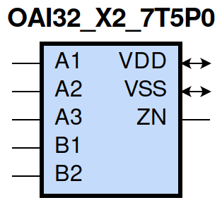

=======================================
gf180mcu_fd_sc_mcu7t5v0__oai32_x2
=======================================

**gf180mcu_fd_sc_mcu7t5v0__oai32_x2 symbol**

**gf180mcu_fd_sc_mcu7t5v0__oai32_x2 schematic**

.. image:: sc7_sch/OAI32_X2_sch.png
    :height: 300px
    :width: 500 px
    :align: center
    :alt: gf180mcu_fd_sc_mcu7t5v0__oai32_x2 schematic

**gf180mcu_fd_sc_mcu7t5v0__oai32_x2 layout**

.. image:: sc7_lay/OAI32_X2_lay.png
    :height: 400px
    :width: 700 px
    :align: center
    :alt: gf180mcu_fd_sc_mcu7t5v0__oai32_x2 layout

.. include:: images.rst

OAI32_X2 is a 3-input OR and a 2-input OR into 2-input NAND, NAND[OR(A1,A2,A3),OR(B1,B2)], 2X drive strength

|
| Attributes

============= ======================
**Attribute** **Value**
area          50.489600 µm\ :sup:`2`
============= ======================

|
| OUTPUT FUNCTIONS

============== ===================================
**Output Pin** **Function**
ZN             (((!A1)&(!A2)&(!A3))|((!B1)&(!B2)))
============== ===================================

|
| TRUTH TABLE FOR ZN

====== ====== ====== ====== ====== ======
**A1** **A2** **A3** **B1** **B2** **ZN**
0      0      0      ?      ?      1
?      ?      ?      0      0      1
1      ?      ?      1      ?      0
1      ?      ?      ?      1      0
?      1      ?      1      ?      0
?      1      ?      ?      1      0
?      ?      1      1      ?      0
?      ?      1      ?      1      0
====== ====== ====== ====== ====== ======

|
| FUNCTIONAL SCHEMATIC
| |image575|
| PIN CAPACITANCE (pf)

======= ======== ====================
**Pin** **Type** **Capacitance (pf)**
A3      input    0.0098
A2      input    0.0095
A1      input    0.0089
B2      input    0.0093
B1      input    0.0088
======= ======== ====================

|
| DELAY AND OUTPUT TRANSITION TIME corresponding to min slew and load

+---------------+------------+--------------------+--------------+-------------------+----------------+---------------+
| **Input Pin** | **Output** | **When Condition** | **Tin (ns)** | **Out Load (pf)** | **Delay (ns)** | **Tout (ns)** |
+---------------+------------+--------------------+--------------+-------------------+----------------+---------------+
| A3(LH)        | ZN(HL)     | !A1&!A2&!B1&B2     | 0.0100       | 0.0010            | 0.1520         | 0.0824        |
+---------------+------------+--------------------+--------------+-------------------+----------------+---------------+
| A3(LH)        | ZN(HL)     | !A1&!A2&B1&!B2     | 0.0100       | 0.0010            | 0.1243         | 0.0656        |
+---------------+------------+--------------------+--------------+-------------------+----------------+---------------+
| A3(LH)        | ZN(HL)     | !A1&!A2&B1&B2      | 0.0100       | 0.0010            | 0.1015         | 0.0594        |
+---------------+------------+--------------------+--------------+-------------------+----------------+---------------+
| A3(HL)        | ZN(LH)     | !A1&!A2&!B1&B2     | 0.0100       | 0.0010            | 0.4217         | 0.3426        |
+---------------+------------+--------------------+--------------+-------------------+----------------+---------------+
| A3(HL)        | ZN(LH)     | !A1&!A2&B1&!B2     | 0.0100       | 0.0010            | 0.3988         | 0.2685        |
+---------------+------------+--------------------+--------------+-------------------+----------------+---------------+
| A3(HL)        | ZN(LH)     | !A1&!A2&B1&B2      | 0.0100       | 0.0010            | 0.4368         | 0.2979        |
+---------------+------------+--------------------+--------------+-------------------+----------------+---------------+
| A2(HL)        | ZN(LH)     | !A1&!A3&!B1&B2     | 0.0100       | 0.0010            | 0.3967         | 0.3426        |
+---------------+------------+--------------------+--------------+-------------------+----------------+---------------+
| A2(HL)        | ZN(LH)     | !A1&!A3&B1&!B2     | 0.0100       | 0.0010            | 0.3738         | 0.2687        |
+---------------+------------+--------------------+--------------+-------------------+----------------+---------------+
| A2(HL)        | ZN(LH)     | !A1&!A3&B1&B2      | 0.0100       | 0.0010            | 0.4119         | 0.2977        |
+---------------+------------+--------------------+--------------+-------------------+----------------+---------------+
| A2(LH)        | ZN(HL)     | !A1&!A3&!B1&B2     | 0.0100       | 0.0010            | 0.1427         | 0.0702        |
+---------------+------------+--------------------+--------------+-------------------+----------------+---------------+
| A2(LH)        | ZN(HL)     | !A1&!A3&B1&!B2     | 0.0100       | 0.0010            | 0.1184         | 0.0545        |
+---------------+------------+--------------------+--------------+-------------------+----------------+---------------+
| A2(LH)        | ZN(HL)     | !A1&!A3&B1&B2      | 0.0100       | 0.0010            | 0.0988         | 0.0506        |
+---------------+------------+--------------------+--------------+-------------------+----------------+---------------+
| A1(HL)        | ZN(LH)     | !A2&!A3&!B1&B2     | 0.0100       | 0.0010            | 0.3374         | 0.3425        |
+---------------+------------+--------------------+--------------+-------------------+----------------+---------------+
| A1(HL)        | ZN(LH)     | !A2&!A3&B1&!B2     | 0.0100       | 0.0010            | 0.3147         | 0.2683        |
+---------------+------------+--------------------+--------------+-------------------+----------------+---------------+
| A1(HL)        | ZN(LH)     | !A2&!A3&B1&B2      | 0.0100       | 0.0010            | 0.3526         | 0.2978        |
+---------------+------------+--------------------+--------------+-------------------+----------------+---------------+
| A1(LH)        | ZN(HL)     | !A2&!A3&!B1&B2     | 0.0100       | 0.0010            | 0.1202         | 0.0556        |
+---------------+------------+--------------------+--------------+-------------------+----------------+---------------+
| A1(LH)        | ZN(HL)     | !A2&!A3&B1&!B2     | 0.0100       | 0.0010            | 0.0981         | 0.0404        |
+---------------+------------+--------------------+--------------+-------------------+----------------+---------------+
| A1(LH)        | ZN(HL)     | !A2&!A3&B1&B2      | 0.0100       | 0.0010            | 0.0841         | 0.0395        |
+---------------+------------+--------------------+--------------+-------------------+----------------+---------------+
| B2(HL)        | ZN(LH)     | !A1&!A2&A3&!B1     | 0.0100       | 0.0010            | 0.1574         | 0.1503        |
+---------------+------------+--------------------+--------------+-------------------+----------------+---------------+
| B2(HL)        | ZN(LH)     | !A1&A2&!A3&!B1     | 0.0100       | 0.0010            | 0.1574         | 0.1328        |
+---------------+------------+--------------------+--------------+-------------------+----------------+---------------+
| B2(HL)        | ZN(LH)     | !A1&A2&A3&!B1      | 0.0100       | 0.0010            | 0.1564         | 0.1328        |
+---------------+------------+--------------------+--------------+-------------------+----------------+---------------+
| B2(HL)        | ZN(LH)     | A1&!A2&!A3&!B1     | 0.0100       | 0.0010            | 0.1483         | 0.0913        |
+---------------+------------+--------------------+--------------+-------------------+----------------+---------------+
| B2(HL)        | ZN(LH)     | A1&!A2&A3&!B1      | 0.0100       | 0.0010            | 0.1473         | 0.0914        |
+---------------+------------+--------------------+--------------+-------------------+----------------+---------------+
| B2(HL)        | ZN(LH)     | A1&A2&!A3&!B1      | 0.0100       | 0.0010            | 0.1473         | 0.0914        |
+---------------+------------+--------------------+--------------+-------------------+----------------+---------------+
| B2(HL)        | ZN(LH)     | A1&A2&A3&!B1       | 0.0100       | 0.0010            | 0.1468         | 0.0914        |
+---------------+------------+--------------------+--------------+-------------------+----------------+---------------+
| B2(LH)        | ZN(HL)     | !A1&!A2&A3&!B1     | 0.0100       | 0.0010            | 0.1129         | 0.0818        |
+---------------+------------+--------------------+--------------+-------------------+----------------+---------------+
| B2(LH)        | ZN(HL)     | !A1&A2&!A3&!B1     | 0.0100       | 0.0010            | 0.1019         | 0.0703        |
+---------------+------------+--------------------+--------------+-------------------+----------------+---------------+
| B2(LH)        | ZN(HL)     | !A1&A2&A3&!B1      | 0.0100       | 0.0010            | 0.0851         | 0.0542        |
+---------------+------------+--------------------+--------------+-------------------+----------------+---------------+
| B2(LH)        | ZN(HL)     | A1&!A2&!A3&!B1     | 0.0100       | 0.0010            | 0.0785         | 0.0554        |
+---------------+------------+--------------------+--------------+-------------------+----------------+---------------+
| B2(LH)        | ZN(HL)     | A1&!A2&A3&!B1      | 0.0100       | 0.0010            | 0.0666         | 0.0425        |
+---------------+------------+--------------------+--------------+-------------------+----------------+---------------+
| B2(LH)        | ZN(HL)     | A1&A2&!A3&!B1      | 0.0100       | 0.0010            | 0.0667         | 0.0426        |
+---------------+------------+--------------------+--------------+-------------------+----------------+---------------+
| B2(LH)        | ZN(HL)     | A1&A2&A3&!B1       | 0.0100       | 0.0010            | 0.0628         | 0.0393        |
+---------------+------------+--------------------+--------------+-------------------+----------------+---------------+
| B1(HL)        | ZN(LH)     | !A1&!A2&A3&!B2     | 0.0100       | 0.0010            | 0.1280         | 0.1498        |
+---------------+------------+--------------------+--------------+-------------------+----------------+---------------+
| B1(HL)        | ZN(LH)     | !A1&A2&!A3&!B2     | 0.0100       | 0.0010            | 0.1280         | 0.1325        |
+---------------+------------+--------------------+--------------+-------------------+----------------+---------------+
| B1(HL)        | ZN(LH)     | !A1&A2&A3&!B2      | 0.0100       | 0.0010            | 0.1271         | 0.1324        |
+---------------+------------+--------------------+--------------+-------------------+----------------+---------------+
| B1(HL)        | ZN(LH)     | A1&!A2&!A3&!B2     | 0.0100       | 0.0010            | 0.1191         | 0.0910        |
+---------------+------------+--------------------+--------------+-------------------+----------------+---------------+
| B1(HL)        | ZN(LH)     | A1&!A2&A3&!B2      | 0.0100       | 0.0010            | 0.1181         | 0.0910        |
+---------------+------------+--------------------+--------------+-------------------+----------------+---------------+
| B1(HL)        | ZN(LH)     | A1&A2&!A3&!B2      | 0.0100       | 0.0010            | 0.1181         | 0.0910        |
+---------------+------------+--------------------+--------------+-------------------+----------------+---------------+
| B1(HL)        | ZN(LH)     | A1&A2&A3&!B2       | 0.0100       | 0.0010            | 0.1176         | 0.0910        |
+---------------+------------+--------------------+--------------+-------------------+----------------+---------------+
| B1(LH)        | ZN(HL)     | !A1&!A2&A3&!B2     | 0.0100       | 0.0010            | 0.0870         | 0.0645        |
+---------------+------------+--------------------+--------------+-------------------+----------------+---------------+
| B1(LH)        | ZN(HL)     | !A1&A2&!A3&!B2     | 0.0100       | 0.0010            | 0.0796         | 0.0538        |
+---------------+------------+--------------------+--------------+-------------------+----------------+---------------+
| B1(LH)        | ZN(HL)     | !A1&A2&A3&!B2      | 0.0100       | 0.0010            | 0.0679         | 0.0413        |
+---------------+------------+--------------------+--------------+-------------------+----------------+---------------+
| B1(LH)        | ZN(HL)     | A1&!A2&!A3&!B2     | 0.0100       | 0.0010            | 0.0592         | 0.0384        |
+---------------+------------+--------------------+--------------+-------------------+----------------+---------------+
| B1(LH)        | ZN(HL)     | A1&!A2&A3&!B2      | 0.0100       | 0.0010            | 0.0521         | 0.0302        |
+---------------+------------+--------------------+--------------+-------------------+----------------+---------------+
| B1(LH)        | ZN(HL)     | A1&A2&!A3&!B2      | 0.0100       | 0.0010            | 0.0521         | 0.0302        |
+---------------+------------+--------------------+--------------+-------------------+----------------+---------------+
| B1(LH)        | ZN(HL)     | A1&A2&A3&!B2       | 0.0100       | 0.0010            | 0.0497         | 0.0280        |
+---------------+------------+--------------------+--------------+-------------------+----------------+---------------+

|
| DYNAMIC ENERGY

+---------------+--------------------+--------------+------------+-------------------+---------------------+
| **Input Pin** | **When Condition** | **Tin (ns)** | **Output** | **Out Load (pf)** | **Energy (uW/MHz)** |
+---------------+--------------------+--------------+------------+-------------------+---------------------+
| A1            | !A2&!A3&!B1&B2     | 0.0100       | ZN(LH)     | 0.0010            | 0.5469              |
+---------------+--------------------+--------------+------------+-------------------+---------------------+
| A1            | !A2&!A3&B1&!B2     | 0.0100       | ZN(LH)     | 0.0010            | 0.4927              |
+---------------+--------------------+--------------+------------+-------------------+---------------------+
| A1            | !A2&!A3&B1&B2      | 0.0100       | ZN(LH)     | 0.0010            | 0.5375              |
+---------------+--------------------+--------------+------------+-------------------+---------------------+
| B2            | !A1&!A2&A3&!B1     | 0.0100       | ZN(LH)     | 0.0010            | 0.4259              |
+---------------+--------------------+--------------+------------+-------------------+---------------------+
| B2            | !A1&A2&!A3&!B1     | 0.0100       | ZN(LH)     | 0.0010            | 0.3735              |
+---------------+--------------------+--------------+------------+-------------------+---------------------+
| B2            | !A1&A2&A3&!B1      | 0.0100       | ZN(LH)     | 0.0010            | 0.3722              |
+---------------+--------------------+--------------+------------+-------------------+---------------------+
| B2            | A1&!A2&!A3&!B1     | 0.0100       | ZN(LH)     | 0.0010            | 0.3201              |
+---------------+--------------------+--------------+------------+-------------------+---------------------+
| B2            | A1&!A2&A3&!B1      | 0.0100       | ZN(LH)     | 0.0010            | 0.3188              |
+---------------+--------------------+--------------+------------+-------------------+---------------------+
| B2            | A1&A2&!A3&!B1      | 0.0100       | ZN(LH)     | 0.0010            | 0.3188              |
+---------------+--------------------+--------------+------------+-------------------+---------------------+
| B2            | A1&A2&A3&!B1       | 0.0100       | ZN(LH)     | 0.0010            | 0.3181              |
+---------------+--------------------+--------------+------------+-------------------+---------------------+
| B1            | !A1&!A2&A3&!B2     | 0.0100       | ZN(LH)     | 0.0010            | 0.3715              |
+---------------+--------------------+--------------+------------+-------------------+---------------------+
| B1            | !A1&A2&!A3&!B2     | 0.0100       | ZN(LH)     | 0.0010            | 0.3191              |
+---------------+--------------------+--------------+------------+-------------------+---------------------+
| B1            | !A1&A2&A3&!B2      | 0.0100       | ZN(LH)     | 0.0010            | 0.3177              |
+---------------+--------------------+--------------+------------+-------------------+---------------------+
| B1            | A1&!A2&!A3&!B2     | 0.0100       | ZN(LH)     | 0.0010            | 0.2657              |
+---------------+--------------------+--------------+------------+-------------------+---------------------+
| B1            | A1&!A2&A3&!B2      | 0.0100       | ZN(LH)     | 0.0010            | 0.2644              |
+---------------+--------------------+--------------+------------+-------------------+---------------------+
| B1            | A1&A2&!A3&!B2      | 0.0100       | ZN(LH)     | 0.0010            | 0.2644              |
+---------------+--------------------+--------------+------------+-------------------+---------------------+
| B1            | A1&A2&A3&!B2       | 0.0100       | ZN(LH)     | 0.0010            | 0.2636              |
+---------------+--------------------+--------------+------------+-------------------+---------------------+
| A2            | !A1&!A3&!B1&B2     | 0.0100       | ZN(LH)     | 0.0010            | 0.6003              |
+---------------+--------------------+--------------+------------+-------------------+---------------------+
| A2            | !A1&!A3&B1&!B2     | 0.0100       | ZN(LH)     | 0.0010            | 0.5460              |
+---------------+--------------------+--------------+------------+-------------------+---------------------+
| A2            | !A1&!A3&B1&B2      | 0.0100       | ZN(LH)     | 0.0010            | 0.5910              |
+---------------+--------------------+--------------+------------+-------------------+---------------------+
| B1            | !A1&!A2&A3&!B2     | 0.0100       | ZN(HL)     | 0.0010            | 0.1055              |
+---------------+--------------------+--------------+------------+-------------------+---------------------+
| B1            | !A1&A2&!A3&!B2     | 0.0100       | ZN(HL)     | 0.0010            | 0.0581              |
+---------------+--------------------+--------------+------------+-------------------+---------------------+
| B1            | !A1&A2&A3&!B2      | 0.0100       | ZN(HL)     | 0.0010            | 0.0583              |
+---------------+--------------------+--------------+------------+-------------------+---------------------+
| B1            | A1&!A2&!A3&!B2     | 0.0100       | ZN(HL)     | 0.0010            | 0.0094              |
+---------------+--------------------+--------------+------------+-------------------+---------------------+
| B1            | A1&!A2&A3&!B2      | 0.0100       | ZN(HL)     | 0.0010            | 0.0094              |
+---------------+--------------------+--------------+------------+-------------------+---------------------+
| B1            | A1&A2&!A3&!B2      | 0.0100       | ZN(HL)     | 0.0010            | 0.0094              |
+---------------+--------------------+--------------+------------+-------------------+---------------------+
| B1            | A1&A2&A3&!B2       | 0.0100       | ZN(HL)     | 0.0010            | 0.0094              |
+---------------+--------------------+--------------+------------+-------------------+---------------------+
| A3            | !A1&!A2&!B1&B2     | 0.0100       | ZN(HL)     | 0.0010            | 0.1544              |
+---------------+--------------------+--------------+------------+-------------------+---------------------+
| A3            | !A1&!A2&B1&!B2     | 0.0100       | ZN(HL)     | 0.0010            | 0.0995              |
+---------------+--------------------+--------------+------------+-------------------+---------------------+
| A3            | !A1&!A2&B1&B2      | 0.0100       | ZN(HL)     | 0.0010            | 0.0995              |
+---------------+--------------------+--------------+------------+-------------------+---------------------+
| A1            | !A2&!A3&!B1&B2     | 0.0100       | ZN(HL)     | 0.0010            | 0.0658              |
+---------------+--------------------+--------------+------------+-------------------+---------------------+
| A1            | !A2&!A3&B1&!B2     | 0.0100       | ZN(HL)     | 0.0010            | 0.0097              |
+---------------+--------------------+--------------+------------+-------------------+---------------------+
| A1            | !A2&!A3&B1&B2      | 0.0100       | ZN(HL)     | 0.0010            | 0.0098              |
+---------------+--------------------+--------------+------------+-------------------+---------------------+
| B2            | !A1&!A2&A3&!B1     | 0.0100       | ZN(HL)     | 0.0010            | 0.1555              |
+---------------+--------------------+--------------+------------+-------------------+---------------------+
| B2            | !A1&A2&!A3&!B1     | 0.0100       | ZN(HL)     | 0.0010            | 0.1082              |
+---------------+--------------------+--------------+------------+-------------------+---------------------+
| B2            | !A1&A2&A3&!B1      | 0.0100       | ZN(HL)     | 0.0010            | 0.1084              |
+---------------+--------------------+--------------+------------+-------------------+---------------------+
| B2            | A1&!A2&!A3&!B1     | 0.0100       | ZN(HL)     | 0.0010            | 0.0602              |
+---------------+--------------------+--------------+------------+-------------------+---------------------+
| B2            | A1&!A2&A3&!B1      | 0.0100       | ZN(HL)     | 0.0010            | 0.0603              |
+---------------+--------------------+--------------+------------+-------------------+---------------------+
| B2            | A1&A2&!A3&!B1      | 0.0100       | ZN(HL)     | 0.0010            | 0.0603              |
+---------------+--------------------+--------------+------------+-------------------+---------------------+
| B2            | A1&A2&A3&!B1       | 0.0100       | ZN(HL)     | 0.0010            | 0.0602              |
+---------------+--------------------+--------------+------------+-------------------+---------------------+
| A2            | !A1&!A3&!B1&B2     | 0.0100       | ZN(HL)     | 0.0010            | 0.1116              |
+---------------+--------------------+--------------+------------+-------------------+---------------------+
| A2            | !A1&!A3&B1&!B2     | 0.0100       | ZN(HL)     | 0.0010            | 0.0566              |
+---------------+--------------------+--------------+------------+-------------------+---------------------+
| A2            | !A1&!A3&B1&B2      | 0.0100       | ZN(HL)     | 0.0010            | 0.0564              |
+---------------+--------------------+--------------+------------+-------------------+---------------------+
| A3            | !A1&!A2&!B1&B2     | 0.0100       | ZN(LH)     | 0.0010            | 0.6527              |
+---------------+--------------------+--------------+------------+-------------------+---------------------+
| A3            | !A1&!A2&B1&!B2     | 0.0100       | ZN(LH)     | 0.0010            | 0.5983              |
+---------------+--------------------+--------------+------------+-------------------+---------------------+
| A3            | !A1&!A2&B1&B2      | 0.0100       | ZN(LH)     | 0.0010            | 0.6435              |
+---------------+--------------------+--------------+------------+-------------------+---------------------+
| A3(LH)        | !A1&!A2&!B1&!B2    | 0.0100       | n/a        | n/a               | -0.0702             |
+---------------+--------------------+--------------+------------+-------------------+---------------------+
| A3(LH)        | !A1&A2&!B1&!B2     | 0.0100       | n/a        | n/a               | -0.0680             |
+---------------+--------------------+--------------+------------+-------------------+---------------------+
| A3(LH)        | A1&!A2&!B1&!B2     | 0.0100       | n/a        | n/a               | -0.0606             |
+---------------+--------------------+--------------+------------+-------------------+---------------------+
| A3(LH)        | A1&A2&!B1&!B2      | 0.0100       | n/a        | n/a               | -0.0665             |
+---------------+--------------------+--------------+------------+-------------------+---------------------+
| A3(LH)        | !A1&A2&!B1&B2      | 0.0100       | n/a        | n/a               | -0.0609             |
+---------------+--------------------+--------------+------------+-------------------+---------------------+
| A3(LH)        | !A1&A2&B1&!B2      | 0.0100       | n/a        | n/a               | -0.0610             |
+---------------+--------------------+--------------+------------+-------------------+---------------------+
| A3(LH)        | !A1&A2&B1&B2       | 0.0100       | n/a        | n/a               | -0.0609             |
+---------------+--------------------+--------------+------------+-------------------+---------------------+
| A3(LH)        | A1&!A2&!B1&B2      | 0.0100       | n/a        | n/a               | -0.0587             |
+---------------+--------------------+--------------+------------+-------------------+---------------------+
| A3(LH)        | A1&!A2&B1&!B2      | 0.0100       | n/a        | n/a               | -0.0587             |
+---------------+--------------------+--------------+------------+-------------------+---------------------+
| A3(LH)        | A1&!A2&B1&B2       | 0.0100       | n/a        | n/a               | -0.0587             |
+---------------+--------------------+--------------+------------+-------------------+---------------------+
| A3(LH)        | A1&A2&!B1&B2       | 0.0100       | n/a        | n/a               | -0.0665             |
+---------------+--------------------+--------------+------------+-------------------+---------------------+
| A3(LH)        | A1&A2&B1&!B2       | 0.0100       | n/a        | n/a               | -0.0665             |
+---------------+--------------------+--------------+------------+-------------------+---------------------+
| A3(LH)        | A1&A2&B1&B2        | 0.0100       | n/a        | n/a               | -0.0664             |
+---------------+--------------------+--------------+------------+-------------------+---------------------+
| A1(LH)        | !A2&!A3&!B1&!B2    | 0.0100       | n/a        | n/a               | -0.0708             |
+---------------+--------------------+--------------+------------+-------------------+---------------------+
| A1(LH)        | !A2&A3&!B1&!B2     | 0.0100       | n/a        | n/a               | -0.0617             |
+---------------+--------------------+--------------+------------+-------------------+---------------------+
| A1(LH)        | A2&!A3&!B1&!B2     | 0.0100       | n/a        | n/a               | -0.0688             |
+---------------+--------------------+--------------+------------+-------------------+---------------------+
| A1(LH)        | A2&A3&!B1&!B2      | 0.0100       | n/a        | n/a               | -0.0673             |
+---------------+--------------------+--------------+------------+-------------------+---------------------+
| A1(LH)        | !A2&A3&!B1&B2      | 0.0100       | n/a        | n/a               | -0.0196             |
+---------------+--------------------+--------------+------------+-------------------+---------------------+
| A1(LH)        | !A2&A3&B1&!B2      | 0.0100       | n/a        | n/a               | -0.0196             |
+---------------+--------------------+--------------+------------+-------------------+---------------------+
| A1(LH)        | !A2&A3&B1&B2       | 0.0100       | n/a        | n/a               | -0.0196             |
+---------------+--------------------+--------------+------------+-------------------+---------------------+
| A1(LH)        | A2&!A3&!B1&B2      | 0.0100       | n/a        | n/a               | -0.0201             |
+---------------+--------------------+--------------+------------+-------------------+---------------------+
| A1(LH)        | A2&!A3&B1&!B2      | 0.0100       | n/a        | n/a               | -0.0201             |
+---------------+--------------------+--------------+------------+-------------------+---------------------+
| A1(LH)        | A2&!A3&B1&B2       | 0.0100       | n/a        | n/a               | -0.0201             |
+---------------+--------------------+--------------+------------+-------------------+---------------------+
| A1(LH)        | A2&A3&!B1&B2       | 0.0100       | n/a        | n/a               | -0.0201             |
+---------------+--------------------+--------------+------------+-------------------+---------------------+
| A1(LH)        | A2&A3&B1&!B2       | 0.0100       | n/a        | n/a               | -0.0201             |
+---------------+--------------------+--------------+------------+-------------------+---------------------+
| A1(LH)        | A2&A3&B1&B2        | 0.0100       | n/a        | n/a               | -0.0201             |
+---------------+--------------------+--------------+------------+-------------------+---------------------+
| A2(LH)        | !A1&!A3&!B1&!B2    | 0.0100       | n/a        | n/a               | -0.0706             |
+---------------+--------------------+--------------+------------+-------------------+---------------------+
| A2(LH)        | !A1&A3&!B1&!B2     | 0.0100       | n/a        | n/a               | -0.0685             |
+---------------+--------------------+--------------+------------+-------------------+---------------------+
| A2(LH)        | A1&!A3&!B1&!B2     | 0.0100       | n/a        | n/a               | -0.0684             |
+---------------+--------------------+--------------+------------+-------------------+---------------------+
| A2(LH)        | A1&A3&!B1&!B2      | 0.0100       | n/a        | n/a               | -0.0657             |
+---------------+--------------------+--------------+------------+-------------------+---------------------+
| A2(LH)        | !A1&A3&!B1&B2      | 0.0100       | n/a        | n/a               | -0.0215             |
+---------------+--------------------+--------------+------------+-------------------+---------------------+
| A2(LH)        | !A1&A3&B1&!B2      | 0.0100       | n/a        | n/a               | -0.0215             |
+---------------+--------------------+--------------+------------+-------------------+---------------------+
| A2(LH)        | !A1&A3&B1&B2       | 0.0100       | n/a        | n/a               | -0.0215             |
+---------------+--------------------+--------------+------------+-------------------+---------------------+
| A2(LH)        | A1&!A3&!B1&B2      | 0.0100       | n/a        | n/a               | -0.0585             |
+---------------+--------------------+--------------+------------+-------------------+---------------------+
| A2(LH)        | A1&!A3&B1&!B2      | 0.0100       | n/a        | n/a               | -0.0585             |
+---------------+--------------------+--------------+------------+-------------------+---------------------+
| A2(LH)        | A1&!A3&B1&B2       | 0.0100       | n/a        | n/a               | -0.0585             |
+---------------+--------------------+--------------+------------+-------------------+---------------------+
| A2(LH)        | A1&A3&!B1&B2       | 0.0100       | n/a        | n/a               | -0.0517             |
+---------------+--------------------+--------------+------------+-------------------+---------------------+
| A2(LH)        | A1&A3&B1&!B2       | 0.0100       | n/a        | n/a               | -0.0517             |
+---------------+--------------------+--------------+------------+-------------------+---------------------+
| A2(LH)        | A1&A3&B1&B2        | 0.0100       | n/a        | n/a               | -0.0517             |
+---------------+--------------------+--------------+------------+-------------------+---------------------+
| A3(HL)        | !A1&!A2&!B1&!B2    | 0.0100       | n/a        | n/a               | 0.0762              |
+---------------+--------------------+--------------+------------+-------------------+---------------------+
| A3(HL)        | !A1&A2&!B1&!B2     | 0.0100       | n/a        | n/a               | 0.0703              |
+---------------+--------------------+--------------+------------+-------------------+---------------------+
| A3(HL)        | A1&!A2&!B1&!B2     | 0.0100       | n/a        | n/a               | 0.0704              |
+---------------+--------------------+--------------+------------+-------------------+---------------------+
| A3(HL)        | A1&A2&!B1&!B2      | 0.0100       | n/a        | n/a               | 0.0703              |
+---------------+--------------------+--------------+------------+-------------------+---------------------+
| A3(HL)        | !A1&A2&!B1&B2      | 0.0100       | n/a        | n/a               | 0.0703              |
+---------------+--------------------+--------------+------------+-------------------+---------------------+
| A3(HL)        | !A1&A2&B1&!B2      | 0.0100       | n/a        | n/a               | 0.0703              |
+---------------+--------------------+--------------+------------+-------------------+---------------------+
| A3(HL)        | !A1&A2&B1&B2       | 0.0100       | n/a        | n/a               | 0.0703              |
+---------------+--------------------+--------------+------------+-------------------+---------------------+
| A3(HL)        | A1&!A2&!B1&B2      | 0.0100       | n/a        | n/a               | 0.0704              |
+---------------+--------------------+--------------+------------+-------------------+---------------------+
| A3(HL)        | A1&!A2&B1&!B2      | 0.0100       | n/a        | n/a               | 0.0704              |
+---------------+--------------------+--------------+------------+-------------------+---------------------+
| A3(HL)        | A1&!A2&B1&B2       | 0.0100       | n/a        | n/a               | 0.0703              |
+---------------+--------------------+--------------+------------+-------------------+---------------------+
| A3(HL)        | A1&A2&!B1&B2       | 0.0100       | n/a        | n/a               | 0.0703              |
+---------------+--------------------+--------------+------------+-------------------+---------------------+
| A3(HL)        | A1&A2&B1&!B2       | 0.0100       | n/a        | n/a               | 0.0704              |
+---------------+--------------------+--------------+------------+-------------------+---------------------+
| A3(HL)        | A1&A2&B1&B2        | 0.0100       | n/a        | n/a               | 0.0703              |
+---------------+--------------------+--------------+------------+-------------------+---------------------+
| A2(HL)        | !A1&!A3&!B1&!B2    | 0.0100       | n/a        | n/a               | 0.0764              |
+---------------+--------------------+--------------+------------+-------------------+---------------------+
| A2(HL)        | !A1&A3&!B1&!B2     | 0.0100       | n/a        | n/a               | 0.0705              |
+---------------+--------------------+--------------+------------+-------------------+---------------------+
| A2(HL)        | A1&!A3&!B1&!B2     | 0.0100       | n/a        | n/a               | 0.0705              |
+---------------+--------------------+--------------+------------+-------------------+---------------------+
| A2(HL)        | A1&A3&!B1&!B2      | 0.0100       | n/a        | n/a               | 0.0429              |
+---------------+--------------------+--------------+------------+-------------------+---------------------+
| A2(HL)        | !A1&A3&!B1&B2      | 0.0100       | n/a        | n/a               | 0.0486              |
+---------------+--------------------+--------------+------------+-------------------+---------------------+
| A2(HL)        | !A1&A3&B1&!B2      | 0.0100       | n/a        | n/a               | 0.0486              |
+---------------+--------------------+--------------+------------+-------------------+---------------------+
| A2(HL)        | !A1&A3&B1&B2       | 0.0100       | n/a        | n/a               | 0.0486              |
+---------------+--------------------+--------------+------------+-------------------+---------------------+
| A2(HL)        | A1&!A3&!B1&B2      | 0.0100       | n/a        | n/a               | 0.0705              |
+---------------+--------------------+--------------+------------+-------------------+---------------------+
| A2(HL)        | A1&!A3&B1&!B2      | 0.0100       | n/a        | n/a               | 0.0705              |
+---------------+--------------------+--------------+------------+-------------------+---------------------+
| A2(HL)        | A1&!A3&B1&B2       | 0.0100       | n/a        | n/a               | 0.0705              |
+---------------+--------------------+--------------+------------+-------------------+---------------------+
| A2(HL)        | A1&A3&!B1&B2       | 0.0100       | n/a        | n/a               | 0.0429              |
+---------------+--------------------+--------------+------------+-------------------+---------------------+
| A2(HL)        | A1&A3&B1&!B2       | 0.0100       | n/a        | n/a               | 0.0429              |
+---------------+--------------------+--------------+------------+-------------------+---------------------+
| A2(HL)        | A1&A3&B1&B2        | 0.0100       | n/a        | n/a               | 0.0429              |
+---------------+--------------------+--------------+------------+-------------------+---------------------+
| B1(HL)        | !A1&!A2&!A3&!B2    | 0.0100       | n/a        | n/a               | 0.0800              |
+---------------+--------------------+--------------+------------+-------------------+---------------------+
| B1(HL)        | !A1&!A2&!A3&B2     | 0.0100       | n/a        | n/a               | 0.0805              |
+---------------+--------------------+--------------+------------+-------------------+---------------------+
| B1(HL)        | !A1&!A2&A3&B2      | 0.0100       | n/a        | n/a               | 0.0586              |
+---------------+--------------------+--------------+------------+-------------------+---------------------+
| B1(HL)        | !A1&A2&!A3&B2      | 0.0100       | n/a        | n/a               | 0.0586              |
+---------------+--------------------+--------------+------------+-------------------+---------------------+
| B1(HL)        | !A1&A2&A3&B2       | 0.0100       | n/a        | n/a               | 0.0586              |
+---------------+--------------------+--------------+------------+-------------------+---------------------+
| B1(HL)        | A1&!A2&!A3&B2      | 0.0100       | n/a        | n/a               | 0.0586              |
+---------------+--------------------+--------------+------------+-------------------+---------------------+
| B1(HL)        | A1&!A2&A3&B2       | 0.0100       | n/a        | n/a               | 0.0586              |
+---------------+--------------------+--------------+------------+-------------------+---------------------+
| B1(HL)        | A1&A2&!A3&B2       | 0.0100       | n/a        | n/a               | 0.0586              |
+---------------+--------------------+--------------+------------+-------------------+---------------------+
| B1(HL)        | A1&A2&A3&B2        | 0.0100       | n/a        | n/a               | 0.0586              |
+---------------+--------------------+--------------+------------+-------------------+---------------------+
| B2(LH)        | !A1&!A2&!A3&!B1    | 0.0100       | n/a        | n/a               | 0.0969              |
+---------------+--------------------+--------------+------------+-------------------+---------------------+
| B2(LH)        | !A1&!A2&!A3&B1     | 0.0100       | n/a        | n/a               | -0.0770             |
+---------------+--------------------+--------------+------------+-------------------+---------------------+
| B2(LH)        | !A1&!A2&A3&B1      | 0.0100       | n/a        | n/a               | -0.0584             |
+---------------+--------------------+--------------+------------+-------------------+---------------------+
| B2(LH)        | !A1&A2&!A3&B1      | 0.0100       | n/a        | n/a               | -0.0584             |
+---------------+--------------------+--------------+------------+-------------------+---------------------+
| B2(LH)        | !A1&A2&A3&B1       | 0.0100       | n/a        | n/a               | -0.0584             |
+---------------+--------------------+--------------+------------+-------------------+---------------------+
| B2(LH)        | A1&!A2&!A3&B1      | 0.0100       | n/a        | n/a               | -0.0584             |
+---------------+--------------------+--------------+------------+-------------------+---------------------+
| B2(LH)        | A1&!A2&A3&B1       | 0.0100       | n/a        | n/a               | -0.0584             |
+---------------+--------------------+--------------+------------+-------------------+---------------------+
| B2(LH)        | A1&A2&!A3&B1       | 0.0100       | n/a        | n/a               | -0.0584             |
+---------------+--------------------+--------------+------------+-------------------+---------------------+
| B2(LH)        | A1&A2&A3&B1        | 0.0100       | n/a        | n/a               | -0.0584             |
+---------------+--------------------+--------------+------------+-------------------+---------------------+
| B2(HL)        | !A1&!A2&!A3&!B1    | 0.0100       | n/a        | n/a               | 0.0796              |
+---------------+--------------------+--------------+------------+-------------------+---------------------+
| B2(HL)        | !A1&!A2&!A3&B1     | 0.0100       | n/a        | n/a               | 0.0804              |
+---------------+--------------------+--------------+------------+-------------------+---------------------+
| B2(HL)        | !A1&!A2&A3&B1      | 0.0100       | n/a        | n/a               | 0.0703              |
+---------------+--------------------+--------------+------------+-------------------+---------------------+
| B2(HL)        | !A1&A2&!A3&B1      | 0.0100       | n/a        | n/a               | 0.0703              |
+---------------+--------------------+--------------+------------+-------------------+---------------------+
| B2(HL)        | !A1&A2&A3&B1       | 0.0100       | n/a        | n/a               | 0.0704              |
+---------------+--------------------+--------------+------------+-------------------+---------------------+
| B2(HL)        | A1&!A2&!A3&B1      | 0.0100       | n/a        | n/a               | 0.0702              |
+---------------+--------------------+--------------+------------+-------------------+---------------------+
| B2(HL)        | A1&!A2&A3&B1       | 0.0100       | n/a        | n/a               | 0.0703              |
+---------------+--------------------+--------------+------------+-------------------+---------------------+
| B2(HL)        | A1&A2&!A3&B1       | 0.0100       | n/a        | n/a               | 0.0704              |
+---------------+--------------------+--------------+------------+-------------------+---------------------+
| B2(HL)        | A1&A2&A3&B1        | 0.0100       | n/a        | n/a               | 0.0703              |
+---------------+--------------------+--------------+------------+-------------------+---------------------+
| A1(HL)        | !A2&!A3&!B1&!B2    | 0.0100       | n/a        | n/a               | 0.0765              |
+---------------+--------------------+--------------+------------+-------------------+---------------------+
| A1(HL)        | !A2&A3&!B1&!B2     | 0.0100       | n/a        | n/a               | 0.0707              |
+---------------+--------------------+--------------+------------+-------------------+---------------------+
| A1(HL)        | A2&!A3&!B1&!B2     | 0.0100       | n/a        | n/a               | 0.0707              |
+---------------+--------------------+--------------+------------+-------------------+---------------------+
| A1(HL)        | A2&A3&!B1&!B2      | 0.0100       | n/a        | n/a               | 0.0708              |
+---------------+--------------------+--------------+------------+-------------------+---------------------+
| A1(HL)        | !A2&A3&!B1&B2      | 0.0100       | n/a        | n/a               | 0.0986              |
+---------------+--------------------+--------------+------------+-------------------+---------------------+
| A1(HL)        | !A2&A3&B1&!B2      | 0.0100       | n/a        | n/a               | 0.0986              |
+---------------+--------------------+--------------+------------+-------------------+---------------------+
| A1(HL)        | !A2&A3&B1&B2       | 0.0100       | n/a        | n/a               | 0.0987              |
+---------------+--------------------+--------------+------------+-------------------+---------------------+
| A1(HL)        | A2&!A3&!B1&B2      | 0.0100       | n/a        | n/a               | 0.0512              |
+---------------+--------------------+--------------+------------+-------------------+---------------------+
| A1(HL)        | A2&!A3&B1&!B2      | 0.0100       | n/a        | n/a               | 0.0512              |
+---------------+--------------------+--------------+------------+-------------------+---------------------+
| A1(HL)        | A2&!A3&B1&B2       | 0.0100       | n/a        | n/a               | 0.0512              |
+---------------+--------------------+--------------+------------+-------------------+---------------------+
| A1(HL)        | A2&A3&!B1&B2       | 0.0100       | n/a        | n/a               | 0.0512              |
+---------------+--------------------+--------------+------------+-------------------+---------------------+
| A1(HL)        | A2&A3&B1&!B2       | 0.0100       | n/a        | n/a               | 0.0512              |
+---------------+--------------------+--------------+------------+-------------------+---------------------+
| A1(HL)        | A2&A3&B1&B2        | 0.0100       | n/a        | n/a               | 0.0512              |
+---------------+--------------------+--------------+------------+-------------------+---------------------+
| B1(LH)        | !A1&!A2&!A3&!B2    | 0.0100       | n/a        | n/a               | 0.0961              |
+---------------+--------------------+--------------+------------+-------------------+---------------------+
| B1(LH)        | !A1&!A2&!A3&B2     | 0.0100       | n/a        | n/a               | -0.0777             |
+---------------+--------------------+--------------+------------+-------------------+---------------------+
| B1(LH)        | !A1&!A2&A3&B2      | 0.0100       | n/a        | n/a               | -0.0203             |
+---------------+--------------------+--------------+------------+-------------------+---------------------+
| B1(LH)        | !A1&A2&!A3&B2      | 0.0100       | n/a        | n/a               | -0.0203             |
+---------------+--------------------+--------------+------------+-------------------+---------------------+
| B1(LH)        | !A1&A2&A3&B2       | 0.0100       | n/a        | n/a               | -0.0203             |
+---------------+--------------------+--------------+------------+-------------------+---------------------+
| B1(LH)        | A1&!A2&!A3&B2      | 0.0100       | n/a        | n/a               | -0.0203             |
+---------------+--------------------+--------------+------------+-------------------+---------------------+
| B1(LH)        | A1&!A2&A3&B2       | 0.0100       | n/a        | n/a               | -0.0203             |
+---------------+--------------------+--------------+------------+-------------------+---------------------+
| B1(LH)        | A1&A2&!A3&B2       | 0.0100       | n/a        | n/a               | -0.0203             |
+---------------+--------------------+--------------+------------+-------------------+---------------------+
| B1(LH)        | A1&A2&A3&B2        | 0.0100       | n/a        | n/a               | -0.0203             |
+---------------+--------------------+--------------+------------+-------------------+---------------------+

|
| LEAKAGE POWER

=================== ==============
**When Condition**  **Power (nW)**
!A1&!A2&!A3&!B1&!B2 0.1510
!A1&!A2&!A3&!B1&B2  0.3516
!A1&!A2&!A3&B1&!B2  0.3516
!A1&!A2&!A3&B1&B2   0.3526
!A1&!A2&A3&!B1&!B2  0.1518
!A1&A2&!A3&!B1&!B2  0.1518
!A1&A2&A3&!B1&!B2   0.1518
A1&!A2&!A3&!B1&!B2  0.1518
A1&!A2&A3&!B1&!B2   0.1518
A1&A2&!A3&!B1&!B2   0.1518
A1&A2&A3&!B1&!B2    0.1518
!A1&!A2&A3&!B1&B2   0.3691
!A1&!A2&A3&B1&!B2   0.2978
!A1&!A2&A3&B1&B2    0.2978
!A1&A2&!A3&!B1&B2   0.2984
!A1&A2&!A3&B1&!B2   0.2270
!A1&A2&!A3&B1&B2    0.2270
!A1&A2&A3&!B1&B2    0.2984
!A1&A2&A3&B1&!B2    0.2270
!A1&A2&A3&B1&B2     0.2270
A1&!A2&!A3&!B1&B2   0.2270
A1&!A2&!A3&B1&!B2   0.1557
A1&!A2&!A3&B1&B2    0.1557
A1&!A2&A3&!B1&B2    0.2270
A1&!A2&A3&B1&!B2    0.1557
A1&!A2&A3&B1&B2     0.1557
A1&A2&!A3&!B1&B2    0.2270
A1&A2&!A3&B1&!B2    0.1557
A1&A2&!A3&B1&B2     0.1557
A1&A2&A3&!B1&B2     0.2270
A1&A2&A3&B1&!B2     0.1557
A1&A2&A3&B1&B2      0.1557
=================== ==============

