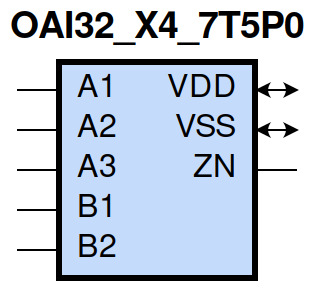
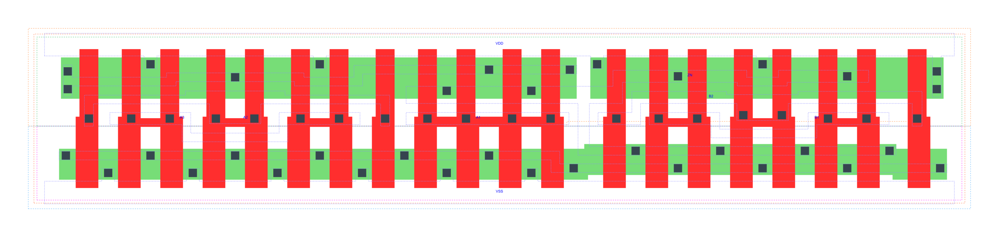

=======================================
gf180mcu_fd_sc_mcu7t5v0__oai32_x4
=======================================

**gf180mcu_fd_sc_mcu7t5v0__oai32_x4 symbol**

**gf180mcu_fd_sc_mcu7t5v0__oai32_x4 schematic**

.. image:: sc7_sch/OAI32_X4_sch.png
    :height: 300px
    :width: 500 px
    :align: center
    :alt: gf180mcu_fd_sc_mcu7t5v0__oai32_x4 schematic

**gf180mcu_fd_sc_mcu7t5v0__oai32_x4 layout**

.. include:: images.rst

OAI32_X4 is a 3-input OR and a 2-input OR into 2-input NAND, NAND[OR(A1,A2,A3),OR(B1,B2)], 4X drive strength

|
| Attributes

============= ======================
**Attribute** **Value**
area          94.393600 µm\ :sup:`2`
============= ======================

|
| OUTPUT FUNCTIONS

============== ===================================
**Output Pin** **Function**
ZN             (((!A1)&(!A2)&(!A3))|((!B1)&(!B2)))
============== ===================================

|
| TRUTH TABLE FOR ZN

====== ====== ====== ====== ====== ======
**A1** **A2** **A3** **B1** **B2** **ZN**
0      0      0      ?      ?      1
?      ?      ?      0      0      1
1      ?      ?      1      ?      0
1      ?      ?      ?      1      0
?      1      ?      1      ?      0
?      1      ?      ?      1      0
?      ?      1      1      ?      0
?      ?      1      ?      1      0
====== ====== ====== ====== ====== ======

|
| FUNCTIONAL SCHEMATIC
| |image578|
| PIN CAPACITANCE (pf)

======= ======== ====================
**Pin** **Type** **Capacitance (pf)**
A2      input    0.0185
A3      input    0.0176
A1      input    0.0175
B2      input    0.0188
B1      input    0.0185
======= ======== ====================

|
| DELAY AND OUTPUT TRANSITION TIME corresponding to min slew and load

+---------------+------------+--------------------+--------------+-------------------+----------------+---------------+
| **Input Pin** | **Output** | **When Condition** | **Tin (ns)** | **Out Load (pf)** | **Delay (ns)** | **Tout (ns)** |
+---------------+------------+--------------------+--------------+-------------------+----------------+---------------+
| A2(HL)        | ZN(LH)     | !A1&!A3&!B1&B2     | 0.0100       | 0.0010            | 0.3974         | 0.3314        |
+---------------+------------+--------------------+--------------+-------------------+----------------+---------------+
| A2(HL)        | ZN(LH)     | !A1&!A3&B1&!B2     | 0.0100       | 0.0010            | 0.3750         | 0.2597        |
+---------------+------------+--------------------+--------------+-------------------+----------------+---------------+
| A2(HL)        | ZN(LH)     | !A1&!A3&B1&B2      | 0.0100       | 0.0010            | 0.4129         | 0.2890        |
+---------------+------------+--------------------+--------------+-------------------+----------------+---------------+
| A2(LH)        | ZN(HL)     | !A1&!A3&!B1&B2     | 0.0100       | 0.0010            | 0.1422         | 0.0707        |
+---------------+------------+--------------------+--------------+-------------------+----------------+---------------+
| A2(LH)        | ZN(HL)     | !A1&!A3&B1&!B2     | 0.0100       | 0.0010            | 0.1172         | 0.0552        |
+---------------+------------+--------------------+--------------+-------------------+----------------+---------------+
| A2(LH)        | ZN(HL)     | !A1&!A3&B1&B2      | 0.0100       | 0.0010            | 0.0973         | 0.0513        |
+---------------+------------+--------------------+--------------+-------------------+----------------+---------------+
| A3(LH)        | ZN(HL)     | !A1&!A2&!B1&B2     | 0.0100       | 0.0010            | 0.1495         | 0.0824        |
+---------------+------------+--------------------+--------------+-------------------+----------------+---------------+
| A3(LH)        | ZN(HL)     | !A1&!A2&B1&!B2     | 0.0100       | 0.0010            | 0.1214         | 0.0655        |
+---------------+------------+--------------------+--------------+-------------------+----------------+---------------+
| A3(LH)        | ZN(HL)     | !A1&!A2&B1&B2      | 0.0100       | 0.0010            | 0.0987         | 0.0592        |
+---------------+------------+--------------------+--------------+-------------------+----------------+---------------+
| A3(HL)        | ZN(LH)     | !A1&!A2&!B1&B2     | 0.0100       | 0.0010            | 0.4235         | 0.3316        |
+---------------+------------+--------------------+--------------+-------------------+----------------+---------------+
| A3(HL)        | ZN(LH)     | !A1&!A2&B1&!B2     | 0.0100       | 0.0010            | 0.4012         | 0.2597        |
+---------------+------------+--------------------+--------------+-------------------+----------------+---------------+
| A3(HL)        | ZN(LH)     | !A1&!A2&B1&B2      | 0.0100       | 0.0010            | 0.4390         | 0.2890        |
+---------------+------------+--------------------+--------------+-------------------+----------------+---------------+
| A1(HL)        | ZN(LH)     | !A2&!A3&!B1&B2     | 0.0100       | 0.0010            | 0.3110         | 0.3308        |
+---------------+------------+--------------------+--------------+-------------------+----------------+---------------+
| A1(HL)        | ZN(LH)     | !A2&!A3&B1&!B2     | 0.0100       | 0.0010            | 0.2885         | 0.2588        |
+---------------+------------+--------------------+--------------+-------------------+----------------+---------------+
| A1(HL)        | ZN(LH)     | !A2&!A3&B1&B2      | 0.0100       | 0.0010            | 0.3263         | 0.2883        |
+---------------+------------+--------------------+--------------+-------------------+----------------+---------------+
| A1(LH)        | ZN(HL)     | !A2&!A3&!B1&B2     | 0.0100       | 0.0010            | 0.1144         | 0.0515        |
+---------------+------------+--------------------+--------------+-------------------+----------------+---------------+
| A1(LH)        | ZN(HL)     | !A2&!A3&B1&!B2     | 0.0100       | 0.0010            | 0.0932         | 0.0370        |
+---------------+------------+--------------------+--------------+-------------------+----------------+---------------+
| A1(LH)        | ZN(HL)     | !A2&!A3&B1&B2      | 0.0100       | 0.0010            | 0.0800         | 0.0369        |
+---------------+------------+--------------------+--------------+-------------------+----------------+---------------+
| B2(HL)        | ZN(LH)     | !A1&!A2&A3&!B1     | 0.0100       | 0.0010            | 0.1466         | 0.1497        |
+---------------+------------+--------------------+--------------+-------------------+----------------+---------------+
| B2(HL)        | ZN(LH)     | !A1&A2&!A3&!B1     | 0.0100       | 0.0010            | 0.1467         | 0.1363        |
+---------------+------------+--------------------+--------------+-------------------+----------------+---------------+
| B2(HL)        | ZN(LH)     | !A1&A2&A3&!B1      | 0.0100       | 0.0010            | 0.1458         | 0.1362        |
+---------------+------------+--------------------+--------------+-------------------+----------------+---------------+
| B2(HL)        | ZN(LH)     | A1&!A2&!A3&!B1     | 0.0100       | 0.0010            | 0.1377         | 0.0837        |
+---------------+------------+--------------------+--------------+-------------------+----------------+---------------+
| B2(HL)        | ZN(LH)     | A1&!A2&A3&!B1      | 0.0100       | 0.0010            | 0.1368         | 0.0836        |
+---------------+------------+--------------------+--------------+-------------------+----------------+---------------+
| B2(HL)        | ZN(LH)     | A1&A2&!A3&!B1      | 0.0100       | 0.0010            | 0.1368         | 0.0837        |
+---------------+------------+--------------------+--------------+-------------------+----------------+---------------+
| B2(HL)        | ZN(LH)     | A1&A2&A3&!B1       | 0.0100       | 0.0010            | 0.1363         | 0.0837        |
+---------------+------------+--------------------+--------------+-------------------+----------------+---------------+
| B2(LH)        | ZN(HL)     | !A1&!A2&A3&!B1     | 0.0100       | 0.0010            | 0.1114         | 0.0816        |
+---------------+------------+--------------------+--------------+-------------------+----------------+---------------+
| B2(LH)        | ZN(HL)     | !A1&A2&!A3&!B1     | 0.0100       | 0.0010            | 0.1020         | 0.0707        |
+---------------+------------+--------------------+--------------+-------------------+----------------+---------------+
| B2(LH)        | ZN(HL)     | !A1&A2&A3&!B1      | 0.0100       | 0.0010            | 0.0847         | 0.0541        |
+---------------+------------+--------------------+--------------+-------------------+----------------+---------------+
| B2(LH)        | ZN(HL)     | A1&!A2&!A3&!B1     | 0.0100       | 0.0010            | 0.0739         | 0.0513        |
+---------------+------------+--------------------+--------------+-------------------+----------------+---------------+
| B2(LH)        | ZN(HL)     | A1&!A2&A3&!B1      | 0.0100       | 0.0010            | 0.0630         | 0.0396        |
+---------------+------------+--------------------+--------------+-------------------+----------------+---------------+
| B2(LH)        | ZN(HL)     | A1&A2&!A3&!B1      | 0.0100       | 0.0010            | 0.0630         | 0.0395        |
+---------------+------------+--------------------+--------------+-------------------+----------------+---------------+
| B2(LH)        | ZN(HL)     | A1&A2&A3&!B1       | 0.0100       | 0.0010            | 0.0595         | 0.0364        |
+---------------+------------+--------------------+--------------+-------------------+----------------+---------------+
| B1(HL)        | ZN(LH)     | !A1&!A2&A3&!B2     | 0.0100       | 0.0010            | 0.1190         | 0.1491        |
+---------------+------------+--------------------+--------------+-------------------+----------------+---------------+
| B1(HL)        | ZN(LH)     | !A1&A2&!A3&!B2     | 0.0100       | 0.0010            | 0.1190         | 0.1358        |
+---------------+------------+--------------------+--------------+-------------------+----------------+---------------+
| B1(HL)        | ZN(LH)     | !A1&A2&A3&!B2      | 0.0100       | 0.0010            | 0.1181         | 0.1359        |
+---------------+------------+--------------------+--------------+-------------------+----------------+---------------+
| B1(HL)        | ZN(LH)     | A1&!A2&!A3&!B2     | 0.0100       | 0.0010            | 0.1101         | 0.0832        |
+---------------+------------+--------------------+--------------+-------------------+----------------+---------------+
| B1(HL)        | ZN(LH)     | A1&!A2&A3&!B2      | 0.0100       | 0.0010            | 0.1091         | 0.0832        |
+---------------+------------+--------------------+--------------+-------------------+----------------+---------------+
| B1(HL)        | ZN(LH)     | A1&A2&!A3&!B2      | 0.0100       | 0.0010            | 0.1092         | 0.0832        |
+---------------+------------+--------------------+--------------+-------------------+----------------+---------------+
| B1(HL)        | ZN(LH)     | A1&A2&A3&!B2       | 0.0100       | 0.0010            | 0.1086         | 0.0832        |
+---------------+------------+--------------------+--------------+-------------------+----------------+---------------+
| B1(LH)        | ZN(HL)     | !A1&!A2&A3&!B2     | 0.0100       | 0.0010            | 0.0849         | 0.0644        |
+---------------+------------+--------------------+--------------+-------------------+----------------+---------------+
| B1(LH)        | ZN(HL)     | !A1&A2&!A3&!B2     | 0.0100       | 0.0010            | 0.0790         | 0.0545        |
+---------------+------------+--------------------+--------------+-------------------+----------------+---------------+
| B1(LH)        | ZN(HL)     | !A1&A2&A3&!B2      | 0.0100       | 0.0010            | 0.0668         | 0.0415        |
+---------------+------------+--------------------+--------------+-------------------+----------------+---------------+
| B1(LH)        | ZN(HL)     | A1&!A2&!A3&!B2     | 0.0100       | 0.0010            | 0.0554         | 0.0350        |
+---------------+------------+--------------------+--------------+-------------------+----------------+---------------+
| B1(LH)        | ZN(HL)     | A1&!A2&A3&!B2      | 0.0100       | 0.0010            | 0.0490         | 0.0275        |
+---------------+------------+--------------------+--------------+-------------------+----------------+---------------+
| B1(LH)        | ZN(HL)     | A1&A2&!A3&!B2      | 0.0100       | 0.0010            | 0.0490         | 0.0275        |
+---------------+------------+--------------------+--------------+-------------------+----------------+---------------+
| B1(LH)        | ZN(HL)     | A1&A2&A3&!B2       | 0.0100       | 0.0010            | 0.0467         | 0.0255        |
+---------------+------------+--------------------+--------------+-------------------+----------------+---------------+

|
| DYNAMIC ENERGY

+---------------+--------------------+--------------+------------+-------------------+---------------------+
| **Input Pin** | **When Condition** | **Tin (ns)** | **Output** | **Out Load (pf)** | **Energy (uW/MHz)** |
+---------------+--------------------+--------------+------------+-------------------+---------------------+
| A1            | !A2&!A3&!B1&B2     | 0.0100       | ZN(LH)     | 0.0010            | 1.0622              |
+---------------+--------------------+--------------+------------+-------------------+---------------------+
| A1            | !A2&!A3&B1&!B2     | 0.0100       | ZN(LH)     | 0.0010            | 0.9546              |
+---------------+--------------------+--------------+------------+-------------------+---------------------+
| A1            | !A2&!A3&B1&B2      | 0.0100       | ZN(LH)     | 0.0010            | 1.0444              |
+---------------+--------------------+--------------+------------+-------------------+---------------------+
| B2            | !A1&!A2&A3&!B1     | 0.0100       | ZN(LH)     | 0.0010            | 0.8953              |
+---------------+--------------------+--------------+------------+-------------------+---------------------+
| B2            | !A1&A2&!A3&!B1     | 0.0100       | ZN(LH)     | 0.0010            | 0.7902              |
+---------------+--------------------+--------------+------------+-------------------+---------------------+
| B2            | !A1&A2&A3&!B1      | 0.0100       | ZN(LH)     | 0.0010            | 0.7877              |
+---------------+--------------------+--------------+------------+-------------------+---------------------+
| B2            | A1&!A2&!A3&!B1     | 0.0100       | ZN(LH)     | 0.0010            | 0.6172              |
+---------------+--------------------+--------------+------------+-------------------+---------------------+
| B2            | A1&!A2&A3&!B1      | 0.0100       | ZN(LH)     | 0.0010            | 0.6146              |
+---------------+--------------------+--------------+------------+-------------------+---------------------+
| B2            | A1&A2&!A3&!B1      | 0.0100       | ZN(LH)     | 0.0010            | 0.6147              |
+---------------+--------------------+--------------+------------+-------------------+---------------------+
| B2            | A1&A2&A3&!B1       | 0.0100       | ZN(LH)     | 0.0010            | 0.6133              |
+---------------+--------------------+--------------+------------+-------------------+---------------------+
| B1            | !A1&!A2&A3&!B2     | 0.0100       | ZN(LH)     | 0.0010            | 0.7871              |
+---------------+--------------------+--------------+------------+-------------------+---------------------+
| B1            | !A1&A2&!A3&!B2     | 0.0100       | ZN(LH)     | 0.0010            | 0.6821              |
+---------------+--------------------+--------------+------------+-------------------+---------------------+
| B1            | !A1&A2&A3&!B2      | 0.0100       | ZN(LH)     | 0.0010            | 0.6792              |
+---------------+--------------------+--------------+------------+-------------------+---------------------+
| B1            | A1&!A2&!A3&!B2     | 0.0100       | ZN(LH)     | 0.0010            | 0.5088              |
+---------------+--------------------+--------------+------------+-------------------+---------------------+
| B1            | A1&!A2&A3&!B2      | 0.0100       | ZN(LH)     | 0.0010            | 0.5061              |
+---------------+--------------------+--------------+------------+-------------------+---------------------+
| B1            | A1&A2&!A3&!B2      | 0.0100       | ZN(LH)     | 0.0010            | 0.5062              |
+---------------+--------------------+--------------+------------+-------------------+---------------------+
| B1            | A1&A2&A3&!B2       | 0.0100       | ZN(LH)     | 0.0010            | 0.5046              |
+---------------+--------------------+--------------+------------+-------------------+---------------------+
| A2            | !A1&!A3&!B1&B2     | 0.0100       | ZN(LH)     | 0.0010            | 1.2351              |
+---------------+--------------------+--------------+------------+-------------------+---------------------+
| A2            | !A1&!A3&B1&!B2     | 0.0100       | ZN(LH)     | 0.0010            | 1.1276              |
+---------------+--------------------+--------------+------------+-------------------+---------------------+
| A2            | !A1&!A3&B1&B2      | 0.0100       | ZN(LH)     | 0.0010            | 1.2177              |
+---------------+--------------------+--------------+------------+-------------------+---------------------+
| B1            | !A1&!A2&A3&!B2     | 0.0100       | ZN(HL)     | 0.0010            | 0.2258              |
+---------------+--------------------+--------------+------------+-------------------+---------------------+
| B1            | !A1&A2&!A3&!B2     | 0.0100       | ZN(HL)     | 0.0010            | 0.1263              |
+---------------+--------------------+--------------+------------+-------------------+---------------------+
| B1            | !A1&A2&A3&!B2      | 0.0100       | ZN(HL)     | 0.0010            | 0.1262              |
+---------------+--------------------+--------------+------------+-------------------+---------------------+
| B1            | A1&!A2&!A3&!B2     | 0.0100       | ZN(HL)     | 0.0010            | 0.0184              |
+---------------+--------------------+--------------+------------+-------------------+---------------------+
| B1            | A1&!A2&A3&!B2      | 0.0100       | ZN(HL)     | 0.0010            | 0.0185              |
+---------------+--------------------+--------------+------------+-------------------+---------------------+
| B1            | A1&A2&!A3&!B2      | 0.0100       | ZN(HL)     | 0.0010            | 0.0184              |
+---------------+--------------------+--------------+------------+-------------------+---------------------+
| B1            | A1&A2&A3&!B2       | 0.0100       | ZN(HL)     | 0.0010            | 0.0184              |
+---------------+--------------------+--------------+------------+-------------------+---------------------+
| A3            | !A1&!A2&!B1&B2     | 0.0100       | ZN(HL)     | 0.0010            | 0.3162              |
+---------------+--------------------+--------------+------------+-------------------+---------------------+
| A3            | !A1&!A2&B1&!B2     | 0.0100       | ZN(HL)     | 0.0010            | 0.2140              |
+---------------+--------------------+--------------+------------+-------------------+---------------------+
| A3            | !A1&!A2&B1&B2      | 0.0100       | ZN(HL)     | 0.0010            | 0.2140              |
+---------------+--------------------+--------------+------------+-------------------+---------------------+
| A1            | !A2&!A3&!B1&B2     | 0.0100       | ZN(HL)     | 0.0010            | 0.1219              |
+---------------+--------------------+--------------+------------+-------------------+---------------------+
| A1            | !A2&!A3&B1&!B2     | 0.0100       | ZN(HL)     | 0.0010            | 0.0169              |
+---------------+--------------------+--------------+------------+-------------------+---------------------+
| A1            | !A2&!A3&B1&B2      | 0.0100       | ZN(HL)     | 0.0010            | 0.0171              |
+---------------+--------------------+--------------+------------+-------------------+---------------------+
| B2            | !A1&!A2&A3&!B1     | 0.0100       | ZN(HL)     | 0.0010            | 0.3177              |
+---------------+--------------------+--------------+------------+-------------------+---------------------+
| B2            | !A1&A2&!A3&!B1     | 0.0100       | ZN(HL)     | 0.0010            | 0.2184              |
+---------------+--------------------+--------------+------------+-------------------+---------------------+
| B2            | !A1&A2&A3&!B1      | 0.0100       | ZN(HL)     | 0.0010            | 0.2187              |
+---------------+--------------------+--------------+------------+-------------------+---------------------+
| B2            | A1&!A2&!A3&!B1     | 0.0100       | ZN(HL)     | 0.0010            | 0.1124              |
+---------------+--------------------+--------------+------------+-------------------+---------------------+
| B2            | A1&!A2&A3&!B1      | 0.0100       | ZN(HL)     | 0.0010            | 0.1124              |
+---------------+--------------------+--------------+------------+-------------------+---------------------+
| B2            | A1&A2&!A3&!B1      | 0.0100       | ZN(HL)     | 0.0010            | 0.1125              |
+---------------+--------------------+--------------+------------+-------------------+---------------------+
| B2            | A1&A2&A3&!B1       | 0.0100       | ZN(HL)     | 0.0010            | 0.1125              |
+---------------+--------------------+--------------+------------+-------------------+---------------------+
| A2            | !A1&!A3&!B1&B2     | 0.0100       | ZN(HL)     | 0.0010            | 0.2267              |
+---------------+--------------------+--------------+------------+-------------------+---------------------+
| A2            | !A1&!A3&B1&!B2     | 0.0100       | ZN(HL)     | 0.0010            | 0.1245              |
+---------------+--------------------+--------------+------------+-------------------+---------------------+
| A2            | !A1&!A3&B1&B2      | 0.0100       | ZN(HL)     | 0.0010            | 0.1241              |
+---------------+--------------------+--------------+------------+-------------------+---------------------+
| A3            | !A1&!A2&!B1&B2     | 0.0100       | ZN(LH)     | 0.0010            | 1.3406              |
+---------------+--------------------+--------------+------------+-------------------+---------------------+
| A3            | !A1&!A2&B1&!B2     | 0.0100       | ZN(LH)     | 0.0010            | 1.2333              |
+---------------+--------------------+--------------+------------+-------------------+---------------------+
| A3            | !A1&!A2&B1&B2      | 0.0100       | ZN(LH)     | 0.0010            | 1.3228              |
+---------------+--------------------+--------------+------------+-------------------+---------------------+
| A3(LH)        | !A1&!A2&!B1&!B2    | 0.0100       | n/a        | n/a               | -0.1402             |
+---------------+--------------------+--------------+------------+-------------------+---------------------+
| A3(LH)        | !A1&A2&!B1&!B2     | 0.0100       | n/a        | n/a               | -0.1360             |
+---------------+--------------------+--------------+------------+-------------------+---------------------+
| A3(LH)        | A1&!A2&!B1&!B2     | 0.0100       | n/a        | n/a               | -0.1162             |
+---------------+--------------------+--------------+------------+-------------------+---------------------+
| A3(LH)        | A1&A2&!B1&!B2      | 0.0100       | n/a        | n/a               | -0.1303             |
+---------------+--------------------+--------------+------------+-------------------+---------------------+
| A3(LH)        | !A1&A2&!B1&B2      | 0.0100       | n/a        | n/a               | -0.1224             |
+---------------+--------------------+--------------+------------+-------------------+---------------------+
| A3(LH)        | !A1&A2&B1&!B2      | 0.0100       | n/a        | n/a               | -0.1225             |
+---------------+--------------------+--------------+------------+-------------------+---------------------+
| A3(LH)        | !A1&A2&B1&B2       | 0.0100       | n/a        | n/a               | -0.1224             |
+---------------+--------------------+--------------+------------+-------------------+---------------------+
| A3(LH)        | A1&!A2&!B1&B2      | 0.0100       | n/a        | n/a               | -0.1151             |
+---------------+--------------------+--------------+------------+-------------------+---------------------+
| A3(LH)        | A1&!A2&B1&!B2      | 0.0100       | n/a        | n/a               | -0.1151             |
+---------------+--------------------+--------------+------------+-------------------+---------------------+
| A3(LH)        | A1&!A2&B1&B2       | 0.0100       | n/a        | n/a               | -0.1151             |
+---------------+--------------------+--------------+------------+-------------------+---------------------+
| A3(LH)        | A1&A2&!B1&B2       | 0.0100       | n/a        | n/a               | -0.1303             |
+---------------+--------------------+--------------+------------+-------------------+---------------------+
| A3(LH)        | A1&A2&B1&!B2       | 0.0100       | n/a        | n/a               | -0.1303             |
+---------------+--------------------+--------------+------------+-------------------+---------------------+
| A3(LH)        | A1&A2&B1&B2        | 0.0100       | n/a        | n/a               | -0.1303             |
+---------------+--------------------+--------------+------------+-------------------+---------------------+
| A1(LH)        | !A2&!A3&!B1&!B2    | 0.0100       | n/a        | n/a               | -0.1414             |
+---------------+--------------------+--------------+------------+-------------------+---------------------+
| A1(LH)        | !A2&A3&!B1&!B2     | 0.0100       | n/a        | n/a               | -0.1166             |
+---------------+--------------------+--------------+------------+-------------------+---------------------+
| A1(LH)        | A2&!A3&!B1&!B2     | 0.0100       | n/a        | n/a               | -0.1292             |
+---------------+--------------------+--------------+------------+-------------------+---------------------+
| A1(LH)        | A2&A3&!B1&!B2      | 0.0100       | n/a        | n/a               | -0.1263             |
+---------------+--------------------+--------------+------------+-------------------+---------------------+
| A1(LH)        | !A2&A3&!B1&B2      | 0.0100       | n/a        | n/a               | -0.0370             |
+---------------+--------------------+--------------+------------+-------------------+---------------------+
| A1(LH)        | !A2&A3&B1&!B2      | 0.0100       | n/a        | n/a               | -0.0370             |
+---------------+--------------------+--------------+------------+-------------------+---------------------+
| A1(LH)        | !A2&A3&B1&B2       | 0.0100       | n/a        | n/a               | -0.0370             |
+---------------+--------------------+--------------+------------+-------------------+---------------------+
| A1(LH)        | A2&!A3&!B1&B2      | 0.0100       | n/a        | n/a               | -0.0361             |
+---------------+--------------------+--------------+------------+-------------------+---------------------+
| A1(LH)        | A2&!A3&B1&!B2      | 0.0100       | n/a        | n/a               | -0.0361             |
+---------------+--------------------+--------------+------------+-------------------+---------------------+
| A1(LH)        | A2&!A3&B1&B2       | 0.0100       | n/a        | n/a               | -0.0361             |
+---------------+--------------------+--------------+------------+-------------------+---------------------+
| A1(LH)        | A2&A3&!B1&B2       | 0.0100       | n/a        | n/a               | -0.0361             |
+---------------+--------------------+--------------+------------+-------------------+---------------------+
| A1(LH)        | A2&A3&B1&!B2       | 0.0100       | n/a        | n/a               | -0.0361             |
+---------------+--------------------+--------------+------------+-------------------+---------------------+
| A1(LH)        | A2&A3&B1&B2        | 0.0100       | n/a        | n/a               | -0.0361             |
+---------------+--------------------+--------------+------------+-------------------+---------------------+
| A2(LH)        | !A1&!A3&!B1&!B2    | 0.0100       | n/a        | n/a               | -0.1411             |
+---------------+--------------------+--------------+------------+-------------------+---------------------+
| A2(LH)        | !A1&A3&!B1&!B2     | 0.0100       | n/a        | n/a               | -0.1369             |
+---------------+--------------------+--------------+------------+-------------------+---------------------+
| A2(LH)        | A1&!A3&!B1&!B2     | 0.0100       | n/a        | n/a               | -0.1283             |
+---------------+--------------------+--------------+------------+-------------------+---------------------+
| A2(LH)        | A1&A3&!B1&!B2      | 0.0100       | n/a        | n/a               | -0.1219             |
+---------------+--------------------+--------------+------------+-------------------+---------------------+
| A2(LH)        | !A1&A3&!B1&B2      | 0.0100       | n/a        | n/a               | -0.0440             |
+---------------+--------------------+--------------+------------+-------------------+---------------------+
| A2(LH)        | !A1&A3&B1&!B2      | 0.0100       | n/a        | n/a               | -0.0440             |
+---------------+--------------------+--------------+------------+-------------------+---------------------+
| A2(LH)        | !A1&A3&B1&B2       | 0.0100       | n/a        | n/a               | -0.0440             |
+---------------+--------------------+--------------+------------+-------------------+---------------------+
| A2(LH)        | A1&!A3&!B1&B2      | 0.0100       | n/a        | n/a               | -0.1078             |
+---------------+--------------------+--------------+------------+-------------------+---------------------+
| A2(LH)        | A1&!A3&B1&!B2      | 0.0100       | n/a        | n/a               | -0.1078             |
+---------------+--------------------+--------------+------------+-------------------+---------------------+
| A2(LH)        | A1&!A3&B1&B2       | 0.0100       | n/a        | n/a               | -0.1078             |
+---------------+--------------------+--------------+------------+-------------------+---------------------+
| A2(LH)        | A1&A3&!B1&B2       | 0.0100       | n/a        | n/a               | -0.0918             |
+---------------+--------------------+--------------+------------+-------------------+---------------------+
| A2(LH)        | A1&A3&B1&!B2       | 0.0100       | n/a        | n/a               | -0.0917             |
+---------------+--------------------+--------------+------------+-------------------+---------------------+
| A2(LH)        | A1&A3&B1&B2        | 0.0100       | n/a        | n/a               | -0.0917             |
+---------------+--------------------+--------------+------------+-------------------+---------------------+
| A3(HL)        | !A1&!A2&!B1&!B2    | 0.0100       | n/a        | n/a               | 0.1527              |
+---------------+--------------------+--------------+------------+-------------------+---------------------+
| A3(HL)        | !A1&A2&!B1&!B2     | 0.0100       | n/a        | n/a               | 0.1407              |
+---------------+--------------------+--------------+------------+-------------------+---------------------+
| A3(HL)        | A1&!A2&!B1&!B2     | 0.0100       | n/a        | n/a               | 0.1409              |
+---------------+--------------------+--------------+------------+-------------------+---------------------+
| A3(HL)        | A1&A2&!B1&!B2      | 0.0100       | n/a        | n/a               | 0.1408              |
+---------------+--------------------+--------------+------------+-------------------+---------------------+
| A3(HL)        | !A1&A2&!B1&B2      | 0.0100       | n/a        | n/a               | 0.1408              |
+---------------+--------------------+--------------+------------+-------------------+---------------------+
| A3(HL)        | !A1&A2&B1&!B2      | 0.0100       | n/a        | n/a               | 0.1408              |
+---------------+--------------------+--------------+------------+-------------------+---------------------+
| A3(HL)        | !A1&A2&B1&B2       | 0.0100       | n/a        | n/a               | 0.1408              |
+---------------+--------------------+--------------+------------+-------------------+---------------------+
| A3(HL)        | A1&!A2&!B1&B2      | 0.0100       | n/a        | n/a               | 0.1409              |
+---------------+--------------------+--------------+------------+-------------------+---------------------+
| A3(HL)        | A1&!A2&B1&!B2      | 0.0100       | n/a        | n/a               | 0.1409              |
+---------------+--------------------+--------------+------------+-------------------+---------------------+
| A3(HL)        | A1&!A2&B1&B2       | 0.0100       | n/a        | n/a               | 0.1409              |
+---------------+--------------------+--------------+------------+-------------------+---------------------+
| A3(HL)        | A1&A2&!B1&B2       | 0.0100       | n/a        | n/a               | 0.1406              |
+---------------+--------------------+--------------+------------+-------------------+---------------------+
| A3(HL)        | A1&A2&B1&!B2       | 0.0100       | n/a        | n/a               | 0.1406              |
+---------------+--------------------+--------------+------------+-------------------+---------------------+
| A3(HL)        | A1&A2&B1&B2        | 0.0100       | n/a        | n/a               | 0.1407              |
+---------------+--------------------+--------------+------------+-------------------+---------------------+
| A2(HL)        | !A1&!A3&!B1&!B2    | 0.0100       | n/a        | n/a               | 0.1530              |
+---------------+--------------------+--------------+------------+-------------------+---------------------+
| A2(HL)        | !A1&A3&!B1&!B2     | 0.0100       | n/a        | n/a               | 0.1407              |
+---------------+--------------------+--------------+------------+-------------------+---------------------+
| A2(HL)        | A1&!A3&!B1&!B2     | 0.0100       | n/a        | n/a               | 0.1412              |
+---------------+--------------------+--------------+------------+-------------------+---------------------+
| A2(HL)        | A1&A3&!B1&!B2      | 0.0100       | n/a        | n/a               | 0.0771              |
+---------------+--------------------+--------------+------------+-------------------+---------------------+
| A2(HL)        | !A1&A3&!B1&B2      | 0.0100       | n/a        | n/a               | 0.1012              |
+---------------+--------------------+--------------+------------+-------------------+---------------------+
| A2(HL)        | !A1&A3&B1&!B2      | 0.0100       | n/a        | n/a               | 0.1012              |
+---------------+--------------------+--------------+------------+-------------------+---------------------+
| A2(HL)        | !A1&A3&B1&B2       | 0.0100       | n/a        | n/a               | 0.1012              |
+---------------+--------------------+--------------+------------+-------------------+---------------------+
| A2(HL)        | A1&!A3&!B1&B2      | 0.0100       | n/a        | n/a               | 0.1411              |
+---------------+--------------------+--------------+------------+-------------------+---------------------+
| A2(HL)        | A1&!A3&B1&!B2      | 0.0100       | n/a        | n/a               | 0.1411              |
+---------------+--------------------+--------------+------------+-------------------+---------------------+
| A2(HL)        | A1&!A3&B1&B2       | 0.0100       | n/a        | n/a               | 0.1411              |
+---------------+--------------------+--------------+------------+-------------------+---------------------+
| A2(HL)        | A1&A3&!B1&B2       | 0.0100       | n/a        | n/a               | 0.0771              |
+---------------+--------------------+--------------+------------+-------------------+---------------------+
| A2(HL)        | A1&A3&B1&!B2       | 0.0100       | n/a        | n/a               | 0.0771              |
+---------------+--------------------+--------------+------------+-------------------+---------------------+
| A2(HL)        | A1&A3&B1&B2        | 0.0100       | n/a        | n/a               | 0.0771              |
+---------------+--------------------+--------------+------------+-------------------+---------------------+
| B1(HL)        | !A1&!A2&!A3&!B2    | 0.0100       | n/a        | n/a               | 0.1595              |
+---------------+--------------------+--------------+------------+-------------------+---------------------+
| B1(HL)        | !A1&!A2&!A3&B2     | 0.0100       | n/a        | n/a               | 0.1610              |
+---------------+--------------------+--------------+------------+-------------------+---------------------+
| B1(HL)        | !A1&!A2&A3&B2      | 0.0100       | n/a        | n/a               | 0.1095              |
+---------------+--------------------+--------------+------------+-------------------+---------------------+
| B1(HL)        | !A1&A2&!A3&B2      | 0.0100       | n/a        | n/a               | 0.1094              |
+---------------+--------------------+--------------+------------+-------------------+---------------------+
| B1(HL)        | !A1&A2&A3&B2       | 0.0100       | n/a        | n/a               | 0.1094              |
+---------------+--------------------+--------------+------------+-------------------+---------------------+
| B1(HL)        | A1&!A2&!A3&B2      | 0.0100       | n/a        | n/a               | 0.1094              |
+---------------+--------------------+--------------+------------+-------------------+---------------------+
| B1(HL)        | A1&!A2&A3&B2       | 0.0100       | n/a        | n/a               | 0.1094              |
+---------------+--------------------+--------------+------------+-------------------+---------------------+
| B1(HL)        | A1&A2&!A3&B2       | 0.0100       | n/a        | n/a               | 0.1094              |
+---------------+--------------------+--------------+------------+-------------------+---------------------+
| B1(HL)        | A1&A2&A3&B2        | 0.0100       | n/a        | n/a               | 0.1094              |
+---------------+--------------------+--------------+------------+-------------------+---------------------+
| B2(LH)        | !A1&!A2&!A3&!B1    | 0.0100       | n/a        | n/a               | 0.1839              |
+---------------+--------------------+--------------+------------+-------------------+---------------------+
| B2(LH)        | !A1&!A2&!A3&B1     | 0.0100       | n/a        | n/a               | -0.1542             |
+---------------+--------------------+--------------+------------+-------------------+---------------------+
| B2(LH)        | !A1&!A2&A3&B1      | 0.0100       | n/a        | n/a               | -0.1171             |
+---------------+--------------------+--------------+------------+-------------------+---------------------+
| B2(LH)        | !A1&A2&!A3&B1      | 0.0100       | n/a        | n/a               | -0.1171             |
+---------------+--------------------+--------------+------------+-------------------+---------------------+
| B2(LH)        | !A1&A2&A3&B1       | 0.0100       | n/a        | n/a               | -0.1171             |
+---------------+--------------------+--------------+------------+-------------------+---------------------+
| B2(LH)        | A1&!A2&!A3&B1      | 0.0100       | n/a        | n/a               | -0.1171             |
+---------------+--------------------+--------------+------------+-------------------+---------------------+
| B2(LH)        | A1&!A2&A3&B1       | 0.0100       | n/a        | n/a               | -0.1171             |
+---------------+--------------------+--------------+------------+-------------------+---------------------+
| B2(LH)        | A1&A2&!A3&B1       | 0.0100       | n/a        | n/a               | -0.1171             |
+---------------+--------------------+--------------+------------+-------------------+---------------------+
| B2(LH)        | A1&A2&A3&B1        | 0.0100       | n/a        | n/a               | -0.1171             |
+---------------+--------------------+--------------+------------+-------------------+---------------------+
| B2(HL)        | !A1&!A2&!A3&!B1    | 0.0100       | n/a        | n/a               | 0.1591              |
+---------------+--------------------+--------------+------------+-------------------+---------------------+
| B2(HL)        | !A1&!A2&!A3&B1     | 0.0100       | n/a        | n/a               | 0.1609              |
+---------------+--------------------+--------------+------------+-------------------+---------------------+
| B2(HL)        | !A1&!A2&A3&B1      | 0.0100       | n/a        | n/a               | 0.1406              |
+---------------+--------------------+--------------+------------+-------------------+---------------------+
| B2(HL)        | !A1&A2&!A3&B1      | 0.0100       | n/a        | n/a               | 0.1406              |
+---------------+--------------------+--------------+------------+-------------------+---------------------+
| B2(HL)        | !A1&A2&A3&B1       | 0.0100       | n/a        | n/a               | 0.1406              |
+---------------+--------------------+--------------+------------+-------------------+---------------------+
| B2(HL)        | A1&!A2&!A3&B1      | 0.0100       | n/a        | n/a               | 0.1406              |
+---------------+--------------------+--------------+------------+-------------------+---------------------+
| B2(HL)        | A1&!A2&A3&B1       | 0.0100       | n/a        | n/a               | 0.1406              |
+---------------+--------------------+--------------+------------+-------------------+---------------------+
| B2(HL)        | A1&A2&!A3&B1       | 0.0100       | n/a        | n/a               | 0.1406              |
+---------------+--------------------+--------------+------------+-------------------+---------------------+
| B2(HL)        | A1&A2&A3&B1        | 0.0100       | n/a        | n/a               | 0.1406              |
+---------------+--------------------+--------------+------------+-------------------+---------------------+
| A1(HL)        | !A2&!A3&!B1&!B2    | 0.0100       | n/a        | n/a               | 0.1533              |
+---------------+--------------------+--------------+------------+-------------------+---------------------+
| A1(HL)        | !A2&A3&!B1&!B2     | 0.0100       | n/a        | n/a               | 0.1415              |
+---------------+--------------------+--------------+------------+-------------------+---------------------+
| A1(HL)        | A2&!A3&!B1&!B2     | 0.0100       | n/a        | n/a               | 0.1415              |
+---------------+--------------------+--------------+------------+-------------------+---------------------+
| A1(HL)        | A2&A3&!B1&!B2      | 0.0100       | n/a        | n/a               | 0.1415              |
+---------------+--------------------+--------------+------------+-------------------+---------------------+
| A1(HL)        | !A2&A3&!B1&B2      | 0.0100       | n/a        | n/a               | 0.2120              |
+---------------+--------------------+--------------+------------+-------------------+---------------------+
| A1(HL)        | !A2&A3&B1&!B2      | 0.0100       | n/a        | n/a               | 0.2120              |
+---------------+--------------------+--------------+------------+-------------------+---------------------+
| A1(HL)        | !A2&A3&B1&B2       | 0.0100       | n/a        | n/a               | 0.2121              |
+---------------+--------------------+--------------+------------+-------------------+---------------------+
| A1(HL)        | A2&!A3&!B1&B2      | 0.0100       | n/a        | n/a               | 0.1123              |
+---------------+--------------------+--------------+------------+-------------------+---------------------+
| A1(HL)        | A2&!A3&B1&!B2      | 0.0100       | n/a        | n/a               | 0.1123              |
+---------------+--------------------+--------------+------------+-------------------+---------------------+
| A1(HL)        | A2&!A3&B1&B2       | 0.0100       | n/a        | n/a               | 0.1122              |
+---------------+--------------------+--------------+------------+-------------------+---------------------+
| A1(HL)        | A2&A3&!B1&B2       | 0.0100       | n/a        | n/a               | 0.1122              |
+---------------+--------------------+--------------+------------+-------------------+---------------------+
| A1(HL)        | A2&A3&B1&!B2       | 0.0100       | n/a        | n/a               | 0.1122              |
+---------------+--------------------+--------------+------------+-------------------+---------------------+
| A1(HL)        | A2&A3&B1&B2        | 0.0100       | n/a        | n/a               | 0.1123              |
+---------------+--------------------+--------------+------------+-------------------+---------------------+
| B1(LH)        | !A1&!A2&!A3&!B2    | 0.0100       | n/a        | n/a               | 0.1825              |
+---------------+--------------------+--------------+------------+-------------------+---------------------+
| B1(LH)        | !A1&!A2&!A3&B2     | 0.0100       | n/a        | n/a               | -0.1554             |
+---------------+--------------------+--------------+------------+-------------------+---------------------+
| B1(LH)        | !A1&!A2&A3&B2      | 0.0100       | n/a        | n/a               | -0.0403             |
+---------------+--------------------+--------------+------------+-------------------+---------------------+
| B1(LH)        | !A1&A2&!A3&B2      | 0.0100       | n/a        | n/a               | -0.0403             |
+---------------+--------------------+--------------+------------+-------------------+---------------------+
| B1(LH)        | !A1&A2&A3&B2       | 0.0100       | n/a        | n/a               | -0.0404             |
+---------------+--------------------+--------------+------------+-------------------+---------------------+
| B1(LH)        | A1&!A2&!A3&B2      | 0.0100       | n/a        | n/a               | -0.0403             |
+---------------+--------------------+--------------+------------+-------------------+---------------------+
| B1(LH)        | A1&!A2&A3&B2       | 0.0100       | n/a        | n/a               | -0.0404             |
+---------------+--------------------+--------------+------------+-------------------+---------------------+
| B1(LH)        | A1&A2&!A3&B2       | 0.0100       | n/a        | n/a               | -0.0404             |
+---------------+--------------------+--------------+------------+-------------------+---------------------+
| B1(LH)        | A1&A2&A3&B2        | 0.0100       | n/a        | n/a               | -0.0403             |
+---------------+--------------------+--------------+------------+-------------------+---------------------+

|
| LEAKAGE POWER

=================== ==============
**When Condition**  **Power (nW)**
!A1&!A2&!A3&!B1&!B2 0.2519
!A1&!A2&!A3&!B1&B2  0.6525
!A1&!A2&!A3&B1&!B2  0.6525
!A1&!A2&!A3&B1&B2   0.6545
!A1&!A2&A3&!B1&!B2  0.2536
!A1&A2&!A3&!B1&!B2  0.2536
!A1&A2&A3&!B1&!B2   0.2536
A1&!A2&!A3&!B1&!B2  0.2536
A1&!A2&A3&!B1&!B2   0.2537
A1&A2&!A3&!B1&!B2   0.2537
A1&A2&A3&!B1&!B2    0.2537
!A1&!A2&A3&!B1&B2   0.6883
!A1&!A2&A3&B1&!B2   0.5455
!A1&!A2&A3&B1&B2    0.5455
!A1&A2&!A3&!B1&B2   0.5468
!A1&A2&!A3&B1&!B2   0.4041
!A1&A2&!A3&B1&B2    0.4041
!A1&A2&A3&!B1&B2    0.5468
!A1&A2&A3&B1&!B2    0.4041
!A1&A2&A3&B1&B2     0.4041
A1&!A2&!A3&!B1&B2   0.4041
A1&!A2&!A3&B1&!B2   0.2614
A1&!A2&!A3&B1&B2    0.2614
A1&!A2&A3&!B1&B2    0.4042
A1&!A2&A3&B1&!B2    0.2614
A1&!A2&A3&B1&B2     0.2614
A1&A2&!A3&!B1&B2    0.4042
A1&A2&!A3&B1&!B2    0.2614
A1&A2&!A3&B1&B2     0.2614
A1&A2&A3&!B1&B2     0.4042
A1&A2&A3&B1&!B2     0.2614
A1&A2&A3&B1&B2      0.2614
=================== ==============

