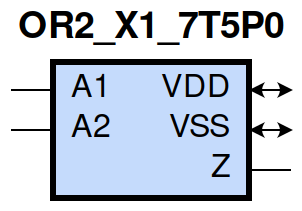
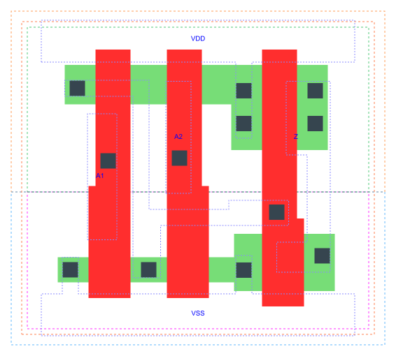

=======================================
gf180mcu_fd_sc_mcu7t5v0__or2_x1
=======================================

**gf180mcu_fd_sc_mcu7t5v0__or2_x1 symbol**

**gf180mcu_fd_sc_mcu7t5v0__or2_x1 schematic**

.. image:: sc7_sch/OR2_X1_sch.png
    :height: 300px
    :width: 500 px
    :align: center
    :alt: gf180mcu_fd_sc_mcu7t5v0__or2_x1 schematic

**gf180mcu_fd_sc_mcu7t5v0__or2_x1 layout**

.. include:: images.rst

OR2_X1 is a 2-input OR(A1,A2), 1X drive strength

|
| Attributes

============= ======================
**Attribute** **Value**
area          17.561600 µm\ :sup:`2`
============= ======================

|
| OUTPUT FUNCTIONS

============== ============
**Output Pin** **Function**
Z              (A1|A2)
============== ============

|
| TRUTH TABLE FOR Z

====== ====== =====
**A1** **A2** **Z**
1      ?      1
?      1      1
0      0      0
====== ====== =====

|
| FUNCTIONAL SCHEMATIC
| |image590|
| PIN CAPACITANCE (pf)

======= ======== ====================
**Pin** **Type** **Capacitance (pf)**
A1      input    0.0029
A2      input    0.0028
======= ======== ====================

|
| DELAY AND OUTPUT TRANSITION TIME corresponding to min slew and load

+---------------+------------+--------------------+--------------+-------------------+----------------+---------------+
| **Input Pin** | **Output** | **When Condition** | **Tin (ns)** | **Out Load (pf)** | **Delay (ns)** | **Tout (ns)** |
+---------------+------------+--------------------+--------------+-------------------+----------------+---------------+
| A1(LH)        | Z(LH)      | !A2                | 0.0100       | 0.0010            | 0.1693         | 0.0412        |
+---------------+------------+--------------------+--------------+-------------------+----------------+---------------+
| A1(HL)        | Z(HL)      | !A2                | 0.0100       | 0.0010            | 0.3122         | 0.0615        |
+---------------+------------+--------------------+--------------+-------------------+----------------+---------------+
| A2(HL)        | Z(HL)      | !A1                | 0.0100       | 0.0010            | 0.3392         | 0.0614        |
+---------------+------------+--------------------+--------------+-------------------+----------------+---------------+
| A2(LH)        | Z(LH)      | !A1                | 0.0100       | 0.0010            | 0.1869         | 0.0422        |
+---------------+------------+--------------------+--------------+-------------------+----------------+---------------+

|
| DYNAMIC ENERGY

+---------------+--------------------+--------------+------------+-------------------+---------------------+
| **Input Pin** | **When Condition** | **Tin (ns)** | **Output** | **Out Load (pf)** | **Energy (uW/MHz)** |
+---------------+--------------------+--------------+------------+-------------------+---------------------+
| A2            | !A1                | 0.0100       | Z(HL)      | 0.0010            | 0.2462              |
+---------------+--------------------+--------------+------------+-------------------+---------------------+
| A2            | !A1                | 0.0100       | Z(LH)      | 0.0010            | 0.1241              |
+---------------+--------------------+--------------+------------+-------------------+---------------------+
| A1            | !A2                | 0.0100       | Z(LH)      | 0.0010            | 0.1103              |
+---------------+--------------------+--------------+------------+-------------------+---------------------+
| A1            | !A2                | 0.0100       | Z(HL)      | 0.0010            | 0.2323              |
+---------------+--------------------+--------------+------------+-------------------+---------------------+
| A2(LH)        | A1                 | 0.0100       | n/a        | n/a               | -0.0151             |
+---------------+--------------------+--------------+------------+-------------------+---------------------+
| A1(LH)        | A2                 | 0.0100       | n/a        | n/a               | -0.0051             |
+---------------+--------------------+--------------+------------+-------------------+---------------------+
| A1(HL)        | A2                 | 0.0100       | n/a        | n/a               | 0.0135              |
+---------------+--------------------+--------------+------------+-------------------+---------------------+
| A2(HL)        | A1                 | 0.0100       | n/a        | n/a               | 0.0181              |
+---------------+--------------------+--------------+------------+-------------------+---------------------+

|
| LEAKAGE POWER

================== ==============
**When Condition** **Power (nW)**
!A1&!A2            0.1317
!A1&A2             0.1376
A1&!A2             0.1015
A1&A2              0.1015
================== ==============

