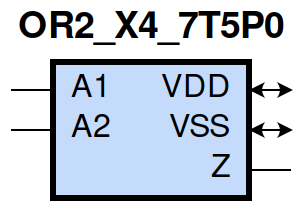
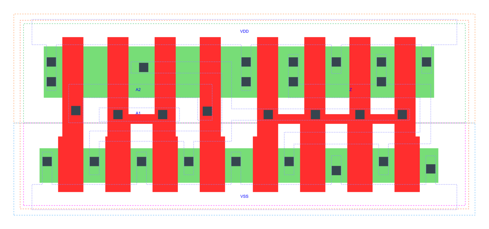

=======================================
gf180mcu_fd_sc_mcu7t5v0__or2_x4
=======================================

**gf180mcu_fd_sc_mcu7t5v0__or2_x4 symbol**

**gf180mcu_fd_sc_mcu7t5v0__or2_x4 schematic**

**gf180mcu_fd_sc_mcu7t5v0__or2_x4 layout**

.. include:: images.rst

OR2_X4 is a 2-input OR(A1,A2), 4X drive strength

|
| Attributes

============= ======================
**Attribute** **Value**
area          39.513600 µm\ :sup:`2`
============= ======================

|
| OUTPUT FUNCTIONS

============== ============
**Output Pin** **Function**
Z              (A1|A2)
============== ============

|
| TRUTH TABLE FOR Z

====== ====== =====
**A1** **A2** **Z**
1      ?      1
?      1      1
0      0      0
====== ====== =====

|
| FUNCTIONAL SCHEMATIC
| |image596|
| PIN CAPACITANCE (pf)

======= ======== ====================
**Pin** **Type** **Capacitance (pf)**
A2      input    0.0097
A1      input    0.0094
======= ======== ====================

|
| DELAY AND OUTPUT TRANSITION TIME corresponding to min slew and load

+---------------+------------+--------------------+--------------+-------------------+----------------+---------------+
| **Input Pin** | **Output** | **When Condition** | **Tin (ns)** | **Out Load (pf)** | **Delay (ns)** | **Tout (ns)** |
+---------------+------------+--------------------+--------------+-------------------+----------------+---------------+
| A2(HL)        | Z(HL)      | !A1                | 0.0100       | 0.0010            | 0.2654         | 0.0421        |
+---------------+------------+--------------------+--------------+-------------------+----------------+---------------+
| A2(LH)        | Z(LH)      | !A1                | 0.0100       | 0.0010            | 0.1516         | 0.0283        |
+---------------+------------+--------------------+--------------+-------------------+----------------+---------------+
| A1(LH)        | Z(LH)      | !A2                | 0.0100       | 0.0010            | 0.1338         | 0.0272        |
+---------------+------------+--------------------+--------------+-------------------+----------------+---------------+
| A1(HL)        | Z(HL)      | !A2                | 0.0100       | 0.0010            | 0.2401         | 0.0422        |
+---------------+------------+--------------------+--------------+-------------------+----------------+---------------+

|
| DYNAMIC ENERGY

+---------------+--------------------+--------------+------------+-------------------+---------------------+
| **Input Pin** | **When Condition** | **Tin (ns)** | **Output** | **Out Load (pf)** | **Energy (uW/MHz)** |
+---------------+--------------------+--------------+------------+-------------------+---------------------+
| A2            | !A1                | 0.0100       | Z(HL)      | 0.0010            | 0.8381              |
+---------------+--------------------+--------------+------------+-------------------+---------------------+
| A2            | !A1                | 0.0100       | Z(LH)      | 0.0010            | 0.4130              |
+---------------+--------------------+--------------+------------+-------------------+---------------------+
| A1            | !A2                | 0.0100       | Z(LH)      | 0.0010            | 0.3568              |
+---------------+--------------------+--------------+------------+-------------------+---------------------+
| A1            | !A2                | 0.0100       | Z(HL)      | 0.0010            | 0.7777              |
+---------------+--------------------+--------------+------------+-------------------+---------------------+
| A2(LH)        | A1                 | 0.0100       | n/a        | n/a               | -0.0654             |
+---------------+--------------------+--------------+------------+-------------------+---------------------+
| A1(LH)        | A2                 | 0.0100       | n/a        | n/a               | -0.0220             |
+---------------+--------------------+--------------+------------+-------------------+---------------------+
| A1(HL)        | A2                 | 0.0100       | n/a        | n/a               | 0.0544              |
+---------------+--------------------+--------------+------------+-------------------+---------------------+
| A2(HL)        | A1                 | 0.0100       | n/a        | n/a               | 0.0785              |
+---------------+--------------------+--------------+------------+-------------------+---------------------+

|
| LEAKAGE POWER

================== ==============
**When Condition** **Power (nW)**
!A1&!A2            0.2578
!A1&A2             0.2760
A1&!A2             0.2048
A1&A2              0.2048
================== ==============

