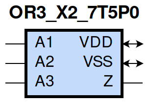
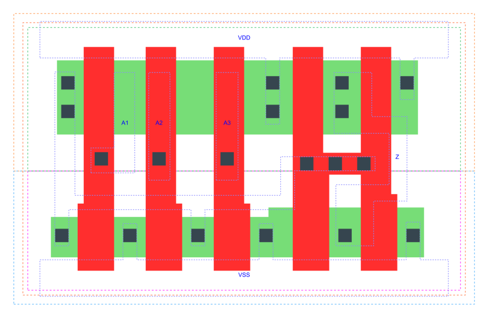

=======================================
gf180mcu_fd_sc_mcu7t5v0__or3_x2
=======================================

**gf180mcu_fd_sc_mcu7t5v0__or3_x2 symbol**

**gf180mcu_fd_sc_mcu7t5v0__or3_x2 schematic**

.. image:: sc7_sch/OR3_X2_sch.png
    :height: 300px
    :width: 500 px
    :align: center
    :alt: gf180mcu_fd_sc_mcu7t5v0__or3_x2 schematic

**gf180mcu_fd_sc_mcu7t5v0__or3_x2 layout**

.. include:: images.rst

OR3_X2 is a 3-input OR(A1,A2,A3), 2X drive strength

|
| Attributes

============= ======================
**Attribute** **Value**
area          26.342400 µm\ :sup:`2`
============= ======================

|
| OUTPUT FUNCTIONS

============== ============
**Output Pin** **Function**
Z              (A1|A2|A3)
============== ============

|
| TRUTH TABLE FOR Z

====== ====== ====== =====
**A1** **A2** **A3** **Z**
1      ?      ?      1
?      1      ?      1
?      ?      1      1
0      0      0      0
====== ====== ====== =====

|
| FUNCTIONAL SCHEMATIC
| |image602|
| PIN CAPACITANCE (pf)

======= ======== ====================
**Pin** **Type** **Capacitance (pf)**
A1      input    0.0047
A2      input    0.0044
A3      input    0.0043
======= ======== ====================

|
| DELAY AND OUTPUT TRANSITION TIME corresponding to min slew and load

+---------------+------------+--------------------+--------------+-------------------+----------------+---------------+
| **Input Pin** | **Output** | **When Condition** | **Tin (ns)** | **Out Load (pf)** | **Delay (ns)** | **Tout (ns)** |
+---------------+------------+--------------------+--------------+-------------------+----------------+---------------+
| A1(LH)        | Z(LH)      | !A2&!A3            | 0.0100       | 0.0010            | 0.1686         | 0.0321        |
+---------------+------------+--------------------+--------------+-------------------+----------------+---------------+
| A1(HL)        | Z(HL)      | !A2&!A3            | 0.0100       | 0.0010            | 0.3411         | 0.0615        |
+---------------+------------+--------------------+--------------+-------------------+----------------+---------------+
| A2(HL)        | Z(HL)      | !A1&!A3            | 0.0100       | 0.0010            | 0.3977         | 0.0615        |
+---------------+------------+--------------------+--------------+-------------------+----------------+---------------+
| A2(LH)        | Z(LH)      | !A1&!A3            | 0.0100       | 0.0010            | 0.1922         | 0.0334        |
+---------------+------------+--------------------+--------------+-------------------+----------------+---------------+
| A3(LH)        | Z(LH)      | !A1&!A2            | 0.0100       | 0.0010            | 0.2056         | 0.0351        |
+---------------+------------+--------------------+--------------+-------------------+----------------+---------------+
| A3(HL)        | Z(HL)      | !A1&!A2            | 0.0100       | 0.0010            | 0.4221         | 0.0617        |
+---------------+------------+--------------------+--------------+-------------------+----------------+---------------+

|
| DYNAMIC ENERGY

+---------------+--------------------+--------------+------------+-------------------+---------------------+
| **Input Pin** | **When Condition** | **Tin (ns)** | **Output** | **Out Load (pf)** | **Energy (uW/MHz)** |
+---------------+--------------------+--------------+------------+-------------------+---------------------+
| A3            | !A1&!A2            | 0.0100       | Z(LH)      | 0.0010            | 0.2598              |
+---------------+--------------------+--------------+------------+-------------------+---------------------+
| A2            | !A1&!A3            | 0.0100       | Z(HL)      | 0.0010            | 0.5254              |
+---------------+--------------------+--------------+------------+-------------------+---------------------+
| A2            | !A1&!A3            | 0.0100       | Z(LH)      | 0.0010            | 0.2278              |
+---------------+--------------------+--------------+------------+-------------------+---------------------+
| A1            | !A2&!A3            | 0.0100       | Z(LH)      | 0.0010            | 0.1969              |
+---------------+--------------------+--------------+------------+-------------------+---------------------+
| A3            | !A1&!A2            | 0.0100       | Z(HL)      | 0.0010            | 0.5544              |
+---------------+--------------------+--------------+------------+-------------------+---------------------+
| A1            | !A2&!A3            | 0.0100       | Z(HL)      | 0.0010            | 0.4949              |
+---------------+--------------------+--------------+------------+-------------------+---------------------+
| A3(LH)        | !A1&A2             | 0.0100       | n/a        | n/a               | -0.0340             |
+---------------+--------------------+--------------+------------+-------------------+---------------------+
| A3(LH)        | A1&!A2             | 0.0100       | n/a        | n/a               | -0.0325             |
+---------------+--------------------+--------------+------------+-------------------+---------------------+
| A3(LH)        | A1&A2              | 0.0100       | n/a        | n/a               | -0.0371             |
+---------------+--------------------+--------------+------------+-------------------+---------------------+
| A2(LH)        | !A1&A3             | 0.0100       | n/a        | n/a               | -0.0119             |
+---------------+--------------------+--------------+------------+-------------------+---------------------+
| A2(LH)        | A1&!A3             | 0.0100       | n/a        | n/a               | -0.0327             |
+---------------+--------------------+--------------+------------+-------------------+---------------------+
| A2(LH)        | A1&A3              | 0.0100       | n/a        | n/a               | -0.0289             |
+---------------+--------------------+--------------+------------+-------------------+---------------------+
| A1(LH)        | !A2&A3             | 0.0100       | n/a        | n/a               | -0.0108             |
+---------------+--------------------+--------------+------------+-------------------+---------------------+
| A1(LH)        | A2&!A3             | 0.0100       | n/a        | n/a               | -0.0110             |
+---------------+--------------------+--------------+------------+-------------------+---------------------+
| A1(LH)        | A2&A3              | 0.0100       | n/a        | n/a               | -0.0110             |
+---------------+--------------------+--------------+------------+-------------------+---------------------+
| A3(HL)        | !A1&A2             | 0.0100       | n/a        | n/a               | 0.0392              |
+---------------+--------------------+--------------+------------+-------------------+---------------------+
| A3(HL)        | A1&!A2             | 0.0100       | n/a        | n/a               | 0.0393              |
+---------------+--------------------+--------------+------------+-------------------+---------------------+
| A3(HL)        | A1&A2              | 0.0100       | n/a        | n/a               | 0.0392              |
+---------------+--------------------+--------------+------------+-------------------+---------------------+
| A1(HL)        | !A2&A3             | 0.0100       | n/a        | n/a               | 0.0523              |
+---------------+--------------------+--------------+------------+-------------------+---------------------+
| A1(HL)        | A2&!A3             | 0.0100       | n/a        | n/a               | 0.0263              |
+---------------+--------------------+--------------+------------+-------------------+---------------------+
| A1(HL)        | A2&A3              | 0.0100       | n/a        | n/a               | 0.0263              |
+---------------+--------------------+--------------+------------+-------------------+---------------------+
| A2(HL)        | !A1&A3             | 0.0100       | n/a        | n/a               | 0.0268              |
+---------------+--------------------+--------------+------------+-------------------+---------------------+
| A2(HL)        | A1&!A3             | 0.0100       | n/a        | n/a               | 0.0393              |
+---------------+--------------------+--------------+------------+-------------------+---------------------+
| A2(HL)        | A1&A3              | 0.0100       | n/a        | n/a               | 0.0234              |
+---------------+--------------------+--------------+------------+-------------------+---------------------+

|
| LEAKAGE POWER

================== ==============
**When Condition** **Power (nW)**
!A1&!A2&!A3        0.1793
!A1&!A2&A3         0.1984
!A1&A2&!A3         0.1630
!A1&A2&A3          0.1630
A1&!A2&!A3         0.1274
A1&!A2&A3          0.1274
A1&A2&!A3          0.1274
A1&A2&A3           0.1274
================== ==============

