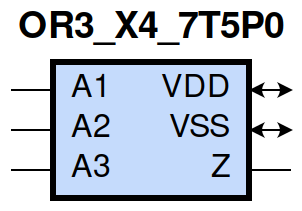
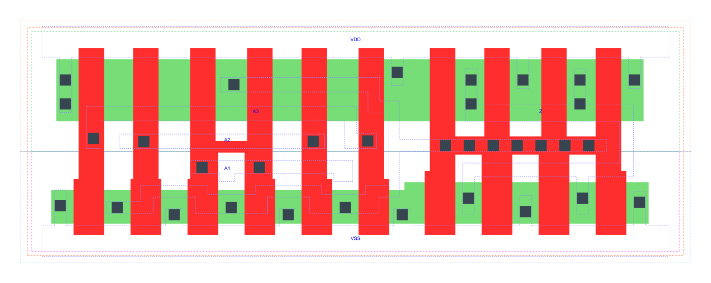

=======================================
gf180mcu_fd_sc_mcu7t5v0__or3_x4
=======================================

**gf180mcu_fd_sc_mcu7t5v0__or3_x4 symbol**

**gf180mcu_fd_sc_mcu7t5v0__or3_x4 schematic**

.. image:: sc7_sch/OR3_X4_sch.png
    :height: 300px
    :width: 500 px
    :align: center
    :alt: gf180mcu_fd_sc_mcu7t5v0__or3_x4 schematic

**gf180mcu_fd_sc_mcu7t5v0__or3_x4 layout**

.. include:: images.rst

OR3_X4 is a 3-input OR(A1,A2,A3), 4X drive strength

|
| Attributes

============= ======================
**Attribute** **Value**
area          48.294400 µm\ :sup:`2`
============= ======================

|
| OUTPUT FUNCTIONS

============== ============
**Output Pin** **Function**
Z              (A1|A2|A3)
============== ============

|
| TRUTH TABLE FOR Z

====== ====== ====== =====
**A1** **A2** **A3** **Z**
1      ?      ?      1
?      1      ?      1
?      ?      1      1
0      0      0      0
====== ====== ====== =====

|
| FUNCTIONAL SCHEMATIC
| |image605|
| PIN CAPACITANCE (pf)

======= ======== ====================
**Pin** **Type** **Capacitance (pf)**
A3      input    0.0094
A2      input    0.0091
A1      input    0.0092
======= ======== ====================

|
| DELAY AND OUTPUT TRANSITION TIME corresponding to min slew and load

+---------------+------------+--------------------+--------------+-------------------+----------------+---------------+
| **Input Pin** | **Output** | **When Condition** | **Tin (ns)** | **Out Load (pf)** | **Delay (ns)** | **Tout (ns)** |
+---------------+------------+--------------------+--------------+-------------------+----------------+---------------+
| A3(LH)        | Z(LH)      | !A1&!A2            | 0.0100       | 0.0010            | 0.1974         | 0.0324        |
+---------------+------------+--------------------+--------------+-------------------+----------------+---------------+
| A3(HL)        | Z(HL)      | !A1&!A2            | 0.0100       | 0.0010            | 0.4075         | 0.0576        |
+---------------+------------+--------------------+--------------+-------------------+----------------+---------------+
| A2(HL)        | Z(HL)      | !A1&!A3            | 0.0100       | 0.0010            | 0.3831         | 0.0576        |
+---------------+------------+--------------------+--------------+-------------------+----------------+---------------+
| A2(LH)        | Z(LH)      | !A1&!A3            | 0.0100       | 0.0010            | 0.1846         | 0.0307        |
+---------------+------------+--------------------+--------------+-------------------+----------------+---------------+
| A1(LH)        | Z(LH)      | !A2&!A3            | 0.0100       | 0.0010            | 0.1605         | 0.0295        |
+---------------+------------+--------------------+--------------+-------------------+----------------+---------------+
| A1(HL)        | Z(HL)      | !A2&!A3            | 0.0100       | 0.0010            | 0.3245         | 0.0574        |
+---------------+------------+--------------------+--------------+-------------------+----------------+---------------+

|
| DYNAMIC ENERGY

+---------------+--------------------+--------------+------------+-------------------+---------------------+
| **Input Pin** | **When Condition** | **Tin (ns)** | **Output** | **Out Load (pf)** | **Energy (uW/MHz)** |
+---------------+--------------------+--------------+------------+-------------------+---------------------+
| A3            | !A1&!A2            | 0.0100       | Z(LH)      | 0.0010            | 0.5054              |
+---------------+--------------------+--------------+------------+-------------------+---------------------+
| A2            | !A1&!A3            | 0.0100       | Z(HL)      | 0.0010            | 1.0302              |
+---------------+--------------------+--------------+------------+-------------------+---------------------+
| A2            | !A1&!A3            | 0.0100       | Z(LH)      | 0.0010            | 0.4425              |
+---------------+--------------------+--------------+------------+-------------------+---------------------+
| A1            | !A2&!A3            | 0.0100       | Z(LH)      | 0.0010            | 0.3765              |
+---------------+--------------------+--------------+------------+-------------------+---------------------+
| A3            | !A1&!A2            | 0.0100       | Z(HL)      | 0.0010            | 1.0886              |
+---------------+--------------------+--------------+------------+-------------------+---------------------+
| A1            | !A2&!A3            | 0.0100       | Z(HL)      | 0.0010            | 0.9689              |
+---------------+--------------------+--------------+------------+-------------------+---------------------+
| A3(LH)        | !A1&A2             | 0.0100       | n/a        | n/a               | -0.0680             |
+---------------+--------------------+--------------+------------+-------------------+---------------------+
| A3(LH)        | A1&!A2             | 0.0100       | n/a        | n/a               | -0.0652             |
+---------------+--------------------+--------------+------------+-------------------+---------------------+
| A3(LH)        | A1&A2              | 0.0100       | n/a        | n/a               | -0.0742             |
+---------------+--------------------+--------------+------------+-------------------+---------------------+
| A2(LH)        | !A1&A3             | 0.0100       | n/a        | n/a               | -0.0237             |
+---------------+--------------------+--------------+------------+-------------------+---------------------+
| A2(LH)        | A1&!A3             | 0.0100       | n/a        | n/a               | -0.0653             |
+---------------+--------------------+--------------+------------+-------------------+---------------------+
| A2(LH)        | A1&A3              | 0.0100       | n/a        | n/a               | -0.0577             |
+---------------+--------------------+--------------+------------+-------------------+---------------------+
| A1(LH)        | !A2&A3             | 0.0100       | n/a        | n/a               | -0.0216             |
+---------------+--------------------+--------------+------------+-------------------+---------------------+
| A1(LH)        | A2&!A3             | 0.0100       | n/a        | n/a               | -0.0221             |
+---------------+--------------------+--------------+------------+-------------------+---------------------+
| A1(LH)        | A2&A3              | 0.0100       | n/a        | n/a               | -0.0222             |
+---------------+--------------------+--------------+------------+-------------------+---------------------+
| A3(HL)        | !A1&A2             | 0.0100       | n/a        | n/a               | 0.0785              |
+---------------+--------------------+--------------+------------+-------------------+---------------------+
| A3(HL)        | A1&!A2             | 0.0100       | n/a        | n/a               | 0.0785              |
+---------------+--------------------+--------------+------------+-------------------+---------------------+
| A3(HL)        | A1&A2              | 0.0100       | n/a        | n/a               | 0.0785              |
+---------------+--------------------+--------------+------------+-------------------+---------------------+
| A1(HL)        | !A2&A3             | 0.0100       | n/a        | n/a               | 0.1065              |
+---------------+--------------------+--------------+------------+-------------------+---------------------+
| A1(HL)        | A2&!A3             | 0.0100       | n/a        | n/a               | 0.0553              |
+---------------+--------------------+--------------+------------+-------------------+---------------------+
| A1(HL)        | A2&A3              | 0.0100       | n/a        | n/a               | 0.0553              |
+---------------+--------------------+--------------+------------+-------------------+---------------------+
| A2(HL)        | !A1&A3             | 0.0100       | n/a        | n/a               | 0.0526              |
+---------------+--------------------+--------------+------------+-------------------+---------------------+
| A2(HL)        | A1&!A3             | 0.0100       | n/a        | n/a               | 0.0787              |
+---------------+--------------------+--------------+------------+-------------------+---------------------+
| A2(HL)        | A1&A3              | 0.0100       | n/a        | n/a               | 0.0471              |
+---------------+--------------------+--------------+------------+-------------------+---------------------+

|
| LEAKAGE POWER

================== ==============
**When Condition** **Power (nW)**
!A1&!A2&!A3        0.3086
!A1&!A2&A3         0.3467
!A1&A2&!A3         0.2760
!A1&A2&A3          0.2760
A1&!A2&!A3         0.2048
A1&!A2&A3          0.2048
A1&A2&!A3          0.2048
A1&A2&A3           0.2048
================== ==============

