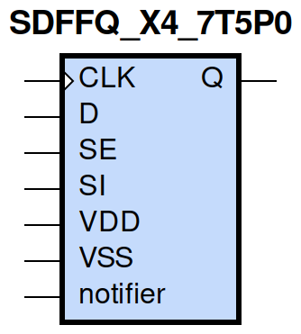
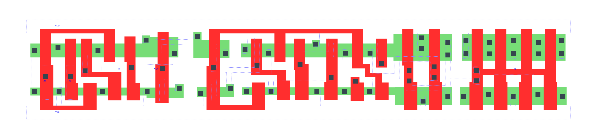

=======================================
gf180mcu_fd_sc_mcu7t5v0__sdffq_x4
=======================================

**gf180mcu_fd_sc_mcu7t5v0__sdffq_x4 symbol**

**gf180mcu_fd_sc_mcu7t5v0__sdffq_x4 schematic**

.. image:: sc7_sch/SDFFQ_X4_sch.png
    :height: 300px
    :width: 500 px
    :align: center
    :alt: gf180mcu_fd_sc_mcu7t5v0__sdffq_x4 schematic

**gf180mcu_fd_sc_mcu7t5v0__sdffq_x4 layout**

.. include:: images.rst

SDFFQ_X4 is a positive edge triggered scan D-type flip flop, 4X drive strength

|
| Attributes

============= ======================
**Attribute** **Value**
area          96.588800 µm\ :sup:`2`
============= ======================

|

TRUTH TABLE

===== == = === ======
Input          Output
SE    SI D CLK Q
L     X  L ↑   L
L     X  H ↑   H
H     L  X ↑   L
H     H  X ↑   H
===== == = === ======

|
| FUNCTIONAL SCHEMATIC
| |image623|
| CONSTRAINTS

================== =============== ============= ============
**Constraint Pin** **Related Pin** **setup(ns)** **hold(ns)**
SE(LH)             CLK(LH)         0.4580        -0.2060
SE(LH)             CLK(LH)         0.6130        -0.1260
SE(HL)             CLK(LH)         0.5100        -0.0340
SE(HL)             CLK(LH)         0.5900        -0.3320
SI(HL)             CLK(LH)         0.5780        -0.0920
SI(HL)             CLK(LH)         0.5780        -0.0920
SI(LH)             CLK(LH)         0.5040        -0.2520
SI(LH)             CLK(LH)         0.5040        -0.2520
D(HL)              CLK(LH)         0.5780        -0.0920
D(HL)              CLK(LH)         0.5780        -0.0920
D(LH)              CLK(LH)         0.5100        -0.2580
D(LH)              CLK(LH)         0.5100        -0.2580
================== =============== ============= ============

|

================== =============== ===========================
**Constraint Pin** **Related Pin** **Minimum Pulse Width(ns)**
CLK(HLH)           CLK(HL)         0.6810
CLK(HLH)           CLK(HL)         0.6810
CLK(HLH)           CLK(HL)         0.6750
CLK(HLH)           CLK(HL)         0.5650
CLK(HLH)           CLK(HL)         0.5590
CLK(HLH)           CLK(HL)         0.6810
CLK(HLH)           CLK(HL)         0.5650
CLK(HLH)           CLK(HL)         0.5650
CLK(LHL)           CLK(LH)         0.3780
CLK(LHL)           CLK(LH)         0.3780
CLK(LHL)           CLK(LH)         0.3780
CLK(LHL)           CLK(LH)         0.4850
CLK(LHL)           CLK(LH)         0.4850
CLK(LHL)           CLK(LH)         0.3780
CLK(LHL)           CLK(LH)         0.4850
CLK(LHL)           CLK(LH)         0.4850
================== =============== ===========================

|
| PIN CAPACITANCE (pf)

======= ======== ====================
**Pin** **Type** **Capacitance (pf)**
SE      input    0.0059
SI      input    0.0027
D       input    0.0028
CLK     input    0.0035
======= ======== ====================

|
| DELAY AND OUTPUT TRANSITION TIME corresponding to min slew and load

+---------------+------------+--------------------+--------------+-------------------+----------------+---------------+
| **Input Pin** | **Output** | **When Condition** | **Tin (ns)** | **Out Load (pf)** | **Delay (ns)** | **Tout (ns)** |
+---------------+------------+--------------------+--------------+-------------------+----------------+---------------+
| CLK(LH)       | Q(HL)      | !D&!SE&!SI         | 0.0100       | 0.0010            | 0.7000         | 0.0451        |
+---------------+------------+--------------------+--------------+-------------------+----------------+---------------+
| CLK(LH)       | Q(HL)      | !D&!SE&SI          | 0.0100       | 0.0010            | 0.6999         | 0.0452        |
+---------------+------------+--------------------+--------------+-------------------+----------------+---------------+
| CLK(LH)       | Q(HL)      | !D&SE&!SI          | 0.0100       | 0.0010            | 0.6999         | 0.0452        |
+---------------+------------+--------------------+--------------+-------------------+----------------+---------------+
| CLK(LH)       | Q(HL)      | D&SE&!SI           | 0.0100       | 0.0010            | 0.6998         | 0.0452        |
+---------------+------------+--------------------+--------------+-------------------+----------------+---------------+
| CLK(LH)       | Q(LH)      | !D&SE&SI           | 0.0100       | 0.0010            | 0.6618         | 0.0402        |
+---------------+------------+--------------------+--------------+-------------------+----------------+---------------+
| CLK(LH)       | Q(LH)      | D&!SE&!SI          | 0.0100       | 0.0010            | 0.6618         | 0.0401        |
+---------------+------------+--------------------+--------------+-------------------+----------------+---------------+
| CLK(LH)       | Q(LH)      | D&!SE&SI           | 0.0100       | 0.0010            | 0.6618         | 0.0401        |
+---------------+------------+--------------------+--------------+-------------------+----------------+---------------+
| CLK(LH)       | Q(LH)      | D&SE&SI            | 0.0100       | 0.0010            | 0.6618         | 0.0402        |
+---------------+------------+--------------------+--------------+-------------------+----------------+---------------+

|
| DYNAMIC ENERGY

+---------------+--------------------+--------------+------------+-------------------+---------------------+
| **Input Pin** | **When Condition** | **Tin (ns)** | **Output** | **Out Load (pf)** | **Energy (uW/MHz)** |
+---------------+--------------------+--------------+------------+-------------------+---------------------+
| CLK           | !D&!SE&!SI         | 0.0100       | Q(HL)      | 0.0010            | 1.0390              |
+---------------+--------------------+--------------+------------+-------------------+---------------------+
| CLK           | !D&!SE&SI          | 0.0100       | Q(HL)      | 0.0010            | 1.0388              |
+---------------+--------------------+--------------+------------+-------------------+---------------------+
| CLK           | !D&SE&!SI          | 0.0100       | Q(HL)      | 0.0010            | 1.0386              |
+---------------+--------------------+--------------+------------+-------------------+---------------------+
| CLK           | D&SE&!SI           | 0.0100       | Q(HL)      | 0.0010            | 1.0385              |
+---------------+--------------------+--------------+------------+-------------------+---------------------+
| CLK           | !D&SE&SI           | 0.0100       | Q(LH)      | 0.0010            | 0.9503              |
+---------------+--------------------+--------------+------------+-------------------+---------------------+
| CLK           | D&!SE&!SI          | 0.0100       | Q(LH)      | 0.0010            | 0.9506              |
+---------------+--------------------+--------------+------------+-------------------+---------------------+
| CLK           | D&!SE&SI           | 0.0100       | Q(LH)      | 0.0010            | 0.9506              |
+---------------+--------------------+--------------+------------+-------------------+---------------------+
| CLK           | D&SE&SI            | 0.0100       | Q(LH)      | 0.0010            | 0.9503              |
+---------------+--------------------+--------------+------------+-------------------+---------------------+
| D(HL)         | !CLK&!SE&!SI       | 0.0100       | n/a        | n/a               | 0.3347              |
+---------------+--------------------+--------------+------------+-------------------+---------------------+
| D(HL)         | !CLK&SE&!SI        | 0.0100       | n/a        | n/a               | 0.0203              |
+---------------+--------------------+--------------+------------+-------------------+---------------------+
| D(HL)         | !CLK&!SE&SI        | 0.0100       | n/a        | n/a               | 0.3346              |
+---------------+--------------------+--------------+------------+-------------------+---------------------+
| D(HL)         | !CLK&SE&SI         | 0.0100       | n/a        | n/a               | 0.0201              |
+---------------+--------------------+--------------+------------+-------------------+---------------------+
| D(HL)         | CLK&!SE&!SI        | 0.0100       | n/a        | n/a               | 0.0692              |
+---------------+--------------------+--------------+------------+-------------------+---------------------+
| D(HL)         | CLK&SE&!SI         | 0.0100       | n/a        | n/a               | 0.0201              |
+---------------+--------------------+--------------+------------+-------------------+---------------------+
| D(HL)         | CLK&!SE&SI         | 0.0100       | n/a        | n/a               | 0.0693              |
+---------------+--------------------+--------------+------------+-------------------+---------------------+
| D(HL)         | CLK&SE&SI          | 0.0100       | n/a        | n/a               | 0.0202              |
+---------------+--------------------+--------------+------------+-------------------+---------------------+
| SE(LH)        | !CLK&!D&!SI        | 0.0100       | n/a        | n/a               | 0.0045              |
+---------------+--------------------+--------------+------------+-------------------+---------------------+
| SE(LH)        | !CLK&!D&SI         | 0.0100       | n/a        | n/a               | 0.1793              |
+---------------+--------------------+--------------+------------+-------------------+---------------------+
| SE(LH)        | CLK&!D&!SI         | 0.0100       | n/a        | n/a               | 0.0011              |
+---------------+--------------------+--------------+------------+-------------------+---------------------+
| SE(LH)        | CLK&!D&SI          | 0.0100       | n/a        | n/a               | -0.0041             |
+---------------+--------------------+--------------+------------+-------------------+---------------------+
| SE(LH)        | !CLK&D&!SI         | 0.0100       | n/a        | n/a               | 0.3209              |
+---------------+--------------------+--------------+------------+-------------------+---------------------+
| SE(LH)        | !CLK&D&SI          | 0.0100       | n/a        | n/a               | 0.0057              |
+---------------+--------------------+--------------+------------+-------------------+---------------------+
| SE(LH)        | CLK&D&!SI          | 0.0100       | n/a        | n/a               | 0.0484              |
+---------------+--------------------+--------------+------------+-------------------+---------------------+
| SE(LH)        | CLK&D&SI           | 0.0100       | n/a        | n/a               | 0.0037              |
+---------------+--------------------+--------------+------------+-------------------+---------------------+
| CLK(LH)       | !D&!SE&!SI         | 0.0100       | n/a        | n/a               | 0.2153              |
+---------------+--------------------+--------------+------------+-------------------+---------------------+
| CLK(LH)       | !D&SE&!SI          | 0.0100       | n/a        | n/a               | 0.2153              |
+---------------+--------------------+--------------+------------+-------------------+---------------------+
| CLK(LH)       | !D&!SE&SI          | 0.0100       | n/a        | n/a               | 0.2154              |
+---------------+--------------------+--------------+------------+-------------------+---------------------+
| CLK(LH)       | !D&SE&SI           | 0.0100       | n/a        | n/a               | 0.2172              |
+---------------+--------------------+--------------+------------+-------------------+---------------------+
| CLK(LH)       | D&!SE&!SI          | 0.0100       | n/a        | n/a               | 0.2170              |
+---------------+--------------------+--------------+------------+-------------------+---------------------+
| CLK(LH)       | D&SE&!SI           | 0.0100       | n/a        | n/a               | 0.2152              |
+---------------+--------------------+--------------+------------+-------------------+---------------------+
| CLK(LH)       | D&!SE&SI           | 0.0100       | n/a        | n/a               | 0.2171              |
+---------------+--------------------+--------------+------------+-------------------+---------------------+
| CLK(LH)       | D&SE&SI            | 0.0100       | n/a        | n/a               | 0.2172              |
+---------------+--------------------+--------------+------------+-------------------+---------------------+
| SI(LH)        | !CLK&!D&!SE        | 0.0100       | n/a        | n/a               | -0.0198             |
+---------------+--------------------+--------------+------------+-------------------+---------------------+
| SI(LH)        | !CLK&!D&SE         | 0.0100       | n/a        | n/a               | 0.1763              |
+---------------+--------------------+--------------+------------+-------------------+---------------------+
| SI(LH)        | CLK&!D&!SE         | 0.0100       | n/a        | n/a               | -0.0198             |
+---------------+--------------------+--------------+------------+-------------------+---------------------+
| SI(LH)        | CLK&!D&SE          | 0.0100       | n/a        | n/a               | -0.0157             |
+---------------+--------------------+--------------+------------+-------------------+---------------------+
| SI(LH)        | !CLK&D&!SE         | 0.0100       | n/a        | n/a               | -0.0183             |
+---------------+--------------------+--------------+------------+-------------------+---------------------+
| SI(LH)        | !CLK&D&SE          | 0.0100       | n/a        | n/a               | 0.1763              |
+---------------+--------------------+--------------+------------+-------------------+---------------------+
| SI(LH)        | CLK&D&!SE          | 0.0100       | n/a        | n/a               | -0.0185             |
+---------------+--------------------+--------------+------------+-------------------+---------------------+
| SI(LH)        | CLK&D&SE           | 0.0100       | n/a        | n/a               | -0.0157             |
+---------------+--------------------+--------------+------------+-------------------+---------------------+
| SE(HL)        | !CLK&!D&!SI        | 0.0100       | n/a        | n/a               | 0.1170              |
+---------------+--------------------+--------------+------------+-------------------+---------------------+
| SE(HL)        | !CLK&!D&SI         | 0.0100       | n/a        | n/a               | 0.4119              |
+---------------+--------------------+--------------+------------+-------------------+---------------------+
| SE(HL)        | CLK&!D&!SI         | 0.0100       | n/a        | n/a               | 0.1141              |
+---------------+--------------------+--------------+------------+-------------------+---------------------+
| SE(HL)        | CLK&!D&SI          | 0.0100       | n/a        | n/a               | 0.1563              |
+---------------+--------------------+--------------+------------+-------------------+---------------------+
| SE(HL)        | !CLK&D&!SI         | 0.0100       | n/a        | n/a               | 0.3146              |
+---------------+--------------------+--------------+------------+-------------------+---------------------+
| SE(HL)        | !CLK&D&SI          | 0.0100       | n/a        | n/a               | 0.1183              |
+---------------+--------------------+--------------+------------+-------------------+---------------------+
| SE(HL)        | CLK&D&!SI          | 0.0100       | n/a        | n/a               | 0.1241              |
+---------------+--------------------+--------------+------------+-------------------+---------------------+
| SE(HL)        | CLK&D&SI           | 0.0100       | n/a        | n/a               | 0.1151              |
+---------------+--------------------+--------------+------------+-------------------+---------------------+
| CLK(HL)       | !D&!SE&!SI         | 0.0100       | n/a        | n/a               | 0.3005              |
+---------------+--------------------+--------------+------------+-------------------+---------------------+
| CLK(HL)       | !D&SE&!SI          | 0.0100       | n/a        | n/a               | 0.3007              |
+---------------+--------------------+--------------+------------+-------------------+---------------------+
| CLK(HL)       | !D&!SE&SI          | 0.0100       | n/a        | n/a               | 0.3006              |
+---------------+--------------------+--------------+------------+-------------------+---------------------+
| CLK(HL)       | !D&SE&SI           | 0.0100       | n/a        | n/a               | 0.2952              |
+---------------+--------------------+--------------+------------+-------------------+---------------------+
| CLK(HL)       | D&!SE&!SI          | 0.0100       | n/a        | n/a               | 0.2757              |
+---------------+--------------------+--------------+------------+-------------------+---------------------+
| CLK(HL)       | D&SE&!SI           | 0.0100       | n/a        | n/a               | 0.3006              |
+---------------+--------------------+--------------+------------+-------------------+---------------------+
| CLK(HL)       | D&!SE&SI           | 0.0100       | n/a        | n/a               | 0.2953              |
+---------------+--------------------+--------------+------------+-------------------+---------------------+
| CLK(HL)       | D&SE&SI            | 0.0100       | n/a        | n/a               | 0.2952              |
+---------------+--------------------+--------------+------------+-------------------+---------------------+
| SI(HL)        | !CLK&!D&!SE        | 0.0100       | n/a        | n/a               | 0.0204              |
+---------------+--------------------+--------------+------------+-------------------+---------------------+
| SI(HL)        | !CLK&!D&SE         | 0.0100       | n/a        | n/a               | 0.3469              |
+---------------+--------------------+--------------+------------+-------------------+---------------------+
| SI(HL)        | CLK&!D&!SE         | 0.0100       | n/a        | n/a               | 0.0203              |
+---------------+--------------------+--------------+------------+-------------------+---------------------+
| SI(HL)        | CLK&!D&SE          | 0.0100       | n/a        | n/a               | 0.0703              |
+---------------+--------------------+--------------+------------+-------------------+---------------------+
| SI(HL)        | !CLK&D&!SE         | 0.0100       | n/a        | n/a               | 0.0202              |
+---------------+--------------------+--------------+------------+-------------------+---------------------+
| SI(HL)        | !CLK&D&SE          | 0.0100       | n/a        | n/a               | 0.3469              |
+---------------+--------------------+--------------+------------+-------------------+---------------------+
| SI(HL)        | CLK&D&!SE          | 0.0100       | n/a        | n/a               | 0.0202              |
+---------------+--------------------+--------------+------------+-------------------+---------------------+
| SI(HL)        | CLK&D&SE           | 0.0100       | n/a        | n/a               | 0.0703              |
+---------------+--------------------+--------------+------------+-------------------+---------------------+
| D(LH)         | !CLK&!SE&!SI       | 0.0100       | n/a        | n/a               | 0.1917              |
+---------------+--------------------+--------------+------------+-------------------+---------------------+
| D(LH)         | !CLK&SE&!SI        | 0.0100       | n/a        | n/a               | -0.0195             |
+---------------+--------------------+--------------+------------+-------------------+---------------------+
| D(LH)         | !CLK&!SE&SI        | 0.0100       | n/a        | n/a               | 0.1916              |
+---------------+--------------------+--------------+------------+-------------------+---------------------+
| D(LH)         | !CLK&SE&SI         | 0.0100       | n/a        | n/a               | -0.0178             |
+---------------+--------------------+--------------+------------+-------------------+---------------------+
| D(LH)         | CLK&!SE&!SI        | 0.0100       | n/a        | n/a               | -0.0052             |
+---------------+--------------------+--------------+------------+-------------------+---------------------+
| D(LH)         | CLK&SE&!SI         | 0.0100       | n/a        | n/a               | -0.0196             |
+---------------+--------------------+--------------+------------+-------------------+---------------------+
| D(LH)         | CLK&!SE&SI         | 0.0100       | n/a        | n/a               | -0.0052             |
+---------------+--------------------+--------------+------------+-------------------+---------------------+
| D(LH)         | CLK&SE&SI          | 0.0100       | n/a        | n/a               | -0.0181             |
+---------------+--------------------+--------------+------------+-------------------+---------------------+

|
| LEAKAGE POWER

================== ==============
**When Condition** **Power (nW)**
!CLK&!D&!SE&!SI    0.6553
!CLK&!D&!SE&SI     0.6567
!CLK&!D&SE&!SI     0.6558
!CLK&D&SE&!SI      0.6573
!CLK&!D&SE&SI      0.6346
!CLK&D&!SE&!SI     0.5528
!CLK&D&!SE&SI      0.6372
!CLK&D&SE&SI       0.6346
CLK&!D&!SE&!SI     0.5629
CLK&!D&!SE&SI      0.5630
CLK&!D&SE&!SI      0.5547
CLK&D&SE&!SI       0.5547
CLK&!D&SE&SI       0.7174
CLK&D&!SE&!SI      0.5425
CLK&D&!SE&SI       0.7151
CLK&D&SE&SI        0.7174
================== ==============

