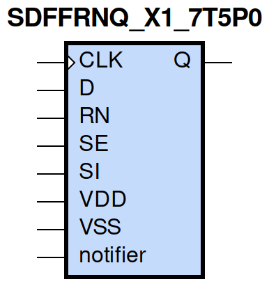
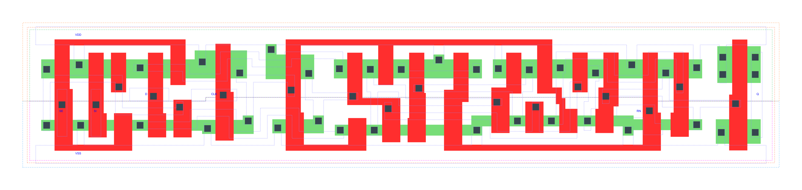

=======================================
gf180mcu_fd_sc_mcu7t5v0__sdffrnq_x1
=======================================

**gf180mcu_fd_sc_mcu7t5v0__sdffrnq_x1 symbol**

**gf180mcu_fd_sc_mcu7t5v0__sdffrnq_x1 schematic**

.. image:: sc7_sch/SDFFRNQ_X1_sch.png
    :height: 300px
    :width: 500 px
    :align: center
    :alt: gf180mcu_fd_sc_mcu7t5v0__sdffrnq_x1 schematic

**gf180mcu_fd_sc_mcu7t5v0__sdffrnq_x1 layout**

.. include:: images.rst

SDFFRNQ_X1 is a positive edge triggered scan D-type flip flop, active low reset, 1X drive strength

|
| Attributes

============= ======================
**Attribute** **Value**
area          94.393600 µm\ :sup:`2`
============= ======================

|

TRUTH TABLE

===== == == = === ======
Input             Output
RN    SE SI D CLK Q
H     L  X  L ↑   L
H     L  X  H ↑   H
H     H  L  X ↑   L
H     H  H  X ↑   H
L     X  X  X X   L
===== == == = === ======

|
| FUNCTIONAL SCHEMATIC
| |image626|
| CONSTRAINTS

================== =============== ============= ============
**Constraint Pin** **Related Pin** **setup(ns)** **hold(ns)**
SE(LH)             CLK(LH)         0.5550        -0.2630
SE(LH)             CLK(LH)         0.7330        -0.1030
SE(HL)             CLK(LH)         0.6240        -0.0630
SE(HL)             CLK(LH)         0.6300        -0.3660
SI(HL)             CLK(LH)         0.6980        -0.0970
SI(HL)             CLK(LH)         0.6980        -0.0630
SI(LH)             CLK(LH)         0.6010        -0.3090
SI(LH)             CLK(LH)         0.5840        -0.3030
D(HL)              CLK(LH)         0.6070        -0.0520
D(HL)              CLK(LH)         0.6070        -0.0520
D(LH)              CLK(LH)         0.5210        -0.2520
D(LH)              CLK(LH)         0.5210        -0.2520
================== =============== ============= ============

|

================== =============== ================ ===============
**Constraint Pin** **Related Pin** **recovery(ns)** **removal(ns)**
RN(LH)             CLK(LH)         -0.2290          0.3890
RN(LH)             CLK(LH)         -0.2290          0.3890
RN(LH)             CLK(LH)         -0.2290          0.3890
RN(LH)             CLK(LH)         -0.2290          0.3890
================== =============== ================ ===============

|

================== =============== ===========================
**Constraint Pin** **Related Pin** **Minimum Pulse Width(ns)**
CLK(HLH)           CLK(HL)         0.7110
CLK(HLH)           CLK(HL)         0.7300
CLK(HLH)           CLK(HL)         0.7110
CLK(HLH)           CLK(HL)         0.6500
CLK(HLH)           CLK(HL)         0.5710
CLK(HLH)           CLK(HL)         0.7910
CLK(HLH)           CLK(HL)         0.5710
CLK(HLH)           CLK(HL)         0.6140
CLK(LHL)           CLK(LH)         0.3980
CLK(LHL)           CLK(LH)         0.3980
CLK(LHL)           CLK(LH)         0.3980
CLK(LHL)           CLK(LH)         0.4460
CLK(LHL)           CLK(LH)         0.4460
CLK(LHL)           CLK(LH)         0.3980
CLK(LHL)           CLK(LH)         0.4460
CLK(LHL)           CLK(LH)         0.4460
RN(HLH)            RN(HL)          0.3680
RN(HLH)            RN(HL)          0.3680
RN(HLH)            RN(HL)          0.3680
RN(HLH)            RN(HL)          0.3680
RN(HLH)            RN(HL)          0.4370
RN(HLH)            RN(HL)          0.4370
RN(HLH)            RN(HL)          0.4370
RN(HLH)            RN(HL)          0.4370
RN(HLH)            RN(HL)          0.3680
RN(HLH)            RN(HL)          0.3680
RN(HLH)            RN(HL)          0.3680
RN(HLH)            RN(HL)          0.4370
RN(HLH)            RN(HL)          0.4370
RN(HLH)            RN(HL)          0.4370
RN(HLH)            RN(HL)          0.4370
RN(HLH)            RN(HL)          0.3680
================== =============== ===========================

|
| PIN CAPACITANCE (pf)

======= ======== ====================
**Pin** **Type** **Capacitance (pf)**
SE      input    0.0061
SI      input    0.0027
D       input    0.0028
CLK     input    0.0036
RN      input    0.0061
======= ======== ====================

|
| DELAY AND OUTPUT TRANSITION TIME corresponding to min slew and load

+---------------+------------+--------------------+--------------+-------------------+----------------+---------------+
| **Input Pin** | **Output** | **When Condition** | **Tin (ns)** | **Out Load (pf)** | **Delay (ns)** | **Tout (ns)** |
+---------------+------------+--------------------+--------------+-------------------+----------------+---------------+
| CLK(LH)       | Q(HL)      | !D&RN&!SE&!SI      | 0.0100       | 0.0010            | 0.6591         | 0.0475        |
+---------------+------------+--------------------+--------------+-------------------+----------------+---------------+
| CLK(LH)       | Q(HL)      | !D&RN&!SE&SI       | 0.0100       | 0.0010            | 0.6591         | 0.0474        |
+---------------+------------+--------------------+--------------+-------------------+----------------+---------------+
| CLK(LH)       | Q(HL)      | !D&RN&SE&!SI       | 0.0100       | 0.0010            | 0.6590         | 0.0475        |
+---------------+------------+--------------------+--------------+-------------------+----------------+---------------+
| CLK(LH)       | Q(HL)      | D&RN&SE&!SI        | 0.0100       | 0.0010            | 0.6590         | 0.0475        |
+---------------+------------+--------------------+--------------+-------------------+----------------+---------------+
| CLK(LH)       | Q(LH)      | !D&RN&SE&SI        | 0.0100       | 0.0010            | 0.6988         | 0.0576        |
+---------------+------------+--------------------+--------------+-------------------+----------------+---------------+
| CLK(LH)       | Q(LH)      | D&RN&!SE&!SI       | 0.0100       | 0.0010            | 0.6988         | 0.0574        |
+---------------+------------+--------------------+--------------+-------------------+----------------+---------------+
| CLK(LH)       | Q(LH)      | D&RN&!SE&SI        | 0.0100       | 0.0010            | 0.6988         | 0.0576        |
+---------------+------------+--------------------+--------------+-------------------+----------------+---------------+
| CLK(LH)       | Q(LH)      | D&RN&SE&SI         | 0.0100       | 0.0010            | 0.6988         | 0.0576        |
+---------------+------------+--------------------+--------------+-------------------+----------------+---------------+
| RN(HL)        | Q(HL)      | !CLK&!D&!SE&!SI    | 0.0100       | 0.0010            | 0.2371         | 0.0483        |
+---------------+------------+--------------------+--------------+-------------------+----------------+---------------+
| RN(HL)        | Q(HL)      | !CLK&D&SE&!SI      | 0.0100       | 0.0010            | 0.2371         | 0.0483        |
+---------------+------------+--------------------+--------------+-------------------+----------------+---------------+
| RN(HL)        | Q(HL)      | !CLK&D&!SE&SI      | 0.0100       | 0.0010            | 0.2370         | 0.0483        |
+---------------+------------+--------------------+--------------+-------------------+----------------+---------------+
| RN(HL)        | Q(HL)      | !CLK&D&SE&SI       | 0.0100       | 0.0010            | 0.2370         | 0.0483        |
+---------------+------------+--------------------+--------------+-------------------+----------------+---------------+
| RN(HL)        | Q(HL)      | CLK&D&!SE&!SI      | 0.0100       | 0.0010            | 0.2372         | 0.0483        |
+---------------+------------+--------------------+--------------+-------------------+----------------+---------------+
| RN(HL)        | Q(HL)      | CLK&D&SE&!SI       | 0.0100       | 0.0010            | 0.2372         | 0.0483        |
+---------------+------------+--------------------+--------------+-------------------+----------------+---------------+
| RN(HL)        | Q(HL)      | CLK&D&!SE&SI       | 0.0100       | 0.0010            | 0.2372         | 0.0483        |
+---------------+------------+--------------------+--------------+-------------------+----------------+---------------+
| RN(HL)        | Q(HL)      | CLK&D&SE&SI        | 0.0100       | 0.0010            | 0.2372         | 0.0483        |
+---------------+------------+--------------------+--------------+-------------------+----------------+---------------+
| RN(HL)        | Q(HL)      | !CLK&!D&SE&!SI     | 0.0100       | 0.0010            | 0.2371         | 0.0483        |
+---------------+------------+--------------------+--------------+-------------------+----------------+---------------+
| RN(HL)        | Q(HL)      | !CLK&!D&!SE&SI     | 0.0100       | 0.0010            | 0.2371         | 0.0483        |
+---------------+------------+--------------------+--------------+-------------------+----------------+---------------+
| RN(HL)        | Q(HL)      | !CLK&!D&SE&SI      | 0.0100       | 0.0010            | 0.2370         | 0.0483        |
+---------------+------------+--------------------+--------------+-------------------+----------------+---------------+
| RN(HL)        | Q(HL)      | CLK&!D&!SE&!SI     | 0.0100       | 0.0010            | 0.2372         | 0.0483        |
+---------------+------------+--------------------+--------------+-------------------+----------------+---------------+
| RN(HL)        | Q(HL)      | CLK&!D&SE&!SI      | 0.0100       | 0.0010            | 0.2372         | 0.0483        |
+---------------+------------+--------------------+--------------+-------------------+----------------+---------------+
| RN(HL)        | Q(HL)      | CLK&!D&!SE&SI      | 0.0100       | 0.0010            | 0.2372         | 0.0483        |
+---------------+------------+--------------------+--------------+-------------------+----------------+---------------+
| RN(HL)        | Q(HL)      | CLK&!D&SE&SI       | 0.0100       | 0.0010            | 0.2372         | 0.0483        |
+---------------+------------+--------------------+--------------+-------------------+----------------+---------------+
| RN(HL)        | Q(HL)      | !CLK&D&!SE&!SI     | 0.0100       | 0.0010            | 0.2370         | 0.0483        |
+---------------+------------+--------------------+--------------+-------------------+----------------+---------------+

|
| DYNAMIC ENERGY

+---------------+--------------------+--------------+------------+-------------------+---------------------+
| **Input Pin** | **When Condition** | **Tin (ns)** | **Output** | **Out Load (pf)** | **Energy (uW/MHz)** |
+---------------+--------------------+--------------+------------+-------------------+---------------------+
| CLK           | !D&RN&!SE&!SI      | 0.0100       | Q(HL)      | 0.0010            | 0.5793              |
+---------------+--------------------+--------------+------------+-------------------+---------------------+
| CLK           | !D&RN&!SE&SI       | 0.0100       | Q(HL)      | 0.0010            | 0.5793              |
+---------------+--------------------+--------------+------------+-------------------+---------------------+
| CLK           | !D&RN&SE&!SI       | 0.0100       | Q(HL)      | 0.0010            | 0.5796              |
+---------------+--------------------+--------------+------------+-------------------+---------------------+
| CLK           | D&RN&SE&!SI        | 0.0100       | Q(HL)      | 0.0010            | 0.5795              |
+---------------+--------------------+--------------+------------+-------------------+---------------------+
| CLK           | !D&RN&SE&SI        | 0.0100       | Q(LH)      | 0.0010            | 0.6190              |
+---------------+--------------------+--------------+------------+-------------------+---------------------+
| CLK           | D&RN&!SE&!SI       | 0.0100       | Q(LH)      | 0.0010            | 0.6190              |
+---------------+--------------------+--------------+------------+-------------------+---------------------+
| CLK           | D&RN&!SE&SI        | 0.0100       | Q(LH)      | 0.0010            | 0.6190              |
+---------------+--------------------+--------------+------------+-------------------+---------------------+
| CLK           | D&RN&SE&SI         | 0.0100       | Q(LH)      | 0.0010            | 0.6188              |
+---------------+--------------------+--------------+------------+-------------------+---------------------+
| RN            | !CLK&!D&!SE&!SI    | 0.0100       | Q(HL)      | 0.0010            | 0.3683              |
+---------------+--------------------+--------------+------------+-------------------+---------------------+
| RN            | !CLK&D&SE&!SI      | 0.0100       | Q(HL)      | 0.0010            | 0.3682              |
+---------------+--------------------+--------------+------------+-------------------+---------------------+
| RN            | !CLK&D&!SE&SI      | 0.0100       | Q(HL)      | 0.0010            | 0.3843              |
+---------------+--------------------+--------------+------------+-------------------+---------------------+
| RN            | !CLK&D&SE&SI       | 0.0100       | Q(HL)      | 0.0010            | 0.3843              |
+---------------+--------------------+--------------+------------+-------------------+---------------------+
| RN            | CLK&D&!SE&!SI      | 0.0100       | Q(HL)      | 0.0010            | 0.5953              |
+---------------+--------------------+--------------+------------+-------------------+---------------------+
| RN            | CLK&D&SE&!SI       | 0.0100       | Q(HL)      | 0.0010            | 0.5954              |
+---------------+--------------------+--------------+------------+-------------------+---------------------+
| RN            | CLK&D&!SE&SI       | 0.0100       | Q(HL)      | 0.0010            | 0.5953              |
+---------------+--------------------+--------------+------------+-------------------+---------------------+
| RN            | CLK&D&SE&SI        | 0.0100       | Q(HL)      | 0.0010            | 0.5953              |
+---------------+--------------------+--------------+------------+-------------------+---------------------+
| RN            | !CLK&!D&SE&!SI     | 0.0100       | Q(HL)      | 0.0010            | 0.3682              |
+---------------+--------------------+--------------+------------+-------------------+---------------------+
| RN            | !CLK&!D&!SE&SI     | 0.0100       | Q(HL)      | 0.0010            | 0.3683              |
+---------------+--------------------+--------------+------------+-------------------+---------------------+
| RN            | !CLK&!D&SE&SI      | 0.0100       | Q(HL)      | 0.0010            | 0.3843              |
+---------------+--------------------+--------------+------------+-------------------+---------------------+
| RN            | CLK&!D&!SE&!SI     | 0.0100       | Q(HL)      | 0.0010            | 0.5954              |
+---------------+--------------------+--------------+------------+-------------------+---------------------+
| RN            | CLK&!D&SE&!SI      | 0.0100       | Q(HL)      | 0.0010            | 0.5953              |
+---------------+--------------------+--------------+------------+-------------------+---------------------+
| RN            | CLK&!D&!SE&SI      | 0.0100       | Q(HL)      | 0.0010            | 0.5954              |
+---------------+--------------------+--------------+------------+-------------------+---------------------+
| RN            | CLK&!D&SE&SI       | 0.0100       | Q(HL)      | 0.0010            | 0.5953              |
+---------------+--------------------+--------------+------------+-------------------+---------------------+
| RN            | !CLK&D&!SE&!SI     | 0.0100       | Q(HL)      | 0.0010            | 0.3843              |
+---------------+--------------------+--------------+------------+-------------------+---------------------+
| D(HL)         | !CLK&!RN&!SE&!SI   | 0.0100       | n/a        | n/a               | 0.3511              |
+---------------+--------------------+--------------+------------+-------------------+---------------------+
| D(HL)         | !CLK&!RN&!SE&SI    | 0.0100       | n/a        | n/a               | 0.3511              |
+---------------+--------------------+--------------+------------+-------------------+---------------------+
| D(HL)         | !CLK&!RN&SE&!SI    | 0.0100       | n/a        | n/a               | 0.0203              |
+---------------+--------------------+--------------+------------+-------------------+---------------------+
| D(HL)         | !CLK&!RN&SE&SI     | 0.0100       | n/a        | n/a               | 0.0100              |
+---------------+--------------------+--------------+------------+-------------------+---------------------+
| D(HL)         | CLK&!RN&!SE&!SI    | 0.0100       | n/a        | n/a               | 0.0245              |
+---------------+--------------------+--------------+------------+-------------------+---------------------+
| D(HL)         | CLK&!RN&!SE&SI     | 0.0100       | n/a        | n/a               | 0.0245              |
+---------------+--------------------+--------------+------------+-------------------+---------------------+
| D(HL)         | CLK&!RN&SE&!SI     | 0.0100       | n/a        | n/a               | 0.0236              |
+---------------+--------------------+--------------+------------+-------------------+---------------------+
| D(HL)         | CLK&!RN&SE&SI      | 0.0100       | n/a        | n/a               | 0.0095              |
+---------------+--------------------+--------------+------------+-------------------+---------------------+
| D(HL)         | CLK&RN&!SE&!SI     | 0.0100       | n/a        | n/a               | 0.0568              |
+---------------+--------------------+--------------+------------+-------------------+---------------------+
| D(HL)         | CLK&RN&SE&!SI      | 0.0100       | n/a        | n/a               | 0.0202              |
+---------------+--------------------+--------------+------------+-------------------+---------------------+
| D(HL)         | CLK&RN&!SE&SI      | 0.0100       | n/a        | n/a               | 0.0568              |
+---------------+--------------------+--------------+------------+-------------------+---------------------+
| D(HL)         | CLK&RN&SE&SI       | 0.0100       | n/a        | n/a               | 0.0091              |
+---------------+--------------------+--------------+------------+-------------------+---------------------+
| D(HL)         | !CLK&RN&!SE&!SI    | 0.0100       | n/a        | n/a               | 0.3386              |
+---------------+--------------------+--------------+------------+-------------------+---------------------+
| D(HL)         | !CLK&RN&SE&!SI     | 0.0100       | n/a        | n/a               | 0.0203              |
+---------------+--------------------+--------------+------------+-------------------+---------------------+
| D(HL)         | !CLK&RN&!SE&SI     | 0.0100       | n/a        | n/a               | 0.3386              |
+---------------+--------------------+--------------+------------+-------------------+---------------------+
| D(HL)         | !CLK&RN&SE&SI      | 0.0100       | n/a        | n/a               | 0.0100              |
+---------------+--------------------+--------------+------------+-------------------+---------------------+
| SE(LH)        | !CLK&!D&!RN&!SI    | 0.0100       | n/a        | n/a               | 0.0025              |
+---------------+--------------------+--------------+------------+-------------------+---------------------+
| SE(LH)        | !CLK&!D&!RN&SI     | 0.0100       | n/a        | n/a               | 0.2023              |
+---------------+--------------------+--------------+------------+-------------------+---------------------+
| SE(LH)        | !CLK&D&!RN&!SI     | 0.0100       | n/a        | n/a               | 0.3723              |
+---------------+--------------------+--------------+------------+-------------------+---------------------+
| SE(LH)        | !CLK&D&!RN&SI      | 0.0100       | n/a        | n/a               | -0.0060             |
+---------------+--------------------+--------------+------------+-------------------+---------------------+
| SE(LH)        | CLK&!D&!RN&!SI     | 0.0100       | n/a        | n/a               | 0.0013              |
+---------------+--------------------+--------------+------------+-------------------+---------------------+
| SE(LH)        | CLK&!D&!RN&SI      | 0.0100       | n/a        | n/a               | -0.0048             |
+---------------+--------------------+--------------+------------+-------------------+---------------------+
| SE(LH)        | CLK&D&!RN&!SI      | 0.0100       | n/a        | n/a               | 0.0036              |
+---------------+--------------------+--------------+------------+-------------------+---------------------+
| SE(LH)        | CLK&D&!RN&SI       | 0.0100       | n/a        | n/a               | -0.0080             |
+---------------+--------------------+--------------+------------+-------------------+---------------------+
| SE(LH)        | !CLK&D&RN&!SI      | 0.0100       | n/a        | n/a               | 0.3593              |
+---------------+--------------------+--------------+------------+-------------------+---------------------+
| SE(LH)        | !CLK&D&RN&SI       | 0.0100       | n/a        | n/a               | -0.0060             |
+---------------+--------------------+--------------+------------+-------------------+---------------------+
| SE(LH)        | CLK&D&RN&!SI       | 0.0100       | n/a        | n/a               | 0.0400              |
+---------------+--------------------+--------------+------------+-------------------+---------------------+
| SE(LH)        | CLK&D&RN&SI        | 0.0100       | n/a        | n/a               | -0.0076             |
+---------------+--------------------+--------------+------------+-------------------+---------------------+
| SE(LH)        | !CLK&!D&RN&!SI     | 0.0100       | n/a        | n/a               | 0.0025              |
+---------------+--------------------+--------------+------------+-------------------+---------------------+
| SE(LH)        | !CLK&!D&RN&SI      | 0.0100       | n/a        | n/a               | 0.2081              |
+---------------+--------------------+--------------+------------+-------------------+---------------------+
| SE(LH)        | CLK&!D&RN&!SI      | 0.0100       | n/a        | n/a               | 0.0013              |
+---------------+--------------------+--------------+------------+-------------------+---------------------+
| SE(LH)        | CLK&!D&RN&SI       | 0.0100       | n/a        | n/a               | -0.0048             |
+---------------+--------------------+--------------+------------+-------------------+---------------------+
| CLK(LH)       | !D&!RN&!SE&!SI     | 0.0100       | n/a        | n/a               | 0.2290              |
+---------------+--------------------+--------------+------------+-------------------+---------------------+
| CLK(LH)       | !D&!RN&!SE&SI      | 0.0100       | n/a        | n/a               | 0.2290              |
+---------------+--------------------+--------------+------------+-------------------+---------------------+
| CLK(LH)       | !D&!RN&SE&!SI      | 0.0100       | n/a        | n/a               | 0.2289              |
+---------------+--------------------+--------------+------------+-------------------+---------------------+
| CLK(LH)       | !D&!RN&SE&SI       | 0.0100       | n/a        | n/a               | 0.4807              |
+---------------+--------------------+--------------+------------+-------------------+---------------------+
| CLK(LH)       | D&!RN&!SE&!SI      | 0.0100       | n/a        | n/a               | 0.4807              |
+---------------+--------------------+--------------+------------+-------------------+---------------------+
| CLK(LH)       | D&!RN&!SE&SI       | 0.0100       | n/a        | n/a               | 0.4806              |
+---------------+--------------------+--------------+------------+-------------------+---------------------+
| CLK(LH)       | D&!RN&SE&!SI       | 0.0100       | n/a        | n/a               | 0.2289              |
+---------------+--------------------+--------------+------------+-------------------+---------------------+
| CLK(LH)       | D&!RN&SE&SI        | 0.0100       | n/a        | n/a               | 0.4806              |
+---------------+--------------------+--------------+------------+-------------------+---------------------+
| CLK(LH)       | D&RN&!SE&!SI       | 0.0100       | n/a        | n/a               | 0.2239              |
+---------------+--------------------+--------------+------------+-------------------+---------------------+
| CLK(LH)       | D&RN&SE&!SI        | 0.0100       | n/a        | n/a               | 0.2289              |
+---------------+--------------------+--------------+------------+-------------------+---------------------+
| CLK(LH)       | D&RN&!SE&SI        | 0.0100       | n/a        | n/a               | 0.2239              |
+---------------+--------------------+--------------+------------+-------------------+---------------------+
| CLK(LH)       | D&RN&SE&SI         | 0.0100       | n/a        | n/a               | 0.2240              |
+---------------+--------------------+--------------+------------+-------------------+---------------------+
| CLK(LH)       | !D&RN&!SE&!SI      | 0.0100       | n/a        | n/a               | 0.2289              |
+---------------+--------------------+--------------+------------+-------------------+---------------------+
| CLK(LH)       | !D&RN&SE&!SI       | 0.0100       | n/a        | n/a               | 0.2289              |
+---------------+--------------------+--------------+------------+-------------------+---------------------+
| CLK(LH)       | !D&RN&!SE&SI       | 0.0100       | n/a        | n/a               | 0.2290              |
+---------------+--------------------+--------------+------------+-------------------+---------------------+
| CLK(LH)       | !D&RN&SE&SI        | 0.0100       | n/a        | n/a               | 0.2240              |
+---------------+--------------------+--------------+------------+-------------------+---------------------+
| SI(LH)        | !CLK&!D&!RN&!SE    | 0.0100       | n/a        | n/a               | -0.0198             |
+---------------+--------------------+--------------+------------+-------------------+---------------------+
| SI(LH)        | !CLK&!D&!RN&SE     | 0.0100       | n/a        | n/a               | 0.2014              |
+---------------+--------------------+--------------+------------+-------------------+---------------------+
| SI(LH)        | !CLK&D&!RN&!SE     | 0.0100       | n/a        | n/a               | -0.0183             |
+---------------+--------------------+--------------+------------+-------------------+---------------------+
| SI(LH)        | !CLK&D&!RN&SE      | 0.0100       | n/a        | n/a               | 0.1884              |
+---------------+--------------------+--------------+------------+-------------------+---------------------+
| SI(LH)        | CLK&!D&!RN&!SE     | 0.0100       | n/a        | n/a               | -0.0198             |
+---------------+--------------------+--------------+------------+-------------------+---------------------+
| SI(LH)        | CLK&!D&!RN&SE      | 0.0100       | n/a        | n/a               | -0.0158             |
+---------------+--------------------+--------------+------------+-------------------+---------------------+
| SI(LH)        | CLK&D&!RN&!SE      | 0.0100       | n/a        | n/a               | -0.0188             |
+---------------+--------------------+--------------+------------+-------------------+---------------------+
| SI(LH)        | CLK&D&!RN&SE       | 0.0100       | n/a        | n/a               | -0.0158             |
+---------------+--------------------+--------------+------------+-------------------+---------------------+
| SI(LH)        | !CLK&D&RN&!SE      | 0.0100       | n/a        | n/a               | -0.0183             |
+---------------+--------------------+--------------+------------+-------------------+---------------------+
| SI(LH)        | !CLK&D&RN&SE       | 0.0100       | n/a        | n/a               | 0.1941              |
+---------------+--------------------+--------------+------------+-------------------+---------------------+
| SI(LH)        | CLK&D&RN&!SE       | 0.0100       | n/a        | n/a               | -0.0184             |
+---------------+--------------------+--------------+------------+-------------------+---------------------+
| SI(LH)        | CLK&D&RN&SE        | 0.0100       | n/a        | n/a               | -0.0158             |
+---------------+--------------------+--------------+------------+-------------------+---------------------+
| SI(LH)        | !CLK&!D&RN&!SE     | 0.0100       | n/a        | n/a               | -0.0198             |
+---------------+--------------------+--------------+------------+-------------------+---------------------+
| SI(LH)        | !CLK&!D&RN&SE      | 0.0100       | n/a        | n/a               | 0.2072              |
+---------------+--------------------+--------------+------------+-------------------+---------------------+
| SI(LH)        | CLK&!D&RN&!SE      | 0.0100       | n/a        | n/a               | -0.0198             |
+---------------+--------------------+--------------+------------+-------------------+---------------------+
| SI(LH)        | CLK&!D&RN&SE       | 0.0100       | n/a        | n/a               | -0.0158             |
+---------------+--------------------+--------------+------------+-------------------+---------------------+
| SE(HL)        | !CLK&!D&!RN&!SI    | 0.0100       | n/a        | n/a               | 0.1316              |
+---------------+--------------------+--------------+------------+-------------------+---------------------+
| SE(HL)        | !CLK&!D&!RN&SI     | 0.0100       | n/a        | n/a               | 0.4774              |
+---------------+--------------------+--------------+------------+-------------------+---------------------+
| SE(HL)        | !CLK&D&!RN&!SI     | 0.0100       | n/a        | n/a               | 0.3297              |
+---------------+--------------------+--------------+------------+-------------------+---------------------+
| SE(HL)        | !CLK&D&!RN&SI      | 0.0100       | n/a        | n/a               | 0.1337              |
+---------------+--------------------+--------------+------------+-------------------+---------------------+
| SE(HL)        | CLK&!D&!RN&!SI     | 0.0100       | n/a        | n/a               | 0.1363              |
+---------------+--------------------+--------------+------------+-------------------+---------------------+
| SE(HL)        | CLK&!D&!RN&SI      | 0.0100       | n/a        | n/a               | 0.1354              |
+---------------+--------------------+--------------+------------+-------------------+---------------------+
| SE(HL)        | CLK&D&!RN&!SI      | 0.0100       | n/a        | n/a               | 0.1354              |
+---------------+--------------------+--------------+------------+-------------------+---------------------+
| SE(HL)        | CLK&D&!RN&SI       | 0.0100       | n/a        | n/a               | 0.1383              |
+---------------+--------------------+--------------+------------+-------------------+---------------------+
| SE(HL)        | !CLK&D&RN&!SI      | 0.0100       | n/a        | n/a               | 0.3356              |
+---------------+--------------------+--------------+------------+-------------------+---------------------+
| SE(HL)        | !CLK&D&RN&SI       | 0.0100       | n/a        | n/a               | 0.1338              |
+---------------+--------------------+--------------+------------+-------------------+---------------------+
| SE(HL)        | CLK&D&RN&!SI       | 0.0100       | n/a        | n/a               | 0.1368              |
+---------------+--------------------+--------------+------------+-------------------+---------------------+
| SE(HL)        | CLK&D&RN&SI        | 0.0100       | n/a        | n/a               | 0.1337              |
+---------------+--------------------+--------------+------------+-------------------+---------------------+
| SE(HL)        | !CLK&!D&RN&!SI     | 0.0100       | n/a        | n/a               | 0.1316              |
+---------------+--------------------+--------------+------------+-------------------+---------------------+
| SE(HL)        | !CLK&!D&RN&SI      | 0.0100       | n/a        | n/a               | 0.4649              |
+---------------+--------------------+--------------+------------+-------------------+---------------------+
| SE(HL)        | CLK&!D&RN&!SI      | 0.0100       | n/a        | n/a               | 0.1316              |
+---------------+--------------------+--------------+------------+-------------------+---------------------+
| SE(HL)        | CLK&!D&RN&SI       | 0.0100       | n/a        | n/a               | 0.1835              |
+---------------+--------------------+--------------+------------+-------------------+---------------------+
| CLK(HL)       | !D&!RN&!SE&!SI     | 0.0100       | n/a        | n/a               | 0.3422              |
+---------------+--------------------+--------------+------------+-------------------+---------------------+
| CLK(HL)       | !D&!RN&!SE&SI      | 0.0100       | n/a        | n/a               | 0.3422              |
+---------------+--------------------+--------------+------------+-------------------+---------------------+
| CLK(HL)       | !D&!RN&SE&!SI      | 0.0100       | n/a        | n/a               | 0.3615              |
+---------------+--------------------+--------------+------------+-------------------+---------------------+
| CLK(HL)       | !D&!RN&SE&SI       | 0.0100       | n/a        | n/a               | 0.4923              |
+---------------+--------------------+--------------+------------+-------------------+---------------------+
| CLK(HL)       | D&!RN&!SE&!SI      | 0.0100       | n/a        | n/a               | 0.4628              |
+---------------+--------------------+--------------+------------+-------------------+---------------------+
| CLK(HL)       | D&!RN&!SE&SI       | 0.0100       | n/a        | n/a               | 0.4628              |
+---------------+--------------------+--------------+------------+-------------------+---------------------+
| CLK(HL)       | D&!RN&SE&!SI       | 0.0100       | n/a        | n/a               | 0.3841              |
+---------------+--------------------+--------------+------------+-------------------+---------------------+
| CLK(HL)       | D&!RN&SE&SI        | 0.0100       | n/a        | n/a               | 0.4775              |
+---------------+--------------------+--------------+------------+-------------------+---------------------+
| CLK(HL)       | D&RN&!SE&!SI       | 0.0100       | n/a        | n/a               | 0.2817              |
+---------------+--------------------+--------------+------------+-------------------+---------------------+
| CLK(HL)       | D&RN&SE&!SI        | 0.0100       | n/a        | n/a               | 0.2822              |
+---------------+--------------------+--------------+------------+-------------------+---------------------+
| CLK(HL)       | D&RN&!SE&SI        | 0.0100       | n/a        | n/a               | 0.2817              |
+---------------+--------------------+--------------+------------+-------------------+---------------------+
| CLK(HL)       | D&RN&SE&SI         | 0.0100       | n/a        | n/a               | 0.2816              |
+---------------+--------------------+--------------+------------+-------------------+---------------------+
| CLK(HL)       | !D&RN&!SE&!SI      | 0.0100       | n/a        | n/a               | 0.2822              |
+---------------+--------------------+--------------+------------+-------------------+---------------------+
| CLK(HL)       | !D&RN&SE&!SI       | 0.0100       | n/a        | n/a               | 0.2823              |
+---------------+--------------------+--------------+------------+-------------------+---------------------+
| CLK(HL)       | !D&RN&!SE&SI       | 0.0100       | n/a        | n/a               | 0.2822              |
+---------------+--------------------+--------------+------------+-------------------+---------------------+
| CLK(HL)       | !D&RN&SE&SI        | 0.0100       | n/a        | n/a               | 0.2816              |
+---------------+--------------------+--------------+------------+-------------------+---------------------+
| SI(HL)        | !CLK&!D&!RN&!SE    | 0.0100       | n/a        | n/a               | 0.0203              |
+---------------+--------------------+--------------+------------+-------------------+---------------------+
| SI(HL)        | !CLK&!D&!RN&SE     | 0.0100       | n/a        | n/a               | 0.4051              |
+---------------+--------------------+--------------+------------+-------------------+---------------------+
| SI(HL)        | !CLK&D&!RN&!SE     | 0.0100       | n/a        | n/a               | 0.0202              |
+---------------+--------------------+--------------+------------+-------------------+---------------------+
| SI(HL)        | !CLK&D&!RN&SE      | 0.0100       | n/a        | n/a               | 0.4127              |
+---------------+--------------------+--------------+------------+-------------------+---------------------+
| SI(HL)        | CLK&!D&!RN&!SE     | 0.0100       | n/a        | n/a               | 0.0202              |
+---------------+--------------------+--------------+------------+-------------------+---------------------+
| SI(HL)        | CLK&!D&!RN&SE      | 0.0100       | n/a        | n/a               | 0.0217              |
+---------------+--------------------+--------------+------------+-------------------+---------------------+
| SI(HL)        | CLK&D&!RN&!SE      | 0.0100       | n/a        | n/a               | 0.0202              |
+---------------+--------------------+--------------+------------+-------------------+---------------------+
| SI(HL)        | CLK&D&!RN&SE       | 0.0100       | n/a        | n/a               | 0.0217              |
+---------------+--------------------+--------------+------------+-------------------+---------------------+
| SI(HL)        | !CLK&D&RN&!SE      | 0.0100       | n/a        | n/a               | 0.0202              |
+---------------+--------------------+--------------+------------+-------------------+---------------------+
| SI(HL)        | !CLK&D&RN&SE       | 0.0100       | n/a        | n/a               | 0.3997              |
+---------------+--------------------+--------------+------------+-------------------+---------------------+
| SI(HL)        | CLK&D&RN&!SE       | 0.0100       | n/a        | n/a               | 0.0201              |
+---------------+--------------------+--------------+------------+-------------------+---------------------+
| SI(HL)        | CLK&D&RN&SE        | 0.0100       | n/a        | n/a               | 0.0730              |
+---------------+--------------------+--------------+------------+-------------------+---------------------+
| SI(HL)        | !CLK&!D&RN&!SE     | 0.0100       | n/a        | n/a               | 0.0203              |
+---------------+--------------------+--------------+------------+-------------------+---------------------+
| SI(HL)        | !CLK&!D&RN&SE      | 0.0100       | n/a        | n/a               | 0.3922              |
+---------------+--------------------+--------------+------------+-------------------+---------------------+
| SI(HL)        | CLK&!D&RN&!SE      | 0.0100       | n/a        | n/a               | 0.0202              |
+---------------+--------------------+--------------+------------+-------------------+---------------------+
| SI(HL)        | CLK&!D&RN&SE       | 0.0100       | n/a        | n/a               | 0.0877              |
+---------------+--------------------+--------------+------------+-------------------+---------------------+
| D(LH)         | !CLK&!RN&!SE&!SI   | 0.0100       | n/a        | n/a               | 0.1773              |
+---------------+--------------------+--------------+------------+-------------------+---------------------+
| D(LH)         | !CLK&!RN&!SE&SI    | 0.0100       | n/a        | n/a               | 0.1773              |
+---------------+--------------------+--------------+------------+-------------------+---------------------+
| D(LH)         | !CLK&!RN&SE&!SI    | 0.0100       | n/a        | n/a               | -0.0186             |
+---------------+--------------------+--------------+------------+-------------------+---------------------+
| D(LH)         | !CLK&!RN&SE&SI     | 0.0100       | n/a        | n/a               | -0.0064             |
+---------------+--------------------+--------------+------------+-------------------+---------------------+
| D(LH)         | CLK&!RN&!SE&!SI    | 0.0100       | n/a        | n/a               | -0.0154             |
+---------------+--------------------+--------------+------------+-------------------+---------------------+
| D(LH)         | CLK&!RN&!SE&SI     | 0.0100       | n/a        | n/a               | -0.0154             |
+---------------+--------------------+--------------+------------+-------------------+---------------------+
| D(LH)         | CLK&!RN&SE&!SI     | 0.0100       | n/a        | n/a               | -0.0197             |
+---------------+--------------------+--------------+------------+-------------------+---------------------+
| D(LH)         | CLK&!RN&SE&SI      | 0.0100       | n/a        | n/a               | -0.0122             |
+---------------+--------------------+--------------+------------+-------------------+---------------------+
| D(LH)         | CLK&RN&!SE&!SI     | 0.0100       | n/a        | n/a               | -0.0155             |
+---------------+--------------------+--------------+------------+-------------------+---------------------+
| D(LH)         | CLK&RN&SE&!SI      | 0.0100       | n/a        | n/a               | -0.0197             |
+---------------+--------------------+--------------+------------+-------------------+---------------------+
| D(LH)         | CLK&RN&!SE&SI      | 0.0100       | n/a        | n/a               | -0.0154             |
+---------------+--------------------+--------------+------------+-------------------+---------------------+
| D(LH)         | CLK&RN&SE&SI       | 0.0100       | n/a        | n/a               | -0.0066             |
+---------------+--------------------+--------------+------------+-------------------+---------------------+
| D(LH)         | !CLK&RN&!SE&!SI    | 0.0100       | n/a        | n/a               | 0.1831              |
+---------------+--------------------+--------------+------------+-------------------+---------------------+
| D(LH)         | !CLK&RN&SE&!SI     | 0.0100       | n/a        | n/a               | -0.0186             |
+---------------+--------------------+--------------+------------+-------------------+---------------------+
| D(LH)         | !CLK&RN&!SE&SI     | 0.0100       | n/a        | n/a               | 0.1831              |
+---------------+--------------------+--------------+------------+-------------------+---------------------+
| D(LH)         | !CLK&RN&SE&SI      | 0.0100       | n/a        | n/a               | -0.0064             |
+---------------+--------------------+--------------+------------+-------------------+---------------------+
| RN(HL)        | !CLK&!D&!SE&!SI    | 0.0100       | n/a        | n/a               | 0.0425              |
+---------------+--------------------+--------------+------------+-------------------+---------------------+
| RN(HL)        | !CLK&D&SE&!SI      | 0.0100       | n/a        | n/a               | 0.0425              |
+---------------+--------------------+--------------+------------+-------------------+---------------------+
| RN(HL)        | !CLK&D&!SE&SI      | 0.0100       | n/a        | n/a               | 0.0412              |
+---------------+--------------------+--------------+------------+-------------------+---------------------+
| RN(HL)        | !CLK&D&SE&SI       | 0.0100       | n/a        | n/a               | 0.0412              |
+---------------+--------------------+--------------+------------+-------------------+---------------------+
| RN(HL)        | CLK&D&!SE&!SI      | 0.0100       | n/a        | n/a               | 0.0439              |
+---------------+--------------------+--------------+------------+-------------------+---------------------+
| RN(HL)        | CLK&D&SE&!SI       | 0.0100       | n/a        | n/a               | 0.0440              |
+---------------+--------------------+--------------+------------+-------------------+---------------------+
| RN(HL)        | CLK&D&!SE&SI       | 0.0100       | n/a        | n/a               | 0.0439              |
+---------------+--------------------+--------------+------------+-------------------+---------------------+
| RN(HL)        | CLK&D&SE&SI        | 0.0100       | n/a        | n/a               | 0.0439              |
+---------------+--------------------+--------------+------------+-------------------+---------------------+
| RN(HL)        | !CLK&!D&SE&!SI     | 0.0100       | n/a        | n/a               | 0.0425              |
+---------------+--------------------+--------------+------------+-------------------+---------------------+
| RN(HL)        | !CLK&!D&!SE&SI     | 0.0100       | n/a        | n/a               | 0.0425              |
+---------------+--------------------+--------------+------------+-------------------+---------------------+
| RN(HL)        | !CLK&!D&SE&SI      | 0.0100       | n/a        | n/a               | 0.0412              |
+---------------+--------------------+--------------+------------+-------------------+---------------------+
| RN(HL)        | CLK&!D&!SE&!SI     | 0.0100       | n/a        | n/a               | 0.0440              |
+---------------+--------------------+--------------+------------+-------------------+---------------------+
| RN(HL)        | CLK&!D&SE&!SI      | 0.0100       | n/a        | n/a               | 0.0440              |
+---------------+--------------------+--------------+------------+-------------------+---------------------+
| RN(HL)        | CLK&!D&!SE&SI      | 0.0100       | n/a        | n/a               | 0.0440              |
+---------------+--------------------+--------------+------------+-------------------+---------------------+
| RN(HL)        | CLK&!D&SE&SI       | 0.0100       | n/a        | n/a               | 0.0439              |
+---------------+--------------------+--------------+------------+-------------------+---------------------+
| RN(HL)        | !CLK&D&!SE&!SI     | 0.0100       | n/a        | n/a               | 0.0412              |
+---------------+--------------------+--------------+------------+-------------------+---------------------+
| RN(LH)        | !CLK&!D&!SE&!SI    | 0.0100       | n/a        | n/a               | -0.0403             |
+---------------+--------------------+--------------+------------+-------------------+---------------------+
| RN(LH)        | !CLK&!D&!SE&SI     | 0.0100       | n/a        | n/a               | -0.0403             |
+---------------+--------------------+--------------+------------+-------------------+---------------------+
| RN(LH)        | !CLK&!D&SE&!SI     | 0.0100       | n/a        | n/a               | -0.0403             |
+---------------+--------------------+--------------+------------+-------------------+---------------------+
| RN(LH)        | !CLK&!D&SE&SI      | 0.0100       | n/a        | n/a               | -0.0369             |
+---------------+--------------------+--------------+------------+-------------------+---------------------+
| RN(LH)        | !CLK&D&!SE&!SI     | 0.0100       | n/a        | n/a               | -0.0369             |
+---------------+--------------------+--------------+------------+-------------------+---------------------+
| RN(LH)        | !CLK&D&!SE&SI      | 0.0100       | n/a        | n/a               | -0.0369             |
+---------------+--------------------+--------------+------------+-------------------+---------------------+
| RN(LH)        | !CLK&D&SE&!SI      | 0.0100       | n/a        | n/a               | -0.0403             |
+---------------+--------------------+--------------+------------+-------------------+---------------------+
| RN(LH)        | !CLK&D&SE&SI       | 0.0100       | n/a        | n/a               | -0.0369             |
+---------------+--------------------+--------------+------------+-------------------+---------------------+
| RN(LH)        | CLK&!D&!SE&!SI     | 0.0100       | n/a        | n/a               | -0.0403             |
+---------------+--------------------+--------------+------------+-------------------+---------------------+
| RN(LH)        | CLK&!D&!SE&SI      | 0.0100       | n/a        | n/a               | -0.0403             |
+---------------+--------------------+--------------+------------+-------------------+---------------------+
| RN(LH)        | CLK&!D&SE&!SI      | 0.0100       | n/a        | n/a               | -0.0403             |
+---------------+--------------------+--------------+------------+-------------------+---------------------+
| RN(LH)        | CLK&!D&SE&SI       | 0.0100       | n/a        | n/a               | -0.0403             |
+---------------+--------------------+--------------+------------+-------------------+---------------------+
| RN(LH)        | CLK&D&!SE&!SI      | 0.0100       | n/a        | n/a               | -0.0403             |
+---------------+--------------------+--------------+------------+-------------------+---------------------+
| RN(LH)        | CLK&D&!SE&SI       | 0.0100       | n/a        | n/a               | -0.0403             |
+---------------+--------------------+--------------+------------+-------------------+---------------------+
| RN(LH)        | CLK&D&SE&!SI       | 0.0100       | n/a        | n/a               | -0.0403             |
+---------------+--------------------+--------------+------------+-------------------+---------------------+
| RN(LH)        | CLK&D&SE&SI        | 0.0100       | n/a        | n/a               | -0.0403             |
+---------------+--------------------+--------------+------------+-------------------+---------------------+

|
| LEAKAGE POWER

=================== ==============
**When Condition**  **Power (nW)**
!CLK&!D&!RN&!SE&!SI 0.4510
!CLK&!D&!RN&!SE&SI  0.4524
!CLK&!D&!RN&SE&!SI  0.4888
!CLK&!D&!RN&SE&SI   0.5155
!CLK&D&!RN&!SE&!SI  0.4459
!CLK&D&!RN&!SE&SI   0.4459
!CLK&D&!RN&SE&!SI   0.5302
!CLK&D&!RN&SE&SI    0.4800
CLK&!D&!RN&!SE&!SI  0.4284
CLK&!D&!RN&!SE&SI   0.4284
CLK&!D&!RN&SE&!SI   0.4271
CLK&!D&!RN&SE&SI    0.4301
CLK&D&!RN&!SE&!SI   0.4315
CLK&D&!RN&!SE&SI    0.4315
CLK&D&!RN&SE&!SI    0.4273
CLK&D&!RN&SE&SI     0.4301
CLK&!D&RN&!SE&!SI   0.4543
CLK&!D&RN&!SE&SI    0.4543
CLK&!D&RN&SE&!SI    0.4528
CLK&D&RN&SE&!SI     0.4528
CLK&!D&RN&SE&SI     0.6418
CLK&D&RN&!SE&!SI    0.6044
CLK&D&RN&!SE&SI     0.6044
CLK&D&RN&SE&SI      0.6236
!CLK&!D&RN&!SE&!SI  0.4529
!CLK&!D&RN&!SE&SI   0.4544
!CLK&!D&RN&SE&!SI   0.4908
!CLK&!D&RN&SE&SI    0.5980
!CLK&D&RN&!SE&!SI   0.5284
!CLK&D&RN&!SE&SI    0.5284
!CLK&D&RN&SE&!SI    0.5322
!CLK&D&RN&SE&SI     0.5625
=================== ==============

