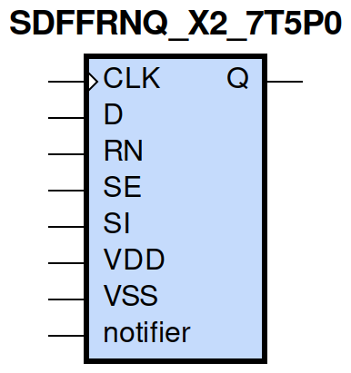
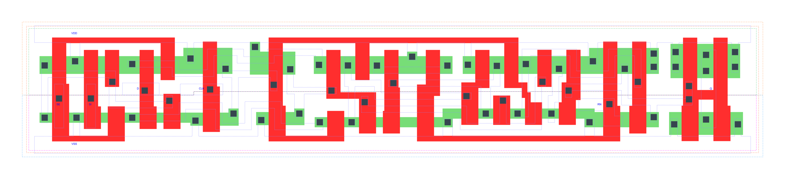

=======================================
gf180mcu_fd_sc_mcu7t5v0__sdffrnq_x2
=======================================

**gf180mcu_fd_sc_mcu7t5v0__sdffrnq_x2 symbol**

**gf180mcu_fd_sc_mcu7t5v0__sdffrnq_x2 schematic**

.. image:: sc7_sch/SDFFRNQ_X2_sch.png
    :height: 300px
    :width: 500 px
    :align: center
    :alt: gf180mcu_fd_sc_mcu7t5v0__sdffrnq_x2 schematic

**gf180mcu_fd_sc_mcu7t5v0__sdffrnq_x2 layout**

.. include:: images.rst

SDFFRNQ_X2 is a positive edge triggered scan D-type flip flop, active low reset, 2X drive strength

|
| Attributes

============= ======================
**Attribute** **Value**
area          98.784000 µm\ :sup:`2`
============= ======================

|

TRUTH TABLE

===== == == = === ======
Input             Output
RN    SE SI D CLK Q
H     L  X  L ↑   L
H     L  X  H ↑   H
H     H  L  X ↑   L
H     H  H  X ↑   H
L     X  X  X X   L
===== == == = === ======

|
| FUNCTIONAL SCHEMATIC
| |image629|
| CONSTRAINTS

================== =============== ============= ============
**Constraint Pin** **Related Pin** **setup(ns)** **hold(ns)**
SE(LH)             CLK(LH)         0.5610        -0.2520
SE(LH)             CLK(LH)         0.7390        -0.0860
SE(HL)             CLK(LH)         0.6300        -0.0520
SE(HL)             CLK(LH)         0.6410        -0.3610
SI(HL)             CLK(LH)         0.7040        -0.0860
SI(HL)             CLK(LH)         0.7100        -0.0520
SI(LH)             CLK(LH)         0.6070        -0.3030
SI(LH)             CLK(LH)         0.5900        -0.2920
D(HL)              CLK(LH)         0.6130        -0.0400
D(HL)              CLK(LH)         0.6130        -0.0400
D(LH)              CLK(LH)         0.5270        -0.2460
D(LH)              CLK(LH)         0.5270        -0.2460
================== =============== ============= ============

|

================== =============== ================ ===============
**Constraint Pin** **Related Pin** **recovery(ns)** **removal(ns)**
RN(LH)             CLK(LH)         -0.2120          0.3840
RN(LH)             CLK(LH)         -0.2120          0.3840
RN(LH)             CLK(LH)         -0.2120          0.3840
RN(LH)             CLK(LH)         -0.2120          0.3840
================== =============== ================ ===============

|

================== =============== ===========================
**Constraint Pin** **Related Pin** **Minimum Pulse Width(ns)**
CLK(HLH)           CLK(HL)         0.7230
CLK(HLH)           CLK(HL)         0.7420
CLK(HLH)           CLK(HL)         0.7230
CLK(HLH)           CLK(HL)         0.6560
CLK(HLH)           CLK(HL)         0.5710
CLK(HLH)           CLK(HL)         0.8030
CLK(HLH)           CLK(HL)         0.5770
CLK(HLH)           CLK(HL)         0.6140
CLK(LHL)           CLK(LH)         0.4170
CLK(LHL)           CLK(LH)         0.4170
CLK(LHL)           CLK(LH)         0.4170
CLK(LHL)           CLK(LH)         0.4850
CLK(LHL)           CLK(LH)         0.4850
CLK(LHL)           CLK(LH)         0.4170
CLK(LHL)           CLK(LH)         0.4850
CLK(LHL)           CLK(LH)         0.4850
RN(HLH)            RN(HL)          0.3290
RN(HLH)            RN(HL)          0.3290
RN(HLH)            RN(HL)          0.3290
RN(HLH)            RN(HL)          0.3290
RN(HLH)            RN(HL)          0.4270
RN(HLH)            RN(HL)          0.4270
RN(HLH)            RN(HL)          0.4270
RN(HLH)            RN(HL)          0.4270
RN(HLH)            RN(HL)          0.3290
RN(HLH)            RN(HL)          0.3290
RN(HLH)            RN(HL)          0.3290
RN(HLH)            RN(HL)          0.4270
RN(HLH)            RN(HL)          0.4270
RN(HLH)            RN(HL)          0.4270
RN(HLH)            RN(HL)          0.4270
RN(HLH)            RN(HL)          0.3290
================== =============== ===========================

|
| PIN CAPACITANCE (pf)

======= ======== ====================
**Pin** **Type** **Capacitance (pf)**
SE      input    0.0061
SI      input    0.0027
D       input    0.0028
CLK     input    0.0036
RN      input    0.0069
======= ======== ====================

|
| DELAY AND OUTPUT TRANSITION TIME corresponding to min slew and load

+---------------+------------+--------------------+--------------+-------------------+----------------+---------------+
| **Input Pin** | **Output** | **When Condition** | **Tin (ns)** | **Out Load (pf)** | **Delay (ns)** | **Tout (ns)** |
+---------------+------------+--------------------+--------------+-------------------+----------------+---------------+
| CLK(LH)       | Q(HL)      | !D&RN&!SE&!SI      | 0.0100       | 0.0010            | 0.6599         | 0.0401        |
+---------------+------------+--------------------+--------------+-------------------+----------------+---------------+
| CLK(LH)       | Q(HL)      | !D&RN&!SE&SI       | 0.0100       | 0.0010            | 0.6599         | 0.0401        |
+---------------+------------+--------------------+--------------+-------------------+----------------+---------------+
| CLK(LH)       | Q(HL)      | !D&RN&SE&!SI       | 0.0100       | 0.0010            | 0.6600         | 0.0401        |
+---------------+------------+--------------------+--------------+-------------------+----------------+---------------+
| CLK(LH)       | Q(HL)      | D&RN&SE&!SI        | 0.0100       | 0.0010            | 0.6597         | 0.0402        |
+---------------+------------+--------------------+--------------+-------------------+----------------+---------------+
| CLK(LH)       | Q(LH)      | !D&RN&SE&SI        | 0.0100       | 0.0010            | 0.7238         | 0.0476        |
+---------------+------------+--------------------+--------------+-------------------+----------------+---------------+
| CLK(LH)       | Q(LH)      | D&RN&!SE&!SI       | 0.0100       | 0.0010            | 0.7238         | 0.0478        |
+---------------+------------+--------------------+--------------+-------------------+----------------+---------------+
| CLK(LH)       | Q(LH)      | D&RN&!SE&SI        | 0.0100       | 0.0010            | 0.7238         | 0.0478        |
+---------------+------------+--------------------+--------------+-------------------+----------------+---------------+
| CLK(LH)       | Q(LH)      | D&RN&SE&SI         | 0.0100       | 0.0010            | 0.7238         | 0.0477        |
+---------------+------------+--------------------+--------------+-------------------+----------------+---------------+
| RN(HL)        | Q(HL)      | !CLK&!D&!SE&!SI    | 0.0100       | 0.0010            | 0.2232         | 0.0405        |
+---------------+------------+--------------------+--------------+-------------------+----------------+---------------+
| RN(HL)        | Q(HL)      | !CLK&D&SE&!SI      | 0.0100       | 0.0010            | 0.2232         | 0.0405        |
+---------------+------------+--------------------+--------------+-------------------+----------------+---------------+
| RN(HL)        | Q(HL)      | !CLK&D&!SE&SI      | 0.0100       | 0.0010            | 0.2232         | 0.0405        |
+---------------+------------+--------------------+--------------+-------------------+----------------+---------------+
| RN(HL)        | Q(HL)      | !CLK&D&SE&SI       | 0.0100       | 0.0010            | 0.2232         | 0.0405        |
+---------------+------------+--------------------+--------------+-------------------+----------------+---------------+
| RN(HL)        | Q(HL)      | CLK&D&!SE&!SI      | 0.0100       | 0.0010            | 0.2232         | 0.0403        |
+---------------+------------+--------------------+--------------+-------------------+----------------+---------------+
| RN(HL)        | Q(HL)      | CLK&D&SE&!SI       | 0.0100       | 0.0010            | 0.2233         | 0.0402        |
+---------------+------------+--------------------+--------------+-------------------+----------------+---------------+
| RN(HL)        | Q(HL)      | CLK&D&!SE&SI       | 0.0100       | 0.0010            | 0.2232         | 0.0403        |
+---------------+------------+--------------------+--------------+-------------------+----------------+---------------+
| RN(HL)        | Q(HL)      | CLK&D&SE&SI        | 0.0100       | 0.0010            | 0.2232         | 0.0403        |
+---------------+------------+--------------------+--------------+-------------------+----------------+---------------+
| RN(HL)        | Q(HL)      | !CLK&!D&SE&!SI     | 0.0100       | 0.0010            | 0.2232         | 0.0405        |
+---------------+------------+--------------------+--------------+-------------------+----------------+---------------+
| RN(HL)        | Q(HL)      | !CLK&!D&!SE&SI     | 0.0100       | 0.0010            | 0.2232         | 0.0405        |
+---------------+------------+--------------------+--------------+-------------------+----------------+---------------+
| RN(HL)        | Q(HL)      | !CLK&!D&SE&SI      | 0.0100       | 0.0010            | 0.2232         | 0.0405        |
+---------------+------------+--------------------+--------------+-------------------+----------------+---------------+
| RN(HL)        | Q(HL)      | CLK&!D&!SE&!SI     | 0.0100       | 0.0010            | 0.2232         | 0.0403        |
+---------------+------------+--------------------+--------------+-------------------+----------------+---------------+
| RN(HL)        | Q(HL)      | CLK&!D&SE&!SI      | 0.0100       | 0.0010            | 0.2233         | 0.0402        |
+---------------+------------+--------------------+--------------+-------------------+----------------+---------------+
| RN(HL)        | Q(HL)      | CLK&!D&!SE&SI      | 0.0100       | 0.0010            | 0.2232         | 0.0403        |
+---------------+------------+--------------------+--------------+-------------------+----------------+---------------+
| RN(HL)        | Q(HL)      | CLK&!D&SE&SI       | 0.0100       | 0.0010            | 0.2232         | 0.0403        |
+---------------+------------+--------------------+--------------+-------------------+----------------+---------------+
| RN(HL)        | Q(HL)      | !CLK&D&!SE&!SI     | 0.0100       | 0.0010            | 0.2232         | 0.0405        |
+---------------+------------+--------------------+--------------+-------------------+----------------+---------------+

|
| DYNAMIC ENERGY

+---------------+--------------------+--------------+------------+-------------------+---------------------+
| **Input Pin** | **When Condition** | **Tin (ns)** | **Output** | **Out Load (pf)** | **Energy (uW/MHz)** |
+---------------+--------------------+--------------+------------+-------------------+---------------------+
| CLK           | !D&RN&!SE&!SI      | 0.0100       | Q(HL)      | 0.0010            | 0.7319              |
+---------------+--------------------+--------------+------------+-------------------+---------------------+
| CLK           | !D&RN&!SE&SI       | 0.0100       | Q(HL)      | 0.0010            | 0.7320              |
+---------------+--------------------+--------------+------------+-------------------+---------------------+
| CLK           | !D&RN&SE&!SI       | 0.0100       | Q(HL)      | 0.0010            | 0.7321              |
+---------------+--------------------+--------------+------------+-------------------+---------------------+
| CLK           | D&RN&SE&!SI        | 0.0100       | Q(HL)      | 0.0010            | 0.7319              |
+---------------+--------------------+--------------+------------+-------------------+---------------------+
| CLK           | !D&RN&SE&SI        | 0.0100       | Q(LH)      | 0.0010            | 0.7799              |
+---------------+--------------------+--------------+------------+-------------------+---------------------+
| CLK           | D&RN&!SE&!SI       | 0.0100       | Q(LH)      | 0.0010            | 0.7797              |
+---------------+--------------------+--------------+------------+-------------------+---------------------+
| CLK           | D&RN&!SE&SI        | 0.0100       | Q(LH)      | 0.0010            | 0.7797              |
+---------------+--------------------+--------------+------------+-------------------+---------------------+
| CLK           | D&RN&SE&SI         | 0.0100       | Q(LH)      | 0.0010            | 0.7798              |
+---------------+--------------------+--------------+------------+-------------------+---------------------+
| RN            | !CLK&!D&!SE&!SI    | 0.0100       | Q(HL)      | 0.0010            | 0.5311              |
+---------------+--------------------+--------------+------------+-------------------+---------------------+
| RN            | !CLK&D&SE&!SI      | 0.0100       | Q(HL)      | 0.0010            | 0.5311              |
+---------------+--------------------+--------------+------------+-------------------+---------------------+
| RN            | !CLK&D&!SE&SI      | 0.0100       | Q(HL)      | 0.0010            | 0.5470              |
+---------------+--------------------+--------------+------------+-------------------+---------------------+
| RN            | !CLK&D&SE&SI       | 0.0100       | Q(HL)      | 0.0010            | 0.5470              |
+---------------+--------------------+--------------+------------+-------------------+---------------------+
| RN            | CLK&D&!SE&!SI      | 0.0100       | Q(HL)      | 0.0010            | 0.7573              |
+---------------+--------------------+--------------+------------+-------------------+---------------------+
| RN            | CLK&D&SE&!SI       | 0.0100       | Q(HL)      | 0.0010            | 0.7573              |
+---------------+--------------------+--------------+------------+-------------------+---------------------+
| RN            | CLK&D&!SE&SI       | 0.0100       | Q(HL)      | 0.0010            | 0.7573              |
+---------------+--------------------+--------------+------------+-------------------+---------------------+
| RN            | CLK&D&SE&SI        | 0.0100       | Q(HL)      | 0.0010            | 0.7573              |
+---------------+--------------------+--------------+------------+-------------------+---------------------+
| RN            | !CLK&!D&SE&!SI     | 0.0100       | Q(HL)      | 0.0010            | 0.5310              |
+---------------+--------------------+--------------+------------+-------------------+---------------------+
| RN            | !CLK&!D&!SE&SI     | 0.0100       | Q(HL)      | 0.0010            | 0.5311              |
+---------------+--------------------+--------------+------------+-------------------+---------------------+
| RN            | !CLK&!D&SE&SI      | 0.0100       | Q(HL)      | 0.0010            | 0.5470              |
+---------------+--------------------+--------------+------------+-------------------+---------------------+
| RN            | CLK&!D&!SE&!SI     | 0.0100       | Q(HL)      | 0.0010            | 0.7574              |
+---------------+--------------------+--------------+------------+-------------------+---------------------+
| RN            | CLK&!D&SE&!SI      | 0.0100       | Q(HL)      | 0.0010            | 0.7573              |
+---------------+--------------------+--------------+------------+-------------------+---------------------+
| RN            | CLK&!D&!SE&SI      | 0.0100       | Q(HL)      | 0.0010            | 0.7574              |
+---------------+--------------------+--------------+------------+-------------------+---------------------+
| RN            | CLK&!D&SE&SI       | 0.0100       | Q(HL)      | 0.0010            | 0.7573              |
+---------------+--------------------+--------------+------------+-------------------+---------------------+
| RN            | !CLK&D&!SE&!SI     | 0.0100       | Q(HL)      | 0.0010            | 0.5470              |
+---------------+--------------------+--------------+------------+-------------------+---------------------+
| D(HL)         | !CLK&!RN&!SE&!SI   | 0.0100       | n/a        | n/a               | 0.3510              |
+---------------+--------------------+--------------+------------+-------------------+---------------------+
| D(HL)         | !CLK&!RN&!SE&SI    | 0.0100       | n/a        | n/a               | 0.3510              |
+---------------+--------------------+--------------+------------+-------------------+---------------------+
| D(HL)         | !CLK&!RN&SE&!SI    | 0.0100       | n/a        | n/a               | 0.0203              |
+---------------+--------------------+--------------+------------+-------------------+---------------------+
| D(HL)         | !CLK&!RN&SE&SI     | 0.0100       | n/a        | n/a               | 0.0100              |
+---------------+--------------------+--------------+------------+-------------------+---------------------+
| D(HL)         | CLK&!RN&!SE&!SI    | 0.0100       | n/a        | n/a               | 0.0245              |
+---------------+--------------------+--------------+------------+-------------------+---------------------+
| D(HL)         | CLK&!RN&!SE&SI     | 0.0100       | n/a        | n/a               | 0.0245              |
+---------------+--------------------+--------------+------------+-------------------+---------------------+
| D(HL)         | CLK&!RN&SE&!SI     | 0.0100       | n/a        | n/a               | 0.0236              |
+---------------+--------------------+--------------+------------+-------------------+---------------------+
| D(HL)         | CLK&!RN&SE&SI      | 0.0100       | n/a        | n/a               | 0.0095              |
+---------------+--------------------+--------------+------------+-------------------+---------------------+
| D(HL)         | CLK&RN&!SE&!SI     | 0.0100       | n/a        | n/a               | 0.0567              |
+---------------+--------------------+--------------+------------+-------------------+---------------------+
| D(HL)         | CLK&RN&SE&!SI      | 0.0100       | n/a        | n/a               | 0.0202              |
+---------------+--------------------+--------------+------------+-------------------+---------------------+
| D(HL)         | CLK&RN&!SE&SI      | 0.0100       | n/a        | n/a               | 0.0567              |
+---------------+--------------------+--------------+------------+-------------------+---------------------+
| D(HL)         | CLK&RN&SE&SI       | 0.0100       | n/a        | n/a               | 0.0091              |
+---------------+--------------------+--------------+------------+-------------------+---------------------+
| D(HL)         | !CLK&RN&!SE&!SI    | 0.0100       | n/a        | n/a               | 0.3385              |
+---------------+--------------------+--------------+------------+-------------------+---------------------+
| D(HL)         | !CLK&RN&SE&!SI     | 0.0100       | n/a        | n/a               | 0.0203              |
+---------------+--------------------+--------------+------------+-------------------+---------------------+
| D(HL)         | !CLK&RN&!SE&SI     | 0.0100       | n/a        | n/a               | 0.3385              |
+---------------+--------------------+--------------+------------+-------------------+---------------------+
| D(HL)         | !CLK&RN&SE&SI      | 0.0100       | n/a        | n/a               | 0.0100              |
+---------------+--------------------+--------------+------------+-------------------+---------------------+
| SE(LH)        | !CLK&!D&!RN&!SI    | 0.0100       | n/a        | n/a               | 0.0024              |
+---------------+--------------------+--------------+------------+-------------------+---------------------+
| SE(LH)        | !CLK&!D&!RN&SI     | 0.0100       | n/a        | n/a               | 0.2023              |
+---------------+--------------------+--------------+------------+-------------------+---------------------+
| SE(LH)        | !CLK&D&!RN&!SI     | 0.0100       | n/a        | n/a               | 0.3722              |
+---------------+--------------------+--------------+------------+-------------------+---------------------+
| SE(LH)        | !CLK&D&!RN&SI      | 0.0100       | n/a        | n/a               | -0.0060             |
+---------------+--------------------+--------------+------------+-------------------+---------------------+
| SE(LH)        | CLK&!D&!RN&!SI     | 0.0100       | n/a        | n/a               | 0.0012              |
+---------------+--------------------+--------------+------------+-------------------+---------------------+
| SE(LH)        | CLK&!D&!RN&SI      | 0.0100       | n/a        | n/a               | -0.0048             |
+---------------+--------------------+--------------+------------+-------------------+---------------------+
| SE(LH)        | CLK&D&!RN&!SI      | 0.0100       | n/a        | n/a               | 0.0036              |
+---------------+--------------------+--------------+------------+-------------------+---------------------+
| SE(LH)        | CLK&D&!RN&SI       | 0.0100       | n/a        | n/a               | -0.0080             |
+---------------+--------------------+--------------+------------+-------------------+---------------------+
| SE(LH)        | !CLK&D&RN&!SI      | 0.0100       | n/a        | n/a               | 0.3592              |
+---------------+--------------------+--------------+------------+-------------------+---------------------+
| SE(LH)        | !CLK&D&RN&SI       | 0.0100       | n/a        | n/a               | -0.0060             |
+---------------+--------------------+--------------+------------+-------------------+---------------------+
| SE(LH)        | CLK&D&RN&!SI       | 0.0100       | n/a        | n/a               | 0.0399              |
+---------------+--------------------+--------------+------------+-------------------+---------------------+
| SE(LH)        | CLK&D&RN&SI        | 0.0100       | n/a        | n/a               | -0.0077             |
+---------------+--------------------+--------------+------------+-------------------+---------------------+
| SE(LH)        | !CLK&!D&RN&!SI     | 0.0100       | n/a        | n/a               | 0.0025              |
+---------------+--------------------+--------------+------------+-------------------+---------------------+
| SE(LH)        | !CLK&!D&RN&SI      | 0.0100       | n/a        | n/a               | 0.2080              |
+---------------+--------------------+--------------+------------+-------------------+---------------------+
| SE(LH)        | CLK&!D&RN&!SI      | 0.0100       | n/a        | n/a               | 0.0012              |
+---------------+--------------------+--------------+------------+-------------------+---------------------+
| SE(LH)        | CLK&!D&RN&SI       | 0.0100       | n/a        | n/a               | -0.0048             |
+---------------+--------------------+--------------+------------+-------------------+---------------------+
| CLK(LH)       | !D&!RN&!SE&!SI     | 0.0100       | n/a        | n/a               | 0.2290              |
+---------------+--------------------+--------------+------------+-------------------+---------------------+
| CLK(LH)       | !D&!RN&!SE&SI      | 0.0100       | n/a        | n/a               | 0.2289              |
+---------------+--------------------+--------------+------------+-------------------+---------------------+
| CLK(LH)       | !D&!RN&SE&!SI      | 0.0100       | n/a        | n/a               | 0.2289              |
+---------------+--------------------+--------------+------------+-------------------+---------------------+
| CLK(LH)       | !D&!RN&SE&SI       | 0.0100       | n/a        | n/a               | 0.4819              |
+---------------+--------------------+--------------+------------+-------------------+---------------------+
| CLK(LH)       | D&!RN&!SE&!SI      | 0.0100       | n/a        | n/a               | 0.4818              |
+---------------+--------------------+--------------+------------+-------------------+---------------------+
| CLK(LH)       | D&!RN&!SE&SI       | 0.0100       | n/a        | n/a               | 0.4818              |
+---------------+--------------------+--------------+------------+-------------------+---------------------+
| CLK(LH)       | D&!RN&SE&!SI       | 0.0100       | n/a        | n/a               | 0.2289              |
+---------------+--------------------+--------------+------------+-------------------+---------------------+
| CLK(LH)       | D&!RN&SE&SI        | 0.0100       | n/a        | n/a               | 0.4819              |
+---------------+--------------------+--------------+------------+-------------------+---------------------+
| CLK(LH)       | D&RN&!SE&!SI       | 0.0100       | n/a        | n/a               | 0.2239              |
+---------------+--------------------+--------------+------------+-------------------+---------------------+
| CLK(LH)       | D&RN&SE&!SI        | 0.0100       | n/a        | n/a               | 0.2289              |
+---------------+--------------------+--------------+------------+-------------------+---------------------+
| CLK(LH)       | D&RN&!SE&SI        | 0.0100       | n/a        | n/a               | 0.2239              |
+---------------+--------------------+--------------+------------+-------------------+---------------------+
| CLK(LH)       | D&RN&SE&SI         | 0.0100       | n/a        | n/a               | 0.2240              |
+---------------+--------------------+--------------+------------+-------------------+---------------------+
| CLK(LH)       | !D&RN&!SE&!SI      | 0.0100       | n/a        | n/a               | 0.2289              |
+---------------+--------------------+--------------+------------+-------------------+---------------------+
| CLK(LH)       | !D&RN&SE&!SI       | 0.0100       | n/a        | n/a               | 0.2290              |
+---------------+--------------------+--------------+------------+-------------------+---------------------+
| CLK(LH)       | !D&RN&!SE&SI       | 0.0100       | n/a        | n/a               | 0.2290              |
+---------------+--------------------+--------------+------------+-------------------+---------------------+
| CLK(LH)       | !D&RN&SE&SI        | 0.0100       | n/a        | n/a               | 0.2240              |
+---------------+--------------------+--------------+------------+-------------------+---------------------+
| SI(LH)        | !CLK&!D&!RN&!SE    | 0.0100       | n/a        | n/a               | -0.0198             |
+---------------+--------------------+--------------+------------+-------------------+---------------------+
| SI(LH)        | !CLK&!D&!RN&SE     | 0.0100       | n/a        | n/a               | 0.2014              |
+---------------+--------------------+--------------+------------+-------------------+---------------------+
| SI(LH)        | !CLK&D&!RN&!SE     | 0.0100       | n/a        | n/a               | -0.0183             |
+---------------+--------------------+--------------+------------+-------------------+---------------------+
| SI(LH)        | !CLK&D&!RN&SE      | 0.0100       | n/a        | n/a               | 0.1884              |
+---------------+--------------------+--------------+------------+-------------------+---------------------+
| SI(LH)        | CLK&!D&!RN&!SE     | 0.0100       | n/a        | n/a               | -0.0198             |
+---------------+--------------------+--------------+------------+-------------------+---------------------+
| SI(LH)        | CLK&!D&!RN&SE      | 0.0100       | n/a        | n/a               | -0.0158             |
+---------------+--------------------+--------------+------------+-------------------+---------------------+
| SI(LH)        | CLK&D&!RN&!SE      | 0.0100       | n/a        | n/a               | -0.0188             |
+---------------+--------------------+--------------+------------+-------------------+---------------------+
| SI(LH)        | CLK&D&!RN&SE       | 0.0100       | n/a        | n/a               | -0.0158             |
+---------------+--------------------+--------------+------------+-------------------+---------------------+
| SI(LH)        | !CLK&D&RN&!SE      | 0.0100       | n/a        | n/a               | -0.0183             |
+---------------+--------------------+--------------+------------+-------------------+---------------------+
| SI(LH)        | !CLK&D&RN&SE       | 0.0100       | n/a        | n/a               | 0.1941              |
+---------------+--------------------+--------------+------------+-------------------+---------------------+
| SI(LH)        | CLK&D&RN&!SE       | 0.0100       | n/a        | n/a               | -0.0184             |
+---------------+--------------------+--------------+------------+-------------------+---------------------+
| SI(LH)        | CLK&D&RN&SE        | 0.0100       | n/a        | n/a               | -0.0158             |
+---------------+--------------------+--------------+------------+-------------------+---------------------+
| SI(LH)        | !CLK&!D&RN&!SE     | 0.0100       | n/a        | n/a               | -0.0198             |
+---------------+--------------------+--------------+------------+-------------------+---------------------+
| SI(LH)        | !CLK&!D&RN&SE      | 0.0100       | n/a        | n/a               | 0.2071              |
+---------------+--------------------+--------------+------------+-------------------+---------------------+
| SI(LH)        | CLK&!D&RN&!SE      | 0.0100       | n/a        | n/a               | -0.0198             |
+---------------+--------------------+--------------+------------+-------------------+---------------------+
| SI(LH)        | CLK&!D&RN&SE       | 0.0100       | n/a        | n/a               | -0.0158             |
+---------------+--------------------+--------------+------------+-------------------+---------------------+
| SE(HL)        | !CLK&!D&!RN&!SI    | 0.0100       | n/a        | n/a               | 0.1316              |
+---------------+--------------------+--------------+------------+-------------------+---------------------+
| SE(HL)        | !CLK&!D&!RN&SI     | 0.0100       | n/a        | n/a               | 0.4773              |
+---------------+--------------------+--------------+------------+-------------------+---------------------+
| SE(HL)        | !CLK&D&!RN&!SI     | 0.0100       | n/a        | n/a               | 0.3297              |
+---------------+--------------------+--------------+------------+-------------------+---------------------+
| SE(HL)        | !CLK&D&!RN&SI      | 0.0100       | n/a        | n/a               | 0.1337              |
+---------------+--------------------+--------------+------------+-------------------+---------------------+
| SE(HL)        | CLK&!D&!RN&!SI     | 0.0100       | n/a        | n/a               | 0.1363              |
+---------------+--------------------+--------------+------------+-------------------+---------------------+
| SE(HL)        | CLK&!D&!RN&SI      | 0.0100       | n/a        | n/a               | 0.1354              |
+---------------+--------------------+--------------+------------+-------------------+---------------------+
| SE(HL)        | CLK&D&!RN&!SI      | 0.0100       | n/a        | n/a               | 0.1353              |
+---------------+--------------------+--------------+------------+-------------------+---------------------+
| SE(HL)        | CLK&D&!RN&SI       | 0.0100       | n/a        | n/a               | 0.1383              |
+---------------+--------------------+--------------+------------+-------------------+---------------------+
| SE(HL)        | !CLK&D&RN&!SI      | 0.0100       | n/a        | n/a               | 0.3356              |
+---------------+--------------------+--------------+------------+-------------------+---------------------+
| SE(HL)        | !CLK&D&RN&SI       | 0.0100       | n/a        | n/a               | 0.1337              |
+---------------+--------------------+--------------+------------+-------------------+---------------------+
| SE(HL)        | CLK&D&RN&!SI       | 0.0100       | n/a        | n/a               | 0.1368              |
+---------------+--------------------+--------------+------------+-------------------+---------------------+
| SE(HL)        | CLK&D&RN&SI        | 0.0100       | n/a        | n/a               | 0.1337              |
+---------------+--------------------+--------------+------------+-------------------+---------------------+
| SE(HL)        | !CLK&!D&RN&!SI     | 0.0100       | n/a        | n/a               | 0.1317              |
+---------------+--------------------+--------------+------------+-------------------+---------------------+
| SE(HL)        | !CLK&!D&RN&SI      | 0.0100       | n/a        | n/a               | 0.4648              |
+---------------+--------------------+--------------+------------+-------------------+---------------------+
| SE(HL)        | CLK&!D&RN&!SI      | 0.0100       | n/a        | n/a               | 0.1315              |
+---------------+--------------------+--------------+------------+-------------------+---------------------+
| SE(HL)        | CLK&!D&RN&SI       | 0.0100       | n/a        | n/a               | 0.1833              |
+---------------+--------------------+--------------+------------+-------------------+---------------------+
| CLK(HL)       | !D&!RN&!SE&!SI     | 0.0100       | n/a        | n/a               | 0.3422              |
+---------------+--------------------+--------------+------------+-------------------+---------------------+
| CLK(HL)       | !D&!RN&!SE&SI      | 0.0100       | n/a        | n/a               | 0.3422              |
+---------------+--------------------+--------------+------------+-------------------+---------------------+
| CLK(HL)       | !D&!RN&SE&!SI      | 0.0100       | n/a        | n/a               | 0.3615              |
+---------------+--------------------+--------------+------------+-------------------+---------------------+
| CLK(HL)       | !D&!RN&SE&SI       | 0.0100       | n/a        | n/a               | 0.4923              |
+---------------+--------------------+--------------+------------+-------------------+---------------------+
| CLK(HL)       | D&!RN&!SE&!SI      | 0.0100       | n/a        | n/a               | 0.4627              |
+---------------+--------------------+--------------+------------+-------------------+---------------------+
| CLK(HL)       | D&!RN&!SE&SI       | 0.0100       | n/a        | n/a               | 0.4627              |
+---------------+--------------------+--------------+------------+-------------------+---------------------+
| CLK(HL)       | D&!RN&SE&!SI       | 0.0100       | n/a        | n/a               | 0.3840              |
+---------------+--------------------+--------------+------------+-------------------+---------------------+
| CLK(HL)       | D&!RN&SE&SI        | 0.0100       | n/a        | n/a               | 0.4775              |
+---------------+--------------------+--------------+------------+-------------------+---------------------+
| CLK(HL)       | D&RN&!SE&!SI       | 0.0100       | n/a        | n/a               | 0.2817              |
+---------------+--------------------+--------------+------------+-------------------+---------------------+
| CLK(HL)       | D&RN&SE&!SI        | 0.0100       | n/a        | n/a               | 0.2822              |
+---------------+--------------------+--------------+------------+-------------------+---------------------+
| CLK(HL)       | D&RN&!SE&SI        | 0.0100       | n/a        | n/a               | 0.2817              |
+---------------+--------------------+--------------+------------+-------------------+---------------------+
| CLK(HL)       | D&RN&SE&SI         | 0.0100       | n/a        | n/a               | 0.2816              |
+---------------+--------------------+--------------+------------+-------------------+---------------------+
| CLK(HL)       | !D&RN&!SE&!SI      | 0.0100       | n/a        | n/a               | 0.2822              |
+---------------+--------------------+--------------+------------+-------------------+---------------------+
| CLK(HL)       | !D&RN&SE&!SI       | 0.0100       | n/a        | n/a               | 0.2822              |
+---------------+--------------------+--------------+------------+-------------------+---------------------+
| CLK(HL)       | !D&RN&!SE&SI       | 0.0100       | n/a        | n/a               | 0.2822              |
+---------------+--------------------+--------------+------------+-------------------+---------------------+
| CLK(HL)       | !D&RN&SE&SI        | 0.0100       | n/a        | n/a               | 0.2816              |
+---------------+--------------------+--------------+------------+-------------------+---------------------+
| SI(HL)        | !CLK&!D&!RN&!SE    | 0.0100       | n/a        | n/a               | 0.0203              |
+---------------+--------------------+--------------+------------+-------------------+---------------------+
| SI(HL)        | !CLK&!D&!RN&SE     | 0.0100       | n/a        | n/a               | 0.4049              |
+---------------+--------------------+--------------+------------+-------------------+---------------------+
| SI(HL)        | !CLK&D&!RN&!SE     | 0.0100       | n/a        | n/a               | 0.0202              |
+---------------+--------------------+--------------+------------+-------------------+---------------------+
| SI(HL)        | !CLK&D&!RN&SE      | 0.0100       | n/a        | n/a               | 0.4126              |
+---------------+--------------------+--------------+------------+-------------------+---------------------+
| SI(HL)        | CLK&!D&!RN&!SE     | 0.0100       | n/a        | n/a               | 0.0202              |
+---------------+--------------------+--------------+------------+-------------------+---------------------+
| SI(HL)        | CLK&!D&!RN&SE      | 0.0100       | n/a        | n/a               | 0.0217              |
+---------------+--------------------+--------------+------------+-------------------+---------------------+
| SI(HL)        | CLK&D&!RN&!SE      | 0.0100       | n/a        | n/a               | 0.0202              |
+---------------+--------------------+--------------+------------+-------------------+---------------------+
| SI(HL)        | CLK&D&!RN&SE       | 0.0100       | n/a        | n/a               | 0.0218              |
+---------------+--------------------+--------------+------------+-------------------+---------------------+
| SI(HL)        | !CLK&D&RN&!SE      | 0.0100       | n/a        | n/a               | 0.0202              |
+---------------+--------------------+--------------+------------+-------------------+---------------------+
| SI(HL)        | !CLK&D&RN&SE       | 0.0100       | n/a        | n/a               | 0.3996              |
+---------------+--------------------+--------------+------------+-------------------+---------------------+
| SI(HL)        | CLK&D&RN&!SE       | 0.0100       | n/a        | n/a               | 0.0202              |
+---------------+--------------------+--------------+------------+-------------------+---------------------+
| SI(HL)        | CLK&D&RN&SE        | 0.0100       | n/a        | n/a               | 0.0730              |
+---------------+--------------------+--------------+------------+-------------------+---------------------+
| SI(HL)        | !CLK&!D&RN&!SE     | 0.0100       | n/a        | n/a               | 0.0203              |
+---------------+--------------------+--------------+------------+-------------------+---------------------+
| SI(HL)        | !CLK&!D&RN&SE      | 0.0100       | n/a        | n/a               | 0.3921              |
+---------------+--------------------+--------------+------------+-------------------+---------------------+
| SI(HL)        | CLK&!D&RN&!SE      | 0.0100       | n/a        | n/a               | 0.0202              |
+---------------+--------------------+--------------+------------+-------------------+---------------------+
| SI(HL)        | CLK&!D&RN&SE       | 0.0100       | n/a        | n/a               | 0.0876              |
+---------------+--------------------+--------------+------------+-------------------+---------------------+
| D(LH)         | !CLK&!RN&!SE&!SI   | 0.0100       | n/a        | n/a               | 0.1772              |
+---------------+--------------------+--------------+------------+-------------------+---------------------+
| D(LH)         | !CLK&!RN&!SE&SI    | 0.0100       | n/a        | n/a               | 0.1772              |
+---------------+--------------------+--------------+------------+-------------------+---------------------+
| D(LH)         | !CLK&!RN&SE&!SI    | 0.0100       | n/a        | n/a               | -0.0186             |
+---------------+--------------------+--------------+------------+-------------------+---------------------+
| D(LH)         | !CLK&!RN&SE&SI     | 0.0100       | n/a        | n/a               | -0.0064             |
+---------------+--------------------+--------------+------------+-------------------+---------------------+
| D(LH)         | CLK&!RN&!SE&!SI    | 0.0100       | n/a        | n/a               | -0.0154             |
+---------------+--------------------+--------------+------------+-------------------+---------------------+
| D(LH)         | CLK&!RN&!SE&SI     | 0.0100       | n/a        | n/a               | -0.0154             |
+---------------+--------------------+--------------+------------+-------------------+---------------------+
| D(LH)         | CLK&!RN&SE&!SI     | 0.0100       | n/a        | n/a               | -0.0197             |
+---------------+--------------------+--------------+------------+-------------------+---------------------+
| D(LH)         | CLK&!RN&SE&SI      | 0.0100       | n/a        | n/a               | -0.0122             |
+---------------+--------------------+--------------+------------+-------------------+---------------------+
| D(LH)         | CLK&RN&!SE&!SI     | 0.0100       | n/a        | n/a               | -0.0155             |
+---------------+--------------------+--------------+------------+-------------------+---------------------+
| D(LH)         | CLK&RN&SE&!SI      | 0.0100       | n/a        | n/a               | -0.0197             |
+---------------+--------------------+--------------+------------+-------------------+---------------------+
| D(LH)         | CLK&RN&!SE&SI      | 0.0100       | n/a        | n/a               | -0.0154             |
+---------------+--------------------+--------------+------------+-------------------+---------------------+
| D(LH)         | CLK&RN&SE&SI       | 0.0100       | n/a        | n/a               | -0.0066             |
+---------------+--------------------+--------------+------------+-------------------+---------------------+
| D(LH)         | !CLK&RN&!SE&!SI    | 0.0100       | n/a        | n/a               | 0.1830              |
+---------------+--------------------+--------------+------------+-------------------+---------------------+
| D(LH)         | !CLK&RN&SE&!SI     | 0.0100       | n/a        | n/a               | -0.0186             |
+---------------+--------------------+--------------+------------+-------------------+---------------------+
| D(LH)         | !CLK&RN&!SE&SI     | 0.0100       | n/a        | n/a               | 0.1830              |
+---------------+--------------------+--------------+------------+-------------------+---------------------+
| D(LH)         | !CLK&RN&SE&SI      | 0.0100       | n/a        | n/a               | -0.0064             |
+---------------+--------------------+--------------+------------+-------------------+---------------------+
| RN(HL)        | !CLK&!D&!SE&!SI    | 0.0100       | n/a        | n/a               | 0.0527              |
+---------------+--------------------+--------------+------------+-------------------+---------------------+
| RN(HL)        | !CLK&D&SE&!SI      | 0.0100       | n/a        | n/a               | 0.0527              |
+---------------+--------------------+--------------+------------+-------------------+---------------------+
| RN(HL)        | !CLK&D&!SE&SI      | 0.0100       | n/a        | n/a               | 0.0513              |
+---------------+--------------------+--------------+------------+-------------------+---------------------+
| RN(HL)        | !CLK&D&SE&SI       | 0.0100       | n/a        | n/a               | 0.0513              |
+---------------+--------------------+--------------+------------+-------------------+---------------------+
| RN(HL)        | CLK&D&!SE&!SI      | 0.0100       | n/a        | n/a               | 0.0540              |
+---------------+--------------------+--------------+------------+-------------------+---------------------+
| RN(HL)        | CLK&D&SE&!SI       | 0.0100       | n/a        | n/a               | 0.0541              |
+---------------+--------------------+--------------+------------+-------------------+---------------------+
| RN(HL)        | CLK&D&!SE&SI       | 0.0100       | n/a        | n/a               | 0.0540              |
+---------------+--------------------+--------------+------------+-------------------+---------------------+
| RN(HL)        | CLK&D&SE&SI        | 0.0100       | n/a        | n/a               | 0.0540              |
+---------------+--------------------+--------------+------------+-------------------+---------------------+
| RN(HL)        | !CLK&!D&SE&!SI     | 0.0100       | n/a        | n/a               | 0.0526              |
+---------------+--------------------+--------------+------------+-------------------+---------------------+
| RN(HL)        | !CLK&!D&!SE&SI     | 0.0100       | n/a        | n/a               | 0.0527              |
+---------------+--------------------+--------------+------------+-------------------+---------------------+
| RN(HL)        | !CLK&!D&SE&SI      | 0.0100       | n/a        | n/a               | 0.0513              |
+---------------+--------------------+--------------+------------+-------------------+---------------------+
| RN(HL)        | CLK&!D&!SE&!SI     | 0.0100       | n/a        | n/a               | 0.0541              |
+---------------+--------------------+--------------+------------+-------------------+---------------------+
| RN(HL)        | CLK&!D&SE&!SI      | 0.0100       | n/a        | n/a               | 0.0541              |
+---------------+--------------------+--------------+------------+-------------------+---------------------+
| RN(HL)        | CLK&!D&!SE&SI      | 0.0100       | n/a        | n/a               | 0.0541              |
+---------------+--------------------+--------------+------------+-------------------+---------------------+
| RN(HL)        | CLK&!D&SE&SI       | 0.0100       | n/a        | n/a               | 0.0540              |
+---------------+--------------------+--------------+------------+-------------------+---------------------+
| RN(HL)        | !CLK&D&!SE&!SI     | 0.0100       | n/a        | n/a               | 0.0513              |
+---------------+--------------------+--------------+------------+-------------------+---------------------+
| RN(LH)        | !CLK&!D&!SE&!SI    | 0.0100       | n/a        | n/a               | -0.0496             |
+---------------+--------------------+--------------+------------+-------------------+---------------------+
| RN(LH)        | !CLK&!D&!SE&SI     | 0.0100       | n/a        | n/a               | -0.0496             |
+---------------+--------------------+--------------+------------+-------------------+---------------------+
| RN(LH)        | !CLK&!D&SE&!SI     | 0.0100       | n/a        | n/a               | -0.0496             |
+---------------+--------------------+--------------+------------+-------------------+---------------------+
| RN(LH)        | !CLK&!D&SE&SI      | 0.0100       | n/a        | n/a               | -0.0462             |
+---------------+--------------------+--------------+------------+-------------------+---------------------+
| RN(LH)        | !CLK&D&!SE&!SI     | 0.0100       | n/a        | n/a               | -0.0462             |
+---------------+--------------------+--------------+------------+-------------------+---------------------+
| RN(LH)        | !CLK&D&!SE&SI      | 0.0100       | n/a        | n/a               | -0.0462             |
+---------------+--------------------+--------------+------------+-------------------+---------------------+
| RN(LH)        | !CLK&D&SE&!SI      | 0.0100       | n/a        | n/a               | -0.0496             |
+---------------+--------------------+--------------+------------+-------------------+---------------------+
| RN(LH)        | !CLK&D&SE&SI       | 0.0100       | n/a        | n/a               | -0.0462             |
+---------------+--------------------+--------------+------------+-------------------+---------------------+
| RN(LH)        | CLK&!D&!SE&!SI     | 0.0100       | n/a        | n/a               | -0.0496             |
+---------------+--------------------+--------------+------------+-------------------+---------------------+
| RN(LH)        | CLK&!D&!SE&SI      | 0.0100       | n/a        | n/a               | -0.0496             |
+---------------+--------------------+--------------+------------+-------------------+---------------------+
| RN(LH)        | CLK&!D&SE&!SI      | 0.0100       | n/a        | n/a               | -0.0496             |
+---------------+--------------------+--------------+------------+-------------------+---------------------+
| RN(LH)        | CLK&!D&SE&SI       | 0.0100       | n/a        | n/a               | -0.0496             |
+---------------+--------------------+--------------+------------+-------------------+---------------------+
| RN(LH)        | CLK&D&!SE&!SI      | 0.0100       | n/a        | n/a               | -0.0496             |
+---------------+--------------------+--------------+------------+-------------------+---------------------+
| RN(LH)        | CLK&D&!SE&SI       | 0.0100       | n/a        | n/a               | -0.0496             |
+---------------+--------------------+--------------+------------+-------------------+---------------------+
| RN(LH)        | CLK&D&SE&!SI       | 0.0100       | n/a        | n/a               | -0.0496             |
+---------------+--------------------+--------------+------------+-------------------+---------------------+
| RN(LH)        | CLK&D&SE&SI        | 0.0100       | n/a        | n/a               | -0.0496             |
+---------------+--------------------+--------------+------------+-------------------+---------------------+

|
| LEAKAGE POWER

=================== ==============
**When Condition**  **Power (nW)**
!CLK&!D&!RN&!SE&!SI 0.4771
!CLK&!D&!RN&!SE&SI  0.4785
!CLK&!D&!RN&SE&!SI  0.5150
!CLK&!D&!RN&SE&SI   0.5417
!CLK&D&!RN&!SE&!SI  0.4721
!CLK&D&!RN&!SE&SI   0.4721
!CLK&D&!RN&SE&!SI   0.5563
!CLK&D&!RN&SE&SI    0.5061
CLK&!D&!RN&!SE&!SI  0.4545
CLK&!D&!RN&!SE&SI   0.4545
CLK&!D&!RN&SE&!SI   0.4532
CLK&!D&!RN&SE&SI    0.4562
CLK&D&!RN&!SE&!SI   0.4576
CLK&D&!RN&!SE&SI    0.4576
CLK&D&!RN&SE&!SI    0.4534
CLK&D&!RN&SE&SI     0.4562
CLK&!D&RN&!SE&!SI   0.4787
CLK&!D&RN&!SE&SI    0.4787
CLK&!D&RN&SE&!SI    0.4773
CLK&D&RN&SE&!SI     0.4772
CLK&!D&RN&SE&SI     0.6675
CLK&D&RN&!SE&!SI    0.6302
CLK&D&RN&!SE&SI     0.6302
CLK&D&RN&SE&SI      0.6493
!CLK&!D&RN&!SE&!SI  0.4774
!CLK&!D&RN&!SE&SI   0.4788
!CLK&!D&RN&SE&!SI   0.5152
!CLK&!D&RN&SE&SI    0.6225
!CLK&D&RN&!SE&!SI   0.5528
!CLK&D&RN&!SE&SI    0.5528
!CLK&D&RN&SE&!SI    0.5566
!CLK&D&RN&SE&SI     0.5869
=================== ==============

