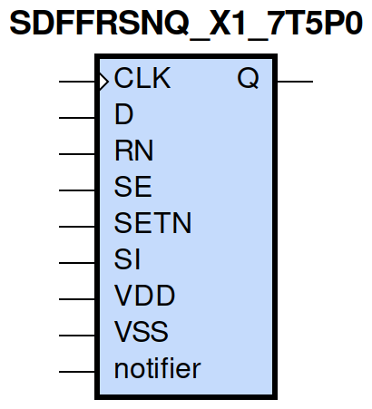
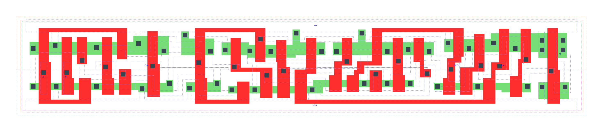

=======================================
gf180mcu_fd_sc_mcu7t5v0__sdffrsnq_x1
=======================================

**gf180mcu_fd_sc_mcu7t5v0__sdffrsnq_x1 symbol**

**gf180mcu_fd_sc_mcu7t5v0__sdffrsnq_x1 schematic**

.. image:: sc7_sch/SDFFRSNQ_X1_sch.png
    :height: 300px
    :width: 500 px
    :align: center
    :alt: gf180mcu_fd_sc_mcu7t5v0__sdffrsnq_x1 schematic

**gf180mcu_fd_sc_mcu7t5v0__sdffrsnq_x1 layout**

.. include:: images.rst

SDFFRSNQ_X1 is a positive edge triggered scan D-type flip flop, active low set/reset, 1X drive strength

|
| Attributes

============= =======================
**Attribute** **Value**
area          105.369600 µm\ :sup:`2`
============= =======================

|

TRUTH TABLE

===== ==== == == = === ======
Input                  Output
RN    SETN SE SI D CLK Q
H     H    L  X  L ↑   L
H     H    L  X  H ↑   H
H     H    H  L  X ↑   L
H     H    H  H  X ↑   H
H     L    X  X  X X   H
L     H    X  X  X X   L
L     L    X  X  X X   L
===== ==== == == = === ======

|
| FUNCTIONAL SCHEMATIC
| |image635|
| CONSTRAINTS

================== =============== ============= ============
**Constraint Pin** **Related Pin** **setup(ns)** **hold(ns)**
SE(LH)             CLK(LH)         0.6010        -0.2460
SE(LH)             CLK(LH)         0.8010        -0.0860
SE(HL)             CLK(LH)         0.6870        -0.0520
SE(HL)             CLK(LH)         0.6810        -0.3490
SI(HL)             CLK(LH)         0.7670        -0.0860
SI(HL)             CLK(LH)         0.7670        -0.0520
SI(LH)             CLK(LH)         0.6470        -0.2920
SI(LH)             CLK(LH)         0.6300        -0.2860
D(HL)              CLK(LH)         0.6700        -0.0340
D(HL)              CLK(LH)         0.6700        -0.0400
D(LH)              CLK(LH)         0.5670        -0.2350
D(LH)              CLK(LH)         0.5670        -0.2350
SETN(LH)           RN(LH)          0.0170        0.0740
SETN(LH)           RN(LH)          0.0170        0.0740
SETN(LH)           RN(LH)          0.0170        0.0740
SETN(LH)           RN(LH)          0.0170        0.0740
SETN(LH)           RN(LH)          -0.0340       0.0970
SETN(LH)           RN(LH)          -0.0340       0.0970
SETN(LH)           RN(LH)          -0.0340       0.0970
SETN(LH)           RN(LH)          -0.0340       0.0970
SETN(LH)           RN(LH)          0.0170        0.0740
SETN(LH)           RN(LH)          0.0170        0.0740
SETN(LH)           RN(LH)          0.0170        0.0740
SETN(LH)           RN(LH)          -0.0340       0.0970
SETN(LH)           RN(LH)          -0.0340       0.0970
SETN(LH)           RN(LH)          -0.0340       0.0970
SETN(LH)           RN(LH)          -0.0340       0.0970
SETN(LH)           RN(LH)          0.0170        0.0740
RN(LH)             SETN(LH)        0.0740        0.0170
RN(LH)             SETN(LH)        0.0740        0.0170
RN(LH)             SETN(LH)        0.0740        0.0170
RN(LH)             SETN(LH)        0.0740        0.0170
RN(LH)             SETN(LH)        0.0970        -0.0340
RN(LH)             SETN(LH)        0.0970        -0.0340
RN(LH)             SETN(LH)        0.0970        -0.0340
RN(LH)             SETN(LH)        0.0970        -0.0340
RN(LH)             SETN(LH)        0.0740        0.0170
RN(LH)             SETN(LH)        0.0740        0.0170
RN(LH)             SETN(LH)        0.0740        0.0170
RN(LH)             SETN(LH)        0.0970        -0.0340
RN(LH)             SETN(LH)        0.0970        -0.0340
RN(LH)             SETN(LH)        0.0970        -0.0340
RN(LH)             SETN(LH)        0.0970        -0.0340
RN(LH)             SETN(LH)        0.0740        0.0170
================== =============== ============= ============

|

================== =============== ================ ===============
**Constraint Pin** **Related Pin** **recovery(ns)** **removal(ns)**
SETN(LH)           CLK(LH)         -0.0110          0.2920
SETN(LH)           CLK(LH)         -0.0110          0.2920
SETN(LH)           CLK(LH)         -0.0110          0.2920
SETN(LH)           CLK(LH)         -0.0110          0.2920
RN(LH)             CLK(LH)         -0.2520          0.4180
RN(LH)             CLK(LH)         -0.2520          0.4180
RN(LH)             CLK(LH)         -0.2520          0.4180
RN(LH)             CLK(LH)         -0.2520          0.4180
================== =============== ================ ===============

|

================== =============== ===========================
**Constraint Pin** **Related Pin** **Minimum Pulse Width(ns)**
CLK(HLH)           CLK(HL)         0.8210
CLK(HLH)           CLK(HL)         0.8460
CLK(HLH)           CLK(HL)         0.8210
CLK(HLH)           CLK(HL)         0.7110
CLK(HLH)           CLK(HL)         0.6320
CLK(HLH)           CLK(HL)         0.9070
CLK(HLH)           CLK(HL)         0.6380
CLK(HLH)           CLK(HL)         0.6750
CLK(LHL)           CLK(LH)         0.4660
CLK(LHL)           CLK(LH)         0.4660
CLK(LHL)           CLK(LH)         0.4660
CLK(LHL)           CLK(LH)         0.5150
CLK(LHL)           CLK(LH)         0.5150
CLK(LHL)           CLK(LH)         0.4660
CLK(LHL)           CLK(LH)         0.5150
CLK(LHL)           CLK(LH)         0.5150
SETN(HLH)          SETN(HL)        0.4660
SETN(HLH)          SETN(HL)        0.4660
SETN(HLH)          SETN(HL)        0.4660
SETN(HLH)          SETN(HL)        0.4660
SETN(HLH)          SETN(HL)        0.4850
SETN(HLH)          SETN(HL)        0.4850
SETN(HLH)          SETN(HL)        0.4850
SETN(HLH)          SETN(HL)        0.4850
SETN(HLH)          SETN(HL)        0.4660
SETN(HLH)          SETN(HL)        0.4660
SETN(HLH)          SETN(HL)        0.4660
SETN(HLH)          SETN(HL)        0.4850
SETN(HLH)          SETN(HL)        0.4850
SETN(HLH)          SETN(HL)        0.4850
SETN(HLH)          SETN(HL)        0.4850
SETN(HLH)          SETN(HL)        0.4660
RN(HLH)            RN(HL)          0.3490
RN(HLH)            RN(HL)          0.3490
RN(HLH)            RN(HL)          0.3490
RN(HLH)            RN(HL)          0.3490
RN(HLH)            RN(HL)          0.4660
RN(HLH)            RN(HL)          0.4660
RN(HLH)            RN(HL)          0.4660
RN(HLH)            RN(HL)          0.4660
RN(HLH)            RN(HL)          0.3490
RN(HLH)            RN(HL)          0.3490
RN(HLH)            RN(HL)          0.3490
RN(HLH)            RN(HL)          0.4660
RN(HLH)            RN(HL)          0.4660
RN(HLH)            RN(HL)          0.4660
RN(HLH)            RN(HL)          0.4660
RN(HLH)            RN(HL)          0.3490
================== =============== ===========================

|
| PIN CAPACITANCE (pf)

======= ======== ====================
**Pin** **Type** **Capacitance (pf)**
SE      input    0.0061
SI      input    0.0027
D       input    0.0027
CLK     input    0.0036
SETN    input    0.0064
RN      input    0.0073
======= ======== ====================

|
| DELAY AND OUTPUT TRANSITION TIME corresponding to min slew and load

+---------------+------------+-----------------------+--------------+-------------------+----------------+---------------+
| **Input Pin** | **Output** | **When Condition**    | **Tin (ns)** | **Out Load (pf)** | **Delay (ns)** | **Tout (ns)** |
+---------------+------------+-----------------------+--------------+-------------------+----------------+---------------+
| CLK(LH)       | Q(HL)      | !D&RN&!SE&SETN&!SI    | 0.0100       | 0.0010            | 0.7121         | 0.0445        |
+---------------+------------+-----------------------+--------------+-------------------+----------------+---------------+
| CLK(LH)       | Q(HL)      | !D&RN&!SE&SETN&SI     | 0.0100       | 0.0010            | 0.7121         | 0.0445        |
+---------------+------------+-----------------------+--------------+-------------------+----------------+---------------+
| CLK(LH)       | Q(HL)      | !D&RN&SE&SETN&!SI     | 0.0100       | 0.0010            | 0.7121         | 0.0445        |
+---------------+------------+-----------------------+--------------+-------------------+----------------+---------------+
| CLK(LH)       | Q(HL)      | D&RN&SE&SETN&!SI      | 0.0100       | 0.0010            | 0.7121         | 0.0444        |
+---------------+------------+-----------------------+--------------+-------------------+----------------+---------------+
| CLK(LH)       | Q(LH)      | !D&RN&SE&SETN&SI      | 0.0100       | 0.0010            | 0.7607         | 0.0571        |
+---------------+------------+-----------------------+--------------+-------------------+----------------+---------------+
| CLK(LH)       | Q(LH)      | D&RN&!SE&SETN&!SI     | 0.0100       | 0.0010            | 0.7609         | 0.0571        |
+---------------+------------+-----------------------+--------------+-------------------+----------------+---------------+
| CLK(LH)       | Q(LH)      | D&RN&!SE&SETN&SI      | 0.0100       | 0.0010            | 0.7609         | 0.0571        |
+---------------+------------+-----------------------+--------------+-------------------+----------------+---------------+
| CLK(LH)       | Q(LH)      | D&RN&SE&SETN&SI       | 0.0100       | 0.0010            | 0.7607         | 0.0571        |
+---------------+------------+-----------------------+--------------+-------------------+----------------+---------------+
| SETN(HL)      | Q(LH)      | !CLK&!D&RN&!SE&!SI    | 0.0100       | 0.0010            | 0.6442         | 0.0567        |
+---------------+------------+-----------------------+--------------+-------------------+----------------+---------------+
| SETN(HL)      | Q(LH)      | !CLK&D&RN&SE&!SI      | 0.0100       | 0.0010            | 0.6442         | 0.0567        |
+---------------+------------+-----------------------+--------------+-------------------+----------------+---------------+
| SETN(HL)      | Q(LH)      | !CLK&D&RN&!SE&SI      | 0.0100       | 0.0010            | 0.6443         | 0.0566        |
+---------------+------------+-----------------------+--------------+-------------------+----------------+---------------+
| SETN(HL)      | Q(LH)      | !CLK&D&RN&SE&SI       | 0.0100       | 0.0010            | 0.6443         | 0.0567        |
+---------------+------------+-----------------------+--------------+-------------------+----------------+---------------+
| SETN(HL)      | Q(LH)      | CLK&D&RN&!SE&!SI      | 0.0100       | 0.0010            | 0.6919         | 0.0569        |
+---------------+------------+-----------------------+--------------+-------------------+----------------+---------------+
| SETN(HL)      | Q(LH)      | CLK&D&RN&SE&!SI       | 0.0100       | 0.0010            | 0.6919         | 0.0566        |
+---------------+------------+-----------------------+--------------+-------------------+----------------+---------------+
| SETN(HL)      | Q(LH)      | CLK&D&RN&!SE&SI       | 0.0100       | 0.0010            | 0.6919         | 0.0569        |
+---------------+------------+-----------------------+--------------+-------------------+----------------+---------------+
| SETN(HL)      | Q(LH)      | CLK&D&RN&SE&SI        | 0.0100       | 0.0010            | 0.6919         | 0.0569        |
+---------------+------------+-----------------------+--------------+-------------------+----------------+---------------+
| SETN(HL)      | Q(LH)      | !CLK&!D&RN&SE&!SI     | 0.0100       | 0.0010            | 0.6442         | 0.0567        |
+---------------+------------+-----------------------+--------------+-------------------+----------------+---------------+
| SETN(HL)      | Q(LH)      | !CLK&!D&RN&!SE&SI     | 0.0100       | 0.0010            | 0.6442         | 0.0567        |
+---------------+------------+-----------------------+--------------+-------------------+----------------+---------------+
| SETN(HL)      | Q(LH)      | !CLK&!D&RN&SE&SI      | 0.0100       | 0.0010            | 0.6443         | 0.0567        |
+---------------+------------+-----------------------+--------------+-------------------+----------------+---------------+
| SETN(HL)      | Q(LH)      | CLK&!D&RN&!SE&!SI     | 0.0100       | 0.0010            | 0.6919         | 0.0566        |
+---------------+------------+-----------------------+--------------+-------------------+----------------+---------------+
| SETN(HL)      | Q(LH)      | CLK&!D&RN&SE&!SI      | 0.0100       | 0.0010            | 0.6919         | 0.0566        |
+---------------+------------+-----------------------+--------------+-------------------+----------------+---------------+
| SETN(HL)      | Q(LH)      | CLK&!D&RN&!SE&SI      | 0.0100       | 0.0010            | 0.6919         | 0.0566        |
+---------------+------------+-----------------------+--------------+-------------------+----------------+---------------+
| SETN(HL)      | Q(LH)      | CLK&!D&RN&SE&SI       | 0.0100       | 0.0010            | 0.6919         | 0.0569        |
+---------------+------------+-----------------------+--------------+-------------------+----------------+---------------+
| SETN(HL)      | Q(LH)      | !CLK&D&RN&!SE&!SI     | 0.0100       | 0.0010            | 0.6443         | 0.0566        |
+---------------+------------+-----------------------+--------------+-------------------+----------------+---------------+
| RN(HL)        | Q(HL)      | !CLK&!D&!SE&SETN&!SI  | 0.0100       | 0.0010            | 0.1941         | 0.0410        |
+---------------+------------+-----------------------+--------------+-------------------+----------------+---------------+
| RN(HL)        | Q(HL)      | !CLK&D&SE&SETN&!SI    | 0.0100       | 0.0010            | 0.1941         | 0.0410        |
+---------------+------------+-----------------------+--------------+-------------------+----------------+---------------+
| RN(HL)        | Q(HL)      | !CLK&D&!SE&SETN&SI    | 0.0100       | 0.0010            | 0.1940         | 0.0411        |
+---------------+------------+-----------------------+--------------+-------------------+----------------+---------------+
| RN(HL)        | Q(HL)      | !CLK&D&SE&SETN&SI     | 0.0100       | 0.0010            | 0.1940         | 0.0411        |
+---------------+------------+-----------------------+--------------+-------------------+----------------+---------------+
| RN(HL)        | Q(HL)      | CLK&D&!SE&SETN&!SI    | 0.0100       | 0.0010            | 0.1941         | 0.0409        |
+---------------+------------+-----------------------+--------------+-------------------+----------------+---------------+
| RN(HL)        | Q(HL)      | CLK&D&SE&SETN&!SI     | 0.0100       | 0.0010            | 0.1941         | 0.0409        |
+---------------+------------+-----------------------+--------------+-------------------+----------------+---------------+
| RN(HL)        | Q(HL)      | CLK&D&!SE&SETN&SI     | 0.0100       | 0.0010            | 0.1941         | 0.0409        |
+---------------+------------+-----------------------+--------------+-------------------+----------------+---------------+
| RN(HL)        | Q(HL)      | CLK&D&SE&SETN&SI      | 0.0100       | 0.0010            | 0.1941         | 0.0408        |
+---------------+------------+-----------------------+--------------+-------------------+----------------+---------------+
| RN(HL)        | Q(HL)      | !CLK&!D&!SE&!SETN&!SI | 0.0100       | 0.0010            | 0.1938         | 0.0405        |
+---------------+------------+-----------------------+--------------+-------------------+----------------+---------------+
| RN(HL)        | Q(HL)      | !CLK&!D&!SE&!SETN&SI  | 0.0100       | 0.0010            | 0.1938         | 0.0405        |
+---------------+------------+-----------------------+--------------+-------------------+----------------+---------------+
| RN(HL)        | Q(HL)      | !CLK&!D&SE&!SETN&!SI  | 0.0100       | 0.0010            | 0.1938         | 0.0405        |
+---------------+------------+-----------------------+--------------+-------------------+----------------+---------------+
| RN(HL)        | Q(HL)      | !CLK&!D&SE&!SETN&SI   | 0.0100       | 0.0010            | 0.1938         | 0.0405        |
+---------------+------------+-----------------------+--------------+-------------------+----------------+---------------+
| RN(HL)        | Q(HL)      | !CLK&D&!SE&!SETN&!SI  | 0.0100       | 0.0010            | 0.1938         | 0.0405        |
+---------------+------------+-----------------------+--------------+-------------------+----------------+---------------+
| RN(HL)        | Q(HL)      | !CLK&D&!SE&!SETN&SI   | 0.0100       | 0.0010            | 0.1938         | 0.0405        |
+---------------+------------+-----------------------+--------------+-------------------+----------------+---------------+
| RN(HL)        | Q(HL)      | !CLK&D&SE&!SETN&!SI   | 0.0100       | 0.0010            | 0.1938         | 0.0405        |
+---------------+------------+-----------------------+--------------+-------------------+----------------+---------------+
| RN(HL)        | Q(HL)      | !CLK&D&SE&!SETN&SI    | 0.0100       | 0.0010            | 0.1938         | 0.0405        |
+---------------+------------+-----------------------+--------------+-------------------+----------------+---------------+
| RN(HL)        | Q(HL)      | CLK&!D&!SE&!SETN&!SI  | 0.0100       | 0.0010            | 0.1940         | 0.0405        |
+---------------+------------+-----------------------+--------------+-------------------+----------------+---------------+
| RN(HL)        | Q(HL)      | CLK&!D&!SE&!SETN&SI   | 0.0100       | 0.0010            | 0.1940         | 0.0405        |
+---------------+------------+-----------------------+--------------+-------------------+----------------+---------------+
| RN(HL)        | Q(HL)      | CLK&!D&SE&!SETN&!SI   | 0.0100       | 0.0010            | 0.1940         | 0.0405        |
+---------------+------------+-----------------------+--------------+-------------------+----------------+---------------+
| RN(HL)        | Q(HL)      | CLK&!D&SE&!SETN&SI    | 0.0100       | 0.0010            | 0.1940         | 0.0405        |
+---------------+------------+-----------------------+--------------+-------------------+----------------+---------------+
| RN(HL)        | Q(HL)      | CLK&D&!SE&!SETN&!SI   | 0.0100       | 0.0010            | 0.1940         | 0.0405        |
+---------------+------------+-----------------------+--------------+-------------------+----------------+---------------+
| RN(HL)        | Q(HL)      | CLK&D&!SE&!SETN&SI    | 0.0100       | 0.0010            | 0.1940         | 0.0405        |
+---------------+------------+-----------------------+--------------+-------------------+----------------+---------------+
| RN(HL)        | Q(HL)      | CLK&D&SE&!SETN&!SI    | 0.0100       | 0.0010            | 0.1940         | 0.0405        |
+---------------+------------+-----------------------+--------------+-------------------+----------------+---------------+
| RN(HL)        | Q(HL)      | CLK&D&SE&!SETN&SI     | 0.0100       | 0.0010            | 0.1940         | 0.0405        |
+---------------+------------+-----------------------+--------------+-------------------+----------------+---------------+
| RN(HL)        | Q(HL)      | !CLK&!D&SE&SETN&!SI   | 0.0100       | 0.0010            | 0.1941         | 0.0410        |
+---------------+------------+-----------------------+--------------+-------------------+----------------+---------------+
| RN(HL)        | Q(HL)      | !CLK&!D&!SE&SETN&SI   | 0.0100       | 0.0010            | 0.1941         | 0.0410        |
+---------------+------------+-----------------------+--------------+-------------------+----------------+---------------+
| RN(HL)        | Q(HL)      | !CLK&!D&SE&SETN&SI    | 0.0100       | 0.0010            | 0.1940         | 0.0411        |
+---------------+------------+-----------------------+--------------+-------------------+----------------+---------------+
| RN(HL)        | Q(HL)      | CLK&!D&!SE&SETN&!SI   | 0.0100       | 0.0010            | 0.1941         | 0.0409        |
+---------------+------------+-----------------------+--------------+-------------------+----------------+---------------+
| RN(HL)        | Q(HL)      | CLK&!D&SE&SETN&!SI    | 0.0100       | 0.0010            | 0.1941         | 0.0409        |
+---------------+------------+-----------------------+--------------+-------------------+----------------+---------------+
| RN(HL)        | Q(HL)      | CLK&!D&!SE&SETN&SI    | 0.0100       | 0.0010            | 0.1941         | 0.0409        |
+---------------+------------+-----------------------+--------------+-------------------+----------------+---------------+
| RN(HL)        | Q(HL)      | CLK&!D&SE&SETN&SI     | 0.0100       | 0.0010            | 0.1941         | 0.0409        |
+---------------+------------+-----------------------+--------------+-------------------+----------------+---------------+
| RN(HL)        | Q(HL)      | !CLK&D&!SE&SETN&!SI   | 0.0100       | 0.0010            | 0.1940         | 0.0411        |
+---------------+------------+-----------------------+--------------+-------------------+----------------+---------------+
| RN(LH)        | Q(LH)      | !CLK&!D&!SE&!SETN&!SI | 0.0100       | 0.0010            | 0.3004         | 0.0546        |
+---------------+------------+-----------------------+--------------+-------------------+----------------+---------------+
| RN(LH)        | Q(LH)      | !CLK&!D&!SE&!SETN&SI  | 0.0100       | 0.0010            | 0.3004         | 0.0546        |
+---------------+------------+-----------------------+--------------+-------------------+----------------+---------------+
| RN(LH)        | Q(LH)      | !CLK&!D&SE&!SETN&!SI  | 0.0100       | 0.0010            | 0.3004         | 0.0546        |
+---------------+------------+-----------------------+--------------+-------------------+----------------+---------------+
| RN(LH)        | Q(LH)      | !CLK&!D&SE&!SETN&SI   | 0.0100       | 0.0010            | 0.3004         | 0.0546        |
+---------------+------------+-----------------------+--------------+-------------------+----------------+---------------+
| RN(LH)        | Q(LH)      | !CLK&D&!SE&!SETN&!SI  | 0.0100       | 0.0010            | 0.3004         | 0.0546        |
+---------------+------------+-----------------------+--------------+-------------------+----------------+---------------+
| RN(LH)        | Q(LH)      | !CLK&D&!SE&!SETN&SI   | 0.0100       | 0.0010            | 0.3004         | 0.0546        |
+---------------+------------+-----------------------+--------------+-------------------+----------------+---------------+
| RN(LH)        | Q(LH)      | !CLK&D&SE&!SETN&!SI   | 0.0100       | 0.0010            | 0.3004         | 0.0546        |
+---------------+------------+-----------------------+--------------+-------------------+----------------+---------------+
| RN(LH)        | Q(LH)      | !CLK&D&SE&!SETN&SI    | 0.0100       | 0.0010            | 0.3004         | 0.0546        |
+---------------+------------+-----------------------+--------------+-------------------+----------------+---------------+
| RN(LH)        | Q(LH)      | CLK&!D&!SE&!SETN&!SI  | 0.0100       | 0.0010            | 0.3023         | 0.0547        |
+---------------+------------+-----------------------+--------------+-------------------+----------------+---------------+
| RN(LH)        | Q(LH)      | CLK&!D&!SE&!SETN&SI   | 0.0100       | 0.0010            | 0.3023         | 0.0547        |
+---------------+------------+-----------------------+--------------+-------------------+----------------+---------------+
| RN(LH)        | Q(LH)      | CLK&!D&SE&!SETN&!SI   | 0.0100       | 0.0010            | 0.3023         | 0.0547        |
+---------------+------------+-----------------------+--------------+-------------------+----------------+---------------+
| RN(LH)        | Q(LH)      | CLK&!D&SE&!SETN&SI    | 0.0100       | 0.0010            | 0.3023         | 0.0547        |
+---------------+------------+-----------------------+--------------+-------------------+----------------+---------------+
| RN(LH)        | Q(LH)      | CLK&D&!SE&!SETN&!SI   | 0.0100       | 0.0010            | 0.3023         | 0.0547        |
+---------------+------------+-----------------------+--------------+-------------------+----------------+---------------+
| RN(LH)        | Q(LH)      | CLK&D&!SE&!SETN&SI    | 0.0100       | 0.0010            | 0.3023         | 0.0547        |
+---------------+------------+-----------------------+--------------+-------------------+----------------+---------------+
| RN(LH)        | Q(LH)      | CLK&D&SE&!SETN&!SI    | 0.0100       | 0.0010            | 0.3023         | 0.0547        |
+---------------+------------+-----------------------+--------------+-------------------+----------------+---------------+
| RN(LH)        | Q(LH)      | CLK&D&SE&!SETN&SI     | 0.0100       | 0.0010            | 0.3023         | 0.0547        |
+---------------+------------+-----------------------+--------------+-------------------+----------------+---------------+

|
| DYNAMIC ENERGY

+---------------+------------------------+--------------+------------+-------------------+---------------------+
| **Input Pin** | **When Condition**     | **Tin (ns)** | **Output** | **Out Load (pf)** | **Energy (uW/MHz)** |
+---------------+------------------------+--------------+------------+-------------------+---------------------+
| CLK           | !D&RN&!SE&SETN&!SI     | 0.0100       | Q(HL)      | 0.0010            | 0.6326              |
+---------------+------------------------+--------------+------------+-------------------+---------------------+
| CLK           | !D&RN&!SE&SETN&SI      | 0.0100       | Q(HL)      | 0.0010            | 0.6326              |
+---------------+------------------------+--------------+------------+-------------------+---------------------+
| CLK           | !D&RN&SE&SETN&!SI      | 0.0100       | Q(HL)      | 0.0010            | 0.6327              |
+---------------+------------------------+--------------+------------+-------------------+---------------------+
| CLK           | D&RN&SE&SETN&!SI       | 0.0100       | Q(HL)      | 0.0010            | 0.6326              |
+---------------+------------------------+--------------+------------+-------------------+---------------------+
| CLK           | !D&RN&SE&SETN&SI       | 0.0100       | Q(LH)      | 0.0010            | 0.7273              |
+---------------+------------------------+--------------+------------+-------------------+---------------------+
| CLK           | D&RN&!SE&SETN&!SI      | 0.0100       | Q(LH)      | 0.0010            | 0.7274              |
+---------------+------------------------+--------------+------------+-------------------+---------------------+
| CLK           | D&RN&!SE&SETN&SI       | 0.0100       | Q(LH)      | 0.0010            | 0.7274              |
+---------------+------------------------+--------------+------------+-------------------+---------------------+
| CLK           | D&RN&SE&SETN&SI        | 0.0100       | Q(LH)      | 0.0010            | 0.7273              |
+---------------+------------------------+--------------+------------+-------------------+---------------------+
| SETN          | !CLK&!D&RN&!SE&!SI     | 0.0100       | Q(LH)      | 0.0010            | 0.5987              |
+---------------+------------------------+--------------+------------+-------------------+---------------------+
| SETN          | !CLK&D&RN&SE&!SI       | 0.0100       | Q(LH)      | 0.0010            | 0.5987              |
+---------------+------------------------+--------------+------------+-------------------+---------------------+
| SETN          | !CLK&D&RN&!SE&SI       | 0.0100       | Q(LH)      | 0.0010            | 0.4852              |
+---------------+------------------------+--------------+------------+-------------------+---------------------+
| SETN          | !CLK&D&RN&SE&SI        | 0.0100       | Q(LH)      | 0.0010            | 0.4852              |
+---------------+------------------------+--------------+------------+-------------------+---------------------+
| SETN          | CLK&D&RN&!SE&!SI       | 0.0100       | Q(LH)      | 0.0010            | 0.6960              |
+---------------+------------------------+--------------+------------+-------------------+---------------------+
| SETN          | CLK&D&RN&SE&!SI        | 0.0100       | Q(LH)      | 0.0010            | 0.6961              |
+---------------+------------------------+--------------+------------+-------------------+---------------------+
| SETN          | CLK&D&RN&!SE&SI        | 0.0100       | Q(LH)      | 0.0010            | 0.6960              |
+---------------+------------------------+--------------+------------+-------------------+---------------------+
| SETN          | CLK&D&RN&SE&SI         | 0.0100       | Q(LH)      | 0.0010            | 0.6960              |
+---------------+------------------------+--------------+------------+-------------------+---------------------+
| SETN          | !CLK&!D&RN&SE&!SI      | 0.0100       | Q(LH)      | 0.0010            | 0.5987              |
+---------------+------------------------+--------------+------------+-------------------+---------------------+
| SETN          | !CLK&!D&RN&!SE&SI      | 0.0100       | Q(LH)      | 0.0010            | 0.5987              |
+---------------+------------------------+--------------+------------+-------------------+---------------------+
| SETN          | !CLK&!D&RN&SE&SI       | 0.0100       | Q(LH)      | 0.0010            | 0.4852              |
+---------------+------------------------+--------------+------------+-------------------+---------------------+
| SETN          | CLK&!D&RN&!SE&!SI      | 0.0100       | Q(LH)      | 0.0010            | 0.6961              |
+---------------+------------------------+--------------+------------+-------------------+---------------------+
| SETN          | CLK&!D&RN&SE&!SI       | 0.0100       | Q(LH)      | 0.0010            | 0.6961              |
+---------------+------------------------+--------------+------------+-------------------+---------------------+
| SETN          | CLK&!D&RN&!SE&SI       | 0.0100       | Q(LH)      | 0.0010            | 0.6961              |
+---------------+------------------------+--------------+------------+-------------------+---------------------+
| SETN          | CLK&!D&RN&SE&SI        | 0.0100       | Q(LH)      | 0.0010            | 0.6960              |
+---------------+------------------------+--------------+------------+-------------------+---------------------+
| SETN          | !CLK&D&RN&!SE&!SI      | 0.0100       | Q(LH)      | 0.0010            | 0.4852              |
+---------------+------------------------+--------------+------------+-------------------+---------------------+
| RN            | !CLK&!D&!SE&SETN&!SI   | 0.0100       | Q(HL)      | 0.0010            | 0.3939              |
+---------------+------------------------+--------------+------------+-------------------+---------------------+
| RN            | !CLK&D&SE&SETN&!SI     | 0.0100       | Q(HL)      | 0.0010            | 0.3939              |
+---------------+------------------------+--------------+------------+-------------------+---------------------+
| RN            | !CLK&D&!SE&SETN&SI     | 0.0100       | Q(HL)      | 0.0010            | 0.3941              |
+---------------+------------------------+--------------+------------+-------------------+---------------------+
| RN            | !CLK&D&SE&SETN&SI      | 0.0100       | Q(HL)      | 0.0010            | 0.3941              |
+---------------+------------------------+--------------+------------+-------------------+---------------------+
| RN            | CLK&D&!SE&SETN&!SI     | 0.0100       | Q(HL)      | 0.0010            | 0.6180              |
+---------------+------------------------+--------------+------------+-------------------+---------------------+
| RN            | CLK&D&SE&SETN&!SI      | 0.0100       | Q(HL)      | 0.0010            | 0.6187              |
+---------------+------------------------+--------------+------------+-------------------+---------------------+
| RN            | CLK&D&!SE&SETN&SI      | 0.0100       | Q(HL)      | 0.0010            | 0.6180              |
+---------------+------------------------+--------------+------------+-------------------+---------------------+
| RN            | CLK&D&SE&SETN&SI       | 0.0100       | Q(HL)      | 0.0010            | 0.6179              |
+---------------+------------------------+--------------+------------+-------------------+---------------------+
| RN            | !CLK&!D&!SE&!SETN&!SI  | 0.0100       | Q(HL)      | 0.0010            | 0.2740              |
+---------------+------------------------+--------------+------------+-------------------+---------------------+
| RN            | !CLK&!D&!SE&!SETN&SI   | 0.0100       | Q(HL)      | 0.0010            | 0.2740              |
+---------------+------------------------+--------------+------------+-------------------+---------------------+
| RN            | !CLK&!D&SE&!SETN&!SI   | 0.0100       | Q(HL)      | 0.0010            | 0.2740              |
+---------------+------------------------+--------------+------------+-------------------+---------------------+
| RN            | !CLK&!D&SE&!SETN&SI    | 0.0100       | Q(HL)      | 0.0010            | 0.2722              |
+---------------+------------------------+--------------+------------+-------------------+---------------------+
| RN            | !CLK&D&!SE&!SETN&!SI   | 0.0100       | Q(HL)      | 0.0010            | 0.2722              |
+---------------+------------------------+--------------+------------+-------------------+---------------------+
| RN            | !CLK&D&!SE&!SETN&SI    | 0.0100       | Q(HL)      | 0.0010            | 0.2722              |
+---------------+------------------------+--------------+------------+-------------------+---------------------+
| RN            | !CLK&D&SE&!SETN&!SI    | 0.0100       | Q(HL)      | 0.0010            | 0.2740              |
+---------------+------------------------+--------------+------------+-------------------+---------------------+
| RN            | !CLK&D&SE&!SETN&SI     | 0.0100       | Q(HL)      | 0.0010            | 0.2722              |
+---------------+------------------------+--------------+------------+-------------------+---------------------+
| RN            | CLK&!D&!SE&!SETN&!SI   | 0.0100       | Q(HL)      | 0.0010            | 0.4188              |
+---------------+------------------------+--------------+------------+-------------------+---------------------+
| RN            | CLK&!D&!SE&!SETN&SI    | 0.0100       | Q(HL)      | 0.0010            | 0.4188              |
+---------------+------------------------+--------------+------------+-------------------+---------------------+
| RN            | CLK&!D&SE&!SETN&!SI    | 0.0100       | Q(HL)      | 0.0010            | 0.4188              |
+---------------+------------------------+--------------+------------+-------------------+---------------------+
| RN            | CLK&!D&SE&!SETN&SI     | 0.0100       | Q(HL)      | 0.0010            | 0.4188              |
+---------------+------------------------+--------------+------------+-------------------+---------------------+
| RN            | CLK&D&!SE&!SETN&!SI    | 0.0100       | Q(HL)      | 0.0010            | 0.4188              |
+---------------+------------------------+--------------+------------+-------------------+---------------------+
| RN            | CLK&D&!SE&!SETN&SI     | 0.0100       | Q(HL)      | 0.0010            | 0.4188              |
+---------------+------------------------+--------------+------------+-------------------+---------------------+
| RN            | CLK&D&SE&!SETN&!SI     | 0.0100       | Q(HL)      | 0.0010            | 0.4188              |
+---------------+------------------------+--------------+------------+-------------------+---------------------+
| RN            | CLK&D&SE&!SETN&SI      | 0.0100       | Q(HL)      | 0.0010            | 0.4188              |
+---------------+------------------------+--------------+------------+-------------------+---------------------+
| RN            | !CLK&!D&SE&SETN&!SI    | 0.0100       | Q(HL)      | 0.0010            | 0.3939              |
+---------------+------------------------+--------------+------------+-------------------+---------------------+
| RN            | !CLK&!D&!SE&SETN&SI    | 0.0100       | Q(HL)      | 0.0010            | 0.3939              |
+---------------+------------------------+--------------+------------+-------------------+---------------------+
| RN            | !CLK&!D&SE&SETN&SI     | 0.0100       | Q(HL)      | 0.0010            | 0.3941              |
+---------------+------------------------+--------------+------------+-------------------+---------------------+
| RN            | CLK&!D&!SE&SETN&!SI    | 0.0100       | Q(HL)      | 0.0010            | 0.6187              |
+---------------+------------------------+--------------+------------+-------------------+---------------------+
| RN            | CLK&!D&SE&SETN&!SI     | 0.0100       | Q(HL)      | 0.0010            | 0.6187              |
+---------------+------------------------+--------------+------------+-------------------+---------------------+
| RN            | CLK&!D&!SE&SETN&SI     | 0.0100       | Q(HL)      | 0.0010            | 0.6187              |
+---------------+------------------------+--------------+------------+-------------------+---------------------+
| RN            | CLK&!D&SE&SETN&SI      | 0.0100       | Q(HL)      | 0.0010            | 0.6180              |
+---------------+------------------------+--------------+------------+-------------------+---------------------+
| RN            | !CLK&D&!SE&SETN&!SI    | 0.0100       | Q(HL)      | 0.0010            | 0.3941              |
+---------------+------------------------+--------------+------------+-------------------+---------------------+
| RN            | !CLK&!D&!SE&!SETN&!SI  | 0.0100       | Q(LH)      | 0.0010            | 0.1554              |
+---------------+------------------------+--------------+------------+-------------------+---------------------+
| RN            | !CLK&!D&!SE&!SETN&SI   | 0.0100       | Q(LH)      | 0.0010            | 0.1554              |
+---------------+------------------------+--------------+------------+-------------------+---------------------+
| RN            | !CLK&!D&SE&!SETN&!SI   | 0.0100       | Q(LH)      | 0.0010            | 0.1554              |
+---------------+------------------------+--------------+------------+-------------------+---------------------+
| RN            | !CLK&!D&SE&!SETN&SI    | 0.0100       | Q(LH)      | 0.0010            | 0.1563              |
+---------------+------------------------+--------------+------------+-------------------+---------------------+
| RN            | !CLK&D&!SE&!SETN&!SI   | 0.0100       | Q(LH)      | 0.0010            | 0.1563              |
+---------------+------------------------+--------------+------------+-------------------+---------------------+
| RN            | !CLK&D&!SE&!SETN&SI    | 0.0100       | Q(LH)      | 0.0010            | 0.1563              |
+---------------+------------------------+--------------+------------+-------------------+---------------------+
| RN            | !CLK&D&SE&!SETN&!SI    | 0.0100       | Q(LH)      | 0.0010            | 0.1554              |
+---------------+------------------------+--------------+------------+-------------------+---------------------+
| RN            | !CLK&D&SE&!SETN&SI     | 0.0100       | Q(LH)      | 0.0010            | 0.1563              |
+---------------+------------------------+--------------+------------+-------------------+---------------------+
| RN            | CLK&!D&!SE&!SETN&!SI   | 0.0100       | Q(LH)      | 0.0010            | 0.2490              |
+---------------+------------------------+--------------+------------+-------------------+---------------------+
| RN            | CLK&!D&!SE&!SETN&SI    | 0.0100       | Q(LH)      | 0.0010            | 0.2490              |
+---------------+------------------------+--------------+------------+-------------------+---------------------+
| RN            | CLK&!D&SE&!SETN&!SI    | 0.0100       | Q(LH)      | 0.0010            | 0.2490              |
+---------------+------------------------+--------------+------------+-------------------+---------------------+
| RN            | CLK&!D&SE&!SETN&SI     | 0.0100       | Q(LH)      | 0.0010            | 0.2490              |
+---------------+------------------------+--------------+------------+-------------------+---------------------+
| RN            | CLK&D&!SE&!SETN&!SI    | 0.0100       | Q(LH)      | 0.0010            | 0.2490              |
+---------------+------------------------+--------------+------------+-------------------+---------------------+
| RN            | CLK&D&!SE&!SETN&SI     | 0.0100       | Q(LH)      | 0.0010            | 0.2490              |
+---------------+------------------------+--------------+------------+-------------------+---------------------+
| RN            | CLK&D&SE&!SETN&!SI     | 0.0100       | Q(LH)      | 0.0010            | 0.2490              |
+---------------+------------------------+--------------+------------+-------------------+---------------------+
| RN            | CLK&D&SE&!SETN&SI      | 0.0100       | Q(LH)      | 0.0010            | 0.2490              |
+---------------+------------------------+--------------+------------+-------------------+---------------------+
| SETN(HL)      | !CLK&!D&!RN&!SE&!SI    | 0.0100       | n/a        | n/a               | 0.3680              |
+---------------+------------------------+--------------+------------+-------------------+---------------------+
| SETN(HL)      | !CLK&!D&!RN&!SE&SI     | 0.0100       | n/a        | n/a               | 0.3680              |
+---------------+------------------------+--------------+------------+-------------------+---------------------+
| SETN(HL)      | !CLK&!D&!RN&SE&!SI     | 0.0100       | n/a        | n/a               | 0.3680              |
+---------------+------------------------+--------------+------------+-------------------+---------------------+
| SETN(HL)      | !CLK&!D&!RN&SE&SI      | 0.0100       | n/a        | n/a               | 0.2611              |
+---------------+------------------------+--------------+------------+-------------------+---------------------+
| SETN(HL)      | !CLK&D&!RN&!SE&!SI     | 0.0100       | n/a        | n/a               | 0.2611              |
+---------------+------------------------+--------------+------------+-------------------+---------------------+
| SETN(HL)      | !CLK&D&!RN&!SE&SI      | 0.0100       | n/a        | n/a               | 0.2611              |
+---------------+------------------------+--------------+------------+-------------------+---------------------+
| SETN(HL)      | !CLK&D&!RN&SE&!SI      | 0.0100       | n/a        | n/a               | 0.3680              |
+---------------+------------------------+--------------+------------+-------------------+---------------------+
| SETN(HL)      | !CLK&D&!RN&SE&SI       | 0.0100       | n/a        | n/a               | 0.2611              |
+---------------+------------------------+--------------+------------+-------------------+---------------------+
| SETN(HL)      | CLK&!D&!RN&!SE&!SI     | 0.0100       | n/a        | n/a               | 0.3680              |
+---------------+------------------------+--------------+------------+-------------------+---------------------+
| SETN(HL)      | CLK&!D&!RN&!SE&SI      | 0.0100       | n/a        | n/a               | 0.3680              |
+---------------+------------------------+--------------+------------+-------------------+---------------------+
| SETN(HL)      | CLK&!D&!RN&SE&!SI      | 0.0100       | n/a        | n/a               | 0.3680              |
+---------------+------------------------+--------------+------------+-------------------+---------------------+
| SETN(HL)      | CLK&!D&!RN&SE&SI       | 0.0100       | n/a        | n/a               | 0.3680              |
+---------------+------------------------+--------------+------------+-------------------+---------------------+
| SETN(HL)      | CLK&D&!RN&!SE&!SI      | 0.0100       | n/a        | n/a               | 0.3680              |
+---------------+------------------------+--------------+------------+-------------------+---------------------+
| SETN(HL)      | CLK&D&!RN&!SE&SI       | 0.0100       | n/a        | n/a               | 0.3680              |
+---------------+------------------------+--------------+------------+-------------------+---------------------+
| SETN(HL)      | CLK&D&!RN&SE&!SI       | 0.0100       | n/a        | n/a               | 0.3680              |
+---------------+------------------------+--------------+------------+-------------------+---------------------+
| SETN(HL)      | CLK&D&!RN&SE&SI        | 0.0100       | n/a        | n/a               | 0.3680              |
+---------------+------------------------+--------------+------------+-------------------+---------------------+
| SETN(HL)      | CLK&!D&RN&!SE&!SI      | 0.0100       | n/a        | n/a               | 0.0444              |
+---------------+------------------------+--------------+------------+-------------------+---------------------+
| SETN(HL)      | CLK&!D&RN&SE&!SI       | 0.0100       | n/a        | n/a               | 0.0444              |
+---------------+------------------------+--------------+------------+-------------------+---------------------+
| SETN(HL)      | CLK&!D&RN&!SE&SI       | 0.0100       | n/a        | n/a               | 0.0444              |
+---------------+------------------------+--------------+------------+-------------------+---------------------+
| SETN(HL)      | CLK&!D&RN&SE&SI        | 0.0100       | n/a        | n/a               | 0.0444              |
+---------------+------------------------+--------------+------------+-------------------+---------------------+
| SETN(HL)      | !CLK&D&RN&!SE&!SI      | 0.0100       | n/a        | n/a               | 0.0444              |
+---------------+------------------------+--------------+------------+-------------------+---------------------+
| SETN(HL)      | !CLK&D&RN&SE&!SI       | 0.0100       | n/a        | n/a               | 0.1577              |
+---------------+------------------------+--------------+------------+-------------------+---------------------+
| SETN(HL)      | !CLK&D&RN&!SE&SI       | 0.0100       | n/a        | n/a               | 0.0444              |
+---------------+------------------------+--------------+------------+-------------------+---------------------+
| SETN(HL)      | !CLK&D&RN&SE&SI        | 0.0100       | n/a        | n/a               | 0.0444              |
+---------------+------------------------+--------------+------------+-------------------+---------------------+
| SETN(HL)      | CLK&D&RN&!SE&!SI       | 0.0100       | n/a        | n/a               | 0.0444              |
+---------------+------------------------+--------------+------------+-------------------+---------------------+
| SETN(HL)      | CLK&D&RN&SE&!SI        | 0.0100       | n/a        | n/a               | 0.0444              |
+---------------+------------------------+--------------+------------+-------------------+---------------------+
| SETN(HL)      | !CLK&!D&RN&!SE&!SI     | 0.0100       | n/a        | n/a               | 0.1577              |
+---------------+------------------------+--------------+------------+-------------------+---------------------+
| SETN(HL)      | CLK&D&RN&!SE&SI        | 0.0100       | n/a        | n/a               | 0.0444              |
+---------------+------------------------+--------------+------------+-------------------+---------------------+
| SETN(HL)      | CLK&D&RN&SE&SI         | 0.0100       | n/a        | n/a               | 0.0444              |
+---------------+------------------------+--------------+------------+-------------------+---------------------+
| SETN(HL)      | !CLK&!D&RN&SE&!SI      | 0.0100       | n/a        | n/a               | 0.1577              |
+---------------+------------------------+--------------+------------+-------------------+---------------------+
| SETN(HL)      | !CLK&!D&RN&!SE&SI      | 0.0100       | n/a        | n/a               | 0.1577              |
+---------------+------------------------+--------------+------------+-------------------+---------------------+
| SETN(HL)      | !CLK&!D&RN&SE&SI       | 0.0100       | n/a        | n/a               | 0.0444              |
+---------------+------------------------+--------------+------------+-------------------+---------------------+
| D(HL)         | !CLK&!RN&!SE&!SETN&!SI | 0.0100       | n/a        | n/a               | 0.2346              |
+---------------+------------------------+--------------+------------+-------------------+---------------------+
| D(HL)         | !CLK&!RN&!SE&!SETN&SI  | 0.0100       | n/a        | n/a               | 0.2346              |
+---------------+------------------------+--------------+------------+-------------------+---------------------+
| D(HL)         | !CLK&!RN&!SE&SETN&!SI  | 0.0100       | n/a        | n/a               | 0.3484              |
+---------------+------------------------+--------------+------------+-------------------+---------------------+
| D(HL)         | !CLK&!RN&!SE&SETN&SI   | 0.0100       | n/a        | n/a               | 0.3483              |
+---------------+------------------------+--------------+------------+-------------------+---------------------+
| D(HL)         | !CLK&!RN&SE&!SETN&!SI  | 0.0100       | n/a        | n/a               | 0.0203              |
+---------------+------------------------+--------------+------------+-------------------+---------------------+
| D(HL)         | !CLK&!RN&SE&!SETN&SI   | 0.0100       | n/a        | n/a               | 0.0100              |
+---------------+------------------------+--------------+------------+-------------------+---------------------+
| D(HL)         | !CLK&!RN&SE&SETN&!SI   | 0.0100       | n/a        | n/a               | 0.0203              |
+---------------+------------------------+--------------+------------+-------------------+---------------------+
| D(HL)         | !CLK&!RN&SE&SETN&SI    | 0.0100       | n/a        | n/a               | 0.0100              |
+---------------+------------------------+--------------+------------+-------------------+---------------------+
| D(HL)         | CLK&!RN&!SE&!SETN&!SI  | 0.0100       | n/a        | n/a               | 0.0247              |
+---------------+------------------------+--------------+------------+-------------------+---------------------+
| D(HL)         | CLK&!RN&!SE&!SETN&SI   | 0.0100       | n/a        | n/a               | 0.0246              |
+---------------+------------------------+--------------+------------+-------------------+---------------------+
| D(HL)         | CLK&!RN&!SE&SETN&!SI   | 0.0100       | n/a        | n/a               | 0.0247              |
+---------------+------------------------+--------------+------------+-------------------+---------------------+
| D(HL)         | CLK&!RN&!SE&SETN&SI    | 0.0100       | n/a        | n/a               | 0.0246              |
+---------------+------------------------+--------------+------------+-------------------+---------------------+
| D(HL)         | CLK&!RN&SE&!SETN&!SI   | 0.0100       | n/a        | n/a               | 0.0236              |
+---------------+------------------------+--------------+------------+-------------------+---------------------+
| D(HL)         | CLK&!RN&SE&!SETN&SI    | 0.0100       | n/a        | n/a               | 0.0095              |
+---------------+------------------------+--------------+------------+-------------------+---------------------+
| D(HL)         | CLK&!RN&SE&SETN&!SI    | 0.0100       | n/a        | n/a               | 0.0236              |
+---------------+------------------------+--------------+------------+-------------------+---------------------+
| D(HL)         | CLK&!RN&SE&SETN&SI     | 0.0100       | n/a        | n/a               | 0.0095              |
+---------------+------------------------+--------------+------------+-------------------+---------------------+
| D(HL)         | !CLK&RN&!SE&SETN&!SI   | 0.0100       | n/a        | n/a               | 0.3381              |
+---------------+------------------------+--------------+------------+-------------------+---------------------+
| D(HL)         | !CLK&RN&SE&SETN&!SI    | 0.0100       | n/a        | n/a               | 0.0203              |
+---------------+------------------------+--------------+------------+-------------------+---------------------+
| D(HL)         | !CLK&RN&!SE&SETN&SI    | 0.0100       | n/a        | n/a               | 0.3381              |
+---------------+------------------------+--------------+------------+-------------------+---------------------+
| D(HL)         | !CLK&RN&SE&SETN&SI     | 0.0100       | n/a        | n/a               | 0.0100              |
+---------------+------------------------+--------------+------------+-------------------+---------------------+
| D(HL)         | CLK&RN&!SE&SETN&!SI    | 0.0100       | n/a        | n/a               | 0.0564              |
+---------------+------------------------+--------------+------------+-------------------+---------------------+
| D(HL)         | CLK&RN&SE&SETN&!SI     | 0.0100       | n/a        | n/a               | 0.0202              |
+---------------+------------------------+--------------+------------+-------------------+---------------------+
| D(HL)         | !CLK&RN&!SE&!SETN&!SI  | 0.0100       | n/a        | n/a               | 0.2346              |
+---------------+------------------------+--------------+------------+-------------------+---------------------+
| D(HL)         | !CLK&RN&!SE&!SETN&SI   | 0.0100       | n/a        | n/a               | 0.2346              |
+---------------+------------------------+--------------+------------+-------------------+---------------------+
| D(HL)         | !CLK&RN&SE&!SETN&!SI   | 0.0100       | n/a        | n/a               | 0.0203              |
+---------------+------------------------+--------------+------------+-------------------+---------------------+
| D(HL)         | !CLK&RN&SE&!SETN&SI    | 0.0100       | n/a        | n/a               | 0.0100              |
+---------------+------------------------+--------------+------------+-------------------+---------------------+
| D(HL)         | CLK&RN&!SE&!SETN&!SI   | 0.0100       | n/a        | n/a               | 0.0221              |
+---------------+------------------------+--------------+------------+-------------------+---------------------+
| D(HL)         | CLK&RN&!SE&!SETN&SI    | 0.0100       | n/a        | n/a               | 0.0221              |
+---------------+------------------------+--------------+------------+-------------------+---------------------+
| D(HL)         | CLK&RN&SE&!SETN&!SI    | 0.0100       | n/a        | n/a               | 0.0202              |
+---------------+------------------------+--------------+------------+-------------------+---------------------+
| D(HL)         | CLK&RN&SE&!SETN&SI     | 0.0100       | n/a        | n/a               | 0.0095              |
+---------------+------------------------+--------------+------------+-------------------+---------------------+
| D(HL)         | CLK&RN&!SE&SETN&SI     | 0.0100       | n/a        | n/a               | 0.0564              |
+---------------+------------------------+--------------+------------+-------------------+---------------------+
| D(HL)         | CLK&RN&SE&SETN&SI      | 0.0100       | n/a        | n/a               | 0.0091              |
+---------------+------------------------+--------------+------------+-------------------+---------------------+
| SE(HL)        | !CLK&!D&!RN&!SETN&!SI  | 0.0100       | n/a        | n/a               | 0.1305              |
+---------------+------------------------+--------------+------------+-------------------+---------------------+
| SE(HL)        | !CLK&!D&!RN&!SETN&SI   | 0.0100       | n/a        | n/a               | 0.3598              |
+---------------+------------------------+--------------+------------+-------------------+---------------------+
| SE(HL)        | !CLK&!D&!RN&SETN&!SI   | 0.0100       | n/a        | n/a               | 0.1305              |
+---------------+------------------------+--------------+------------+-------------------+---------------------+
| SE(HL)        | !CLK&!D&!RN&SETN&SI    | 0.0100       | n/a        | n/a               | 0.4733              |
+---------------+------------------------+--------------+------------+-------------------+---------------------+
| SE(HL)        | !CLK&D&!RN&!SETN&!SI   | 0.0100       | n/a        | n/a               | 0.2201              |
+---------------+------------------------+--------------+------------+-------------------+---------------------+
| SE(HL)        | !CLK&D&!RN&!SETN&SI    | 0.0100       | n/a        | n/a               | 0.1326              |
+---------------+------------------------+--------------+------------+-------------------+---------------------+
| SE(HL)        | !CLK&D&!RN&SETN&!SI    | 0.0100       | n/a        | n/a               | 0.3644              |
+---------------+------------------------+--------------+------------+-------------------+---------------------+
| SE(HL)        | !CLK&D&!RN&SETN&SI     | 0.0100       | n/a        | n/a               | 0.1326              |
+---------------+------------------------+--------------+------------+-------------------+---------------------+
| SE(HL)        | CLK&!D&!RN&!SETN&!SI   | 0.0100       | n/a        | n/a               | 0.1351              |
+---------------+------------------------+--------------+------------+-------------------+---------------------+
| SE(HL)        | CLK&!D&!RN&!SETN&SI    | 0.0100       | n/a        | n/a               | 0.1344              |
+---------------+------------------------+--------------+------------+-------------------+---------------------+
| SE(HL)        | CLK&!D&!RN&SETN&!SI    | 0.0100       | n/a        | n/a               | 0.1351              |
+---------------+------------------------+--------------+------------+-------------------+---------------------+
| SE(HL)        | CLK&!D&!RN&SETN&SI     | 0.0100       | n/a        | n/a               | 0.1344              |
+---------------+------------------------+--------------+------------+-------------------+---------------------+
| SE(HL)        | CLK&D&!RN&!SETN&!SI    | 0.0100       | n/a        | n/a               | 0.1342              |
+---------------+------------------------+--------------+------------+-------------------+---------------------+
| SE(HL)        | CLK&D&!RN&!SETN&SI     | 0.0100       | n/a        | n/a               | 0.1372              |
+---------------+------------------------+--------------+------------+-------------------+---------------------+
| SE(HL)        | CLK&D&!RN&SETN&!SI     | 0.0100       | n/a        | n/a               | 0.1342              |
+---------------+------------------------+--------------+------------+-------------------+---------------------+
| SE(HL)        | CLK&D&!RN&SETN&SI      | 0.0100       | n/a        | n/a               | 0.1372              |
+---------------+------------------------+--------------+------------+-------------------+---------------------+
| SE(HL)        | CLK&!D&RN&SETN&!SI     | 0.0100       | n/a        | n/a               | 0.1305              |
+---------------+------------------------+--------------+------------+-------------------+---------------------+
| SE(HL)        | CLK&!D&RN&SETN&SI      | 0.0100       | n/a        | n/a               | 0.1819              |
+---------------+------------------------+--------------+------------+-------------------+---------------------+
| SE(HL)        | !CLK&!D&RN&!SETN&!SI   | 0.0100       | n/a        | n/a               | 0.1305              |
+---------------+------------------------+--------------+------------+-------------------+---------------------+
| SE(HL)        | !CLK&!D&RN&!SETN&SI    | 0.0100       | n/a        | n/a               | 0.3598              |
+---------------+------------------------+--------------+------------+-------------------+---------------------+
| SE(HL)        | !CLK&D&RN&!SETN&!SI    | 0.0100       | n/a        | n/a               | 0.2201              |
+---------------+------------------------+--------------+------------+-------------------+---------------------+
| SE(HL)        | !CLK&D&RN&!SETN&SI     | 0.0100       | n/a        | n/a               | 0.1326              |
+---------------+------------------------+--------------+------------+-------------------+---------------------+
| SE(HL)        | CLK&!D&RN&!SETN&!SI    | 0.0100       | n/a        | n/a               | 0.1303              |
+---------------+------------------------+--------------+------------+-------------------+---------------------+
| SE(HL)        | CLK&!D&RN&!SETN&SI     | 0.0100       | n/a        | n/a               | 0.1319              |
+---------------+------------------------+--------------+------------+-------------------+---------------------+
| SE(HL)        | CLK&D&RN&!SETN&!SI     | 0.0100       | n/a        | n/a               | 0.1342              |
+---------------+------------------------+--------------+------------+-------------------+---------------------+
| SE(HL)        | CLK&D&RN&!SETN&SI      | 0.0100       | n/a        | n/a               | 0.1388              |
+---------------+------------------------+--------------+------------+-------------------+---------------------+
| SE(HL)        | !CLK&D&RN&SETN&!SI     | 0.0100       | n/a        | n/a               | 0.3708              |
+---------------+------------------------+--------------+------------+-------------------+---------------------+
| SE(HL)        | !CLK&D&RN&SETN&SI      | 0.0100       | n/a        | n/a               | 0.1326              |
+---------------+------------------------+--------------+------------+-------------------+---------------------+
| SE(HL)        | CLK&D&RN&SETN&!SI      | 0.0100       | n/a        | n/a               | 0.1357              |
+---------------+------------------------+--------------+------------+-------------------+---------------------+
| SE(HL)        | CLK&D&RN&SETN&SI       | 0.0100       | n/a        | n/a               | 0.1325              |
+---------------+------------------------+--------------+------------+-------------------+---------------------+
| SE(HL)        | !CLK&!D&RN&SETN&!SI    | 0.0100       | n/a        | n/a               | 0.1305              |
+---------------+------------------------+--------------+------------+-------------------+---------------------+
| SE(HL)        | !CLK&!D&RN&SETN&SI     | 0.0100       | n/a        | n/a               | 0.4631              |
+---------------+------------------------+--------------+------------+-------------------+---------------------+
| SE(LH)        | !CLK&!D&!RN&!SETN&!SI  | 0.0100       | n/a        | n/a               | 0.0024              |
+---------------+------------------------+--------------+------------+-------------------+---------------------+
| SE(LH)        | !CLK&!D&!RN&!SETN&SI   | 0.0100       | n/a        | n/a               | 0.0880              |
+---------------+------------------------+--------------+------------+-------------------+---------------------+
| SE(LH)        | !CLK&!D&!RN&SETN&!SI   | 0.0100       | n/a        | n/a               | 0.0025              |
+---------------+------------------------+--------------+------------+-------------------+---------------------+
| SE(LH)        | !CLK&!D&!RN&SETN&SI    | 0.0100       | n/a        | n/a               | 0.2371              |
+---------------+------------------------+--------------+------------+-------------------+---------------------+
| SE(LH)        | !CLK&D&!RN&!SETN&!SI   | 0.0100       | n/a        | n/a               | 0.2435              |
+---------------+------------------------+--------------+------------+-------------------+---------------------+
| SE(LH)        | !CLK&D&!RN&!SETN&SI    | 0.0100       | n/a        | n/a               | -0.0060             |
+---------------+------------------------+--------------+------------+-------------------+---------------------+
| SE(LH)        | !CLK&D&!RN&SETN&!SI    | 0.0100       | n/a        | n/a               | 0.3683              |
+---------------+------------------------+--------------+------------+-------------------+---------------------+
| SE(LH)        | !CLK&D&!RN&SETN&SI     | 0.0100       | n/a        | n/a               | -0.0060             |
+---------------+------------------------+--------------+------------+-------------------+---------------------+
| SE(LH)        | CLK&!D&!RN&!SETN&!SI   | 0.0100       | n/a        | n/a               | 0.0012              |
+---------------+------------------------+--------------+------------+-------------------+---------------------+
| SE(LH)        | CLK&!D&!RN&!SETN&SI    | 0.0100       | n/a        | n/a               | -0.0048             |
+---------------+------------------------+--------------+------------+-------------------+---------------------+
| SE(LH)        | CLK&!D&!RN&SETN&!SI    | 0.0100       | n/a        | n/a               | 0.0012              |
+---------------+------------------------+--------------+------------+-------------------+---------------------+
| SE(LH)        | CLK&!D&!RN&SETN&SI     | 0.0100       | n/a        | n/a               | -0.0048             |
+---------------+------------------------+--------------+------------+-------------------+---------------------+
| SE(LH)        | CLK&D&!RN&!SETN&!SI    | 0.0100       | n/a        | n/a               | 0.0037              |
+---------------+------------------------+--------------+------------+-------------------+---------------------+
| SE(LH)        | CLK&D&!RN&!SETN&SI     | 0.0100       | n/a        | n/a               | -0.0080             |
+---------------+------------------------+--------------+------------+-------------------+---------------------+
| SE(LH)        | CLK&D&!RN&SETN&!SI     | 0.0100       | n/a        | n/a               | 0.0037              |
+---------------+------------------------+--------------+------------+-------------------+---------------------+
| SE(LH)        | CLK&D&!RN&SETN&SI      | 0.0100       | n/a        | n/a               | -0.0080             |
+---------------+------------------------+--------------+------------+-------------------+---------------------+
| SE(LH)        | CLK&!D&RN&SETN&!SI     | 0.0100       | n/a        | n/a               | 0.0013              |
+---------------+------------------------+--------------+------------+-------------------+---------------------+
| SE(LH)        | CLK&!D&RN&SETN&SI      | 0.0100       | n/a        | n/a               | -0.0048             |
+---------------+------------------------+--------------+------------+-------------------+---------------------+
| SE(LH)        | !CLK&!D&RN&!SETN&!SI   | 0.0100       | n/a        | n/a               | 0.0024              |
+---------------+------------------------+--------------+------------+-------------------+---------------------+
| SE(LH)        | !CLK&!D&RN&!SETN&SI    | 0.0100       | n/a        | n/a               | 0.0880              |
+---------------+------------------------+--------------+------------+-------------------+---------------------+
| SE(LH)        | !CLK&D&RN&!SETN&!SI    | 0.0100       | n/a        | n/a               | 0.2435              |
+---------------+------------------------+--------------+------------+-------------------+---------------------+
| SE(LH)        | !CLK&D&RN&!SETN&SI     | 0.0100       | n/a        | n/a               | -0.0060             |
+---------------+------------------------+--------------+------------+-------------------+---------------------+
| SE(LH)        | CLK&!D&RN&!SETN&!SI    | 0.0100       | n/a        | n/a               | 0.0012              |
+---------------+------------------------+--------------+------------+-------------------+---------------------+
| SE(LH)        | CLK&!D&RN&!SETN&SI     | 0.0100       | n/a        | n/a               | -0.0048             |
+---------------+------------------------+--------------+------------+-------------------+---------------------+
| SE(LH)        | CLK&D&RN&!SETN&!SI     | 0.0100       | n/a        | n/a               | 0.0037              |
+---------------+------------------------+--------------+------------+-------------------+---------------------+
| SE(LH)        | CLK&D&RN&!SETN&SI      | 0.0100       | n/a        | n/a               | -0.0080             |
+---------------+------------------------+--------------+------------+-------------------+---------------------+
| SE(LH)        | !CLK&D&RN&SETN&!SI     | 0.0100       | n/a        | n/a               | 0.3575              |
+---------------+------------------------+--------------+------------+-------------------+---------------------+
| SE(LH)        | !CLK&D&RN&SETN&SI      | 0.0100       | n/a        | n/a               | -0.0060             |
+---------------+------------------------+--------------+------------+-------------------+---------------------+
| SE(LH)        | CLK&D&RN&SETN&!SI      | 0.0100       | n/a        | n/a               | 0.0397              |
+---------------+------------------------+--------------+------------+-------------------+---------------------+
| SE(LH)        | CLK&D&RN&SETN&SI       | 0.0100       | n/a        | n/a               | -0.0077             |
+---------------+------------------------+--------------+------------+-------------------+---------------------+
| SE(LH)        | !CLK&!D&RN&SETN&!SI    | 0.0100       | n/a        | n/a               | 0.0024              |
+---------------+------------------------+--------------+------------+-------------------+---------------------+
| SE(LH)        | !CLK&!D&RN&SETN&SI     | 0.0100       | n/a        | n/a               | 0.2435              |
+---------------+------------------------+--------------+------------+-------------------+---------------------+
| CLK(LH)       | !D&!RN&!SE&!SETN&!SI   | 0.0100       | n/a        | n/a               | 0.2518              |
+---------------+------------------------+--------------+------------+-------------------+---------------------+
| CLK(LH)       | !D&!RN&!SE&!SETN&SI    | 0.0100       | n/a        | n/a               | 0.2518              |
+---------------+------------------------+--------------+------------+-------------------+---------------------+
| CLK(LH)       | !D&!RN&!SE&SETN&!SI    | 0.0100       | n/a        | n/a               | 0.2411              |
+---------------+------------------------+--------------+------------+-------------------+---------------------+
| CLK(LH)       | !D&!RN&!SE&SETN&SI     | 0.0100       | n/a        | n/a               | 0.2411              |
+---------------+------------------------+--------------+------------+-------------------+---------------------+
| CLK(LH)       | !D&!RN&SE&!SETN&!SI    | 0.0100       | n/a        | n/a               | 0.2518              |
+---------------+------------------------+--------------+------------+-------------------+---------------------+
| CLK(LH)       | !D&!RN&SE&!SETN&SI     | 0.0100       | n/a        | n/a               | 0.3558              |
+---------------+------------------------+--------------+------------+-------------------+---------------------+
| CLK(LH)       | !D&!RN&SE&SETN&!SI     | 0.0100       | n/a        | n/a               | 0.2412              |
+---------------+------------------------+--------------+------------+-------------------+---------------------+
| CLK(LH)       | !D&!RN&SE&SETN&SI      | 0.0100       | n/a        | n/a               | 0.5004              |
+---------------+------------------------+--------------+------------+-------------------+---------------------+
| CLK(LH)       | D&!RN&!SE&!SETN&!SI    | 0.0100       | n/a        | n/a               | 0.3556              |
+---------------+------------------------+--------------+------------+-------------------+---------------------+
| CLK(LH)       | D&!RN&!SE&!SETN&SI     | 0.0100       | n/a        | n/a               | 0.3557              |
+---------------+------------------------+--------------+------------+-------------------+---------------------+
| CLK(LH)       | D&!RN&!SE&SETN&!SI     | 0.0100       | n/a        | n/a               | 0.5002              |
+---------------+------------------------+--------------+------------+-------------------+---------------------+
| CLK(LH)       | D&!RN&!SE&SETN&SI      | 0.0100       | n/a        | n/a               | 0.5002              |
+---------------+------------------------+--------------+------------+-------------------+---------------------+
| CLK(LH)       | D&!RN&SE&!SETN&!SI     | 0.0100       | n/a        | n/a               | 0.2518              |
+---------------+------------------------+--------------+------------+-------------------+---------------------+
| CLK(LH)       | D&!RN&SE&!SETN&SI      | 0.0100       | n/a        | n/a               | 0.3559              |
+---------------+------------------------+--------------+------------+-------------------+---------------------+
| CLK(LH)       | D&!RN&SE&SETN&!SI      | 0.0100       | n/a        | n/a               | 0.2412              |
+---------------+------------------------+--------------+------------+-------------------+---------------------+
| CLK(LH)       | D&!RN&SE&SETN&SI       | 0.0100       | n/a        | n/a               | 0.5005              |
+---------------+------------------------+--------------+------------+-------------------+---------------------+
| CLK(LH)       | !D&RN&!SE&SETN&!SI     | 0.0100       | n/a        | n/a               | 0.2411              |
+---------------+------------------------+--------------+------------+-------------------+---------------------+
| CLK(LH)       | !D&RN&SE&SETN&!SI      | 0.0100       | n/a        | n/a               | 0.2411              |
+---------------+------------------------+--------------+------------+-------------------+---------------------+
| CLK(LH)       | !D&RN&!SE&SETN&SI      | 0.0100       | n/a        | n/a               | 0.2411              |
+---------------+------------------------+--------------+------------+-------------------+---------------------+
| CLK(LH)       | !D&RN&SE&SETN&SI       | 0.0100       | n/a        | n/a               | 0.2565              |
+---------------+------------------------+--------------+------------+-------------------+---------------------+
| CLK(LH)       | D&RN&!SE&SETN&!SI      | 0.0100       | n/a        | n/a               | 0.2564              |
+---------------+------------------------+--------------+------------+-------------------+---------------------+
| CLK(LH)       | D&RN&SE&SETN&!SI       | 0.0100       | n/a        | n/a               | 0.2411              |
+---------------+------------------------+--------------+------------+-------------------+---------------------+
| CLK(LH)       | !D&RN&!SE&!SETN&!SI    | 0.0100       | n/a        | n/a               | 0.3174              |
+---------------+------------------------+--------------+------------+-------------------+---------------------+
| CLK(LH)       | !D&RN&!SE&!SETN&SI     | 0.0100       | n/a        | n/a               | 0.3174              |
+---------------+------------------------+--------------+------------+-------------------+---------------------+
| CLK(LH)       | !D&RN&SE&!SETN&!SI     | 0.0100       | n/a        | n/a               | 0.3175              |
+---------------+------------------------+--------------+------------+-------------------+---------------------+
| CLK(LH)       | !D&RN&SE&!SETN&SI      | 0.0100       | n/a        | n/a               | 0.2565              |
+---------------+------------------------+--------------+------------+-------------------+---------------------+
| CLK(LH)       | D&RN&!SE&!SETN&!SI     | 0.0100       | n/a        | n/a               | 0.2565              |
+---------------+------------------------+--------------+------------+-------------------+---------------------+
| CLK(LH)       | D&RN&!SE&!SETN&SI      | 0.0100       | n/a        | n/a               | 0.2565              |
+---------------+------------------------+--------------+------------+-------------------+---------------------+
| CLK(LH)       | D&RN&SE&!SETN&!SI      | 0.0100       | n/a        | n/a               | 0.3173              |
+---------------+------------------------+--------------+------------+-------------------+---------------------+
| CLK(LH)       | D&RN&SE&!SETN&SI       | 0.0100       | n/a        | n/a               | 0.2565              |
+---------------+------------------------+--------------+------------+-------------------+---------------------+
| CLK(LH)       | D&RN&!SE&SETN&SI       | 0.0100       | n/a        | n/a               | 0.2564              |
+---------------+------------------------+--------------+------------+-------------------+---------------------+
| CLK(LH)       | D&RN&SE&SETN&SI        | 0.0100       | n/a        | n/a               | 0.2565              |
+---------------+------------------------+--------------+------------+-------------------+---------------------+
| SI(LH)        | !CLK&!D&!RN&!SE&!SETN  | 0.0100       | n/a        | n/a               | -0.0198             |
+---------------+------------------------+--------------+------------+-------------------+---------------------+
| SI(LH)        | !CLK&!D&!RN&!SE&SETN   | 0.0100       | n/a        | n/a               | -0.0198             |
+---------------+------------------------+--------------+------------+-------------------+---------------------+
| SI(LH)        | !CLK&!D&!RN&SE&!SETN   | 0.0100       | n/a        | n/a               | 0.0860              |
+---------------+------------------------+--------------+------------+-------------------+---------------------+
| SI(LH)        | !CLK&!D&!RN&SE&SETN    | 0.0100       | n/a        | n/a               | 0.2361              |
+---------------+------------------------+--------------+------------+-------------------+---------------------+
| SI(LH)        | !CLK&D&!RN&!SE&!SETN   | 0.0100       | n/a        | n/a               | -0.0183             |
+---------------+------------------------+--------------+------------+-------------------+---------------------+
| SI(LH)        | !CLK&D&!RN&!SE&SETN    | 0.0100       | n/a        | n/a               | -0.0183             |
+---------------+------------------------+--------------+------------+-------------------+---------------------+
| SI(LH)        | !CLK&D&!RN&SE&!SETN    | 0.0100       | n/a        | n/a               | 0.0756              |
+---------------+------------------------+--------------+------------+-------------------+---------------------+
| SI(LH)        | !CLK&D&!RN&SE&SETN     | 0.0100       | n/a        | n/a               | 0.2235              |
+---------------+------------------------+--------------+------------+-------------------+---------------------+
| SI(LH)        | CLK&!D&!RN&!SE&!SETN   | 0.0100       | n/a        | n/a               | -0.0198             |
+---------------+------------------------+--------------+------------+-------------------+---------------------+
| SI(LH)        | CLK&!D&!RN&!SE&SETN    | 0.0100       | n/a        | n/a               | -0.0198             |
+---------------+------------------------+--------------+------------+-------------------+---------------------+
| SI(LH)        | CLK&!D&!RN&SE&!SETN    | 0.0100       | n/a        | n/a               | -0.0158             |
+---------------+------------------------+--------------+------------+-------------------+---------------------+
| SI(LH)        | CLK&!D&!RN&SE&SETN     | 0.0100       | n/a        | n/a               | -0.0158             |
+---------------+------------------------+--------------+------------+-------------------+---------------------+
| SI(LH)        | CLK&D&!RN&!SE&!SETN    | 0.0100       | n/a        | n/a               | -0.0188             |
+---------------+------------------------+--------------+------------+-------------------+---------------------+
| SI(LH)        | CLK&D&!RN&!SE&SETN     | 0.0100       | n/a        | n/a               | -0.0188             |
+---------------+------------------------+--------------+------------+-------------------+---------------------+
| SI(LH)        | CLK&D&!RN&SE&!SETN     | 0.0100       | n/a        | n/a               | -0.0157             |
+---------------+------------------------+--------------+------------+-------------------+---------------------+
| SI(LH)        | CLK&D&!RN&SE&SETN      | 0.0100       | n/a        | n/a               | -0.0157             |
+---------------+------------------------+--------------+------------+-------------------+---------------------+
| SI(LH)        | CLK&!D&RN&!SE&SETN     | 0.0100       | n/a        | n/a               | -0.0198             |
+---------------+------------------------+--------------+------------+-------------------+---------------------+
| SI(LH)        | CLK&!D&RN&SE&SETN      | 0.0100       | n/a        | n/a               | -0.0158             |
+---------------+------------------------+--------------+------------+-------------------+---------------------+
| SI(LH)        | !CLK&D&RN&!SE&SETN     | 0.0100       | n/a        | n/a               | -0.0183             |
+---------------+------------------------+--------------+------------+-------------------+---------------------+
| SI(LH)        | !CLK&D&RN&SE&SETN      | 0.0100       | n/a        | n/a               | 0.2298              |
+---------------+------------------------+--------------+------------+-------------------+---------------------+
| SI(LH)        | !CLK&!D&RN&!SE&!SETN   | 0.0100       | n/a        | n/a               | -0.0198             |
+---------------+------------------------+--------------+------------+-------------------+---------------------+
| SI(LH)        | !CLK&!D&RN&SE&!SETN    | 0.0100       | n/a        | n/a               | 0.0860              |
+---------------+------------------------+--------------+------------+-------------------+---------------------+
| SI(LH)        | !CLK&D&RN&!SE&!SETN    | 0.0100       | n/a        | n/a               | -0.0183             |
+---------------+------------------------+--------------+------------+-------------------+---------------------+
| SI(LH)        | !CLK&D&RN&SE&!SETN     | 0.0100       | n/a        | n/a               | 0.0755              |
+---------------+------------------------+--------------+------------+-------------------+---------------------+
| SI(LH)        | CLK&!D&RN&!SE&!SETN    | 0.0100       | n/a        | n/a               | -0.0198             |
+---------------+------------------------+--------------+------------+-------------------+---------------------+
| SI(LH)        | CLK&!D&RN&SE&!SETN     | 0.0100       | n/a        | n/a               | -0.0158             |
+---------------+------------------------+--------------+------------+-------------------+---------------------+
| SI(LH)        | CLK&D&RN&!SE&!SETN     | 0.0100       | n/a        | n/a               | -0.0188             |
+---------------+------------------------+--------------+------------+-------------------+---------------------+
| SI(LH)        | CLK&D&RN&SE&!SETN      | 0.0100       | n/a        | n/a               | -0.0158             |
+---------------+------------------------+--------------+------------+-------------------+---------------------+
| SI(LH)        | CLK&D&RN&!SE&SETN      | 0.0100       | n/a        | n/a               | -0.0184             |
+---------------+------------------------+--------------+------------+-------------------+---------------------+
| SI(LH)        | CLK&D&RN&SE&SETN       | 0.0100       | n/a        | n/a               | -0.0158             |
+---------------+------------------------+--------------+------------+-------------------+---------------------+
| SI(LH)        | !CLK&!D&RN&!SE&SETN    | 0.0100       | n/a        | n/a               | -0.0198             |
+---------------+------------------------+--------------+------------+-------------------+---------------------+
| SI(LH)        | !CLK&!D&RN&SE&SETN     | 0.0100       | n/a        | n/a               | 0.2424              |
+---------------+------------------------+--------------+------------+-------------------+---------------------+
| CLK(HL)       | !D&!RN&!SE&!SETN&!SI   | 0.0100       | n/a        | n/a               | 0.3777              |
+---------------+------------------------+--------------+------------+-------------------+---------------------+
| CLK(HL)       | !D&!RN&!SE&!SETN&SI    | 0.0100       | n/a        | n/a               | 0.3777              |
+---------------+------------------------+--------------+------------+-------------------+---------------------+
| CLK(HL)       | !D&!RN&!SE&SETN&!SI    | 0.0100       | n/a        | n/a               | 0.3734              |
+---------------+------------------------+--------------+------------+-------------------+---------------------+
| CLK(HL)       | !D&!RN&!SE&SETN&SI     | 0.0100       | n/a        | n/a               | 0.3734              |
+---------------+------------------------+--------------+------------+-------------------+---------------------+
| CLK(HL)       | !D&!RN&SE&!SETN&!SI    | 0.0100       | n/a        | n/a               | 0.3957              |
+---------------+------------------------+--------------+------------+-------------------+---------------------+
| CLK(HL)       | !D&!RN&SE&!SETN&SI     | 0.0100       | n/a        | n/a               | 0.4105              |
+---------------+------------------------+--------------+------------+-------------------+---------------------+
| CLK(HL)       | !D&!RN&SE&SETN&!SI     | 0.0100       | n/a        | n/a               | 0.3925              |
+---------------+------------------------+--------------+------------+-------------------+---------------------+
| CLK(HL)       | !D&!RN&SE&SETN&SI      | 0.0100       | n/a        | n/a               | 0.5599              |
+---------------+------------------------+--------------+------------+-------------------+---------------------+
| CLK(HL)       | D&!RN&!SE&!SETN&!SI    | 0.0100       | n/a        | n/a               | 0.3910              |
+---------------+------------------------+--------------+------------+-------------------+---------------------+
| CLK(HL)       | D&!RN&!SE&!SETN&SI     | 0.0100       | n/a        | n/a               | 0.3910              |
+---------------+------------------------+--------------+------------+-------------------+---------------------+
| CLK(HL)       | D&!RN&!SE&SETN&!SI     | 0.0100       | n/a        | n/a               | 0.5320              |
+---------------+------------------------+--------------+------------+-------------------+---------------------+
| CLK(HL)       | D&!RN&!SE&SETN&SI      | 0.0100       | n/a        | n/a               | 0.5320              |
+---------------+------------------------+--------------+------------+-------------------+---------------------+
| CLK(HL)       | D&!RN&SE&!SETN&!SI     | 0.0100       | n/a        | n/a               | 0.4139              |
+---------------+------------------------+--------------+------------+-------------------+---------------------+
| CLK(HL)       | D&!RN&SE&!SETN&SI      | 0.0100       | n/a        | n/a               | 0.4002              |
+---------------+------------------------+--------------+------------+-------------------+---------------------+
| CLK(HL)       | D&!RN&SE&SETN&!SI      | 0.0100       | n/a        | n/a               | 0.4146              |
+---------------+------------------------+--------------+------------+-------------------+---------------------+
| CLK(HL)       | D&!RN&SE&SETN&SI       | 0.0100       | n/a        | n/a               | 0.5459              |
+---------------+------------------------+--------------+------------+-------------------+---------------------+
| CLK(HL)       | !D&RN&!SE&SETN&!SI     | 0.0100       | n/a        | n/a               | 0.3139              |
+---------------+------------------------+--------------+------------+-------------------+---------------------+
| CLK(HL)       | !D&RN&SE&SETN&!SI      | 0.0100       | n/a        | n/a               | 0.3139              |
+---------------+------------------------+--------------+------------+-------------------+---------------------+
| CLK(HL)       | !D&RN&!SE&SETN&SI      | 0.0100       | n/a        | n/a               | 0.3139              |
+---------------+------------------------+--------------+------------+-------------------+---------------------+
| CLK(HL)       | !D&RN&SE&SETN&SI       | 0.0100       | n/a        | n/a               | 0.3136              |
+---------------+------------------------+--------------+------------+-------------------+---------------------+
| CLK(HL)       | D&RN&!SE&SETN&!SI      | 0.0100       | n/a        | n/a               | 0.3136              |
+---------------+------------------------+--------------+------------+-------------------+---------------------+
| CLK(HL)       | D&RN&SE&SETN&!SI       | 0.0100       | n/a        | n/a               | 0.3140              |
+---------------+------------------------+--------------+------------+-------------------+---------------------+
| CLK(HL)       | !D&RN&!SE&!SETN&!SI    | 0.0100       | n/a        | n/a               | 0.4872              |
+---------------+------------------------+--------------+------------+-------------------+---------------------+
| CLK(HL)       | !D&RN&!SE&!SETN&SI     | 0.0100       | n/a        | n/a               | 0.4871              |
+---------------+------------------------+--------------+------------+-------------------+---------------------+
| CLK(HL)       | !D&RN&SE&!SETN&!SI     | 0.0100       | n/a        | n/a               | 0.5049              |
+---------------+------------------------+--------------+------------+-------------------+---------------------+
| CLK(HL)       | !D&RN&SE&!SETN&SI      | 0.0100       | n/a        | n/a               | 0.3541              |
+---------------+------------------------+--------------+------------+-------------------+---------------------+
| CLK(HL)       | D&RN&!SE&!SETN&!SI     | 0.0100       | n/a        | n/a               | 0.3347              |
+---------------+------------------------+--------------+------------+-------------------+---------------------+
| CLK(HL)       | D&RN&!SE&!SETN&SI      | 0.0100       | n/a        | n/a               | 0.3346              |
+---------------+------------------------+--------------+------------+-------------------+---------------------+
| CLK(HL)       | D&RN&SE&!SETN&!SI      | 0.0100       | n/a        | n/a               | 0.5224              |
+---------------+------------------------+--------------+------------+-------------------+---------------------+
| CLK(HL)       | D&RN&SE&!SETN&SI       | 0.0100       | n/a        | n/a               | 0.3437              |
+---------------+------------------------+--------------+------------+-------------------+---------------------+
| CLK(HL)       | D&RN&!SE&SETN&SI       | 0.0100       | n/a        | n/a               | 0.3136              |
+---------------+------------------------+--------------+------------+-------------------+---------------------+
| CLK(HL)       | D&RN&SE&SETN&SI        | 0.0100       | n/a        | n/a               | 0.3136              |
+---------------+------------------------+--------------+------------+-------------------+---------------------+
| SI(HL)        | !CLK&!D&!RN&!SE&!SETN  | 0.0100       | n/a        | n/a               | 0.0203              |
+---------------+------------------------+--------------+------------+-------------------+---------------------+
| SI(HL)        | !CLK&!D&!RN&!SE&SETN   | 0.0100       | n/a        | n/a               | 0.0203              |
+---------------+------------------------+--------------+------------+-------------------+---------------------+
| SI(HL)        | !CLK&!D&!RN&SE&!SETN   | 0.0100       | n/a        | n/a               | 0.2804              |
+---------------+------------------------+--------------+------------+-------------------+---------------------+
| SI(HL)        | !CLK&!D&!RN&SE&SETN    | 0.0100       | n/a        | n/a               | 0.4015              |
+---------------+------------------------+--------------+------------+-------------------+---------------------+
| SI(HL)        | !CLK&D&!RN&!SE&!SETN   | 0.0100       | n/a        | n/a               | 0.0202              |
+---------------+------------------------+--------------+------------+-------------------+---------------------+
| SI(HL)        | !CLK&D&!RN&!SE&SETN    | 0.0100       | n/a        | n/a               | 0.0202              |
+---------------+------------------------+--------------+------------+-------------------+---------------------+
| SI(HL)        | !CLK&D&!RN&SE&!SETN    | 0.0100       | n/a        | n/a               | 0.2839              |
+---------------+------------------------+--------------+------------+-------------------+---------------------+
| SI(HL)        | !CLK&D&!RN&SE&SETN     | 0.0100       | n/a        | n/a               | 0.4087              |
+---------------+------------------------+--------------+------------+-------------------+---------------------+
| SI(HL)        | CLK&!D&!RN&!SE&!SETN   | 0.0100       | n/a        | n/a               | 0.0202              |
+---------------+------------------------+--------------+------------+-------------------+---------------------+
| SI(HL)        | CLK&!D&!RN&!SE&SETN    | 0.0100       | n/a        | n/a               | 0.0202              |
+---------------+------------------------+--------------+------------+-------------------+---------------------+
| SI(HL)        | CLK&!D&!RN&SE&!SETN    | 0.0100       | n/a        | n/a               | 0.0218              |
+---------------+------------------------+--------------+------------+-------------------+---------------------+
| SI(HL)        | CLK&!D&!RN&SE&SETN     | 0.0100       | n/a        | n/a               | 0.0218              |
+---------------+------------------------+--------------+------------+-------------------+---------------------+
| SI(HL)        | CLK&D&!RN&!SE&!SETN    | 0.0100       | n/a        | n/a               | 0.0202              |
+---------------+------------------------+--------------+------------+-------------------+---------------------+
| SI(HL)        | CLK&D&!RN&!SE&SETN     | 0.0100       | n/a        | n/a               | 0.0202              |
+---------------+------------------------+--------------+------------+-------------------+---------------------+
| SI(HL)        | CLK&D&!RN&SE&!SETN     | 0.0100       | n/a        | n/a               | 0.0219              |
+---------------+------------------------+--------------+------------+-------------------+---------------------+
| SI(HL)        | CLK&D&!RN&SE&SETN      | 0.0100       | n/a        | n/a               | 0.0219              |
+---------------+------------------------+--------------+------------+-------------------+---------------------+
| SI(HL)        | CLK&!D&RN&!SE&SETN     | 0.0100       | n/a        | n/a               | 0.0202              |
+---------------+------------------------+--------------+------------+-------------------+---------------------+
| SI(HL)        | CLK&!D&RN&SE&SETN      | 0.0100       | n/a        | n/a               | 0.0874              |
+---------------+------------------------+--------------+------------+-------------------+---------------------+
| SI(HL)        | !CLK&D&RN&!SE&SETN     | 0.0100       | n/a        | n/a               | 0.0202              |
+---------------+------------------------+--------------+------------+-------------------+---------------------+
| SI(HL)        | !CLK&D&RN&SE&SETN      | 0.0100       | n/a        | n/a               | 0.3980              |
+---------------+------------------------+--------------+------------+-------------------+---------------------+
| SI(HL)        | !CLK&!D&RN&!SE&!SETN   | 0.0100       | n/a        | n/a               | 0.0203              |
+---------------+------------------------+--------------+------------+-------------------+---------------------+
| SI(HL)        | !CLK&!D&RN&SE&!SETN    | 0.0100       | n/a        | n/a               | 0.2804              |
+---------------+------------------------+--------------+------------+-------------------+---------------------+
| SI(HL)        | !CLK&D&RN&!SE&!SETN    | 0.0100       | n/a        | n/a               | 0.0202              |
+---------------+------------------------+--------------+------------+-------------------+---------------------+
| SI(HL)        | !CLK&D&RN&SE&!SETN     | 0.0100       | n/a        | n/a               | 0.2839              |
+---------------+------------------------+--------------+------------+-------------------+---------------------+
| SI(HL)        | CLK&!D&RN&!SE&!SETN    | 0.0100       | n/a        | n/a               | 0.0202              |
+---------------+------------------------+--------------+------------+-------------------+---------------------+
| SI(HL)        | CLK&!D&RN&SE&!SETN     | 0.0100       | n/a        | n/a               | 0.0217              |
+---------------+------------------------+--------------+------------+-------------------+---------------------+
| SI(HL)        | CLK&D&RN&!SE&!SETN     | 0.0100       | n/a        | n/a               | 0.0202              |
+---------------+------------------------+--------------+------------+-------------------+---------------------+
| SI(HL)        | CLK&D&RN&SE&!SETN      | 0.0100       | n/a        | n/a               | 0.0218              |
+---------------+------------------------+--------------+------------+-------------------+---------------------+
| SI(HL)        | CLK&D&RN&!SE&SETN      | 0.0100       | n/a        | n/a               | 0.0202              |
+---------------+------------------------+--------------+------------+-------------------+---------------------+
| SI(HL)        | CLK&D&RN&SE&SETN       | 0.0100       | n/a        | n/a               | 0.0727              |
+---------------+------------------------+--------------+------------+-------------------+---------------------+
| SI(HL)        | !CLK&!D&RN&!SE&SETN    | 0.0100       | n/a        | n/a               | 0.0203              |
+---------------+------------------------+--------------+------------+-------------------+---------------------+
| SI(HL)        | !CLK&!D&RN&SE&SETN     | 0.0100       | n/a        | n/a               | 0.3909              |
+---------------+------------------------+--------------+------------+-------------------+---------------------+
| D(LH)         | !CLK&!RN&!SE&!SETN&!SI | 0.0100       | n/a        | n/a               | 0.0688              |
+---------------+------------------------+--------------+------------+-------------------+---------------------+
| D(LH)         | !CLK&!RN&!SE&!SETN&SI  | 0.0100       | n/a        | n/a               | 0.0688              |
+---------------+------------------------+--------------+------------+-------------------+---------------------+
| D(LH)         | !CLK&!RN&!SE&SETN&!SI  | 0.0100       | n/a        | n/a               | 0.2130              |
+---------------+------------------------+--------------+------------+-------------------+---------------------+
| D(LH)         | !CLK&!RN&!SE&SETN&SI   | 0.0100       | n/a        | n/a               | 0.2130              |
+---------------+------------------------+--------------+------------+-------------------+---------------------+
| D(LH)         | !CLK&!RN&SE&!SETN&!SI  | 0.0100       | n/a        | n/a               | -0.0186             |
+---------------+------------------------+--------------+------------+-------------------+---------------------+
| D(LH)         | !CLK&!RN&SE&!SETN&SI   | 0.0100       | n/a        | n/a               | -0.0064             |
+---------------+------------------------+--------------+------------+-------------------+---------------------+
| D(LH)         | !CLK&!RN&SE&SETN&!SI   | 0.0100       | n/a        | n/a               | -0.0186             |
+---------------+------------------------+--------------+------------+-------------------+---------------------+
| D(LH)         | !CLK&!RN&SE&SETN&SI    | 0.0100       | n/a        | n/a               | -0.0064             |
+---------------+------------------------+--------------+------------+-------------------+---------------------+
| D(LH)         | CLK&!RN&!SE&!SETN&!SI  | 0.0100       | n/a        | n/a               | -0.0155             |
+---------------+------------------------+--------------+------------+-------------------+---------------------+
| D(LH)         | CLK&!RN&!SE&!SETN&SI   | 0.0100       | n/a        | n/a               | -0.0154             |
+---------------+------------------------+--------------+------------+-------------------+---------------------+
| D(LH)         | CLK&!RN&!SE&SETN&!SI   | 0.0100       | n/a        | n/a               | -0.0155             |
+---------------+------------------------+--------------+------------+-------------------+---------------------+
| D(LH)         | CLK&!RN&!SE&SETN&SI    | 0.0100       | n/a        | n/a               | -0.0154             |
+---------------+------------------------+--------------+------------+-------------------+---------------------+
| D(LH)         | CLK&!RN&SE&!SETN&!SI   | 0.0100       | n/a        | n/a               | -0.0197             |
+---------------+------------------------+--------------+------------+-------------------+---------------------+
| D(LH)         | CLK&!RN&SE&!SETN&SI    | 0.0100       | n/a        | n/a               | -0.0122             |
+---------------+------------------------+--------------+------------+-------------------+---------------------+
| D(LH)         | CLK&!RN&SE&SETN&!SI    | 0.0100       | n/a        | n/a               | -0.0197             |
+---------------+------------------------+--------------+------------+-------------------+---------------------+
| D(LH)         | CLK&!RN&SE&SETN&SI     | 0.0100       | n/a        | n/a               | -0.0122             |
+---------------+------------------------+--------------+------------+-------------------+---------------------+
| D(LH)         | !CLK&RN&!SE&SETN&!SI   | 0.0100       | n/a        | n/a               | 0.2194              |
+---------------+------------------------+--------------+------------+-------------------+---------------------+
| D(LH)         | !CLK&RN&SE&SETN&!SI    | 0.0100       | n/a        | n/a               | -0.0186             |
+---------------+------------------------+--------------+------------+-------------------+---------------------+
| D(LH)         | !CLK&RN&!SE&SETN&SI    | 0.0100       | n/a        | n/a               | 0.2194              |
+---------------+------------------------+--------------+------------+-------------------+---------------------+
| D(LH)         | !CLK&RN&SE&SETN&SI     | 0.0100       | n/a        | n/a               | -0.0064             |
+---------------+------------------------+--------------+------------+-------------------+---------------------+
| D(LH)         | CLK&RN&!SE&SETN&!SI    | 0.0100       | n/a        | n/a               | -0.0155             |
+---------------+------------------------+--------------+------------+-------------------+---------------------+
| D(LH)         | CLK&RN&SE&SETN&!SI     | 0.0100       | n/a        | n/a               | -0.0197             |
+---------------+------------------------+--------------+------------+-------------------+---------------------+
| D(LH)         | !CLK&RN&!SE&!SETN&!SI  | 0.0100       | n/a        | n/a               | 0.0688              |
+---------------+------------------------+--------------+------------+-------------------+---------------------+
| D(LH)         | !CLK&RN&!SE&!SETN&SI   | 0.0100       | n/a        | n/a               | 0.0688              |
+---------------+------------------------+--------------+------------+-------------------+---------------------+
| D(LH)         | !CLK&RN&SE&!SETN&!SI   | 0.0100       | n/a        | n/a               | -0.0186             |
+---------------+------------------------+--------------+------------+-------------------+---------------------+
| D(LH)         | !CLK&RN&SE&!SETN&SI    | 0.0100       | n/a        | n/a               | -0.0064             |
+---------------+------------------------+--------------+------------+-------------------+---------------------+
| D(LH)         | CLK&RN&!SE&!SETN&!SI   | 0.0100       | n/a        | n/a               | -0.0149             |
+---------------+------------------------+--------------+------------+-------------------+---------------------+
| D(LH)         | CLK&RN&!SE&!SETN&SI    | 0.0100       | n/a        | n/a               | -0.0149             |
+---------------+------------------------+--------------+------------+-------------------+---------------------+
| D(LH)         | CLK&RN&SE&!SETN&!SI    | 0.0100       | n/a        | n/a               | -0.0197             |
+---------------+------------------------+--------------+------------+-------------------+---------------------+
| D(LH)         | CLK&RN&SE&!SETN&SI     | 0.0100       | n/a        | n/a               | -0.0125             |
+---------------+------------------------+--------------+------------+-------------------+---------------------+
| D(LH)         | CLK&RN&!SE&SETN&SI     | 0.0100       | n/a        | n/a               | -0.0154             |
+---------------+------------------------+--------------+------------+-------------------+---------------------+
| D(LH)         | CLK&RN&SE&SETN&SI      | 0.0100       | n/a        | n/a               | -0.0066             |
+---------------+------------------------+--------------+------------+-------------------+---------------------+
| RN(HL)        | !CLK&!D&!SE&SETN&!SI   | 0.0100       | n/a        | n/a               | 0.0517              |
+---------------+------------------------+--------------+------------+-------------------+---------------------+
| RN(HL)        | !CLK&D&SE&SETN&!SI     | 0.0100       | n/a        | n/a               | 0.0517              |
+---------------+------------------------+--------------+------------+-------------------+---------------------+
| RN(HL)        | !CLK&D&!SE&SETN&SI     | 0.0100       | n/a        | n/a               | 0.0501              |
+---------------+------------------------+--------------+------------+-------------------+---------------------+
| RN(HL)        | !CLK&D&SE&SETN&SI      | 0.0100       | n/a        | n/a               | 0.0502              |
+---------------+------------------------+--------------+------------+-------------------+---------------------+
| RN(HL)        | CLK&D&!SE&SETN&!SI     | 0.0100       | n/a        | n/a               | 0.0529              |
+---------------+------------------------+--------------+------------+-------------------+---------------------+
| RN(HL)        | CLK&D&SE&SETN&!SI      | 0.0100       | n/a        | n/a               | 0.0530              |
+---------------+------------------------+--------------+------------+-------------------+---------------------+
| RN(HL)        | CLK&D&!SE&SETN&SI      | 0.0100       | n/a        | n/a               | 0.0529              |
+---------------+------------------------+--------------+------------+-------------------+---------------------+
| RN(HL)        | CLK&D&SE&SETN&SI       | 0.0100       | n/a        | n/a               | 0.0529              |
+---------------+------------------------+--------------+------------+-------------------+---------------------+
| RN(HL)        | !CLK&!D&SE&SETN&!SI    | 0.0100       | n/a        | n/a               | 0.0517              |
+---------------+------------------------+--------------+------------+-------------------+---------------------+
| RN(HL)        | !CLK&!D&!SE&SETN&SI    | 0.0100       | n/a        | n/a               | 0.0517              |
+---------------+------------------------+--------------+------------+-------------------+---------------------+
| RN(HL)        | !CLK&!D&SE&SETN&SI     | 0.0100       | n/a        | n/a               | 0.0502              |
+---------------+------------------------+--------------+------------+-------------------+---------------------+
| RN(HL)        | CLK&!D&!SE&SETN&!SI    | 0.0100       | n/a        | n/a               | 0.0530              |
+---------------+------------------------+--------------+------------+-------------------+---------------------+
| RN(HL)        | CLK&!D&SE&SETN&!SI     | 0.0100       | n/a        | n/a               | 0.0530              |
+---------------+------------------------+--------------+------------+-------------------+---------------------+
| RN(HL)        | CLK&!D&!SE&SETN&SI     | 0.0100       | n/a        | n/a               | 0.0530              |
+---------------+------------------------+--------------+------------+-------------------+---------------------+
| RN(HL)        | CLK&!D&SE&SETN&SI      | 0.0100       | n/a        | n/a               | 0.0529              |
+---------------+------------------------+--------------+------------+-------------------+---------------------+
| RN(HL)        | !CLK&D&!SE&SETN&!SI    | 0.0100       | n/a        | n/a               | 0.0501              |
+---------------+------------------------+--------------+------------+-------------------+---------------------+
| RN(LH)        | !CLK&!D&!SE&SETN&!SI   | 0.0100       | n/a        | n/a               | -0.0495             |
+---------------+------------------------+--------------+------------+-------------------+---------------------+
| RN(LH)        | !CLK&!D&!SE&SETN&SI    | 0.0100       | n/a        | n/a               | -0.0495             |
+---------------+------------------------+--------------+------------+-------------------+---------------------+
| RN(LH)        | !CLK&!D&SE&SETN&!SI    | 0.0100       | n/a        | n/a               | -0.0495             |
+---------------+------------------------+--------------+------------+-------------------+---------------------+
| RN(LH)        | !CLK&!D&SE&SETN&SI     | 0.0100       | n/a        | n/a               | -0.0459             |
+---------------+------------------------+--------------+------------+-------------------+---------------------+
| RN(LH)        | !CLK&D&!SE&SETN&!SI    | 0.0100       | n/a        | n/a               | -0.0459             |
+---------------+------------------------+--------------+------------+-------------------+---------------------+
| RN(LH)        | !CLK&D&!SE&SETN&SI     | 0.0100       | n/a        | n/a               | -0.0459             |
+---------------+------------------------+--------------+------------+-------------------+---------------------+
| RN(LH)        | !CLK&D&SE&SETN&!SI     | 0.0100       | n/a        | n/a               | -0.0495             |
+---------------+------------------------+--------------+------------+-------------------+---------------------+
| RN(LH)        | !CLK&D&SE&SETN&SI      | 0.0100       | n/a        | n/a               | -0.0459             |
+---------------+------------------------+--------------+------------+-------------------+---------------------+
| RN(LH)        | CLK&!D&!SE&SETN&!SI    | 0.0100       | n/a        | n/a               | -0.0495             |
+---------------+------------------------+--------------+------------+-------------------+---------------------+
| RN(LH)        | CLK&!D&!SE&SETN&SI     | 0.0100       | n/a        | n/a               | -0.0495             |
+---------------+------------------------+--------------+------------+-------------------+---------------------+
| RN(LH)        | CLK&!D&SE&SETN&!SI     | 0.0100       | n/a        | n/a               | -0.0494             |
+---------------+------------------------+--------------+------------+-------------------+---------------------+
| RN(LH)        | CLK&!D&SE&SETN&SI      | 0.0100       | n/a        | n/a               | -0.0494             |
+---------------+------------------------+--------------+------------+-------------------+---------------------+
| RN(LH)        | CLK&D&!SE&SETN&!SI     | 0.0100       | n/a        | n/a               | -0.0495             |
+---------------+------------------------+--------------+------------+-------------------+---------------------+
| RN(LH)        | CLK&D&!SE&SETN&SI      | 0.0100       | n/a        | n/a               | -0.0495             |
+---------------+------------------------+--------------+------------+-------------------+---------------------+
| RN(LH)        | CLK&D&SE&SETN&!SI      | 0.0100       | n/a        | n/a               | -0.0494             |
+---------------+------------------------+--------------+------------+-------------------+---------------------+
| RN(LH)        | CLK&D&SE&SETN&SI       | 0.0100       | n/a        | n/a               | -0.0494             |
+---------------+------------------------+--------------+------------+-------------------+---------------------+
| SETN(LH)      | !CLK&!D&!RN&!SE&!SI    | 0.0100       | n/a        | n/a               | 0.1318              |
+---------------+------------------------+--------------+------------+-------------------+---------------------+
| SETN(LH)      | !CLK&!D&!RN&!SE&SI     | 0.0100       | n/a        | n/a               | 0.1318              |
+---------------+------------------------+--------------+------------+-------------------+---------------------+
| SETN(LH)      | !CLK&!D&!RN&SE&!SI     | 0.0100       | n/a        | n/a               | 0.1318              |
+---------------+------------------------+--------------+------------+-------------------+---------------------+
| SETN(LH)      | !CLK&!D&!RN&SE&SI      | 0.0100       | n/a        | n/a               | 0.0676              |
+---------------+------------------------+--------------+------------+-------------------+---------------------+
| SETN(LH)      | !CLK&D&!RN&!SE&!SI     | 0.0100       | n/a        | n/a               | 0.0676              |
+---------------+------------------------+--------------+------------+-------------------+---------------------+
| SETN(LH)      | !CLK&D&!RN&!SE&SI      | 0.0100       | n/a        | n/a               | 0.0676              |
+---------------+------------------------+--------------+------------+-------------------+---------------------+
| SETN(LH)      | !CLK&D&!RN&SE&!SI      | 0.0100       | n/a        | n/a               | 0.1318              |
+---------------+------------------------+--------------+------------+-------------------+---------------------+
| SETN(LH)      | !CLK&D&!RN&SE&SI       | 0.0100       | n/a        | n/a               | 0.0676              |
+---------------+------------------------+--------------+------------+-------------------+---------------------+
| SETN(LH)      | CLK&!D&!RN&!SE&!SI     | 0.0100       | n/a        | n/a               | 0.1254              |
+---------------+------------------------+--------------+------------+-------------------+---------------------+
| SETN(LH)      | CLK&!D&!RN&!SE&SI      | 0.0100       | n/a        | n/a               | 0.1254              |
+---------------+------------------------+--------------+------------+-------------------+---------------------+
| SETN(LH)      | CLK&!D&!RN&SE&!SI      | 0.0100       | n/a        | n/a               | 0.1254              |
+---------------+------------------------+--------------+------------+-------------------+---------------------+
| SETN(LH)      | CLK&!D&!RN&SE&SI       | 0.0100       | n/a        | n/a               | 0.1254              |
+---------------+------------------------+--------------+------------+-------------------+---------------------+
| SETN(LH)      | CLK&D&!RN&!SE&!SI      | 0.0100       | n/a        | n/a               | 0.1254              |
+---------------+------------------------+--------------+------------+-------------------+---------------------+
| SETN(LH)      | CLK&D&!RN&!SE&SI       | 0.0100       | n/a        | n/a               | 0.1254              |
+---------------+------------------------+--------------+------------+-------------------+---------------------+
| SETN(LH)      | CLK&D&!RN&SE&!SI       | 0.0100       | n/a        | n/a               | 0.1254              |
+---------------+------------------------+--------------+------------+-------------------+---------------------+
| SETN(LH)      | CLK&D&!RN&SE&SI        | 0.0100       | n/a        | n/a               | 0.1254              |
+---------------+------------------------+--------------+------------+-------------------+---------------------+
| SETN(LH)      | !CLK&!D&RN&!SE&!SI     | 0.0100       | n/a        | n/a               | 0.0253              |
+---------------+------------------------+--------------+------------+-------------------+---------------------+
| SETN(LH)      | !CLK&!D&RN&!SE&SI      | 0.0100       | n/a        | n/a               | 0.0253              |
+---------------+------------------------+--------------+------------+-------------------+---------------------+
| SETN(LH)      | !CLK&!D&RN&SE&!SI      | 0.0100       | n/a        | n/a               | 0.0253              |
+---------------+------------------------+--------------+------------+-------------------+---------------------+
| SETN(LH)      | !CLK&!D&RN&SE&SI       | 0.0100       | n/a        | n/a               | -0.0307             |
+---------------+------------------------+--------------+------------+-------------------+---------------------+
| SETN(LH)      | !CLK&D&RN&!SE&!SI      | 0.0100       | n/a        | n/a               | -0.0307             |
+---------------+------------------------+--------------+------------+-------------------+---------------------+
| SETN(LH)      | !CLK&D&RN&!SE&SI       | 0.0100       | n/a        | n/a               | -0.0307             |
+---------------+------------------------+--------------+------------+-------------------+---------------------+
| SETN(LH)      | !CLK&D&RN&SE&!SI       | 0.0100       | n/a        | n/a               | 0.0253              |
+---------------+------------------------+--------------+------------+-------------------+---------------------+
| SETN(LH)      | !CLK&D&RN&SE&SI        | 0.0100       | n/a        | n/a               | -0.0307             |
+---------------+------------------------+--------------+------------+-------------------+---------------------+
| SETN(LH)      | CLK&!D&RN&!SE&!SI      | 0.0100       | n/a        | n/a               | -0.0307             |
+---------------+------------------------+--------------+------------+-------------------+---------------------+
| SETN(LH)      | CLK&!D&RN&!SE&SI       | 0.0100       | n/a        | n/a               | -0.0307             |
+---------------+------------------------+--------------+------------+-------------------+---------------------+
| SETN(LH)      | CLK&!D&RN&SE&!SI       | 0.0100       | n/a        | n/a               | -0.0307             |
+---------------+------------------------+--------------+------------+-------------------+---------------------+
| SETN(LH)      | CLK&!D&RN&SE&SI        | 0.0100       | n/a        | n/a               | -0.0307             |
+---------------+------------------------+--------------+------------+-------------------+---------------------+
| SETN(LH)      | CLK&D&RN&!SE&!SI       | 0.0100       | n/a        | n/a               | -0.0307             |
+---------------+------------------------+--------------+------------+-------------------+---------------------+
| SETN(LH)      | CLK&D&RN&!SE&SI        | 0.0100       | n/a        | n/a               | -0.0307             |
+---------------+------------------------+--------------+------------+-------------------+---------------------+
| SETN(LH)      | CLK&D&RN&SE&!SI        | 0.0100       | n/a        | n/a               | -0.0307             |
+---------------+------------------------+--------------+------------+-------------------+---------------------+
| SETN(LH)      | CLK&D&RN&SE&SI         | 0.0100       | n/a        | n/a               | -0.0307             |
+---------------+------------------------+--------------+------------+-------------------+---------------------+

|
| LEAKAGE POWER

========================= ==============
**When Condition**        **Power (nW)**
!CLK&!D&!RN&!SE&!SETN&!SI 0.4924
!CLK&!D&!RN&!SE&!SETN&SI  0.4947
!CLK&!D&!RN&!SE&SETN&!SI  0.5017
!CLK&!D&!RN&!SE&SETN&SI   0.5038
!CLK&!D&!RN&SE&!SETN&!SI  0.5309
!CLK&!D&!RN&SE&!SETN&SI   0.5531
!CLK&!D&!RN&SE&SETN&!SI   0.5403
!CLK&!D&!RN&SE&SETN&SI    0.5816
!CLK&D&!RN&!SE&!SETN&!SI  0.4834
!CLK&D&!RN&!SE&!SETN&SI   0.4834
!CLK&D&!RN&!SE&SETN&!SI   0.5120
!CLK&D&!RN&!SE&SETN&SI    0.5120
!CLK&D&!RN&SE&!SETN&!SI   0.5723
!CLK&D&!RN&SE&!SETN&SI    0.5176
!CLK&D&!RN&SE&SETN&!SI    0.5817
!CLK&D&!RN&SE&SETN&SI     0.5461
CLK&!D&!RN&!SE&!SETN&!SI  0.5122
CLK&!D&!RN&!SE&!SETN&SI   0.5123
CLK&!D&!RN&!SE&SETN&!SI   0.4804
CLK&!D&!RN&!SE&SETN&SI    0.4804
CLK&!D&!RN&SE&!SETN&!SI   0.5109
CLK&!D&!RN&SE&!SETN&SI    0.5140
CLK&!D&!RN&SE&SETN&!SI    0.4791
CLK&!D&!RN&SE&SETN&SI     0.4822
CLK&D&!RN&!SE&!SETN&!SI   0.5154
CLK&D&!RN&!SE&!SETN&SI    0.5154
CLK&D&!RN&!SE&SETN&!SI    0.4836
CLK&D&!RN&!SE&SETN&SI     0.4836
CLK&D&!RN&SE&!SETN&!SI    0.5110
CLK&D&!RN&SE&!SETN&SI     0.5140
CLK&D&!RN&SE&SETN&!SI     0.4793
CLK&D&!RN&SE&SETN&SI      0.4822
!CLK&!D&RN&!SE&SETN&!SI   0.6445
!CLK&!D&RN&!SE&SETN&SI    0.6460
!CLK&!D&RN&SE&SETN&!SI    0.6830
!CLK&!D&RN&SE&SETN&SI     0.6827
!CLK&D&RN&!SE&SETN&!SI    0.6131
!CLK&D&RN&!SE&SETN&SI     0.6131
!CLK&D&RN&SE&SETN&!SI     0.7244
!CLK&D&RN&SE&SETN&SI      0.6472
CLK&!D&RN&!SE&SETN&!SI    0.5047
CLK&!D&RN&!SE&SETN&SI     0.5047
CLK&!D&RN&SE&SETN&!SI     0.5032
CLK&D&RN&SE&SETN&!SI      0.5032
!CLK&!D&RN&!SE&!SETN&!SI  0.4764
!CLK&!D&RN&!SE&!SETN&SI   0.4779
!CLK&!D&RN&SE&!SETN&!SI   0.5149
!CLK&!D&RN&SE&!SETN&SI    0.5353
!CLK&D&RN&!SE&!SETN&!SI   0.4657
!CLK&D&RN&!SE&!SETN&SI    0.4657
!CLK&D&RN&SE&!SETN&!SI    0.5563
!CLK&D&RN&SE&!SETN&SI     0.4998
CLK&!D&RN&!SE&!SETN&!SI   0.4659
CLK&!D&RN&!SE&!SETN&SI    0.4659
CLK&!D&RN&SE&!SETN&!SI    0.4645
CLK&!D&RN&SE&!SETN&SI     0.4659
CLK&D&RN&!SE&!SETN&!SI    0.4674
CLK&D&RN&!SE&!SETN&SI     0.4674
CLK&D&RN&SE&!SETN&!SI     0.4645
CLK&D&RN&SE&!SETN&SI      0.4660
CLK&!D&RN&SE&SETN&SI      0.7571
CLK&D&RN&!SE&SETN&!SI     0.7200
CLK&D&RN&!SE&SETN&SI      0.7200
CLK&D&RN&SE&SETN&SI       0.7389
========================= ==============

