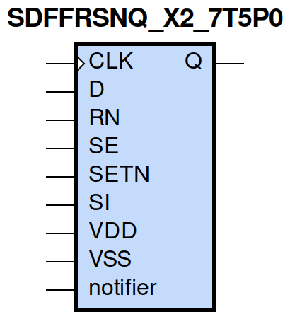
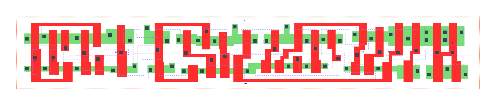

=======================================
gf180mcu_fd_sc_mcu7t5v0__sdffrsnq_x2
=======================================

**gf180mcu_fd_sc_mcu7t5v0__sdffrsnq_x2 symbol**

**gf180mcu_fd_sc_mcu7t5v0__sdffrsnq_x2 schematic**

.. image:: sc7_sch/SDFFRSNQ_X2_sch.png
    :height: 300px
    :width: 500 px
    :align: center
    :alt: gf180mcu_fd_sc_mcu7t5v0__sdffrsnq_x2 schematic

**gf180mcu_fd_sc_mcu7t5v0__sdffrsnq_x2 layout**

.. include:: images.rst

SDFFRSNQ_X2 is a positive edge triggered scan D-type flip flop, active low set/reset, 2X drive strength

|
| Attributes

============= =======================
**Attribute** **Value**
area          109.760000 µm\ :sup:`2`
============= =======================

|

TRUTH TABLE

===== ==== == == = === ======
Input                  Output
RN    SETN SE SI D CLK Q
H     H    L  X  L ↑   L
H     H    L  X  H ↑   H
H     H    H  L  X ↑   L
H     H    H  H  X ↑   H
H     L    X  X  X X   H
L     H    X  X  X X   L
L     L    X  X  X X   L
===== ==== == == = === ======

|
| FUNCTIONAL SCHEMATIC
| |image638|
| CONSTRAINTS

================== =============== ============= ============
**Constraint Pin** **Related Pin** **setup(ns)** **hold(ns)**
SE(LH)             CLK(LH)         0.6070        -0.2350
SE(LH)             CLK(LH)         0.8130        -0.0800
SE(HL)             CLK(LH)         0.6930        -0.0400
SE(HL)             CLK(LH)         0.6870        -0.3440
SI(HL)             CLK(LH)         0.7730        -0.0740
SI(HL)             CLK(LH)         0.7790        -0.0400
SI(LH)             CLK(LH)         0.6530        -0.2810
SI(LH)             CLK(LH)         0.6410        -0.2750
D(HL)              CLK(LH)         0.6810        -0.0290
D(HL)              CLK(LH)         0.6810        -0.0290
D(LH)              CLK(LH)         0.5780        -0.2290
D(LH)              CLK(LH)         0.5720        -0.2290
SETN(LH)           RN(LH)          -0.0110       0.1030
SETN(LH)           RN(LH)          -0.0110       0.1030
SETN(LH)           RN(LH)          -0.0110       0.1030
SETN(LH)           RN(LH)          -0.0110       0.1030
SETN(LH)           RN(LH)          -0.0340       0.1090
SETN(LH)           RN(LH)          -0.0340       0.1090
SETN(LH)           RN(LH)          -0.0340       0.1090
SETN(LH)           RN(LH)          -0.0340       0.1090
SETN(LH)           RN(LH)          -0.0110       0.1030
SETN(LH)           RN(LH)          -0.0110       0.1030
SETN(LH)           RN(LH)          -0.0110       0.1030
SETN(LH)           RN(LH)          -0.0340       0.1090
SETN(LH)           RN(LH)          -0.0340       0.1090
SETN(LH)           RN(LH)          -0.0340       0.1090
SETN(LH)           RN(LH)          -0.0340       0.1090
SETN(LH)           RN(LH)          -0.0110       0.1030
RN(LH)             SETN(LH)        0.1030        -0.0110
RN(LH)             SETN(LH)        0.1030        -0.0110
RN(LH)             SETN(LH)        0.1030        -0.0110
RN(LH)             SETN(LH)        0.1030        -0.0110
RN(LH)             SETN(LH)        0.1090        -0.0340
RN(LH)             SETN(LH)        0.1090        -0.0340
RN(LH)             SETN(LH)        0.1090        -0.0340
RN(LH)             SETN(LH)        0.1090        -0.0340
RN(LH)             SETN(LH)        0.1030        -0.0110
RN(LH)             SETN(LH)        0.1030        -0.0110
RN(LH)             SETN(LH)        0.1030        -0.0110
RN(LH)             SETN(LH)        0.1090        -0.0340
RN(LH)             SETN(LH)        0.1090        -0.0340
RN(LH)             SETN(LH)        0.1090        -0.0340
RN(LH)             SETN(LH)        0.1090        -0.0340
RN(LH)             SETN(LH)        0.1030        -0.0110
================== =============== ============= ============

|

================== =============== ================ ===============
**Constraint Pin** **Related Pin** **recovery(ns)** **removal(ns)**
SETN(LH)           CLK(LH)         0.0000           0.2860
SETN(LH)           CLK(LH)         0.0000           0.2860
SETN(LH)           CLK(LH)         0.0000           0.2860
SETN(LH)           CLK(LH)         0.0000           0.2860
RN(LH)             CLK(LH)         -0.2460          0.4120
RN(LH)             CLK(LH)         -0.2460          0.4060
RN(LH)             CLK(LH)         -0.2400          0.4060
RN(LH)             CLK(LH)         -0.2400          0.4120
================== =============== ================ ===============

|

================== =============== ===========================
**Constraint Pin** **Related Pin** **Minimum Pulse Width(ns)**
CLK(HLH)           CLK(HL)         0.8330
CLK(HLH)           CLK(HL)         0.8520
CLK(HLH)           CLK(HL)         0.8330
CLK(HLH)           CLK(HL)         0.7170
CLK(HLH)           CLK(HL)         0.6440
CLK(HLH)           CLK(HL)         0.9190
CLK(HLH)           CLK(HL)         0.6440
CLK(HLH)           CLK(HL)         0.6810
CLK(LHL)           CLK(LH)         0.5050
CLK(LHL)           CLK(LH)         0.5050
CLK(LHL)           CLK(LH)         0.5050
CLK(LHL)           CLK(LH)         0.5640
CLK(LHL)           CLK(LH)         0.5640
CLK(LHL)           CLK(LH)         0.5050
CLK(LHL)           CLK(LH)         0.5640
CLK(LHL)           CLK(LH)         0.5640
SETN(HLH)          SETN(HL)        0.5050
SETN(HLH)          SETN(HL)        0.5050
SETN(HLH)          SETN(HL)        0.5050
SETN(HLH)          SETN(HL)        0.5050
SETN(HLH)          SETN(HL)        0.5050
SETN(HLH)          SETN(HL)        0.5050
SETN(HLH)          SETN(HL)        0.5050
SETN(HLH)          SETN(HL)        0.5050
SETN(HLH)          SETN(HL)        0.5050
SETN(HLH)          SETN(HL)        0.5050
SETN(HLH)          SETN(HL)        0.5050
SETN(HLH)          SETN(HL)        0.5050
SETN(HLH)          SETN(HL)        0.5050
SETN(HLH)          SETN(HL)        0.5050
SETN(HLH)          SETN(HL)        0.5050
SETN(HLH)          SETN(HL)        0.5050
RN(HLH)            RN(HL)          0.2900
RN(HLH)            RN(HL)          0.2900
RN(HLH)            RN(HL)          0.2900
RN(HLH)            RN(HL)          0.2900
RN(HLH)            RN(HL)          0.4760
RN(HLH)            RN(HL)          0.4760
RN(HLH)            RN(HL)          0.4760
RN(HLH)            RN(HL)          0.4760
RN(HLH)            RN(HL)          0.2900
RN(HLH)            RN(HL)          0.2900
RN(HLH)            RN(HL)          0.2900
RN(HLH)            RN(HL)          0.4760
RN(HLH)            RN(HL)          0.4760
RN(HLH)            RN(HL)          0.4760
RN(HLH)            RN(HL)          0.4760
RN(HLH)            RN(HL)          0.2900
================== =============== ===========================

|
| PIN CAPACITANCE (pf)

======= ======== ====================
**Pin** **Type** **Capacitance (pf)**
SE      input    0.0061
SI      input    0.0027
D       input    0.0027
CLK     input    0.0036
SETN    input    0.0063
RN      input    0.0078
======= ======== ====================

|
| DELAY AND OUTPUT TRANSITION TIME corresponding to min slew and load

+---------------+------------+-----------------------+--------------+-------------------+----------------+---------------+
| **Input Pin** | **Output** | **When Condition**    | **Tin (ns)** | **Out Load (pf)** | **Delay (ns)** | **Tout (ns)** |
+---------------+------------+-----------------------+--------------+-------------------+----------------+---------------+
| CLK(LH)       | Q(HL)      | !D&RN&!SE&SETN&!SI    | 0.0100       | 0.0010            | 0.7460         | 0.0405        |
+---------------+------------+-----------------------+--------------+-------------------+----------------+---------------+
| CLK(LH)       | Q(HL)      | !D&RN&!SE&SETN&SI     | 0.0100       | 0.0010            | 0.7460         | 0.0405        |
+---------------+------------+-----------------------+--------------+-------------------+----------------+---------------+
| CLK(LH)       | Q(HL)      | !D&RN&SE&SETN&!SI     | 0.0100       | 0.0010            | 0.7461         | 0.0405        |
+---------------+------------+-----------------------+--------------+-------------------+----------------+---------------+
| CLK(LH)       | Q(HL)      | D&RN&SE&SETN&!SI      | 0.0100       | 0.0010            | 0.7460         | 0.0404        |
+---------------+------------+-----------------------+--------------+-------------------+----------------+---------------+
| CLK(LH)       | Q(LH)      | !D&RN&SE&SETN&SI      | 0.0100       | 0.0010            | 0.8095         | 0.0529        |
+---------------+------------+-----------------------+--------------+-------------------+----------------+---------------+
| CLK(LH)       | Q(LH)      | D&RN&!SE&SETN&!SI     | 0.0100       | 0.0010            | 0.8096         | 0.0530        |
+---------------+------------+-----------------------+--------------+-------------------+----------------+---------------+
| CLK(LH)       | Q(LH)      | D&RN&!SE&SETN&SI      | 0.0100       | 0.0010            | 0.8095         | 0.0531        |
+---------------+------------+-----------------------+--------------+-------------------+----------------+---------------+
| CLK(LH)       | Q(LH)      | D&RN&SE&SETN&SI       | 0.0100       | 0.0010            | 0.8095         | 0.0529        |
+---------------+------------+-----------------------+--------------+-------------------+----------------+---------------+
| SETN(HL)      | Q(LH)      | !CLK&!D&RN&!SE&!SI    | 0.0100       | 0.0010            | 0.6886         | 0.0526        |
+---------------+------------+-----------------------+--------------+-------------------+----------------+---------------+
| SETN(HL)      | Q(LH)      | !CLK&D&RN&SE&!SI      | 0.0100       | 0.0010            | 0.6886         | 0.0526        |
+---------------+------------+-----------------------+--------------+-------------------+----------------+---------------+
| SETN(HL)      | Q(LH)      | !CLK&D&RN&!SE&SI      | 0.0100       | 0.0010            | 0.6888         | 0.0526        |
+---------------+------------+-----------------------+--------------+-------------------+----------------+---------------+
| SETN(HL)      | Q(LH)      | !CLK&D&RN&SE&SI       | 0.0100       | 0.0010            | 0.6888         | 0.0526        |
+---------------+------------+-----------------------+--------------+-------------------+----------------+---------------+
| SETN(HL)      | Q(LH)      | CLK&D&RN&!SE&!SI      | 0.0100       | 0.0010            | 0.7349         | 0.0527        |
+---------------+------------+-----------------------+--------------+-------------------+----------------+---------------+
| SETN(HL)      | Q(LH)      | CLK&D&RN&SE&!SI       | 0.0100       | 0.0010            | 0.7347         | 0.0527        |
+---------------+------------+-----------------------+--------------+-------------------+----------------+---------------+
| SETN(HL)      | Q(LH)      | CLK&D&RN&!SE&SI       | 0.0100       | 0.0010            | 0.7347         | 0.0525        |
+---------------+------------+-----------------------+--------------+-------------------+----------------+---------------+
| SETN(HL)      | Q(LH)      | CLK&D&RN&SE&SI        | 0.0100       | 0.0010            | 0.7347         | 0.0526        |
+---------------+------------+-----------------------+--------------+-------------------+----------------+---------------+
| SETN(HL)      | Q(LH)      | !CLK&!D&RN&SE&!SI     | 0.0100       | 0.0010            | 0.6886         | 0.0526        |
+---------------+------------+-----------------------+--------------+-------------------+----------------+---------------+
| SETN(HL)      | Q(LH)      | !CLK&!D&RN&!SE&SI     | 0.0100       | 0.0010            | 0.6886         | 0.0526        |
+---------------+------------+-----------------------+--------------+-------------------+----------------+---------------+
| SETN(HL)      | Q(LH)      | !CLK&!D&RN&SE&SI      | 0.0100       | 0.0010            | 0.6888         | 0.0526        |
+---------------+------------+-----------------------+--------------+-------------------+----------------+---------------+
| SETN(HL)      | Q(LH)      | CLK&!D&RN&!SE&!SI     | 0.0100       | 0.0010            | 0.7347         | 0.0527        |
+---------------+------------+-----------------------+--------------+-------------------+----------------+---------------+
| SETN(HL)      | Q(LH)      | CLK&!D&RN&SE&!SI      | 0.0100       | 0.0010            | 0.7347         | 0.0527        |
+---------------+------------+-----------------------+--------------+-------------------+----------------+---------------+
| SETN(HL)      | Q(LH)      | CLK&!D&RN&!SE&SI      | 0.0100       | 0.0010            | 0.7347         | 0.0527        |
+---------------+------------+-----------------------+--------------+-------------------+----------------+---------------+
| SETN(HL)      | Q(LH)      | CLK&!D&RN&SE&SI       | 0.0100       | 0.0010            | 0.7347         | 0.0526        |
+---------------+------------+-----------------------+--------------+-------------------+----------------+---------------+
| SETN(HL)      | Q(LH)      | !CLK&D&RN&!SE&!SI     | 0.0100       | 0.0010            | 0.6888         | 0.0526        |
+---------------+------------+-----------------------+--------------+-------------------+----------------+---------------+
| RN(HL)        | Q(HL)      | !CLK&!D&!SE&SETN&!SI  | 0.0100       | 0.0010            | 0.1950         | 0.0367        |
+---------------+------------+-----------------------+--------------+-------------------+----------------+---------------+
| RN(HL)        | Q(HL)      | !CLK&D&SE&SETN&!SI    | 0.0100       | 0.0010            | 0.1950         | 0.0366        |
+---------------+------------+-----------------------+--------------+-------------------+----------------+---------------+
| RN(HL)        | Q(HL)      | !CLK&D&!SE&SETN&SI    | 0.0100       | 0.0010            | 0.1950         | 0.0366        |
+---------------+------------+-----------------------+--------------+-------------------+----------------+---------------+
| RN(HL)        | Q(HL)      | !CLK&D&SE&SETN&SI     | 0.0100       | 0.0010            | 0.1950         | 0.0366        |
+---------------+------------+-----------------------+--------------+-------------------+----------------+---------------+
| RN(HL)        | Q(HL)      | CLK&D&!SE&SETN&!SI    | 0.0100       | 0.0010            | 0.1951         | 0.0364        |
+---------------+------------+-----------------------+--------------+-------------------+----------------+---------------+
| RN(HL)        | Q(HL)      | CLK&D&SE&SETN&!SI     | 0.0100       | 0.0010            | 0.1951         | 0.0364        |
+---------------+------------+-----------------------+--------------+-------------------+----------------+---------------+
| RN(HL)        | Q(HL)      | CLK&D&!SE&SETN&SI     | 0.0100       | 0.0010            | 0.1952         | 0.0364        |
+---------------+------------+-----------------------+--------------+-------------------+----------------+---------------+
| RN(HL)        | Q(HL)      | CLK&D&SE&SETN&SI      | 0.0100       | 0.0010            | 0.1951         | 0.0364        |
+---------------+------------+-----------------------+--------------+-------------------+----------------+---------------+
| RN(HL)        | Q(HL)      | !CLK&!D&!SE&!SETN&!SI | 0.0100       | 0.0010            | 0.1949         | 0.0362        |
+---------------+------------+-----------------------+--------------+-------------------+----------------+---------------+
| RN(HL)        | Q(HL)      | !CLK&!D&!SE&!SETN&SI  | 0.0100       | 0.0010            | 0.1949         | 0.0362        |
+---------------+------------+-----------------------+--------------+-------------------+----------------+---------------+
| RN(HL)        | Q(HL)      | !CLK&!D&SE&!SETN&!SI  | 0.0100       | 0.0010            | 0.1949         | 0.0362        |
+---------------+------------+-----------------------+--------------+-------------------+----------------+---------------+
| RN(HL)        | Q(HL)      | !CLK&!D&SE&!SETN&SI   | 0.0100       | 0.0010            | 0.1949         | 0.0362        |
+---------------+------------+-----------------------+--------------+-------------------+----------------+---------------+
| RN(HL)        | Q(HL)      | !CLK&D&!SE&!SETN&!SI  | 0.0100       | 0.0010            | 0.1949         | 0.0362        |
+---------------+------------+-----------------------+--------------+-------------------+----------------+---------------+
| RN(HL)        | Q(HL)      | !CLK&D&!SE&!SETN&SI   | 0.0100       | 0.0010            | 0.1949         | 0.0362        |
+---------------+------------+-----------------------+--------------+-------------------+----------------+---------------+
| RN(HL)        | Q(HL)      | !CLK&D&SE&!SETN&!SI   | 0.0100       | 0.0010            | 0.1949         | 0.0362        |
+---------------+------------+-----------------------+--------------+-------------------+----------------+---------------+
| RN(HL)        | Q(HL)      | !CLK&D&SE&!SETN&SI    | 0.0100       | 0.0010            | 0.1949         | 0.0362        |
+---------------+------------+-----------------------+--------------+-------------------+----------------+---------------+
| RN(HL)        | Q(HL)      | CLK&!D&!SE&!SETN&!SI  | 0.0100       | 0.0010            | 0.1950         | 0.0362        |
+---------------+------------+-----------------------+--------------+-------------------+----------------+---------------+
| RN(HL)        | Q(HL)      | CLK&!D&!SE&!SETN&SI   | 0.0100       | 0.0010            | 0.1951         | 0.0363        |
+---------------+------------+-----------------------+--------------+-------------------+----------------+---------------+
| RN(HL)        | Q(HL)      | CLK&!D&SE&!SETN&!SI   | 0.0100       | 0.0010            | 0.1951         | 0.0363        |
+---------------+------------+-----------------------+--------------+-------------------+----------------+---------------+
| RN(HL)        | Q(HL)      | CLK&!D&SE&!SETN&SI    | 0.0100       | 0.0010            | 0.1951         | 0.0363        |
+---------------+------------+-----------------------+--------------+-------------------+----------------+---------------+
| RN(HL)        | Q(HL)      | CLK&D&!SE&!SETN&!SI   | 0.0100       | 0.0010            | 0.1950         | 0.0362        |
+---------------+------------+-----------------------+--------------+-------------------+----------------+---------------+
| RN(HL)        | Q(HL)      | CLK&D&!SE&!SETN&SI    | 0.0100       | 0.0010            | 0.1951         | 0.0363        |
+---------------+------------+-----------------------+--------------+-------------------+----------------+---------------+
| RN(HL)        | Q(HL)      | CLK&D&SE&!SETN&!SI    | 0.0100       | 0.0010            | 0.1951         | 0.0363        |
+---------------+------------+-----------------------+--------------+-------------------+----------------+---------------+
| RN(HL)        | Q(HL)      | CLK&D&SE&!SETN&SI     | 0.0100       | 0.0010            | 0.1951         | 0.0363        |
+---------------+------------+-----------------------+--------------+-------------------+----------------+---------------+
| RN(HL)        | Q(HL)      | !CLK&!D&SE&SETN&!SI   | 0.0100       | 0.0010            | 0.1950         | 0.0366        |
+---------------+------------+-----------------------+--------------+-------------------+----------------+---------------+
| RN(HL)        | Q(HL)      | !CLK&!D&!SE&SETN&SI   | 0.0100       | 0.0010            | 0.1950         | 0.0366        |
+---------------+------------+-----------------------+--------------+-------------------+----------------+---------------+
| RN(HL)        | Q(HL)      | !CLK&!D&SE&SETN&SI    | 0.0100       | 0.0010            | 0.1950         | 0.0366        |
+---------------+------------+-----------------------+--------------+-------------------+----------------+---------------+
| RN(HL)        | Q(HL)      | CLK&!D&!SE&SETN&!SI   | 0.0100       | 0.0010            | 0.1951         | 0.0364        |
+---------------+------------+-----------------------+--------------+-------------------+----------------+---------------+
| RN(HL)        | Q(HL)      | CLK&!D&SE&SETN&!SI    | 0.0100       | 0.0010            | 0.1951         | 0.0364        |
+---------------+------------+-----------------------+--------------+-------------------+----------------+---------------+
| RN(HL)        | Q(HL)      | CLK&!D&!SE&SETN&SI    | 0.0100       | 0.0010            | 0.1951         | 0.0364        |
+---------------+------------+-----------------------+--------------+-------------------+----------------+---------------+
| RN(HL)        | Q(HL)      | CLK&!D&SE&SETN&SI     | 0.0100       | 0.0010            | 0.1951         | 0.0364        |
+---------------+------------+-----------------------+--------------+-------------------+----------------+---------------+
| RN(HL)        | Q(HL)      | !CLK&D&!SE&SETN&!SI   | 0.0100       | 0.0010            | 0.1950         | 0.0366        |
+---------------+------------+-----------------------+--------------+-------------------+----------------+---------------+
| RN(LH)        | Q(LH)      | !CLK&!D&!SE&!SETN&!SI | 0.0100       | 0.0010            | 0.3388         | 0.0509        |
+---------------+------------+-----------------------+--------------+-------------------+----------------+---------------+
| RN(LH)        | Q(LH)      | !CLK&!D&!SE&!SETN&SI  | 0.0100       | 0.0010            | 0.3388         | 0.0509        |
+---------------+------------+-----------------------+--------------+-------------------+----------------+---------------+
| RN(LH)        | Q(LH)      | !CLK&!D&SE&!SETN&!SI  | 0.0100       | 0.0010            | 0.3388         | 0.0509        |
+---------------+------------+-----------------------+--------------+-------------------+----------------+---------------+
| RN(LH)        | Q(LH)      | !CLK&!D&SE&!SETN&SI   | 0.0100       | 0.0010            | 0.3388         | 0.0509        |
+---------------+------------+-----------------------+--------------+-------------------+----------------+---------------+
| RN(LH)        | Q(LH)      | !CLK&D&!SE&!SETN&!SI  | 0.0100       | 0.0010            | 0.3388         | 0.0509        |
+---------------+------------+-----------------------+--------------+-------------------+----------------+---------------+
| RN(LH)        | Q(LH)      | !CLK&D&!SE&!SETN&SI   | 0.0100       | 0.0010            | 0.3388         | 0.0509        |
+---------------+------------+-----------------------+--------------+-------------------+----------------+---------------+
| RN(LH)        | Q(LH)      | !CLK&D&SE&!SETN&!SI   | 0.0100       | 0.0010            | 0.3388         | 0.0509        |
+---------------+------------+-----------------------+--------------+-------------------+----------------+---------------+
| RN(LH)        | Q(LH)      | !CLK&D&SE&!SETN&SI    | 0.0100       | 0.0010            | 0.3388         | 0.0509        |
+---------------+------------+-----------------------+--------------+-------------------+----------------+---------------+
| RN(LH)        | Q(LH)      | CLK&!D&!SE&!SETN&!SI  | 0.0100       | 0.0010            | 0.3406         | 0.0510        |
+---------------+------------+-----------------------+--------------+-------------------+----------------+---------------+
| RN(LH)        | Q(LH)      | CLK&!D&!SE&!SETN&SI   | 0.0100       | 0.0010            | 0.3406         | 0.0510        |
+---------------+------------+-----------------------+--------------+-------------------+----------------+---------------+
| RN(LH)        | Q(LH)      | CLK&!D&SE&!SETN&!SI   | 0.0100       | 0.0010            | 0.3406         | 0.0510        |
+---------------+------------+-----------------------+--------------+-------------------+----------------+---------------+
| RN(LH)        | Q(LH)      | CLK&!D&SE&!SETN&SI    | 0.0100       | 0.0010            | 0.3406         | 0.0510        |
+---------------+------------+-----------------------+--------------+-------------------+----------------+---------------+
| RN(LH)        | Q(LH)      | CLK&D&!SE&!SETN&!SI   | 0.0100       | 0.0010            | 0.3406         | 0.0510        |
+---------------+------------+-----------------------+--------------+-------------------+----------------+---------------+
| RN(LH)        | Q(LH)      | CLK&D&!SE&!SETN&SI    | 0.0100       | 0.0010            | 0.3406         | 0.0510        |
+---------------+------------+-----------------------+--------------+-------------------+----------------+---------------+
| RN(LH)        | Q(LH)      | CLK&D&SE&!SETN&!SI    | 0.0100       | 0.0010            | 0.3406         | 0.0510        |
+---------------+------------+-----------------------+--------------+-------------------+----------------+---------------+
| RN(LH)        | Q(LH)      | CLK&D&SE&!SETN&SI     | 0.0100       | 0.0010            | 0.3406         | 0.0510        |
+---------------+------------+-----------------------+--------------+-------------------+----------------+---------------+

|
| DYNAMIC ENERGY

+---------------+------------------------+--------------+------------+-------------------+---------------------+
| **Input Pin** | **When Condition**     | **Tin (ns)** | **Output** | **Out Load (pf)** | **Energy (uW/MHz)** |
+---------------+------------------------+--------------+------------+-------------------+---------------------+
| CLK           | !D&RN&!SE&SETN&!SI     | 0.0100       | Q(HL)      | 0.0010            | 0.8084              |
+---------------+------------------------+--------------+------------+-------------------+---------------------+
| CLK           | !D&RN&!SE&SETN&SI      | 0.0100       | Q(HL)      | 0.0010            | 0.8081              |
+---------------+------------------------+--------------+------------+-------------------+---------------------+
| CLK           | !D&RN&SE&SETN&!SI      | 0.0100       | Q(HL)      | 0.0010            | 0.8082              |
+---------------+------------------------+--------------+------------+-------------------+---------------------+
| CLK           | D&RN&SE&SETN&!SI       | 0.0100       | Q(HL)      | 0.0010            | 0.8081              |
+---------------+------------------------+--------------+------------+-------------------+---------------------+
| CLK           | !D&RN&SE&SETN&SI       | 0.0100       | Q(LH)      | 0.0010            | 0.9295              |
+---------------+------------------------+--------------+------------+-------------------+---------------------+
| CLK           | D&RN&!SE&SETN&!SI      | 0.0100       | Q(LH)      | 0.0010            | 0.9293              |
+---------------+------------------------+--------------+------------+-------------------+---------------------+
| CLK           | D&RN&!SE&SETN&SI       | 0.0100       | Q(LH)      | 0.0010            | 0.9294              |
+---------------+------------------------+--------------+------------+-------------------+---------------------+
| CLK           | D&RN&SE&SETN&SI        | 0.0100       | Q(LH)      | 0.0010            | 0.9295              |
+---------------+------------------------+--------------+------------+-------------------+---------------------+
| SETN          | !CLK&!D&RN&!SE&!SI     | 0.0100       | Q(LH)      | 0.0010            | 0.7932              |
+---------------+------------------------+--------------+------------+-------------------+---------------------+
| SETN          | !CLK&D&RN&SE&!SI       | 0.0100       | Q(LH)      | 0.0010            | 0.7932              |
+---------------+------------------------+--------------+------------+-------------------+---------------------+
| SETN          | !CLK&D&RN&!SE&SI       | 0.0100       | Q(LH)      | 0.0010            | 0.6795              |
+---------------+------------------------+--------------+------------+-------------------+---------------------+
| SETN          | !CLK&D&RN&SE&SI        | 0.0100       | Q(LH)      | 0.0010            | 0.6795              |
+---------------+------------------------+--------------+------------+-------------------+---------------------+
| SETN          | CLK&D&RN&!SE&!SI       | 0.0100       | Q(LH)      | 0.0010            | 0.8922              |
+---------------+------------------------+--------------+------------+-------------------+---------------------+
| SETN          | CLK&D&RN&SE&!SI        | 0.0100       | Q(LH)      | 0.0010            | 0.8919              |
+---------------+------------------------+--------------+------------+-------------------+---------------------+
| SETN          | CLK&D&RN&!SE&SI        | 0.0100       | Q(LH)      | 0.0010            | 0.8922              |
+---------------+------------------------+--------------+------------+-------------------+---------------------+
| SETN          | CLK&D&RN&SE&SI         | 0.0100       | Q(LH)      | 0.0010            | 0.8920              |
+---------------+------------------------+--------------+------------+-------------------+---------------------+
| SETN          | !CLK&!D&RN&SE&!SI      | 0.0100       | Q(LH)      | 0.0010            | 0.7931              |
+---------------+------------------------+--------------+------------+-------------------+---------------------+
| SETN          | !CLK&!D&RN&!SE&SI      | 0.0100       | Q(LH)      | 0.0010            | 0.7932              |
+---------------+------------------------+--------------+------------+-------------------+---------------------+
| SETN          | !CLK&!D&RN&SE&SI       | 0.0100       | Q(LH)      | 0.0010            | 0.6795              |
+---------------+------------------------+--------------+------------+-------------------+---------------------+
| SETN          | CLK&!D&RN&!SE&!SI      | 0.0100       | Q(LH)      | 0.0010            | 0.8919              |
+---------------+------------------------+--------------+------------+-------------------+---------------------+
| SETN          | CLK&!D&RN&SE&!SI       | 0.0100       | Q(LH)      | 0.0010            | 0.8919              |
+---------------+------------------------+--------------+------------+-------------------+---------------------+
| SETN          | CLK&!D&RN&!SE&SI       | 0.0100       | Q(LH)      | 0.0010            | 0.8919              |
+---------------+------------------------+--------------+------------+-------------------+---------------------+
| SETN          | CLK&!D&RN&SE&SI        | 0.0100       | Q(LH)      | 0.0010            | 0.8920              |
+---------------+------------------------+--------------+------------+-------------------+---------------------+
| SETN          | !CLK&D&RN&!SE&!SI      | 0.0100       | Q(LH)      | 0.0010            | 0.6795              |
+---------------+------------------------+--------------+------------+-------------------+---------------------+
| RN            | !CLK&!D&!SE&SETN&!SI   | 0.0100       | Q(HL)      | 0.0010            | 0.5620              |
+---------------+------------------------+--------------+------------+-------------------+---------------------+
| RN            | !CLK&D&SE&SETN&!SI     | 0.0100       | Q(HL)      | 0.0010            | 0.5619              |
+---------------+------------------------+--------------+------------+-------------------+---------------------+
| RN            | !CLK&D&!SE&SETN&SI     | 0.0100       | Q(HL)      | 0.0010            | 0.5620              |
+---------------+------------------------+--------------+------------+-------------------+---------------------+
| RN            | !CLK&D&SE&SETN&SI      | 0.0100       | Q(HL)      | 0.0010            | 0.5619              |
+---------------+------------------------+--------------+------------+-------------------+---------------------+
| RN            | CLK&D&!SE&SETN&!SI     | 0.0100       | Q(HL)      | 0.0010            | 0.7838              |
+---------------+------------------------+--------------+------------+-------------------+---------------------+
| RN            | CLK&D&SE&SETN&!SI      | 0.0100       | Q(HL)      | 0.0010            | 0.7846              |
+---------------+------------------------+--------------+------------+-------------------+---------------------+
| RN            | CLK&D&!SE&SETN&SI      | 0.0100       | Q(HL)      | 0.0010            | 0.7838              |
+---------------+------------------------+--------------+------------+-------------------+---------------------+
| RN            | CLK&D&SE&SETN&SI       | 0.0100       | Q(HL)      | 0.0010            | 0.7838              |
+---------------+------------------------+--------------+------------+-------------------+---------------------+
| RN            | !CLK&!D&!SE&!SETN&!SI  | 0.0100       | Q(HL)      | 0.0010            | 0.4187              |
+---------------+------------------------+--------------+------------+-------------------+---------------------+
| RN            | !CLK&!D&!SE&!SETN&SI   | 0.0100       | Q(HL)      | 0.0010            | 0.4187              |
+---------------+------------------------+--------------+------------+-------------------+---------------------+
| RN            | !CLK&!D&SE&!SETN&!SI   | 0.0100       | Q(HL)      | 0.0010            | 0.4187              |
+---------------+------------------------+--------------+------------+-------------------+---------------------+
| RN            | !CLK&!D&SE&!SETN&SI    | 0.0100       | Q(HL)      | 0.0010            | 0.4169              |
+---------------+------------------------+--------------+------------+-------------------+---------------------+
| RN            | !CLK&D&!SE&!SETN&!SI   | 0.0100       | Q(HL)      | 0.0010            | 0.4169              |
+---------------+------------------------+--------------+------------+-------------------+---------------------+
| RN            | !CLK&D&!SE&!SETN&SI    | 0.0100       | Q(HL)      | 0.0010            | 0.4169              |
+---------------+------------------------+--------------+------------+-------------------+---------------------+
| RN            | !CLK&D&SE&!SETN&!SI    | 0.0100       | Q(HL)      | 0.0010            | 0.4187              |
+---------------+------------------------+--------------+------------+-------------------+---------------------+
| RN            | !CLK&D&SE&!SETN&SI     | 0.0100       | Q(HL)      | 0.0010            | 0.4169              |
+---------------+------------------------+--------------+------------+-------------------+---------------------+
| RN            | CLK&!D&!SE&!SETN&!SI   | 0.0100       | Q(HL)      | 0.0010            | 0.5635              |
+---------------+------------------------+--------------+------------+-------------------+---------------------+
| RN            | CLK&!D&!SE&!SETN&SI    | 0.0100       | Q(HL)      | 0.0010            | 0.5637              |
+---------------+------------------------+--------------+------------+-------------------+---------------------+
| RN            | CLK&!D&SE&!SETN&!SI    | 0.0100       | Q(HL)      | 0.0010            | 0.5636              |
+---------------+------------------------+--------------+------------+-------------------+---------------------+
| RN            | CLK&!D&SE&!SETN&SI     | 0.0100       | Q(HL)      | 0.0010            | 0.5636              |
+---------------+------------------------+--------------+------------+-------------------+---------------------+
| RN            | CLK&D&!SE&!SETN&!SI    | 0.0100       | Q(HL)      | 0.0010            | 0.5635              |
+---------------+------------------------+--------------+------------+-------------------+---------------------+
| RN            | CLK&D&!SE&!SETN&SI     | 0.0100       | Q(HL)      | 0.0010            | 0.5637              |
+---------------+------------------------+--------------+------------+-------------------+---------------------+
| RN            | CLK&D&SE&!SETN&!SI     | 0.0100       | Q(HL)      | 0.0010            | 0.5636              |
+---------------+------------------------+--------------+------------+-------------------+---------------------+
| RN            | CLK&D&SE&!SETN&SI      | 0.0100       | Q(HL)      | 0.0010            | 0.5636              |
+---------------+------------------------+--------------+------------+-------------------+---------------------+
| RN            | !CLK&!D&SE&SETN&!SI    | 0.0100       | Q(HL)      | 0.0010            | 0.5619              |
+---------------+------------------------+--------------+------------+-------------------+---------------------+
| RN            | !CLK&!D&!SE&SETN&SI    | 0.0100       | Q(HL)      | 0.0010            | 0.5619              |
+---------------+------------------------+--------------+------------+-------------------+---------------------+
| RN            | !CLK&!D&SE&SETN&SI     | 0.0100       | Q(HL)      | 0.0010            | 0.5620              |
+---------------+------------------------+--------------+------------+-------------------+---------------------+
| RN            | CLK&!D&!SE&SETN&!SI    | 0.0100       | Q(HL)      | 0.0010            | 0.7845              |
+---------------+------------------------+--------------+------------+-------------------+---------------------+
| RN            | CLK&!D&SE&SETN&!SI     | 0.0100       | Q(HL)      | 0.0010            | 0.7846              |
+---------------+------------------------+--------------+------------+-------------------+---------------------+
| RN            | CLK&!D&!SE&SETN&SI     | 0.0100       | Q(HL)      | 0.0010            | 0.7846              |
+---------------+------------------------+--------------+------------+-------------------+---------------------+
| RN            | CLK&!D&SE&SETN&SI      | 0.0100       | Q(HL)      | 0.0010            | 0.7838              |
+---------------+------------------------+--------------+------------+-------------------+---------------------+
| RN            | !CLK&D&!SE&SETN&!SI    | 0.0100       | Q(HL)      | 0.0010            | 0.5620              |
+---------------+------------------------+--------------+------------+-------------------+---------------------+
| RN            | !CLK&!D&!SE&!SETN&!SI  | 0.0100       | Q(LH)      | 0.0010            | 0.3160              |
+---------------+------------------------+--------------+------------+-------------------+---------------------+
| RN            | !CLK&!D&!SE&!SETN&SI   | 0.0100       | Q(LH)      | 0.0010            | 0.3160              |
+---------------+------------------------+--------------+------------+-------------------+---------------------+
| RN            | !CLK&!D&SE&!SETN&!SI   | 0.0100       | Q(LH)      | 0.0010            | 0.3160              |
+---------------+------------------------+--------------+------------+-------------------+---------------------+
| RN            | !CLK&!D&SE&!SETN&SI    | 0.0100       | Q(LH)      | 0.0010            | 0.3169              |
+---------------+------------------------+--------------+------------+-------------------+---------------------+
| RN            | !CLK&D&!SE&!SETN&!SI   | 0.0100       | Q(LH)      | 0.0010            | 0.3169              |
+---------------+------------------------+--------------+------------+-------------------+---------------------+
| RN            | !CLK&D&!SE&!SETN&SI    | 0.0100       | Q(LH)      | 0.0010            | 0.3169              |
+---------------+------------------------+--------------+------------+-------------------+---------------------+
| RN            | !CLK&D&SE&!SETN&!SI    | 0.0100       | Q(LH)      | 0.0010            | 0.3160              |
+---------------+------------------------+--------------+------------+-------------------+---------------------+
| RN            | !CLK&D&SE&!SETN&SI     | 0.0100       | Q(LH)      | 0.0010            | 0.3169              |
+---------------+------------------------+--------------+------------+-------------------+---------------------+
| RN            | CLK&!D&!SE&!SETN&!SI   | 0.0100       | Q(LH)      | 0.0010            | 0.4100              |
+---------------+------------------------+--------------+------------+-------------------+---------------------+
| RN            | CLK&!D&!SE&!SETN&SI    | 0.0100       | Q(LH)      | 0.0010            | 0.4100              |
+---------------+------------------------+--------------+------------+-------------------+---------------------+
| RN            | CLK&!D&SE&!SETN&!SI    | 0.0100       | Q(LH)      | 0.0010            | 0.4100              |
+---------------+------------------------+--------------+------------+-------------------+---------------------+
| RN            | CLK&!D&SE&!SETN&SI     | 0.0100       | Q(LH)      | 0.0010            | 0.4100              |
+---------------+------------------------+--------------+------------+-------------------+---------------------+
| RN            | CLK&D&!SE&!SETN&!SI    | 0.0100       | Q(LH)      | 0.0010            | 0.4100              |
+---------------+------------------------+--------------+------------+-------------------+---------------------+
| RN            | CLK&D&!SE&!SETN&SI     | 0.0100       | Q(LH)      | 0.0010            | 0.4100              |
+---------------+------------------------+--------------+------------+-------------------+---------------------+
| RN            | CLK&D&SE&!SETN&!SI     | 0.0100       | Q(LH)      | 0.0010            | 0.4100              |
+---------------+------------------------+--------------+------------+-------------------+---------------------+
| RN            | CLK&D&SE&!SETN&SI      | 0.0100       | Q(LH)      | 0.0010            | 0.4100              |
+---------------+------------------------+--------------+------------+-------------------+---------------------+
| SETN(HL)      | !CLK&!D&!RN&!SE&!SI    | 0.0100       | n/a        | n/a               | 0.3763              |
+---------------+------------------------+--------------+------------+-------------------+---------------------+
| SETN(HL)      | !CLK&!D&!RN&!SE&SI     | 0.0100       | n/a        | n/a               | 0.3763              |
+---------------+------------------------+--------------+------------+-------------------+---------------------+
| SETN(HL)      | !CLK&!D&!RN&SE&!SI     | 0.0100       | n/a        | n/a               | 0.3763              |
+---------------+------------------------+--------------+------------+-------------------+---------------------+
| SETN(HL)      | !CLK&!D&!RN&SE&SI      | 0.0100       | n/a        | n/a               | 0.2695              |
+---------------+------------------------+--------------+------------+-------------------+---------------------+
| SETN(HL)      | !CLK&D&!RN&!SE&!SI     | 0.0100       | n/a        | n/a               | 0.2695              |
+---------------+------------------------+--------------+------------+-------------------+---------------------+
| SETN(HL)      | !CLK&D&!RN&!SE&SI      | 0.0100       | n/a        | n/a               | 0.2695              |
+---------------+------------------------+--------------+------------+-------------------+---------------------+
| SETN(HL)      | !CLK&D&!RN&SE&!SI      | 0.0100       | n/a        | n/a               | 0.3763              |
+---------------+------------------------+--------------+------------+-------------------+---------------------+
| SETN(HL)      | !CLK&D&!RN&SE&SI       | 0.0100       | n/a        | n/a               | 0.2695              |
+---------------+------------------------+--------------+------------+-------------------+---------------------+
| SETN(HL)      | CLK&!D&!RN&!SE&!SI     | 0.0100       | n/a        | n/a               | 0.3764              |
+---------------+------------------------+--------------+------------+-------------------+---------------------+
| SETN(HL)      | CLK&!D&!RN&!SE&SI      | 0.0100       | n/a        | n/a               | 0.3764              |
+---------------+------------------------+--------------+------------+-------------------+---------------------+
| SETN(HL)      | CLK&!D&!RN&SE&!SI      | 0.0100       | n/a        | n/a               | 0.3764              |
+---------------+------------------------+--------------+------------+-------------------+---------------------+
| SETN(HL)      | CLK&!D&!RN&SE&SI       | 0.0100       | n/a        | n/a               | 0.3764              |
+---------------+------------------------+--------------+------------+-------------------+---------------------+
| SETN(HL)      | CLK&D&!RN&!SE&!SI      | 0.0100       | n/a        | n/a               | 0.3764              |
+---------------+------------------------+--------------+------------+-------------------+---------------------+
| SETN(HL)      | CLK&D&!RN&!SE&SI       | 0.0100       | n/a        | n/a               | 0.3764              |
+---------------+------------------------+--------------+------------+-------------------+---------------------+
| SETN(HL)      | CLK&D&!RN&SE&!SI       | 0.0100       | n/a        | n/a               | 0.3764              |
+---------------+------------------------+--------------+------------+-------------------+---------------------+
| SETN(HL)      | CLK&D&!RN&SE&SI        | 0.0100       | n/a        | n/a               | 0.3764              |
+---------------+------------------------+--------------+------------+-------------------+---------------------+
| SETN(HL)      | CLK&!D&RN&!SE&!SI      | 0.0100       | n/a        | n/a               | 0.0445              |
+---------------+------------------------+--------------+------------+-------------------+---------------------+
| SETN(HL)      | CLK&!D&RN&SE&!SI       | 0.0100       | n/a        | n/a               | 0.0445              |
+---------------+------------------------+--------------+------------+-------------------+---------------------+
| SETN(HL)      | CLK&!D&RN&!SE&SI       | 0.0100       | n/a        | n/a               | 0.0445              |
+---------------+------------------------+--------------+------------+-------------------+---------------------+
| SETN(HL)      | CLK&!D&RN&SE&SI        | 0.0100       | n/a        | n/a               | 0.0444              |
+---------------+------------------------+--------------+------------+-------------------+---------------------+
| SETN(HL)      | !CLK&D&RN&!SE&!SI      | 0.0100       | n/a        | n/a               | 0.0444              |
+---------------+------------------------+--------------+------------+-------------------+---------------------+
| SETN(HL)      | !CLK&D&RN&SE&!SI       | 0.0100       | n/a        | n/a               | 0.1577              |
+---------------+------------------------+--------------+------------+-------------------+---------------------+
| SETN(HL)      | !CLK&D&RN&!SE&SI       | 0.0100       | n/a        | n/a               | 0.0444              |
+---------------+------------------------+--------------+------------+-------------------+---------------------+
| SETN(HL)      | !CLK&D&RN&SE&SI        | 0.0100       | n/a        | n/a               | 0.0444              |
+---------------+------------------------+--------------+------------+-------------------+---------------------+
| SETN(HL)      | CLK&D&RN&!SE&!SI       | 0.0100       | n/a        | n/a               | 0.0444              |
+---------------+------------------------+--------------+------------+-------------------+---------------------+
| SETN(HL)      | CLK&D&RN&SE&!SI        | 0.0100       | n/a        | n/a               | 0.0445              |
+---------------+------------------------+--------------+------------+-------------------+---------------------+
| SETN(HL)      | !CLK&!D&RN&!SE&!SI     | 0.0100       | n/a        | n/a               | 0.1577              |
+---------------+------------------------+--------------+------------+-------------------+---------------------+
| SETN(HL)      | CLK&D&RN&!SE&SI        | 0.0100       | n/a        | n/a               | 0.0444              |
+---------------+------------------------+--------------+------------+-------------------+---------------------+
| SETN(HL)      | CLK&D&RN&SE&SI         | 0.0100       | n/a        | n/a               | 0.0444              |
+---------------+------------------------+--------------+------------+-------------------+---------------------+
| SETN(HL)      | !CLK&!D&RN&SE&!SI      | 0.0100       | n/a        | n/a               | 0.1577              |
+---------------+------------------------+--------------+------------+-------------------+---------------------+
| SETN(HL)      | !CLK&!D&RN&!SE&SI      | 0.0100       | n/a        | n/a               | 0.1577              |
+---------------+------------------------+--------------+------------+-------------------+---------------------+
| SETN(HL)      | !CLK&!D&RN&SE&SI       | 0.0100       | n/a        | n/a               | 0.0444              |
+---------------+------------------------+--------------+------------+-------------------+---------------------+
| D(HL)         | !CLK&!RN&!SE&!SETN&!SI | 0.0100       | n/a        | n/a               | 0.2346              |
+---------------+------------------------+--------------+------------+-------------------+---------------------+
| D(HL)         | !CLK&!RN&!SE&!SETN&SI  | 0.0100       | n/a        | n/a               | 0.2346              |
+---------------+------------------------+--------------+------------+-------------------+---------------------+
| D(HL)         | !CLK&!RN&!SE&SETN&!SI  | 0.0100       | n/a        | n/a               | 0.3483              |
+---------------+------------------------+--------------+------------+-------------------+---------------------+
| D(HL)         | !CLK&!RN&!SE&SETN&SI   | 0.0100       | n/a        | n/a               | 0.3483              |
+---------------+------------------------+--------------+------------+-------------------+---------------------+
| D(HL)         | !CLK&!RN&SE&!SETN&!SI  | 0.0100       | n/a        | n/a               | 0.0203              |
+---------------+------------------------+--------------+------------+-------------------+---------------------+
| D(HL)         | !CLK&!RN&SE&!SETN&SI   | 0.0100       | n/a        | n/a               | 0.0100              |
+---------------+------------------------+--------------+------------+-------------------+---------------------+
| D(HL)         | !CLK&!RN&SE&SETN&!SI   | 0.0100       | n/a        | n/a               | 0.0203              |
+---------------+------------------------+--------------+------------+-------------------+---------------------+
| D(HL)         | !CLK&!RN&SE&SETN&SI    | 0.0100       | n/a        | n/a               | 0.0100              |
+---------------+------------------------+--------------+------------+-------------------+---------------------+
| D(HL)         | CLK&!RN&!SE&!SETN&!SI  | 0.0100       | n/a        | n/a               | 0.0249              |
+---------------+------------------------+--------------+------------+-------------------+---------------------+
| D(HL)         | CLK&!RN&!SE&!SETN&SI   | 0.0100       | n/a        | n/a               | 0.0249              |
+---------------+------------------------+--------------+------------+-------------------+---------------------+
| D(HL)         | CLK&!RN&!SE&SETN&!SI   | 0.0100       | n/a        | n/a               | 0.0249              |
+---------------+------------------------+--------------+------------+-------------------+---------------------+
| D(HL)         | CLK&!RN&!SE&SETN&SI    | 0.0100       | n/a        | n/a               | 0.0249              |
+---------------+------------------------+--------------+------------+-------------------+---------------------+
| D(HL)         | CLK&!RN&SE&!SETN&!SI   | 0.0100       | n/a        | n/a               | 0.0236              |
+---------------+------------------------+--------------+------------+-------------------+---------------------+
| D(HL)         | CLK&!RN&SE&!SETN&SI    | 0.0100       | n/a        | n/a               | 0.0095              |
+---------------+------------------------+--------------+------------+-------------------+---------------------+
| D(HL)         | CLK&!RN&SE&SETN&!SI    | 0.0100       | n/a        | n/a               | 0.0236              |
+---------------+------------------------+--------------+------------+-------------------+---------------------+
| D(HL)         | CLK&!RN&SE&SETN&SI     | 0.0100       | n/a        | n/a               | 0.0095              |
+---------------+------------------------+--------------+------------+-------------------+---------------------+
| D(HL)         | !CLK&RN&!SE&SETN&!SI   | 0.0100       | n/a        | n/a               | 0.3381              |
+---------------+------------------------+--------------+------------+-------------------+---------------------+
| D(HL)         | !CLK&RN&SE&SETN&!SI    | 0.0100       | n/a        | n/a               | 0.0203              |
+---------------+------------------------+--------------+------------+-------------------+---------------------+
| D(HL)         | !CLK&RN&!SE&SETN&SI    | 0.0100       | n/a        | n/a               | 0.3381              |
+---------------+------------------------+--------------+------------+-------------------+---------------------+
| D(HL)         | !CLK&RN&SE&SETN&SI     | 0.0100       | n/a        | n/a               | 0.0100              |
+---------------+------------------------+--------------+------------+-------------------+---------------------+
| D(HL)         | CLK&RN&!SE&SETN&!SI    | 0.0100       | n/a        | n/a               | 0.0564              |
+---------------+------------------------+--------------+------------+-------------------+---------------------+
| D(HL)         | CLK&RN&SE&SETN&!SI     | 0.0100       | n/a        | n/a               | 0.0202              |
+---------------+------------------------+--------------+------------+-------------------+---------------------+
| D(HL)         | !CLK&RN&!SE&!SETN&!SI  | 0.0100       | n/a        | n/a               | 0.2346              |
+---------------+------------------------+--------------+------------+-------------------+---------------------+
| D(HL)         | !CLK&RN&!SE&!SETN&SI   | 0.0100       | n/a        | n/a               | 0.2346              |
+---------------+------------------------+--------------+------------+-------------------+---------------------+
| D(HL)         | !CLK&RN&SE&!SETN&!SI   | 0.0100       | n/a        | n/a               | 0.0203              |
+---------------+------------------------+--------------+------------+-------------------+---------------------+
| D(HL)         | !CLK&RN&SE&!SETN&SI    | 0.0100       | n/a        | n/a               | 0.0100              |
+---------------+------------------------+--------------+------------+-------------------+---------------------+
| D(HL)         | CLK&RN&!SE&!SETN&!SI   | 0.0100       | n/a        | n/a               | 0.0224              |
+---------------+------------------------+--------------+------------+-------------------+---------------------+
| D(HL)         | CLK&RN&!SE&!SETN&SI    | 0.0100       | n/a        | n/a               | 0.0224              |
+---------------+------------------------+--------------+------------+-------------------+---------------------+
| D(HL)         | CLK&RN&SE&!SETN&!SI    | 0.0100       | n/a        | n/a               | 0.0201              |
+---------------+------------------------+--------------+------------+-------------------+---------------------+
| D(HL)         | CLK&RN&SE&!SETN&SI     | 0.0100       | n/a        | n/a               | 0.0095              |
+---------------+------------------------+--------------+------------+-------------------+---------------------+
| D(HL)         | CLK&RN&!SE&SETN&SI     | 0.0100       | n/a        | n/a               | 0.0564              |
+---------------+------------------------+--------------+------------+-------------------+---------------------+
| D(HL)         | CLK&RN&SE&SETN&SI      | 0.0100       | n/a        | n/a               | 0.0091              |
+---------------+------------------------+--------------+------------+-------------------+---------------------+
| SE(HL)        | !CLK&!D&!RN&!SETN&!SI  | 0.0100       | n/a        | n/a               | 0.1306              |
+---------------+------------------------+--------------+------------+-------------------+---------------------+
| SE(HL)        | !CLK&!D&!RN&!SETN&SI   | 0.0100       | n/a        | n/a               | 0.3599              |
+---------------+------------------------+--------------+------------+-------------------+---------------------+
| SE(HL)        | !CLK&!D&!RN&SETN&!SI   | 0.0100       | n/a        | n/a               | 0.1306              |
+---------------+------------------------+--------------+------------+-------------------+---------------------+
| SE(HL)        | !CLK&!D&!RN&SETN&SI    | 0.0100       | n/a        | n/a               | 0.4734              |
+---------------+------------------------+--------------+------------+-------------------+---------------------+
| SE(HL)        | !CLK&D&!RN&!SETN&!SI   | 0.0100       | n/a        | n/a               | 0.2203              |
+---------------+------------------------+--------------+------------+-------------------+---------------------+
| SE(HL)        | !CLK&D&!RN&!SETN&SI    | 0.0100       | n/a        | n/a               | 0.1327              |
+---------------+------------------------+--------------+------------+-------------------+---------------------+
| SE(HL)        | !CLK&D&!RN&SETN&!SI    | 0.0100       | n/a        | n/a               | 0.3645              |
+---------------+------------------------+--------------+------------+-------------------+---------------------+
| SE(HL)        | !CLK&D&!RN&SETN&SI     | 0.0100       | n/a        | n/a               | 0.1328              |
+---------------+------------------------+--------------+------------+-------------------+---------------------+
| SE(HL)        | CLK&!D&!RN&!SETN&!SI   | 0.0100       | n/a        | n/a               | 0.1353              |
+---------------+------------------------+--------------+------------+-------------------+---------------------+
| SE(HL)        | CLK&!D&!RN&!SETN&SI    | 0.0100       | n/a        | n/a               | 0.1347              |
+---------------+------------------------+--------------+------------+-------------------+---------------------+
| SE(HL)        | CLK&!D&!RN&SETN&!SI    | 0.0100       | n/a        | n/a               | 0.1353              |
+---------------+------------------------+--------------+------------+-------------------+---------------------+
| SE(HL)        | CLK&!D&!RN&SETN&SI     | 0.0100       | n/a        | n/a               | 0.1347              |
+---------------+------------------------+--------------+------------+-------------------+---------------------+
| SE(HL)        | CLK&D&!RN&!SETN&!SI    | 0.0100       | n/a        | n/a               | 0.1344              |
+---------------+------------------------+--------------+------------+-------------------+---------------------+
| SE(HL)        | CLK&D&!RN&!SETN&SI     | 0.0100       | n/a        | n/a               | 0.1375              |
+---------------+------------------------+--------------+------------+-------------------+---------------------+
| SE(HL)        | CLK&D&!RN&SETN&!SI     | 0.0100       | n/a        | n/a               | 0.1343              |
+---------------+------------------------+--------------+------------+-------------------+---------------------+
| SE(HL)        | CLK&D&!RN&SETN&SI      | 0.0100       | n/a        | n/a               | 0.1375              |
+---------------+------------------------+--------------+------------+-------------------+---------------------+
| SE(HL)        | CLK&!D&RN&SETN&!SI     | 0.0100       | n/a        | n/a               | 0.1306              |
+---------------+------------------------+--------------+------------+-------------------+---------------------+
| SE(HL)        | CLK&!D&RN&SETN&SI      | 0.0100       | n/a        | n/a               | 0.1820              |
+---------------+------------------------+--------------+------------+-------------------+---------------------+
| SE(HL)        | !CLK&!D&RN&!SETN&!SI   | 0.0100       | n/a        | n/a               | 0.1306              |
+---------------+------------------------+--------------+------------+-------------------+---------------------+
| SE(HL)        | !CLK&!D&RN&!SETN&SI    | 0.0100       | n/a        | n/a               | 0.3599              |
+---------------+------------------------+--------------+------------+-------------------+---------------------+
| SE(HL)        | !CLK&D&RN&!SETN&!SI    | 0.0100       | n/a        | n/a               | 0.2203              |
+---------------+------------------------+--------------+------------+-------------------+---------------------+
| SE(HL)        | !CLK&D&RN&!SETN&SI     | 0.0100       | n/a        | n/a               | 0.1326              |
+---------------+------------------------+--------------+------------+-------------------+---------------------+
| SE(HL)        | CLK&!D&RN&!SETN&!SI    | 0.0100       | n/a        | n/a               | 0.1305              |
+---------------+------------------------+--------------+------------+-------------------+---------------------+
| SE(HL)        | CLK&!D&RN&!SETN&SI     | 0.0100       | n/a        | n/a               | 0.1322              |
+---------------+------------------------+--------------+------------+-------------------+---------------------+
| SE(HL)        | CLK&D&RN&!SETN&!SI     | 0.0100       | n/a        | n/a               | 0.1343              |
+---------------+------------------------+--------------+------------+-------------------+---------------------+
| SE(HL)        | CLK&D&RN&!SETN&SI      | 0.0100       | n/a        | n/a               | 0.1389              |
+---------------+------------------------+--------------+------------+-------------------+---------------------+
| SE(HL)        | !CLK&D&RN&SETN&!SI     | 0.0100       | n/a        | n/a               | 0.3709              |
+---------------+------------------------+--------------+------------+-------------------+---------------------+
| SE(HL)        | !CLK&D&RN&SETN&SI      | 0.0100       | n/a        | n/a               | 0.1327              |
+---------------+------------------------+--------------+------------+-------------------+---------------------+
| SE(HL)        | CLK&D&RN&SETN&!SI      | 0.0100       | n/a        | n/a               | 0.1358              |
+---------------+------------------------+--------------+------------+-------------------+---------------------+
| SE(HL)        | CLK&D&RN&SETN&SI       | 0.0100       | n/a        | n/a               | 0.1327              |
+---------------+------------------------+--------------+------------+-------------------+---------------------+
| SE(HL)        | !CLK&!D&RN&SETN&!SI    | 0.0100       | n/a        | n/a               | 0.1306              |
+---------------+------------------------+--------------+------------+-------------------+---------------------+
| SE(HL)        | !CLK&!D&RN&SETN&SI     | 0.0100       | n/a        | n/a               | 0.4632              |
+---------------+------------------------+--------------+------------+-------------------+---------------------+
| SE(LH)        | !CLK&!D&!RN&!SETN&!SI  | 0.0100       | n/a        | n/a               | 0.0025              |
+---------------+------------------------+--------------+------------+-------------------+---------------------+
| SE(LH)        | !CLK&!D&!RN&!SETN&SI   | 0.0100       | n/a        | n/a               | 0.0880              |
+---------------+------------------------+--------------+------------+-------------------+---------------------+
| SE(LH)        | !CLK&!D&!RN&SETN&!SI   | 0.0100       | n/a        | n/a               | 0.0025              |
+---------------+------------------------+--------------+------------+-------------------+---------------------+
| SE(LH)        | !CLK&!D&!RN&SETN&SI    | 0.0100       | n/a        | n/a               | 0.2372              |
+---------------+------------------------+--------------+------------+-------------------+---------------------+
| SE(LH)        | !CLK&D&!RN&!SETN&!SI   | 0.0100       | n/a        | n/a               | 0.2435              |
+---------------+------------------------+--------------+------------+-------------------+---------------------+
| SE(LH)        | !CLK&D&!RN&!SETN&SI    | 0.0100       | n/a        | n/a               | -0.0060             |
+---------------+------------------------+--------------+------------+-------------------+---------------------+
| SE(LH)        | !CLK&D&!RN&SETN&!SI    | 0.0100       | n/a        | n/a               | 0.3683              |
+---------------+------------------------+--------------+------------+-------------------+---------------------+
| SE(LH)        | !CLK&D&!RN&SETN&SI     | 0.0100       | n/a        | n/a               | -0.0060             |
+---------------+------------------------+--------------+------------+-------------------+---------------------+
| SE(LH)        | CLK&!D&!RN&!SETN&!SI   | 0.0100       | n/a        | n/a               | 0.0012              |
+---------------+------------------------+--------------+------------+-------------------+---------------------+
| SE(LH)        | CLK&!D&!RN&!SETN&SI    | 0.0100       | n/a        | n/a               | -0.0048             |
+---------------+------------------------+--------------+------------+-------------------+---------------------+
| SE(LH)        | CLK&!D&!RN&SETN&!SI    | 0.0100       | n/a        | n/a               | 0.0012              |
+---------------+------------------------+--------------+------------+-------------------+---------------------+
| SE(LH)        | CLK&!D&!RN&SETN&SI     | 0.0100       | n/a        | n/a               | -0.0048             |
+---------------+------------------------+--------------+------------+-------------------+---------------------+
| SE(LH)        | CLK&D&!RN&!SETN&!SI    | 0.0100       | n/a        | n/a               | 0.0040              |
+---------------+------------------------+--------------+------------+-------------------+---------------------+
| SE(LH)        | CLK&D&!RN&!SETN&SI     | 0.0100       | n/a        | n/a               | -0.0080             |
+---------------+------------------------+--------------+------------+-------------------+---------------------+
| SE(LH)        | CLK&D&!RN&SETN&!SI     | 0.0100       | n/a        | n/a               | 0.0040              |
+---------------+------------------------+--------------+------------+-------------------+---------------------+
| SE(LH)        | CLK&D&!RN&SETN&SI      | 0.0100       | n/a        | n/a               | -0.0080             |
+---------------+------------------------+--------------+------------+-------------------+---------------------+
| SE(LH)        | CLK&!D&RN&SETN&!SI     | 0.0100       | n/a        | n/a               | 0.0012              |
+---------------+------------------------+--------------+------------+-------------------+---------------------+
| SE(LH)        | CLK&!D&RN&SETN&SI      | 0.0100       | n/a        | n/a               | -0.0048             |
+---------------+------------------------+--------------+------------+-------------------+---------------------+
| SE(LH)        | !CLK&!D&RN&!SETN&!SI   | 0.0100       | n/a        | n/a               | 0.0025              |
+---------------+------------------------+--------------+------------+-------------------+---------------------+
| SE(LH)        | !CLK&!D&RN&!SETN&SI    | 0.0100       | n/a        | n/a               | 0.0880              |
+---------------+------------------------+--------------+------------+-------------------+---------------------+
| SE(LH)        | !CLK&D&RN&!SETN&!SI    | 0.0100       | n/a        | n/a               | 0.2435              |
+---------------+------------------------+--------------+------------+-------------------+---------------------+
| SE(LH)        | !CLK&D&RN&!SETN&SI     | 0.0100       | n/a        | n/a               | -0.0060             |
+---------------+------------------------+--------------+------------+-------------------+---------------------+
| SE(LH)        | CLK&!D&RN&!SETN&!SI    | 0.0100       | n/a        | n/a               | 0.0012              |
+---------------+------------------------+--------------+------------+-------------------+---------------------+
| SE(LH)        | CLK&!D&RN&!SETN&SI     | 0.0100       | n/a        | n/a               | -0.0048             |
+---------------+------------------------+--------------+------------+-------------------+---------------------+
| SE(LH)        | CLK&D&RN&!SETN&!SI     | 0.0100       | n/a        | n/a               | 0.0040              |
+---------------+------------------------+--------------+------------+-------------------+---------------------+
| SE(LH)        | CLK&D&RN&!SETN&SI      | 0.0100       | n/a        | n/a               | -0.0080             |
+---------------+------------------------+--------------+------------+-------------------+---------------------+
| SE(LH)        | !CLK&D&RN&SETN&!SI     | 0.0100       | n/a        | n/a               | 0.3575              |
+---------------+------------------------+--------------+------------+-------------------+---------------------+
| SE(LH)        | !CLK&D&RN&SETN&SI      | 0.0100       | n/a        | n/a               | -0.0060             |
+---------------+------------------------+--------------+------------+-------------------+---------------------+
| SE(LH)        | CLK&D&RN&SETN&!SI      | 0.0100       | n/a        | n/a               | 0.0397              |
+---------------+------------------------+--------------+------------+-------------------+---------------------+
| SE(LH)        | CLK&D&RN&SETN&SI       | 0.0100       | n/a        | n/a               | -0.0077             |
+---------------+------------------------+--------------+------------+-------------------+---------------------+
| SE(LH)        | !CLK&!D&RN&SETN&!SI    | 0.0100       | n/a        | n/a               | 0.0024              |
+---------------+------------------------+--------------+------------+-------------------+---------------------+
| SE(LH)        | !CLK&!D&RN&SETN&SI     | 0.0100       | n/a        | n/a               | 0.2435              |
+---------------+------------------------+--------------+------------+-------------------+---------------------+
| CLK(LH)       | !D&!RN&!SE&!SETN&!SI   | 0.0100       | n/a        | n/a               | 0.2520              |
+---------------+------------------------+--------------+------------+-------------------+---------------------+
| CLK(LH)       | !D&!RN&!SE&!SETN&SI    | 0.0100       | n/a        | n/a               | 0.2520              |
+---------------+------------------------+--------------+------------+-------------------+---------------------+
| CLK(LH)       | !D&!RN&!SE&SETN&!SI    | 0.0100       | n/a        | n/a               | 0.2413              |
+---------------+------------------------+--------------+------------+-------------------+---------------------+
| CLK(LH)       | !D&!RN&!SE&SETN&SI     | 0.0100       | n/a        | n/a               | 0.2413              |
+---------------+------------------------+--------------+------------+-------------------+---------------------+
| CLK(LH)       | !D&!RN&SE&!SETN&!SI    | 0.0100       | n/a        | n/a               | 0.2520              |
+---------------+------------------------+--------------+------------+-------------------+---------------------+
| CLK(LH)       | !D&!RN&SE&!SETN&SI     | 0.0100       | n/a        | n/a               | 0.3560              |
+---------------+------------------------+--------------+------------+-------------------+---------------------+
| CLK(LH)       | !D&!RN&SE&SETN&!SI     | 0.0100       | n/a        | n/a               | 0.2413              |
+---------------+------------------------+--------------+------------+-------------------+---------------------+
| CLK(LH)       | !D&!RN&SE&SETN&SI      | 0.0100       | n/a        | n/a               | 0.5019              |
+---------------+------------------------+--------------+------------+-------------------+---------------------+
| CLK(LH)       | D&!RN&!SE&!SETN&!SI    | 0.0100       | n/a        | n/a               | 0.3559              |
+---------------+------------------------+--------------+------------+-------------------+---------------------+
| CLK(LH)       | D&!RN&!SE&!SETN&SI     | 0.0100       | n/a        | n/a               | 0.3559              |
+---------------+------------------------+--------------+------------+-------------------+---------------------+
| CLK(LH)       | D&!RN&!SE&SETN&!SI     | 0.0100       | n/a        | n/a               | 0.5017              |
+---------------+------------------------+--------------+------------+-------------------+---------------------+
| CLK(LH)       | D&!RN&!SE&SETN&SI      | 0.0100       | n/a        | n/a               | 0.5017              |
+---------------+------------------------+--------------+------------+-------------------+---------------------+
| CLK(LH)       | D&!RN&SE&!SETN&!SI     | 0.0100       | n/a        | n/a               | 0.2520              |
+---------------+------------------------+--------------+------------+-------------------+---------------------+
| CLK(LH)       | D&!RN&SE&!SETN&SI      | 0.0100       | n/a        | n/a               | 0.3561              |
+---------------+------------------------+--------------+------------+-------------------+---------------------+
| CLK(LH)       | D&!RN&SE&SETN&!SI      | 0.0100       | n/a        | n/a               | 0.2413              |
+---------------+------------------------+--------------+------------+-------------------+---------------------+
| CLK(LH)       | D&!RN&SE&SETN&SI       | 0.0100       | n/a        | n/a               | 0.5019              |
+---------------+------------------------+--------------+------------+-------------------+---------------------+
| CLK(LH)       | !D&RN&!SE&SETN&!SI     | 0.0100       | n/a        | n/a               | 0.2413              |
+---------------+------------------------+--------------+------------+-------------------+---------------------+
| CLK(LH)       | !D&RN&SE&SETN&!SI      | 0.0100       | n/a        | n/a               | 0.2415              |
+---------------+------------------------+--------------+------------+-------------------+---------------------+
| CLK(LH)       | !D&RN&!SE&SETN&SI      | 0.0100       | n/a        | n/a               | 0.2413              |
+---------------+------------------------+--------------+------------+-------------------+---------------------+
| CLK(LH)       | !D&RN&SE&SETN&SI       | 0.0100       | n/a        | n/a               | 0.2567              |
+---------------+------------------------+--------------+------------+-------------------+---------------------+
| CLK(LH)       | D&RN&!SE&SETN&!SI      | 0.0100       | n/a        | n/a               | 0.2568              |
+---------------+------------------------+--------------+------------+-------------------+---------------------+
| CLK(LH)       | D&RN&SE&SETN&!SI       | 0.0100       | n/a        | n/a               | 0.2414              |
+---------------+------------------------+--------------+------------+-------------------+---------------------+
| CLK(LH)       | !D&RN&!SE&!SETN&!SI    | 0.0100       | n/a        | n/a               | 0.3177              |
+---------------+------------------------+--------------+------------+-------------------+---------------------+
| CLK(LH)       | !D&RN&!SE&!SETN&SI     | 0.0100       | n/a        | n/a               | 0.3177              |
+---------------+------------------------+--------------+------------+-------------------+---------------------+
| CLK(LH)       | !D&RN&SE&!SETN&!SI     | 0.0100       | n/a        | n/a               | 0.3178              |
+---------------+------------------------+--------------+------------+-------------------+---------------------+
| CLK(LH)       | !D&RN&SE&!SETN&SI      | 0.0100       | n/a        | n/a               | 0.2569              |
+---------------+------------------------+--------------+------------+-------------------+---------------------+
| CLK(LH)       | D&RN&!SE&!SETN&!SI     | 0.0100       | n/a        | n/a               | 0.2568              |
+---------------+------------------------+--------------+------------+-------------------+---------------------+
| CLK(LH)       | D&RN&!SE&!SETN&SI      | 0.0100       | n/a        | n/a               | 0.2568              |
+---------------+------------------------+--------------+------------+-------------------+---------------------+
| CLK(LH)       | D&RN&SE&!SETN&!SI      | 0.0100       | n/a        | n/a               | 0.3177              |
+---------------+------------------------+--------------+------------+-------------------+---------------------+
| CLK(LH)       | D&RN&SE&!SETN&SI       | 0.0100       | n/a        | n/a               | 0.2568              |
+---------------+------------------------+--------------+------------+-------------------+---------------------+
| CLK(LH)       | D&RN&!SE&SETN&SI       | 0.0100       | n/a        | n/a               | 0.2567              |
+---------------+------------------------+--------------+------------+-------------------+---------------------+
| CLK(LH)       | D&RN&SE&SETN&SI        | 0.0100       | n/a        | n/a               | 0.2567              |
+---------------+------------------------+--------------+------------+-------------------+---------------------+
| SI(LH)        | !CLK&!D&!RN&!SE&!SETN  | 0.0100       | n/a        | n/a               | -0.0198             |
+---------------+------------------------+--------------+------------+-------------------+---------------------+
| SI(LH)        | !CLK&!D&!RN&!SE&SETN   | 0.0100       | n/a        | n/a               | -0.0198             |
+---------------+------------------------+--------------+------------+-------------------+---------------------+
| SI(LH)        | !CLK&!D&!RN&SE&!SETN   | 0.0100       | n/a        | n/a               | 0.0860              |
+---------------+------------------------+--------------+------------+-------------------+---------------------+
| SI(LH)        | !CLK&!D&!RN&SE&SETN    | 0.0100       | n/a        | n/a               | 0.2361              |
+---------------+------------------------+--------------+------------+-------------------+---------------------+
| SI(LH)        | !CLK&D&!RN&!SE&!SETN   | 0.0100       | n/a        | n/a               | -0.0183             |
+---------------+------------------------+--------------+------------+-------------------+---------------------+
| SI(LH)        | !CLK&D&!RN&!SE&SETN    | 0.0100       | n/a        | n/a               | -0.0183             |
+---------------+------------------------+--------------+------------+-------------------+---------------------+
| SI(LH)        | !CLK&D&!RN&SE&!SETN    | 0.0100       | n/a        | n/a               | 0.0755              |
+---------------+------------------------+--------------+------------+-------------------+---------------------+
| SI(LH)        | !CLK&D&!RN&SE&SETN     | 0.0100       | n/a        | n/a               | 0.2236              |
+---------------+------------------------+--------------+------------+-------------------+---------------------+
| SI(LH)        | CLK&!D&!RN&!SE&!SETN   | 0.0100       | n/a        | n/a               | -0.0198             |
+---------------+------------------------+--------------+------------+-------------------+---------------------+
| SI(LH)        | CLK&!D&!RN&!SE&SETN    | 0.0100       | n/a        | n/a               | -0.0198             |
+---------------+------------------------+--------------+------------+-------------------+---------------------+
| SI(LH)        | CLK&!D&!RN&SE&!SETN    | 0.0100       | n/a        | n/a               | -0.0158             |
+---------------+------------------------+--------------+------------+-------------------+---------------------+
| SI(LH)        | CLK&!D&!RN&SE&SETN     | 0.0100       | n/a        | n/a               | -0.0158             |
+---------------+------------------------+--------------+------------+-------------------+---------------------+
| SI(LH)        | CLK&D&!RN&!SE&!SETN    | 0.0100       | n/a        | n/a               | -0.0188             |
+---------------+------------------------+--------------+------------+-------------------+---------------------+
| SI(LH)        | CLK&D&!RN&!SE&SETN     | 0.0100       | n/a        | n/a               | -0.0188             |
+---------------+------------------------+--------------+------------+-------------------+---------------------+
| SI(LH)        | CLK&D&!RN&SE&!SETN     | 0.0100       | n/a        | n/a               | -0.0157             |
+---------------+------------------------+--------------+------------+-------------------+---------------------+
| SI(LH)        | CLK&D&!RN&SE&SETN      | 0.0100       | n/a        | n/a               | -0.0158             |
+---------------+------------------------+--------------+------------+-------------------+---------------------+
| SI(LH)        | CLK&!D&RN&!SE&SETN     | 0.0100       | n/a        | n/a               | -0.0198             |
+---------------+------------------------+--------------+------------+-------------------+---------------------+
| SI(LH)        | CLK&!D&RN&SE&SETN      | 0.0100       | n/a        | n/a               | -0.0158             |
+---------------+------------------------+--------------+------------+-------------------+---------------------+
| SI(LH)        | !CLK&D&RN&!SE&SETN     | 0.0100       | n/a        | n/a               | -0.0183             |
+---------------+------------------------+--------------+------------+-------------------+---------------------+
| SI(LH)        | !CLK&D&RN&SE&SETN      | 0.0100       | n/a        | n/a               | 0.2298              |
+---------------+------------------------+--------------+------------+-------------------+---------------------+
| SI(LH)        | !CLK&!D&RN&!SE&!SETN   | 0.0100       | n/a        | n/a               | -0.0198             |
+---------------+------------------------+--------------+------------+-------------------+---------------------+
| SI(LH)        | !CLK&!D&RN&SE&!SETN    | 0.0100       | n/a        | n/a               | 0.0860              |
+---------------+------------------------+--------------+------------+-------------------+---------------------+
| SI(LH)        | !CLK&D&RN&!SE&!SETN    | 0.0100       | n/a        | n/a               | -0.0183             |
+---------------+------------------------+--------------+------------+-------------------+---------------------+
| SI(LH)        | !CLK&D&RN&SE&!SETN     | 0.0100       | n/a        | n/a               | 0.0755              |
+---------------+------------------------+--------------+------------+-------------------+---------------------+
| SI(LH)        | CLK&!D&RN&!SE&!SETN    | 0.0100       | n/a        | n/a               | -0.0198             |
+---------------+------------------------+--------------+------------+-------------------+---------------------+
| SI(LH)        | CLK&!D&RN&SE&!SETN     | 0.0100       | n/a        | n/a               | -0.0158             |
+---------------+------------------------+--------------+------------+-------------------+---------------------+
| SI(LH)        | CLK&D&RN&!SE&!SETN     | 0.0100       | n/a        | n/a               | -0.0188             |
+---------------+------------------------+--------------+------------+-------------------+---------------------+
| SI(LH)        | CLK&D&RN&SE&!SETN      | 0.0100       | n/a        | n/a               | -0.0158             |
+---------------+------------------------+--------------+------------+-------------------+---------------------+
| SI(LH)        | CLK&D&RN&!SE&SETN      | 0.0100       | n/a        | n/a               | -0.0184             |
+---------------+------------------------+--------------+------------+-------------------+---------------------+
| SI(LH)        | CLK&D&RN&SE&SETN       | 0.0100       | n/a        | n/a               | -0.0158             |
+---------------+------------------------+--------------+------------+-------------------+---------------------+
| SI(LH)        | !CLK&!D&RN&!SE&SETN    | 0.0100       | n/a        | n/a               | -0.0198             |
+---------------+------------------------+--------------+------------+-------------------+---------------------+
| SI(LH)        | !CLK&!D&RN&SE&SETN     | 0.0100       | n/a        | n/a               | 0.2425              |
+---------------+------------------------+--------------+------------+-------------------+---------------------+
| CLK(HL)       | !D&!RN&!SE&!SETN&!SI   | 0.0100       | n/a        | n/a               | 0.3777              |
+---------------+------------------------+--------------+------------+-------------------+---------------------+
| CLK(HL)       | !D&!RN&!SE&!SETN&SI    | 0.0100       | n/a        | n/a               | 0.3777              |
+---------------+------------------------+--------------+------------+-------------------+---------------------+
| CLK(HL)       | !D&!RN&!SE&SETN&!SI    | 0.0100       | n/a        | n/a               | 0.3734              |
+---------------+------------------------+--------------+------------+-------------------+---------------------+
| CLK(HL)       | !D&!RN&!SE&SETN&SI     | 0.0100       | n/a        | n/a               | 0.3734              |
+---------------+------------------------+--------------+------------+-------------------+---------------------+
| CLK(HL)       | !D&!RN&SE&!SETN&!SI    | 0.0100       | n/a        | n/a               | 0.3957              |
+---------------+------------------------+--------------+------------+-------------------+---------------------+
| CLK(HL)       | !D&!RN&SE&!SETN&SI     | 0.0100       | n/a        | n/a               | 0.4103              |
+---------------+------------------------+--------------+------------+-------------------+---------------------+
| CLK(HL)       | !D&!RN&SE&SETN&!SI     | 0.0100       | n/a        | n/a               | 0.3925              |
+---------------+------------------------+--------------+------------+-------------------+---------------------+
| CLK(HL)       | !D&!RN&SE&SETN&SI      | 0.0100       | n/a        | n/a               | 0.5596              |
+---------------+------------------------+--------------+------------+-------------------+---------------------+
| CLK(HL)       | D&!RN&!SE&!SETN&!SI    | 0.0100       | n/a        | n/a               | 0.3908              |
+---------------+------------------------+--------------+------------+-------------------+---------------------+
| CLK(HL)       | D&!RN&!SE&!SETN&SI     | 0.0100       | n/a        | n/a               | 0.3908              |
+---------------+------------------------+--------------+------------+-------------------+---------------------+
| CLK(HL)       | D&!RN&!SE&SETN&!SI     | 0.0100       | n/a        | n/a               | 0.5318              |
+---------------+------------------------+--------------+------------+-------------------+---------------------+
| CLK(HL)       | D&!RN&!SE&SETN&SI      | 0.0100       | n/a        | n/a               | 0.5318              |
+---------------+------------------------+--------------+------------+-------------------+---------------------+
| CLK(HL)       | D&!RN&SE&!SETN&!SI     | 0.0100       | n/a        | n/a               | 0.4139              |
+---------------+------------------------+--------------+------------+-------------------+---------------------+
| CLK(HL)       | D&!RN&SE&!SETN&SI      | 0.0100       | n/a        | n/a               | 0.4000              |
+---------------+------------------------+--------------+------------+-------------------+---------------------+
| CLK(HL)       | D&!RN&SE&SETN&!SI      | 0.0100       | n/a        | n/a               | 0.4146              |
+---------------+------------------------+--------------+------------+-------------------+---------------------+
| CLK(HL)       | D&!RN&SE&SETN&SI       | 0.0100       | n/a        | n/a               | 0.5457              |
+---------------+------------------------+--------------+------------+-------------------+---------------------+
| CLK(HL)       | !D&RN&!SE&SETN&!SI     | 0.0100       | n/a        | n/a               | 0.3140              |
+---------------+------------------------+--------------+------------+-------------------+---------------------+
| CLK(HL)       | !D&RN&SE&SETN&!SI      | 0.0100       | n/a        | n/a               | 0.3140              |
+---------------+------------------------+--------------+------------+-------------------+---------------------+
| CLK(HL)       | !D&RN&!SE&SETN&SI      | 0.0100       | n/a        | n/a               | 0.3140              |
+---------------+------------------------+--------------+------------+-------------------+---------------------+
| CLK(HL)       | !D&RN&SE&SETN&SI       | 0.0100       | n/a        | n/a               | 0.3136              |
+---------------+------------------------+--------------+------------+-------------------+---------------------+
| CLK(HL)       | D&RN&!SE&SETN&!SI      | 0.0100       | n/a        | n/a               | 0.3137              |
+---------------+------------------------+--------------+------------+-------------------+---------------------+
| CLK(HL)       | D&RN&SE&SETN&!SI       | 0.0100       | n/a        | n/a               | 0.3140              |
+---------------+------------------------+--------------+------------+-------------------+---------------------+
| CLK(HL)       | !D&RN&!SE&!SETN&!SI    | 0.0100       | n/a        | n/a               | 0.4872              |
+---------------+------------------------+--------------+------------+-------------------+---------------------+
| CLK(HL)       | !D&RN&!SE&!SETN&SI     | 0.0100       | n/a        | n/a               | 0.4872              |
+---------------+------------------------+--------------+------------+-------------------+---------------------+
| CLK(HL)       | !D&RN&SE&!SETN&!SI     | 0.0100       | n/a        | n/a               | 0.5049              |
+---------------+------------------------+--------------+------------+-------------------+---------------------+
| CLK(HL)       | !D&RN&SE&!SETN&SI      | 0.0100       | n/a        | n/a               | 0.3540              |
+---------------+------------------------+--------------+------------+-------------------+---------------------+
| CLK(HL)       | D&RN&!SE&!SETN&!SI     | 0.0100       | n/a        | n/a               | 0.3345              |
+---------------+------------------------+--------------+------------+-------------------+---------------------+
| CLK(HL)       | D&RN&!SE&!SETN&SI      | 0.0100       | n/a        | n/a               | 0.3345              |
+---------------+------------------------+--------------+------------+-------------------+---------------------+
| CLK(HL)       | D&RN&SE&!SETN&!SI      | 0.0100       | n/a        | n/a               | 0.5225              |
+---------------+------------------------+--------------+------------+-------------------+---------------------+
| CLK(HL)       | D&RN&SE&!SETN&SI       | 0.0100       | n/a        | n/a               | 0.3436              |
+---------------+------------------------+--------------+------------+-------------------+---------------------+
| CLK(HL)       | D&RN&!SE&SETN&SI       | 0.0100       | n/a        | n/a               | 0.3137              |
+---------------+------------------------+--------------+------------+-------------------+---------------------+
| CLK(HL)       | D&RN&SE&SETN&SI        | 0.0100       | n/a        | n/a               | 0.3136              |
+---------------+------------------------+--------------+------------+-------------------+---------------------+
| SI(HL)        | !CLK&!D&!RN&!SE&!SETN  | 0.0100       | n/a        | n/a               | 0.0203              |
+---------------+------------------------+--------------+------------+-------------------+---------------------+
| SI(HL)        | !CLK&!D&!RN&!SE&SETN   | 0.0100       | n/a        | n/a               | 0.0203              |
+---------------+------------------------+--------------+------------+-------------------+---------------------+
| SI(HL)        | !CLK&!D&!RN&SE&!SETN   | 0.0100       | n/a        | n/a               | 0.2804              |
+---------------+------------------------+--------------+------------+-------------------+---------------------+
| SI(HL)        | !CLK&!D&!RN&SE&SETN    | 0.0100       | n/a        | n/a               | 0.4014              |
+---------------+------------------------+--------------+------------+-------------------+---------------------+
| SI(HL)        | !CLK&D&!RN&!SE&!SETN   | 0.0100       | n/a        | n/a               | 0.0202              |
+---------------+------------------------+--------------+------------+-------------------+---------------------+
| SI(HL)        | !CLK&D&!RN&!SE&SETN    | 0.0100       | n/a        | n/a               | 0.0202              |
+---------------+------------------------+--------------+------------+-------------------+---------------------+
| SI(HL)        | !CLK&D&!RN&SE&!SETN    | 0.0100       | n/a        | n/a               | 0.2839              |
+---------------+------------------------+--------------+------------+-------------------+---------------------+
| SI(HL)        | !CLK&D&!RN&SE&SETN     | 0.0100       | n/a        | n/a               | 0.4087              |
+---------------+------------------------+--------------+------------+-------------------+---------------------+
| SI(HL)        | CLK&!D&!RN&!SE&!SETN   | 0.0100       | n/a        | n/a               | 0.0202              |
+---------------+------------------------+--------------+------------+-------------------+---------------------+
| SI(HL)        | CLK&!D&!RN&!SE&SETN    | 0.0100       | n/a        | n/a               | 0.0202              |
+---------------+------------------------+--------------+------------+-------------------+---------------------+
| SI(HL)        | CLK&!D&!RN&SE&!SETN    | 0.0100       | n/a        | n/a               | 0.0220              |
+---------------+------------------------+--------------+------------+-------------------+---------------------+
| SI(HL)        | CLK&!D&!RN&SE&SETN     | 0.0100       | n/a        | n/a               | 0.0220              |
+---------------+------------------------+--------------+------------+-------------------+---------------------+
| SI(HL)        | CLK&D&!RN&!SE&!SETN    | 0.0100       | n/a        | n/a               | 0.0202              |
+---------------+------------------------+--------------+------------+-------------------+---------------------+
| SI(HL)        | CLK&D&!RN&!SE&SETN     | 0.0100       | n/a        | n/a               | 0.0202              |
+---------------+------------------------+--------------+------------+-------------------+---------------------+
| SI(HL)        | CLK&D&!RN&SE&!SETN     | 0.0100       | n/a        | n/a               | 0.0221              |
+---------------+------------------------+--------------+------------+-------------------+---------------------+
| SI(HL)        | CLK&D&!RN&SE&SETN      | 0.0100       | n/a        | n/a               | 0.0221              |
+---------------+------------------------+--------------+------------+-------------------+---------------------+
| SI(HL)        | CLK&!D&RN&!SE&SETN     | 0.0100       | n/a        | n/a               | 0.0201              |
+---------------+------------------------+--------------+------------+-------------------+---------------------+
| SI(HL)        | CLK&!D&RN&SE&SETN      | 0.0100       | n/a        | n/a               | 0.0873              |
+---------------+------------------------+--------------+------------+-------------------+---------------------+
| SI(HL)        | !CLK&D&RN&!SE&SETN     | 0.0100       | n/a        | n/a               | 0.0202              |
+---------------+------------------------+--------------+------------+-------------------+---------------------+
| SI(HL)        | !CLK&D&RN&SE&SETN      | 0.0100       | n/a        | n/a               | 0.3980              |
+---------------+------------------------+--------------+------------+-------------------+---------------------+
| SI(HL)        | !CLK&!D&RN&!SE&!SETN   | 0.0100       | n/a        | n/a               | 0.0203              |
+---------------+------------------------+--------------+------------+-------------------+---------------------+
| SI(HL)        | !CLK&!D&RN&SE&!SETN    | 0.0100       | n/a        | n/a               | 0.2804              |
+---------------+------------------------+--------------+------------+-------------------+---------------------+
| SI(HL)        | !CLK&D&RN&!SE&!SETN    | 0.0100       | n/a        | n/a               | 0.0202              |
+---------------+------------------------+--------------+------------+-------------------+---------------------+
| SI(HL)        | !CLK&D&RN&SE&!SETN     | 0.0100       | n/a        | n/a               | 0.2839              |
+---------------+------------------------+--------------+------------+-------------------+---------------------+
| SI(HL)        | CLK&!D&RN&!SE&!SETN    | 0.0100       | n/a        | n/a               | 0.0202              |
+---------------+------------------------+--------------+------------+-------------------+---------------------+
| SI(HL)        | CLK&!D&RN&SE&!SETN     | 0.0100       | n/a        | n/a               | 0.0219              |
+---------------+------------------------+--------------+------------+-------------------+---------------------+
| SI(HL)        | CLK&D&RN&!SE&!SETN     | 0.0100       | n/a        | n/a               | 0.0202              |
+---------------+------------------------+--------------+------------+-------------------+---------------------+
| SI(HL)        | CLK&D&RN&SE&!SETN      | 0.0100       | n/a        | n/a               | 0.0221              |
+---------------+------------------------+--------------+------------+-------------------+---------------------+
| SI(HL)        | CLK&D&RN&!SE&SETN      | 0.0100       | n/a        | n/a               | 0.0202              |
+---------------+------------------------+--------------+------------+-------------------+---------------------+
| SI(HL)        | CLK&D&RN&SE&SETN       | 0.0100       | n/a        | n/a               | 0.0727              |
+---------------+------------------------+--------------+------------+-------------------+---------------------+
| SI(HL)        | !CLK&!D&RN&!SE&SETN    | 0.0100       | n/a        | n/a               | 0.0203              |
+---------------+------------------------+--------------+------------+-------------------+---------------------+
| SI(HL)        | !CLK&!D&RN&SE&SETN     | 0.0100       | n/a        | n/a               | 0.3908              |
+---------------+------------------------+--------------+------------+-------------------+---------------------+
| D(LH)         | !CLK&!RN&!SE&!SETN&!SI | 0.0100       | n/a        | n/a               | 0.0688              |
+---------------+------------------------+--------------+------------+-------------------+---------------------+
| D(LH)         | !CLK&!RN&!SE&!SETN&SI  | 0.0100       | n/a        | n/a               | 0.0688              |
+---------------+------------------------+--------------+------------+-------------------+---------------------+
| D(LH)         | !CLK&!RN&!SE&SETN&!SI  | 0.0100       | n/a        | n/a               | 0.2130              |
+---------------+------------------------+--------------+------------+-------------------+---------------------+
| D(LH)         | !CLK&!RN&!SE&SETN&SI   | 0.0100       | n/a        | n/a               | 0.2130              |
+---------------+------------------------+--------------+------------+-------------------+---------------------+
| D(LH)         | !CLK&!RN&SE&!SETN&!SI  | 0.0100       | n/a        | n/a               | -0.0186             |
+---------------+------------------------+--------------+------------+-------------------+---------------------+
| D(LH)         | !CLK&!RN&SE&!SETN&SI   | 0.0100       | n/a        | n/a               | -0.0064             |
+---------------+------------------------+--------------+------------+-------------------+---------------------+
| D(LH)         | !CLK&!RN&SE&SETN&!SI   | 0.0100       | n/a        | n/a               | -0.0186             |
+---------------+------------------------+--------------+------------+-------------------+---------------------+
| D(LH)         | !CLK&!RN&SE&SETN&SI    | 0.0100       | n/a        | n/a               | -0.0064             |
+---------------+------------------------+--------------+------------+-------------------+---------------------+
| D(LH)         | CLK&!RN&!SE&!SETN&!SI  | 0.0100       | n/a        | n/a               | -0.0155             |
+---------------+------------------------+--------------+------------+-------------------+---------------------+
| D(LH)         | CLK&!RN&!SE&!SETN&SI   | 0.0100       | n/a        | n/a               | -0.0155             |
+---------------+------------------------+--------------+------------+-------------------+---------------------+
| D(LH)         | CLK&!RN&!SE&SETN&!SI   | 0.0100       | n/a        | n/a               | -0.0155             |
+---------------+------------------------+--------------+------------+-------------------+---------------------+
| D(LH)         | CLK&!RN&!SE&SETN&SI    | 0.0100       | n/a        | n/a               | -0.0154             |
+---------------+------------------------+--------------+------------+-------------------+---------------------+
| D(LH)         | CLK&!RN&SE&!SETN&!SI   | 0.0100       | n/a        | n/a               | -0.0197             |
+---------------+------------------------+--------------+------------+-------------------+---------------------+
| D(LH)         | CLK&!RN&SE&!SETN&SI    | 0.0100       | n/a        | n/a               | -0.0122             |
+---------------+------------------------+--------------+------------+-------------------+---------------------+
| D(LH)         | CLK&!RN&SE&SETN&!SI    | 0.0100       | n/a        | n/a               | -0.0197             |
+---------------+------------------------+--------------+------------+-------------------+---------------------+
| D(LH)         | CLK&!RN&SE&SETN&SI     | 0.0100       | n/a        | n/a               | -0.0122             |
+---------------+------------------------+--------------+------------+-------------------+---------------------+
| D(LH)         | !CLK&RN&!SE&SETN&!SI   | 0.0100       | n/a        | n/a               | 0.2194              |
+---------------+------------------------+--------------+------------+-------------------+---------------------+
| D(LH)         | !CLK&RN&SE&SETN&!SI    | 0.0100       | n/a        | n/a               | -0.0186             |
+---------------+------------------------+--------------+------------+-------------------+---------------------+
| D(LH)         | !CLK&RN&!SE&SETN&SI    | 0.0100       | n/a        | n/a               | 0.2194              |
+---------------+------------------------+--------------+------------+-------------------+---------------------+
| D(LH)         | !CLK&RN&SE&SETN&SI     | 0.0100       | n/a        | n/a               | -0.0064             |
+---------------+------------------------+--------------+------------+-------------------+---------------------+
| D(LH)         | CLK&RN&!SE&SETN&!SI    | 0.0100       | n/a        | n/a               | -0.0155             |
+---------------+------------------------+--------------+------------+-------------------+---------------------+
| D(LH)         | CLK&RN&SE&SETN&!SI     | 0.0100       | n/a        | n/a               | -0.0197             |
+---------------+------------------------+--------------+------------+-------------------+---------------------+
| D(LH)         | !CLK&RN&!SE&!SETN&!SI  | 0.0100       | n/a        | n/a               | 0.0688              |
+---------------+------------------------+--------------+------------+-------------------+---------------------+
| D(LH)         | !CLK&RN&!SE&!SETN&SI   | 0.0100       | n/a        | n/a               | 0.0689              |
+---------------+------------------------+--------------+------------+-------------------+---------------------+
| D(LH)         | !CLK&RN&SE&!SETN&!SI   | 0.0100       | n/a        | n/a               | -0.0186             |
+---------------+------------------------+--------------+------------+-------------------+---------------------+
| D(LH)         | !CLK&RN&SE&!SETN&SI    | 0.0100       | n/a        | n/a               | -0.0064             |
+---------------+------------------------+--------------+------------+-------------------+---------------------+
| D(LH)         | CLK&RN&!SE&!SETN&!SI   | 0.0100       | n/a        | n/a               | -0.0149             |
+---------------+------------------------+--------------+------------+-------------------+---------------------+
| D(LH)         | CLK&RN&!SE&!SETN&SI    | 0.0100       | n/a        | n/a               | -0.0149             |
+---------------+------------------------+--------------+------------+-------------------+---------------------+
| D(LH)         | CLK&RN&SE&!SETN&!SI    | 0.0100       | n/a        | n/a               | -0.0197             |
+---------------+------------------------+--------------+------------+-------------------+---------------------+
| D(LH)         | CLK&RN&SE&!SETN&SI     | 0.0100       | n/a        | n/a               | -0.0124             |
+---------------+------------------------+--------------+------------+-------------------+---------------------+
| D(LH)         | CLK&RN&!SE&SETN&SI     | 0.0100       | n/a        | n/a               | -0.0154             |
+---------------+------------------------+--------------+------------+-------------------+---------------------+
| D(LH)         | CLK&RN&SE&SETN&SI      | 0.0100       | n/a        | n/a               | -0.0066             |
+---------------+------------------------+--------------+------------+-------------------+---------------------+
| RN(HL)        | !CLK&!D&!SE&SETN&!SI   | 0.0100       | n/a        | n/a               | 0.0615              |
+---------------+------------------------+--------------+------------+-------------------+---------------------+
| RN(HL)        | !CLK&D&SE&SETN&!SI     | 0.0100       | n/a        | n/a               | 0.0615              |
+---------------+------------------------+--------------+------------+-------------------+---------------------+
| RN(HL)        | !CLK&D&!SE&SETN&SI     | 0.0100       | n/a        | n/a               | 0.0600              |
+---------------+------------------------+--------------+------------+-------------------+---------------------+
| RN(HL)        | !CLK&D&SE&SETN&SI      | 0.0100       | n/a        | n/a               | 0.0600              |
+---------------+------------------------+--------------+------------+-------------------+---------------------+
| RN(HL)        | CLK&D&!SE&SETN&!SI     | 0.0100       | n/a        | n/a               | 0.0627              |
+---------------+------------------------+--------------+------------+-------------------+---------------------+
| RN(HL)        | CLK&D&SE&SETN&!SI      | 0.0100       | n/a        | n/a               | 0.0628              |
+---------------+------------------------+--------------+------------+-------------------+---------------------+
| RN(HL)        | CLK&D&!SE&SETN&SI      | 0.0100       | n/a        | n/a               | 0.0627              |
+---------------+------------------------+--------------+------------+-------------------+---------------------+
| RN(HL)        | CLK&D&SE&SETN&SI       | 0.0100       | n/a        | n/a               | 0.0627              |
+---------------+------------------------+--------------+------------+-------------------+---------------------+
| RN(HL)        | !CLK&!D&SE&SETN&!SI    | 0.0100       | n/a        | n/a               | 0.0615              |
+---------------+------------------------+--------------+------------+-------------------+---------------------+
| RN(HL)        | !CLK&!D&!SE&SETN&SI    | 0.0100       | n/a        | n/a               | 0.0615              |
+---------------+------------------------+--------------+------------+-------------------+---------------------+
| RN(HL)        | !CLK&!D&SE&SETN&SI     | 0.0100       | n/a        | n/a               | 0.0600              |
+---------------+------------------------+--------------+------------+-------------------+---------------------+
| RN(HL)        | CLK&!D&!SE&SETN&!SI    | 0.0100       | n/a        | n/a               | 0.0629              |
+---------------+------------------------+--------------+------------+-------------------+---------------------+
| RN(HL)        | CLK&!D&SE&SETN&!SI     | 0.0100       | n/a        | n/a               | 0.0628              |
+---------------+------------------------+--------------+------------+-------------------+---------------------+
| RN(HL)        | CLK&!D&!SE&SETN&SI     | 0.0100       | n/a        | n/a               | 0.0629              |
+---------------+------------------------+--------------+------------+-------------------+---------------------+
| RN(HL)        | CLK&!D&SE&SETN&SI      | 0.0100       | n/a        | n/a               | 0.0628              |
+---------------+------------------------+--------------+------------+-------------------+---------------------+
| RN(HL)        | !CLK&D&!SE&SETN&!SI    | 0.0100       | n/a        | n/a               | 0.0600              |
+---------------+------------------------+--------------+------------+-------------------+---------------------+
| RN(LH)        | !CLK&!D&!SE&SETN&!SI   | 0.0100       | n/a        | n/a               | -0.0593             |
+---------------+------------------------+--------------+------------+-------------------+---------------------+
| RN(LH)        | !CLK&!D&!SE&SETN&SI    | 0.0100       | n/a        | n/a               | -0.0593             |
+---------------+------------------------+--------------+------------+-------------------+---------------------+
| RN(LH)        | !CLK&!D&SE&SETN&!SI    | 0.0100       | n/a        | n/a               | -0.0593             |
+---------------+------------------------+--------------+------------+-------------------+---------------------+
| RN(LH)        | !CLK&!D&SE&SETN&SI     | 0.0100       | n/a        | n/a               | -0.0557             |
+---------------+------------------------+--------------+------------+-------------------+---------------------+
| RN(LH)        | !CLK&D&!SE&SETN&!SI    | 0.0100       | n/a        | n/a               | -0.0557             |
+---------------+------------------------+--------------+------------+-------------------+---------------------+
| RN(LH)        | !CLK&D&!SE&SETN&SI     | 0.0100       | n/a        | n/a               | -0.0557             |
+---------------+------------------------+--------------+------------+-------------------+---------------------+
| RN(LH)        | !CLK&D&SE&SETN&!SI     | 0.0100       | n/a        | n/a               | -0.0593             |
+---------------+------------------------+--------------+------------+-------------------+---------------------+
| RN(LH)        | !CLK&D&SE&SETN&SI      | 0.0100       | n/a        | n/a               | -0.0557             |
+---------------+------------------------+--------------+------------+-------------------+---------------------+
| RN(LH)        | CLK&!D&!SE&SETN&!SI    | 0.0100       | n/a        | n/a               | -0.0593             |
+---------------+------------------------+--------------+------------+-------------------+---------------------+
| RN(LH)        | CLK&!D&!SE&SETN&SI     | 0.0100       | n/a        | n/a               | -0.0593             |
+---------------+------------------------+--------------+------------+-------------------+---------------------+
| RN(LH)        | CLK&!D&SE&SETN&!SI     | 0.0100       | n/a        | n/a               | -0.0593             |
+---------------+------------------------+--------------+------------+-------------------+---------------------+
| RN(LH)        | CLK&!D&SE&SETN&SI      | 0.0100       | n/a        | n/a               | -0.0593             |
+---------------+------------------------+--------------+------------+-------------------+---------------------+
| RN(LH)        | CLK&D&!SE&SETN&!SI     | 0.0100       | n/a        | n/a               | -0.0593             |
+---------------+------------------------+--------------+------------+-------------------+---------------------+
| RN(LH)        | CLK&D&!SE&SETN&SI      | 0.0100       | n/a        | n/a               | -0.0593             |
+---------------+------------------------+--------------+------------+-------------------+---------------------+
| RN(LH)        | CLK&D&SE&SETN&!SI      | 0.0100       | n/a        | n/a               | -0.0593             |
+---------------+------------------------+--------------+------------+-------------------+---------------------+
| RN(LH)        | CLK&D&SE&SETN&SI       | 0.0100       | n/a        | n/a               | -0.0593             |
+---------------+------------------------+--------------+------------+-------------------+---------------------+
| SETN(LH)      | !CLK&!D&!RN&!SE&!SI    | 0.0100       | n/a        | n/a               | 0.1436              |
+---------------+------------------------+--------------+------------+-------------------+---------------------+
| SETN(LH)      | !CLK&!D&!RN&!SE&SI     | 0.0100       | n/a        | n/a               | 0.1436              |
+---------------+------------------------+--------------+------------+-------------------+---------------------+
| SETN(LH)      | !CLK&!D&!RN&SE&!SI     | 0.0100       | n/a        | n/a               | 0.1436              |
+---------------+------------------------+--------------+------------+-------------------+---------------------+
| SETN(LH)      | !CLK&!D&!RN&SE&SI      | 0.0100       | n/a        | n/a               | 0.0794              |
+---------------+------------------------+--------------+------------+-------------------+---------------------+
| SETN(LH)      | !CLK&D&!RN&!SE&!SI     | 0.0100       | n/a        | n/a               | 0.0794              |
+---------------+------------------------+--------------+------------+-------------------+---------------------+
| SETN(LH)      | !CLK&D&!RN&!SE&SI      | 0.0100       | n/a        | n/a               | 0.0794              |
+---------------+------------------------+--------------+------------+-------------------+---------------------+
| SETN(LH)      | !CLK&D&!RN&SE&!SI      | 0.0100       | n/a        | n/a               | 0.1436              |
+---------------+------------------------+--------------+------------+-------------------+---------------------+
| SETN(LH)      | !CLK&D&!RN&SE&SI       | 0.0100       | n/a        | n/a               | 0.0794              |
+---------------+------------------------+--------------+------------+-------------------+---------------------+
| SETN(LH)      | CLK&!D&!RN&!SE&!SI     | 0.0100       | n/a        | n/a               | 0.1372              |
+---------------+------------------------+--------------+------------+-------------------+---------------------+
| SETN(LH)      | CLK&!D&!RN&!SE&SI      | 0.0100       | n/a        | n/a               | 0.1372              |
+---------------+------------------------+--------------+------------+-------------------+---------------------+
| SETN(LH)      | CLK&!D&!RN&SE&!SI      | 0.0100       | n/a        | n/a               | 0.1372              |
+---------------+------------------------+--------------+------------+-------------------+---------------------+
| SETN(LH)      | CLK&!D&!RN&SE&SI       | 0.0100       | n/a        | n/a               | 0.1372              |
+---------------+------------------------+--------------+------------+-------------------+---------------------+
| SETN(LH)      | CLK&D&!RN&!SE&!SI      | 0.0100       | n/a        | n/a               | 0.1372              |
+---------------+------------------------+--------------+------------+-------------------+---------------------+
| SETN(LH)      | CLK&D&!RN&!SE&SI       | 0.0100       | n/a        | n/a               | 0.1372              |
+---------------+------------------------+--------------+------------+-------------------+---------------------+
| SETN(LH)      | CLK&D&!RN&SE&!SI       | 0.0100       | n/a        | n/a               | 0.1372              |
+---------------+------------------------+--------------+------------+-------------------+---------------------+
| SETN(LH)      | CLK&D&!RN&SE&SI        | 0.0100       | n/a        | n/a               | 0.1372              |
+---------------+------------------------+--------------+------------+-------------------+---------------------+
| SETN(LH)      | !CLK&!D&RN&!SE&!SI     | 0.0100       | n/a        | n/a               | 0.0253              |
+---------------+------------------------+--------------+------------+-------------------+---------------------+
| SETN(LH)      | !CLK&!D&RN&!SE&SI      | 0.0100       | n/a        | n/a               | 0.0253              |
+---------------+------------------------+--------------+------------+-------------------+---------------------+
| SETN(LH)      | !CLK&!D&RN&SE&!SI      | 0.0100       | n/a        | n/a               | 0.0253              |
+---------------+------------------------+--------------+------------+-------------------+---------------------+
| SETN(LH)      | !CLK&!D&RN&SE&SI       | 0.0100       | n/a        | n/a               | -0.0307             |
+---------------+------------------------+--------------+------------+-------------------+---------------------+
| SETN(LH)      | !CLK&D&RN&!SE&!SI      | 0.0100       | n/a        | n/a               | -0.0307             |
+---------------+------------------------+--------------+------------+-------------------+---------------------+
| SETN(LH)      | !CLK&D&RN&!SE&SI       | 0.0100       | n/a        | n/a               | -0.0307             |
+---------------+------------------------+--------------+------------+-------------------+---------------------+
| SETN(LH)      | !CLK&D&RN&SE&!SI       | 0.0100       | n/a        | n/a               | 0.0253              |
+---------------+------------------------+--------------+------------+-------------------+---------------------+
| SETN(LH)      | !CLK&D&RN&SE&SI        | 0.0100       | n/a        | n/a               | -0.0307             |
+---------------+------------------------+--------------+------------+-------------------+---------------------+
| SETN(LH)      | CLK&!D&RN&!SE&!SI      | 0.0100       | n/a        | n/a               | -0.0307             |
+---------------+------------------------+--------------+------------+-------------------+---------------------+
| SETN(LH)      | CLK&!D&RN&!SE&SI       | 0.0100       | n/a        | n/a               | -0.0307             |
+---------------+------------------------+--------------+------------+-------------------+---------------------+
| SETN(LH)      | CLK&!D&RN&SE&!SI       | 0.0100       | n/a        | n/a               | -0.0307             |
+---------------+------------------------+--------------+------------+-------------------+---------------------+
| SETN(LH)      | CLK&!D&RN&SE&SI        | 0.0100       | n/a        | n/a               | -0.0307             |
+---------------+------------------------+--------------+------------+-------------------+---------------------+
| SETN(LH)      | CLK&D&RN&!SE&!SI       | 0.0100       | n/a        | n/a               | -0.0307             |
+---------------+------------------------+--------------+------------+-------------------+---------------------+
| SETN(LH)      | CLK&D&RN&!SE&SI        | 0.0100       | n/a        | n/a               | -0.0307             |
+---------------+------------------------+--------------+------------+-------------------+---------------------+
| SETN(LH)      | CLK&D&RN&SE&!SI        | 0.0100       | n/a        | n/a               | -0.0307             |
+---------------+------------------------+--------------+------------+-------------------+---------------------+
| SETN(LH)      | CLK&D&RN&SE&SI         | 0.0100       | n/a        | n/a               | -0.0307             |
+---------------+------------------------+--------------+------------+-------------------+---------------------+

|
| LEAKAGE POWER

========================= ==============
**When Condition**        **Power (nW)**
!CLK&!D&!RN&!SE&!SETN&!SI 0.5185
!CLK&!D&!RN&!SE&!SETN&SI  0.5207
!CLK&!D&!RN&!SE&SETN&!SI  0.5282
!CLK&!D&!RN&!SE&SETN&SI   0.5302
!CLK&!D&!RN&SE&!SETN&!SI  0.5570
!CLK&!D&!RN&SE&!SETN&SI   0.5792
!CLK&!D&!RN&SE&SETN&!SI   0.5666
!CLK&!D&!RN&SE&SETN&SI    0.6080
!CLK&D&!RN&!SE&!SETN&!SI  0.5095
!CLK&D&!RN&!SE&!SETN&SI   0.5095
!CLK&D&!RN&!SE&SETN&!SI   0.5383
!CLK&D&!RN&!SE&SETN&SI    0.5383
!CLK&D&!RN&SE&!SETN&!SI   0.5984
!CLK&D&!RN&SE&!SETN&SI    0.5436
!CLK&D&!RN&SE&SETN&!SI    0.6081
!CLK&D&!RN&SE&SETN&SI     0.5725
CLK&!D&!RN&!SE&!SETN&!SI  0.5383
CLK&!D&!RN&!SE&!SETN&SI   0.5383
CLK&!D&!RN&!SE&SETN&!SI   0.5068
CLK&!D&!RN&!SE&SETN&SI    0.5068
CLK&!D&!RN&SE&!SETN&!SI   0.5370
CLK&!D&!RN&SE&!SETN&SI    0.5403
CLK&!D&!RN&SE&SETN&!SI    0.5055
CLK&!D&!RN&SE&SETN&SI     0.5088
CLK&D&!RN&!SE&!SETN&!SI   0.5417
CLK&D&!RN&!SE&!SETN&SI    0.5417
CLK&D&!RN&!SE&SETN&!SI    0.5102
CLK&D&!RN&!SE&SETN&SI     0.5102
CLK&D&!RN&SE&!SETN&!SI    0.5371
CLK&D&!RN&SE&!SETN&SI     0.5403
CLK&D&!RN&SE&SETN&!SI     0.5056
CLK&D&!RN&SE&SETN&SI      0.5088
!CLK&!D&RN&!SE&SETN&!SI   0.6703
!CLK&!D&RN&!SE&SETN&SI    0.6718
!CLK&!D&RN&SE&SETN&!SI    0.7088
!CLK&!D&RN&SE&SETN&SI     0.7085
!CLK&D&RN&!SE&SETN&!SI    0.6389
!CLK&D&RN&!SE&SETN&SI     0.6389
!CLK&D&RN&SE&SETN&!SI     0.7502
!CLK&D&RN&SE&SETN&SI      0.6730
CLK&!D&RN&!SE&SETN&!SI    0.5309
CLK&!D&RN&!SE&SETN&SI     0.5309
CLK&!D&RN&SE&SETN&!SI     0.5294
CLK&D&RN&SE&SETN&!SI      0.5294
!CLK&!D&RN&!SE&!SETN&!SI  0.5022
!CLK&!D&RN&!SE&!SETN&SI   0.5037
!CLK&!D&RN&SE&!SETN&!SI   0.5407
!CLK&!D&RN&SE&!SETN&SI    0.5611
!CLK&D&RN&!SE&!SETN&!SI   0.4914
!CLK&D&RN&!SE&!SETN&SI    0.4914
!CLK&D&RN&SE&!SETN&!SI    0.5821
!CLK&D&RN&SE&!SETN&SI     0.5255
CLK&!D&RN&!SE&!SETN&!SI   0.4917
CLK&!D&RN&!SE&!SETN&SI    0.4917
CLK&!D&RN&SE&!SETN&!SI    0.4903
CLK&!D&RN&SE&!SETN&SI     0.4919
CLK&D&RN&!SE&!SETN&!SI    0.4934
CLK&D&RN&!SE&!SETN&SI     0.4934
CLK&D&RN&SE&!SETN&!SI     0.4903
CLK&D&RN&SE&!SETN&SI      0.4920
CLK&!D&RN&SE&SETN&SI      0.7829
CLK&D&RN&!SE&SETN&!SI     0.7456
CLK&D&RN&!SE&SETN&SI      0.7456
CLK&D&RN&SE&SETN&SI       0.7647
========================= ==============

