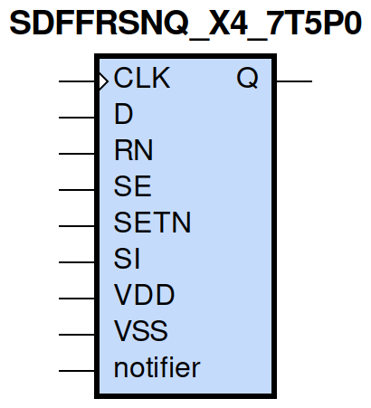
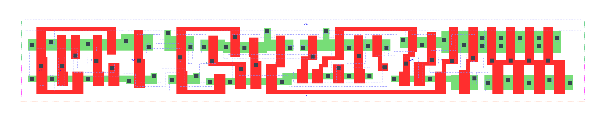

=======================================
gf180mcu_fd_sc_mcu7t5v0__sdffrsnq_x4
=======================================

**gf180mcu_fd_sc_mcu7t5v0__sdffrsnq_x4 symbol**

**gf180mcu_fd_sc_mcu7t5v0__sdffrsnq_x4 schematic**

.. image:: sc7_sch/SDFFRSNQ_X4_sch.png
    :height: 300px
    :width: 500 px
    :align: center
    :alt: gf180mcu_fd_sc_mcu7t5v0__sdffrsnq_x4 schematic

**gf180mcu_fd_sc_mcu7t5v0__sdffrsnq_x4 layout**

.. include:: images.rst

SDFFRSNQ_X4 is a positive edge triggered scan D-type flip flop, active low set/reset, 4X drive strength

|
| Attributes

============= =======================
**Attribute** **Value**
area          118.540800 µm\ :sup:`2`
============= =======================

|

TRUTH TABLE

===== ==== == == = === ======
Input                  Output
RN    SETN SE SI D CLK Q
H     H    L  X  L ↑   L
H     H    L  X  H ↑   H
H     H    H  L  X ↑   L
H     H    H  H  X ↑   H
H     L    X  X  X X   H
L     H    X  X  X X   L
L     L    X  X  X X   L
===== ==== == == = === ======

|
| FUNCTIONAL SCHEMATIC
| |image641|
| CONSTRAINTS

================== =============== ============= ============
**Constraint Pin** **Related Pin** **setup(ns)** **hold(ns)**
SE(LH)             CLK(LH)         0.6010        -0.2350
SE(LH)             CLK(LH)         0.8130        -0.0800
SE(HL)             CLK(LH)         0.6980        -0.0460
SE(HL)             CLK(LH)         0.6810        -0.3440
SI(HL)             CLK(LH)         0.7790        -0.0800
SI(HL)             CLK(LH)         0.7790        -0.0460
SI(LH)             CLK(LH)         0.6470        -0.2810
SI(LH)             CLK(LH)         0.6300        -0.2750
D(HL)              CLK(LH)         0.6870        -0.0340
D(HL)              CLK(LH)         0.6870        -0.0340
D(LH)              CLK(LH)         0.5670        -0.2290
D(LH)              CLK(LH)         0.5670        -0.2290
SETN(LH)           RN(LH)          -0.0860       0.1950
SETN(LH)           RN(LH)          -0.0860       0.1950
SETN(LH)           RN(LH)          -0.0860       0.1950
SETN(LH)           RN(LH)          -0.0860       0.1950
SETN(LH)           RN(LH)          -0.0290       0.1490
SETN(LH)           RN(LH)          -0.0290       0.1490
SETN(LH)           RN(LH)          -0.0290       0.1490
SETN(LH)           RN(LH)          -0.0290       0.1490
SETN(LH)           RN(LH)          -0.0860       0.1950
SETN(LH)           RN(LH)          -0.0860       0.1950
SETN(LH)           RN(LH)          -0.0860       0.1950
SETN(LH)           RN(LH)          -0.0290       0.1490
SETN(LH)           RN(LH)          -0.0290       0.1490
SETN(LH)           RN(LH)          -0.0290       0.1490
SETN(LH)           RN(LH)          -0.0290       0.1490
SETN(LH)           RN(LH)          -0.0860       0.1950
RN(LH)             SETN(LH)        0.1950        -0.0860
RN(LH)             SETN(LH)        0.1950        -0.0860
RN(LH)             SETN(LH)        0.1950        -0.0860
RN(LH)             SETN(LH)        0.1950        -0.0860
RN(LH)             SETN(LH)        0.1490        -0.0290
RN(LH)             SETN(LH)        0.1490        -0.0290
RN(LH)             SETN(LH)        0.1490        -0.0290
RN(LH)             SETN(LH)        0.1490        -0.0290
RN(LH)             SETN(LH)        0.1950        -0.0860
RN(LH)             SETN(LH)        0.1950        -0.0860
RN(LH)             SETN(LH)        0.1950        -0.0860
RN(LH)             SETN(LH)        0.1490        -0.0290
RN(LH)             SETN(LH)        0.1490        -0.0290
RN(LH)             SETN(LH)        0.1490        -0.0290
RN(LH)             SETN(LH)        0.1490        -0.0290
RN(LH)             SETN(LH)        0.1950        -0.0860
================== =============== ============= ============

|

================== =============== ================ ===============
**Constraint Pin** **Related Pin** **recovery(ns)** **removal(ns)**
SETN(LH)           CLK(LH)         0.0000           0.2860
SETN(LH)           CLK(LH)         0.0000           0.2860
SETN(LH)           CLK(LH)         0.0000           0.2860
SETN(LH)           CLK(LH)         0.0000           0.2860
RN(LH)             CLK(LH)         -0.2400          0.4060
RN(LH)             CLK(LH)         -0.2400          0.4060
RN(LH)             CLK(LH)         -0.2400          0.4060
RN(LH)             CLK(LH)         -0.2400          0.4060
================== =============== ================ ===============

|

================== =============== ===========================
**Constraint Pin** **Related Pin** **Minimum Pulse Width(ns)**
CLK(HLH)           CLK(HL)         0.8270
CLK(HLH)           CLK(HL)         0.8520
CLK(HLH)           CLK(HL)         0.8330
CLK(HLH)           CLK(HL)         0.7110
CLK(HLH)           CLK(HL)         0.6380
CLK(HLH)           CLK(HL)         0.9130
CLK(HLH)           CLK(HL)         0.6380
CLK(HLH)           CLK(HL)         0.6750
CLK(LHL)           CLK(LH)         0.5730
CLK(LHL)           CLK(LH)         0.5730
CLK(LHL)           CLK(LH)         0.5730
CLK(LHL)           CLK(LH)         0.6510
CLK(LHL)           CLK(LH)         0.6510
CLK(LHL)           CLK(LH)         0.5730
CLK(LHL)           CLK(LH)         0.6510
CLK(LHL)           CLK(LH)         0.6510
SETN(HLH)          SETN(HL)        0.5930
SETN(HLH)          SETN(HL)        0.5930
SETN(HLH)          SETN(HL)        0.5930
SETN(HLH)          SETN(HL)        0.5930
SETN(HLH)          SETN(HL)        0.5240
SETN(HLH)          SETN(HL)        0.5240
SETN(HLH)          SETN(HL)        0.5240
SETN(HLH)          SETN(HL)        0.5240
SETN(HLH)          SETN(HL)        0.5930
SETN(HLH)          SETN(HL)        0.5930
SETN(HLH)          SETN(HL)        0.5930
SETN(HLH)          SETN(HL)        0.5240
SETN(HLH)          SETN(HL)        0.5240
SETN(HLH)          SETN(HL)        0.5240
SETN(HLH)          SETN(HL)        0.5240
SETN(HLH)          SETN(HL)        0.5930
RN(HLH)            RN(HL)          0.3780
RN(HLH)            RN(HL)          0.3780
RN(HLH)            RN(HL)          0.3780
RN(HLH)            RN(HL)          0.3780
RN(HLH)            RN(HL)          0.4760
RN(HLH)            RN(HL)          0.4760
RN(HLH)            RN(HL)          0.4760
RN(HLH)            RN(HL)          0.4760
RN(HLH)            RN(HL)          0.3780
RN(HLH)            RN(HL)          0.3780
RN(HLH)            RN(HL)          0.3780
RN(HLH)            RN(HL)          0.4760
RN(HLH)            RN(HL)          0.4760
RN(HLH)            RN(HL)          0.4760
RN(HLH)            RN(HL)          0.4760
RN(HLH)            RN(HL)          0.3780
================== =============== ===========================

|
| PIN CAPACITANCE (pf)

======= ======== ====================
**Pin** **Type** **Capacitance (pf)**
SE      input    0.0061
SI      input    0.0027
D       input    0.0027
CLK     input    0.0036
SETN    input    0.0063
RN      input    0.0077
======= ======== ====================

|
| DELAY AND OUTPUT TRANSITION TIME corresponding to min slew and load

+---------------+------------+-----------------------+--------------+-------------------+----------------+---------------+
| **Input Pin** | **Output** | **When Condition**    | **Tin (ns)** | **Out Load (pf)** | **Delay (ns)** | **Tout (ns)** |
+---------------+------------+-----------------------+--------------+-------------------+----------------+---------------+
| CLK(LH)       | Q(HL)      | !D&RN&!SE&SETN&!SI    | 0.0100       | 0.0010            | 0.8287         | 0.0505        |
+---------------+------------+-----------------------+--------------+-------------------+----------------+---------------+
| CLK(LH)       | Q(HL)      | !D&RN&!SE&SETN&SI     | 0.0100       | 0.0010            | 0.8285         | 0.0506        |
+---------------+------------+-----------------------+--------------+-------------------+----------------+---------------+
| CLK(LH)       | Q(HL)      | !D&RN&SE&SETN&!SI     | 0.0100       | 0.0010            | 0.8288         | 0.0505        |
+---------------+------------+-----------------------+--------------+-------------------+----------------+---------------+
| CLK(LH)       | Q(HL)      | D&RN&SE&SETN&!SI      | 0.0100       | 0.0010            | 0.8285         | 0.0506        |
+---------------+------------+-----------------------+--------------+-------------------+----------------+---------------+
| CLK(LH)       | Q(LH)      | !D&RN&SE&SETN&SI      | 0.0100       | 0.0010            | 0.9494         | 0.0657        |
+---------------+------------+-----------------------+--------------+-------------------+----------------+---------------+
| CLK(LH)       | Q(LH)      | D&RN&!SE&SETN&!SI     | 0.0100       | 0.0010            | 0.9494         | 0.0657        |
+---------------+------------+-----------------------+--------------+-------------------+----------------+---------------+
| CLK(LH)       | Q(LH)      | D&RN&!SE&SETN&SI      | 0.0100       | 0.0010            | 0.9493         | 0.0658        |
+---------------+------------+-----------------------+--------------+-------------------+----------------+---------------+
| CLK(LH)       | Q(LH)      | D&RN&SE&SETN&SI       | 0.0100       | 0.0010            | 0.9494         | 0.0657        |
+---------------+------------+-----------------------+--------------+-------------------+----------------+---------------+
| SETN(HL)      | Q(LH)      | !CLK&!D&RN&!SE&!SI    | 0.0100       | 0.0010            | 0.8269         | 0.0656        |
+---------------+------------+-----------------------+--------------+-------------------+----------------+---------------+
| SETN(HL)      | Q(LH)      | !CLK&D&RN&SE&!SI      | 0.0100       | 0.0010            | 0.8269         | 0.0656        |
+---------------+------------+-----------------------+--------------+-------------------+----------------+---------------+
| SETN(HL)      | Q(LH)      | !CLK&D&RN&!SE&SI      | 0.0100       | 0.0010            | 0.8269         | 0.0662        |
+---------------+------------+-----------------------+--------------+-------------------+----------------+---------------+
| SETN(HL)      | Q(LH)      | !CLK&D&RN&SE&SI       | 0.0100       | 0.0010            | 0.8269         | 0.0662        |
+---------------+------------+-----------------------+--------------+-------------------+----------------+---------------+
| SETN(HL)      | Q(LH)      | CLK&D&RN&!SE&!SI      | 0.0100       | 0.0010            | 0.8704         | 0.0656        |
+---------------+------------+-----------------------+--------------+-------------------+----------------+---------------+
| SETN(HL)      | Q(LH)      | CLK&D&RN&SE&!SI       | 0.0100       | 0.0010            | 0.8702         | 0.0658        |
+---------------+------------+-----------------------+--------------+-------------------+----------------+---------------+
| SETN(HL)      | Q(LH)      | CLK&D&RN&!SE&SI       | 0.0100       | 0.0010            | 0.8704         | 0.0656        |
+---------------+------------+-----------------------+--------------+-------------------+----------------+---------------+
| SETN(HL)      | Q(LH)      | CLK&D&RN&SE&SI        | 0.0100       | 0.0010            | 0.8704         | 0.0656        |
+---------------+------------+-----------------------+--------------+-------------------+----------------+---------------+
| SETN(HL)      | Q(LH)      | !CLK&!D&RN&SE&!SI     | 0.0100       | 0.0010            | 0.8269         | 0.0656        |
+---------------+------------+-----------------------+--------------+-------------------+----------------+---------------+
| SETN(HL)      | Q(LH)      | !CLK&!D&RN&!SE&SI     | 0.0100       | 0.0010            | 0.8269         | 0.0656        |
+---------------+------------+-----------------------+--------------+-------------------+----------------+---------------+
| SETN(HL)      | Q(LH)      | !CLK&!D&RN&SE&SI      | 0.0100       | 0.0010            | 0.8269         | 0.0662        |
+---------------+------------+-----------------------+--------------+-------------------+----------------+---------------+
| SETN(HL)      | Q(LH)      | CLK&!D&RN&!SE&!SI     | 0.0100       | 0.0010            | 0.8704         | 0.0656        |
+---------------+------------+-----------------------+--------------+-------------------+----------------+---------------+
| SETN(HL)      | Q(LH)      | CLK&!D&RN&SE&!SI      | 0.0100       | 0.0010            | 0.8702         | 0.0658        |
+---------------+------------+-----------------------+--------------+-------------------+----------------+---------------+
| SETN(HL)      | Q(LH)      | CLK&!D&RN&!SE&SI      | 0.0100       | 0.0010            | 0.8704         | 0.0656        |
+---------------+------------+-----------------------+--------------+-------------------+----------------+---------------+
| SETN(HL)      | Q(LH)      | CLK&!D&RN&SE&SI       | 0.0100       | 0.0010            | 0.8704         | 0.0656        |
+---------------+------------+-----------------------+--------------+-------------------+----------------+---------------+
| SETN(HL)      | Q(LH)      | !CLK&D&RN&!SE&!SI     | 0.0100       | 0.0010            | 0.8269         | 0.0662        |
+---------------+------------+-----------------------+--------------+-------------------+----------------+---------------+
| RN(HL)        | Q(HL)      | !CLK&!D&!SE&SETN&!SI  | 0.0100       | 0.0010            | 0.2628         | 0.0475        |
+---------------+------------+-----------------------+--------------+-------------------+----------------+---------------+
| RN(HL)        | Q(HL)      | !CLK&D&SE&SETN&!SI    | 0.0100       | 0.0010            | 0.2628         | 0.0475        |
+---------------+------------+-----------------------+--------------+-------------------+----------------+---------------+
| RN(HL)        | Q(HL)      | !CLK&D&!SE&SETN&SI    | 0.0100       | 0.0010            | 0.2628         | 0.0473        |
+---------------+------------+-----------------------+--------------+-------------------+----------------+---------------+
| RN(HL)        | Q(HL)      | !CLK&D&SE&SETN&SI     | 0.0100       | 0.0010            | 0.2628         | 0.0473        |
+---------------+------------+-----------------------+--------------+-------------------+----------------+---------------+
| RN(HL)        | Q(HL)      | CLK&D&!SE&SETN&!SI    | 0.0100       | 0.0010            | 0.2626         | 0.0471        |
+---------------+------------+-----------------------+--------------+-------------------+----------------+---------------+
| RN(HL)        | Q(HL)      | CLK&D&SE&SETN&!SI     | 0.0100       | 0.0010            | 0.2626         | 0.0473        |
+---------------+------------+-----------------------+--------------+-------------------+----------------+---------------+
| RN(HL)        | Q(HL)      | CLK&D&!SE&SETN&SI     | 0.0100       | 0.0010            | 0.2626         | 0.0471        |
+---------------+------------+-----------------------+--------------+-------------------+----------------+---------------+
| RN(HL)        | Q(HL)      | CLK&D&SE&SETN&SI      | 0.0100       | 0.0010            | 0.2626         | 0.0471        |
+---------------+------------+-----------------------+--------------+-------------------+----------------+---------------+
| RN(HL)        | Q(HL)      | !CLK&!D&!SE&!SETN&!SI | 0.0100       | 0.0010            | 0.2622         | 0.0472        |
+---------------+------------+-----------------------+--------------+-------------------+----------------+---------------+
| RN(HL)        | Q(HL)      | !CLK&!D&!SE&!SETN&SI  | 0.0100       | 0.0010            | 0.2622         | 0.0472        |
+---------------+------------+-----------------------+--------------+-------------------+----------------+---------------+
| RN(HL)        | Q(HL)      | !CLK&!D&SE&!SETN&!SI  | 0.0100       | 0.0010            | 0.2623         | 0.0470        |
+---------------+------------+-----------------------+--------------+-------------------+----------------+---------------+
| RN(HL)        | Q(HL)      | !CLK&!D&SE&!SETN&SI   | 0.0100       | 0.0010            | 0.2623         | 0.0470        |
+---------------+------------+-----------------------+--------------+-------------------+----------------+---------------+
| RN(HL)        | Q(HL)      | !CLK&D&!SE&!SETN&!SI  | 0.0100       | 0.0010            | 0.2622         | 0.0472        |
+---------------+------------+-----------------------+--------------+-------------------+----------------+---------------+
| RN(HL)        | Q(HL)      | !CLK&D&!SE&!SETN&SI   | 0.0100       | 0.0010            | 0.2623         | 0.0470        |
+---------------+------------+-----------------------+--------------+-------------------+----------------+---------------+
| RN(HL)        | Q(HL)      | !CLK&D&SE&!SETN&!SI   | 0.0100       | 0.0010            | 0.2623         | 0.0470        |
+---------------+------------+-----------------------+--------------+-------------------+----------------+---------------+
| RN(HL)        | Q(HL)      | !CLK&D&SE&!SETN&SI    | 0.0100       | 0.0010            | 0.2623         | 0.0470        |
+---------------+------------+-----------------------+--------------+-------------------+----------------+---------------+
| RN(HL)        | Q(HL)      | CLK&!D&!SE&!SETN&!SI  | 0.0100       | 0.0010            | 0.2624         | 0.0468        |
+---------------+------------+-----------------------+--------------+-------------------+----------------+---------------+
| RN(HL)        | Q(HL)      | CLK&!D&!SE&!SETN&SI   | 0.0100       | 0.0010            | 0.2625         | 0.0468        |
+---------------+------------+-----------------------+--------------+-------------------+----------------+---------------+
| RN(HL)        | Q(HL)      | CLK&!D&SE&!SETN&!SI   | 0.0100       | 0.0010            | 0.2625         | 0.0468        |
+---------------+------------+-----------------------+--------------+-------------------+----------------+---------------+
| RN(HL)        | Q(HL)      | CLK&!D&SE&!SETN&SI    | 0.0100       | 0.0010            | 0.2625         | 0.0468        |
+---------------+------------+-----------------------+--------------+-------------------+----------------+---------------+
| RN(HL)        | Q(HL)      | CLK&D&!SE&!SETN&!SI   | 0.0100       | 0.0010            | 0.2625         | 0.0468        |
+---------------+------------+-----------------------+--------------+-------------------+----------------+---------------+
| RN(HL)        | Q(HL)      | CLK&D&!SE&!SETN&SI    | 0.0100       | 0.0010            | 0.2625         | 0.0468        |
+---------------+------------+-----------------------+--------------+-------------------+----------------+---------------+
| RN(HL)        | Q(HL)      | CLK&D&SE&!SETN&!SI    | 0.0100       | 0.0010            | 0.2625         | 0.0468        |
+---------------+------------+-----------------------+--------------+-------------------+----------------+---------------+
| RN(HL)        | Q(HL)      | CLK&D&SE&!SETN&SI     | 0.0100       | 0.0010            | 0.2625         | 0.0468        |
+---------------+------------+-----------------------+--------------+-------------------+----------------+---------------+
| RN(HL)        | Q(HL)      | !CLK&!D&SE&SETN&!SI   | 0.0100       | 0.0010            | 0.2628         | 0.0476        |
+---------------+------------+-----------------------+--------------+-------------------+----------------+---------------+
| RN(HL)        | Q(HL)      | !CLK&!D&!SE&SETN&SI   | 0.0100       | 0.0010            | 0.2628         | 0.0475        |
+---------------+------------+-----------------------+--------------+-------------------+----------------+---------------+
| RN(HL)        | Q(HL)      | !CLK&!D&SE&SETN&SI    | 0.0100       | 0.0010            | 0.2628         | 0.0473        |
+---------------+------------+-----------------------+--------------+-------------------+----------------+---------------+
| RN(HL)        | Q(HL)      | CLK&!D&!SE&SETN&!SI   | 0.0100       | 0.0010            | 0.2626         | 0.0472        |
+---------------+------------+-----------------------+--------------+-------------------+----------------+---------------+
| RN(HL)        | Q(HL)      | CLK&!D&SE&SETN&!SI    | 0.0100       | 0.0010            | 0.2626         | 0.0473        |
+---------------+------------+-----------------------+--------------+-------------------+----------------+---------------+
| RN(HL)        | Q(HL)      | CLK&!D&!SE&SETN&SI    | 0.0100       | 0.0010            | 0.2627         | 0.0471        |
+---------------+------------+-----------------------+--------------+-------------------+----------------+---------------+
| RN(HL)        | Q(HL)      | CLK&!D&SE&SETN&SI     | 0.0100       | 0.0010            | 0.2626         | 0.0471        |
+---------------+------------+-----------------------+--------------+-------------------+----------------+---------------+
| RN(HL)        | Q(HL)      | !CLK&D&!SE&SETN&!SI   | 0.0100       | 0.0010            | 0.2628         | 0.0473        |
+---------------+------------+-----------------------+--------------+-------------------+----------------+---------------+
| RN(LH)        | Q(LH)      | !CLK&!D&!SE&!SETN&!SI | 0.0100       | 0.0010            | 0.4702         | 0.0645        |
+---------------+------------+-----------------------+--------------+-------------------+----------------+---------------+
| RN(LH)        | Q(LH)      | !CLK&!D&!SE&!SETN&SI  | 0.0100       | 0.0010            | 0.4702         | 0.0645        |
+---------------+------------+-----------------------+--------------+-------------------+----------------+---------------+
| RN(LH)        | Q(LH)      | !CLK&!D&SE&!SETN&!SI  | 0.0100       | 0.0010            | 0.4702         | 0.0645        |
+---------------+------------+-----------------------+--------------+-------------------+----------------+---------------+
| RN(LH)        | Q(LH)      | !CLK&!D&SE&!SETN&SI   | 0.0100       | 0.0010            | 0.4700         | 0.0650        |
+---------------+------------+-----------------------+--------------+-------------------+----------------+---------------+
| RN(LH)        | Q(LH)      | !CLK&D&!SE&!SETN&!SI  | 0.0100       | 0.0010            | 0.4700         | 0.0650        |
+---------------+------------+-----------------------+--------------+-------------------+----------------+---------------+
| RN(LH)        | Q(LH)      | !CLK&D&!SE&!SETN&SI   | 0.0100       | 0.0010            | 0.4700         | 0.0650        |
+---------------+------------+-----------------------+--------------+-------------------+----------------+---------------+
| RN(LH)        | Q(LH)      | !CLK&D&SE&!SETN&!SI   | 0.0100       | 0.0010            | 0.4702         | 0.0645        |
+---------------+------------+-----------------------+--------------+-------------------+----------------+---------------+
| RN(LH)        | Q(LH)      | !CLK&D&SE&!SETN&SI    | 0.0100       | 0.0010            | 0.4700         | 0.0650        |
+---------------+------------+-----------------------+--------------+-------------------+----------------+---------------+
| RN(LH)        | Q(LH)      | CLK&!D&!SE&!SETN&!SI  | 0.0100       | 0.0010            | 0.4723         | 0.0645        |
+---------------+------------+-----------------------+--------------+-------------------+----------------+---------------+
| RN(LH)        | Q(LH)      | CLK&!D&!SE&!SETN&SI   | 0.0100       | 0.0010            | 0.4723         | 0.0645        |
+---------------+------------+-----------------------+--------------+-------------------+----------------+---------------+
| RN(LH)        | Q(LH)      | CLK&!D&SE&!SETN&!SI   | 0.0100       | 0.0010            | 0.4723         | 0.0646        |
+---------------+------------+-----------------------+--------------+-------------------+----------------+---------------+
| RN(LH)        | Q(LH)      | CLK&!D&SE&!SETN&SI    | 0.0100       | 0.0010            | 0.4723         | 0.0646        |
+---------------+------------+-----------------------+--------------+-------------------+----------------+---------------+
| RN(LH)        | Q(LH)      | CLK&D&!SE&!SETN&!SI   | 0.0100       | 0.0010            | 0.4723         | 0.0645        |
+---------------+------------+-----------------------+--------------+-------------------+----------------+---------------+
| RN(LH)        | Q(LH)      | CLK&D&!SE&!SETN&SI    | 0.0100       | 0.0010            | 0.4723         | 0.0645        |
+---------------+------------+-----------------------+--------------+-------------------+----------------+---------------+
| RN(LH)        | Q(LH)      | CLK&D&SE&!SETN&!SI    | 0.0100       | 0.0010            | 0.4723         | 0.0646        |
+---------------+------------+-----------------------+--------------+-------------------+----------------+---------------+
| RN(LH)        | Q(LH)      | CLK&D&SE&!SETN&SI     | 0.0100       | 0.0010            | 0.4723         | 0.0646        |
+---------------+------------+-----------------------+--------------+-------------------+----------------+---------------+

|
| DYNAMIC ENERGY

+---------------+------------------------+--------------+------------+-------------------+---------------------+
| **Input Pin** | **When Condition**     | **Tin (ns)** | **Output** | **Out Load (pf)** | **Energy (uW/MHz)** |
+---------------+------------------------+--------------+------------+-------------------+---------------------+
| CLK           | !D&RN&!SE&SETN&!SI     | 0.0100       | Q(HL)      | 0.0010            | 1.1893              |
+---------------+------------------------+--------------+------------+-------------------+---------------------+
| CLK           | !D&RN&!SE&SETN&SI      | 0.0100       | Q(HL)      | 0.0010            | 1.1897              |
+---------------+------------------------+--------------+------------+-------------------+---------------------+
| CLK           | !D&RN&SE&SETN&!SI      | 0.0100       | Q(HL)      | 0.0010            | 1.1895              |
+---------------+------------------------+--------------+------------+-------------------+---------------------+
| CLK           | D&RN&SE&SETN&!SI       | 0.0100       | Q(HL)      | 0.0010            | 1.1896              |
+---------------+------------------------+--------------+------------+-------------------+---------------------+
| CLK           | !D&RN&SE&SETN&SI       | 0.0100       | Q(LH)      | 0.0010            | 1.4224              |
+---------------+------------------------+--------------+------------+-------------------+---------------------+
| CLK           | D&RN&!SE&SETN&!SI      | 0.0100       | Q(LH)      | 0.0010            | 1.4221              |
+---------------+------------------------+--------------+------------+-------------------+---------------------+
| CLK           | D&RN&!SE&SETN&SI       | 0.0100       | Q(LH)      | 0.0010            | 1.4221              |
+---------------+------------------------+--------------+------------+-------------------+---------------------+
| CLK           | D&RN&SE&SETN&SI        | 0.0100       | Q(LH)      | 0.0010            | 1.4225              |
+---------------+------------------------+--------------+------------+-------------------+---------------------+
| SETN          | !CLK&!D&RN&!SE&!SI     | 0.0100       | Q(LH)      | 0.0010            | 1.2619              |
+---------------+------------------------+--------------+------------+-------------------+---------------------+
| SETN          | !CLK&D&RN&SE&!SI       | 0.0100       | Q(LH)      | 0.0010            | 1.2622              |
+---------------+------------------------+--------------+------------+-------------------+---------------------+
| SETN          | !CLK&D&RN&!SE&SI       | 0.0100       | Q(LH)      | 0.0010            | 1.1483              |
+---------------+------------------------+--------------+------------+-------------------+---------------------+
| SETN          | !CLK&D&RN&SE&SI        | 0.0100       | Q(LH)      | 0.0010            | 1.1483              |
+---------------+------------------------+--------------+------------+-------------------+---------------------+
| SETN          | CLK&D&RN&!SE&!SI       | 0.0100       | Q(LH)      | 0.0010            | 1.3579              |
+---------------+------------------------+--------------+------------+-------------------+---------------------+
| SETN          | CLK&D&RN&SE&!SI        | 0.0100       | Q(LH)      | 0.0010            | 1.3574              |
+---------------+------------------------+--------------+------------+-------------------+---------------------+
| SETN          | CLK&D&RN&!SE&SI        | 0.0100       | Q(LH)      | 0.0010            | 1.3579              |
+---------------+------------------------+--------------+------------+-------------------+---------------------+
| SETN          | CLK&D&RN&SE&SI         | 0.0100       | Q(LH)      | 0.0010            | 1.3578              |
+---------------+------------------------+--------------+------------+-------------------+---------------------+
| SETN          | !CLK&!D&RN&SE&!SI      | 0.0100       | Q(LH)      | 0.0010            | 1.2622              |
+---------------+------------------------+--------------+------------+-------------------+---------------------+
| SETN          | !CLK&!D&RN&!SE&SI      | 0.0100       | Q(LH)      | 0.0010            | 1.2622              |
+---------------+------------------------+--------------+------------+-------------------+---------------------+
| SETN          | !CLK&!D&RN&SE&SI       | 0.0100       | Q(LH)      | 0.0010            | 1.1483              |
+---------------+------------------------+--------------+------------+-------------------+---------------------+
| SETN          | CLK&!D&RN&!SE&!SI      | 0.0100       | Q(LH)      | 0.0010            | 1.3578              |
+---------------+------------------------+--------------+------------+-------------------+---------------------+
| SETN          | CLK&!D&RN&SE&!SI       | 0.0100       | Q(LH)      | 0.0010            | 1.3574              |
+---------------+------------------------+--------------+------------+-------------------+---------------------+
| SETN          | CLK&!D&RN&!SE&SI       | 0.0100       | Q(LH)      | 0.0010            | 1.3578              |
+---------------+------------------------+--------------+------------+-------------------+---------------------+
| SETN          | CLK&!D&RN&SE&SI        | 0.0100       | Q(LH)      | 0.0010            | 1.3578              |
+---------------+------------------------+--------------+------------+-------------------+---------------------+
| SETN          | !CLK&D&RN&!SE&!SI      | 0.0100       | Q(LH)      | 0.0010            | 1.1483              |
+---------------+------------------------+--------------+------------+-------------------+---------------------+
| RN            | !CLK&!D&!SE&SETN&!SI   | 0.0100       | Q(HL)      | 0.0010            | 0.9236              |
+---------------+------------------------+--------------+------------+-------------------+---------------------+
| RN            | !CLK&D&SE&SETN&!SI     | 0.0100       | Q(HL)      | 0.0010            | 0.9236              |
+---------------+------------------------+--------------+------------+-------------------+---------------------+
| RN            | !CLK&D&!SE&SETN&SI     | 0.0100       | Q(HL)      | 0.0010            | 0.9233              |
+---------------+------------------------+--------------+------------+-------------------+---------------------+
| RN            | !CLK&D&SE&SETN&SI      | 0.0100       | Q(HL)      | 0.0010            | 0.9233              |
+---------------+------------------------+--------------+------------+-------------------+---------------------+
| RN            | CLK&D&!SE&SETN&!SI     | 0.0100       | Q(HL)      | 0.0010            | 1.1520              |
+---------------+------------------------+--------------+------------+-------------------+---------------------+
| RN            | CLK&D&SE&SETN&!SI      | 0.0100       | Q(HL)      | 0.0010            | 1.1528              |
+---------------+------------------------+--------------+------------+-------------------+---------------------+
| RN            | CLK&D&!SE&SETN&SI      | 0.0100       | Q(HL)      | 0.0010            | 1.1520              |
+---------------+------------------------+--------------+------------+-------------------+---------------------+
| RN            | CLK&D&SE&SETN&SI       | 0.0100       | Q(HL)      | 0.0010            | 1.1520              |
+---------------+------------------------+--------------+------------+-------------------+---------------------+
| RN            | !CLK&!D&!SE&!SETN&!SI  | 0.0100       | Q(HL)      | 0.0010            | 0.7729              |
+---------------+------------------------+--------------+------------+-------------------+---------------------+
| RN            | !CLK&!D&!SE&!SETN&SI   | 0.0100       | Q(HL)      | 0.0010            | 0.7729              |
+---------------+------------------------+--------------+------------+-------------------+---------------------+
| RN            | !CLK&!D&SE&!SETN&!SI   | 0.0100       | Q(HL)      | 0.0010            | 0.7729              |
+---------------+------------------------+--------------+------------+-------------------+---------------------+
| RN            | !CLK&!D&SE&!SETN&SI    | 0.0100       | Q(HL)      | 0.0010            | 0.7711              |
+---------------+------------------------+--------------+------------+-------------------+---------------------+
| RN            | !CLK&D&!SE&!SETN&!SI   | 0.0100       | Q(HL)      | 0.0010            | 0.7711              |
+---------------+------------------------+--------------+------------+-------------------+---------------------+
| RN            | !CLK&D&!SE&!SETN&SI    | 0.0100       | Q(HL)      | 0.0010            | 0.7711              |
+---------------+------------------------+--------------+------------+-------------------+---------------------+
| RN            | !CLK&D&SE&!SETN&!SI    | 0.0100       | Q(HL)      | 0.0010            | 0.7729              |
+---------------+------------------------+--------------+------------+-------------------+---------------------+
| RN            | !CLK&D&SE&!SETN&SI     | 0.0100       | Q(HL)      | 0.0010            | 0.7711              |
+---------------+------------------------+--------------+------------+-------------------+---------------------+
| RN            | CLK&!D&!SE&!SETN&!SI   | 0.0100       | Q(HL)      | 0.0010            | 0.9176              |
+---------------+------------------------+--------------+------------+-------------------+---------------------+
| RN            | CLK&!D&!SE&!SETN&SI    | 0.0100       | Q(HL)      | 0.0010            | 0.9173              |
+---------------+------------------------+--------------+------------+-------------------+---------------------+
| RN            | CLK&!D&SE&!SETN&!SI    | 0.0100       | Q(HL)      | 0.0010            | 0.9173              |
+---------------+------------------------+--------------+------------+-------------------+---------------------+
| RN            | CLK&!D&SE&!SETN&SI     | 0.0100       | Q(HL)      | 0.0010            | 0.9175              |
+---------------+------------------------+--------------+------------+-------------------+---------------------+
| RN            | CLK&D&!SE&!SETN&!SI    | 0.0100       | Q(HL)      | 0.0010            | 0.9175              |
+---------------+------------------------+--------------+------------+-------------------+---------------------+
| RN            | CLK&D&!SE&!SETN&SI     | 0.0100       | Q(HL)      | 0.0010            | 0.9173              |
+---------------+------------------------+--------------+------------+-------------------+---------------------+
| RN            | CLK&D&SE&!SETN&!SI     | 0.0100       | Q(HL)      | 0.0010            | 0.9173              |
+---------------+------------------------+--------------+------------+-------------------+---------------------+
| RN            | CLK&D&SE&!SETN&SI      | 0.0100       | Q(HL)      | 0.0010            | 0.9175              |
+---------------+------------------------+--------------+------------+-------------------+---------------------+
| RN            | !CLK&!D&SE&SETN&!SI    | 0.0100       | Q(HL)      | 0.0010            | 0.9236              |
+---------------+------------------------+--------------+------------+-------------------+---------------------+
| RN            | !CLK&!D&!SE&SETN&SI    | 0.0100       | Q(HL)      | 0.0010            | 0.9236              |
+---------------+------------------------+--------------+------------+-------------------+---------------------+
| RN            | !CLK&!D&SE&SETN&SI     | 0.0100       | Q(HL)      | 0.0010            | 0.9233              |
+---------------+------------------------+--------------+------------+-------------------+---------------------+
| RN            | CLK&!D&!SE&SETN&!SI    | 0.0100       | Q(HL)      | 0.0010            | 1.1527              |
+---------------+------------------------+--------------+------------+-------------------+---------------------+
| RN            | CLK&!D&SE&SETN&!SI     | 0.0100       | Q(HL)      | 0.0010            | 1.1528              |
+---------------+------------------------+--------------+------------+-------------------+---------------------+
| RN            | CLK&!D&!SE&SETN&SI     | 0.0100       | Q(HL)      | 0.0010            | 1.1526              |
+---------------+------------------------+--------------+------------+-------------------+---------------------+
| RN            | CLK&!D&SE&SETN&SI      | 0.0100       | Q(HL)      | 0.0010            | 1.1520              |
+---------------+------------------------+--------------+------------+-------------------+---------------------+
| RN            | !CLK&D&!SE&SETN&!SI    | 0.0100       | Q(HL)      | 0.0010            | 0.9233              |
+---------------+------------------------+--------------+------------+-------------------+---------------------+
| RN            | !CLK&!D&!SE&!SETN&!SI  | 0.0100       | Q(LH)      | 0.0010            | 0.7774              |
+---------------+------------------------+--------------+------------+-------------------+---------------------+
| RN            | !CLK&!D&!SE&!SETN&SI   | 0.0100       | Q(LH)      | 0.0010            | 0.7774              |
+---------------+------------------------+--------------+------------+-------------------+---------------------+
| RN            | !CLK&!D&SE&!SETN&!SI   | 0.0100       | Q(LH)      | 0.0010            | 0.7774              |
+---------------+------------------------+--------------+------------+-------------------+---------------------+
| RN            | !CLK&!D&SE&!SETN&SI    | 0.0100       | Q(LH)      | 0.0010            | 0.7783              |
+---------------+------------------------+--------------+------------+-------------------+---------------------+
| RN            | !CLK&D&!SE&!SETN&!SI   | 0.0100       | Q(LH)      | 0.0010            | 0.7783              |
+---------------+------------------------+--------------+------------+-------------------+---------------------+
| RN            | !CLK&D&!SE&!SETN&SI    | 0.0100       | Q(LH)      | 0.0010            | 0.7783              |
+---------------+------------------------+--------------+------------+-------------------+---------------------+
| RN            | !CLK&D&SE&!SETN&!SI    | 0.0100       | Q(LH)      | 0.0010            | 0.7774              |
+---------------+------------------------+--------------+------------+-------------------+---------------------+
| RN            | !CLK&D&SE&!SETN&SI     | 0.0100       | Q(LH)      | 0.0010            | 0.7783              |
+---------------+------------------------+--------------+------------+-------------------+---------------------+
| RN            | CLK&!D&!SE&!SETN&!SI   | 0.0100       | Q(LH)      | 0.0010            | 0.8720              |
+---------------+------------------------+--------------+------------+-------------------+---------------------+
| RN            | CLK&!D&!SE&!SETN&SI    | 0.0100       | Q(LH)      | 0.0010            | 0.8720              |
+---------------+------------------------+--------------+------------+-------------------+---------------------+
| RN            | CLK&!D&SE&!SETN&!SI    | 0.0100       | Q(LH)      | 0.0010            | 0.8720              |
+---------------+------------------------+--------------+------------+-------------------+---------------------+
| RN            | CLK&!D&SE&!SETN&SI     | 0.0100       | Q(LH)      | 0.0010            | 0.8720              |
+---------------+------------------------+--------------+------------+-------------------+---------------------+
| RN            | CLK&D&!SE&!SETN&!SI    | 0.0100       | Q(LH)      | 0.0010            | 0.8720              |
+---------------+------------------------+--------------+------------+-------------------+---------------------+
| RN            | CLK&D&!SE&!SETN&SI     | 0.0100       | Q(LH)      | 0.0010            | 0.8720              |
+---------------+------------------------+--------------+------------+-------------------+---------------------+
| RN            | CLK&D&SE&!SETN&!SI     | 0.0100       | Q(LH)      | 0.0010            | 0.8720              |
+---------------+------------------------+--------------+------------+-------------------+---------------------+
| RN            | CLK&D&SE&!SETN&SI      | 0.0100       | Q(LH)      | 0.0010            | 0.8720              |
+---------------+------------------------+--------------+------------+-------------------+---------------------+
| SETN(HL)      | !CLK&!D&!RN&!SE&!SI    | 0.0100       | n/a        | n/a               | 0.3783              |
+---------------+------------------------+--------------+------------+-------------------+---------------------+
| SETN(HL)      | !CLK&!D&!RN&!SE&SI     | 0.0100       | n/a        | n/a               | 0.3783              |
+---------------+------------------------+--------------+------------+-------------------+---------------------+
| SETN(HL)      | !CLK&!D&!RN&SE&!SI     | 0.0100       | n/a        | n/a               | 0.3783              |
+---------------+------------------------+--------------+------------+-------------------+---------------------+
| SETN(HL)      | !CLK&!D&!RN&SE&SI      | 0.0100       | n/a        | n/a               | 0.2714              |
+---------------+------------------------+--------------+------------+-------------------+---------------------+
| SETN(HL)      | !CLK&D&!RN&!SE&!SI     | 0.0100       | n/a        | n/a               | 0.2714              |
+---------------+------------------------+--------------+------------+-------------------+---------------------+
| SETN(HL)      | !CLK&D&!RN&!SE&SI      | 0.0100       | n/a        | n/a               | 0.2714              |
+---------------+------------------------+--------------+------------+-------------------+---------------------+
| SETN(HL)      | !CLK&D&!RN&SE&!SI      | 0.0100       | n/a        | n/a               | 0.3783              |
+---------------+------------------------+--------------+------------+-------------------+---------------------+
| SETN(HL)      | !CLK&D&!RN&SE&SI       | 0.0100       | n/a        | n/a               | 0.2714              |
+---------------+------------------------+--------------+------------+-------------------+---------------------+
| SETN(HL)      | CLK&!D&!RN&!SE&!SI     | 0.0100       | n/a        | n/a               | 0.3783              |
+---------------+------------------------+--------------+------------+-------------------+---------------------+
| SETN(HL)      | CLK&!D&!RN&!SE&SI      | 0.0100       | n/a        | n/a               | 0.3783              |
+---------------+------------------------+--------------+------------+-------------------+---------------------+
| SETN(HL)      | CLK&!D&!RN&SE&!SI      | 0.0100       | n/a        | n/a               | 0.3783              |
+---------------+------------------------+--------------+------------+-------------------+---------------------+
| SETN(HL)      | CLK&!D&!RN&SE&SI       | 0.0100       | n/a        | n/a               | 0.3783              |
+---------------+------------------------+--------------+------------+-------------------+---------------------+
| SETN(HL)      | CLK&D&!RN&!SE&!SI      | 0.0100       | n/a        | n/a               | 0.3783              |
+---------------+------------------------+--------------+------------+-------------------+---------------------+
| SETN(HL)      | CLK&D&!RN&!SE&SI       | 0.0100       | n/a        | n/a               | 0.3783              |
+---------------+------------------------+--------------+------------+-------------------+---------------------+
| SETN(HL)      | CLK&D&!RN&SE&!SI       | 0.0100       | n/a        | n/a               | 0.3783              |
+---------------+------------------------+--------------+------------+-------------------+---------------------+
| SETN(HL)      | CLK&D&!RN&SE&SI        | 0.0100       | n/a        | n/a               | 0.3783              |
+---------------+------------------------+--------------+------------+-------------------+---------------------+
| SETN(HL)      | CLK&!D&RN&!SE&!SI      | 0.0100       | n/a        | n/a               | 0.0444              |
+---------------+------------------------+--------------+------------+-------------------+---------------------+
| SETN(HL)      | CLK&!D&RN&SE&!SI       | 0.0100       | n/a        | n/a               | 0.0444              |
+---------------+------------------------+--------------+------------+-------------------+---------------------+
| SETN(HL)      | CLK&!D&RN&!SE&SI       | 0.0100       | n/a        | n/a               | 0.0444              |
+---------------+------------------------+--------------+------------+-------------------+---------------------+
| SETN(HL)      | CLK&!D&RN&SE&SI        | 0.0100       | n/a        | n/a               | 0.0444              |
+---------------+------------------------+--------------+------------+-------------------+---------------------+
| SETN(HL)      | !CLK&D&RN&!SE&!SI      | 0.0100       | n/a        | n/a               | 0.0444              |
+---------------+------------------------+--------------+------------+-------------------+---------------------+
| SETN(HL)      | !CLK&D&RN&SE&!SI       | 0.0100       | n/a        | n/a               | 0.1577              |
+---------------+------------------------+--------------+------------+-------------------+---------------------+
| SETN(HL)      | !CLK&D&RN&!SE&SI       | 0.0100       | n/a        | n/a               | 0.0444              |
+---------------+------------------------+--------------+------------+-------------------+---------------------+
| SETN(HL)      | !CLK&D&RN&SE&SI        | 0.0100       | n/a        | n/a               | 0.0444              |
+---------------+------------------------+--------------+------------+-------------------+---------------------+
| SETN(HL)      | CLK&D&RN&!SE&!SI       | 0.0100       | n/a        | n/a               | 0.0444              |
+---------------+------------------------+--------------+------------+-------------------+---------------------+
| SETN(HL)      | CLK&D&RN&SE&!SI        | 0.0100       | n/a        | n/a               | 0.0444              |
+---------------+------------------------+--------------+------------+-------------------+---------------------+
| SETN(HL)      | !CLK&!D&RN&!SE&!SI     | 0.0100       | n/a        | n/a               | 0.1577              |
+---------------+------------------------+--------------+------------+-------------------+---------------------+
| SETN(HL)      | CLK&D&RN&!SE&SI        | 0.0100       | n/a        | n/a               | 0.0444              |
+---------------+------------------------+--------------+------------+-------------------+---------------------+
| SETN(HL)      | CLK&D&RN&SE&SI         | 0.0100       | n/a        | n/a               | 0.0444              |
+---------------+------------------------+--------------+------------+-------------------+---------------------+
| SETN(HL)      | !CLK&!D&RN&SE&!SI      | 0.0100       | n/a        | n/a               | 0.1577              |
+---------------+------------------------+--------------+------------+-------------------+---------------------+
| SETN(HL)      | !CLK&!D&RN&!SE&SI      | 0.0100       | n/a        | n/a               | 0.1577              |
+---------------+------------------------+--------------+------------+-------------------+---------------------+
| SETN(HL)      | !CLK&!D&RN&SE&SI       | 0.0100       | n/a        | n/a               | 0.0444              |
+---------------+------------------------+--------------+------------+-------------------+---------------------+
| D(HL)         | !CLK&!RN&!SE&!SETN&!SI | 0.0100       | n/a        | n/a               | 0.2351              |
+---------------+------------------------+--------------+------------+-------------------+---------------------+
| D(HL)         | !CLK&!RN&!SE&!SETN&SI  | 0.0100       | n/a        | n/a               | 0.2351              |
+---------------+------------------------+--------------+------------+-------------------+---------------------+
| D(HL)         | !CLK&!RN&!SE&SETN&!SI  | 0.0100       | n/a        | n/a               | 0.3488              |
+---------------+------------------------+--------------+------------+-------------------+---------------------+
| D(HL)         | !CLK&!RN&!SE&SETN&SI   | 0.0100       | n/a        | n/a               | 0.3489              |
+---------------+------------------------+--------------+------------+-------------------+---------------------+
| D(HL)         | !CLK&!RN&SE&!SETN&!SI  | 0.0100       | n/a        | n/a               | 0.0203              |
+---------------+------------------------+--------------+------------+-------------------+---------------------+
| D(HL)         | !CLK&!RN&SE&!SETN&SI   | 0.0100       | n/a        | n/a               | 0.0100              |
+---------------+------------------------+--------------+------------+-------------------+---------------------+
| D(HL)         | !CLK&!RN&SE&SETN&!SI   | 0.0100       | n/a        | n/a               | 0.0203              |
+---------------+------------------------+--------------+------------+-------------------+---------------------+
| D(HL)         | !CLK&!RN&SE&SETN&SI    | 0.0100       | n/a        | n/a               | 0.0100              |
+---------------+------------------------+--------------+------------+-------------------+---------------------+
| D(HL)         | CLK&!RN&!SE&!SETN&!SI  | 0.0100       | n/a        | n/a               | 0.0249              |
+---------------+------------------------+--------------+------------+-------------------+---------------------+
| D(HL)         | CLK&!RN&!SE&!SETN&SI   | 0.0100       | n/a        | n/a               | 0.0249              |
+---------------+------------------------+--------------+------------+-------------------+---------------------+
| D(HL)         | CLK&!RN&!SE&SETN&!SI   | 0.0100       | n/a        | n/a               | 0.0249              |
+---------------+------------------------+--------------+------------+-------------------+---------------------+
| D(HL)         | CLK&!RN&!SE&SETN&SI    | 0.0100       | n/a        | n/a               | 0.0249              |
+---------------+------------------------+--------------+------------+-------------------+---------------------+
| D(HL)         | CLK&!RN&SE&!SETN&!SI   | 0.0100       | n/a        | n/a               | 0.0236              |
+---------------+------------------------+--------------+------------+-------------------+---------------------+
| D(HL)         | CLK&!RN&SE&!SETN&SI    | 0.0100       | n/a        | n/a               | 0.0095              |
+---------------+------------------------+--------------+------------+-------------------+---------------------+
| D(HL)         | CLK&!RN&SE&SETN&!SI    | 0.0100       | n/a        | n/a               | 0.0236              |
+---------------+------------------------+--------------+------------+-------------------+---------------------+
| D(HL)         | CLK&!RN&SE&SETN&SI     | 0.0100       | n/a        | n/a               | 0.0095              |
+---------------+------------------------+--------------+------------+-------------------+---------------------+
| D(HL)         | !CLK&RN&!SE&SETN&!SI   | 0.0100       | n/a        | n/a               | 0.3386              |
+---------------+------------------------+--------------+------------+-------------------+---------------------+
| D(HL)         | !CLK&RN&SE&SETN&!SI    | 0.0100       | n/a        | n/a               | 0.0203              |
+---------------+------------------------+--------------+------------+-------------------+---------------------+
| D(HL)         | !CLK&RN&!SE&SETN&SI    | 0.0100       | n/a        | n/a               | 0.3386              |
+---------------+------------------------+--------------+------------+-------------------+---------------------+
| D(HL)         | !CLK&RN&SE&SETN&SI     | 0.0100       | n/a        | n/a               | 0.0100              |
+---------------+------------------------+--------------+------------+-------------------+---------------------+
| D(HL)         | CLK&RN&!SE&SETN&!SI    | 0.0100       | n/a        | n/a               | 0.0568              |
+---------------+------------------------+--------------+------------+-------------------+---------------------+
| D(HL)         | CLK&RN&SE&SETN&!SI     | 0.0100       | n/a        | n/a               | 0.0202              |
+---------------+------------------------+--------------+------------+-------------------+---------------------+
| D(HL)         | !CLK&RN&!SE&!SETN&!SI  | 0.0100       | n/a        | n/a               | 0.2351              |
+---------------+------------------------+--------------+------------+-------------------+---------------------+
| D(HL)         | !CLK&RN&!SE&!SETN&SI   | 0.0100       | n/a        | n/a               | 0.2351              |
+---------------+------------------------+--------------+------------+-------------------+---------------------+
| D(HL)         | !CLK&RN&SE&!SETN&!SI   | 0.0100       | n/a        | n/a               | 0.0203              |
+---------------+------------------------+--------------+------------+-------------------+---------------------+
| D(HL)         | !CLK&RN&SE&!SETN&SI    | 0.0100       | n/a        | n/a               | 0.0100              |
+---------------+------------------------+--------------+------------+-------------------+---------------------+
| D(HL)         | CLK&RN&!SE&!SETN&!SI   | 0.0100       | n/a        | n/a               | 0.0224              |
+---------------+------------------------+--------------+------------+-------------------+---------------------+
| D(HL)         | CLK&RN&!SE&!SETN&SI    | 0.0100       | n/a        | n/a               | 0.0224              |
+---------------+------------------------+--------------+------------+-------------------+---------------------+
| D(HL)         | CLK&RN&SE&!SETN&!SI    | 0.0100       | n/a        | n/a               | 0.0201              |
+---------------+------------------------+--------------+------------+-------------------+---------------------+
| D(HL)         | CLK&RN&SE&!SETN&SI     | 0.0100       | n/a        | n/a               | 0.0094              |
+---------------+------------------------+--------------+------------+-------------------+---------------------+
| D(HL)         | CLK&RN&!SE&SETN&SI     | 0.0100       | n/a        | n/a               | 0.0568              |
+---------------+------------------------+--------------+------------+-------------------+---------------------+
| D(HL)         | CLK&RN&SE&SETN&SI      | 0.0100       | n/a        | n/a               | 0.0092              |
+---------------+------------------------+--------------+------------+-------------------+---------------------+
| SE(HL)        | !CLK&!D&!RN&!SETN&!SI  | 0.0100       | n/a        | n/a               | 0.1306              |
+---------------+------------------------+--------------+------------+-------------------+---------------------+
| SE(HL)        | !CLK&!D&!RN&!SETN&SI   | 0.0100       | n/a        | n/a               | 0.3604              |
+---------------+------------------------+--------------+------------+-------------------+---------------------+
| SE(HL)        | !CLK&!D&!RN&SETN&!SI   | 0.0100       | n/a        | n/a               | 0.1306              |
+---------------+------------------------+--------------+------------+-------------------+---------------------+
| SE(HL)        | !CLK&!D&!RN&SETN&SI    | 0.0100       | n/a        | n/a               | 0.4740              |
+---------------+------------------------+--------------+------------+-------------------+---------------------+
| SE(HL)        | !CLK&D&!RN&!SETN&!SI   | 0.0100       | n/a        | n/a               | 0.2203              |
+---------------+------------------------+--------------+------------+-------------------+---------------------+
| SE(HL)        | !CLK&D&!RN&!SETN&SI    | 0.0100       | n/a        | n/a               | 0.1327              |
+---------------+------------------------+--------------+------------+-------------------+---------------------+
| SE(HL)        | !CLK&D&!RN&SETN&!SI    | 0.0100       | n/a        | n/a               | 0.3646              |
+---------------+------------------------+--------------+------------+-------------------+---------------------+
| SE(HL)        | !CLK&D&!RN&SETN&SI     | 0.0100       | n/a        | n/a               | 0.1327              |
+---------------+------------------------+--------------+------------+-------------------+---------------------+
| SE(HL)        | CLK&!D&!RN&!SETN&!SI   | 0.0100       | n/a        | n/a               | 0.1353              |
+---------------+------------------------+--------------+------------+-------------------+---------------------+
| SE(HL)        | CLK&!D&!RN&!SETN&SI    | 0.0100       | n/a        | n/a               | 0.1347              |
+---------------+------------------------+--------------+------------+-------------------+---------------------+
| SE(HL)        | CLK&!D&!RN&SETN&!SI    | 0.0100       | n/a        | n/a               | 0.1353              |
+---------------+------------------------+--------------+------------+-------------------+---------------------+
| SE(HL)        | CLK&!D&!RN&SETN&SI     | 0.0100       | n/a        | n/a               | 0.1347              |
+---------------+------------------------+--------------+------------+-------------------+---------------------+
| SE(HL)        | CLK&D&!RN&!SETN&!SI    | 0.0100       | n/a        | n/a               | 0.1344              |
+---------------+------------------------+--------------+------------+-------------------+---------------------+
| SE(HL)        | CLK&D&!RN&!SETN&SI     | 0.0100       | n/a        | n/a               | 0.1376              |
+---------------+------------------------+--------------+------------+-------------------+---------------------+
| SE(HL)        | CLK&D&!RN&SETN&!SI     | 0.0100       | n/a        | n/a               | 0.1344              |
+---------------+------------------------+--------------+------------+-------------------+---------------------+
| SE(HL)        | CLK&D&!RN&SETN&SI      | 0.0100       | n/a        | n/a               | 0.1375              |
+---------------+------------------------+--------------+------------+-------------------+---------------------+
| SE(HL)        | CLK&!D&RN&SETN&!SI     | 0.0100       | n/a        | n/a               | 0.1306              |
+---------------+------------------------+--------------+------------+-------------------+---------------------+
| SE(HL)        | CLK&!D&RN&SETN&SI      | 0.0100       | n/a        | n/a               | 0.1824              |
+---------------+------------------------+--------------+------------+-------------------+---------------------+
| SE(HL)        | !CLK&!D&RN&!SETN&!SI   | 0.0100       | n/a        | n/a               | 0.1306              |
+---------------+------------------------+--------------+------------+-------------------+---------------------+
| SE(HL)        | !CLK&!D&RN&!SETN&SI    | 0.0100       | n/a        | n/a               | 0.3604              |
+---------------+------------------------+--------------+------------+-------------------+---------------------+
| SE(HL)        | !CLK&D&RN&!SETN&!SI    | 0.0100       | n/a        | n/a               | 0.2203              |
+---------------+------------------------+--------------+------------+-------------------+---------------------+
| SE(HL)        | !CLK&D&RN&!SETN&SI     | 0.0100       | n/a        | n/a               | 0.1327              |
+---------------+------------------------+--------------+------------+-------------------+---------------------+
| SE(HL)        | CLK&!D&RN&!SETN&!SI    | 0.0100       | n/a        | n/a               | 0.1305              |
+---------------+------------------------+--------------+------------+-------------------+---------------------+
| SE(HL)        | CLK&!D&RN&!SETN&SI     | 0.0100       | n/a        | n/a               | 0.1322              |
+---------------+------------------------+--------------+------------+-------------------+---------------------+
| SE(HL)        | CLK&D&RN&!SETN&!SI     | 0.0100       | n/a        | n/a               | 0.1343              |
+---------------+------------------------+--------------+------------+-------------------+---------------------+
| SE(HL)        | CLK&D&RN&!SETN&SI      | 0.0100       | n/a        | n/a               | 0.1389              |
+---------------+------------------------+--------------+------------+-------------------+---------------------+
| SE(HL)        | !CLK&D&RN&SETN&!SI     | 0.0100       | n/a        | n/a               | 0.3709              |
+---------------+------------------------+--------------+------------+-------------------+---------------------+
| SE(HL)        | !CLK&D&RN&SETN&SI      | 0.0100       | n/a        | n/a               | 0.1327              |
+---------------+------------------------+--------------+------------+-------------------+---------------------+
| SE(HL)        | CLK&D&RN&SETN&!SI      | 0.0100       | n/a        | n/a               | 0.1359              |
+---------------+------------------------+--------------+------------+-------------------+---------------------+
| SE(HL)        | CLK&D&RN&SETN&SI       | 0.0100       | n/a        | n/a               | 0.1327              |
+---------------+------------------------+--------------+------------+-------------------+---------------------+
| SE(HL)        | !CLK&!D&RN&SETN&!SI    | 0.0100       | n/a        | n/a               | 0.1306              |
+---------------+------------------------+--------------+------------+-------------------+---------------------+
| SE(HL)        | !CLK&!D&RN&SETN&SI     | 0.0100       | n/a        | n/a               | 0.4637              |
+---------------+------------------------+--------------+------------+-------------------+---------------------+
| SE(LH)        | !CLK&!D&!RN&!SETN&!SI  | 0.0100       | n/a        | n/a               | 0.0024              |
+---------------+------------------------+--------------+------------+-------------------+---------------------+
| SE(LH)        | !CLK&!D&!RN&!SETN&SI   | 0.0100       | n/a        | n/a               | 0.0880              |
+---------------+------------------------+--------------+------------+-------------------+---------------------+
| SE(LH)        | !CLK&!D&!RN&SETN&!SI   | 0.0100       | n/a        | n/a               | 0.0024              |
+---------------+------------------------+--------------+------------+-------------------+---------------------+
| SE(LH)        | !CLK&!D&!RN&SETN&SI    | 0.0100       | n/a        | n/a               | 0.2373              |
+---------------+------------------------+--------------+------------+-------------------+---------------------+
| SE(LH)        | !CLK&D&!RN&!SETN&!SI   | 0.0100       | n/a        | n/a               | 0.2439              |
+---------------+------------------------+--------------+------------+-------------------+---------------------+
| SE(LH)        | !CLK&D&!RN&!SETN&SI    | 0.0100       | n/a        | n/a               | -0.0060             |
+---------------+------------------------+--------------+------------+-------------------+---------------------+
| SE(LH)        | !CLK&D&!RN&SETN&!SI    | 0.0100       | n/a        | n/a               | 0.3687              |
+---------------+------------------------+--------------+------------+-------------------+---------------------+
| SE(LH)        | !CLK&D&!RN&SETN&SI     | 0.0100       | n/a        | n/a               | -0.0060             |
+---------------+------------------------+--------------+------------+-------------------+---------------------+
| SE(LH)        | CLK&!D&!RN&!SETN&!SI   | 0.0100       | n/a        | n/a               | 0.0012              |
+---------------+------------------------+--------------+------------+-------------------+---------------------+
| SE(LH)        | CLK&!D&!RN&!SETN&SI    | 0.0100       | n/a        | n/a               | -0.0048             |
+---------------+------------------------+--------------+------------+-------------------+---------------------+
| SE(LH)        | CLK&!D&!RN&SETN&!SI    | 0.0100       | n/a        | n/a               | 0.0012              |
+---------------+------------------------+--------------+------------+-------------------+---------------------+
| SE(LH)        | CLK&!D&!RN&SETN&SI     | 0.0100       | n/a        | n/a               | -0.0048             |
+---------------+------------------------+--------------+------------+-------------------+---------------------+
| SE(LH)        | CLK&D&!RN&!SETN&!SI    | 0.0100       | n/a        | n/a               | 0.0039              |
+---------------+------------------------+--------------+------------+-------------------+---------------------+
| SE(LH)        | CLK&D&!RN&!SETN&SI     | 0.0100       | n/a        | n/a               | -0.0080             |
+---------------+------------------------+--------------+------------+-------------------+---------------------+
| SE(LH)        | CLK&D&!RN&SETN&!SI     | 0.0100       | n/a        | n/a               | 0.0039              |
+---------------+------------------------+--------------+------------+-------------------+---------------------+
| SE(LH)        | CLK&D&!RN&SETN&SI      | 0.0100       | n/a        | n/a               | -0.0080             |
+---------------+------------------------+--------------+------------+-------------------+---------------------+
| SE(LH)        | CLK&!D&RN&SETN&!SI     | 0.0100       | n/a        | n/a               | 0.0012              |
+---------------+------------------------+--------------+------------+-------------------+---------------------+
| SE(LH)        | CLK&!D&RN&SETN&SI      | 0.0100       | n/a        | n/a               | -0.0048             |
+---------------+------------------------+--------------+------------+-------------------+---------------------+
| SE(LH)        | !CLK&!D&RN&!SETN&!SI   | 0.0100       | n/a        | n/a               | 0.0024              |
+---------------+------------------------+--------------+------------+-------------------+---------------------+
| SE(LH)        | !CLK&!D&RN&!SETN&SI    | 0.0100       | n/a        | n/a               | 0.0880              |
+---------------+------------------------+--------------+------------+-------------------+---------------------+
| SE(LH)        | !CLK&D&RN&!SETN&!SI    | 0.0100       | n/a        | n/a               | 0.2439              |
+---------------+------------------------+--------------+------------+-------------------+---------------------+
| SE(LH)        | !CLK&D&RN&!SETN&SI     | 0.0100       | n/a        | n/a               | -0.0060             |
+---------------+------------------------+--------------+------------+-------------------+---------------------+
| SE(LH)        | CLK&!D&RN&!SETN&!SI    | 0.0100       | n/a        | n/a               | 0.0012              |
+---------------+------------------------+--------------+------------+-------------------+---------------------+
| SE(LH)        | CLK&!D&RN&!SETN&SI     | 0.0100       | n/a        | n/a               | -0.0048             |
+---------------+------------------------+--------------+------------+-------------------+---------------------+
| SE(LH)        | CLK&D&RN&!SETN&!SI     | 0.0100       | n/a        | n/a               | 0.0039              |
+---------------+------------------------+--------------+------------+-------------------+---------------------+
| SE(LH)        | CLK&D&RN&!SETN&SI      | 0.0100       | n/a        | n/a               | -0.0080             |
+---------------+------------------------+--------------+------------+-------------------+---------------------+
| SE(LH)        | !CLK&D&RN&SETN&!SI     | 0.0100       | n/a        | n/a               | 0.3580              |
+---------------+------------------------+--------------+------------+-------------------+---------------------+
| SE(LH)        | !CLK&D&RN&SETN&SI      | 0.0100       | n/a        | n/a               | -0.0060             |
+---------------+------------------------+--------------+------------+-------------------+---------------------+
| SE(LH)        | CLK&D&RN&SETN&!SI      | 0.0100       | n/a        | n/a               | 0.0401              |
+---------------+------------------------+--------------+------------+-------------------+---------------------+
| SE(LH)        | CLK&D&RN&SETN&SI       | 0.0100       | n/a        | n/a               | -0.0077             |
+---------------+------------------------+--------------+------------+-------------------+---------------------+
| SE(LH)        | !CLK&!D&RN&SETN&!SI    | 0.0100       | n/a        | n/a               | 0.0024              |
+---------------+------------------------+--------------+------------+-------------------+---------------------+
| SE(LH)        | !CLK&!D&RN&SETN&SI     | 0.0100       | n/a        | n/a               | 0.2435              |
+---------------+------------------------+--------------+------------+-------------------+---------------------+
| CLK(LH)       | !D&!RN&!SE&!SETN&!SI   | 0.0100       | n/a        | n/a               | 0.2522              |
+---------------+------------------------+--------------+------------+-------------------+---------------------+
| CLK(LH)       | !D&!RN&!SE&!SETN&SI    | 0.0100       | n/a        | n/a               | 0.2522              |
+---------------+------------------------+--------------+------------+-------------------+---------------------+
| CLK(LH)       | !D&!RN&!SE&SETN&!SI    | 0.0100       | n/a        | n/a               | 0.2416              |
+---------------+------------------------+--------------+------------+-------------------+---------------------+
| CLK(LH)       | !D&!RN&!SE&SETN&SI     | 0.0100       | n/a        | n/a               | 0.2417              |
+---------------+------------------------+--------------+------------+-------------------+---------------------+
| CLK(LH)       | !D&!RN&SE&!SETN&!SI    | 0.0100       | n/a        | n/a               | 0.2522              |
+---------------+------------------------+--------------+------------+-------------------+---------------------+
| CLK(LH)       | !D&!RN&SE&!SETN&SI     | 0.0100       | n/a        | n/a               | 0.3562              |
+---------------+------------------------+--------------+------------+-------------------+---------------------+
| CLK(LH)       | !D&!RN&SE&SETN&!SI     | 0.0100       | n/a        | n/a               | 0.2417              |
+---------------+------------------------+--------------+------------+-------------------+---------------------+
| CLK(LH)       | !D&!RN&SE&SETN&SI      | 0.0100       | n/a        | n/a               | 0.5021              |
+---------------+------------------------+--------------+------------+-------------------+---------------------+
| CLK(LH)       | D&!RN&!SE&!SETN&!SI    | 0.0100       | n/a        | n/a               | 0.3561              |
+---------------+------------------------+--------------+------------+-------------------+---------------------+
| CLK(LH)       | D&!RN&!SE&!SETN&SI     | 0.0100       | n/a        | n/a               | 0.3561              |
+---------------+------------------------+--------------+------------+-------------------+---------------------+
| CLK(LH)       | D&!RN&!SE&SETN&!SI     | 0.0100       | n/a        | n/a               | 0.5019              |
+---------------+------------------------+--------------+------------+-------------------+---------------------+
| CLK(LH)       | D&!RN&!SE&SETN&SI      | 0.0100       | n/a        | n/a               | 0.5019              |
+---------------+------------------------+--------------+------------+-------------------+---------------------+
| CLK(LH)       | D&!RN&SE&!SETN&!SI     | 0.0100       | n/a        | n/a               | 0.2522              |
+---------------+------------------------+--------------+------------+-------------------+---------------------+
| CLK(LH)       | D&!RN&SE&!SETN&SI      | 0.0100       | n/a        | n/a               | 0.3563              |
+---------------+------------------------+--------------+------------+-------------------+---------------------+
| CLK(LH)       | D&!RN&SE&SETN&!SI      | 0.0100       | n/a        | n/a               | 0.2417              |
+---------------+------------------------+--------------+------------+-------------------+---------------------+
| CLK(LH)       | D&!RN&SE&SETN&SI       | 0.0100       | n/a        | n/a               | 0.5021              |
+---------------+------------------------+--------------+------------+-------------------+---------------------+
| CLK(LH)       | !D&RN&!SE&SETN&!SI     | 0.0100       | n/a        | n/a               | 0.2415              |
+---------------+------------------------+--------------+------------+-------------------+---------------------+
| CLK(LH)       | !D&RN&SE&SETN&!SI      | 0.0100       | n/a        | n/a               | 0.2416              |
+---------------+------------------------+--------------+------------+-------------------+---------------------+
| CLK(LH)       | !D&RN&!SE&SETN&SI      | 0.0100       | n/a        | n/a               | 0.2415              |
+---------------+------------------------+--------------+------------+-------------------+---------------------+
| CLK(LH)       | !D&RN&SE&SETN&SI       | 0.0100       | n/a        | n/a               | 0.2570              |
+---------------+------------------------+--------------+------------+-------------------+---------------------+
| CLK(LH)       | D&RN&!SE&SETN&!SI      | 0.0100       | n/a        | n/a               | 0.2569              |
+---------------+------------------------+--------------+------------+-------------------+---------------------+
| CLK(LH)       | D&RN&SE&SETN&!SI       | 0.0100       | n/a        | n/a               | 0.2416              |
+---------------+------------------------+--------------+------------+-------------------+---------------------+
| CLK(LH)       | !D&RN&!SE&!SETN&!SI    | 0.0100       | n/a        | n/a               | 0.3179              |
+---------------+------------------------+--------------+------------+-------------------+---------------------+
| CLK(LH)       | !D&RN&!SE&!SETN&SI     | 0.0100       | n/a        | n/a               | 0.3179              |
+---------------+------------------------+--------------+------------+-------------------+---------------------+
| CLK(LH)       | !D&RN&SE&!SETN&!SI     | 0.0100       | n/a        | n/a               | 0.3181              |
+---------------+------------------------+--------------+------------+-------------------+---------------------+
| CLK(LH)       | !D&RN&SE&!SETN&SI      | 0.0100       | n/a        | n/a               | 0.2570              |
+---------------+------------------------+--------------+------------+-------------------+---------------------+
| CLK(LH)       | D&RN&!SE&!SETN&!SI     | 0.0100       | n/a        | n/a               | 0.2569              |
+---------------+------------------------+--------------+------------+-------------------+---------------------+
| CLK(LH)       | D&RN&!SE&!SETN&SI      | 0.0100       | n/a        | n/a               | 0.2570              |
+---------------+------------------------+--------------+------------+-------------------+---------------------+
| CLK(LH)       | D&RN&SE&!SETN&!SI      | 0.0100       | n/a        | n/a               | 0.3179              |
+---------------+------------------------+--------------+------------+-------------------+---------------------+
| CLK(LH)       | D&RN&SE&!SETN&SI       | 0.0100       | n/a        | n/a               | 0.2570              |
+---------------+------------------------+--------------+------------+-------------------+---------------------+
| CLK(LH)       | D&RN&!SE&SETN&SI       | 0.0100       | n/a        | n/a               | 0.2569              |
+---------------+------------------------+--------------+------------+-------------------+---------------------+
| CLK(LH)       | D&RN&SE&SETN&SI        | 0.0100       | n/a        | n/a               | 0.2569              |
+---------------+------------------------+--------------+------------+-------------------+---------------------+
| SI(LH)        | !CLK&!D&!RN&!SE&!SETN  | 0.0100       | n/a        | n/a               | -0.0198             |
+---------------+------------------------+--------------+------------+-------------------+---------------------+
| SI(LH)        | !CLK&!D&!RN&!SE&SETN   | 0.0100       | n/a        | n/a               | -0.0198             |
+---------------+------------------------+--------------+------------+-------------------+---------------------+
| SI(LH)        | !CLK&!D&!RN&SE&!SETN   | 0.0100       | n/a        | n/a               | 0.0860              |
+---------------+------------------------+--------------+------------+-------------------+---------------------+
| SI(LH)        | !CLK&!D&!RN&SE&SETN    | 0.0100       | n/a        | n/a               | 0.2361              |
+---------------+------------------------+--------------+------------+-------------------+---------------------+
| SI(LH)        | !CLK&D&!RN&!SE&!SETN   | 0.0100       | n/a        | n/a               | -0.0183             |
+---------------+------------------------+--------------+------------+-------------------+---------------------+
| SI(LH)        | !CLK&D&!RN&!SE&SETN    | 0.0100       | n/a        | n/a               | -0.0183             |
+---------------+------------------------+--------------+------------+-------------------+---------------------+
| SI(LH)        | !CLK&D&!RN&SE&!SETN    | 0.0100       | n/a        | n/a               | 0.0755              |
+---------------+------------------------+--------------+------------+-------------------+---------------------+
| SI(LH)        | !CLK&D&!RN&SE&SETN     | 0.0100       | n/a        | n/a               | 0.2235              |
+---------------+------------------------+--------------+------------+-------------------+---------------------+
| SI(LH)        | CLK&!D&!RN&!SE&!SETN   | 0.0100       | n/a        | n/a               | -0.0198             |
+---------------+------------------------+--------------+------------+-------------------+---------------------+
| SI(LH)        | CLK&!D&!RN&!SE&SETN    | 0.0100       | n/a        | n/a               | -0.0198             |
+---------------+------------------------+--------------+------------+-------------------+---------------------+
| SI(LH)        | CLK&!D&!RN&SE&!SETN    | 0.0100       | n/a        | n/a               | -0.0158             |
+---------------+------------------------+--------------+------------+-------------------+---------------------+
| SI(LH)        | CLK&!D&!RN&SE&SETN     | 0.0100       | n/a        | n/a               | -0.0158             |
+---------------+------------------------+--------------+------------+-------------------+---------------------+
| SI(LH)        | CLK&D&!RN&!SE&!SETN    | 0.0100       | n/a        | n/a               | -0.0188             |
+---------------+------------------------+--------------+------------+-------------------+---------------------+
| SI(LH)        | CLK&D&!RN&!SE&SETN     | 0.0100       | n/a        | n/a               | -0.0188             |
+---------------+------------------------+--------------+------------+-------------------+---------------------+
| SI(LH)        | CLK&D&!RN&SE&!SETN     | 0.0100       | n/a        | n/a               | -0.0158             |
+---------------+------------------------+--------------+------------+-------------------+---------------------+
| SI(LH)        | CLK&D&!RN&SE&SETN      | 0.0100       | n/a        | n/a               | -0.0158             |
+---------------+------------------------+--------------+------------+-------------------+---------------------+
| SI(LH)        | CLK&!D&RN&!SE&SETN     | 0.0100       | n/a        | n/a               | -0.0198             |
+---------------+------------------------+--------------+------------+-------------------+---------------------+
| SI(LH)        | CLK&!D&RN&SE&SETN      | 0.0100       | n/a        | n/a               | -0.0158             |
+---------------+------------------------+--------------+------------+-------------------+---------------------+
| SI(LH)        | !CLK&D&RN&!SE&SETN     | 0.0100       | n/a        | n/a               | -0.0183             |
+---------------+------------------------+--------------+------------+-------------------+---------------------+
| SI(LH)        | !CLK&D&RN&SE&SETN      | 0.0100       | n/a        | n/a               | 0.2298              |
+---------------+------------------------+--------------+------------+-------------------+---------------------+
| SI(LH)        | !CLK&!D&RN&!SE&!SETN   | 0.0100       | n/a        | n/a               | -0.0198             |
+---------------+------------------------+--------------+------------+-------------------+---------------------+
| SI(LH)        | !CLK&!D&RN&SE&!SETN    | 0.0100       | n/a        | n/a               | 0.0860              |
+---------------+------------------------+--------------+------------+-------------------+---------------------+
| SI(LH)        | !CLK&D&RN&!SE&!SETN    | 0.0100       | n/a        | n/a               | -0.0183             |
+---------------+------------------------+--------------+------------+-------------------+---------------------+
| SI(LH)        | !CLK&D&RN&SE&!SETN     | 0.0100       | n/a        | n/a               | 0.0756              |
+---------------+------------------------+--------------+------------+-------------------+---------------------+
| SI(LH)        | CLK&!D&RN&!SE&!SETN    | 0.0100       | n/a        | n/a               | -0.0198             |
+---------------+------------------------+--------------+------------+-------------------+---------------------+
| SI(LH)        | CLK&!D&RN&SE&!SETN     | 0.0100       | n/a        | n/a               | -0.0158             |
+---------------+------------------------+--------------+------------+-------------------+---------------------+
| SI(LH)        | CLK&D&RN&!SE&!SETN     | 0.0100       | n/a        | n/a               | -0.0188             |
+---------------+------------------------+--------------+------------+-------------------+---------------------+
| SI(LH)        | CLK&D&RN&SE&!SETN      | 0.0100       | n/a        | n/a               | -0.0158             |
+---------------+------------------------+--------------+------------+-------------------+---------------------+
| SI(LH)        | CLK&D&RN&!SE&SETN      | 0.0100       | n/a        | n/a               | -0.0184             |
+---------------+------------------------+--------------+------------+-------------------+---------------------+
| SI(LH)        | CLK&D&RN&SE&SETN       | 0.0100       | n/a        | n/a               | -0.0157             |
+---------------+------------------------+--------------+------------+-------------------+---------------------+
| SI(LH)        | !CLK&!D&RN&!SE&SETN    | 0.0100       | n/a        | n/a               | -0.0198             |
+---------------+------------------------+--------------+------------+-------------------+---------------------+
| SI(LH)        | !CLK&!D&RN&SE&SETN     | 0.0100       | n/a        | n/a               | 0.2425              |
+---------------+------------------------+--------------+------------+-------------------+---------------------+
| CLK(HL)       | !D&!RN&!SE&!SETN&!SI   | 0.0100       | n/a        | n/a               | 0.3777              |
+---------------+------------------------+--------------+------------+-------------------+---------------------+
| CLK(HL)       | !D&!RN&!SE&!SETN&SI    | 0.0100       | n/a        | n/a               | 0.3777              |
+---------------+------------------------+--------------+------------+-------------------+---------------------+
| CLK(HL)       | !D&!RN&!SE&SETN&!SI    | 0.0100       | n/a        | n/a               | 0.3734              |
+---------------+------------------------+--------------+------------+-------------------+---------------------+
| CLK(HL)       | !D&!RN&!SE&SETN&SI     | 0.0100       | n/a        | n/a               | 0.3735              |
+---------------+------------------------+--------------+------------+-------------------+---------------------+
| CLK(HL)       | !D&!RN&SE&!SETN&!SI    | 0.0100       | n/a        | n/a               | 0.3957              |
+---------------+------------------------+--------------+------------+-------------------+---------------------+
| CLK(HL)       | !D&!RN&SE&!SETN&SI     | 0.0100       | n/a        | n/a               | 0.4103              |
+---------------+------------------------+--------------+------------+-------------------+---------------------+
| CLK(HL)       | !D&!RN&SE&SETN&!SI     | 0.0100       | n/a        | n/a               | 0.3925              |
+---------------+------------------------+--------------+------------+-------------------+---------------------+
| CLK(HL)       | !D&!RN&SE&SETN&SI      | 0.0100       | n/a        | n/a               | 0.5597              |
+---------------+------------------------+--------------+------------+-------------------+---------------------+
| CLK(HL)       | D&!RN&!SE&!SETN&!SI    | 0.0100       | n/a        | n/a               | 0.3909              |
+---------------+------------------------+--------------+------------+-------------------+---------------------+
| CLK(HL)       | D&!RN&!SE&!SETN&SI     | 0.0100       | n/a        | n/a               | 0.3909              |
+---------------+------------------------+--------------+------------+-------------------+---------------------+
| CLK(HL)       | D&!RN&!SE&SETN&!SI     | 0.0100       | n/a        | n/a               | 0.5318              |
+---------------+------------------------+--------------+------------+-------------------+---------------------+
| CLK(HL)       | D&!RN&!SE&SETN&SI      | 0.0100       | n/a        | n/a               | 0.5318              |
+---------------+------------------------+--------------+------------+-------------------+---------------------+
| CLK(HL)       | D&!RN&SE&!SETN&!SI     | 0.0100       | n/a        | n/a               | 0.4138              |
+---------------+------------------------+--------------+------------+-------------------+---------------------+
| CLK(HL)       | D&!RN&SE&!SETN&SI      | 0.0100       | n/a        | n/a               | 0.4000              |
+---------------+------------------------+--------------+------------+-------------------+---------------------+
| CLK(HL)       | D&!RN&SE&SETN&!SI      | 0.0100       | n/a        | n/a               | 0.4146              |
+---------------+------------------------+--------------+------------+-------------------+---------------------+
| CLK(HL)       | D&!RN&SE&SETN&SI       | 0.0100       | n/a        | n/a               | 0.5458              |
+---------------+------------------------+--------------+------------+-------------------+---------------------+
| CLK(HL)       | !D&RN&!SE&SETN&!SI     | 0.0100       | n/a        | n/a               | 0.3140              |
+---------------+------------------------+--------------+------------+-------------------+---------------------+
| CLK(HL)       | !D&RN&SE&SETN&!SI      | 0.0100       | n/a        | n/a               | 0.3140              |
+---------------+------------------------+--------------+------------+-------------------+---------------------+
| CLK(HL)       | !D&RN&!SE&SETN&SI      | 0.0100       | n/a        | n/a               | 0.3140              |
+---------------+------------------------+--------------+------------+-------------------+---------------------+
| CLK(HL)       | !D&RN&SE&SETN&SI       | 0.0100       | n/a        | n/a               | 0.3136              |
+---------------+------------------------+--------------+------------+-------------------+---------------------+
| CLK(HL)       | D&RN&!SE&SETN&!SI      | 0.0100       | n/a        | n/a               | 0.3136              |
+---------------+------------------------+--------------+------------+-------------------+---------------------+
| CLK(HL)       | D&RN&SE&SETN&!SI       | 0.0100       | n/a        | n/a               | 0.3140              |
+---------------+------------------------+--------------+------------+-------------------+---------------------+
| CLK(HL)       | !D&RN&!SE&!SETN&!SI    | 0.0100       | n/a        | n/a               | 0.4872              |
+---------------+------------------------+--------------+------------+-------------------+---------------------+
| CLK(HL)       | !D&RN&!SE&!SETN&SI     | 0.0100       | n/a        | n/a               | 0.4872              |
+---------------+------------------------+--------------+------------+-------------------+---------------------+
| CLK(HL)       | !D&RN&SE&!SETN&!SI     | 0.0100       | n/a        | n/a               | 0.5050              |
+---------------+------------------------+--------------+------------+-------------------+---------------------+
| CLK(HL)       | !D&RN&SE&!SETN&SI      | 0.0100       | n/a        | n/a               | 0.3540              |
+---------------+------------------------+--------------+------------+-------------------+---------------------+
| CLK(HL)       | D&RN&!SE&!SETN&!SI     | 0.0100       | n/a        | n/a               | 0.3345              |
+---------------+------------------------+--------------+------------+-------------------+---------------------+
| CLK(HL)       | D&RN&!SE&!SETN&SI      | 0.0100       | n/a        | n/a               | 0.3345              |
+---------------+------------------------+--------------+------------+-------------------+---------------------+
| CLK(HL)       | D&RN&SE&!SETN&!SI      | 0.0100       | n/a        | n/a               | 0.5225              |
+---------------+------------------------+--------------+------------+-------------------+---------------------+
| CLK(HL)       | D&RN&SE&!SETN&SI       | 0.0100       | n/a        | n/a               | 0.3436              |
+---------------+------------------------+--------------+------------+-------------------+---------------------+
| CLK(HL)       | D&RN&!SE&SETN&SI       | 0.0100       | n/a        | n/a               | 0.3136              |
+---------------+------------------------+--------------+------------+-------------------+---------------------+
| CLK(HL)       | D&RN&SE&SETN&SI        | 0.0100       | n/a        | n/a               | 0.3135              |
+---------------+------------------------+--------------+------------+-------------------+---------------------+
| SI(HL)        | !CLK&!D&!RN&!SE&!SETN  | 0.0100       | n/a        | n/a               | 0.0203              |
+---------------+------------------------+--------------+------------+-------------------+---------------------+
| SI(HL)        | !CLK&!D&!RN&!SE&SETN   | 0.0100       | n/a        | n/a               | 0.0203              |
+---------------+------------------------+--------------+------------+-------------------+---------------------+
| SI(HL)        | !CLK&!D&!RN&SE&!SETN   | 0.0100       | n/a        | n/a               | 0.2808              |
+---------------+------------------------+--------------+------------+-------------------+---------------------+
| SI(HL)        | !CLK&!D&!RN&SE&SETN    | 0.0100       | n/a        | n/a               | 0.4019              |
+---------------+------------------------+--------------+------------+-------------------+---------------------+
| SI(HL)        | !CLK&D&!RN&!SE&!SETN   | 0.0100       | n/a        | n/a               | 0.0202              |
+---------------+------------------------+--------------+------------+-------------------+---------------------+
| SI(HL)        | !CLK&D&!RN&!SE&SETN    | 0.0100       | n/a        | n/a               | 0.0202              |
+---------------+------------------------+--------------+------------+-------------------+---------------------+
| SI(HL)        | !CLK&D&!RN&SE&!SETN    | 0.0100       | n/a        | n/a               | 0.2844              |
+---------------+------------------------+--------------+------------+-------------------+---------------------+
| SI(HL)        | !CLK&D&!RN&SE&SETN     | 0.0100       | n/a        | n/a               | 0.4092              |
+---------------+------------------------+--------------+------------+-------------------+---------------------+
| SI(HL)        | CLK&!D&!RN&!SE&!SETN   | 0.0100       | n/a        | n/a               | 0.0202              |
+---------------+------------------------+--------------+------------+-------------------+---------------------+
| SI(HL)        | CLK&!D&!RN&!SE&SETN    | 0.0100       | n/a        | n/a               | 0.0202              |
+---------------+------------------------+--------------+------------+-------------------+---------------------+
| SI(HL)        | CLK&!D&!RN&SE&!SETN    | 0.0100       | n/a        | n/a               | 0.0220              |
+---------------+------------------------+--------------+------------+-------------------+---------------------+
| SI(HL)        | CLK&!D&!RN&SE&SETN     | 0.0100       | n/a        | n/a               | 0.0220              |
+---------------+------------------------+--------------+------------+-------------------+---------------------+
| SI(HL)        | CLK&D&!RN&!SE&!SETN    | 0.0100       | n/a        | n/a               | 0.0202              |
+---------------+------------------------+--------------+------------+-------------------+---------------------+
| SI(HL)        | CLK&D&!RN&!SE&SETN     | 0.0100       | n/a        | n/a               | 0.0202              |
+---------------+------------------------+--------------+------------+-------------------+---------------------+
| SI(HL)        | CLK&D&!RN&SE&!SETN     | 0.0100       | n/a        | n/a               | 0.0221              |
+---------------+------------------------+--------------+------------+-------------------+---------------------+
| SI(HL)        | CLK&D&!RN&SE&SETN      | 0.0100       | n/a        | n/a               | 0.0221              |
+---------------+------------------------+--------------+------------+-------------------+---------------------+
| SI(HL)        | CLK&!D&RN&!SE&SETN     | 0.0100       | n/a        | n/a               | 0.0202              |
+---------------+------------------------+--------------+------------+-------------------+---------------------+
| SI(HL)        | CLK&!D&RN&SE&SETN      | 0.0100       | n/a        | n/a               | 0.0877              |
+---------------+------------------------+--------------+------------+-------------------+---------------------+
| SI(HL)        | !CLK&D&RN&!SE&SETN     | 0.0100       | n/a        | n/a               | 0.0202              |
+---------------+------------------------+--------------+------------+-------------------+---------------------+
| SI(HL)        | !CLK&D&RN&SE&SETN      | 0.0100       | n/a        | n/a               | 0.3985              |
+---------------+------------------------+--------------+------------+-------------------+---------------------+
| SI(HL)        | !CLK&!D&RN&!SE&!SETN   | 0.0100       | n/a        | n/a               | 0.0203              |
+---------------+------------------------+--------------+------------+-------------------+---------------------+
| SI(HL)        | !CLK&!D&RN&SE&!SETN    | 0.0100       | n/a        | n/a               | 0.2809              |
+---------------+------------------------+--------------+------------+-------------------+---------------------+
| SI(HL)        | !CLK&D&RN&!SE&!SETN    | 0.0100       | n/a        | n/a               | 0.0202              |
+---------------+------------------------+--------------+------------+-------------------+---------------------+
| SI(HL)        | !CLK&D&RN&SE&!SETN     | 0.0100       | n/a        | n/a               | 0.2844              |
+---------------+------------------------+--------------+------------+-------------------+---------------------+
| SI(HL)        | CLK&!D&RN&!SE&!SETN    | 0.0100       | n/a        | n/a               | 0.0202              |
+---------------+------------------------+--------------+------------+-------------------+---------------------+
| SI(HL)        | CLK&!D&RN&SE&!SETN     | 0.0100       | n/a        | n/a               | 0.0219              |
+---------------+------------------------+--------------+------------+-------------------+---------------------+
| SI(HL)        | CLK&D&RN&!SE&!SETN     | 0.0100       | n/a        | n/a               | 0.0202              |
+---------------+------------------------+--------------+------------+-------------------+---------------------+
| SI(HL)        | CLK&D&RN&SE&!SETN      | 0.0100       | n/a        | n/a               | 0.0221              |
+---------------+------------------------+--------------+------------+-------------------+---------------------+
| SI(HL)        | CLK&D&RN&!SE&SETN      | 0.0100       | n/a        | n/a               | 0.0202              |
+---------------+------------------------+--------------+------------+-------------------+---------------------+
| SI(HL)        | CLK&D&RN&SE&SETN       | 0.0100       | n/a        | n/a               | 0.0731              |
+---------------+------------------------+--------------+------------+-------------------+---------------------+
| SI(HL)        | !CLK&!D&RN&!SE&SETN    | 0.0100       | n/a        | n/a               | 0.0203              |
+---------------+------------------------+--------------+------------+-------------------+---------------------+
| SI(HL)        | !CLK&!D&RN&SE&SETN     | 0.0100       | n/a        | n/a               | 0.3913              |
+---------------+------------------------+--------------+------------+-------------------+---------------------+
| D(LH)         | !CLK&!RN&!SE&!SETN&!SI | 0.0100       | n/a        | n/a               | 0.0688              |
+---------------+------------------------+--------------+------------+-------------------+---------------------+
| D(LH)         | !CLK&!RN&!SE&!SETN&SI  | 0.0100       | n/a        | n/a               | 0.0688              |
+---------------+------------------------+--------------+------------+-------------------+---------------------+
| D(LH)         | !CLK&!RN&!SE&SETN&!SI  | 0.0100       | n/a        | n/a               | 0.2131              |
+---------------+------------------------+--------------+------------+-------------------+---------------------+
| D(LH)         | !CLK&!RN&!SE&SETN&SI   | 0.0100       | n/a        | n/a               | 0.2131              |
+---------------+------------------------+--------------+------------+-------------------+---------------------+
| D(LH)         | !CLK&!RN&SE&!SETN&!SI  | 0.0100       | n/a        | n/a               | -0.0186             |
+---------------+------------------------+--------------+------------+-------------------+---------------------+
| D(LH)         | !CLK&!RN&SE&!SETN&SI   | 0.0100       | n/a        | n/a               | -0.0064             |
+---------------+------------------------+--------------+------------+-------------------+---------------------+
| D(LH)         | !CLK&!RN&SE&SETN&!SI   | 0.0100       | n/a        | n/a               | -0.0186             |
+---------------+------------------------+--------------+------------+-------------------+---------------------+
| D(LH)         | !CLK&!RN&SE&SETN&SI    | 0.0100       | n/a        | n/a               | -0.0064             |
+---------------+------------------------+--------------+------------+-------------------+---------------------+
| D(LH)         | CLK&!RN&!SE&!SETN&!SI  | 0.0100       | n/a        | n/a               | -0.0154             |
+---------------+------------------------+--------------+------------+-------------------+---------------------+
| D(LH)         | CLK&!RN&!SE&!SETN&SI   | 0.0100       | n/a        | n/a               | -0.0154             |
+---------------+------------------------+--------------+------------+-------------------+---------------------+
| D(LH)         | CLK&!RN&!SE&SETN&!SI   | 0.0100       | n/a        | n/a               | -0.0154             |
+---------------+------------------------+--------------+------------+-------------------+---------------------+
| D(LH)         | CLK&!RN&!SE&SETN&SI    | 0.0100       | n/a        | n/a               | -0.0154             |
+---------------+------------------------+--------------+------------+-------------------+---------------------+
| D(LH)         | CLK&!RN&SE&!SETN&!SI   | 0.0100       | n/a        | n/a               | -0.0197             |
+---------------+------------------------+--------------+------------+-------------------+---------------------+
| D(LH)         | CLK&!RN&SE&!SETN&SI    | 0.0100       | n/a        | n/a               | -0.0122             |
+---------------+------------------------+--------------+------------+-------------------+---------------------+
| D(LH)         | CLK&!RN&SE&SETN&!SI    | 0.0100       | n/a        | n/a               | -0.0197             |
+---------------+------------------------+--------------+------------+-------------------+---------------------+
| D(LH)         | CLK&!RN&SE&SETN&SI     | 0.0100       | n/a        | n/a               | -0.0122             |
+---------------+------------------------+--------------+------------+-------------------+---------------------+
| D(LH)         | !CLK&RN&!SE&SETN&!SI   | 0.0100       | n/a        | n/a               | 0.2194              |
+---------------+------------------------+--------------+------------+-------------------+---------------------+
| D(LH)         | !CLK&RN&SE&SETN&!SI    | 0.0100       | n/a        | n/a               | -0.0186             |
+---------------+------------------------+--------------+------------+-------------------+---------------------+
| D(LH)         | !CLK&RN&!SE&SETN&SI    | 0.0100       | n/a        | n/a               | 0.2194              |
+---------------+------------------------+--------------+------------+-------------------+---------------------+
| D(LH)         | !CLK&RN&SE&SETN&SI     | 0.0100       | n/a        | n/a               | -0.0064             |
+---------------+------------------------+--------------+------------+-------------------+---------------------+
| D(LH)         | CLK&RN&!SE&SETN&!SI    | 0.0100       | n/a        | n/a               | -0.0154             |
+---------------+------------------------+--------------+------------+-------------------+---------------------+
| D(LH)         | CLK&RN&SE&SETN&!SI     | 0.0100       | n/a        | n/a               | -0.0197             |
+---------------+------------------------+--------------+------------+-------------------+---------------------+
| D(LH)         | !CLK&RN&!SE&!SETN&!SI  | 0.0100       | n/a        | n/a               | 0.0688              |
+---------------+------------------------+--------------+------------+-------------------+---------------------+
| D(LH)         | !CLK&RN&!SE&!SETN&SI   | 0.0100       | n/a        | n/a               | 0.0689              |
+---------------+------------------------+--------------+------------+-------------------+---------------------+
| D(LH)         | !CLK&RN&SE&!SETN&!SI   | 0.0100       | n/a        | n/a               | -0.0186             |
+---------------+------------------------+--------------+------------+-------------------+---------------------+
| D(LH)         | !CLK&RN&SE&!SETN&SI    | 0.0100       | n/a        | n/a               | -0.0064             |
+---------------+------------------------+--------------+------------+-------------------+---------------------+
| D(LH)         | CLK&RN&!SE&!SETN&!SI   | 0.0100       | n/a        | n/a               | -0.0149             |
+---------------+------------------------+--------------+------------+-------------------+---------------------+
| D(LH)         | CLK&RN&!SE&!SETN&SI    | 0.0100       | n/a        | n/a               | -0.0149             |
+---------------+------------------------+--------------+------------+-------------------+---------------------+
| D(LH)         | CLK&RN&SE&!SETN&!SI    | 0.0100       | n/a        | n/a               | -0.0197             |
+---------------+------------------------+--------------+------------+-------------------+---------------------+
| D(LH)         | CLK&RN&SE&!SETN&SI     | 0.0100       | n/a        | n/a               | -0.0124             |
+---------------+------------------------+--------------+------------+-------------------+---------------------+
| D(LH)         | CLK&RN&!SE&SETN&SI     | 0.0100       | n/a        | n/a               | -0.0154             |
+---------------+------------------------+--------------+------------+-------------------+---------------------+
| D(LH)         | CLK&RN&SE&SETN&SI      | 0.0100       | n/a        | n/a               | -0.0066             |
+---------------+------------------------+--------------+------------+-------------------+---------------------+
| RN(HL)        | !CLK&!D&!SE&SETN&!SI   | 0.0100       | n/a        | n/a               | 0.0615              |
+---------------+------------------------+--------------+------------+-------------------+---------------------+
| RN(HL)        | !CLK&D&SE&SETN&!SI     | 0.0100       | n/a        | n/a               | 0.0615              |
+---------------+------------------------+--------------+------------+-------------------+---------------------+
| RN(HL)        | !CLK&D&!SE&SETN&SI     | 0.0100       | n/a        | n/a               | 0.0600              |
+---------------+------------------------+--------------+------------+-------------------+---------------------+
| RN(HL)        | !CLK&D&SE&SETN&SI      | 0.0100       | n/a        | n/a               | 0.0600              |
+---------------+------------------------+--------------+------------+-------------------+---------------------+
| RN(HL)        | CLK&D&!SE&SETN&!SI     | 0.0100       | n/a        | n/a               | 0.0627              |
+---------------+------------------------+--------------+------------+-------------------+---------------------+
| RN(HL)        | CLK&D&SE&SETN&!SI      | 0.0100       | n/a        | n/a               | 0.0628              |
+---------------+------------------------+--------------+------------+-------------------+---------------------+
| RN(HL)        | CLK&D&!SE&SETN&SI      | 0.0100       | n/a        | n/a               | 0.0627              |
+---------------+------------------------+--------------+------------+-------------------+---------------------+
| RN(HL)        | CLK&D&SE&SETN&SI       | 0.0100       | n/a        | n/a               | 0.0627              |
+---------------+------------------------+--------------+------------+-------------------+---------------------+
| RN(HL)        | !CLK&!D&SE&SETN&!SI    | 0.0100       | n/a        | n/a               | 0.0615              |
+---------------+------------------------+--------------+------------+-------------------+---------------------+
| RN(HL)        | !CLK&!D&!SE&SETN&SI    | 0.0100       | n/a        | n/a               | 0.0615              |
+---------------+------------------------+--------------+------------+-------------------+---------------------+
| RN(HL)        | !CLK&!D&SE&SETN&SI     | 0.0100       | n/a        | n/a               | 0.0600              |
+---------------+------------------------+--------------+------------+-------------------+---------------------+
| RN(HL)        | CLK&!D&!SE&SETN&!SI    | 0.0100       | n/a        | n/a               | 0.0628              |
+---------------+------------------------+--------------+------------+-------------------+---------------------+
| RN(HL)        | CLK&!D&SE&SETN&!SI     | 0.0100       | n/a        | n/a               | 0.0629              |
+---------------+------------------------+--------------+------------+-------------------+---------------------+
| RN(HL)        | CLK&!D&!SE&SETN&SI     | 0.0100       | n/a        | n/a               | 0.0628              |
+---------------+------------------------+--------------+------------+-------------------+---------------------+
| RN(HL)        | CLK&!D&SE&SETN&SI      | 0.0100       | n/a        | n/a               | 0.0627              |
+---------------+------------------------+--------------+------------+-------------------+---------------------+
| RN(HL)        | !CLK&D&!SE&SETN&!SI    | 0.0100       | n/a        | n/a               | 0.0600              |
+---------------+------------------------+--------------+------------+-------------------+---------------------+
| RN(LH)        | !CLK&!D&!SE&SETN&!SI   | 0.0100       | n/a        | n/a               | -0.0593             |
+---------------+------------------------+--------------+------------+-------------------+---------------------+
| RN(LH)        | !CLK&!D&!SE&SETN&SI    | 0.0100       | n/a        | n/a               | -0.0593             |
+---------------+------------------------+--------------+------------+-------------------+---------------------+
| RN(LH)        | !CLK&!D&SE&SETN&!SI    | 0.0100       | n/a        | n/a               | -0.0593             |
+---------------+------------------------+--------------+------------+-------------------+---------------------+
| RN(LH)        | !CLK&!D&SE&SETN&SI     | 0.0100       | n/a        | n/a               | -0.0557             |
+---------------+------------------------+--------------+------------+-------------------+---------------------+
| RN(LH)        | !CLK&D&!SE&SETN&!SI    | 0.0100       | n/a        | n/a               | -0.0557             |
+---------------+------------------------+--------------+------------+-------------------+---------------------+
| RN(LH)        | !CLK&D&!SE&SETN&SI     | 0.0100       | n/a        | n/a               | -0.0557             |
+---------------+------------------------+--------------+------------+-------------------+---------------------+
| RN(LH)        | !CLK&D&SE&SETN&!SI     | 0.0100       | n/a        | n/a               | -0.0593             |
+---------------+------------------------+--------------+------------+-------------------+---------------------+
| RN(LH)        | !CLK&D&SE&SETN&SI      | 0.0100       | n/a        | n/a               | -0.0557             |
+---------------+------------------------+--------------+------------+-------------------+---------------------+
| RN(LH)        | CLK&!D&!SE&SETN&!SI    | 0.0100       | n/a        | n/a               | -0.0593             |
+---------------+------------------------+--------------+------------+-------------------+---------------------+
| RN(LH)        | CLK&!D&!SE&SETN&SI     | 0.0100       | n/a        | n/a               | -0.0593             |
+---------------+------------------------+--------------+------------+-------------------+---------------------+
| RN(LH)        | CLK&!D&SE&SETN&!SI     | 0.0100       | n/a        | n/a               | -0.0593             |
+---------------+------------------------+--------------+------------+-------------------+---------------------+
| RN(LH)        | CLK&!D&SE&SETN&SI      | 0.0100       | n/a        | n/a               | -0.0593             |
+---------------+------------------------+--------------+------------+-------------------+---------------------+
| RN(LH)        | CLK&D&!SE&SETN&!SI     | 0.0100       | n/a        | n/a               | -0.0593             |
+---------------+------------------------+--------------+------------+-------------------+---------------------+
| RN(LH)        | CLK&D&!SE&SETN&SI      | 0.0100       | n/a        | n/a               | -0.0593             |
+---------------+------------------------+--------------+------------+-------------------+---------------------+
| RN(LH)        | CLK&D&SE&SETN&!SI      | 0.0100       | n/a        | n/a               | -0.0593             |
+---------------+------------------------+--------------+------------+-------------------+---------------------+
| RN(LH)        | CLK&D&SE&SETN&SI       | 0.0100       | n/a        | n/a               | -0.0593             |
+---------------+------------------------+--------------+------------+-------------------+---------------------+
| SETN(LH)      | !CLK&!D&!RN&!SE&!SI    | 0.0100       | n/a        | n/a               | 0.1436              |
+---------------+------------------------+--------------+------------+-------------------+---------------------+
| SETN(LH)      | !CLK&!D&!RN&!SE&SI     | 0.0100       | n/a        | n/a               | 0.1436              |
+---------------+------------------------+--------------+------------+-------------------+---------------------+
| SETN(LH)      | !CLK&!D&!RN&SE&!SI     | 0.0100       | n/a        | n/a               | 0.1436              |
+---------------+------------------------+--------------+------------+-------------------+---------------------+
| SETN(LH)      | !CLK&!D&!RN&SE&SI      | 0.0100       | n/a        | n/a               | 0.0794              |
+---------------+------------------------+--------------+------------+-------------------+---------------------+
| SETN(LH)      | !CLK&D&!RN&!SE&!SI     | 0.0100       | n/a        | n/a               | 0.0794              |
+---------------+------------------------+--------------+------------+-------------------+---------------------+
| SETN(LH)      | !CLK&D&!RN&!SE&SI      | 0.0100       | n/a        | n/a               | 0.0794              |
+---------------+------------------------+--------------+------------+-------------------+---------------------+
| SETN(LH)      | !CLK&D&!RN&SE&!SI      | 0.0100       | n/a        | n/a               | 0.1436              |
+---------------+------------------------+--------------+------------+-------------------+---------------------+
| SETN(LH)      | !CLK&D&!RN&SE&SI       | 0.0100       | n/a        | n/a               | 0.0794              |
+---------------+------------------------+--------------+------------+-------------------+---------------------+
| SETN(LH)      | CLK&!D&!RN&!SE&!SI     | 0.0100       | n/a        | n/a               | 0.1372              |
+---------------+------------------------+--------------+------------+-------------------+---------------------+
| SETN(LH)      | CLK&!D&!RN&!SE&SI      | 0.0100       | n/a        | n/a               | 0.1372              |
+---------------+------------------------+--------------+------------+-------------------+---------------------+
| SETN(LH)      | CLK&!D&!RN&SE&!SI      | 0.0100       | n/a        | n/a               | 0.1372              |
+---------------+------------------------+--------------+------------+-------------------+---------------------+
| SETN(LH)      | CLK&!D&!RN&SE&SI       | 0.0100       | n/a        | n/a               | 0.1372              |
+---------------+------------------------+--------------+------------+-------------------+---------------------+
| SETN(LH)      | CLK&D&!RN&!SE&!SI      | 0.0100       | n/a        | n/a               | 0.1372              |
+---------------+------------------------+--------------+------------+-------------------+---------------------+
| SETN(LH)      | CLK&D&!RN&!SE&SI       | 0.0100       | n/a        | n/a               | 0.1372              |
+---------------+------------------------+--------------+------------+-------------------+---------------------+
| SETN(LH)      | CLK&D&!RN&SE&!SI       | 0.0100       | n/a        | n/a               | 0.1372              |
+---------------+------------------------+--------------+------------+-------------------+---------------------+
| SETN(LH)      | CLK&D&!RN&SE&SI        | 0.0100       | n/a        | n/a               | 0.1372              |
+---------------+------------------------+--------------+------------+-------------------+---------------------+
| SETN(LH)      | !CLK&!D&RN&!SE&!SI     | 0.0100       | n/a        | n/a               | 0.0253              |
+---------------+------------------------+--------------+------------+-------------------+---------------------+
| SETN(LH)      | !CLK&!D&RN&!SE&SI      | 0.0100       | n/a        | n/a               | 0.0253              |
+---------------+------------------------+--------------+------------+-------------------+---------------------+
| SETN(LH)      | !CLK&!D&RN&SE&!SI      | 0.0100       | n/a        | n/a               | 0.0253              |
+---------------+------------------------+--------------+------------+-------------------+---------------------+
| SETN(LH)      | !CLK&!D&RN&SE&SI       | 0.0100       | n/a        | n/a               | -0.0307             |
+---------------+------------------------+--------------+------------+-------------------+---------------------+
| SETN(LH)      | !CLK&D&RN&!SE&!SI      | 0.0100       | n/a        | n/a               | -0.0307             |
+---------------+------------------------+--------------+------------+-------------------+---------------------+
| SETN(LH)      | !CLK&D&RN&!SE&SI       | 0.0100       | n/a        | n/a               | -0.0307             |
+---------------+------------------------+--------------+------------+-------------------+---------------------+
| SETN(LH)      | !CLK&D&RN&SE&!SI       | 0.0100       | n/a        | n/a               | 0.0253              |
+---------------+------------------------+--------------+------------+-------------------+---------------------+
| SETN(LH)      | !CLK&D&RN&SE&SI        | 0.0100       | n/a        | n/a               | -0.0307             |
+---------------+------------------------+--------------+------------+-------------------+---------------------+
| SETN(LH)      | CLK&!D&RN&!SE&!SI      | 0.0100       | n/a        | n/a               | -0.0307             |
+---------------+------------------------+--------------+------------+-------------------+---------------------+
| SETN(LH)      | CLK&!D&RN&!SE&SI       | 0.0100       | n/a        | n/a               | -0.0307             |
+---------------+------------------------+--------------+------------+-------------------+---------------------+
| SETN(LH)      | CLK&!D&RN&SE&!SI       | 0.0100       | n/a        | n/a               | -0.0307             |
+---------------+------------------------+--------------+------------+-------------------+---------------------+
| SETN(LH)      | CLK&!D&RN&SE&SI        | 0.0100       | n/a        | n/a               | -0.0307             |
+---------------+------------------------+--------------+------------+-------------------+---------------------+
| SETN(LH)      | CLK&D&RN&!SE&!SI       | 0.0100       | n/a        | n/a               | -0.0307             |
+---------------+------------------------+--------------+------------+-------------------+---------------------+
| SETN(LH)      | CLK&D&RN&!SE&SI        | 0.0100       | n/a        | n/a               | -0.0307             |
+---------------+------------------------+--------------+------------+-------------------+---------------------+
| SETN(LH)      | CLK&D&RN&SE&!SI        | 0.0100       | n/a        | n/a               | -0.0307             |
+---------------+------------------------+--------------+------------+-------------------+---------------------+
| SETN(LH)      | CLK&D&RN&SE&SI         | 0.0100       | n/a        | n/a               | -0.0307             |
+---------------+------------------------+--------------+------------+-------------------+---------------------+

|
| LEAKAGE POWER

========================= ==============
**When Condition**        **Power (nW)**
!CLK&!D&!RN&!SE&!SETN&!SI 0.5715
!CLK&!D&!RN&!SE&!SETN&SI  0.5737
!CLK&!D&!RN&!SE&SETN&!SI  0.5811
!CLK&!D&!RN&!SE&SETN&SI   0.5831
!CLK&!D&!RN&SE&!SETN&!SI  0.6100
!CLK&!D&!RN&SE&!SETN&SI   0.6321
!CLK&!D&!RN&SE&SETN&!SI   0.6196
!CLK&!D&!RN&SE&SETN&SI    0.6610
!CLK&D&!RN&!SE&!SETN&!SI  0.5625
!CLK&D&!RN&!SE&!SETN&SI   0.5625
!CLK&D&!RN&!SE&SETN&!SI   0.5913
!CLK&D&!RN&!SE&SETN&SI    0.5913
!CLK&D&!RN&SE&!SETN&!SI   0.6514
!CLK&D&!RN&SE&!SETN&SI    0.5966
!CLK&D&!RN&SE&SETN&!SI    0.6611
!CLK&D&!RN&SE&SETN&SI     0.6254
CLK&!D&!RN&!SE&!SETN&!SI  0.5912
CLK&!D&!RN&!SE&!SETN&SI   0.5913
CLK&!D&!RN&!SE&SETN&!SI   0.5598
CLK&!D&!RN&!SE&SETN&SI    0.5598
CLK&!D&!RN&SE&!SETN&!SI   0.5900
CLK&!D&!RN&SE&!SETN&SI    0.5932
CLK&!D&!RN&SE&SETN&!SI    0.5585
CLK&!D&!RN&SE&SETN&SI     0.5617
CLK&D&!RN&!SE&!SETN&!SI   0.5947
CLK&D&!RN&!SE&!SETN&SI    0.5947
CLK&D&!RN&!SE&SETN&!SI    0.5632
CLK&D&!RN&!SE&SETN&SI     0.5632
CLK&D&!RN&SE&!SETN&!SI    0.5902
CLK&D&!RN&SE&!SETN&SI     0.5932
CLK&D&!RN&SE&SETN&!SI     0.5586
CLK&D&!RN&SE&SETN&SI      0.5617
!CLK&!D&RN&!SE&SETN&!SI   0.7212
!CLK&!D&RN&!SE&SETN&SI    0.7227
!CLK&!D&RN&SE&SETN&!SI    0.7597
!CLK&!D&RN&SE&SETN&SI     0.7594
!CLK&D&RN&!SE&SETN&!SI    0.6896
!CLK&D&RN&!SE&SETN&SI     0.6898
!CLK&D&RN&SE&SETN&!SI     0.8011
!CLK&D&RN&SE&SETN&SI      0.7239
CLK&!D&RN&!SE&SETN&!SI    0.5839
CLK&!D&RN&!SE&SETN&SI     0.5839
CLK&!D&RN&SE&SETN&!SI     0.5824
CLK&D&RN&SE&SETN&!SI      0.5824
!CLK&!D&RN&!SE&!SETN&!SI  0.5531
!CLK&!D&RN&!SE&!SETN&SI   0.5546
!CLK&!D&RN&SE&!SETN&!SI   0.5916
!CLK&!D&RN&SE&!SETN&SI    0.6120
!CLK&D&RN&!SE&!SETN&!SI   0.5423
!CLK&D&RN&!SE&!SETN&SI    0.5423
!CLK&D&RN&SE&!SETN&!SI    0.6331
!CLK&D&RN&SE&!SETN&SI     0.5765
CLK&!D&RN&!SE&!SETN&!SI   0.5426
CLK&!D&RN&!SE&!SETN&SI    0.5426
CLK&!D&RN&SE&!SETN&!SI    0.5412
CLK&!D&RN&SE&!SETN&SI     0.5428
CLK&D&RN&!SE&!SETN&!SI    0.5443
CLK&D&RN&!SE&!SETN&SI     0.5443
CLK&D&RN&SE&!SETN&!SI     0.5412
CLK&D&RN&SE&!SETN&SI      0.5428
CLK&!D&RN&SE&SETN&SI      0.8340
CLK&D&RN&!SE&SETN&!SI     0.7967
CLK&D&RN&!SE&SETN&SI      0.7967
CLK&D&RN&SE&SETN&SI       0.8158
========================= ==============

