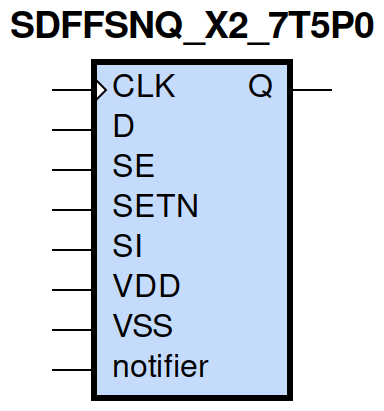
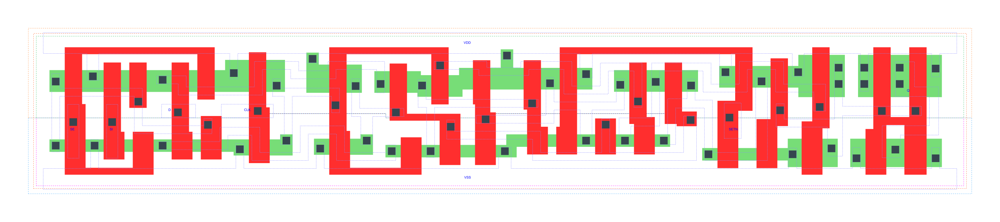

=======================================
gf180mcu_fd_sc_mcu7t5v0__sdffsnq_x2
=======================================

**gf180mcu_fd_sc_mcu7t5v0__sdffsnq_x2 symbol**

**gf180mcu_fd_sc_mcu7t5v0__sdffsnq_x2 schematic**

.. image:: sc7_sch/SDFFSNQ_X2_sch.png
    :height: 300px
    :width: 500 px
    :align: center
    :alt: gf180mcu_fd_sc_mcu7t5v0__sdffsnq_x2 schematic

**gf180mcu_fd_sc_mcu7t5v0__sdffsnq_x2 layout**

.. include:: images.rst

SDFFSNQ_X2 is a positive edge triggered scan D-type flip flop, active low set, 2X drive strength

|
| Attributes

============= =======================
**Attribute** **Value**
area          103.174400 µm\ :sup:`2`
============= =======================

|

TRUTH TABLE

===== == == = === ======
Input             Output
SETN  SE SI D CLK Q
H     L  X  L ↑   L
H     L  X  H ↑   H
H     H  L  X ↑   L
H     H  H  X ↑   H
L     X  X  X X   H
===== == == = === ======

|
| FUNCTIONAL SCHEMATIC
| |image647|
| CONSTRAINTS

================== =============== ============= ============
**Constraint Pin** **Related Pin** **setup(ns)** **hold(ns)**
SE(LH)             CLK(LH)         0.5610        -0.2180
SE(LH)             CLK(LH)         0.7670        -0.1260
SE(HL)             CLK(LH)         0.6470        -0.0860
SE(HL)             CLK(LH)         0.6470        -0.3260
SI(HL)             CLK(LH)         0.7270        -0.1200
SI(HL)             CLK(LH)         0.7330        -0.0920
SI(LH)             CLK(LH)         0.6070        -0.2630
SI(LH)             CLK(LH)         0.5900        -0.2580
D(HL)              CLK(LH)         0.6350        -0.0690
D(HL)              CLK(LH)         0.6350        -0.0690
D(LH)              CLK(LH)         0.5380        -0.2120
D(LH)              CLK(LH)         0.5380        -0.2120
================== =============== ============= ============

|

================== =============== ================ ===============
**Constraint Pin** **Related Pin** **recovery(ns)** **removal(ns)**
SETN(LH)           CLK(LH)         -0.0110          0.2180
SETN(LH)           CLK(LH)         -0.0110          0.2180
SETN(LH)           CLK(LH)         -0.0110          0.2180
SETN(LH)           CLK(LH)         -0.0110          0.2180
================== =============== ================ ===============

|

================== =============== ===========================
**Constraint Pin** **Related Pin** **Minimum Pulse Width(ns)**
CLK(HLH)           CLK(HL)         0.7720
CLK(HLH)           CLK(HL)         0.7910
CLK(HLH)           CLK(HL)         0.7720
CLK(HLH)           CLK(HL)         0.6870
CLK(HLH)           CLK(HL)         0.6200
CLK(HLH)           CLK(HL)         0.8520
CLK(HLH)           CLK(HL)         0.6200
CLK(HLH)           CLK(HL)         0.6560
CLK(LHL)           CLK(LH)         0.5050
CLK(LHL)           CLK(LH)         0.5150
CLK(LHL)           CLK(LH)         0.5050
CLK(LHL)           CLK(LH)         0.4460
CLK(LHL)           CLK(LH)         0.4460
CLK(LHL)           CLK(LH)         0.5050
CLK(LHL)           CLK(LH)         0.4460
CLK(LHL)           CLK(LH)         0.4560
SETN(HLH)          SETN(HL)        0.4070
SETN(HLH)          SETN(HL)        0.4070
SETN(HLH)          SETN(HL)        0.4070
SETN(HLH)          SETN(HL)        0.4070
SETN(HLH)          SETN(HL)        0.4170
SETN(HLH)          SETN(HL)        0.4070
SETN(HLH)          SETN(HL)        0.4070
SETN(HLH)          SETN(HL)        0.4070
SETN(HLH)          SETN(HL)        0.4070
SETN(HLH)          SETN(HL)        0.4070
SETN(HLH)          SETN(HL)        0.4070
SETN(HLH)          SETN(HL)        0.4070
SETN(HLH)          SETN(HL)        0.4170
SETN(HLH)          SETN(HL)        0.4070
SETN(HLH)          SETN(HL)        0.4170
SETN(HLH)          SETN(HL)        0.4070
================== =============== ===========================

|
| PIN CAPACITANCE (pf)

======= ======== ====================
**Pin** **Type** **Capacitance (pf)**
SE      input    0.0061
SI      input    0.0027
D       input    0.0027
CLK     input    0.0036
SETN    input    0.0063
======= ======== ====================

|
| DELAY AND OUTPUT TRANSITION TIME corresponding to min slew and load

+---------------+------------+--------------------+--------------+-------------------+----------------+---------------+
| **Input Pin** | **Output** | **When Condition** | **Tin (ns)** | **Out Load (pf)** | **Delay (ns)** | **Tout (ns)** |
+---------------+------------+--------------------+--------------+-------------------+----------------+---------------+
| CLK(LH)       | Q(HL)      | !D&!SE&SETN&!SI    | 0.0100       | 0.0010            | 0.7339         | 0.0388        |
+---------------+------------+--------------------+--------------+-------------------+----------------+---------------+
| CLK(LH)       | Q(HL)      | !D&!SE&SETN&SI     | 0.0100       | 0.0010            | 0.7339         | 0.0388        |
+---------------+------------+--------------------+--------------+-------------------+----------------+---------------+
| CLK(LH)       | Q(HL)      | !D&SE&SETN&!SI     | 0.0100       | 0.0010            | 0.7340         | 0.0388        |
+---------------+------------+--------------------+--------------+-------------------+----------------+---------------+
| CLK(LH)       | Q(HL)      | D&SE&SETN&!SI      | 0.0100       | 0.0010            | 0.7339         | 0.0388        |
+---------------+------------+--------------------+--------------+-------------------+----------------+---------------+
| CLK(LH)       | Q(LH)      | !D&SE&SETN&SI      | 0.0100       | 0.0010            | 0.6345         | 0.0365        |
+---------------+------------+--------------------+--------------+-------------------+----------------+---------------+
| CLK(LH)       | Q(LH)      | D&!SE&SETN&!SI     | 0.0100       | 0.0010            | 0.6348         | 0.0365        |
+---------------+------------+--------------------+--------------+-------------------+----------------+---------------+
| CLK(LH)       | Q(LH)      | D&!SE&SETN&SI      | 0.0100       | 0.0010            | 0.6347         | 0.0365        |
+---------------+------------+--------------------+--------------+-------------------+----------------+---------------+
| CLK(LH)       | Q(LH)      | D&SE&SETN&SI       | 0.0100       | 0.0010            | 0.6345         | 0.0365        |
+---------------+------------+--------------------+--------------+-------------------+----------------+---------------+
| SETN(HL)      | Q(LH)      | !CLK&!D&!SE&!SI    | 0.0100       | 0.0010            | 0.5262         | 0.0364        |
+---------------+------------+--------------------+--------------+-------------------+----------------+---------------+
| SETN(HL)      | Q(LH)      | !CLK&D&SE&!SI      | 0.0100       | 0.0010            | 0.5264         | 0.0365        |
+---------------+------------+--------------------+--------------+-------------------+----------------+---------------+
| SETN(HL)      | Q(LH)      | !CLK&D&!SE&SI      | 0.0100       | 0.0010            | 0.5264         | 0.0367        |
+---------------+------------+--------------------+--------------+-------------------+----------------+---------------+
| SETN(HL)      | Q(LH)      | !CLK&D&SE&SI       | 0.0100       | 0.0010            | 0.5263         | 0.0366        |
+---------------+------------+--------------------+--------------+-------------------+----------------+---------------+
| SETN(HL)      | Q(LH)      | CLK&D&!SE&!SI      | 0.0100       | 0.0010            | 0.5587         | 0.0363        |
+---------------+------------+--------------------+--------------+-------------------+----------------+---------------+
| SETN(HL)      | Q(LH)      | CLK&D&SE&!SI       | 0.0100       | 0.0010            | 0.5587         | 0.0363        |
+---------------+------------+--------------------+--------------+-------------------+----------------+---------------+
| SETN(HL)      | Q(LH)      | CLK&D&!SE&SI       | 0.0100       | 0.0010            | 0.5587         | 0.0363        |
+---------------+------------+--------------------+--------------+-------------------+----------------+---------------+
| SETN(HL)      | Q(LH)      | CLK&D&SE&SI        | 0.0100       | 0.0010            | 0.5587         | 0.0363        |
+---------------+------------+--------------------+--------------+-------------------+----------------+---------------+
| SETN(HL)      | Q(LH)      | !CLK&!D&SE&!SI     | 0.0100       | 0.0010            | 0.5262         | 0.0365        |
+---------------+------------+--------------------+--------------+-------------------+----------------+---------------+
| SETN(HL)      | Q(LH)      | !CLK&!D&!SE&SI     | 0.0100       | 0.0010            | 0.5263         | 0.0365        |
+---------------+------------+--------------------+--------------+-------------------+----------------+---------------+
| SETN(HL)      | Q(LH)      | !CLK&!D&SE&SI      | 0.0100       | 0.0010            | 0.5264         | 0.0367        |
+---------------+------------+--------------------+--------------+-------------------+----------------+---------------+
| SETN(HL)      | Q(LH)      | CLK&!D&!SE&!SI     | 0.0100       | 0.0010            | 0.5587         | 0.0363        |
+---------------+------------+--------------------+--------------+-------------------+----------------+---------------+
| SETN(HL)      | Q(LH)      | CLK&!D&SE&!SI      | 0.0100       | 0.0010            | 0.5587         | 0.0362        |
+---------------+------------+--------------------+--------------+-------------------+----------------+---------------+
| SETN(HL)      | Q(LH)      | CLK&!D&!SE&SI      | 0.0100       | 0.0010            | 0.5587         | 0.0363        |
+---------------+------------+--------------------+--------------+-------------------+----------------+---------------+
| SETN(HL)      | Q(LH)      | CLK&!D&SE&SI       | 0.0100       | 0.0010            | 0.5587         | 0.0363        |
+---------------+------------+--------------------+--------------+-------------------+----------------+---------------+
| SETN(HL)      | Q(LH)      | !CLK&D&!SE&!SI     | 0.0100       | 0.0010            | 0.5264         | 0.0367        |
+---------------+------------+--------------------+--------------+-------------------+----------------+---------------+

|
| DYNAMIC ENERGY

+---------------+--------------------+--------------+------------+-------------------+---------------------+
| **Input Pin** | **When Condition** | **Tin (ns)** | **Output** | **Out Load (pf)** | **Energy (uW/MHz)** |
+---------------+--------------------+--------------+------------+-------------------+---------------------+
| CLK           | !D&!SE&SETN&!SI    | 0.0100       | Q(HL)      | 0.0010            | 0.7954              |
+---------------+--------------------+--------------+------------+-------------------+---------------------+
| CLK           | !D&!SE&SETN&SI     | 0.0100       | Q(HL)      | 0.0010            | 0.7954              |
+---------------+--------------------+--------------+------------+-------------------+---------------------+
| CLK           | !D&SE&SETN&!SI     | 0.0100       | Q(HL)      | 0.0010            | 0.7954              |
+---------------+--------------------+--------------+------------+-------------------+---------------------+
| CLK           | D&SE&SETN&!SI      | 0.0100       | Q(HL)      | 0.0010            | 0.7954              |
+---------------+--------------------+--------------+------------+-------------------+---------------------+
| CLK           | !D&SE&SETN&SI      | 0.0100       | Q(LH)      | 0.0010            | 0.8310              |
+---------------+--------------------+--------------+------------+-------------------+---------------------+
| CLK           | D&!SE&SETN&!SI     | 0.0100       | Q(LH)      | 0.0010            | 0.8316              |
+---------------+--------------------+--------------+------------+-------------------+---------------------+
| CLK           | D&!SE&SETN&SI      | 0.0100       | Q(LH)      | 0.0010            | 0.8312              |
+---------------+--------------------+--------------+------------+-------------------+---------------------+
| CLK           | D&SE&SETN&SI       | 0.0100       | Q(LH)      | 0.0010            | 0.8311              |
+---------------+--------------------+--------------+------------+-------------------+---------------------+
| SETN          | !CLK&!D&!SE&!SI    | 0.0100       | Q(LH)      | 0.0010            | 0.7155              |
+---------------+--------------------+--------------+------------+-------------------+---------------------+
| SETN          | !CLK&D&SE&!SI      | 0.0100       | Q(LH)      | 0.0010            | 0.7155              |
+---------------+--------------------+--------------+------------+-------------------+---------------------+
| SETN          | !CLK&D&!SE&SI      | 0.0100       | Q(LH)      | 0.0010            | 0.6120              |
+---------------+--------------------+--------------+------------+-------------------+---------------------+
| SETN          | !CLK&D&SE&SI       | 0.0100       | Q(LH)      | 0.0010            | 0.6118              |
+---------------+--------------------+--------------+------------+-------------------+---------------------+
| SETN          | CLK&D&!SE&!SI      | 0.0100       | Q(LH)      | 0.0010            | 0.8114              |
+---------------+--------------------+--------------+------------+-------------------+---------------------+
| SETN          | CLK&D&SE&!SI       | 0.0100       | Q(LH)      | 0.0010            | 0.8114              |
+---------------+--------------------+--------------+------------+-------------------+---------------------+
| SETN          | CLK&D&!SE&SI       | 0.0100       | Q(LH)      | 0.0010            | 0.8114              |
+---------------+--------------------+--------------+------------+-------------------+---------------------+
| SETN          | CLK&D&SE&SI        | 0.0100       | Q(LH)      | 0.0010            | 0.8114              |
+---------------+--------------------+--------------+------------+-------------------+---------------------+
| SETN          | !CLK&!D&SE&!SI     | 0.0100       | Q(LH)      | 0.0010            | 0.7153              |
+---------------+--------------------+--------------+------------+-------------------+---------------------+
| SETN          | !CLK&!D&!SE&SI     | 0.0100       | Q(LH)      | 0.0010            | 0.7156              |
+---------------+--------------------+--------------+------------+-------------------+---------------------+
| SETN          | !CLK&!D&SE&SI      | 0.0100       | Q(LH)      | 0.0010            | 0.6120              |
+---------------+--------------------+--------------+------------+-------------------+---------------------+
| SETN          | CLK&!D&!SE&!SI     | 0.0100       | Q(LH)      | 0.0010            | 0.8114              |
+---------------+--------------------+--------------+------------+-------------------+---------------------+
| SETN          | CLK&!D&SE&!SI      | 0.0100       | Q(LH)      | 0.0010            | 0.8114              |
+---------------+--------------------+--------------+------------+-------------------+---------------------+
| SETN          | CLK&!D&!SE&SI      | 0.0100       | Q(LH)      | 0.0010            | 0.8114              |
+---------------+--------------------+--------------+------------+-------------------+---------------------+
| SETN          | CLK&!D&SE&SI       | 0.0100       | Q(LH)      | 0.0010            | 0.8114              |
+---------------+--------------------+--------------+------------+-------------------+---------------------+
| SETN          | !CLK&D&!SE&!SI     | 0.0100       | Q(LH)      | 0.0010            | 0.6120              |
+---------------+--------------------+--------------+------------+-------------------+---------------------+
| SETN(HL)      | !CLK&!D&!SE&!SI    | 0.0100       | n/a        | n/a               | 0.1460              |
+---------------+--------------------+--------------+------------+-------------------+---------------------+
| SETN(HL)      | !CLK&D&SE&!SI      | 0.0100       | n/a        | n/a               | 0.1460              |
+---------------+--------------------+--------------+------------+-------------------+---------------------+
| SETN(HL)      | !CLK&D&!SE&SI      | 0.0100       | n/a        | n/a               | 0.0441              |
+---------------+--------------------+--------------+------------+-------------------+---------------------+
| SETN(HL)      | !CLK&D&SE&SI       | 0.0100       | n/a        | n/a               | 0.0441              |
+---------------+--------------------+--------------+------------+-------------------+---------------------+
| SETN(HL)      | CLK&D&!SE&!SI      | 0.0100       | n/a        | n/a               | 0.0441              |
+---------------+--------------------+--------------+------------+-------------------+---------------------+
| SETN(HL)      | CLK&D&SE&!SI       | 0.0100       | n/a        | n/a               | 0.0441              |
+---------------+--------------------+--------------+------------+-------------------+---------------------+
| SETN(HL)      | CLK&D&!SE&SI       | 0.0100       | n/a        | n/a               | 0.0441              |
+---------------+--------------------+--------------+------------+-------------------+---------------------+
| SETN(HL)      | CLK&D&SE&SI        | 0.0100       | n/a        | n/a               | 0.0441              |
+---------------+--------------------+--------------+------------+-------------------+---------------------+
| SETN(HL)      | !CLK&!D&SE&!SI     | 0.0100       | n/a        | n/a               | 0.1460              |
+---------------+--------------------+--------------+------------+-------------------+---------------------+
| SETN(HL)      | !CLK&!D&!SE&SI     | 0.0100       | n/a        | n/a               | 0.1460              |
+---------------+--------------------+--------------+------------+-------------------+---------------------+
| SETN(HL)      | !CLK&!D&SE&SI      | 0.0100       | n/a        | n/a               | 0.0441              |
+---------------+--------------------+--------------+------------+-------------------+---------------------+
| SETN(HL)      | CLK&!D&!SE&!SI     | 0.0100       | n/a        | n/a               | 0.0441              |
+---------------+--------------------+--------------+------------+-------------------+---------------------+
| SETN(HL)      | CLK&!D&SE&!SI      | 0.0100       | n/a        | n/a               | 0.0441              |
+---------------+--------------------+--------------+------------+-------------------+---------------------+
| SETN(HL)      | CLK&!D&!SE&SI      | 0.0100       | n/a        | n/a               | 0.0441              |
+---------------+--------------------+--------------+------------+-------------------+---------------------+
| SETN(HL)      | CLK&!D&SE&SI       | 0.0100       | n/a        | n/a               | 0.0441              |
+---------------+--------------------+--------------+------------+-------------------+---------------------+
| SETN(HL)      | !CLK&D&!SE&!SI     | 0.0100       | n/a        | n/a               | 0.0441              |
+---------------+--------------------+--------------+------------+-------------------+---------------------+
| D(HL)         | !CLK&!SE&!SETN&!SI | 0.0100       | n/a        | n/a               | 0.2172              |
+---------------+--------------------+--------------+------------+-------------------+---------------------+
| D(HL)         | !CLK&!SE&!SETN&SI  | 0.0100       | n/a        | n/a               | 0.2172              |
+---------------+--------------------+--------------+------------+-------------------+---------------------+
| D(HL)         | !CLK&SE&!SETN&!SI  | 0.0100       | n/a        | n/a               | 0.0203              |
+---------------+--------------------+--------------+------------+-------------------+---------------------+
| D(HL)         | !CLK&SE&!SETN&SI   | 0.0100       | n/a        | n/a               | 0.0100              |
+---------------+--------------------+--------------+------------+-------------------+---------------------+
| D(HL)         | CLK&!SE&!SETN&!SI  | 0.0100       | n/a        | n/a               | 0.0224              |
+---------------+--------------------+--------------+------------+-------------------+---------------------+
| D(HL)         | CLK&!SE&!SETN&SI   | 0.0100       | n/a        | n/a               | 0.0224              |
+---------------+--------------------+--------------+------------+-------------------+---------------------+
| D(HL)         | CLK&SE&!SETN&!SI   | 0.0100       | n/a        | n/a               | 0.0202              |
+---------------+--------------------+--------------+------------+-------------------+---------------------+
| D(HL)         | CLK&SE&!SETN&SI    | 0.0100       | n/a        | n/a               | 0.0095              |
+---------------+--------------------+--------------+------------+-------------------+---------------------+
| D(HL)         | CLK&!SE&SETN&!SI   | 0.0100       | n/a        | n/a               | 0.0564              |
+---------------+--------------------+--------------+------------+-------------------+---------------------+
| D(HL)         | CLK&SE&SETN&!SI    | 0.0100       | n/a        | n/a               | 0.0202              |
+---------------+--------------------+--------------+------------+-------------------+---------------------+
| D(HL)         | CLK&!SE&SETN&SI    | 0.0100       | n/a        | n/a               | 0.0564              |
+---------------+--------------------+--------------+------------+-------------------+---------------------+
| D(HL)         | CLK&SE&SETN&SI     | 0.0100       | n/a        | n/a               | 0.0092              |
+---------------+--------------------+--------------+------------+-------------------+---------------------+
| D(HL)         | !CLK&!SE&SETN&!SI  | 0.0100       | n/a        | n/a               | 0.3171              |
+---------------+--------------------+--------------+------------+-------------------+---------------------+
| D(HL)         | !CLK&SE&SETN&!SI   | 0.0100       | n/a        | n/a               | 0.0203              |
+---------------+--------------------+--------------+------------+-------------------+---------------------+
| D(HL)         | !CLK&!SE&SETN&SI   | 0.0100       | n/a        | n/a               | 0.3171              |
+---------------+--------------------+--------------+------------+-------------------+---------------------+
| D(HL)         | !CLK&SE&SETN&SI    | 0.0100       | n/a        | n/a               | 0.0100              |
+---------------+--------------------+--------------+------------+-------------------+---------------------+
| SE(LH)        | !CLK&!D&!SETN&!SI  | 0.0100       | n/a        | n/a               | 0.0024              |
+---------------+--------------------+--------------+------------+-------------------+---------------------+
| SE(LH)        | !CLK&!D&!SETN&SI   | 0.0100       | n/a        | n/a               | 0.0880              |
+---------------+--------------------+--------------+------------+-------------------+---------------------+
| SE(LH)        | !CLK&D&!SETN&!SI   | 0.0100       | n/a        | n/a               | 0.2263              |
+---------------+--------------------+--------------+------------+-------------------+---------------------+
| SE(LH)        | !CLK&D&!SETN&SI    | 0.0100       | n/a        | n/a               | -0.0060             |
+---------------+--------------------+--------------+------------+-------------------+---------------------+
| SE(LH)        | CLK&!D&!SETN&!SI   | 0.0100       | n/a        | n/a               | 0.0012              |
+---------------+--------------------+--------------+------------+-------------------+---------------------+
| SE(LH)        | CLK&!D&!SETN&SI    | 0.0100       | n/a        | n/a               | -0.0048             |
+---------------+--------------------+--------------+------------+-------------------+---------------------+
| SE(LH)        | CLK&D&!SETN&!SI    | 0.0100       | n/a        | n/a               | 0.0040              |
+---------------+--------------------+--------------+------------+-------------------+---------------------+
| SE(LH)        | CLK&D&!SETN&SI     | 0.0100       | n/a        | n/a               | -0.0080             |
+---------------+--------------------+--------------+------------+-------------------+---------------------+
| SE(LH)        | !CLK&D&SETN&!SI    | 0.0100       | n/a        | n/a               | 0.3368              |
+---------------+--------------------+--------------+------------+-------------------+---------------------+
| SE(LH)        | !CLK&D&SETN&SI     | 0.0100       | n/a        | n/a               | -0.0060             |
+---------------+--------------------+--------------+------------+-------------------+---------------------+
| SE(LH)        | CLK&D&SETN&!SI     | 0.0100       | n/a        | n/a               | 0.0397              |
+---------------+--------------------+--------------+------------+-------------------+---------------------+
| SE(LH)        | CLK&D&SETN&SI      | 0.0100       | n/a        | n/a               | -0.0077             |
+---------------+--------------------+--------------+------------+-------------------+---------------------+
| SE(LH)        | !CLK&!D&SETN&!SI   | 0.0100       | n/a        | n/a               | 0.0025              |
+---------------+--------------------+--------------+------------+-------------------+---------------------+
| SE(LH)        | !CLK&!D&SETN&SI    | 0.0100       | n/a        | n/a               | 0.2305              |
+---------------+--------------------+--------------+------------+-------------------+---------------------+
| SE(LH)        | CLK&!D&SETN&!SI    | 0.0100       | n/a        | n/a               | 0.0012              |
+---------------+--------------------+--------------+------------+-------------------+---------------------+
| SE(LH)        | CLK&!D&SETN&SI     | 0.0100       | n/a        | n/a               | -0.0048             |
+---------------+--------------------+--------------+------------+-------------------+---------------------+
| CLK(LH)       | !D&!SE&!SETN&!SI   | 0.0100       | n/a        | n/a               | 0.3100              |
+---------------+--------------------+--------------+------------+-------------------+---------------------+
| CLK(LH)       | !D&!SE&!SETN&SI    | 0.0100       | n/a        | n/a               | 0.3101              |
+---------------+--------------------+--------------+------------+-------------------+---------------------+
| CLK(LH)       | !D&SE&!SETN&!SI    | 0.0100       | n/a        | n/a               | 0.3104              |
+---------------+--------------------+--------------+------------+-------------------+---------------------+
| CLK(LH)       | !D&SE&!SETN&SI     | 0.0100       | n/a        | n/a               | 0.2470              |
+---------------+--------------------+--------------+------------+-------------------+---------------------+
| CLK(LH)       | D&!SE&!SETN&!SI    | 0.0100       | n/a        | n/a               | 0.2471              |
+---------------+--------------------+--------------+------------+-------------------+---------------------+
| CLK(LH)       | D&!SE&!SETN&SI     | 0.0100       | n/a        | n/a               | 0.2470              |
+---------------+--------------------+--------------+------------+-------------------+---------------------+
| CLK(LH)       | D&SE&!SETN&!SI     | 0.0100       | n/a        | n/a               | 0.3101              |
+---------------+--------------------+--------------+------------+-------------------+---------------------+
| CLK(LH)       | D&SE&!SETN&SI      | 0.0100       | n/a        | n/a               | 0.2471              |
+---------------+--------------------+--------------+------------+-------------------+---------------------+
| CLK(LH)       | D&!SE&SETN&!SI     | 0.0100       | n/a        | n/a               | 0.2469              |
+---------------+--------------------+--------------+------------+-------------------+---------------------+
| CLK(LH)       | D&SE&SETN&!SI      | 0.0100       | n/a        | n/a               | 0.2319              |
+---------------+--------------------+--------------+------------+-------------------+---------------------+
| CLK(LH)       | D&!SE&SETN&SI      | 0.0100       | n/a        | n/a               | 0.2469              |
+---------------+--------------------+--------------+------------+-------------------+---------------------+
| CLK(LH)       | D&SE&SETN&SI       | 0.0100       | n/a        | n/a               | 0.2470              |
+---------------+--------------------+--------------+------------+-------------------+---------------------+
| CLK(LH)       | !D&!SE&SETN&!SI    | 0.0100       | n/a        | n/a               | 0.2317              |
+---------------+--------------------+--------------+------------+-------------------+---------------------+
| CLK(LH)       | !D&SE&SETN&!SI     | 0.0100       | n/a        | n/a               | 0.2317              |
+---------------+--------------------+--------------+------------+-------------------+---------------------+
| CLK(LH)       | !D&!SE&SETN&SI     | 0.0100       | n/a        | n/a               | 0.2317              |
+---------------+--------------------+--------------+------------+-------------------+---------------------+
| CLK(LH)       | !D&SE&SETN&SI      | 0.0100       | n/a        | n/a               | 0.2470              |
+---------------+--------------------+--------------+------------+-------------------+---------------------+
| SI(LH)        | !CLK&!D&!SE&!SETN  | 0.0100       | n/a        | n/a               | -0.0198             |
+---------------+--------------------+--------------+------------+-------------------+---------------------+
| SI(LH)        | !CLK&!D&SE&!SETN   | 0.0100       | n/a        | n/a               | 0.0860              |
+---------------+--------------------+--------------+------------+-------------------+---------------------+
| SI(LH)        | !CLK&D&!SE&!SETN   | 0.0100       | n/a        | n/a               | -0.0183             |
+---------------+--------------------+--------------+------------+-------------------+---------------------+
| SI(LH)        | !CLK&D&SE&!SETN    | 0.0100       | n/a        | n/a               | 0.0756              |
+---------------+--------------------+--------------+------------+-------------------+---------------------+
| SI(LH)        | CLK&!D&!SE&!SETN   | 0.0100       | n/a        | n/a               | -0.0198             |
+---------------+--------------------+--------------+------------+-------------------+---------------------+
| SI(LH)        | CLK&!D&SE&!SETN    | 0.0100       | n/a        | n/a               | -0.0158             |
+---------------+--------------------+--------------+------------+-------------------+---------------------+
| SI(LH)        | CLK&D&!SE&!SETN    | 0.0100       | n/a        | n/a               | -0.0188             |
+---------------+--------------------+--------------+------------+-------------------+---------------------+
| SI(LH)        | CLK&D&SE&!SETN     | 0.0100       | n/a        | n/a               | -0.0158             |
+---------------+--------------------+--------------+------------+-------------------+---------------------+
| SI(LH)        | !CLK&D&!SE&SETN    | 0.0100       | n/a        | n/a               | -0.0183             |
+---------------+--------------------+--------------+------------+-------------------+---------------------+
| SI(LH)        | !CLK&D&SE&SETN     | 0.0100       | n/a        | n/a               | 0.2170              |
+---------------+--------------------+--------------+------------+-------------------+---------------------+
| SI(LH)        | CLK&D&!SE&SETN     | 0.0100       | n/a        | n/a               | -0.0184             |
+---------------+--------------------+--------------+------------+-------------------+---------------------+
| SI(LH)        | CLK&D&SE&SETN      | 0.0100       | n/a        | n/a               | -0.0158             |
+---------------+--------------------+--------------+------------+-------------------+---------------------+
| SI(LH)        | !CLK&!D&!SE&SETN   | 0.0100       | n/a        | n/a               | -0.0198             |
+---------------+--------------------+--------------+------------+-------------------+---------------------+
| SI(LH)        | !CLK&!D&SE&SETN    | 0.0100       | n/a        | n/a               | 0.2295              |
+---------------+--------------------+--------------+------------+-------------------+---------------------+
| SI(LH)        | CLK&!D&!SE&SETN    | 0.0100       | n/a        | n/a               | -0.0198             |
+---------------+--------------------+--------------+------------+-------------------+---------------------+
| SI(LH)        | CLK&!D&SE&SETN     | 0.0100       | n/a        | n/a               | -0.0158             |
+---------------+--------------------+--------------+------------+-------------------+---------------------+
| SE(HL)        | !CLK&!D&!SETN&!SI  | 0.0100       | n/a        | n/a               | 0.1306              |
+---------------+--------------------+--------------+------------+-------------------+---------------------+
| SE(HL)        | !CLK&!D&!SETN&SI   | 0.0100       | n/a        | n/a               | 0.3425              |
+---------------+--------------------+--------------+------------+-------------------+---------------------+
| SE(HL)        | !CLK&D&!SETN&!SI   | 0.0100       | n/a        | n/a               | 0.2202              |
+---------------+--------------------+--------------+------------+-------------------+---------------------+
| SE(HL)        | !CLK&D&!SETN&SI    | 0.0100       | n/a        | n/a               | 0.1328              |
+---------------+--------------------+--------------+------------+-------------------+---------------------+
| SE(HL)        | CLK&!D&!SETN&!SI   | 0.0100       | n/a        | n/a               | 0.1305              |
+---------------+--------------------+--------------+------------+-------------------+---------------------+
| SE(HL)        | CLK&!D&!SETN&SI    | 0.0100       | n/a        | n/a               | 0.1322              |
+---------------+--------------------+--------------+------------+-------------------+---------------------+
| SE(HL)        | CLK&D&!SETN&!SI    | 0.0100       | n/a        | n/a               | 0.1343              |
+---------------+--------------------+--------------+------------+-------------------+---------------------+
| SE(HL)        | CLK&D&!SETN&SI     | 0.0100       | n/a        | n/a               | 0.1389              |
+---------------+--------------------+--------------+------------+-------------------+---------------------+
| SE(HL)        | !CLK&D&SETN&!SI    | 0.0100       | n/a        | n/a               | 0.3580              |
+---------------+--------------------+--------------+------------+-------------------+---------------------+
| SE(HL)        | !CLK&D&SETN&SI     | 0.0100       | n/a        | n/a               | 0.1327              |
+---------------+--------------------+--------------+------------+-------------------+---------------------+
| SE(HL)        | CLK&D&SETN&!SI     | 0.0100       | n/a        | n/a               | 0.1358              |
+---------------+--------------------+--------------+------------+-------------------+---------------------+
| SE(HL)        | CLK&D&SETN&SI      | 0.0100       | n/a        | n/a               | 0.1326              |
+---------------+--------------------+--------------+------------+-------------------+---------------------+
| SE(HL)        | !CLK&!D&SETN&!SI   | 0.0100       | n/a        | n/a               | 0.1306              |
+---------------+--------------------+--------------+------------+-------------------+---------------------+
| SE(HL)        | !CLK&!D&SETN&SI    | 0.0100       | n/a        | n/a               | 0.4422              |
+---------------+--------------------+--------------+------------+-------------------+---------------------+
| SE(HL)        | CLK&!D&SETN&!SI    | 0.0100       | n/a        | n/a               | 0.1305              |
+---------------+--------------------+--------------+------------+-------------------+---------------------+
| SE(HL)        | CLK&!D&SETN&SI     | 0.0100       | n/a        | n/a               | 0.1819              |
+---------------+--------------------+--------------+------------+-------------------+---------------------+
| CLK(HL)       | !D&!SE&!SETN&!SI   | 0.0100       | n/a        | n/a               | 0.4630              |
+---------------+--------------------+--------------+------------+-------------------+---------------------+
| CLK(HL)       | !D&!SE&!SETN&SI    | 0.0100       | n/a        | n/a               | 0.4630              |
+---------------+--------------------+--------------+------------+-------------------+---------------------+
| CLK(HL)       | !D&SE&!SETN&!SI    | 0.0100       | n/a        | n/a               | 0.4807              |
+---------------+--------------------+--------------+------------+-------------------+---------------------+
| CLK(HL)       | !D&SE&!SETN&SI     | 0.0100       | n/a        | n/a               | 0.3463              |
+---------------+--------------------+--------------+------------+-------------------+---------------------+
| CLK(HL)       | D&!SE&!SETN&!SI    | 0.0100       | n/a        | n/a               | 0.3268              |
+---------------+--------------------+--------------+------------+-------------------+---------------------+
| CLK(HL)       | D&!SE&!SETN&SI     | 0.0100       | n/a        | n/a               | 0.3268              |
+---------------+--------------------+--------------+------------+-------------------+---------------------+
| CLK(HL)       | D&SE&!SETN&!SI     | 0.0100       | n/a        | n/a               | 0.4982              |
+---------------+--------------------+--------------+------------+-------------------+---------------------+
| CLK(HL)       | D&SE&!SETN&SI      | 0.0100       | n/a        | n/a               | 0.3358              |
+---------------+--------------------+--------------+------------+-------------------+---------------------+
| CLK(HL)       | D&!SE&SETN&!SI     | 0.0100       | n/a        | n/a               | 0.3060              |
+---------------+--------------------+--------------+------------+-------------------+---------------------+
| CLK(HL)       | D&SE&SETN&!SI      | 0.0100       | n/a        | n/a               | 0.3074              |
+---------------+--------------------+--------------+------------+-------------------+---------------------+
| CLK(HL)       | D&!SE&SETN&SI      | 0.0100       | n/a        | n/a               | 0.3060              |
+---------------+--------------------+--------------+------------+-------------------+---------------------+
| CLK(HL)       | D&SE&SETN&SI       | 0.0100       | n/a        | n/a               | 0.3059              |
+---------------+--------------------+--------------+------------+-------------------+---------------------+
| CLK(HL)       | !D&!SE&SETN&!SI    | 0.0100       | n/a        | n/a               | 0.3074              |
+---------------+--------------------+--------------+------------+-------------------+---------------------+
| CLK(HL)       | !D&SE&SETN&!SI     | 0.0100       | n/a        | n/a               | 0.3073              |
+---------------+--------------------+--------------+------------+-------------------+---------------------+
| CLK(HL)       | !D&!SE&SETN&SI     | 0.0100       | n/a        | n/a               | 0.3074              |
+---------------+--------------------+--------------+------------+-------------------+---------------------+
| CLK(HL)       | !D&SE&SETN&SI      | 0.0100       | n/a        | n/a               | 0.3059              |
+---------------+--------------------+--------------+------------+-------------------+---------------------+
| SI(HL)        | !CLK&!D&!SE&!SETN  | 0.0100       | n/a        | n/a               | 0.0203              |
+---------------+--------------------+--------------+------------+-------------------+---------------------+
| SI(HL)        | !CLK&!D&SE&!SETN   | 0.0100       | n/a        | n/a               | 0.2630              |
+---------------+--------------------+--------------+------------+-------------------+---------------------+
| SI(HL)        | !CLK&D&!SE&!SETN   | 0.0100       | n/a        | n/a               | 0.0202              |
+---------------+--------------------+--------------+------------+-------------------+---------------------+
| SI(HL)        | !CLK&D&SE&!SETN    | 0.0100       | n/a        | n/a               | 0.2665              |
+---------------+--------------------+--------------+------------+-------------------+---------------------+
| SI(HL)        | CLK&!D&!SE&!SETN   | 0.0100       | n/a        | n/a               | 0.0202              |
+---------------+--------------------+--------------+------------+-------------------+---------------------+
| SI(HL)        | CLK&!D&SE&!SETN    | 0.0100       | n/a        | n/a               | 0.0219              |
+---------------+--------------------+--------------+------------+-------------------+---------------------+
| SI(HL)        | CLK&D&!SE&!SETN    | 0.0100       | n/a        | n/a               | 0.0202              |
+---------------+--------------------+--------------+------------+-------------------+---------------------+
| SI(HL)        | CLK&D&SE&!SETN     | 0.0100       | n/a        | n/a               | 0.0221              |
+---------------+--------------------+--------------+------------+-------------------+---------------------+
| SI(HL)        | !CLK&D&!SE&SETN    | 0.0100       | n/a        | n/a               | 0.0202              |
+---------------+--------------------+--------------+------------+-------------------+---------------------+
| SI(HL)        | !CLK&D&SE&SETN     | 0.0100       | n/a        | n/a               | 0.3770              |
+---------------+--------------------+--------------+------------+-------------------+---------------------+
| SI(HL)        | CLK&D&!SE&SETN     | 0.0100       | n/a        | n/a               | 0.0202              |
+---------------+--------------------+--------------+------------+-------------------+---------------------+
| SI(HL)        | CLK&D&SE&SETN      | 0.0100       | n/a        | n/a               | 0.0727              |
+---------------+--------------------+--------------+------------+-------------------+---------------------+
| SI(HL)        | !CLK&!D&!SE&SETN   | 0.0100       | n/a        | n/a               | 0.0203              |
+---------------+--------------------+--------------+------------+-------------------+---------------------+
| SI(HL)        | !CLK&!D&SE&SETN    | 0.0100       | n/a        | n/a               | 0.3699              |
+---------------+--------------------+--------------+------------+-------------------+---------------------+
| SI(HL)        | CLK&!D&!SE&SETN    | 0.0100       | n/a        | n/a               | 0.0202              |
+---------------+--------------------+--------------+------------+-------------------+---------------------+
| SI(HL)        | CLK&!D&SE&SETN     | 0.0100       | n/a        | n/a               | 0.0873              |
+---------------+--------------------+--------------+------------+-------------------+---------------------+
| D(LH)         | !CLK&!SE&!SETN&!SI | 0.0100       | n/a        | n/a               | 0.0688              |
+---------------+--------------------+--------------+------------+-------------------+---------------------+
| D(LH)         | !CLK&!SE&!SETN&SI  | 0.0100       | n/a        | n/a               | 0.0688              |
+---------------+--------------------+--------------+------------+-------------------+---------------------+
| D(LH)         | !CLK&SE&!SETN&!SI  | 0.0100       | n/a        | n/a               | -0.0186             |
+---------------+--------------------+--------------+------------+-------------------+---------------------+
| D(LH)         | !CLK&SE&!SETN&SI   | 0.0100       | n/a        | n/a               | -0.0064             |
+---------------+--------------------+--------------+------------+-------------------+---------------------+
| D(LH)         | CLK&!SE&!SETN&!SI  | 0.0100       | n/a        | n/a               | -0.0149             |
+---------------+--------------------+--------------+------------+-------------------+---------------------+
| D(LH)         | CLK&!SE&!SETN&SI   | 0.0100       | n/a        | n/a               | -0.0149             |
+---------------+--------------------+--------------+------------+-------------------+---------------------+
| D(LH)         | CLK&SE&!SETN&!SI   | 0.0100       | n/a        | n/a               | -0.0197             |
+---------------+--------------------+--------------+------------+-------------------+---------------------+
| D(LH)         | CLK&SE&!SETN&SI    | 0.0100       | n/a        | n/a               | -0.0125             |
+---------------+--------------------+--------------+------------+-------------------+---------------------+
| D(LH)         | CLK&!SE&SETN&!SI   | 0.0100       | n/a        | n/a               | -0.0155             |
+---------------+--------------------+--------------+------------+-------------------+---------------------+
| D(LH)         | CLK&SE&SETN&!SI    | 0.0100       | n/a        | n/a               | -0.0197             |
+---------------+--------------------+--------------+------------+-------------------+---------------------+
| D(LH)         | CLK&!SE&SETN&SI    | 0.0100       | n/a        | n/a               | -0.0155             |
+---------------+--------------------+--------------+------------+-------------------+---------------------+
| D(LH)         | CLK&SE&SETN&SI     | 0.0100       | n/a        | n/a               | -0.0066             |
+---------------+--------------------+--------------+------------+-------------------+---------------------+
| D(LH)         | !CLK&!SE&SETN&!SI  | 0.0100       | n/a        | n/a               | 0.2066              |
+---------------+--------------------+--------------+------------+-------------------+---------------------+
| D(LH)         | !CLK&SE&SETN&!SI   | 0.0100       | n/a        | n/a               | -0.0186             |
+---------------+--------------------+--------------+------------+-------------------+---------------------+
| D(LH)         | !CLK&!SE&SETN&SI   | 0.0100       | n/a        | n/a               | 0.2066              |
+---------------+--------------------+--------------+------------+-------------------+---------------------+
| D(LH)         | !CLK&SE&SETN&SI    | 0.0100       | n/a        | n/a               | -0.0064             |
+---------------+--------------------+--------------+------------+-------------------+---------------------+
| SETN(LH)      | !CLK&!D&!SE&!SI    | 0.0100       | n/a        | n/a               | 0.0287              |
+---------------+--------------------+--------------+------------+-------------------+---------------------+
| SETN(LH)      | !CLK&!D&!SE&SI     | 0.0100       | n/a        | n/a               | 0.0287              |
+---------------+--------------------+--------------+------------+-------------------+---------------------+
| SETN(LH)      | !CLK&!D&SE&!SI     | 0.0100       | n/a        | n/a               | 0.0287              |
+---------------+--------------------+--------------+------------+-------------------+---------------------+
| SETN(LH)      | !CLK&!D&SE&SI      | 0.0100       | n/a        | n/a               | -0.0274             |
+---------------+--------------------+--------------+------------+-------------------+---------------------+
| SETN(LH)      | !CLK&D&!SE&!SI     | 0.0100       | n/a        | n/a               | -0.0274             |
+---------------+--------------------+--------------+------------+-------------------+---------------------+
| SETN(LH)      | !CLK&D&!SE&SI      | 0.0100       | n/a        | n/a               | -0.0274             |
+---------------+--------------------+--------------+------------+-------------------+---------------------+
| SETN(LH)      | !CLK&D&SE&!SI      | 0.0100       | n/a        | n/a               | 0.0287              |
+---------------+--------------------+--------------+------------+-------------------+---------------------+
| SETN(LH)      | !CLK&D&SE&SI       | 0.0100       | n/a        | n/a               | -0.0274             |
+---------------+--------------------+--------------+------------+-------------------+---------------------+
| SETN(LH)      | CLK&!D&!SE&!SI     | 0.0100       | n/a        | n/a               | -0.0274             |
+---------------+--------------------+--------------+------------+-------------------+---------------------+
| SETN(LH)      | CLK&!D&!SE&SI      | 0.0100       | n/a        | n/a               | -0.0274             |
+---------------+--------------------+--------------+------------+-------------------+---------------------+
| SETN(LH)      | CLK&!D&SE&!SI      | 0.0100       | n/a        | n/a               | -0.0274             |
+---------------+--------------------+--------------+------------+-------------------+---------------------+
| SETN(LH)      | CLK&!D&SE&SI       | 0.0100       | n/a        | n/a               | -0.0274             |
+---------------+--------------------+--------------+------------+-------------------+---------------------+
| SETN(LH)      | CLK&D&!SE&!SI      | 0.0100       | n/a        | n/a               | -0.0274             |
+---------------+--------------------+--------------+------------+-------------------+---------------------+
| SETN(LH)      | CLK&D&!SE&SI       | 0.0100       | n/a        | n/a               | -0.0274             |
+---------------+--------------------+--------------+------------+-------------------+---------------------+
| SETN(LH)      | CLK&D&SE&!SI       | 0.0100       | n/a        | n/a               | -0.0274             |
+---------------+--------------------+--------------+------------+-------------------+---------------------+
| SETN(LH)      | CLK&D&SE&SI        | 0.0100       | n/a        | n/a               | -0.0274             |
+---------------+--------------------+--------------+------------+-------------------+---------------------+

|
| LEAKAGE POWER

===================== ==============
**When Condition**    **Power (nW)**
!CLK&!D&!SE&!SETN&!SI 0.4755
!CLK&!D&!SE&!SETN&SI  0.4775
!CLK&!D&SE&!SETN&!SI  0.5140
!CLK&!D&SE&!SETN&SI   0.5344
!CLK&D&!SE&!SETN&!SI  0.4647
!CLK&D&!SE&!SETN&SI   0.4647
!CLK&D&SE&!SETN&!SI   0.5554
!CLK&D&SE&!SETN&SI    0.4989
CLK&!D&!SE&!SETN&!SI  0.4463
CLK&!D&!SE&!SETN&SI   0.4463
CLK&!D&SE&!SETN&!SI   0.4448
CLK&!D&SE&!SETN&SI    0.4465
CLK&D&!SE&!SETN&!SI   0.4479
CLK&D&!SE&!SETN&SI    0.4479
CLK&D&SE&!SETN&!SI    0.4448
CLK&D&SE&!SETN&SI     0.4465
CLK&!D&!SE&SETN&!SI   0.5406
CLK&!D&!SE&SETN&SI    0.5406
CLK&!D&SE&SETN&!SI    0.5392
CLK&D&SE&SETN&!SI     0.5392
CLK&!D&SE&SETN&SI     0.7176
CLK&D&!SE&SETN&!SI    0.6803
CLK&D&!SE&SETN&SI     0.6803
CLK&D&SE&SETN&SI      0.6994
!CLK&!D&!SE&SETN&!SI  0.6720
!CLK&!D&!SE&SETN&SI   0.6740
!CLK&!D&SE&SETN&!SI   0.7105
!CLK&!D&SE&SETN&SI    0.6974
!CLK&D&!SE&SETN&!SI   0.6277
!CLK&D&!SE&SETN&SI    0.6277
!CLK&D&SE&SETN&!SI    0.7519
!CLK&D&SE&SETN&SI     0.6618
===================== ==============

