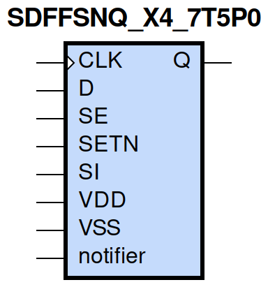
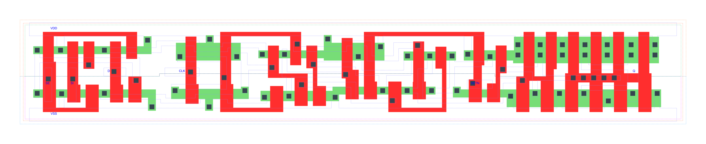

=======================================
gf180mcu_fd_sc_mcu7t5v0__sdffsnq_x4
=======================================

**gf180mcu_fd_sc_mcu7t5v0__sdffsnq_x4 symbol**

**gf180mcu_fd_sc_mcu7t5v0__sdffsnq_x4 schematic**

.. image:: sc7_sch/SDFFSNQ_X4_sch.png
    :height: 300px
    :width: 500 px
    :align: center
    :alt: gf180mcu_fd_sc_mcu7t5v0__sdffsnq_x4 schematic

**gf180mcu_fd_sc_mcu7t5v0__sdffsnq_x4 layout**

.. include:: images.rst

SDFFSNQ_X4 is a positive edge triggered scan D-type flip flop, active low set, 4X drive strength

|
| Attributes

============= =======================
**Attribute** **Value**
area          116.345600 µm\ :sup:`2`
============= =======================

|

TRUTH TABLE

===== == == = === ======
Input             Output
SETN  SE SI D CLK Q
H     L  X  L ↑   L
H     L  X  H ↑   H
H     H  L  X ↑   L
H     H  H  X ↑   H
L     X  X  X X   H
===== == == = === ======

|
| FUNCTIONAL SCHEMATIC
| |image650|
| CONSTRAINTS

================== =============== ============= ============
**Constraint Pin** **Related Pin** **setup(ns)** **hold(ns)**
SE(LH)             CLK(LH)         0.3430        -0.1030
SE(LH)             CLK(LH)         1.3400        -0.4810
SE(HL)             CLK(LH)         1.1790        -0.4350
SE(HL)             CLK(LH)         0.5040        -0.2690
SI(HL)             CLK(LH)         1.3000        -0.4920
SI(HL)             CLK(LH)         1.3450        -0.4870
SI(LH)             CLK(LH)         0.3780        -0.1260
SI(LH)             CLK(LH)         0.3780        -0.1370
D(HL)              CLK(LH)         1.1680        -0.4240
D(HL)              CLK(LH)         1.1680        -0.4240
D(LH)              CLK(LH)         0.3380        -0.1090
D(LH)              CLK(LH)         0.3380        -0.1090
================== =============== ============= ============

|

================== =============== ================ ===============
**Constraint Pin** **Related Pin** **recovery(ns)** **removal(ns)**
SETN(LH)           CLK(LH)         0.0060           0.1140
SETN(LH)           CLK(LH)         0.0060           0.1140
SETN(LH)           CLK(LH)         0.0060           0.1140
SETN(LH)           CLK(LH)         0.0060           0.1140
================== =============== ================ ===============

|

================== =============== ===========================
**Constraint Pin** **Related Pin** **Minimum Pulse Width(ns)**
CLK(HLH)           CLK(HL)         1.1930
CLK(HLH)           CLK(HL)         1.2610
CLK(HLH)           CLK(HL)         1.1930
CLK(HLH)           CLK(HL)         0.4490
CLK(HLH)           CLK(HL)         0.4240
CLK(HLH)           CLK(HL)         1.3700
CLK(HLH)           CLK(HL)         0.4240
CLK(HLH)           CLK(HL)         0.4310
CLK(LHL)           CLK(LH)         0.5050
CLK(LHL)           CLK(LH)         0.5050
CLK(LHL)           CLK(LH)         0.5050
CLK(LHL)           CLK(LH)         0.4950
CLK(LHL)           CLK(LH)         0.4950
CLK(LHL)           CLK(LH)         0.5050
CLK(LHL)           CLK(LH)         0.4950
CLK(LHL)           CLK(LH)         0.4950
SETN(HLH)          SETN(HL)        0.5340
SETN(HLH)          SETN(HL)        0.5340
SETN(HLH)          SETN(HL)        0.5340
SETN(HLH)          SETN(HL)        0.5340
SETN(HLH)          SETN(HL)        0.3390
SETN(HLH)          SETN(HL)        0.3390
SETN(HLH)          SETN(HL)        0.3390
SETN(HLH)          SETN(HL)        0.3390
SETN(HLH)          SETN(HL)        0.5340
SETN(HLH)          SETN(HL)        0.5340
SETN(HLH)          SETN(HL)        0.5340
SETN(HLH)          SETN(HL)        0.3390
SETN(HLH)          SETN(HL)        0.3390
SETN(HLH)          SETN(HL)        0.3390
SETN(HLH)          SETN(HL)        0.3390
SETN(HLH)          SETN(HL)        0.5340
================== =============== ===========================

|
| PIN CAPACITANCE (pf)

======= ======== ====================
**Pin** **Type** **Capacitance (pf)**
SE      input    0.0054
SI      input    0.0023
D       input    0.0023
CLK     input    0.0033
SETN    input    0.0062
======= ======== ====================

|
| DELAY AND OUTPUT TRANSITION TIME corresponding to min slew and load

+---------------+------------+--------------------+--------------+-------------------+----------------+---------------+
| **Input Pin** | **Output** | **When Condition** | **Tin (ns)** | **Out Load (pf)** | **Delay (ns)** | **Tout (ns)** |
+---------------+------------+--------------------+--------------+-------------------+----------------+---------------+
| CLK(LH)       | Q(HL)      | !D&!SE&SETN&!SI    | 0.0100       | 0.0010            | 0.7697         | 0.0365        |
+---------------+------------+--------------------+--------------+-------------------+----------------+---------------+
| CLK(LH)       | Q(HL)      | !D&!SE&SETN&SI     | 0.0100       | 0.0010            | 0.7697         | 0.0365        |
+---------------+------------+--------------------+--------------+-------------------+----------------+---------------+
| CLK(LH)       | Q(HL)      | !D&SE&SETN&!SI     | 0.0100       | 0.0010            | 0.7697         | 0.0365        |
+---------------+------------+--------------------+--------------+-------------------+----------------+---------------+
| CLK(LH)       | Q(HL)      | D&SE&SETN&!SI      | 0.0100       | 0.0010            | 0.7697         | 0.0365        |
+---------------+------------+--------------------+--------------+-------------------+----------------+---------------+
| CLK(LH)       | Q(LH)      | !D&SE&SETN&SI      | 0.0100       | 0.0010            | 0.6855         | 0.0348        |
+---------------+------------+--------------------+--------------+-------------------+----------------+---------------+
| CLK(LH)       | Q(LH)      | D&!SE&SETN&!SI     | 0.0100       | 0.0010            | 0.6856         | 0.0348        |
+---------------+------------+--------------------+--------------+-------------------+----------------+---------------+
| CLK(LH)       | Q(LH)      | D&!SE&SETN&SI      | 0.0100       | 0.0010            | 0.6856         | 0.0348        |
+---------------+------------+--------------------+--------------+-------------------+----------------+---------------+
| CLK(LH)       | Q(LH)      | D&SE&SETN&SI       | 0.0100       | 0.0010            | 0.6855         | 0.0348        |
+---------------+------------+--------------------+--------------+-------------------+----------------+---------------+
| SETN(HL)      | Q(LH)      | !CLK&!D&!SE&!SI    | 0.0100       | 0.0010            | 0.6450         | 0.0369        |
+---------------+------------+--------------------+--------------+-------------------+----------------+---------------+
| SETN(HL)      | Q(LH)      | !CLK&D&SE&!SI      | 0.0100       | 0.0010            | 0.6452         | 0.0367        |
+---------------+------------+--------------------+--------------+-------------------+----------------+---------------+
| SETN(HL)      | Q(LH)      | !CLK&D&!SE&SI      | 0.0100       | 0.0010            | 0.6452         | 0.0367        |
+---------------+------------+--------------------+--------------+-------------------+----------------+---------------+
| SETN(HL)      | Q(LH)      | !CLK&D&SE&SI       | 0.0100       | 0.0010            | 0.6452         | 0.0368        |
+---------------+------------+--------------------+--------------+-------------------+----------------+---------------+
| SETN(HL)      | Q(LH)      | CLK&D&!SE&!SI      | 0.0100       | 0.0010            | 0.5308         | 0.0342        |
+---------------+------------+--------------------+--------------+-------------------+----------------+---------------+
| SETN(HL)      | Q(LH)      | CLK&D&SE&!SI       | 0.0100       | 0.0010            | 0.5308         | 0.0342        |
+---------------+------------+--------------------+--------------+-------------------+----------------+---------------+
| SETN(HL)      | Q(LH)      | CLK&D&!SE&SI       | 0.0100       | 0.0010            | 0.5308         | 0.0342        |
+---------------+------------+--------------------+--------------+-------------------+----------------+---------------+
| SETN(HL)      | Q(LH)      | CLK&D&SE&SI        | 0.0100       | 0.0010            | 0.5308         | 0.0342        |
+---------------+------------+--------------------+--------------+-------------------+----------------+---------------+
| SETN(HL)      | Q(LH)      | !CLK&!D&SE&!SI     | 0.0100       | 0.0010            | 0.6452         | 0.0367        |
+---------------+------------+--------------------+--------------+-------------------+----------------+---------------+
| SETN(HL)      | Q(LH)      | !CLK&!D&!SE&SI     | 0.0100       | 0.0010            | 0.6450         | 0.0369        |
+---------------+------------+--------------------+--------------+-------------------+----------------+---------------+
| SETN(HL)      | Q(LH)      | !CLK&!D&SE&SI      | 0.0100       | 0.0010            | 0.6452         | 0.0368        |
+---------------+------------+--------------------+--------------+-------------------+----------------+---------------+
| SETN(HL)      | Q(LH)      | CLK&!D&!SE&!SI     | 0.0100       | 0.0010            | 0.5308         | 0.0342        |
+---------------+------------+--------------------+--------------+-------------------+----------------+---------------+
| SETN(HL)      | Q(LH)      | CLK&!D&SE&!SI      | 0.0100       | 0.0010            | 0.5308         | 0.0342        |
+---------------+------------+--------------------+--------------+-------------------+----------------+---------------+
| SETN(HL)      | Q(LH)      | CLK&!D&!SE&SI      | 0.0100       | 0.0010            | 0.5308         | 0.0342        |
+---------------+------------+--------------------+--------------+-------------------+----------------+---------------+
| SETN(HL)      | Q(LH)      | CLK&!D&SE&SI       | 0.0100       | 0.0010            | 0.5308         | 0.0342        |
+---------------+------------+--------------------+--------------+-------------------+----------------+---------------+
| SETN(HL)      | Q(LH)      | !CLK&D&!SE&!SI     | 0.0100       | 0.0010            | 0.6452         | 0.0367        |
+---------------+------------+--------------------+--------------+-------------------+----------------+---------------+

|
| DYNAMIC ENERGY

+---------------+--------------------+--------------+------------+-------------------+---------------------+
| **Input Pin** | **When Condition** | **Tin (ns)** | **Output** | **Out Load (pf)** | **Energy (uW/MHz)** |
+---------------+--------------------+--------------+------------+-------------------+---------------------+
| CLK           | !D&!SE&SETN&!SI    | 0.0100       | Q(HL)      | 0.0010            | 1.1634              |
+---------------+--------------------+--------------+------------+-------------------+---------------------+
| CLK           | !D&!SE&SETN&SI     | 0.0100       | Q(HL)      | 0.0010            | 1.1634              |
+---------------+--------------------+--------------+------------+-------------------+---------------------+
| CLK           | !D&SE&SETN&!SI     | 0.0100       | Q(HL)      | 0.0010            | 1.1637              |
+---------------+--------------------+--------------+------------+-------------------+---------------------+
| CLK           | D&SE&SETN&!SI      | 0.0100       | Q(HL)      | 0.0010            | 1.1634              |
+---------------+--------------------+--------------+------------+-------------------+---------------------+
| CLK           | !D&SE&SETN&SI      | 0.0100       | Q(LH)      | 0.0010            | 1.1579              |
+---------------+--------------------+--------------+------------+-------------------+---------------------+
| CLK           | D&!SE&SETN&!SI     | 0.0100       | Q(LH)      | 0.0010            | 1.1579              |
+---------------+--------------------+--------------+------------+-------------------+---------------------+
| CLK           | D&!SE&SETN&SI      | 0.0100       | Q(LH)      | 0.0010            | 1.1579              |
+---------------+--------------------+--------------+------------+-------------------+---------------------+
| CLK           | D&SE&SETN&SI       | 0.0100       | Q(LH)      | 0.0010            | 1.1580              |
+---------------+--------------------+--------------+------------+-------------------+---------------------+
| SETN          | !CLK&!D&!SE&!SI    | 0.0100       | Q(LH)      | 0.0010            | 1.1577              |
+---------------+--------------------+--------------+------------+-------------------+---------------------+
| SETN          | !CLK&D&SE&!SI      | 0.0100       | Q(LH)      | 0.0010            | 1.1592              |
+---------------+--------------------+--------------+------------+-------------------+---------------------+
| SETN          | !CLK&D&!SE&SI      | 0.0100       | Q(LH)      | 0.0010            | 1.0557              |
+---------------+--------------------+--------------+------------+-------------------+---------------------+
| SETN          | !CLK&D&SE&SI       | 0.0100       | Q(LH)      | 0.0010            | 1.0558              |
+---------------+--------------------+--------------+------------+-------------------+---------------------+
| SETN          | CLK&D&!SE&!SI      | 0.0100       | Q(LH)      | 0.0010            | 1.1322              |
+---------------+--------------------+--------------+------------+-------------------+---------------------+
| SETN          | CLK&D&SE&!SI       | 0.0100       | Q(LH)      | 0.0010            | 1.1322              |
+---------------+--------------------+--------------+------------+-------------------+---------------------+
| SETN          | CLK&D&!SE&SI       | 0.0100       | Q(LH)      | 0.0010            | 1.1322              |
+---------------+--------------------+--------------+------------+-------------------+---------------------+
| SETN          | CLK&D&SE&SI        | 0.0100       | Q(LH)      | 0.0010            | 1.1322              |
+---------------+--------------------+--------------+------------+-------------------+---------------------+
| SETN          | !CLK&!D&SE&!SI     | 0.0100       | Q(LH)      | 0.0010            | 1.1592              |
+---------------+--------------------+--------------+------------+-------------------+---------------------+
| SETN          | !CLK&!D&!SE&SI     | 0.0100       | Q(LH)      | 0.0010            | 1.1578              |
+---------------+--------------------+--------------+------------+-------------------+---------------------+
| SETN          | !CLK&!D&SE&SI      | 0.0100       | Q(LH)      | 0.0010            | 1.0558              |
+---------------+--------------------+--------------+------------+-------------------+---------------------+
| SETN          | CLK&!D&!SE&!SI     | 0.0100       | Q(LH)      | 0.0010            | 1.1322              |
+---------------+--------------------+--------------+------------+-------------------+---------------------+
| SETN          | CLK&!D&SE&!SI      | 0.0100       | Q(LH)      | 0.0010            | 1.1322              |
+---------------+--------------------+--------------+------------+-------------------+---------------------+
| SETN          | CLK&!D&!SE&SI      | 0.0100       | Q(LH)      | 0.0010            | 1.1322              |
+---------------+--------------------+--------------+------------+-------------------+---------------------+
| SETN          | CLK&!D&SE&SI       | 0.0100       | Q(LH)      | 0.0010            | 1.1322              |
+---------------+--------------------+--------------+------------+-------------------+---------------------+
| SETN          | !CLK&D&!SE&!SI     | 0.0100       | Q(LH)      | 0.0010            | 1.0557              |
+---------------+--------------------+--------------+------------+-------------------+---------------------+
| SETN(HL)      | !CLK&!D&!SE&!SI    | 0.0100       | n/a        | n/a               | 0.1471              |
+---------------+--------------------+--------------+------------+-------------------+---------------------+
| SETN(HL)      | !CLK&D&SE&!SI      | 0.0100       | n/a        | n/a               | 0.1470              |
+---------------+--------------------+--------------+------------+-------------------+---------------------+
| SETN(HL)      | !CLK&D&!SE&SI      | 0.0100       | n/a        | n/a               | 0.0455              |
+---------------+--------------------+--------------+------------+-------------------+---------------------+
| SETN(HL)      | !CLK&D&SE&SI       | 0.0100       | n/a        | n/a               | 0.0455              |
+---------------+--------------------+--------------+------------+-------------------+---------------------+
| SETN(HL)      | CLK&D&!SE&!SI      | 0.0100       | n/a        | n/a               | 0.0455              |
+---------------+--------------------+--------------+------------+-------------------+---------------------+
| SETN(HL)      | CLK&D&SE&!SI       | 0.0100       | n/a        | n/a               | 0.0455              |
+---------------+--------------------+--------------+------------+-------------------+---------------------+
| SETN(HL)      | CLK&D&!SE&SI       | 0.0100       | n/a        | n/a               | 0.0455              |
+---------------+--------------------+--------------+------------+-------------------+---------------------+
| SETN(HL)      | CLK&D&SE&SI        | 0.0100       | n/a        | n/a               | 0.0455              |
+---------------+--------------------+--------------+------------+-------------------+---------------------+
| SETN(HL)      | !CLK&!D&SE&!SI     | 0.0100       | n/a        | n/a               | 0.1471              |
+---------------+--------------------+--------------+------------+-------------------+---------------------+
| SETN(HL)      | !CLK&!D&!SE&SI     | 0.0100       | n/a        | n/a               | 0.1471              |
+---------------+--------------------+--------------+------------+-------------------+---------------------+
| SETN(HL)      | !CLK&!D&SE&SI      | 0.0100       | n/a        | n/a               | 0.0455              |
+---------------+--------------------+--------------+------------+-------------------+---------------------+
| SETN(HL)      | CLK&!D&!SE&!SI     | 0.0100       | n/a        | n/a               | 0.0455              |
+---------------+--------------------+--------------+------------+-------------------+---------------------+
| SETN(HL)      | CLK&!D&SE&!SI      | 0.0100       | n/a        | n/a               | 0.0455              |
+---------------+--------------------+--------------+------------+-------------------+---------------------+
| SETN(HL)      | CLK&!D&!SE&SI      | 0.0100       | n/a        | n/a               | 0.0455              |
+---------------+--------------------+--------------+------------+-------------------+---------------------+
| SETN(HL)      | CLK&!D&SE&SI       | 0.0100       | n/a        | n/a               | 0.0455              |
+---------------+--------------------+--------------+------------+-------------------+---------------------+
| SETN(HL)      | !CLK&D&!SE&!SI     | 0.0100       | n/a        | n/a               | 0.0455              |
+---------------+--------------------+--------------+------------+-------------------+---------------------+
| D(HL)         | !CLK&!SE&!SETN&!SI | 0.0100       | n/a        | n/a               | 0.2113              |
+---------------+--------------------+--------------+------------+-------------------+---------------------+
| D(HL)         | !CLK&!SE&!SETN&SI  | 0.0100       | n/a        | n/a               | 0.2113              |
+---------------+--------------------+--------------+------------+-------------------+---------------------+
| D(HL)         | !CLK&SE&!SETN&!SI  | 0.0100       | n/a        | n/a               | 0.0124              |
+---------------+--------------------+--------------+------------+-------------------+---------------------+
| D(HL)         | !CLK&SE&!SETN&SI   | 0.0100       | n/a        | n/a               | 0.0063              |
+---------------+--------------------+--------------+------------+-------------------+---------------------+
| D(HL)         | CLK&!SE&!SETN&!SI  | 0.0100       | n/a        | n/a               | 0.0150              |
+---------------+--------------------+--------------+------------+-------------------+---------------------+
| D(HL)         | CLK&!SE&!SETN&SI   | 0.0100       | n/a        | n/a               | 0.0150              |
+---------------+--------------------+--------------+------------+-------------------+---------------------+
| D(HL)         | CLK&SE&!SETN&!SI   | 0.0100       | n/a        | n/a               | 0.0122              |
+---------------+--------------------+--------------+------------+-------------------+---------------------+
| D(HL)         | CLK&SE&!SETN&SI    | 0.0100       | n/a        | n/a               | 0.0051              |
+---------------+--------------------+--------------+------------+-------------------+---------------------+
| D(HL)         | CLK&!SE&SETN&!SI   | 0.0100       | n/a        | n/a               | 0.0506              |
+---------------+--------------------+--------------+------------+-------------------+---------------------+
| D(HL)         | CLK&SE&SETN&!SI    | 0.0100       | n/a        | n/a               | 0.0122              |
+---------------+--------------------+--------------+------------+-------------------+---------------------+
| D(HL)         | CLK&!SE&SETN&SI    | 0.0100       | n/a        | n/a               | 0.0506              |
+---------------+--------------------+--------------+------------+-------------------+---------------------+
| D(HL)         | CLK&SE&SETN&SI     | 0.0100       | n/a        | n/a               | 0.0060              |
+---------------+--------------------+--------------+------------+-------------------+---------------------+
| D(HL)         | !CLK&!SE&SETN&!SI  | 0.0100       | n/a        | n/a               | 0.3683              |
+---------------+--------------------+--------------+------------+-------------------+---------------------+
| D(HL)         | !CLK&SE&SETN&!SI   | 0.0100       | n/a        | n/a               | 0.0124              |
+---------------+--------------------+--------------+------------+-------------------+---------------------+
| D(HL)         | !CLK&!SE&SETN&SI   | 0.0100       | n/a        | n/a               | 0.3684              |
+---------------+--------------------+--------------+------------+-------------------+---------------------+
| D(HL)         | !CLK&SE&SETN&SI    | 0.0100       | n/a        | n/a               | 0.0063              |
+---------------+--------------------+--------------+------------+-------------------+---------------------+
| SE(LH)        | !CLK&!D&!SETN&!SI  | 0.0100       | n/a        | n/a               | 0.0034              |
+---------------+--------------------+--------------+------------+-------------------+---------------------+
| SE(LH)        | !CLK&!D&!SETN&SI   | 0.0100       | n/a        | n/a               | 0.0774              |
+---------------+--------------------+--------------+------------+-------------------+---------------------+
| SE(LH)        | !CLK&D&!SETN&!SI   | 0.0100       | n/a        | n/a               | 0.2283              |
+---------------+--------------------+--------------+------------+-------------------+---------------------+
| SE(LH)        | !CLK&D&!SETN&SI    | 0.0100       | n/a        | n/a               | -0.0023             |
+---------------+--------------------+--------------+------------+-------------------+---------------------+
| SE(LH)        | CLK&!D&!SETN&!SI   | 0.0100       | n/a        | n/a               | 0.0018              |
+---------------+--------------------+--------------+------------+-------------------+---------------------+
| SE(LH)        | CLK&!D&!SETN&SI    | 0.0100       | n/a        | n/a               | -0.0022             |
+---------------+--------------------+--------------+------------+-------------------+---------------------+
| SE(LH)        | CLK&D&!SETN&!SI    | 0.0100       | n/a        | n/a               | 0.0049              |
+---------------+--------------------+--------------+------------+-------------------+---------------------+
| SE(LH)        | CLK&D&!SETN&SI     | 0.0100       | n/a        | n/a               | -0.0044             |
+---------------+--------------------+--------------+------------+-------------------+---------------------+
| SE(LH)        | !CLK&D&SETN&!SI    | 0.0100       | n/a        | n/a               | 0.4100              |
+---------------+--------------------+--------------+------------+-------------------+---------------------+
| SE(LH)        | !CLK&D&SETN&SI     | 0.0100       | n/a        | n/a               | -0.0023             |
+---------------+--------------------+--------------+------------+-------------------+---------------------+
| SE(LH)        | CLK&D&SETN&!SI     | 0.0100       | n/a        | n/a               | 0.0415              |
+---------------+--------------------+--------------+------------+-------------------+---------------------+
| SE(LH)        | CLK&D&SETN&SI      | 0.0100       | n/a        | n/a               | -0.0030             |
+---------------+--------------------+--------------+------------+-------------------+---------------------+
| SE(LH)        | !CLK&!D&SETN&!SI   | 0.0100       | n/a        | n/a               | 0.0034              |
+---------------+--------------------+--------------+------------+-------------------+---------------------+
| SE(LH)        | !CLK&!D&SETN&SI    | 0.0100       | n/a        | n/a               | 0.2187              |
+---------------+--------------------+--------------+------------+-------------------+---------------------+
| SE(LH)        | CLK&!D&SETN&!SI    | 0.0100       | n/a        | n/a               | 0.0018              |
+---------------+--------------------+--------------+------------+-------------------+---------------------+
| SE(LH)        | CLK&!D&SETN&SI     | 0.0100       | n/a        | n/a               | -0.0022             |
+---------------+--------------------+--------------+------------+-------------------+---------------------+
| CLK(LH)       | !D&!SE&!SETN&!SI   | 0.0100       | n/a        | n/a               | 0.2628              |
+---------------+--------------------+--------------+------------+-------------------+---------------------+
| CLK(LH)       | !D&!SE&!SETN&SI    | 0.0100       | n/a        | n/a               | 0.2628              |
+---------------+--------------------+--------------+------------+-------------------+---------------------+
| CLK(LH)       | !D&SE&!SETN&!SI    | 0.0100       | n/a        | n/a               | 0.2630              |
+---------------+--------------------+--------------+------------+-------------------+---------------------+
| CLK(LH)       | !D&SE&!SETN&SI     | 0.0100       | n/a        | n/a               | 0.2112              |
+---------------+--------------------+--------------+------------+-------------------+---------------------+
| CLK(LH)       | D&!SE&!SETN&!SI    | 0.0100       | n/a        | n/a               | 0.2112              |
+---------------+--------------------+--------------+------------+-------------------+---------------------+
| CLK(LH)       | D&!SE&!SETN&SI     | 0.0100       | n/a        | n/a               | 0.2112              |
+---------------+--------------------+--------------+------------+-------------------+---------------------+
| CLK(LH)       | D&SE&!SETN&!SI     | 0.0100       | n/a        | n/a               | 0.2628              |
+---------------+--------------------+--------------+------------+-------------------+---------------------+
| CLK(LH)       | D&SE&!SETN&SI      | 0.0100       | n/a        | n/a               | 0.2111              |
+---------------+--------------------+--------------+------------+-------------------+---------------------+
| CLK(LH)       | D&!SE&SETN&!SI     | 0.0100       | n/a        | n/a               | 0.2112              |
+---------------+--------------------+--------------+------------+-------------------+---------------------+
| CLK(LH)       | D&SE&SETN&!SI      | 0.0100       | n/a        | n/a               | 0.2020              |
+---------------+--------------------+--------------+------------+-------------------+---------------------+
| CLK(LH)       | D&!SE&SETN&SI      | 0.0100       | n/a        | n/a               | 0.2111              |
+---------------+--------------------+--------------+------------+-------------------+---------------------+
| CLK(LH)       | D&SE&SETN&SI       | 0.0100       | n/a        | n/a               | 0.2111              |
+---------------+--------------------+--------------+------------+-------------------+---------------------+
| CLK(LH)       | !D&!SE&SETN&!SI    | 0.0100       | n/a        | n/a               | 0.2020              |
+---------------+--------------------+--------------+------------+-------------------+---------------------+
| CLK(LH)       | !D&SE&SETN&!SI     | 0.0100       | n/a        | n/a               | 0.2020              |
+---------------+--------------------+--------------+------------+-------------------+---------------------+
| CLK(LH)       | !D&!SE&SETN&SI     | 0.0100       | n/a        | n/a               | 0.2020              |
+---------------+--------------------+--------------+------------+-------------------+---------------------+
| CLK(LH)       | !D&SE&SETN&SI      | 0.0100       | n/a        | n/a               | 0.2112              |
+---------------+--------------------+--------------+------------+-------------------+---------------------+
| SI(LH)        | !CLK&!D&!SE&!SETN  | 0.0100       | n/a        | n/a               | -0.0120             |
+---------------+--------------------+--------------+------------+-------------------+---------------------+
| SI(LH)        | !CLK&!D&SE&!SETN   | 0.0100       | n/a        | n/a               | 0.0751              |
+---------------+--------------------+--------------+------------+-------------------+---------------------+
| SI(LH)        | !CLK&D&!SE&!SETN   | 0.0100       | n/a        | n/a               | -0.0109             |
+---------------+--------------------+--------------+------------+-------------------+---------------------+
| SI(LH)        | !CLK&D&SE&!SETN    | 0.0100       | n/a        | n/a               | 0.0685              |
+---------------+--------------------+--------------+------------+-------------------+---------------------+
| SI(LH)        | CLK&!D&!SE&!SETN   | 0.0100       | n/a        | n/a               | -0.0119             |
+---------------+--------------------+--------------+------------+-------------------+---------------------+
| SI(LH)        | CLK&!D&SE&!SETN    | 0.0100       | n/a        | n/a               | -0.0092             |
+---------------+--------------------+--------------+------------+-------------------+---------------------+
| SI(LH)        | CLK&D&!SE&!SETN    | 0.0100       | n/a        | n/a               | -0.0112             |
+---------------+--------------------+--------------+------------+-------------------+---------------------+
| SI(LH)        | CLK&D&SE&!SETN     | 0.0100       | n/a        | n/a               | -0.0091             |
+---------------+--------------------+--------------+------------+-------------------+---------------------+
| SI(LH)        | !CLK&D&!SE&SETN    | 0.0100       | n/a        | n/a               | -0.0109             |
+---------------+--------------------+--------------+------------+-------------------+---------------------+
| SI(LH)        | !CLK&D&SE&SETN     | 0.0100       | n/a        | n/a               | 0.2105              |
+---------------+--------------------+--------------+------------+-------------------+---------------------+
| SI(LH)        | CLK&D&!SE&SETN     | 0.0100       | n/a        | n/a               | -0.0110             |
+---------------+--------------------+--------------+------------+-------------------+---------------------+
| SI(LH)        | CLK&D&SE&SETN      | 0.0100       | n/a        | n/a               | -0.0091             |
+---------------+--------------------+--------------+------------+-------------------+---------------------+
| SI(LH)        | !CLK&!D&!SE&SETN   | 0.0100       | n/a        | n/a               | -0.0120             |
+---------------+--------------------+--------------+------------+-------------------+---------------------+
| SI(LH)        | !CLK&!D&SE&SETN    | 0.0100       | n/a        | n/a               | 0.2176              |
+---------------+--------------------+--------------+------------+-------------------+---------------------+
| SI(LH)        | CLK&!D&!SE&SETN    | 0.0100       | n/a        | n/a               | -0.0119             |
+---------------+--------------------+--------------+------------+-------------------+---------------------+
| SI(LH)        | CLK&!D&SE&SETN     | 0.0100       | n/a        | n/a               | -0.0092             |
+---------------+--------------------+--------------+------------+-------------------+---------------------+
| SE(HL)        | !CLK&!D&!SETN&!SI  | 0.0100       | n/a        | n/a               | 0.1162              |
+---------------+--------------------+--------------+------------+-------------------+---------------------+
| SE(HL)        | !CLK&!D&!SETN&SI   | 0.0100       | n/a        | n/a               | 0.3241              |
+---------------+--------------------+--------------+------------+-------------------+---------------------+
| SE(HL)        | !CLK&D&!SETN&!SI   | 0.0100       | n/a        | n/a               | 0.1938              |
+---------------+--------------------+--------------+------------+-------------------+---------------------+
| SE(HL)        | !CLK&D&!SETN&SI    | 0.0100       | n/a        | n/a               | 0.1173              |
+---------------+--------------------+--------------+------------+-------------------+---------------------+
| SE(HL)        | CLK&!D&!SETN&!SI   | 0.0100       | n/a        | n/a               | 0.1160              |
+---------------+--------------------+--------------+------------+-------------------+---------------------+
| SE(HL)        | CLK&!D&!SETN&SI    | 0.0100       | n/a        | n/a               | 0.1178              |
+---------------+--------------------+--------------+------------+-------------------+---------------------+
| SE(HL)        | CLK&D&!SETN&!SI    | 0.0100       | n/a        | n/a               | 0.1188              |
+---------------+--------------------+--------------+------------+-------------------+---------------------+
| SE(HL)        | CLK&D&!SETN&SI     | 0.0100       | n/a        | n/a               | 0.1222              |
+---------------+--------------------+--------------+------------+-------------------+---------------------+
| SE(HL)        | !CLK&D&SETN&!SI    | 0.0100       | n/a        | n/a               | 0.3336              |
+---------------+--------------------+--------------+------------+-------------------+---------------------+
| SE(HL)        | !CLK&D&SETN&SI     | 0.0100       | n/a        | n/a               | 0.1174              |
+---------------+--------------------+--------------+------------+-------------------+---------------------+
| SE(HL)        | CLK&D&SETN&!SI     | 0.0100       | n/a        | n/a               | 0.1205              |
+---------------+--------------------+--------------+------------+-------------------+---------------------+
| SE(HL)        | CLK&D&SETN&SI      | 0.0100       | n/a        | n/a               | 0.1174              |
+---------------+--------------------+--------------+------------+-------------------+---------------------+
| SE(HL)        | !CLK&!D&SETN&!SI   | 0.0100       | n/a        | n/a               | 0.1162              |
+---------------+--------------------+--------------+------------+-------------------+---------------------+
| SE(HL)        | !CLK&!D&SETN&SI    | 0.0100       | n/a        | n/a               | 0.4810              |
+---------------+--------------------+--------------+------------+-------------------+---------------------+
| SE(HL)        | CLK&!D&SETN&!SI    | 0.0100       | n/a        | n/a               | 0.1160              |
+---------------+--------------------+--------------+------------+-------------------+---------------------+
| SE(HL)        | CLK&!D&SETN&SI     | 0.0100       | n/a        | n/a               | 0.1635              |
+---------------+--------------------+--------------+------------+-------------------+---------------------+
| CLK(HL)       | !D&!SE&!SETN&!SI   | 0.0100       | n/a        | n/a               | 0.4528              |
+---------------+--------------------+--------------+------------+-------------------+---------------------+
| CLK(HL)       | !D&!SE&!SETN&SI    | 0.0100       | n/a        | n/a               | 0.4528              |
+---------------+--------------------+--------------+------------+-------------------+---------------------+
| CLK(HL)       | !D&SE&!SETN&!SI    | 0.0100       | n/a        | n/a               | 0.4713              |
+---------------+--------------------+--------------+------------+-------------------+---------------------+
| CLK(HL)       | !D&SE&!SETN&SI     | 0.0100       | n/a        | n/a               | 0.3243              |
+---------------+--------------------+--------------+------------+-------------------+---------------------+
| CLK(HL)       | D&!SE&!SETN&!SI    | 0.0100       | n/a        | n/a               | 0.3118              |
+---------------+--------------------+--------------+------------+-------------------+---------------------+
| CLK(HL)       | D&!SE&!SETN&SI     | 0.0100       | n/a        | n/a               | 0.3118              |
+---------------+--------------------+--------------+------------+-------------------+---------------------+
| CLK(HL)       | D&SE&!SETN&!SI     | 0.0100       | n/a        | n/a               | 0.4895              |
+---------------+--------------------+--------------+------------+-------------------+---------------------+
| CLK(HL)       | D&SE&!SETN&SI      | 0.0100       | n/a        | n/a               | 0.3177              |
+---------------+--------------------+--------------+------------+-------------------+---------------------+
| CLK(HL)       | D&!SE&SETN&!SI     | 0.0100       | n/a        | n/a               | 0.2978              |
+---------------+--------------------+--------------+------------+-------------------+---------------------+
| CLK(HL)       | D&SE&SETN&!SI      | 0.0100       | n/a        | n/a               | 0.2953              |
+---------------+--------------------+--------------+------------+-------------------+---------------------+
| CLK(HL)       | D&!SE&SETN&SI      | 0.0100       | n/a        | n/a               | 0.2978              |
+---------------+--------------------+--------------+------------+-------------------+---------------------+
| CLK(HL)       | D&SE&SETN&SI       | 0.0100       | n/a        | n/a               | 0.2978              |
+---------------+--------------------+--------------+------------+-------------------+---------------------+
| CLK(HL)       | !D&!SE&SETN&!SI    | 0.0100       | n/a        | n/a               | 0.2954              |
+---------------+--------------------+--------------+------------+-------------------+---------------------+
| CLK(HL)       | !D&SE&SETN&!SI     | 0.0100       | n/a        | n/a               | 0.2954              |
+---------------+--------------------+--------------+------------+-------------------+---------------------+
| CLK(HL)       | !D&!SE&SETN&SI     | 0.0100       | n/a        | n/a               | 0.2954              |
+---------------+--------------------+--------------+------------+-------------------+---------------------+
| CLK(HL)       | !D&SE&SETN&SI      | 0.0100       | n/a        | n/a               | 0.2978              |
+---------------+--------------------+--------------+------------+-------------------+---------------------+
| SI(HL)        | !CLK&!D&!SE&!SETN  | 0.0100       | n/a        | n/a               | 0.0123              |
+---------------+--------------------+--------------+------------+-------------------+---------------------+
| SI(HL)        | !CLK&!D&SE&!SETN   | 0.0100       | n/a        | n/a               | 0.2455              |
+---------------+--------------------+--------------+------------+-------------------+---------------------+
| SI(HL)        | !CLK&D&!SE&!SETN   | 0.0100       | n/a        | n/a               | 0.0122              |
+---------------+--------------------+--------------+------------+-------------------+---------------------+
| SI(HL)        | !CLK&D&SE&!SETN    | 0.0100       | n/a        | n/a               | 0.2556              |
+---------------+--------------------+--------------+------------+-------------------+---------------------+
| SI(HL)        | CLK&!D&!SE&!SETN   | 0.0100       | n/a        | n/a               | 0.0122              |
+---------------+--------------------+--------------+------------+-------------------+---------------------+
| SI(HL)        | CLK&!D&SE&!SETN    | 0.0100       | n/a        | n/a               | 0.0140              |
+---------------+--------------------+--------------+------------+-------------------+---------------------+
| SI(HL)        | CLK&D&!SE&!SETN    | 0.0100       | n/a        | n/a               | 0.0122              |
+---------------+--------------------+--------------+------------+-------------------+---------------------+
| SI(HL)        | CLK&D&SE&!SETN     | 0.0100       | n/a        | n/a               | 0.0143              |
+---------------+--------------------+--------------+------------+-------------------+---------------------+
| SI(HL)        | !CLK&D&!SE&SETN    | 0.0100       | n/a        | n/a               | 0.0122              |
+---------------+--------------------+--------------+------------+-------------------+---------------------+
| SI(HL)        | !CLK&D&SE&SETN     | 0.0100       | n/a        | n/a               | 0.4374              |
+---------------+--------------------+--------------+------------+-------------------+---------------------+
| SI(HL)        | CLK&D&!SE&SETN     | 0.0100       | n/a        | n/a               | 0.0121              |
+---------------+--------------------+--------------+------------+-------------------+---------------------+
| SI(HL)        | CLK&D&SE&SETN      | 0.0100       | n/a        | n/a               | 0.0604              |
+---------------+--------------------+--------------+------------+-------------------+---------------------+
| SI(HL)        | !CLK&!D&!SE&SETN   | 0.0100       | n/a        | n/a               | 0.0123              |
+---------------+--------------------+--------------+------------+-------------------+---------------------+
| SI(HL)        | !CLK&!D&SE&SETN    | 0.0100       | n/a        | n/a               | 0.4171              |
+---------------+--------------------+--------------+------------+-------------------+---------------------+
| SI(HL)        | CLK&!D&!SE&SETN    | 0.0100       | n/a        | n/a               | 0.0122              |
+---------------+--------------------+--------------+------------+-------------------+---------------------+
| SI(HL)        | CLK&!D&SE&SETN     | 0.0100       | n/a        | n/a               | 0.0692              |
+---------------+--------------------+--------------+------------+-------------------+---------------------+
| D(LH)         | !CLK&!SE&!SETN&!SI | 0.0100       | n/a        | n/a               | 0.0641              |
+---------------+--------------------+--------------+------------+-------------------+---------------------+
| D(LH)         | !CLK&!SE&!SETN&SI  | 0.0100       | n/a        | n/a               | 0.0641              |
+---------------+--------------------+--------------+------------+-------------------+---------------------+
| D(LH)         | !CLK&SE&!SETN&!SI  | 0.0100       | n/a        | n/a               | -0.0108             |
+---------------+--------------------+--------------+------------+-------------------+---------------------+
| D(LH)         | !CLK&SE&!SETN&SI   | 0.0100       | n/a        | n/a               | -0.0038             |
+---------------+--------------------+--------------+------------+-------------------+---------------------+
| D(LH)         | CLK&!SE&!SETN&!SI  | 0.0100       | n/a        | n/a               | -0.0082             |
+---------------+--------------------+--------------+------------+-------------------+---------------------+
| D(LH)         | CLK&!SE&!SETN&SI   | 0.0100       | n/a        | n/a               | -0.0082             |
+---------------+--------------------+--------------+------------+-------------------+---------------------+
| D(LH)         | CLK&SE&!SETN&!SI   | 0.0100       | n/a        | n/a               | -0.0119             |
+---------------+--------------------+--------------+------------+-------------------+---------------------+
| D(LH)         | CLK&SE&!SETN&SI    | 0.0100       | n/a        | n/a               | -0.0067             |
+---------------+--------------------+--------------+------------+-------------------+---------------------+
| D(LH)         | CLK&!SE&SETN&!SI   | 0.0100       | n/a        | n/a               | -0.0083             |
+---------------+--------------------+--------------+------------+-------------------+---------------------+
| D(LH)         | CLK&SE&SETN&!SI    | 0.0100       | n/a        | n/a               | -0.0119             |
+---------------+--------------------+--------------+------------+-------------------+---------------------+
| D(LH)         | CLK&!SE&SETN&SI    | 0.0100       | n/a        | n/a               | -0.0083             |
+---------------+--------------------+--------------+------------+-------------------+---------------------+
| D(LH)         | CLK&SE&SETN&SI     | 0.0100       | n/a        | n/a               | -0.0039             |
+---------------+--------------------+--------------+------------+-------------------+---------------------+
| D(LH)         | !CLK&!SE&SETN&!SI  | 0.0100       | n/a        | n/a               | 0.2034              |
+---------------+--------------------+--------------+------------+-------------------+---------------------+
| D(LH)         | !CLK&SE&SETN&!SI   | 0.0100       | n/a        | n/a               | -0.0108             |
+---------------+--------------------+--------------+------------+-------------------+---------------------+
| D(LH)         | !CLK&!SE&SETN&SI   | 0.0100       | n/a        | n/a               | 0.2034              |
+---------------+--------------------+--------------+------------+-------------------+---------------------+
| D(LH)         | !CLK&SE&SETN&SI    | 0.0100       | n/a        | n/a               | -0.0038             |
+---------------+--------------------+--------------+------------+-------------------+---------------------+
| SETN(LH)      | !CLK&!D&!SE&!SI    | 0.0100       | n/a        | n/a               | 0.0191              |
+---------------+--------------------+--------------+------------+-------------------+---------------------+
| SETN(LH)      | !CLK&!D&!SE&SI     | 0.0100       | n/a        | n/a               | 0.0191              |
+---------------+--------------------+--------------+------------+-------------------+---------------------+
| SETN(LH)      | !CLK&!D&SE&!SI     | 0.0100       | n/a        | n/a               | 0.0191              |
+---------------+--------------------+--------------+------------+-------------------+---------------------+
| SETN(LH)      | !CLK&!D&SE&SI      | 0.0100       | n/a        | n/a               | -0.0317             |
+---------------+--------------------+--------------+------------+-------------------+---------------------+
| SETN(LH)      | !CLK&D&!SE&!SI     | 0.0100       | n/a        | n/a               | -0.0317             |
+---------------+--------------------+--------------+------------+-------------------+---------------------+
| SETN(LH)      | !CLK&D&!SE&SI      | 0.0100       | n/a        | n/a               | -0.0317             |
+---------------+--------------------+--------------+------------+-------------------+---------------------+
| SETN(LH)      | !CLK&D&SE&!SI      | 0.0100       | n/a        | n/a               | 0.0191              |
+---------------+--------------------+--------------+------------+-------------------+---------------------+
| SETN(LH)      | !CLK&D&SE&SI       | 0.0100       | n/a        | n/a               | -0.0317             |
+---------------+--------------------+--------------+------------+-------------------+---------------------+
| SETN(LH)      | CLK&!D&!SE&!SI     | 0.0100       | n/a        | n/a               | -0.0317             |
+---------------+--------------------+--------------+------------+-------------------+---------------------+
| SETN(LH)      | CLK&!D&!SE&SI      | 0.0100       | n/a        | n/a               | -0.0317             |
+---------------+--------------------+--------------+------------+-------------------+---------------------+
| SETN(LH)      | CLK&!D&SE&!SI      | 0.0100       | n/a        | n/a               | -0.0317             |
+---------------+--------------------+--------------+------------+-------------------+---------------------+
| SETN(LH)      | CLK&!D&SE&SI       | 0.0100       | n/a        | n/a               | -0.0317             |
+---------------+--------------------+--------------+------------+-------------------+---------------------+
| SETN(LH)      | CLK&D&!SE&!SI      | 0.0100       | n/a        | n/a               | -0.0317             |
+---------------+--------------------+--------------+------------+-------------------+---------------------+
| SETN(LH)      | CLK&D&!SE&SI       | 0.0100       | n/a        | n/a               | -0.0317             |
+---------------+--------------------+--------------+------------+-------------------+---------------------+
| SETN(LH)      | CLK&D&SE&!SI       | 0.0100       | n/a        | n/a               | -0.0317             |
+---------------+--------------------+--------------+------------+-------------------+---------------------+
| SETN(LH)      | CLK&D&SE&SI        | 0.0100       | n/a        | n/a               | -0.0317             |
+---------------+--------------------+--------------+------------+-------------------+---------------------+

|
| LEAKAGE POWER

===================== ==============
**When Condition**    **Power (nW)**
!CLK&!D&!SE&!SETN&!SI 0.5514
!CLK&!D&!SE&!SETN&SI  0.5523
!CLK&!D&SE&!SETN&!SI  0.5896
!CLK&!D&SE&!SETN&SI   0.6121
!CLK&D&!SE&!SETN&!SI  0.5414
!CLK&D&!SE&!SETN&SI   0.5414
!CLK&D&SE&!SETN&!SI   0.6301
!CLK&D&SE&!SETN&SI    0.5763
CLK&!D&!SE&!SETN&!SI  0.5229
CLK&!D&!SE&!SETN&SI   0.5229
CLK&!D&SE&!SETN&!SI   0.5220
CLK&!D&SE&!SETN&SI    0.5243
CLK&D&!SE&!SETN&!SI   0.5253
CLK&D&!SE&!SETN&SI    0.5253
CLK&D&SE&!SETN&!SI    0.5220
CLK&D&SE&!SETN&SI     0.5244
CLK&!D&!SE&SETN&!SI   0.6159
CLK&!D&!SE&SETN&SI    0.6159
CLK&!D&SE&SETN&!SI    0.6150
CLK&D&SE&SETN&!SI     0.6150
CLK&!D&SE&SETN&SI     0.7405
CLK&D&!SE&SETN&!SI    0.6970
CLK&D&!SE&SETN&SI     0.6970
CLK&D&SE&SETN&SI      0.7197
!CLK&!D&!SE&SETN&!SI  0.7402
!CLK&!D&!SE&SETN&SI   0.7411
!CLK&!D&SE&SETN&!SI   0.7784
!CLK&!D&SE&SETN&SI    0.7603
!CLK&D&!SE&SETN&!SI   0.6896
!CLK&D&!SE&SETN&SI    0.6896
!CLK&D&SE&SETN&!SI    0.8189
!CLK&D&SE&SETN&SI     0.7246
===================== ==============

