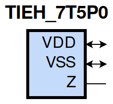
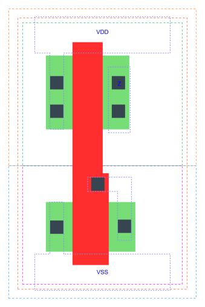

=======================================
gf180mcu_fd_sc_mcu7t5v0__tieh
=======================================

**gf180mcu_fd_sc_mcu7t5v0__tieh symbol**

**gf180mcu_fd_sc_mcu7t5v0__tieh schematic**

**gf180mcu_fd_sc_mcu7t5v0__tieh layout**

.. include:: images.rst

TIEH is a high level generator

|
| Attributes

============= =====================
**Attribute** **Value**
area          8.780800 µm\ :sup:`2`
============= =====================

|
| OUTPUT FUNCTIONS

============== ============
**Output Pin** **Function**
Z              1
============== ============

|
| TRUTH TABLE FOR Z

+-------+
| **Z** |
+-------+

|
| FUNCTIONAL SCHEMATIC
| |image653|
| LEAKAGE POWER

================== ==============
**When Condition** **Power (nW)**
default            0.0500
================== ==============

