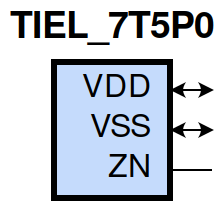
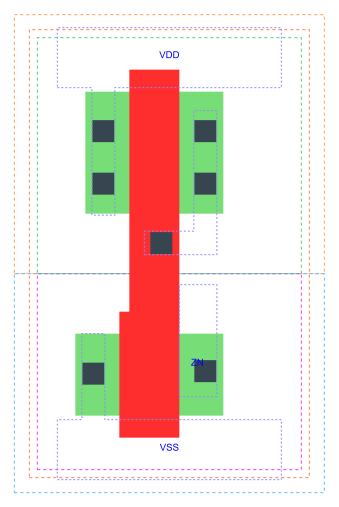

=======================================
gf180mcu_fd_sc_mcu7t5v0__tiel
=======================================

**gf180mcu_fd_sc_mcu7t5v0__tiel symbol**

**gf180mcu_fd_sc_mcu7t5v0__tiel schematic**

**gf180mcu_fd_sc_mcu7t5v0__tiel layout**

.. include:: images.rst

TIEL is a low level generator

|
| Attributes

============= =====================
**Attribute** **Value**
area          8.780800 µm\ :sup:`2`
============= =====================

|
| OUTPUT FUNCTIONS

============== ============
**Output Pin** **Function**
ZN             0
============== ============

|
| TRUTH TABLE FOR ZN

+--------+
| **ZN** |
+--------+

|
| FUNCTIONAL SCHEMATIC
| |image656|
| LEAKAGE POWER

================== ==============
**When Condition** **Power (nW)**
default            0.0499
================== ==============

