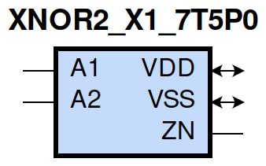
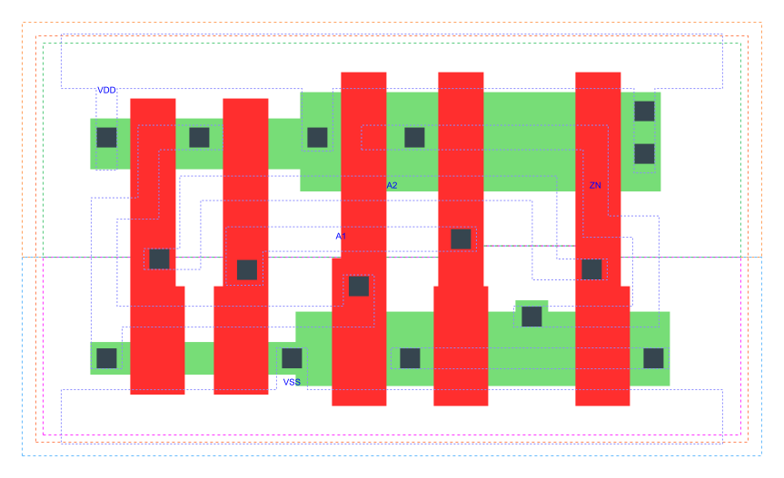

=======================================
gf180mcu_fd_sc_mcu7t5v0__xnor2_x1
=======================================

**gf180mcu_fd_sc_mcu7t5v0__xnor2_x1 symbol**

**gf180mcu_fd_sc_mcu7t5v0__xnor2_x1 schematic**

.. image:: sc7_sch/XNOR2_X1_sch.png
    :height: 300px
    :width: 500 px
    :align: center
    :alt: gf180mcu_fd_sc_mcu7t5v0__xnor2_x1 schematic

**gf180mcu_fd_sc_mcu7t5v0__xnor2_x1 layout**

.. include:: images.rst

XNOR2_X1 is a 2-input exclusive NOR, 1X drive strength

|
| Attributes

============= ======================
**Attribute** **Value**
area          28.537600 µm\ :sup:`2`
============= ======================

|
| OUTPUT FUNCTIONS

============== ============
**Output Pin** **Function**
ZN             (!(A1^A2))
============== ============

|
| TRUTH TABLE FOR ZN

====== ====== ======
**A1** **A2** **ZN**
1      1      1
0      0      1
1      0      0
0      1      0
====== ====== ======

|
| FUNCTIONAL SCHEMATIC
| |image659|
| PIN CAPACITANCE (pf)

======= ======== ====================
**Pin** **Type** **Capacitance (pf)**
A2      input    0.0074
A1      input    0.0071
======= ======== ====================

|
| DELAY AND OUTPUT TRANSITION TIME corresponding to min slew and load

+---------------+------------+--------------------+--------------+-------------------+----------------+---------------+
| **Input Pin** | **Output** | **When Condition** | **Tin (ns)** | **Out Load (pf)** | **Delay (ns)** | **Tout (ns)** |
+---------------+------------+--------------------+--------------+-------------------+----------------+---------------+
| A2(LH)        | ZN(LH)     | A1                 | 0.0100       | 0.0010            | 0.3108         | 0.1043        |
+---------------+------------+--------------------+--------------+-------------------+----------------+---------------+
| A2(HL)        | ZN(LH)     | !A1                | 0.0100       | 0.0010            | 0.1660         | 0.1039        |
+---------------+------------+--------------------+--------------+-------------------+----------------+---------------+
| A2(HL)        | ZN(HL)     | A1                 | 0.0100       | 0.0010            | 0.2474         | 0.0585        |
+---------------+------------+--------------------+--------------+-------------------+----------------+---------------+
| A2(LH)        | ZN(HL)     | !A1                | 0.0100       | 0.0010            | 0.0880         | 0.0613        |
+---------------+------------+--------------------+--------------+-------------------+----------------+---------------+
| A1(HL)        | ZN(LH)     | !A2                | 0.0100       | 0.0010            | 0.1346         | 0.1035        |
+---------------+------------+--------------------+--------------+-------------------+----------------+---------------+
| A1(HL)        | ZN(HL)     | A2                 | 0.0100       | 0.0010            | 0.2881         | 0.0741        |
+---------------+------------+--------------------+--------------+-------------------+----------------+---------------+
| A1(LH)        | ZN(HL)     | !A2                | 0.0100       | 0.0010            | 0.0671         | 0.0434        |
+---------------+------------+--------------------+--------------+-------------------+----------------+---------------+
| A1(LH)        | ZN(LH)     | A2                 | 0.0100       | 0.0010            | 0.3229         | 0.1044        |
+---------------+------------+--------------------+--------------+-------------------+----------------+---------------+

|
| DYNAMIC ENERGY

+---------------+--------------------+--------------+------------+-------------------+---------------------+
| **Input Pin** | **When Condition** | **Tin (ns)** | **Output** | **Out Load (pf)** | **Energy (uW/MHz)** |
+---------------+--------------------+--------------+------------+-------------------+---------------------+
| A2            | A1                 | 0.0100       | ZN(LH)     | 0.0010            | 0.2153              |
+---------------+--------------------+--------------+------------+-------------------+---------------------+
| A2            | !A1                | 0.0100       | ZN(LH)     | 0.0010            | 0.1822              |
+---------------+--------------------+--------------+------------+-------------------+---------------------+
| A1            | !A2                | 0.0100       | ZN(LH)     | 0.0010            | 0.1549              |
+---------------+--------------------+--------------+------------+-------------------+---------------------+
| A1            | A2                 | 0.0100       | ZN(LH)     | 0.0010            | 0.2376              |
+---------------+--------------------+--------------+------------+-------------------+---------------------+
| A1            | A2                 | 0.0100       | ZN(HL)     | 0.0010            | 0.2626              |
+---------------+--------------------+--------------+------------+-------------------+---------------------+
| A1            | !A2                | 0.0100       | ZN(HL)     | 0.0010            | -0.0078             |
+---------------+--------------------+--------------+------------+-------------------+---------------------+
| A2            | A1                 | 0.0100       | ZN(HL)     | 0.0010            | 0.2203              |
+---------------+--------------------+--------------+------------+-------------------+---------------------+
| A2            | !A1                | 0.0100       | ZN(HL)     | 0.0010            | 0.0261              |
+---------------+--------------------+--------------+------------+-------------------+---------------------+

|
| LEAKAGE POWER

================== ==============
**When Condition** **Power (nW)**
!A1&!A2            0.1265
A1&A2              0.2127
!A1&A2             0.2063
A1&!A2             0.1304
================== ==============

