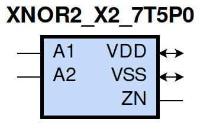
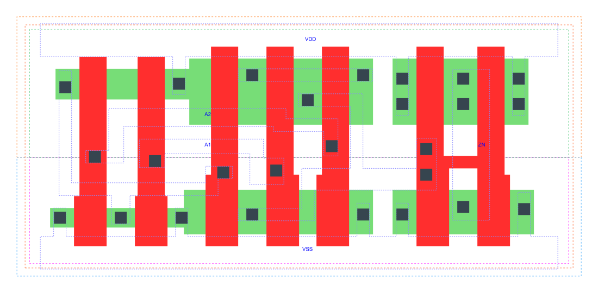

=======================================
gf180mcu_fd_sc_mcu7t5v0__xnor2_x2
=======================================

**gf180mcu_fd_sc_mcu7t5v0__xnor2_x2 symbol**

**gf180mcu_fd_sc_mcu7t5v0__xnor2_x2 schematic**

.. image:: sc7_sch/XNOR2_X2_sch.png
    :height: 300px
    :width: 500 px
    :align: center
    :alt: gf180mcu_fd_sc_mcu7t5v0__xnor2_x2 schematic

**gf180mcu_fd_sc_mcu7t5v0__xnor2_x2 layout**

.. include:: images.rst

XNOR2_X2 is a 2-input exclusive NOR, 2X drive strength

|
| Attributes

============= ======================
**Attribute** **Value**
area          37.318400 µm\ :sup:`2`
============= ======================

|
| OUTPUT FUNCTIONS

============== ============
**Output Pin** **Function**
ZN             (!(A1^A2))
============== ============

|
| TRUTH TABLE FOR ZN

====== ====== ======
**A1** **A2** **ZN**
1      1      1
0      0      1
1      0      0
0      1      0
====== ====== ======

|
| FUNCTIONAL SCHEMATIC
| |image662|
| PIN CAPACITANCE (pf)

======= ======== ====================
**Pin** **Type** **Capacitance (pf)**
A2      input    0.0074
A1      input    0.0075
======= ======== ====================

|
| DELAY AND OUTPUT TRANSITION TIME corresponding to min slew and load

+---------------+------------+--------------------+--------------+-------------------+----------------+---------------+
| **Input Pin** | **Output** | **When Condition** | **Tin (ns)** | **Out Load (pf)** | **Delay (ns)** | **Tout (ns)** |
+---------------+------------+--------------------+--------------+-------------------+----------------+---------------+
| A2(LH)        | ZN(LH)     | A1                 | 0.0100       | 0.0010            | 0.2069         | 0.0361        |
+---------------+------------+--------------------+--------------+-------------------+----------------+---------------+
| A2(HL)        | ZN(LH)     | !A1                | 0.0100       | 0.0010            | 0.5024         | 0.0345        |
+---------------+------------+--------------------+--------------+-------------------+----------------+---------------+
| A2(HL)        | ZN(HL)     | A1                 | 0.0100       | 0.0010            | 0.2820         | 0.0502        |
+---------------+------------+--------------------+--------------+-------------------+----------------+---------------+
| A2(LH)        | ZN(HL)     | !A1                | 0.0100       | 0.0010            | 0.3934         | 0.0455        |
+---------------+------------+--------------------+--------------+-------------------+----------------+---------------+
| A1(HL)        | ZN(LH)     | !A2                | 0.0100       | 0.0010            | 0.5312         | 0.0347        |
+---------------+------------+--------------------+--------------+-------------------+----------------+---------------+
| A1(HL)        | ZN(HL)     | A2                 | 0.0100       | 0.0010            | 0.2541         | 0.0454        |
+---------------+------------+--------------------+--------------+-------------------+----------------+---------------+
| A1(LH)        | ZN(HL)     | !A2                | 0.0100       | 0.0010            | 0.4432         | 0.0500        |
+---------------+------------+--------------------+--------------+-------------------+----------------+---------------+
| A1(LH)        | ZN(LH)     | A2                 | 0.0100       | 0.0010            | 0.1954         | 0.0361        |
+---------------+------------+--------------------+--------------+-------------------+----------------+---------------+

|
| DYNAMIC ENERGY

+---------------+--------------------+--------------+------------+-------------------+---------------------+
| **Input Pin** | **When Condition** | **Tin (ns)** | **Output** | **Out Load (pf)** | **Energy (uW/MHz)** |
+---------------+--------------------+--------------+------------+-------------------+---------------------+
| A2            | A1                 | 0.0100       | ZN(LH)     | 0.0010            | 0.2058              |
+---------------+--------------------+--------------+------------+-------------------+---------------------+
| A2            | !A1                | 0.0100       | ZN(LH)     | 0.0010            | 0.4985              |
+---------------+--------------------+--------------+------------+-------------------+---------------------+
| A1            | !A2                | 0.0100       | ZN(LH)     | 0.0010            | 0.5156              |
+---------------+--------------------+--------------+------------+-------------------+---------------------+
| A1            | A2                 | 0.0100       | ZN(LH)     | 0.0010            | 0.1957              |
+---------------+--------------------+--------------+------------+-------------------+---------------------+
| A1            | A2                 | 0.0100       | ZN(HL)     | 0.0010            | 0.4303              |
+---------------+--------------------+--------------+------------+-------------------+---------------------+
| A1            | !A2                | 0.0100       | ZN(HL)     | 0.0010            | 0.5152              |
+---------------+--------------------+--------------+------------+-------------------+---------------------+
| A2            | A1                 | 0.0100       | ZN(HL)     | 0.0010            | 0.4818              |
+---------------+--------------------+--------------+------------+-------------------+---------------------+
| A2            | !A1                | 0.0100       | ZN(HL)     | 0.0010            | 0.4432              |
+---------------+--------------------+--------------+------------+-------------------+---------------------+

|
| LEAKAGE POWER

================== ==============
**When Condition** **Power (nW)**
!A1&!A2            0.2613
A1&A2              0.1800
!A1&A2             0.1800
A1&!A2             0.2559
================== ==============

