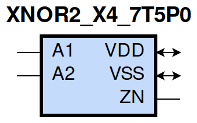
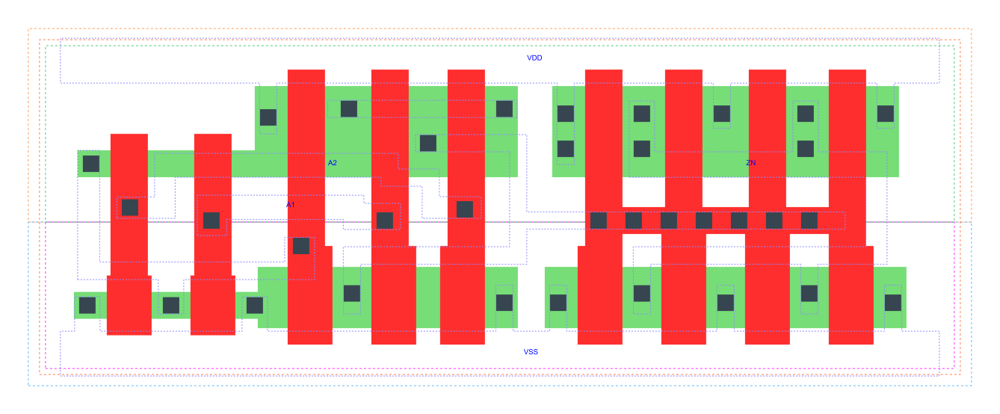

=======================================
gf180mcu_fd_sc_mcu7t5v0__xnor2_x4
=======================================

**gf180mcu_fd_sc_mcu7t5v0__xnor2_x4 symbol**

**gf180mcu_fd_sc_mcu7t5v0__xnor2_x4 schematic**

**gf180mcu_fd_sc_mcu7t5v0__xnor2_x4 layout**

.. include:: images.rst

XNOR2_X4 is a 2-input exclusive NOR, 4X drive strength

|
| Attributes

============= ======================
**Attribute** **Value**
area          46.099200 µm\ :sup:`2`
============= ======================

|
| OUTPUT FUNCTIONS

============== ============
**Output Pin** **Function**
ZN             (!(A1^A2))
============== ============

|
| TRUTH TABLE FOR ZN

====== ====== ======
**A1** **A2** **ZN**
1      1      1
0      0      1
1      0      0
0      1      0
====== ====== ======

|
| FUNCTIONAL SCHEMATIC
| |image665|
| PIN CAPACITANCE (pf)

======= ======== ====================
**Pin** **Type** **Capacitance (pf)**
A2      input    0.0071
A1      input    0.0070
======= ======== ====================

|
| DELAY AND OUTPUT TRANSITION TIME corresponding to min slew and load

+---------------+------------+--------------------+--------------+-------------------+----------------+---------------+
| **Input Pin** | **Output** | **When Condition** | **Tin (ns)** | **Out Load (pf)** | **Delay (ns)** | **Tout (ns)** |
+---------------+------------+--------------------+--------------+-------------------+----------------+---------------+
| A2(LH)        | ZN(LH)     | A1                 | 0.0100       | 0.0010            | 0.2917         | 0.0456        |
+---------------+------------+--------------------+--------------+-------------------+----------------+---------------+
| A2(HL)        | ZN(LH)     | !A1                | 0.0100       | 0.0010            | 0.7069         | 0.0431        |
+---------------+------------+--------------------+--------------+-------------------+----------------+---------------+
| A2(HL)        | ZN(HL)     | A1                 | 0.0100       | 0.0010            | 0.4011         | 0.0683        |
+---------------+------------+--------------------+--------------+-------------------+----------------+---------------+
| A2(LH)        | ZN(HL)     | !A1                | 0.0100       | 0.0010            | 0.5097         | 0.0646        |
+---------------+------------+--------------------+--------------+-------------------+----------------+---------------+
| A1(HL)        | ZN(LH)     | !A2                | 0.0100       | 0.0010            | 0.7386         | 0.0431        |
+---------------+------------+--------------------+--------------+-------------------+----------------+---------------+
| A1(HL)        | ZN(HL)     | A2                 | 0.0100       | 0.0010            | 0.3752         | 0.0646        |
+---------------+------------+--------------------+--------------+-------------------+----------------+---------------+
| A1(LH)        | ZN(HL)     | !A2                | 0.0100       | 0.0010            | 0.5488         | 0.0683        |
+---------------+------------+--------------------+--------------+-------------------+----------------+---------------+
| A1(LH)        | ZN(LH)     | A2                 | 0.0100       | 0.0010            | 0.2801         | 0.0453        |
+---------------+------------+--------------------+--------------+-------------------+----------------+---------------+

|
| DYNAMIC ENERGY

+---------------+--------------------+--------------+------------+-------------------+---------------------+
| **Input Pin** | **When Condition** | **Tin (ns)** | **Output** | **Out Load (pf)** | **Energy (uW/MHz)** |
+---------------+--------------------+--------------+------------+-------------------+---------------------+
| A2            | A1                 | 0.0100       | ZN(LH)     | 0.0010            | 0.5269              |
+---------------+--------------------+--------------+------------+-------------------+---------------------+
| A2            | !A1                | 0.0100       | ZN(LH)     | 0.0010            | 0.8341              |
+---------------+--------------------+--------------+------------+-------------------+---------------------+
| A1            | !A2                | 0.0100       | ZN(LH)     | 0.0010            | 0.8459              |
+---------------+--------------------+--------------+------------+-------------------+---------------------+
| A1            | A2                 | 0.0100       | ZN(LH)     | 0.0010            | 0.5195              |
+---------------+--------------------+--------------+------------+-------------------+---------------------+
| A1            | A2                 | 0.0100       | ZN(HL)     | 0.0010            | 0.9202              |
+---------------+--------------------+--------------+------------+-------------------+---------------------+
| A1            | !A2                | 0.0100       | ZN(HL)     | 0.0010            | 1.0265              |
+---------------+--------------------+--------------+------------+-------------------+---------------------+
| A2            | A1                 | 0.0100       | ZN(HL)     | 0.0010            | 0.9955              |
+---------------+--------------------+--------------+------------+-------------------+---------------------+
| A2            | !A1                | 0.0100       | ZN(HL)     | 0.0010            | 0.9388              |
+---------------+--------------------+--------------+------------+-------------------+---------------------+

|
| LEAKAGE POWER

================== ==============
**When Condition** **Power (nW)**
!A1&!A2            0.3122
A1&A2              0.2307
!A1&A2             0.2328
A1&!A2             0.3090
================== ==============

