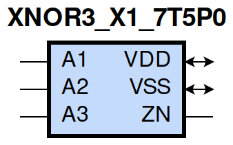
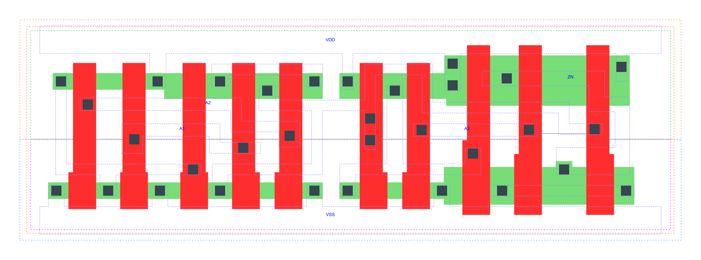

=======================================
gf180mcu_fd_sc_mcu7t5v0__xnor3_x1
=======================================

**gf180mcu_fd_sc_mcu7t5v0__xnor3_x1 symbol**

**gf180mcu_fd_sc_mcu7t5v0__xnor3_x1 schematic**

**gf180mcu_fd_sc_mcu7t5v0__xnor3_x1 layout**

.. include:: images.rst

XNOR3_X1 is a 3-input exclusive NOR, 1X drive strength

|
| Attributes

============= ======================
**Attribute** **Value**
area          52.684800 µm\ :sup:`2`
============= ======================

|
| OUTPUT FUNCTIONS

============== =============
**Output Pin** **Function**
ZN             (!(A1^A2^A3))
============== =============

|
| TRUTH TABLE FOR ZN

====== ====== ====== ======
**A1** **A2** **A3** **ZN**
1      1      0      1
1      0      1      1
0      1      1      1
0      0      0      1
1      1      1      0
1      0      0      0
0      1      0      0
0      0      1      0
====== ====== ====== ======

|
| FUNCTIONAL SCHEMATIC
| |image668|
| PIN CAPACITANCE (pf)

======= ======== ====================
**Pin** **Type** **Capacitance (pf)**
A2      input    0.0052
A1      input    0.0052
A3      input    0.0069
======= ======== ====================

|
| DELAY AND OUTPUT TRANSITION TIME corresponding to min slew and load

+---------------+------------+--------------------+--------------+-------------------+----------------+---------------+
| **Input Pin** | **Output** | **When Condition** | **Tin (ns)** | **Out Load (pf)** | **Delay (ns)** | **Tout (ns)** |
+---------------+------------+--------------------+--------------+-------------------+----------------+---------------+
| A2(LH)        | ZN(LH)     | !A1&A3             | 0.0100       | 0.0010            | 0.9076         | 0.1025        |
+---------------+------------+--------------------+--------------+-------------------+----------------+---------------+
| A2(LH)        | ZN(LH)     | A1&!A3             | 0.0100       | 0.0010            | 0.4111         | 0.1175        |
+---------------+------------+--------------------+--------------+-------------------+----------------+---------------+
| A2(HL)        | ZN(LH)     | !A1&!A3            | 0.0100       | 0.0010            | 0.7052         | 0.1130        |
+---------------+------------+--------------------+--------------+-------------------+----------------+---------------+
| A2(HL)        | ZN(LH)     | A1&A3              | 0.0100       | 0.0010            | 0.8102         | 0.1025        |
+---------------+------------+--------------------+--------------+-------------------+----------------+---------------+
| A2(HL)        | ZN(HL)     | !A1&A3             | 0.0100       | 0.0010            | 0.8068         | 0.0595        |
+---------------+------------+--------------------+--------------+-------------------+----------------+---------------+
| A2(HL)        | ZN(HL)     | A1&!A3             | 0.0100       | 0.0010            | 0.5353         | 0.1330        |
+---------------+------------+--------------------+--------------+-------------------+----------------+---------------+
| A2(LH)        | ZN(HL)     | !A1&!A3            | 0.0100       | 0.0010            | 0.6377         | 0.1264        |
+---------------+------------+--------------------+--------------+-------------------+----------------+---------------+
| A2(LH)        | ZN(HL)     | A1&A3              | 0.0100       | 0.0010            | 0.5158         | 0.0609        |
+---------------+------------+--------------------+--------------+-------------------+----------------+---------------+
| A1(HL)        | ZN(LH)     | !A2&!A3            | 0.0100       | 0.0010            | 0.7363         | 0.1130        |
+---------------+------------+--------------------+--------------+-------------------+----------------+---------------+
| A1(HL)        | ZN(LH)     | A2&A3              | 0.0100       | 0.0010            | 0.7766         | 0.1022        |
+---------------+------------+--------------------+--------------+-------------------+----------------+---------------+
| A1(HL)        | ZN(HL)     | !A2&A3             | 0.0100       | 0.0010            | 0.8380         | 0.0594        |
+---------------+------------+--------------------+--------------+-------------------+----------------+---------------+
| A1(HL)        | ZN(HL)     | A2&!A3             | 0.0100       | 0.0010            | 0.5065         | 0.1267        |
+---------------+------------+--------------------+--------------+-------------------+----------------+---------------+
| A1(LH)        | ZN(HL)     | !A2&!A3            | 0.0100       | 0.0010            | 0.6752         | 0.1330        |
+---------------+------------+--------------------+--------------+-------------------+----------------+---------------+
| A1(LH)        | ZN(HL)     | A2&A3              | 0.0100       | 0.0010            | 0.5045         | 0.0607        |
+---------------+------------+--------------------+--------------+-------------------+----------------+---------------+
| A1(LH)        | ZN(LH)     | !A2&A3             | 0.0100       | 0.0010            | 0.9498         | 0.1024        |
+---------------+------------+--------------------+--------------+-------------------+----------------+---------------+
| A1(LH)        | ZN(LH)     | A2&!A3             | 0.0100       | 0.0010            | 0.3997         | 0.1176        |
+---------------+------------+--------------------+--------------+-------------------+----------------+---------------+
| A3(LH)        | ZN(HL)     | !A1&!A2            | 0.0100       | 0.0010            | 0.0675         | 0.0436        |
+---------------+------------+--------------------+--------------+-------------------+----------------+---------------+
| A3(LH)        | ZN(HL)     | A1&A2              | 0.0100       | 0.0010            | 0.0675         | 0.0435        |
+---------------+------------+--------------------+--------------+-------------------+----------------+---------------+
| A3(HL)        | ZN(HL)     | !A1&A2             | 0.0100       | 0.0010            | 0.2827         | 0.0738        |
+---------------+------------+--------------------+--------------+-------------------+----------------+---------------+
| A3(HL)        | ZN(HL)     | A1&!A2             | 0.0100       | 0.0010            | 0.2827         | 0.0738        |
+---------------+------------+--------------------+--------------+-------------------+----------------+---------------+
| A3(LH)        | ZN(LH)     | !A1&A2             | 0.0100       | 0.0010            | 0.3179         | 0.1044        |
+---------------+------------+--------------------+--------------+-------------------+----------------+---------------+
| A3(LH)        | ZN(LH)     | A1&!A2             | 0.0100       | 0.0010            | 0.3180         | 0.1044        |
+---------------+------------+--------------------+--------------+-------------------+----------------+---------------+
| A3(HL)        | ZN(LH)     | !A1&!A2            | 0.0100       | 0.0010            | 0.1348         | 0.1042        |
+---------------+------------+--------------------+--------------+-------------------+----------------+---------------+
| A3(HL)        | ZN(LH)     | A1&A2              | 0.0100       | 0.0010            | 0.1348         | 0.1040        |
+---------------+------------+--------------------+--------------+-------------------+----------------+---------------+

|
| DYNAMIC ENERGY

+---------------+--------------------+--------------+------------+-------------------+---------------------+
| **Input Pin** | **When Condition** | **Tin (ns)** | **Output** | **Out Load (pf)** | **Energy (uW/MHz)** |
+---------------+--------------------+--------------+------------+-------------------+---------------------+
| A2            | !A1&A3             | 0.0100       | ZN(LH)     | 0.0010            | 0.5059              |
+---------------+--------------------+--------------+------------+-------------------+---------------------+
| A2            | A1&!A3             | 0.0100       | ZN(LH)     | 0.0010            | 0.1906              |
+---------------+--------------------+--------------+------------+-------------------+---------------------+
| A2            | !A1&!A3            | 0.0100       | ZN(LH)     | 0.0010            | 0.3581              |
+---------------+--------------------+--------------+------------+-------------------+---------------------+
| A2            | A1&A3              | 0.0100       | ZN(LH)     | 0.0010            | 0.5132              |
+---------------+--------------------+--------------+------------+-------------------+---------------------+
| A1            | !A2&!A3            | 0.0100       | ZN(LH)     | 0.0010            | 0.3689              |
+---------------+--------------------+--------------+------------+-------------------+---------------------+
| A1            | A2&A3              | 0.0100       | ZN(LH)     | 0.0010            | 0.4942              |
+---------------+--------------------+--------------+------------+-------------------+---------------------+
| A1            | !A2&A3             | 0.0100       | ZN(LH)     | 0.0010            | 0.5353              |
+---------------+--------------------+--------------+------------+-------------------+---------------------+
| A1            | A2&!A3             | 0.0100       | ZN(LH)     | 0.0010            | 0.1838              |
+---------------+--------------------+--------------+------------+-------------------+---------------------+
| A1            | !A2&A3             | 0.0100       | ZN(HL)     | 0.0010            | 0.4053              |
+---------------+--------------------+--------------+------------+-------------------+---------------------+
| A1            | A2&!A3             | 0.0100       | ZN(HL)     | 0.0010            | 0.3449              |
+---------------+--------------------+--------------+------------+-------------------+---------------------+
| A1            | !A2&!A3            | 0.0100       | ZN(HL)     | 0.0010            | 0.3890              |
+---------------+--------------------+--------------+------------+-------------------+---------------------+
| A1            | A2&A3              | 0.0100       | ZN(HL)     | 0.0010            | 0.2205              |
+---------------+--------------------+--------------+------------+-------------------+---------------------+
| A3            | !A1&!A2            | 0.0100       | ZN(HL)     | 0.0010            | -0.0065             |
+---------------+--------------------+--------------+------------+-------------------+---------------------+
| A3            | A1&A2              | 0.0100       | ZN(HL)     | 0.0010            | -0.0066             |
+---------------+--------------------+--------------+------------+-------------------+---------------------+
| A3            | !A1&A2             | 0.0100       | ZN(HL)     | 0.0010            | 0.2712              |
+---------------+--------------------+--------------+------------+-------------------+---------------------+
| A3            | A1&!A2             | 0.0100       | ZN(HL)     | 0.0010            | 0.2712              |
+---------------+--------------------+--------------+------------+-------------------+---------------------+
| A2            | !A1&A3             | 0.0100       | ZN(HL)     | 0.0010            | 0.3944              |
+---------------+--------------------+--------------+------------+-------------------+---------------------+
| A2            | A1&!A3             | 0.0100       | ZN(HL)     | 0.0010            | 0.3666              |
+---------------+--------------------+--------------+------------+-------------------+---------------------+
| A2            | !A1&!A3            | 0.0100       | ZN(HL)     | 0.0010            | 0.3575              |
+---------------+--------------------+--------------+------------+-------------------+---------------------+
| A2            | A1&A3              | 0.0100       | ZN(HL)     | 0.0010            | 0.2272              |
+---------------+--------------------+--------------+------------+-------------------+---------------------+
| A3            | !A1&A2             | 0.0100       | ZN(LH)     | 0.0010            | 0.2237              |
+---------------+--------------------+--------------+------------+-------------------+---------------------+
| A3            | A1&!A2             | 0.0100       | ZN(LH)     | 0.0010            | 0.2239              |
+---------------+--------------------+--------------+------------+-------------------+---------------------+
| A3            | !A1&!A2            | 0.0100       | ZN(LH)     | 0.0010            | 0.1545              |
+---------------+--------------------+--------------+------------+-------------------+---------------------+
| A3            | A1&A2              | 0.0100       | ZN(LH)     | 0.0010            | 0.1544              |
+---------------+--------------------+--------------+------------+-------------------+---------------------+

|
| LEAKAGE POWER

================== ==============
**When Condition** **Power (nW)**
!A1&!A2&!A3        0.2871
!A1&A2&A3          0.2938
A1&!A2&A3          0.3702
A1&A2&!A3          0.2046
!A1&!A2&A3         0.2910
!A1&A2&!A3         0.2874
A1&!A2&!A3         0.3639
A1&A2&A3           0.2085
================== ==============

