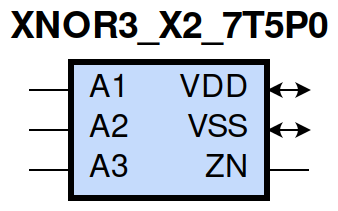
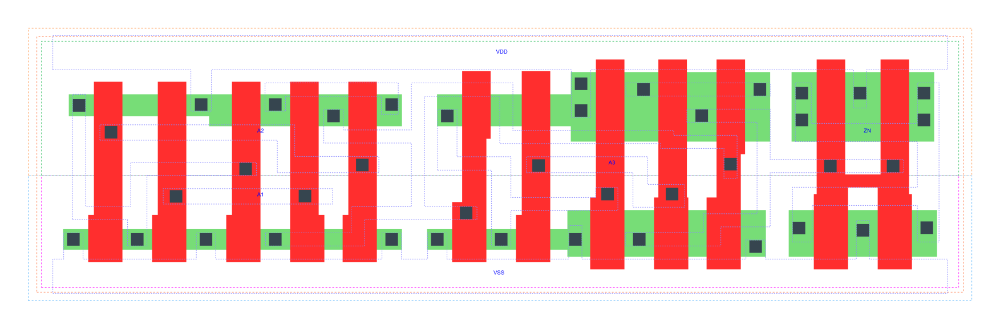

=======================================
gf180mcu_fd_sc_mcu7t5v0__xnor3_x2
=======================================

**gf180mcu_fd_sc_mcu7t5v0__xnor3_x2 symbol**

**gf180mcu_fd_sc_mcu7t5v0__xnor3_x2 schematic**

.. image:: sc7_sch/XNOR3_X2_sch.png
    :height: 300px
    :width: 500 px
    :align: center
    :alt: gf180mcu_fd_sc_mcu7t5v0__xnor3_x2 schematic

**gf180mcu_fd_sc_mcu7t5v0__xnor3_x2 layout**

.. include:: images.rst

XNOR3_X2 is a 3-input exclusive NOR, 2X drive strength

|
| Attributes

============= ======================
**Attribute** **Value**
area          61.465600 µm\ :sup:`2`
============= ======================

|
| OUTPUT FUNCTIONS

============== =============
**Output Pin** **Function**
ZN             (!(A1^A2^A3))
============== =============

|
| TRUTH TABLE FOR ZN

====== ====== ====== ======
**A1** **A2** **A3** **ZN**
1      1      0      1
1      0      1      1
0      1      1      1
0      0      0      1
1      1      1      0
1      0      0      0
0      1      0      0
0      0      1      0
====== ====== ====== ======

|
| FUNCTIONAL SCHEMATIC
| |image671|
| PIN CAPACITANCE (pf)

======= ======== ====================
**Pin** **Type** **Capacitance (pf)**
A2      input    0.0051
A1      input    0.0050
A3      input    0.0074
======= ======== ====================

|
| DELAY AND OUTPUT TRANSITION TIME corresponding to min slew and load

+---------------+------------+--------------------+--------------+-------------------+----------------+---------------+
| **Input Pin** | **Output** | **When Condition** | **Tin (ns)** | **Out Load (pf)** | **Delay (ns)** | **Tout (ns)** |
+---------------+------------+--------------------+--------------+-------------------+----------------+---------------+
| A2(LH)        | ZN(LH)     | !A1&A3             | 0.0100       | 0.0010            | 0.7896         | 0.0500        |
+---------------+------------+--------------------+--------------+-------------------+----------------+---------------+
| A2(LH)        | ZN(LH)     | A1&!A3             | 0.0100       | 0.0010            | 0.8265         | 0.0428        |
+---------------+------------+--------------------+--------------+-------------------+----------------+---------------+
| A2(HL)        | ZN(LH)     | !A1&!A3            | 0.0100       | 0.0010            | 1.1032         | 0.0428        |
+---------------+------------+--------------------+--------------+-------------------+----------------+---------------+
| A2(HL)        | ZN(LH)     | A1&A3              | 0.0100       | 0.0010            | 0.6853         | 0.0506        |
+---------------+------------+--------------------+--------------+-------------------+----------------+---------------+
| A2(HL)        | ZN(HL)     | !A1&A3             | 0.0100       | 0.0010            | 0.8683         | 0.0593        |
+---------------+------------+--------------------+--------------+-------------------+----------------+---------------+
| A2(HL)        | ZN(HL)     | A1&!A3             | 0.0100       | 0.0010            | 0.8582         | 0.0540        |
+---------------+------------+--------------------+--------------+-------------------+----------------+---------------+
| A2(LH)        | ZN(HL)     | !A1&!A3            | 0.0100       | 0.0010            | 0.9639         | 0.0541        |
+---------------+------------+--------------------+--------------+-------------------+----------------+---------------+
| A2(LH)        | ZN(HL)     | A1&A3              | 0.0100       | 0.0010            | 0.5885         | 0.0599        |
+---------------+------------+--------------------+--------------+-------------------+----------------+---------------+
| A1(HL)        | ZN(LH)     | !A2&!A3            | 0.0100       | 0.0010            | 1.1344         | 0.0427        |
+---------------+------------+--------------------+--------------+-------------------+----------------+---------------+
| A1(HL)        | ZN(LH)     | A2&A3              | 0.0100       | 0.0010            | 0.6552         | 0.0502        |
+---------------+------------+--------------------+--------------+-------------------+----------------+---------------+
| A1(HL)        | ZN(HL)     | !A2&A3             | 0.0100       | 0.0010            | 0.8995         | 0.0591        |
+---------------+------------+--------------------+--------------+-------------------+----------------+---------------+
| A1(HL)        | ZN(HL)     | A2&!A3             | 0.0100       | 0.0010            | 0.8300         | 0.0540        |
+---------------+------------+--------------------+--------------+-------------------+----------------+---------------+
| A1(LH)        | ZN(HL)     | !A2&!A3            | 0.0100       | 0.0010            | 1.0035         | 0.0540        |
+---------------+------------+--------------------+--------------+-------------------+----------------+---------------+
| A1(LH)        | ZN(HL)     | A2&A3              | 0.0100       | 0.0010            | 0.5774         | 0.0599        |
+---------------+------------+--------------------+--------------+-------------------+----------------+---------------+
| A1(LH)        | ZN(LH)     | !A2&A3             | 0.0100       | 0.0010            | 0.8296         | 0.0511        |
+---------------+------------+--------------------+--------------+-------------------+----------------+---------------+
| A1(LH)        | ZN(LH)     | A2&!A3             | 0.0100       | 0.0010            | 0.8154         | 0.0427        |
+---------------+------------+--------------------+--------------+-------------------+----------------+---------------+
| A3(LH)        | ZN(HL)     | !A1&!A2            | 0.0100       | 0.0010            | 0.4674         | 0.0589        |
+---------------+------------+--------------------+--------------+-------------------+----------------+---------------+
| A3(LH)        | ZN(HL)     | A1&A2              | 0.0100       | 0.0010            | 0.4679         | 0.0591        |
+---------------+------------+--------------------+--------------+-------------------+----------------+---------------+
| A3(HL)        | ZN(HL)     | !A1&A2             | 0.0100       | 0.0010            | 0.2748         | 0.0539        |
+---------------+------------+--------------------+--------------+-------------------+----------------+---------------+
| A3(HL)        | ZN(HL)     | A1&!A2             | 0.0100       | 0.0010            | 0.2748         | 0.0539        |
+---------------+------------+--------------------+--------------+-------------------+----------------+---------------+
| A3(LH)        | ZN(LH)     | !A1&A2             | 0.0100       | 0.0010            | 0.2128         | 0.0446        |
+---------------+------------+--------------------+--------------+-------------------+----------------+---------------+
| A3(LH)        | ZN(LH)     | A1&!A2             | 0.0100       | 0.0010            | 0.2128         | 0.0446        |
+---------------+------------+--------------------+--------------+-------------------+----------------+---------------+
| A3(HL)        | ZN(LH)     | !A1&!A2            | 0.0100       | 0.0010            | 0.5531         | 0.0425        |
+---------------+------------+--------------------+--------------+-------------------+----------------+---------------+
| A3(HL)        | ZN(LH)     | A1&A2              | 0.0100       | 0.0010            | 0.5541         | 0.0426        |
+---------------+------------+--------------------+--------------+-------------------+----------------+---------------+

|
| DYNAMIC ENERGY

+---------------+--------------------+--------------+------------+-------------------+---------------------+
| **Input Pin** | **When Condition** | **Tin (ns)** | **Output** | **Out Load (pf)** | **Energy (uW/MHz)** |
+---------------+--------------------+--------------+------------+-------------------+---------------------+
| A2            | !A1&A3             | 0.0100       | ZN(LH)     | 0.0010            | 0.6100              |
+---------------+--------------------+--------------+------------+-------------------+---------------------+
| A2            | A1&!A3             | 0.0100       | ZN(LH)     | 0.0010            | 0.5461              |
+---------------+--------------------+--------------+------------+-------------------+---------------------+
| A2            | !A1&!A3            | 0.0100       | ZN(LH)     | 0.0010            | 0.7171              |
+---------------+--------------------+--------------+------------+-------------------+---------------------+
| A2            | A1&A3              | 0.0100       | ZN(LH)     | 0.0010            | 0.6226              |
+---------------+--------------------+--------------+------------+-------------------+---------------------+
| A1            | !A2&!A3            | 0.0100       | ZN(LH)     | 0.0010            | 0.7281              |
+---------------+--------------------+--------------+------------+-------------------+---------------------+
| A1            | A2&A3              | 0.0100       | ZN(LH)     | 0.0010            | 0.5976              |
+---------------+--------------------+--------------+------------+-------------------+---------------------+
| A1            | !A2&A3             | 0.0100       | ZN(LH)     | 0.0010            | 0.6451              |
+---------------+--------------------+--------------+------------+-------------------+---------------------+
| A1            | A2&!A3             | 0.0100       | ZN(LH)     | 0.0010            | 0.5391              |
+---------------+--------------------+--------------+------------+-------------------+---------------------+
| A1            | !A2&A3             | 0.0100       | ZN(HL)     | 0.0010            | 0.7023              |
+---------------+--------------------+--------------+------------+-------------------+---------------------+
| A1            | A2&!A3             | 0.0100       | ZN(HL)     | 0.0010            | 0.7439              |
+---------------+--------------------+--------------+------------+-------------------+---------------------+
| A1            | !A2&!A3            | 0.0100       | ZN(HL)     | 0.0010            | 0.7856              |
+---------------+--------------------+--------------+------------+-------------------+---------------------+
| A1            | A2&A3              | 0.0100       | ZN(HL)     | 0.0010            | 0.5164              |
+---------------+--------------------+--------------+------------+-------------------+---------------------+
| A3            | !A1&!A2            | 0.0100       | ZN(HL)     | 0.0010            | 0.5353              |
+---------------+--------------------+--------------+------------+-------------------+---------------------+
| A3            | A1&A2              | 0.0100       | ZN(HL)     | 0.0010            | 0.5360              |
+---------------+--------------------+--------------+------------+-------------------+---------------------+
| A3            | !A1&A2             | 0.0100       | ZN(HL)     | 0.0010            | 0.4458              |
+---------------+--------------------+--------------+------------+-------------------+---------------------+
| A3            | A1&!A2             | 0.0100       | ZN(HL)     | 0.0010            | 0.4458              |
+---------------+--------------------+--------------+------------+-------------------+---------------------+
| A2            | !A1&A3             | 0.0100       | ZN(HL)     | 0.0010            | 0.6912              |
+---------------+--------------------+--------------+------------+-------------------+---------------------+
| A2            | A1&!A3             | 0.0100       | ZN(HL)     | 0.0010            | 0.7627              |
+---------------+--------------------+--------------+------------+-------------------+---------------------+
| A2            | !A1&!A3            | 0.0100       | ZN(HL)     | 0.0010            | 0.7561              |
+---------------+--------------------+--------------+------------+-------------------+---------------------+
| A2            | A1&A3              | 0.0100       | ZN(HL)     | 0.0010            | 0.5233              |
+---------------+--------------------+--------------+------------+-------------------+---------------------+
| A3            | !A1&A2             | 0.0100       | ZN(LH)     | 0.0010            | 0.2352              |
+---------------+--------------------+--------------+------------+-------------------+---------------------+
| A3            | A1&!A2             | 0.0100       | ZN(LH)     | 0.0010            | 0.2352              |
+---------------+--------------------+--------------+------------+-------------------+---------------------+
| A3            | !A1&!A2            | 0.0100       | ZN(LH)     | 0.0010            | 0.5528              |
+---------------+--------------------+--------------+------------+-------------------+---------------------+
| A3            | A1&A2              | 0.0100       | ZN(LH)     | 0.0010            | 0.5532              |
+---------------+--------------------+--------------+------------+-------------------+---------------------+

|
| LEAKAGE POWER

================== ==============
**When Condition** **Power (nW)**
!A1&!A2&!A3        0.4219
!A1&A2&A3          0.2611
A1&!A2&A3          0.3375
A1&A2&!A3          0.3395
!A1&!A2&A3         0.4165
!A1&A2&!A3         0.2611
A1&!A2&!A3         0.3375
A1&A2&A3           0.3341
================== ==============

