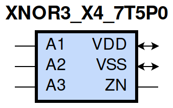
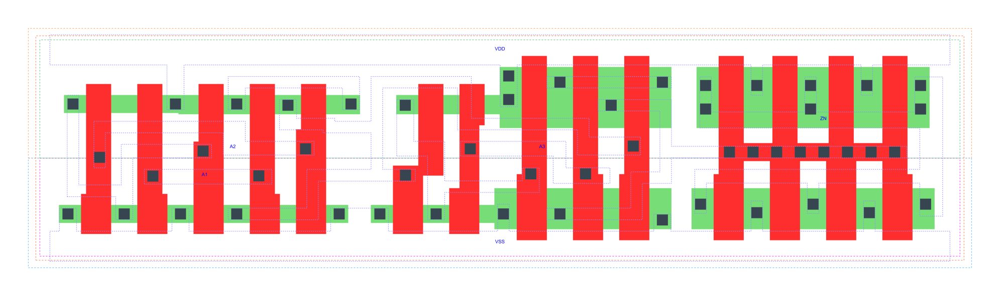

=======================================
gf180mcu_fd_sc_mcu7t5v0__xnor3_x4
=======================================

**gf180mcu_fd_sc_mcu7t5v0__xnor3_x4 symbol**

**gf180mcu_fd_sc_mcu7t5v0__xnor3_x4 schematic**

.. image:: sc7_sch/XNOR3_X4_sch.png
    :height: 300px
    :width: 500 px
    :align: center
    :alt: gf180mcu_fd_sc_mcu7t5v0__xnor3_x4 schematic

**gf180mcu_fd_sc_mcu7t5v0__xnor3_x4 layout**

.. include:: images.rst

XNOR3_X4 is a 3-input exclusive NOR, 4X drive strength

|
| Attributes

============= ======================
**Attribute** **Value**
area          70.246400 µm\ :sup:`2`
============= ======================

|
| OUTPUT FUNCTIONS

============== =============
**Output Pin** **Function**
ZN             (!(A1^A2^A3))
============== =============

|
| TRUTH TABLE FOR ZN

====== ====== ====== ======
**A1** **A2** **A3** **ZN**
1      1      0      1
1      0      1      1
0      1      1      1
0      0      0      1
1      1      1      0
1      0      0      0
0      1      0      0
0      0      1      0
====== ====== ====== ======

|
| FUNCTIONAL SCHEMATIC
| |image674|
| PIN CAPACITANCE (pf)

======= ======== ====================
**Pin** **Type** **Capacitance (pf)**
A2      input    0.0049
A1      input    0.0046
A3      input    0.0072
======= ======== ====================

|
| DELAY AND OUTPUT TRANSITION TIME corresponding to min slew and load

+---------------+------------+--------------------+--------------+-------------------+----------------+---------------+
| **Input Pin** | **Output** | **When Condition** | **Tin (ns)** | **Out Load (pf)** | **Delay (ns)** | **Tout (ns)** |
+---------------+------------+--------------------+--------------+-------------------+----------------+---------------+
| A2(LH)        | ZN(LH)     | !A1&A3             | 0.0100       | 0.0010            | 1.0508         | 0.0572        |
+---------------+------------+--------------------+--------------+-------------------+----------------+---------------+
| A2(LH)        | ZN(LH)     | A1&!A3             | 0.0100       | 0.0010            | 0.9935         | 0.0467        |
+---------------+------------+--------------------+--------------+-------------------+----------------+---------------+
| A2(HL)        | ZN(LH)     | !A1&!A3            | 0.0100       | 0.0010            | 1.2666         | 0.0465        |
+---------------+------------+--------------------+--------------+-------------------+----------------+---------------+
| A2(HL)        | ZN(LH)     | A1&A3              | 0.0100       | 0.0010            | 0.9418         | 0.0581        |
+---------------+------------+--------------------+--------------+-------------------+----------------+---------------+
| A2(HL)        | ZN(HL)     | !A1&A3             | 0.0100       | 0.0010            | 0.9648         | 0.0742        |
+---------------+------------+--------------------+--------------+-------------------+----------------+---------------+
| A2(HL)        | ZN(HL)     | A1&!A3             | 0.0100       | 0.0010            | 1.0718         | 0.0696        |
+---------------+------------+--------------------+--------------+-------------------+----------------+---------------+
| A2(LH)        | ZN(HL)     | !A1&!A3            | 0.0100       | 0.0010            | 1.1887         | 0.0698        |
+---------------+------------+--------------------+--------------+-------------------+----------------+---------------+
| A2(LH)        | ZN(HL)     | A1&A3              | 0.0100       | 0.0010            | 0.6882         | 0.0747        |
+---------------+------------+--------------------+--------------+-------------------+----------------+---------------+
| A1(HL)        | ZN(LH)     | !A2&!A3            | 0.0100       | 0.0010            | 1.2961         | 0.0463        |
+---------------+------------+--------------------+--------------+-------------------+----------------+---------------+
| A1(HL)        | ZN(LH)     | A2&A3              | 0.0100       | 0.0010            | 0.8985         | 0.0571        |
+---------------+------------+--------------------+--------------+-------------------+----------------+---------------+
| A1(HL)        | ZN(HL)     | !A2&A3             | 0.0100       | 0.0010            | 0.9945         | 0.0742        |
+---------------+------------+--------------------+--------------+-------------------+----------------+---------------+
| A1(HL)        | ZN(HL)     | A2&!A3             | 0.0100       | 0.0010            | 1.0368         | 0.0694        |
+---------------+------------+--------------------+--------------+-------------------+----------------+---------------+
| A1(LH)        | ZN(HL)     | !A2&!A3            | 0.0100       | 0.0010            | 1.2343         | 0.0697        |
+---------------+------------+--------------------+--------------+-------------------+----------------+---------------+
| A1(LH)        | ZN(HL)     | A2&A3              | 0.0100       | 0.0010            | 0.6773         | 0.0745        |
+---------------+------------+--------------------+--------------+-------------------+----------------+---------------+
| A1(LH)        | ZN(LH)     | !A2&A3             | 0.0100       | 0.0010            | 1.1032         | 0.0584        |
+---------------+------------+--------------------+--------------+-------------------+----------------+---------------+
| A1(LH)        | ZN(LH)     | A2&!A3             | 0.0100       | 0.0010            | 0.9824         | 0.0466        |
+---------------+------------+--------------------+--------------+-------------------+----------------+---------------+
| A3(LH)        | ZN(HL)     | !A1&!A2            | 0.0100       | 0.0010            | 0.5658         | 0.0741        |
+---------------+------------+--------------------+--------------+-------------------+----------------+---------------+
| A3(LH)        | ZN(HL)     | A1&A2              | 0.0100       | 0.0010            | 0.5672         | 0.0742        |
+---------------+------------+--------------------+--------------+-------------------+----------------+---------------+
| A3(HL)        | ZN(HL)     | !A1&A2             | 0.0100       | 0.0010            | 0.3901         | 0.0698        |
+---------------+------------+--------------------+--------------+-------------------+----------------+---------------+
| A3(HL)        | ZN(HL)     | A1&!A2             | 0.0100       | 0.0010            | 0.3902         | 0.0699        |
+---------------+------------+--------------------+--------------+-------------------+----------------+---------------+
| A3(LH)        | ZN(LH)     | !A1&A2             | 0.0100       | 0.0010            | 0.2918         | 0.0503        |
+---------------+------------+--------------------+--------------+-------------------+----------------+---------------+
| A3(LH)        | ZN(LH)     | A1&!A2             | 0.0100       | 0.0010            | 0.2918         | 0.0503        |
+---------------+------------+--------------------+--------------+-------------------+----------------+---------------+
| A3(HL)        | ZN(LH)     | !A1&!A2            | 0.0100       | 0.0010            | 0.7270         | 0.0465        |
+---------------+------------+--------------------+--------------+-------------------+----------------+---------------+
| A3(HL)        | ZN(LH)     | A1&A2              | 0.0100       | 0.0010            | 0.7275         | 0.0471        |
+---------------+------------+--------------------+--------------+-------------------+----------------+---------------+

|
| DYNAMIC ENERGY

+---------------+--------------------+--------------+------------+-------------------+---------------------+
| **Input Pin** | **When Condition** | **Tin (ns)** | **Output** | **Out Load (pf)** | **Energy (uW/MHz)** |
+---------------+--------------------+--------------+------------+-------------------+---------------------+
| A2            | !A1&A3             | 0.0100       | ZN(LH)     | 0.0010            | 0.9995              |
+---------------+--------------------+--------------+------------+-------------------+---------------------+
| A2            | A1&!A3             | 0.0100       | ZN(LH)     | 0.0010            | 0.8625              |
+---------------+--------------------+--------------+------------+-------------------+---------------------+
| A2            | !A1&!A3            | 0.0100       | ZN(LH)     | 0.0010            | 1.0189              |
+---------------+--------------------+--------------+------------+-------------------+---------------------+
| A2            | A1&A3              | 0.0100       | ZN(LH)     | 0.0010            | 1.0218              |
+---------------+--------------------+--------------+------------+-------------------+---------------------+
| A1            | !A2&!A3            | 0.0100       | ZN(LH)     | 0.0010            | 1.0291              |
+---------------+--------------------+--------------+------------+-------------------+---------------------+
| A1            | A2&A3              | 0.0100       | ZN(LH)     | 0.0010            | 0.9866              |
+---------------+--------------------+--------------+------------+-------------------+---------------------+
| A1            | !A2&A3             | 0.0100       | ZN(LH)     | 0.0010            | 1.0452              |
+---------------+--------------------+--------------+------------+-------------------+---------------------+
| A1            | A2&!A3             | 0.0100       | ZN(LH)     | 0.0010            | 0.8557              |
+---------------+--------------------+--------------+------------+-------------------+---------------------+
| A1            | !A2&A3             | 0.0100       | ZN(HL)     | 0.0010            | 1.1980              |
+---------------+--------------------+--------------+------------+-------------------+---------------------+
| A1            | A2&!A3             | 0.0100       | ZN(HL)     | 0.0010            | 1.2303              |
+---------------+--------------------+--------------+------------+-------------------+---------------------+
| A1            | !A2&!A3            | 0.0100       | ZN(HL)     | 0.0010            | 1.2718              |
+---------------+--------------------+--------------+------------+-------------------+---------------------+
| A1            | A2&A3              | 0.0100       | ZN(HL)     | 0.0010            | 1.0286              |
+---------------+--------------------+--------------+------------+-------------------+---------------------+
| A3            | !A1&!A2            | 0.0100       | ZN(HL)     | 0.0010            | 1.0466              |
+---------------+--------------------+--------------+------------+-------------------+---------------------+
| A3            | A1&A2              | 0.0100       | ZN(HL)     | 0.0010            | 1.0483              |
+---------------+--------------------+--------------+------------+-------------------+---------------------+
| A3            | !A1&A2             | 0.0100       | ZN(HL)     | 0.0010            | 0.9377              |
+---------------+--------------------+--------------+------------+-------------------+---------------------+
| A3            | A1&!A2             | 0.0100       | ZN(HL)     | 0.0010            | 0.9378              |
+---------------+--------------------+--------------+------------+-------------------+---------------------+
| A2            | !A1&A3             | 0.0100       | ZN(HL)     | 0.0010            | 1.1876              |
+---------------+--------------------+--------------+------------+-------------------+---------------------+
| A2            | A1&!A3             | 0.0100       | ZN(HL)     | 0.0010            | 1.2490              |
+---------------+--------------------+--------------+------------+-------------------+---------------------+
| A2            | !A1&!A3            | 0.0100       | ZN(HL)     | 0.0010            | 1.2427              |
+---------------+--------------------+--------------+------------+-------------------+---------------------+
| A2            | A1&A3              | 0.0100       | ZN(HL)     | 0.0010            | 1.0352              |
+---------------+--------------------+--------------+------------+-------------------+---------------------+
| A3            | !A1&A2             | 0.0100       | ZN(LH)     | 0.0010            | 0.5528              |
+---------------+--------------------+--------------+------------+-------------------+---------------------+
| A3            | A1&!A2             | 0.0100       | ZN(LH)     | 0.0010            | 0.5528              |
+---------------+--------------------+--------------+------------+-------------------+---------------------+
| A3            | !A1&!A2            | 0.0100       | ZN(LH)     | 0.0010            | 0.8678              |
+---------------+--------------------+--------------+------------+-------------------+---------------------+
| A3            | A1&A2              | 0.0100       | ZN(LH)     | 0.0010            | 0.8681              |
+---------------+--------------------+--------------+------------+-------------------+---------------------+

|
| LEAKAGE POWER

================== ==============
**When Condition** **Power (nW)**
!A1&!A2&!A3        0.4730
!A1&A2&A3          0.3119
A1&!A2&A3          0.3883
A1&A2&!A3          0.3901
!A1&!A2&A3         0.4697
!A1&A2&!A3         0.3140
A1&!A2&!A3         0.3904
A1&A2&A3           0.3869
================== ==============

