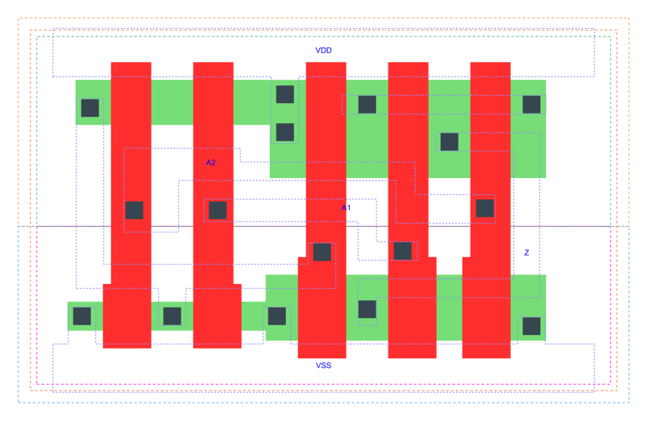

=======================================
gf180mcu_fd_sc_mcu7t5v0__xor2_x1
=======================================

**gf180mcu_fd_sc_mcu7t5v0__xor2_x1 symbol**

.. image:: sc7_sym/XOR2_X1_sym.png
    :height: 250px
    :width: 400 px
    :align: center
    :alt: gf180mcu_fd_sc_mcu7t5v0__xor2_x1 symbol

**gf180mcu_fd_sc_mcu7t5v0__xor2_x1 schematic**

.. image:: sc7_sch/XOR2_X1_sch.png
    :height: 300px
    :width: 500 px
    :align: center
    :alt: gf180mcu_fd_sc_mcu7t5v0__xor2_x1 schematic

**gf180mcu_fd_sc_mcu7t5v0__xor2_x1 layout**

.. include:: images.rst

XOR2_X1 is a 2-input exclusive OR, 1X drive strength

|
| Attributes

============= ======================
**Attribute** **Value**
area          26.342400 µm\ :sup:`2`
============= ======================

|
| OUTPUT FUNCTIONS

============== ============
**Output Pin** **Function**
Z              (A1^A2)
============== ============

|
| TRUTH TABLE FOR Z

====== ====== =====
**A1** **A2** **Z**
1      0      1
0      1      1
1      1      0
0      0      0
====== ====== =====

|
| FUNCTIONAL SCHEMATIC
| |image677|
| PIN CAPACITANCE (pf)

======= ======== ====================
**Pin** **Type** **Capacitance (pf)**
A2      input    0.0075
A1      input    0.0075
======= ======== ====================

|
| DELAY AND OUTPUT TRANSITION TIME corresponding to min slew and load

+---------------+------------+--------------------+--------------+-------------------+----------------+---------------+
| **Input Pin** | **Output** | **When Condition** | **Tin (ns)** | **Out Load (pf)** | **Delay (ns)** | **Tout (ns)** |
+---------------+------------+--------------------+--------------+-------------------+----------------+---------------+
| A2(HL)        | Z(HL)      | !A1                | 0.0100       | 0.0010            | 0.3753         | 0.0902        |
+---------------+------------+--------------------+--------------+-------------------+----------------+---------------+
| A2(LH)        | Z(LH)      | !A1                | 0.0100       | 0.0010            | 0.2481         | 0.0905        |
+---------------+------------+--------------------+--------------+-------------------+----------------+---------------+
| A2(HL)        | Z(LH)      | A1                 | 0.0100       | 0.0010            | 0.1369         | 0.1151        |
+---------------+------------+--------------------+--------------+-------------------+----------------+---------------+
| A2(LH)        | Z(HL)      | A1                 | 0.0100       | 0.0010            | 0.0769         | 0.0389        |
+---------------+------------+--------------------+--------------+-------------------+----------------+---------------+
| A1(LH)        | Z(HL)      | A2                 | 0.0100       | 0.0010            | 0.0655         | 0.0389        |
+---------------+------------+--------------------+--------------+-------------------+----------------+---------------+
| A1(HL)        | Z(LH)      | A2                 | 0.0100       | 0.0010            | 0.1055         | 0.0847        |
+---------------+------------+--------------------+--------------+-------------------+----------------+---------------+
| A1(LH)        | Z(LH)      | !A2                | 0.0100       | 0.0010            | 0.3016         | 0.1182        |
+---------------+------------+--------------------+--------------+-------------------+----------------+---------------+
| A1(HL)        | Z(HL)      | !A2                | 0.0100       | 0.0010            | 0.4031         | 0.0897        |
+---------------+------------+--------------------+--------------+-------------------+----------------+---------------+

|
| DYNAMIC ENERGY

+---------------+--------------------+--------------+------------+-------------------+---------------------+
| **Input Pin** | **When Condition** | **Tin (ns)** | **Output** | **Out Load (pf)** | **Energy (uW/MHz)** |
+---------------+--------------------+--------------+------------+-------------------+---------------------+
| A2            | !A1                | 0.0100       | Z(HL)      | 0.0010            | 0.2922              |
+---------------+--------------------+--------------+------------+-------------------+---------------------+
| A2            | A1                 | 0.0100       | Z(HL)      | 0.0010            | -0.0010             |
+---------------+--------------------+--------------+------------+-------------------+---------------------+
| A1            | A2                 | 0.0100       | Z(HL)      | 0.0010            | -0.0109             |
+---------------+--------------------+--------------+------------+-------------------+---------------------+
| A1            | !A2                | 0.0100       | Z(HL)      | 0.0010            | 0.3092              |
+---------------+--------------------+--------------+------------+-------------------+---------------------+
| A2            | !A1                | 0.0100       | Z(LH)      | 0.0010            | 0.1582              |
+---------------+--------------------+--------------+------------+-------------------+---------------------+
| A2            | A1                 | 0.0100       | Z(LH)      | 0.0010            | 0.1766              |
+---------------+--------------------+--------------+------------+-------------------+---------------------+
| A1            | A2                 | 0.0100       | Z(LH)      | 0.0010            | 0.1445              |
+---------------+--------------------+--------------+------------+-------------------+---------------------+
| A1            | !A2                | 0.0100       | Z(LH)      | 0.0010            | 0.2110              |
+---------------+--------------------+--------------+------------+-------------------+---------------------+

|
| LEAKAGE POWER

================== ==============
**When Condition** **Power (nW)**
!A1&!A2            0.2104
A1&A2              0.1291
!A1&A2             0.1270
A1&!A2             0.2029
================== ==============

