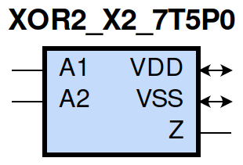
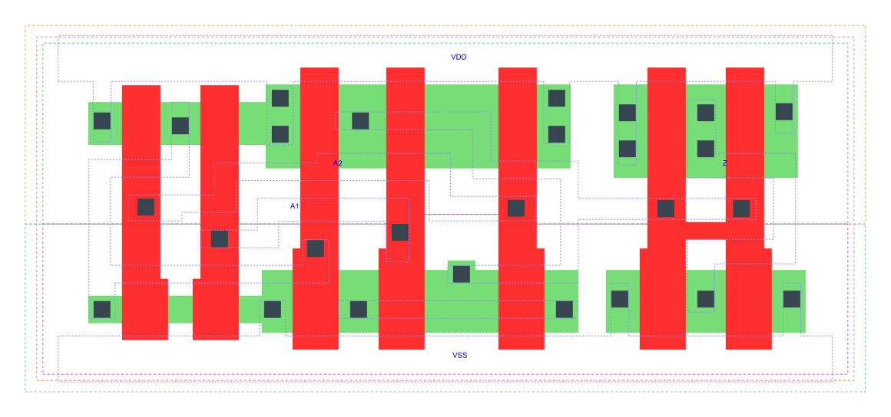

=======================================
gf180mcu_fd_sc_mcu7t5v0__xor2_x2
=======================================

**gf180mcu_fd_sc_mcu7t5v0__xor2_x2 symbol**

**gf180mcu_fd_sc_mcu7t5v0__xor2_x2 schematic**

.. image:: sc7_sch/XOR2_X2_sch.png
    :height: 300px
    :width: 500 px
    :align: center
    :alt: gf180mcu_fd_sc_mcu7t5v0__xor2_x2 schematic

**gf180mcu_fd_sc_mcu7t5v0__xor2_x2 layout**

.. include:: images.rst

XOR2_X2 is a 2-input exclusive OR, 2X drive strength

|
| Attributes

============= ======================
**Attribute** **Value**
area          39.513600 µm\ :sup:`2`
============= ======================

|
| OUTPUT FUNCTIONS

============== ============
**Output Pin** **Function**
Z              (A1^A2)
============== ============

|
| TRUTH TABLE FOR Z

====== ====== =====
**A1** **A2** **Z**
1      0      1
0      1      1
1      1      0
0      0      0
====== ====== =====

|
| FUNCTIONAL SCHEMATIC
| |image680|
| PIN CAPACITANCE (pf)

======= ======== ====================
**Pin** **Type** **Capacitance (pf)**
A2      input    0.0073
A1      input    0.0072
======= ======== ====================

|
| DELAY AND OUTPUT TRANSITION TIME corresponding to min slew and load

+---------------+------------+--------------------+--------------+-------------------+----------------+---------------+
| **Input Pin** | **Output** | **When Condition** | **Tin (ns)** | **Out Load (pf)** | **Delay (ns)** | **Tout (ns)** |
+---------------+------------+--------------------+--------------+-------------------+----------------+---------------+
| A2(HL)        | Z(HL)      | !A1                | 0.0100       | 0.0010            | 0.3279         | 0.0509        |
+---------------+------------+--------------------+--------------+-------------------+----------------+---------------+
| A2(LH)        | Z(LH)      | !A1                | 0.0100       | 0.0010            | 0.2313         | 0.0397        |
+---------------+------------+--------------------+--------------+-------------------+----------------+---------------+
| A2(HL)        | Z(LH)      | A1                 | 0.0100       | 0.0010            | 0.3913         | 0.0387        |
+---------------+------------+--------------------+--------------+-------------------+----------------+---------------+
| A2(LH)        | Z(HL)      | A1                 | 0.0100       | 0.0010            | 0.4186         | 0.0422        |
+---------------+------------+--------------------+--------------+-------------------+----------------+---------------+
| A1(LH)        | Z(HL)      | A2                 | 0.0100       | 0.0010            | 0.4310         | 0.0422        |
+---------------+------------+--------------------+--------------+-------------------+----------------+---------------+
| A1(HL)        | Z(LH)      | A2                 | 0.0100       | 0.0010            | 0.4353         | 0.0403        |
+---------------+------------+--------------------+--------------+-------------------+----------------+---------------+
| A1(LH)        | Z(LH)      | !A2                | 0.0100       | 0.0010            | 0.2008         | 0.0378        |
+---------------+------------+--------------------+--------------+-------------------+----------------+---------------+
| A1(HL)        | Z(HL)      | !A2                | 0.0100       | 0.0010            | 0.2967         | 0.0511        |
+---------------+------------+--------------------+--------------+-------------------+----------------+---------------+

|
| DYNAMIC ENERGY

+---------------+--------------------+--------------+------------+-------------------+---------------------+
| **Input Pin** | **When Condition** | **Tin (ns)** | **Output** | **Out Load (pf)** | **Energy (uW/MHz)** |
+---------------+--------------------+--------------+------------+-------------------+---------------------+
| A2            | !A1                | 0.0100       | Z(HL)      | 0.0010            | 0.4901              |
+---------------+--------------------+--------------+------------+-------------------+---------------------+
| A2            | A1                 | 0.0100       | Z(HL)      | 0.0010            | 0.4775              |
+---------------+--------------------+--------------+------------+-------------------+---------------------+
| A1            | A2                 | 0.0100       | Z(HL)      | 0.0010            | 0.5002              |
+---------------+--------------------+--------------+------------+-------------------+---------------------+
| A1            | !A2                | 0.0100       | Z(HL)      | 0.0010            | 0.4622              |
+---------------+--------------------+--------------+------------+-------------------+---------------------+
| A2            | !A1                | 0.0100       | Z(LH)      | 0.0010            | 0.2543              |
+---------------+--------------------+--------------+------------+-------------------+---------------------+
| A2            | A1                 | 0.0100       | Z(LH)      | 0.0010            | 0.4423              |
+---------------+--------------------+--------------+------------+-------------------+---------------------+
| A1            | A2                 | 0.0100       | Z(LH)      | 0.0010            | 0.4916              |
+---------------+--------------------+--------------+------------+-------------------+---------------------+
| A1            | !A2                | 0.0100       | Z(LH)      | 0.0010            | 0.2097              |
+---------------+--------------------+--------------+------------+-------------------+---------------------+

|
| LEAKAGE POWER

================== ==============
**When Condition** **Power (nW)**
!A1&!A2            0.1795
A1&A2              0.2657
!A1&A2             0.2572
A1&!A2             0.1813
================== ==============

