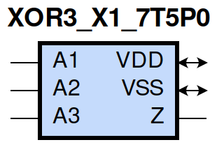
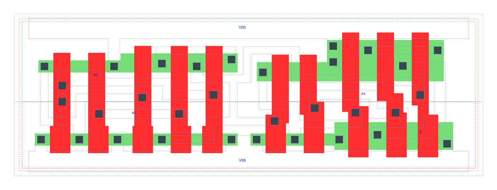

=======================================
gf180mcu_fd_sc_mcu7t5v0__xor3_x1
=======================================

**gf180mcu_fd_sc_mcu7t5v0__xor3_x1 symbol**

**gf180mcu_fd_sc_mcu7t5v0__xor3_x1 schematic**

.. image:: sc7_sch/XOR3_X1_sch.png
    :height: 300px
    :width: 500 px
    :align: center
    :alt: gf180mcu_fd_sc_mcu7t5v0__xor3_x1 schematic

**gf180mcu_fd_sc_mcu7t5v0__xor3_x1 layout**

.. include:: images.rst

XOR3_X1 is a 3-input exclusive OR, 1X drive strength

|
| Attributes

============= ======================
**Attribute** **Value**
area          50.489600 µm\ :sup:`2`
============= ======================

|
| OUTPUT FUNCTIONS

============== ============
**Output Pin** **Function**
Z              (A1^A2^A3)
============== ============

|
| TRUTH TABLE FOR Z

====== ====== ====== =====
**A1** **A2** **A3** **Z**
1      1      1      1
1      0      0      1
0      1      0      1
0      0      1      1
1      1      0      0
1      0      1      0
0      1      1      0
0      0      0      0
====== ====== ====== =====

|
| FUNCTIONAL SCHEMATIC
| |image686|
| PIN CAPACITANCE (pf)

======= ======== ====================
**Pin** **Type** **Capacitance (pf)**
A2      input    0.0053
A1      input    0.0049
A3      input    0.0075
======= ======== ====================

|
| DELAY AND OUTPUT TRANSITION TIME corresponding to min slew and load

+---------------+------------+--------------------+--------------+-------------------+----------------+---------------+
| **Input Pin** | **Output** | **When Condition** | **Tin (ns)** | **Out Load (pf)** | **Delay (ns)** | **Tout (ns)** |
+---------------+------------+--------------------+--------------+-------------------+----------------+---------------+
| A2(HL)        | Z(HL)      | !A1&!A3            | 0.0100       | 0.0010            | 0.9745         | 0.0905        |
+---------------+------------+--------------------+--------------+-------------------+----------------+---------------+
| A2(HL)        | Z(HL)      | A1&A3              | 0.0100       | 0.0010            | 0.4799         | 0.1010        |
+---------------+------------+--------------------+--------------+-------------------+----------------+---------------+
| A2(LH)        | Z(LH)      | !A1&!A3            | 0.0100       | 0.0010            | 0.7968         | 0.0944        |
+---------------+------------+--------------------+--------------+-------------------+----------------+---------------+
| A2(LH)        | Z(LH)      | A1&A3              | 0.0100       | 0.0010            | 0.4223         | 0.1263        |
+---------------+------------+--------------------+--------------+-------------------+----------------+---------------+
| A2(HL)        | Z(LH)      | !A1&A3             | 0.0100       | 0.0010            | 0.7333         | 0.1211        |
+---------------+------------+--------------------+--------------+-------------------+----------------+---------------+
| A2(HL)        | Z(LH)      | A1&!A3             | 0.0100       | 0.0010            | 0.6894         | 0.0948        |
+---------------+------------+--------------------+--------------+-------------------+----------------+---------------+
| A2(LH)        | Z(HL)      | !A1&A3             | 0.0100       | 0.0010            | 0.5910         | 0.0956        |
+---------------+------------+--------------------+--------------+-------------------+----------------+---------------+
| A2(LH)        | Z(HL)      | A1&!A3             | 0.0100       | 0.0010            | 0.6702         | 0.0917        |
+---------------+------------+--------------------+--------------+-------------------+----------------+---------------+
| A1(LH)        | Z(HL)      | !A2&A3             | 0.0100       | 0.0010            | 0.6252         | 0.1011        |
+---------------+------------+--------------------+--------------+-------------------+----------------+---------------+
| A1(LH)        | Z(HL)      | A2&!A3             | 0.0100       | 0.0010            | 0.6591         | 0.0917        |
+---------------+------------+--------------------+--------------+-------------------+----------------+---------------+
| A1(HL)        | Z(LH)      | !A2&A3             | 0.0100       | 0.0010            | 0.7628         | 0.1211        |
+---------------+------------+--------------------+--------------+-------------------+----------------+---------------+
| A1(HL)        | Z(LH)      | A2&!A3             | 0.0100       | 0.0010            | 0.6611         | 0.0943        |
+---------------+------------+--------------------+--------------+-------------------+----------------+---------------+
| A1(LH)        | Z(LH)      | !A2&!A3            | 0.0100       | 0.0010            | 0.8353         | 0.0948        |
+---------------+------------+--------------------+--------------+-------------------+----------------+---------------+
| A1(LH)        | Z(LH)      | A2&A3              | 0.0100       | 0.0010            | 0.4112         | 0.1264        |
+---------------+------------+--------------------+--------------+-------------------+----------------+---------------+
| A1(HL)        | Z(HL)      | !A2&!A3            | 0.0100       | 0.0010            | 1.0041         | 0.0905        |
+---------------+------------+--------------------+--------------+-------------------+----------------+---------------+
| A1(HL)        | Z(HL)      | A2&A3              | 0.0100       | 0.0010            | 0.4549         | 0.0955        |
+---------------+------------+--------------------+--------------+-------------------+----------------+---------------+
| A3(LH)        | Z(LH)      | !A1&!A2            | 0.0100       | 0.0010            | 0.3012         | 0.1193        |
+---------------+------------+--------------------+--------------+-------------------+----------------+---------------+
| A3(LH)        | Z(LH)      | A1&A2              | 0.0100       | 0.0010            | 0.3012         | 0.1197        |
+---------------+------------+--------------------+--------------+-------------------+----------------+---------------+
| A3(HL)        | Z(LH)      | !A1&A2             | 0.0100       | 0.0010            | 0.1066         | 0.0857        |
+---------------+------------+--------------------+--------------+-------------------+----------------+---------------+
| A3(HL)        | Z(LH)      | A1&!A2             | 0.0100       | 0.0010            | 0.1066         | 0.0857        |
+---------------+------------+--------------------+--------------+-------------------+----------------+---------------+
| A3(HL)        | Z(HL)      | !A1&!A2            | 0.0100       | 0.0010            | 0.3957         | 0.0895        |
+---------------+------------+--------------------+--------------+-------------------+----------------+---------------+
| A3(HL)        | Z(HL)      | A1&A2              | 0.0100       | 0.0010            | 0.3959         | 0.0901        |
+---------------+------------+--------------------+--------------+-------------------+----------------+---------------+
| A3(LH)        | Z(HL)      | !A1&A2             | 0.0100       | 0.0010            | 0.0658         | 0.0392        |
+---------------+------------+--------------------+--------------+-------------------+----------------+---------------+
| A3(LH)        | Z(HL)      | A1&!A2             | 0.0100       | 0.0010            | 0.0658         | 0.0392        |
+---------------+------------+--------------------+--------------+-------------------+----------------+---------------+

|
| DYNAMIC ENERGY

+---------------+--------------------+--------------+------------+-------------------+---------------------+
| **Input Pin** | **When Condition** | **Tin (ns)** | **Output** | **Out Load (pf)** | **Energy (uW/MHz)** |
+---------------+--------------------+--------------+------------+-------------------+---------------------+
| A3            | !A1&!A2            | 0.0100       | Z(LH)      | 0.0010            | 0.2100              |
+---------------+--------------------+--------------+------------+-------------------+---------------------+
| A3            | A1&A2              | 0.0100       | Z(LH)      | 0.0010            | 0.2101              |
+---------------+--------------------+--------------+------------+-------------------+---------------------+
| A3            | !A1&A2             | 0.0100       | Z(LH)      | 0.0010            | 0.1414              |
+---------------+--------------------+--------------+------------+-------------------+---------------------+
| A3            | A1&!A2             | 0.0100       | Z(LH)      | 0.0010            | 0.1414              |
+---------------+--------------------+--------------+------------+-------------------+---------------------+
| A2            | !A1&!A3            | 0.0100       | Z(HL)      | 0.0010            | 0.4736              |
+---------------+--------------------+--------------+------------+-------------------+---------------------+
| A2            | A1&A3              | 0.0100       | Z(HL)      | 0.0010            | 0.3519              |
+---------------+--------------------+--------------+------------+-------------------+---------------------+
| A2            | !A1&A3             | 0.0100       | Z(HL)      | 0.0010            | 0.3439              |
+---------------+--------------------+--------------+------------+-------------------+---------------------+
| A2            | A1&!A3             | 0.0100       | Z(HL)      | 0.0010            | 0.2975              |
+---------------+--------------------+--------------+------------+-------------------+---------------------+
| A1            | !A2&A3             | 0.0100       | Z(HL)      | 0.0010            | 0.3749              |
+---------------+--------------------+--------------+------------+-------------------+---------------------+
| A1            | A2&!A3             | 0.0100       | Z(HL)      | 0.0010            | 0.2908              |
+---------------+--------------------+--------------+------------+-------------------+---------------------+
| A1            | !A2&!A3            | 0.0100       | Z(HL)      | 0.0010            | 0.4840              |
+---------------+--------------------+--------------+------------+-------------------+---------------------+
| A1            | A2&A3              | 0.0100       | Z(HL)      | 0.0010            | 0.3312              |
+---------------+--------------------+--------------+------------+-------------------+---------------------+
| A2            | !A1&!A3            | 0.0100       | Z(LH)      | 0.0010            | 0.4533              |
+---------------+--------------------+--------------+------------+-------------------+---------------------+
| A2            | A1&A3              | 0.0100       | Z(LH)      | 0.0010            | 0.1961              |
+---------------+--------------------+--------------+------------+-------------------+---------------------+
| A2            | !A1&A3             | 0.0100       | Z(LH)      | 0.0010            | 0.3744              |
+---------------+--------------------+--------------+------------+-------------------+---------------------+
| A2            | A1&!A3             | 0.0100       | Z(LH)      | 0.0010            | 0.4584              |
+---------------+--------------------+--------------+------------+-------------------+---------------------+
| A1            | !A2&A3             | 0.0100       | Z(LH)      | 0.0010            | 0.3849              |
+---------------+--------------------+--------------+------------+-------------------+---------------------+
| A1            | A2&!A3             | 0.0100       | Z(LH)      | 0.0010            | 0.4404              |
+---------------+--------------------+--------------+------------+-------------------+---------------------+
| A1            | !A2&!A3            | 0.0100       | Z(LH)      | 0.0010            | 0.4814              |
+---------------+--------------------+--------------+------------+-------------------+---------------------+
| A1            | A2&A3              | 0.0100       | Z(LH)      | 0.0010            | 0.1894              |
+---------------+--------------------+--------------+------------+-------------------+---------------------+
| A3            | !A1&!A2            | 0.0100       | Z(HL)      | 0.0010            | 0.3048              |
+---------------+--------------------+--------------+------------+-------------------+---------------------+
| A3            | A1&A2              | 0.0100       | Z(HL)      | 0.0010            | 0.3048              |
+---------------+--------------------+--------------+------------+-------------------+---------------------+
| A3            | !A1&A2             | 0.0100       | Z(HL)      | 0.0010            | -0.0066             |
+---------------+--------------------+--------------+------------+-------------------+---------------------+
| A3            | A1&!A2             | 0.0100       | Z(HL)      | 0.0010            | -0.0066             |
+---------------+--------------------+--------------+------------+-------------------+---------------------+

|
| LEAKAGE POWER

================== ==============
**When Condition** **Power (nW)**
!A1&!A2&!A3        0.3710
!A1&A2&A3          0.2102
A1&!A2&A3          0.2867
A1&A2&!A3          0.2886
!A1&!A2&A3         0.3635
!A1&A2&!A3         0.2081
A1&!A2&!A3         0.2846
A1&A2&A3           0.2811
================== ==============

