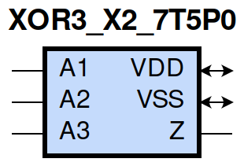
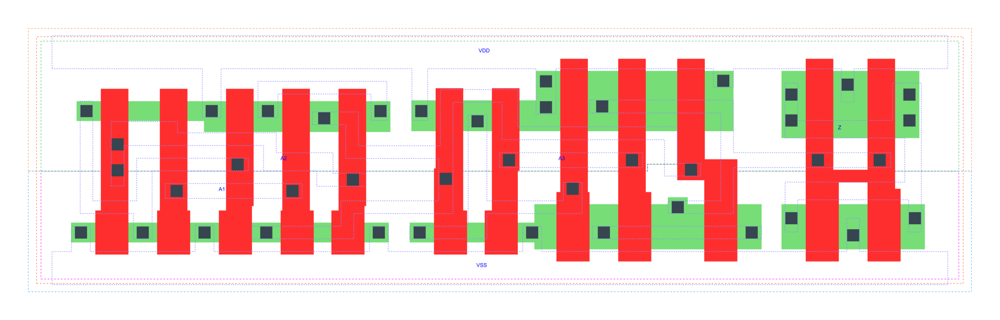

=======================================
gf180mcu_fd_sc_mcu7t5v0__xor3_x2
=======================================

**gf180mcu_fd_sc_mcu7t5v0__xor3_x2 symbol**

**gf180mcu_fd_sc_mcu7t5v0__xor3_x2 schematic**

.. image:: sc7_sch/XOR3_X2_sch.png
    :height: 300px
    :width: 500 px
    :align: center
    :alt: gf180mcu_fd_sc_mcu7t5v0__xor3_x2 schematic

**gf180mcu_fd_sc_mcu7t5v0__xor3_x2 layout**

.. include:: images.rst

XOR3_X2 is a 3-input exclusive OR, 2X drive strength

|
| Attributes

============= ======================
**Attribute** **Value**
area          63.660800 µm\ :sup:`2`
============= ======================

|
| OUTPUT FUNCTIONS

============== ============
**Output Pin** **Function**
Z              (A1^A2^A3)
============== ============

|
| TRUTH TABLE FOR Z

====== ====== ====== =====
**A1** **A2** **A3** **Z**
1      1      1      1
1      0      0      1
0      1      0      1
0      0      1      1
1      1      0      0
1      0      1      0
0      1      1      0
0      0      0      0
====== ====== ====== =====

|
| FUNCTIONAL SCHEMATIC
| |image689|
| PIN CAPACITANCE (pf)

======= ======== ====================
**Pin** **Type** **Capacitance (pf)**
A2      input    0.0052
A1      input    0.0048
A3      input    0.0069
======= ======== ====================

|
| DELAY AND OUTPUT TRANSITION TIME corresponding to min slew and load

+---------------+------------+--------------------+--------------+-------------------+----------------+---------------+
| **Input Pin** | **Output** | **When Condition** | **Tin (ns)** | **Out Load (pf)** | **Delay (ns)** | **Tout (ns)** |
+---------------+------------+--------------------+--------------+-------------------+----------------+---------------+
| A2(HL)        | Z(HL)      | !A1&!A3            | 0.0100       | 0.0010            | 0.8916         | 0.0576        |
+---------------+------------+--------------------+--------------+-------------------+----------------+---------------+
| A2(HL)        | Z(HL)      | A1&A3              | 0.0100       | 0.0010            | 0.9310         | 0.0472        |
+---------------+------------+--------------------+--------------+-------------------+----------------+---------------+
| A2(LH)        | Z(LH)      | !A1&!A3            | 0.0100       | 0.0010            | 0.8376         | 0.0513        |
+---------------+------------+--------------------+--------------+-------------------+----------------+---------------+
| A2(LH)        | Z(LH)      | A1&A3              | 0.0100       | 0.0010            | 0.6710         | 0.0457        |
+---------------+------------+--------------------+--------------+-------------------+----------------+---------------+
| A2(HL)        | Z(LH)      | !A1&A3             | 0.0100       | 0.0010            | 0.9842         | 0.0457        |
+---------------+------------+--------------------+--------------+-------------------+----------------+---------------+
| A2(HL)        | Z(LH)      | A1&!A3             | 0.0100       | 0.0010            | 0.7345         | 0.0517        |
+---------------+------------+--------------------+--------------+-------------------+----------------+---------------+
| A2(LH)        | Z(HL)      | !A1&A3             | 0.0100       | 0.0010            | 1.0339         | 0.0472        |
+---------------+------------+--------------------+--------------+-------------------+----------------+---------------+
| A2(LH)        | Z(HL)      | A1&!A3             | 0.0100       | 0.0010            | 0.5782         | 0.0584        |
+---------------+------------+--------------------+--------------+-------------------+----------------+---------------+
| A1(LH)        | Z(HL)      | !A2&A3             | 0.0100       | 0.0010            | 1.0768         | 0.0475        |
+---------------+------------+--------------------+--------------+-------------------+----------------+---------------+
| A1(LH)        | Z(HL)      | A2&!A3             | 0.0100       | 0.0010            | 0.5670         | 0.0584        |
+---------------+------------+--------------------+--------------+-------------------+----------------+---------------+
| A1(HL)        | Z(LH)      | !A2&A3             | 0.0100       | 0.0010            | 1.0147         | 0.0457        |
+---------------+------------+--------------------+--------------+-------------------+----------------+---------------+
| A1(HL)        | Z(LH)      | A2&!A3             | 0.0100       | 0.0010            | 0.7010         | 0.0511        |
+---------------+------------+--------------------+--------------+-------------------+----------------+---------------+
| A1(LH)        | Z(LH)      | !A2&!A3            | 0.0100       | 0.0010            | 0.8804         | 0.0520        |
+---------------+------------+--------------------+--------------+-------------------+----------------+---------------+
| A1(LH)        | Z(LH)      | A2&A3              | 0.0100       | 0.0010            | 0.6598         | 0.0457        |
+---------------+------------+--------------------+--------------+-------------------+----------------+---------------+
| A1(HL)        | Z(HL)      | !A2&!A3            | 0.0100       | 0.0010            | 0.9220         | 0.0577        |
+---------------+------------+--------------------+--------------+-------------------+----------------+---------------+
| A1(HL)        | Z(HL)      | A2&A3              | 0.0100       | 0.0010            | 0.8972         | 0.0471        |
+---------------+------------+--------------------+--------------+-------------------+----------------+---------------+
| A3(LH)        | Z(LH)      | !A1&!A2            | 0.0100       | 0.0010            | 0.2106         | 0.0446        |
+---------------+------------+--------------------+--------------+-------------------+----------------+---------------+
| A3(LH)        | Z(LH)      | A1&A2              | 0.0100       | 0.0010            | 0.2106         | 0.0446        |
+---------------+------------+--------------------+--------------+-------------------+----------------+---------------+
| A3(HL)        | Z(LH)      | !A1&A2             | 0.0100       | 0.0010            | 0.4393         | 0.0471        |
+---------------+------------+--------------------+--------------+-------------------+----------------+---------------+
| A3(HL)        | Z(LH)      | A1&!A2             | 0.0100       | 0.0010            | 0.4392         | 0.0472        |
+---------------+------------+--------------------+--------------+-------------------+----------------+---------------+
| A3(HL)        | Z(HL)      | !A1&!A2            | 0.0100       | 0.0010            | 0.3086         | 0.0573        |
+---------------+------------+--------------------+--------------+-------------------+----------------+---------------+
| A3(HL)        | Z(HL)      | A1&A2              | 0.0100       | 0.0010            | 0.3084         | 0.0572        |
+---------------+------------+--------------------+--------------+-------------------+----------------+---------------+
| A3(LH)        | Z(HL)      | !A1&A2             | 0.0100       | 0.0010            | 0.4390         | 0.0473        |
+---------------+------------+--------------------+--------------+-------------------+----------------+---------------+
| A3(LH)        | Z(HL)      | A1&!A2             | 0.0100       | 0.0010            | 0.4389         | 0.0474        |
+---------------+------------+--------------------+--------------+-------------------+----------------+---------------+

|
| DYNAMIC ENERGY

+---------------+--------------------+--------------+------------+-------------------+---------------------+
| **Input Pin** | **When Condition** | **Tin (ns)** | **Output** | **Out Load (pf)** | **Energy (uW/MHz)** |
+---------------+--------------------+--------------+------------+-------------------+---------------------+
| A3            | !A1&!A2            | 0.0100       | Z(LH)      | 0.0010            | 0.2308              |
+---------------+--------------------+--------------+------------+-------------------+---------------------+
| A3            | A1&A2              | 0.0100       | Z(LH)      | 0.0010            | 0.2308              |
+---------------+--------------------+--------------+------------+-------------------+---------------------+
| A3            | !A1&A2             | 0.0100       | Z(LH)      | 0.0010            | 0.5173              |
+---------------+--------------------+--------------+------------+-------------------+---------------------+
| A3            | A1&!A2             | 0.0100       | Z(LH)      | 0.0010            | 0.5170              |
+---------------+--------------------+--------------+------------+-------------------+---------------------+
| A2            | !A1&!A3            | 0.0100       | Z(HL)      | 0.0010            | 0.6800              |
+---------------+--------------------+--------------+------------+-------------------+---------------------+
| A2            | A1&A3              | 0.0100       | Z(HL)      | 0.0010            | 0.7795              |
+---------------+--------------------+--------------+------------+-------------------+---------------------+
| A2            | !A1&A3             | 0.0100       | Z(HL)      | 0.0010            | 0.7736              |
+---------------+--------------------+--------------+------------+-------------------+---------------------+
| A2            | A1&!A3             | 0.0100       | Z(HL)      | 0.0010            | 0.5064              |
+---------------+--------------------+--------------+------------+-------------------+---------------------+
| A1            | !A2&A3             | 0.0100       | Z(HL)      | 0.0010            | 0.8031              |
+---------------+--------------------+--------------+------------+-------------------+---------------------+
| A1            | A2&!A3             | 0.0100       | Z(HL)      | 0.0010            | 0.4997              |
+---------------+--------------------+--------------+------------+-------------------+---------------------+
| A1            | !A2&!A3            | 0.0100       | Z(HL)      | 0.0010            | 0.6908              |
+---------------+--------------------+--------------+------------+-------------------+---------------------+
| A1            | A2&A3              | 0.0100       | Z(HL)      | 0.0010            | 0.7604              |
+---------------+--------------------+--------------+------------+-------------------+---------------------+
| A2            | !A1&!A3            | 0.0100       | Z(LH)      | 0.0010            | 0.6270              |
+---------------+--------------------+--------------+------------+-------------------+---------------------+
| A2            | A1&A3              | 0.0100       | Z(LH)      | 0.0010            | 0.4724              |
+---------------+--------------------+--------------+------------+-------------------+---------------------+
| A2            | !A1&A3             | 0.0100       | Z(LH)      | 0.0010            | 0.6490              |
+---------------+--------------------+--------------+------------+-------------------+---------------------+
| A2            | A1&!A3             | 0.0100       | Z(LH)      | 0.0010            | 0.6390              |
+---------------+--------------------+--------------+------------+-------------------+---------------------+
| A1            | !A2&A3             | 0.0100       | Z(LH)      | 0.0010            | 0.6596              |
+---------------+--------------------+--------------+------------+-------------------+---------------------+
| A1            | A2&!A3             | 0.0100       | Z(LH)      | 0.0010            | 0.6141              |
+---------------+--------------------+--------------+------------+-------------------+---------------------+
| A1            | !A2&!A3            | 0.0100       | Z(LH)      | 0.0010            | 0.6624              |
+---------------+--------------------+--------------+------------+-------------------+---------------------+
| A1            | A2&A3              | 0.0100       | Z(LH)      | 0.0010            | 0.4656              |
+---------------+--------------------+--------------+------------+-------------------+---------------------+
| A3            | !A1&!A2            | 0.0100       | Z(HL)      | 0.0010            | 0.4674              |
+---------------+--------------------+--------------+------------+-------------------+---------------------+
| A3            | A1&A2              | 0.0100       | Z(HL)      | 0.0010            | 0.4674              |
+---------------+--------------------+--------------+------------+-------------------+---------------------+
| A3            | !A1&A2             | 0.0100       | Z(HL)      | 0.0010            | 0.4926              |
+---------------+--------------------+--------------+------------+-------------------+---------------------+
| A3            | A1&!A2             | 0.0100       | Z(HL)      | 0.0010            | 0.4927              |
+---------------+--------------------+--------------+------------+-------------------+---------------------+

|
| LEAKAGE POWER

================== ==============
**When Condition** **Power (nW)**
!A1&!A2&!A3        0.3401
!A1&A2&A3          0.3468
A1&!A2&A3          0.4232
A1&A2&!A3          0.2576
!A1&!A2&A3         0.3419
!A1&A2&!A3         0.3383
A1&!A2&!A3         0.4148
A1&A2&A3           0.2595
================== ==============

