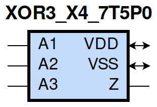
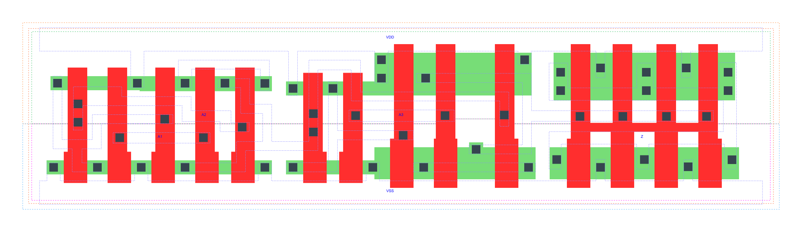

=======================================
gf180mcu_fd_sc_mcu7t5v0__xor3_x4
=======================================

**gf180mcu_fd_sc_mcu7t5v0__xor3_x4 symbol**

**gf180mcu_fd_sc_mcu7t5v0__xor3_x4 schematic**

.. image:: sc7_sch/XOR3_X4_sch.png
    :height: 300px
    :width: 500 px
    :align: center
    :alt: gf180mcu_fd_sc_mcu7t5v0__xor3_x4 schematic

**gf180mcu_fd_sc_mcu7t5v0__xor3_x4 layout**

.. include:: images.rst

XOR3_X4 is a 3-input exclusive OR, 4X drive strength

|
| Attributes

============= ======================
**Attribute** **Value**
area          72.441600 µm\ :sup:`2`
============= ======================

|
| OUTPUT FUNCTIONS

============== ============
**Output Pin** **Function**
Z              (A1^A2^A3)
============== ============

|
| TRUTH TABLE FOR Z

====== ====== ====== =====
**A1** **A2** **A3** **Z**
1      1      1      1
1      0      0      1
0      1      0      1
0      0      1      1
1      1      0      0
1      0      1      0
0      1      1      0
0      0      0      0
====== ====== ====== =====

|
| FUNCTIONAL SCHEMATIC
| |image692|
| PIN CAPACITANCE (pf)

======= ======== ====================
**Pin** **Type** **Capacitance (pf)**
A2      input    0.0049
A1      input    0.0046
A3      input    0.0068
======= ======== ====================

|
| DELAY AND OUTPUT TRANSITION TIME corresponding to min slew and load

+---------------+------------+--------------------+--------------+-------------------+----------------+---------------+
| **Input Pin** | **Output** | **When Condition** | **Tin (ns)** | **Out Load (pf)** | **Delay (ns)** | **Tout (ns)** |
+---------------+------------+--------------------+--------------+-------------------+----------------+---------------+
| A2(HL)        | Z(HL)      | !A1&!A3            | 0.0100       | 0.0010            | 0.9860         | 0.0769        |
+---------------+------------+--------------------+--------------+-------------------+----------------+---------------+
| A2(HL)        | Z(HL)      | A1&A3              | 0.0100       | 0.0010            | 1.1225         | 0.0573        |
+---------------+------------+--------------------+--------------+-------------------+----------------+---------------+
| A2(LH)        | Z(LH)      | !A1&!A3            | 0.0100       | 0.0010            | 1.1069         | 0.0603        |
+---------------+------------+--------------------+--------------+-------------------+----------------+---------------+
| A2(LH)        | Z(LH)      | A1&A3              | 0.0100       | 0.0010            | 0.8180         | 0.0525        |
+---------------+------------+--------------------+--------------+-------------------+----------------+---------------+
| A2(HL)        | Z(LH)      | !A1&A3             | 0.0100       | 0.0010            | 1.0978         | 0.0527        |
+---------------+------------+--------------------+--------------+-------------------+----------------+---------------+
| A2(HL)        | Z(LH)      | A1&!A3             | 0.0100       | 0.0010            | 1.0096         | 0.0607        |
+---------------+------------+--------------------+--------------+-------------------+----------------+---------------+
| A2(LH)        | Z(HL)      | !A1&A3             | 0.0100       | 0.0010            | 1.2259         | 0.0572        |
+---------------+------------+--------------------+--------------+-------------------+----------------+---------------+
| A2(LH)        | Z(HL)      | A1&!A3             | 0.0100       | 0.0010            | 0.7040         | 0.0771        |
+---------------+------------+--------------------+--------------+-------------------+----------------+---------------+
| A1(LH)        | Z(HL)      | !A2&A3             | 0.0100       | 0.0010            | 1.2773         | 0.0573        |
+---------------+------------+--------------------+--------------+-------------------+----------------+---------------+
| A1(LH)        | Z(HL)      | A2&!A3             | 0.0100       | 0.0010            | 0.6928         | 0.0772        |
+---------------+------------+--------------------+--------------+-------------------+----------------+---------------+
| A1(HL)        | Z(LH)      | !A2&A3             | 0.0100       | 0.0010            | 1.1269         | 0.0524        |
+---------------+------------+--------------------+--------------+-------------------+----------------+---------------+
| A1(HL)        | Z(LH)      | A2&!A3             | 0.0100       | 0.0010            | 0.9613         | 0.0600        |
+---------------+------------+--------------------+--------------+-------------------+----------------+---------------+
| A1(LH)        | Z(LH)      | !A2&!A3            | 0.0100       | 0.0010            | 1.1641         | 0.0607        |
+---------------+------------+--------------------+--------------+-------------------+----------------+---------------+
| A1(LH)        | Z(LH)      | A2&A3              | 0.0100       | 0.0010            | 0.8069         | 0.0525        |
+---------------+------------+--------------------+--------------+-------------------+----------------+---------------+
| A1(HL)        | Z(HL)      | !A2&!A3            | 0.0100       | 0.0010            | 1.0153         | 0.0766        |
+---------------+------------+--------------------+--------------+-------------------+----------------+---------------+
| A1(HL)        | Z(HL)      | A2&A3              | 0.0100       | 0.0010            | 1.0805         | 0.0572        |
+---------------+------------+--------------------+--------------+-------------------+----------------+---------------+
| A3(LH)        | Z(LH)      | !A1&!A2            | 0.0100       | 0.0010            | 0.2935         | 0.0514        |
+---------------+------------+--------------------+--------------+-------------------+----------------+---------------+
| A3(LH)        | Z(LH)      | A1&A2              | 0.0100       | 0.0010            | 0.2935         | 0.0514        |
+---------------+------------+--------------------+--------------+-------------------+----------------+---------------+
| A3(HL)        | Z(LH)      | !A1&A2             | 0.0100       | 0.0010            | 0.6084         | 0.0548        |
+---------------+------------+--------------------+--------------+-------------------+----------------+---------------+
| A3(HL)        | Z(LH)      | A1&!A2             | 0.0100       | 0.0010            | 0.6084         | 0.0548        |
+---------------+------------+--------------------+--------------+-------------------+----------------+---------------+
| A3(HL)        | Z(HL)      | !A1&!A2            | 0.0100       | 0.0010            | 0.4416         | 0.0765        |
+---------------+------------+--------------------+--------------+-------------------+----------------+---------------+
| A3(HL)        | Z(HL)      | A1&A2              | 0.0100       | 0.0010            | 0.4414         | 0.0767        |
+---------------+------------+--------------------+--------------+-------------------+----------------+---------------+
| A3(LH)        | Z(HL)      | !A1&A2             | 0.0100       | 0.0010            | 0.5011         | 0.0574        |
+---------------+------------+--------------------+--------------+-------------------+----------------+---------------+
| A3(LH)        | Z(HL)      | A1&!A2             | 0.0100       | 0.0010            | 0.5011         | 0.0574        |
+---------------+------------+--------------------+--------------+-------------------+----------------+---------------+

|
| DYNAMIC ENERGY

+---------------+--------------------+--------------+------------+-------------------+---------------------+
| **Input Pin** | **When Condition** | **Tin (ns)** | **Output** | **Out Load (pf)** | **Energy (uW/MHz)** |
+---------------+--------------------+--------------+------------+-------------------+---------------------+
| A3            | !A1&!A2            | 0.0100       | Z(LH)      | 0.0010            | 0.5632              |
+---------------+--------------------+--------------+------------+-------------------+---------------------+
| A3            | A1&A2              | 0.0100       | Z(LH)      | 0.0010            | 0.5624              |
+---------------+--------------------+--------------+------------+-------------------+---------------------+
| A3            | !A1&A2             | 0.0100       | Z(LH)      | 0.0010            | 0.8796              |
+---------------+--------------------+--------------+------------+-------------------+---------------------+
| A3            | A1&!A2             | 0.0100       | Z(LH)      | 0.0010            | 0.8796              |
+---------------+--------------------+--------------+------------+-------------------+---------------------+
| A2            | !A1&!A3            | 0.0100       | Z(HL)      | 0.0010            | 1.2010              |
+---------------+--------------------+--------------+------------+-------------------+---------------------+
| A2            | A1&A3              | 0.0100       | Z(HL)      | 0.0010            | 1.1647              |
+---------------+--------------------+--------------+------------+-------------------+---------------------+
| A2            | !A1&A3             | 0.0100       | Z(HL)      | 0.0010            | 1.1566              |
+---------------+--------------------+--------------+------------+-------------------+---------------------+
| A2            | A1&!A3             | 0.0100       | Z(HL)      | 0.0010            | 1.0490              |
+---------------+--------------------+--------------+------------+-------------------+---------------------+
| A1            | !A2&A3             | 0.0100       | Z(HL)      | 0.0010            | 1.1869              |
+---------------+--------------------+--------------+------------+-------------------+---------------------+
| A1            | A2&!A3             | 0.0100       | Z(HL)      | 0.0010            | 1.0422              |
+---------------+--------------------+--------------+------------+-------------------+---------------------+
| A1            | !A2&!A3            | 0.0100       | Z(HL)      | 0.0010            | 1.2113              |
+---------------+--------------------+--------------+------------+-------------------+---------------------+
| A1            | A2&A3              | 0.0100       | Z(HL)      | 0.0010            | 1.1447              |
+---------------+--------------------+--------------+------------+-------------------+---------------------+
| A2            | !A1&!A3            | 0.0100       | Z(LH)      | 0.0010            | 1.0588              |
+---------------+--------------------+--------------+------------+-------------------+---------------------+
| A2            | A1&A3              | 0.0100       | Z(LH)      | 0.0010            | 0.8013              |
+---------------+--------------------+--------------+------------+-------------------+---------------------+
| A2            | !A1&A3             | 0.0100       | Z(LH)      | 0.0010            | 0.9576              |
+---------------+--------------------+--------------+------------+-------------------+---------------------+
| A2            | A1&!A3             | 0.0100       | Z(LH)      | 0.0010            | 1.0823              |
+---------------+--------------------+--------------+------------+-------------------+---------------------+
| A1            | !A2&A3             | 0.0100       | Z(LH)      | 0.0010            | 0.9684              |
+---------------+--------------------+--------------+------------+-------------------+---------------------+
| A1            | A2&!A3             | 0.0100       | Z(LH)      | 0.0010            | 1.0460              |
+---------------+--------------------+--------------+------------+-------------------+---------------------+
| A1            | !A2&!A3            | 0.0100       | Z(LH)      | 0.0010            | 1.1039              |
+---------------+--------------------+--------------+------------+-------------------+---------------------+
| A1            | A2&A3              | 0.0100       | Z(LH)      | 0.0010            | 0.7948              |
+---------------+--------------------+--------------+------------+-------------------+---------------------+
| A3            | !A1&!A2            | 0.0100       | Z(HL)      | 0.0010            | 1.0136              |
+---------------+--------------------+--------------+------------+-------------------+---------------------+
| A3            | A1&A2              | 0.0100       | Z(HL)      | 0.0010            | 1.0137              |
+---------------+--------------------+--------------+------------+-------------------+---------------------+
| A3            | !A1&A2             | 0.0100       | Z(HL)      | 0.0010            | 0.8828              |
+---------------+--------------------+--------------+------------+-------------------+---------------------+
| A3            | A1&!A2             | 0.0100       | Z(HL)      | 0.0010            | 0.8828              |
+---------------+--------------------+--------------+------------+-------------------+---------------------+

|
| LEAKAGE POWER

================== ==============
**When Condition** **Power (nW)**
!A1&!A2&!A3        0.3932
!A1&A2&A3          0.3995
A1&!A2&A3          0.4759
A1&A2&!A3          0.3104
!A1&!A2&A3         0.3929
!A1&A2&!A3         0.3892
A1&!A2&!A3         0.4657
A1&A2&A3           0.3101
================== ==============

