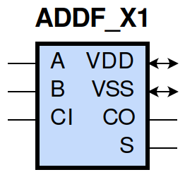
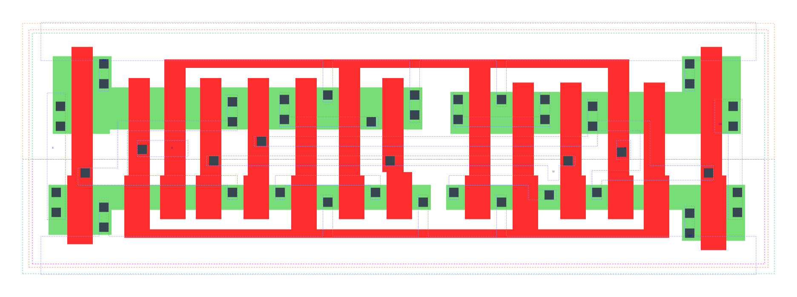

====================================
gf180mcu_fd_sc_mcu9t5v0__addf_x1
====================================

**gf180mcu_fd_sc_mcu9t5v0__addf_x1 symbol**

**gf180mcu_fd_sc_mcu9t5v0__addf_x1 schematic**

.. image:: sc9_sch/ADDF_X1_sch.png
    :height: 250px
    :width: 450 px
    :align: center
    :alt: gf180mcu_fd_sc_mcu9t5v0__addf_x1 schematic

**gf180mcu_fd_sc_mcu9t5v0__addf_x1 layout**

.. include:: images.rst
| ADDF_X1 is a 1 bit Full Adder with 1X drive strength

|
| Attributes

============= ======================
**Attribute** **Value**
area          84.672000 µm\ :sup:`2`
============= ======================

|
| OUTPUT FUNCTIONS

============== =====================
**Output Pin** **Function**
S              (A^B^CI)
CO             ((A&B)|(A&CI)|(B&CI))
============== =====================

|
| TRUTH TABLE FOR S

===== ===== ====== =====
**A** **B** **CI** **S**
1     1     1      1
1     0     0      1
0     1     0      1
0     0     1      1
1     1     0      0
1     0     1      0
0     1     1      0
0     0     0      0
===== ===== ====== =====

|
| TRUTH TABLE FOR CO

===== ===== ====== ======
**A** **B** **CI** **CO**
1     1     ?      1
1     ?     1      1
?     1     1      1
0     0     ?      0
0     ?     0      0
?     0     0      0
===== ===== ====== ======

|
| FUNCTIONAL SCHEMATIC
| |Schematic Not Available|
| PIN CAPACITANCE (pf)

======= ======== ====================
**Pin** **Type** **Capacitance (pf)**
A       input    0.0150
CI      input    0.0116
B       input    0.0143
======= ======== ====================

|
| DELAY AND OUTPUT TRANSITION TIME corresponding to min slew and load

+---------------+------------+--------------------+--------------+-------------------+----------------+---------------+
| **Input Pin** | **Output** | **When Condition** | **Tin (ns)** | **Out Load (pf)** | **Delay (ns)** | **Tout (ns)** |
+---------------+------------+--------------------+--------------+-------------------+----------------+---------------+
| A(HL)         | S(LH)      | !B&CI              | 0.0100       | 0.0010            | 0.7185         | 0.0499        |
+---------------+------------+--------------------+--------------+-------------------+----------------+---------------+
| A(HL)         | S(LH)      | B&!CI              | 0.0100       | 0.0010            | 0.7232         | 0.0476        |
+---------------+------------+--------------------+--------------+-------------------+----------------+---------------+
| A(HL)         | S(HL)      | !B&!CI             | 0.0100       | 0.0010            | 0.5117         | 0.0764        |
+---------------+------------+--------------------+--------------+-------------------+----------------+---------------+
| A(HL)         | S(HL)      | B&CI               | 0.0100       | 0.0010            | 0.3704         | 0.0581        |
+---------------+------------+--------------------+--------------+-------------------+----------------+---------------+
| A(LH)         | CO(LH)     | !B&CI              | 0.0100       | 0.0010            | 0.3456         | 0.0509        |
+---------------+------------+--------------------+--------------+-------------------+----------------+---------------+
| A(LH)         | CO(LH)     | B&!CI              | 0.0100       | 0.0010            | 0.3568         | 0.0522        |
+---------------+------------+--------------------+--------------+-------------------+----------------+---------------+
| A(LH)         | S(LH)      | !B&!CI             | 0.0100       | 0.0010            | 0.2907         | 0.0467        |
+---------------+------------+--------------------+--------------+-------------------+----------------+---------------+
| A(LH)         | S(LH)      | B&CI               | 0.0100       | 0.0010            | 0.3702         | 0.0555        |
+---------------+------------+--------------------+--------------+-------------------+----------------+---------------+
| A(HL)         | CO(HL)     | !B&CI              | 0.0100       | 0.0010            | 0.4308         | 0.0691        |
+---------------+------------+--------------------+--------------+-------------------+----------------+---------------+
| A(HL)         | CO(HL)     | B&!CI              | 0.0100       | 0.0010            | 0.4197         | 0.0657        |
+---------------+------------+--------------------+--------------+-------------------+----------------+---------------+
| A(LH)         | S(HL)      | !B&CI              | 0.0100       | 0.0010            | 0.5993         | 0.0554        |
+---------------+------------+--------------------+--------------+-------------------+----------------+---------------+
| A(LH)         | S(HL)      | B&!CI              | 0.0100       | 0.0010            | 0.5897         | 0.0573        |
+---------------+------------+--------------------+--------------+-------------------+----------------+---------------+
| CI(HL)        | S(LH)      | !A&B               | 0.0100       | 0.0010            | 0.6705         | 0.0477        |
+---------------+------------+--------------------+--------------+-------------------+----------------+---------------+
| CI(HL)        | S(LH)      | A&!B               | 0.0100       | 0.0010            | 0.6863         | 0.0499        |
+---------------+------------+--------------------+--------------+-------------------+----------------+---------------+
| CI(HL)        | CO(HL)     | !A&B               | 0.0100       | 0.0010            | 0.3716         | 0.0657        |
+---------------+------------+--------------------+--------------+-------------------+----------------+---------------+
| CI(HL)        | CO(HL)     | A&!B               | 0.0100       | 0.0010            | 0.3508         | 0.0675        |
+---------------+------------+--------------------+--------------+-------------------+----------------+---------------+
| CI(LH)        | S(HL)      | !A&B               | 0.0100       | 0.0010            | 0.5848         | 0.0590        |
+---------------+------------+--------------------+--------------+-------------------+----------------+---------------+
| CI(LH)        | S(HL)      | A&!B               | 0.0100       | 0.0010            | 0.5711         | 0.0552        |
+---------------+------------+--------------------+--------------+-------------------+----------------+---------------+
| CI(LH)        | S(LH)      | !A&!B              | 0.0100       | 0.0010            | 0.2586         | 0.0456        |
+---------------+------------+--------------------+--------------+-------------------+----------------+---------------+
| CI(LH)        | S(LH)      | A&B                | 0.0100       | 0.0010            | 0.3650         | 0.0554        |
+---------------+------------+--------------------+--------------+-------------------+----------------+---------------+
| CI(HL)        | S(HL)      | !A&!B              | 0.0100       | 0.0010            | 0.4794         | 0.0764        |
+---------------+------------+--------------------+--------------+-------------------+----------------+---------------+
| CI(HL)        | S(HL)      | A&B                | 0.0100       | 0.0010            | 0.3230         | 0.0561        |
+---------------+------------+--------------------+--------------+-------------------+----------------+---------------+
| CI(LH)        | CO(LH)     | !A&B               | 0.0100       | 0.0010            | 0.3005         | 0.0515        |
+---------------+------------+--------------------+--------------+-------------------+----------------+---------------+
| CI(LH)        | CO(LH)     | A&!B               | 0.0100       | 0.0010            | 0.3182         | 0.0511        |
+---------------+------------+--------------------+--------------+-------------------+----------------+---------------+
| B(LH)         | S(LH)      | !A&!CI             | 0.0100       | 0.0010            | 0.2719         | 0.0444        |
+---------------+------------+--------------------+--------------+-------------------+----------------+---------------+
| B(LH)         | S(LH)      | A&CI               | 0.0100       | 0.0010            | 0.3661         | 0.0556        |
+---------------+------------+--------------------+--------------+-------------------+----------------+---------------+
| B(LH)         | CO(LH)     | !A&CI              | 0.0100       | 0.0010            | 0.3231         | 0.0516        |
+---------------+------------+--------------------+--------------+-------------------+----------------+---------------+
| B(LH)         | CO(LH)     | A&!CI              | 0.0100       | 0.0010            | 0.3594         | 0.0523        |
+---------------+------------+--------------------+--------------+-------------------+----------------+---------------+
| B(HL)         | S(HL)      | !A&!CI             | 0.0100       | 0.0010            | 0.5050         | 0.0765        |
+---------------+------------+--------------------+--------------+-------------------+----------------+---------------+
| B(HL)         | S(HL)      | A&CI               | 0.0100       | 0.0010            | 0.3486         | 0.0545        |
+---------------+------------+--------------------+--------------+-------------------+----------------+---------------+
| B(HL)         | S(LH)      | !A&CI              | 0.0100       | 0.0010            | 0.7203         | 0.0499        |
+---------------+------------+--------------------+--------------+-------------------+----------------+---------------+
| B(HL)         | S(LH)      | A&!CI              | 0.0100       | 0.0010            | 0.7247         | 0.0501        |
+---------------+------------+--------------------+--------------+-------------------+----------------+---------------+
| B(HL)         | CO(HL)     | !A&CI              | 0.0100       | 0.0010            | 0.4323         | 0.0692        |
+---------------+------------+--------------------+--------------+-------------------+----------------+---------------+
| B(HL)         | CO(HL)     | A&!CI              | 0.0100       | 0.0010            | 0.3904         | 0.0661        |
+---------------+------------+--------------------+--------------+-------------------+----------------+---------------+
| B(LH)         | S(HL)      | !A&CI              | 0.0100       | 0.0010            | 0.6068         | 0.0590        |
+---------------+------------+--------------------+--------------+-------------------+----------------+---------------+
| B(LH)         | S(HL)      | A&!CI              | 0.0100       | 0.0010            | 0.5927         | 0.0575        |
+---------------+------------+--------------------+--------------+-------------------+----------------+---------------+

|
| DYNAMIC ENERGY

+---------------+--------------------+--------------+------------+-------------------+---------------------+
| **Input Pin** | **When Condition** | **Tin (ns)** | **Output** | **Out Load (pf)** | **Energy (uW/MHz)** |
+---------------+--------------------+--------------+------------+-------------------+---------------------+
| B             | !A&!CI             | 0.0100       | S(LH)      | 0.0010            | 0.1292              |
+---------------+--------------------+--------------+------------+-------------------+---------------------+
| B             | A&CI               | 0.0100       | S(LH)      | 0.0010            | 0.1923              |
+---------------+--------------------+--------------+------------+-------------------+---------------------+
| B             | !A&CI              | 0.0100       | S(LH)      | 0.0010            | 0.4511              |
+---------------+--------------------+--------------+------------+-------------------+---------------------+
| B             | A&!CI              | 0.0100       | S(LH)      | 0.0010            | 0.4449              |
+---------------+--------------------+--------------+------------+-------------------+---------------------+
| A             | !B&CI              | 0.0100       | S(LH)      | 0.0010            | 0.4533              |
+---------------+--------------------+--------------+------------+-------------------+---------------------+
| A             | B&!CI              | 0.0100       | S(LH)      | 0.0010            | 0.4429              |
+---------------+--------------------+--------------+------------+-------------------+---------------------+
| A             | !B&!CI             | 0.0100       | S(LH)      | 0.0010            | 0.1459              |
+---------------+--------------------+--------------+------------+-------------------+---------------------+
| A             | B&CI               | 0.0100       | S(LH)      | 0.0010            | 0.1677              |
+---------------+--------------------+--------------+------------+-------------------+---------------------+
| B             | !A&CI              | 0.0100       | CO(LH)     | 0.0010            | 0.2577              |
+---------------+--------------------+--------------+------------+-------------------+---------------------+
| B             | A&!CI              | 0.0100       | CO(LH)     | 0.0010            | 0.2831              |
+---------------+--------------------+--------------+------------+-------------------+---------------------+
| CI            | !A&B               | 0.0100       | S(LH)      | 0.0010            | 0.4072              |
+---------------+--------------------+--------------+------------+-------------------+---------------------+
| CI            | A&!B               | 0.0100       | S(LH)      | 0.0010            | 0.4197              |
+---------------+--------------------+--------------+------------+-------------------+---------------------+
| CI            | !A&!B              | 0.0100       | S(LH)      | 0.0010            | 0.1786              |
+---------------+--------------------+--------------+------------+-------------------+---------------------+
| CI            | A&B                | 0.0100       | S(LH)      | 0.0010            | 0.2344              |
+---------------+--------------------+--------------+------------+-------------------+---------------------+
| CI            | !A&B               | 0.0100       | CO(HL)     | 0.0010            | 0.4439              |
+---------------+--------------------+--------------+------------+-------------------+---------------------+
| CI            | A&!B               | 0.0100       | CO(HL)     | 0.0010            | 0.4524              |
+---------------+--------------------+--------------+------------+-------------------+---------------------+
| B             | !A&!CI             | 0.0100       | S(HL)      | 0.0010            | 0.5798              |
+---------------+--------------------+--------------+------------+-------------------+---------------------+
| B             | A&CI               | 0.0100       | S(HL)      | 0.0010            | 0.4709              |
+---------------+--------------------+--------------+------------+-------------------+---------------------+
| B             | !A&CI              | 0.0100       | S(HL)      | 0.0010            | 0.2748              |
+---------------+--------------------+--------------+------------+-------------------+---------------------+
| B             | A&!CI              | 0.0100       | S(HL)      | 0.0010            | 0.2924              |
+---------------+--------------------+--------------+------------+-------------------+---------------------+
| CI            | !A&B               | 0.0100       | S(HL)      | 0.0010            | 0.3006              |
+---------------+--------------------+--------------+------------+-------------------+---------------------+
| CI            | A&!B               | 0.0100       | S(HL)      | 0.0010            | 0.2866              |
+---------------+--------------------+--------------+------------+-------------------+---------------------+
| CI            | !A&!B              | 0.0100       | S(HL)      | 0.0010            | 0.5337              |
+---------------+--------------------+--------------+------------+-------------------+---------------------+
| CI            | A&B                | 0.0100       | S(HL)      | 0.0010            | 0.4467              |
+---------------+--------------------+--------------+------------+-------------------+---------------------+
| A             | !B&!CI             | 0.0100       | S(HL)      | 0.0010            | 0.5955              |
+---------------+--------------------+--------------+------------+-------------------+---------------------+
| A             | B&CI               | 0.0100       | S(HL)      | 0.0010            | 0.5345              |
+---------------+--------------------+--------------+------------+-------------------+---------------------+
| A             | !B&CI              | 0.0100       | S(HL)      | 0.0010            | 0.2602              |
+---------------+--------------------+--------------+------------+-------------------+---------------------+
| A             | B&!CI              | 0.0100       | S(HL)      | 0.0010            | 0.2731              |
+---------------+--------------------+--------------+------------+-------------------+---------------------+
| A             | !B&CI              | 0.0100       | CO(LH)     | 0.0010            | 0.2487              |
+---------------+--------------------+--------------+------------+-------------------+---------------------+
| A             | B&!CI              | 0.0100       | CO(LH)     | 0.0010            | 0.2644              |
+---------------+--------------------+--------------+------------+-------------------+---------------------+
| B             | !A&CI              | 0.0100       | CO(HL)     | 0.0010            | 0.4915              |
+---------------+--------------------+--------------+------------+-------------------+---------------------+
| B             | A&!CI              | 0.0100       | CO(HL)     | 0.0010            | 0.4767              |
+---------------+--------------------+--------------+------------+-------------------+---------------------+
| CI            | !A&B               | 0.0100       | CO(LH)     | 0.0010            | 0.2836              |
+---------------+--------------------+--------------+------------+-------------------+---------------------+
| CI            | A&!B               | 0.0100       | CO(LH)     | 0.0010            | 0.2755              |
+---------------+--------------------+--------------+------------+-------------------+---------------------+
| A             | !B&CI              | 0.0100       | CO(HL)     | 0.0010            | 0.4940              |
+---------------+--------------------+--------------+------------+-------------------+---------------------+
| A             | B&!CI              | 0.0100       | CO(HL)     | 0.0010            | 0.4803              |
+---------------+--------------------+--------------+------------+-------------------+---------------------+

|
| LEAKAGE POWER

================== ==============
**When Condition** **Power (nW)**
!A&!B&!CI          0.2854
!A&!B&CI           0.2662
!A&B&!CI           0.2819
A&!B&!CI           0.2772
!A&B&CI            0.2855
A&!B&CI            0.2819
A&B&!CI            0.2607
A&B&CI             0.2799
================== ==============

