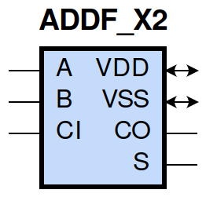
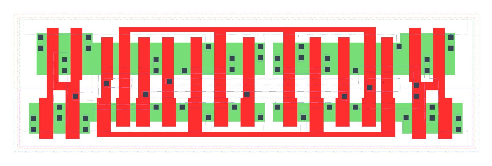

====================================
gf180mcu_fd_sc_mcu9t5v0__addf_x2
====================================

**gf180mcu_fd_sc_mcu9t5v0__addf_x2 symbol**

**gf180mcu_fd_sc_mcu9t5v0__addf_x2 schematic**

.. image:: sc9_sch/ADDF_X2_sch.png
    :height: 250px
    :width: 450 px
    :align: center
    :alt: gf180mcu_fd_sc_mcu9t5v0__addf_x2 schematic

**gf180mcu_fd_sc_mcu9t5v0__addf_x2 layout**

.. include:: images.rst
| ADDF_X2 is a 1 bit Full Adder with 2X drive strength

|
| Attributes

============= ======================
**Attribute** **Value**
area          95.961600 µm\ :sup:`2`
============= ======================

|
| OUTPUT FUNCTIONS

============== =====================
**Output Pin** **Function**
S              (A^B^CI)
CO             ((A&B)|(A&CI)|(B&CI))
============== =====================

|
| TRUTH TABLE FOR S

===== ===== ====== =====
**A** **B** **CI** **S**
1     1     1      1
1     0     0      1
0     1     0      1
0     0     1      1
1     1     0      0
1     0     1      0
0     1     1      0
0     0     0      0
===== ===== ====== =====

|
| TRUTH TABLE FOR CO

===== ===== ====== ======
**A** **B** **CI** **CO**
1     1     ?      1
1     ?     1      1
?     1     1      1
0     0     ?      0
0     ?     0      0
?     0     0      0
===== ===== ====== ======

|
| FUNCTIONAL SCHEMATIC

| |image11|

| PIN CAPACITANCE (pf)

======= ======== ====================
**Pin** **Type** **Capacitance (pf)**
A       input    0.0190
CI      input    0.0142
B       input    0.0184
======= ======== ====================

|
| DELAY AND OUTPUT TRANSITION TIME corresponding to min slew and load

+---------------+------------+--------------------+--------------+-------------------+----------------+---------------+
| **Input Pin** | **Output** | **When Condition** | **Tin (ns)** | **Out Load (pf)** | **Delay (ns)** | **Tout (ns)** |
+---------------+------------+--------------------+--------------+-------------------+----------------+---------------+
| A(HL)         | S(LH)      | !B&CI              | 0.0100       | 0.0010            | 0.7765         | 0.0456        |
+---------------+------------+--------------------+--------------+-------------------+----------------+---------------+
| A(HL)         | S(LH)      | B&!CI              | 0.0100       | 0.0010            | 0.7895         | 0.0444        |
+---------------+------------+--------------------+--------------+-------------------+----------------+---------------+
| A(HL)         | S(HL)      | !B&!CI             | 0.0100       | 0.0010            | 0.5091         | 0.0708        |
+---------------+------------+--------------------+--------------+-------------------+----------------+---------------+
| A(HL)         | S(HL)      | B&CI               | 0.0100       | 0.0010            | 0.3718         | 0.0533        |
+---------------+------------+--------------------+--------------+-------------------+----------------+---------------+
| A(LH)         | CO(LH)     | !B&CI              | 0.0100       | 0.0010            | 0.3565         | 0.0450        |
+---------------+------------+--------------------+--------------+-------------------+----------------+---------------+
| A(LH)         | CO(LH)     | B&!CI              | 0.0100       | 0.0010            | 0.3714         | 0.0463        |
+---------------+------------+--------------------+--------------+-------------------+----------------+---------------+
| A(LH)         | S(LH)      | !B&!CI             | 0.0100       | 0.0010            | 0.3204         | 0.0421        |
+---------------+------------+--------------------+--------------+-------------------+----------------+---------------+
| A(LH)         | S(LH)      | B&CI               | 0.0100       | 0.0010            | 0.4152         | 0.0515        |
+---------------+------------+--------------------+--------------+-------------------+----------------+---------------+
| A(HL)         | CO(HL)     | !B&CI              | 0.0100       | 0.0010            | 0.4178         | 0.0618        |
+---------------+------------+--------------------+--------------+-------------------+----------------+---------------+
| A(HL)         | CO(HL)     | B&!CI              | 0.0100       | 0.0010            | 0.4116         | 0.0591        |
+---------------+------------+--------------------+--------------+-------------------+----------------+---------------+
| A(LH)         | S(HL)      | !B&CI              | 0.0100       | 0.0010            | 0.6342         | 0.0519        |
+---------------+------------+--------------------+--------------+-------------------+----------------+---------------+
| A(LH)         | S(HL)      | B&!CI              | 0.0100       | 0.0010            | 0.6277         | 0.0534        |
+---------------+------------+--------------------+--------------+-------------------+----------------+---------------+
| CI(HL)        | S(LH)      | !A&B               | 0.0100       | 0.0010            | 0.7397         | 0.0441        |
+---------------+------------+--------------------+--------------+-------------------+----------------+---------------+
| CI(HL)        | S(LH)      | A&!B               | 0.0100       | 0.0010            | 0.7595         | 0.0458        |
+---------------+------------+--------------------+--------------+-------------------+----------------+---------------+
| CI(HL)        | CO(HL)     | !A&B               | 0.0100       | 0.0010            | 0.3668         | 0.0590        |
+---------------+------------+--------------------+--------------+-------------------+----------------+---------------+
| CI(HL)        | CO(HL)     | A&!B               | 0.0100       | 0.0010            | 0.3462         | 0.0608        |
+---------------+------------+--------------------+--------------+-------------------+----------------+---------------+
| CI(LH)        | S(HL)      | !A&B               | 0.0100       | 0.0010            | 0.6183         | 0.0553        |
+---------------+------------+--------------------+--------------+-------------------+----------------+---------------+
| CI(LH)        | S(HL)      | A&!B               | 0.0100       | 0.0010            | 0.6082         | 0.0518        |
+---------------+------------+--------------------+--------------+-------------------+----------------+---------------+
| CI(LH)        | S(LH)      | !A&!B              | 0.0100       | 0.0010            | 0.2829         | 0.0410        |
+---------------+------------+--------------------+--------------+-------------------+----------------+---------------+
| CI(LH)        | S(LH)      | A&B                | 0.0100       | 0.0010            | 0.4116         | 0.0512        |
+---------------+------------+--------------------+--------------+-------------------+----------------+---------------+
| CI(HL)        | S(HL)      | !A&!B              | 0.0100       | 0.0010            | 0.4782         | 0.0709        |
+---------------+------------+--------------------+--------------+-------------------+----------------+---------------+
| CI(HL)        | S(HL)      | A&B                | 0.0100       | 0.0010            | 0.3274         | 0.0513        |
+---------------+------------+--------------------+--------------+-------------------+----------------+---------------+
| CI(LH)        | CO(LH)     | !A&B               | 0.0100       | 0.0010            | 0.3124         | 0.0454        |
+---------------+------------+--------------------+--------------+-------------------+----------------+---------------+
| CI(LH)        | CO(LH)     | A&!B               | 0.0100       | 0.0010            | 0.3316         | 0.0449        |
+---------------+------------+--------------------+--------------+-------------------+----------------+---------------+
| B(LH)         | S(LH)      | !A&!CI             | 0.0100       | 0.0010            | 0.3000         | 0.0398        |
+---------------+------------+--------------------+--------------+-------------------+----------------+---------------+
| B(LH)         | S(LH)      | A&CI               | 0.0100       | 0.0010            | 0.4120         | 0.0516        |
+---------------+------------+--------------------+--------------+-------------------+----------------+---------------+
| B(LH)         | CO(LH)     | !A&CI              | 0.0100       | 0.0010            | 0.3332         | 0.0454        |
+---------------+------------+--------------------+--------------+-------------------+----------------+---------------+
| B(LH)         | CO(LH)     | A&!CI              | 0.0100       | 0.0010            | 0.3743         | 0.0461        |
+---------------+------------+--------------------+--------------+-------------------+----------------+---------------+
| B(HL)         | S(HL)      | !A&!CI             | 0.0100       | 0.0010            | 0.5045         | 0.0711        |
+---------------+------------+--------------------+--------------+-------------------+----------------+---------------+
| B(HL)         | S(HL)      | A&CI               | 0.0100       | 0.0010            | 0.3524         | 0.0503        |
+---------------+------------+--------------------+--------------+-------------------+----------------+---------------+
| B(HL)         | S(LH)      | !A&CI              | 0.0100       | 0.0010            | 0.7780         | 0.0459        |
+---------------+------------+--------------------+--------------+-------------------+----------------+---------------+
| B(HL)         | S(LH)      | A&!CI              | 0.0100       | 0.0010            | 0.7970         | 0.0459        |
+---------------+------------+--------------------+--------------+-------------------+----------------+---------------+
| B(HL)         | CO(HL)     | !A&CI              | 0.0100       | 0.0010            | 0.4189         | 0.0620        |
+---------------+------------+--------------------+--------------+-------------------+----------------+---------------+
| B(HL)         | CO(HL)     | A&!CI              | 0.0100       | 0.0010            | 0.3850         | 0.0598        |
+---------------+------------+--------------------+--------------+-------------------+----------------+---------------+
| B(LH)         | S(HL)      | !A&CI              | 0.0100       | 0.0010            | 0.6385         | 0.0552        |
+---------------+------------+--------------------+--------------+-------------------+----------------+---------------+
| B(LH)         | S(HL)      | A&!CI              | 0.0100       | 0.0010            | 0.6310         | 0.0536        |
+---------------+------------+--------------------+--------------+-------------------+----------------+---------------+

|
| DYNAMIC ENERGY

+---------------+--------------------+--------------+------------+-------------------+---------------------+
| **Input Pin** | **When Condition** | **Tin (ns)** | **Output** | **Out Load (pf)** | **Energy (uW/MHz)** |
+---------------+--------------------+--------------+------------+-------------------+---------------------+
| B             | !A&!CI             | 0.0100       | S(LH)      | 0.0010            | 0.2959              |
+---------------+--------------------+--------------+------------+-------------------+---------------------+
| B             | A&CI               | 0.0100       | S(LH)      | 0.0010            | 0.4370              |
+---------------+--------------------+--------------+------------+-------------------+---------------------+
| B             | !A&CI              | 0.0100       | S(LH)      | 0.0010            | 0.7727              |
+---------------+--------------------+--------------+------------+-------------------+---------------------+
| B             | A&!CI              | 0.0100       | S(LH)      | 0.0010            | 0.7671              |
+---------------+--------------------+--------------+------------+-------------------+---------------------+
| A             | !B&CI              | 0.0100       | S(LH)      | 0.0010            | 0.7760              |
+---------------+--------------------+--------------+------------+-------------------+---------------------+
| A             | B&!CI              | 0.0100       | S(LH)      | 0.0010            | 0.7600              |
+---------------+--------------------+--------------+------------+-------------------+---------------------+
| A             | !B&!CI             | 0.0100       | S(LH)      | 0.0010            | 0.3248              |
+---------------+--------------------+--------------+------------+-------------------+---------------------+
| A             | B&CI               | 0.0100       | S(LH)      | 0.0010            | 0.4020              |
+---------------+--------------------+--------------+------------+-------------------+---------------------+
| B             | !A&CI              | 0.0100       | CO(LH)     | 0.0010            | 0.5056              |
+---------------+--------------------+--------------+------------+-------------------+---------------------+
| B             | A&!CI              | 0.0100       | CO(LH)     | 0.0010            | 0.5445              |
+---------------+--------------------+--------------+------------+-------------------+---------------------+
| CI            | !A&B               | 0.0100       | S(LH)      | 0.0010            | 0.7130              |
+---------------+--------------------+--------------+------------+-------------------+---------------------+
| CI            | A&!B               | 0.0100       | S(LH)      | 0.0010            | 0.7362              |
+---------------+--------------------+--------------+------------+-------------------+---------------------+
| CI            | !A&!B              | 0.0100       | S(LH)      | 0.0010            | 0.3582              |
+---------------+--------------------+--------------+------------+-------------------+---------------------+
| CI            | A&B                | 0.0100       | S(LH)      | 0.0010            | 0.4972              |
+---------------+--------------------+--------------+------------+-------------------+---------------------+
| CI            | !A&B               | 0.0100       | CO(HL)     | 0.0010            | 0.7503              |
+---------------+--------------------+--------------+------------+-------------------+---------------------+
| CI            | A&!B               | 0.0100       | CO(HL)     | 0.0010            | 0.7660              |
+---------------+--------------------+--------------+------------+-------------------+---------------------+
| B             | !A&!CI             | 0.0100       | S(HL)      | 0.0010            | 1.0360              |
+---------------+--------------------+--------------+------------+-------------------+---------------------+
| B             | A&CI               | 0.0100       | S(HL)      | 0.0010            | 0.8137              |
+---------------+--------------------+--------------+------------+-------------------+---------------------+
| B             | !A&CI              | 0.0100       | S(HL)      | 0.0010            | 0.5390              |
+---------------+--------------------+--------------+------------+-------------------+---------------------+
| B             | A&!CI              | 0.0100       | S(HL)      | 0.0010            | 0.5679              |
+---------------+--------------------+--------------+------------+-------------------+---------------------+
| CI            | !A&B               | 0.0100       | S(HL)      | 0.0010            | 0.5766              |
+---------------+--------------------+--------------+------------+-------------------+---------------------+
| CI            | A&!B               | 0.0100       | S(HL)      | 0.0010            | 0.5537              |
+---------------+--------------------+--------------+------------+-------------------+---------------------+
| CI            | !A&!B              | 0.0100       | S(HL)      | 0.0010            | 0.9696              |
+---------------+--------------------+--------------+------------+-------------------+---------------------+
| CI            | A&B                | 0.0100       | S(HL)      | 0.0010            | 0.7879              |
+---------------+--------------------+--------------+------------+-------------------+---------------------+
| A             | !B&!CI             | 0.0100       | S(HL)      | 0.0010            | 1.0576              |
+---------------+--------------------+--------------+------------+-------------------+---------------------+
| A             | B&CI               | 0.0100       | S(HL)      | 0.0010            | 0.9131              |
+---------------+--------------------+--------------+------------+-------------------+---------------------+
| A             | !B&CI              | 0.0100       | S(HL)      | 0.0010            | 0.5159              |
+---------------+--------------------+--------------+------------+-------------------+---------------------+
| A             | B&!CI              | 0.0100       | S(HL)      | 0.0010            | 0.5406              |
+---------------+--------------------+--------------+------------+-------------------+---------------------+
| A             | !B&CI              | 0.0100       | CO(LH)     | 0.0010            | 0.4879              |
+---------------+--------------------+--------------+------------+-------------------+---------------------+
| A             | B&!CI              | 0.0100       | CO(LH)     | 0.0010            | 0.5181              |
+---------------+--------------------+--------------+------------+-------------------+---------------------+
| B             | !A&CI              | 0.0100       | CO(HL)     | 0.0010            | 0.8116              |
+---------------+--------------------+--------------+------------+-------------------+---------------------+
| B             | A&!CI              | 0.0100       | CO(HL)     | 0.0010            | 0.7962              |
+---------------+--------------------+--------------+------------+-------------------+---------------------+
| CI            | !A&B               | 0.0100       | CO(LH)     | 0.0010            | 0.5425              |
+---------------+--------------------+--------------+------------+-------------------+---------------------+
| CI            | A&!B               | 0.0100       | CO(LH)     | 0.0010            | 0.5264              |
+---------------+--------------------+--------------+------------+-------------------+---------------------+
| A             | !B&CI              | 0.0100       | CO(HL)     | 0.0010            | 0.8150              |
+---------------+--------------------+--------------+------------+-------------------+---------------------+
| A             | B&!CI              | 0.0100       | CO(HL)     | 0.0010            | 0.7977              |
+---------------+--------------------+--------------+------------+-------------------+---------------------+

|
| LEAKAGE POWER

================== ==============
**When Condition** **Power (nW)**
!A&!B&!CI          0.3386
!A&!B&CI           0.3182
!A&B&!CI           0.3344
A&!B&!CI           0.3298
!A&B&CI            0.3380
A&!B&CI            0.3344
A&B&!CI            0.3135
A&B&CI             0.3322
================== ==============

