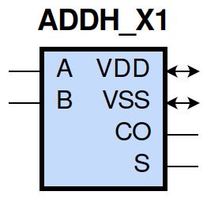
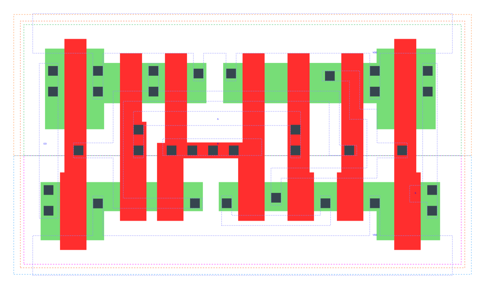

====================================
gf180mcu_fd_sc_mcu9t5v0__addh_x1
====================================

**gf180mcu_fd_sc_mcu9t5v0__addh_x1 symbol**

**gf180mcu_fd_sc_mcu9t5v0__addh_x1 schematic**

**gf180mcu_fd_sc_mcu9t5v0__addh_x1 layout**

.. include:: images.rst
| ADDH_X1 is a 1 bit Half Adder with 1X drive strength

|
| Attributes

============= ======================
**Attribute** **Value**
area          47.980800 µm\ :sup:`2`
============= ======================

|
| OUTPUT FUNCTIONS

============== ============
**Output Pin** **Function**
CO             (A&B)
S              (A^B)
============== ============

|
| TRUTH TABLE FOR CO

===== ===== ======
**A** **B** **CO**
1     1     1
0     ?     0
?     0     0
===== ===== ======

|
| TRUTH TABLE FOR S

===== ===== =====
**A** **B** **S**
1     0     1
0     1     1
1     1     0
0     0     0
===== ===== =====

|
| FUNCTIONAL SCHEMATIC

| |image17|

| PIN CAPACITANCE (pf)

======= ======== ====================
**Pin** **Type** **Capacitance (pf)**
A       input    0.0082
B       input    0.0069
======= ======== ====================

|
| DELAY AND OUTPUT TRANSITION TIME corresponding to min slew and load

+---------------+------------+--------------------+--------------+-------------------+----------------+---------------+
| **Input Pin** | **Output** | **When Condition** | **Tin (ns)** | **Out Load (pf)** | **Delay (ns)** | **Tout (ns)** |
+---------------+------------+--------------------+--------------+-------------------+----------------+---------------+
| A(HL)         | S(LH)      | B                  | 0.0100       | 0.0010            | 0.4741         | 0.0440        |
+---------------+------------+--------------------+--------------+-------------------+----------------+---------------+
| A(HL)         | S(HL)      | !B                 | 0.0100       | 0.0010            | 0.2799         | 0.0516        |
+---------------+------------+--------------------+--------------+-------------------+----------------+---------------+
| A(LH)         | CO(LH)     | B                  | 0.0100       | 0.0010            | 0.2673         | 0.0473        |
+---------------+------------+--------------------+--------------+-------------------+----------------+---------------+
| A(LH)         | S(LH)      | !B                 | 0.0100       | 0.0010            | 0.1987         | 0.0412        |
+---------------+------------+--------------------+--------------+-------------------+----------------+---------------+
| A(HL)         | CO(HL)     | B                  | 0.0100       | 0.0010            | 0.2421         | 0.0459        |
+---------------+------------+--------------------+--------------+-------------------+----------------+---------------+
| A(LH)         | S(HL)      | B                  | 0.0100       | 0.0010            | 0.4614         | 0.0443        |
+---------------+------------+--------------------+--------------+-------------------+----------------+---------------+
| B(LH)         | S(LH)      | !A                 | 0.0100       | 0.0010            | 0.2259         | 0.0429        |
+---------------+------------+--------------------+--------------+-------------------+----------------+---------------+
| B(LH)         | CO(LH)     | A                  | 0.0100       | 0.0010            | 0.2566         | 0.0474        |
+---------------+------------+--------------------+--------------+-------------------+----------------+---------------+
| B(HL)         | S(HL)      | !A                 | 0.0100       | 0.0010            | 0.3052         | 0.0516        |
+---------------+------------+--------------------+--------------+-------------------+----------------+---------------+
| B(HL)         | S(LH)      | A                  | 0.0100       | 0.0010            | 0.4303         | 0.0428        |
+---------------+------------+--------------------+--------------+-------------------+----------------+---------------+
| B(HL)         | CO(HL)     | A                  | 0.0100       | 0.0010            | 0.2267         | 0.0432        |
+---------------+------------+--------------------+--------------+-------------------+----------------+---------------+
| B(LH)         | S(HL)      | A                  | 0.0100       | 0.0010            | 0.4497         | 0.0442        |
+---------------+------------+--------------------+--------------+-------------------+----------------+---------------+

|
| DYNAMIC ENERGY

+---------------+--------------------+--------------+------------+-------------------+---------------------+
| **Input Pin** | **When Condition** | **Tin (ns)** | **Output** | **Out Load (pf)** | **Energy (uW/MHz)** |
+---------------+--------------------+--------------+------------+-------------------+---------------------+
| B             | !A                 | 0.0100       | S(LH)      | 0.0010            | 0.1803              |
+---------------+--------------------+--------------+------------+-------------------+---------------------+
| B             | A                  | 0.0100       | S(LH)      | 0.0010            | 0.3087              |
+---------------+--------------------+--------------+------------+-------------------+---------------------+
| A             | B                  | 0.0100       | S(LH)      | 0.0010            | 0.3375              |
+---------------+--------------------+--------------+------------+-------------------+---------------------+
| A             | !B                 | 0.0100       | S(LH)      | 0.0010            | 0.1486              |
+---------------+--------------------+--------------+------------+-------------------+---------------------+
| B             | A                  | 0.0100       | CO(LH)     | 0.0010            | 0.2772              |
+---------------+--------------------+--------------+------------+-------------------+---------------------+
| B             | !A                 | 0.0100       | S(HL)      | 0.0010            | 0.3827              |
+---------------+--------------------+--------------+------------+-------------------+---------------------+
| B             | A                  | 0.0100       | S(HL)      | 0.0010            | 0.2846              |
+---------------+--------------------+--------------+------------+-------------------+---------------------+
| A             | !B                 | 0.0100       | S(HL)      | 0.0010            | 0.3599              |
+---------------+--------------------+--------------+------------+-------------------+---------------------+
| A             | B                  | 0.0100       | S(HL)      | 0.0010            | 0.2942              |
+---------------+--------------------+--------------+------------+-------------------+---------------------+
| A             | B                  | 0.0100       | CO(LH)     | 0.0010            | 0.2868              |
+---------------+--------------------+--------------+------------+-------------------+---------------------+
| B             | A                  | 0.0100       | CO(HL)     | 0.0010            | 0.3205              |
+---------------+--------------------+--------------+------------+-------------------+---------------------+
| A             | B                  | 0.0100       | CO(HL)     | 0.0010            | 0.3494              |
+---------------+--------------------+--------------+------------+-------------------+---------------------+

|
| LEAKAGE POWER

================== ==============
**When Condition** **Power (nW)**
!A&!B              0.1798
!A&B               0.2563
A&!B               0.1805
A&B                0.2646
================== ==============

