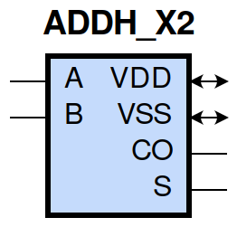
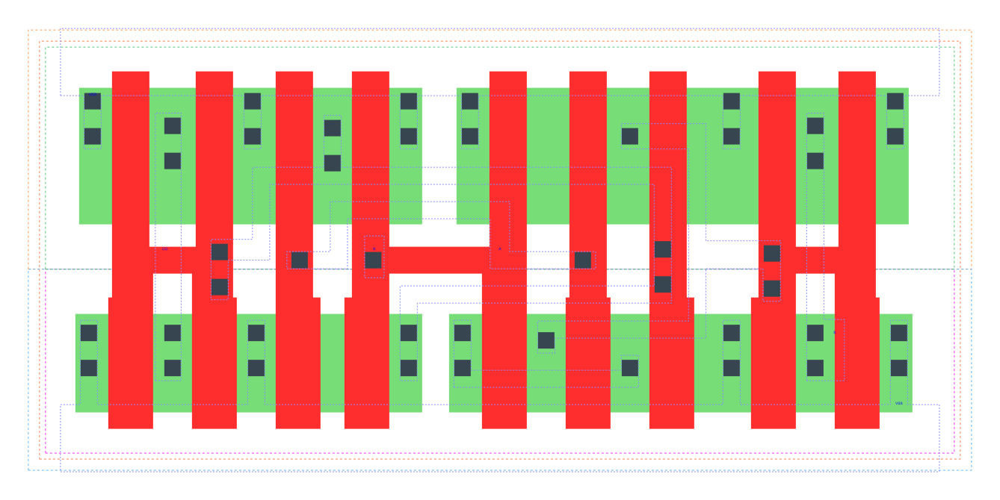

====================================
gf180mcu_fd_sc_mcu9t5v0__addh_x2
====================================

**gf180mcu_fd_sc_mcu9t5v0__addh_x2 symbol**

**gf180mcu_fd_sc_mcu9t5v0__addh_x2 schematic**

.. image:: sc9_sch/ADDH_X2_sch.png
    :height: 250px
    :width: 450 px
    :align: center
    :alt: gf180mcu_fd_sc_mcu9t5v0__addh_x2 schematic

**gf180mcu_fd_sc_mcu9t5v0__addh_x2 layout**

.. include:: images.rst
| ADDH_X2 is a 1 bit Half Adder with 2X drive strength

|
| Attributes

============= ======================
**Attribute** **Value**
area          59.270400 µm\ :sup:`2`
============= ======================

|
| OUTPUT FUNCTIONS

============== ============
**Output Pin** **Function**
CO             (A&B)
S              (A^B)
============== ============

|
| TRUTH TABLE FOR CO

===== ===== ======
**A** **B** **CO**
1     1     1
0     ?     0
?     0     0
===== ===== ======

|
| TRUTH TABLE FOR S

===== ===== =====
**A** **B** **S**
1     0     1
0     1     1
1     1     0
0     0     0
===== ===== =====

|
| FUNCTIONAL SCHEMATIC

| |image20|

| PIN CAPACITANCE (pf)

======= ======== ====================
**Pin** **Type** **Capacitance (pf)**
A       input    0.0134
B       input    0.0114
======= ======== ====================

|
| DELAY AND OUTPUT TRANSITION TIME corresponding to min slew and load

+---------------+------------+--------------------+--------------+-------------------+----------------+---------------+
| **Input Pin** | **Output** | **When Condition** | **Tin (ns)** | **Out Load (pf)** | **Delay (ns)** | **Tout (ns)** |
+---------------+------------+--------------------+--------------+-------------------+----------------+---------------+
| A(HL)         | S(LH)      | B                  | 0.0100       | 0.0010            | 0.4179         | 0.0335        |
+---------------+------------+--------------------+--------------+-------------------+----------------+---------------+
| A(HL)         | S(HL)      | !B                 | 0.0100       | 0.0010            | 0.2402         | 0.0396        |
+---------------+------------+--------------------+--------------+-------------------+----------------+---------------+
| A(LH)         | CO(LH)     | B                  | 0.0100       | 0.0010            | 0.2305         | 0.0355        |
+---------------+------------+--------------------+--------------+-------------------+----------------+---------------+
| A(LH)         | S(LH)      | !B                 | 0.0100       | 0.0010            | 0.1742         | 0.0307        |
+---------------+------------+--------------------+--------------+-------------------+----------------+---------------+
| A(HL)         | CO(HL)     | B                  | 0.0100       | 0.0010            | 0.2037         | 0.0344        |
+---------------+------------+--------------------+--------------+-------------------+----------------+---------------+
| A(LH)         | S(HL)      | B                  | 0.0100       | 0.0010            | 0.4038         | 0.0338        |
+---------------+------------+--------------------+--------------+-------------------+----------------+---------------+
| B(LH)         | S(LH)      | !A                 | 0.0100       | 0.0010            | 0.2015         | 0.0324        |
+---------------+------------+--------------------+--------------+-------------------+----------------+---------------+
| B(LH)         | CO(LH)     | A                  | 0.0100       | 0.0010            | 0.2194         | 0.0353        |
+---------------+------------+--------------------+--------------+-------------------+----------------+---------------+
| B(HL)         | S(HL)      | !A                 | 0.0100       | 0.0010            | 0.2645         | 0.0396        |
+---------------+------------+--------------------+--------------+-------------------+----------------+---------------+
| B(HL)         | S(LH)      | A                  | 0.0100       | 0.0010            | 0.3740         | 0.0322        |
+---------------+------------+--------------------+--------------+-------------------+----------------+---------------+
| B(HL)         | CO(HL)     | A                  | 0.0100       | 0.0010            | 0.1883         | 0.0320        |
+---------------+------------+--------------------+--------------+-------------------+----------------+---------------+
| B(LH)         | S(HL)      | A                  | 0.0100       | 0.0010            | 0.3915         | 0.0337        |
+---------------+------------+--------------------+--------------+-------------------+----------------+---------------+

|
| DYNAMIC ENERGY

+---------------+--------------------+--------------+------------+-------------------+---------------------+
| **Input Pin** | **When Condition** | **Tin (ns)** | **Output** | **Out Load (pf)** | **Energy (uW/MHz)** |
+---------------+--------------------+--------------+------------+-------------------+---------------------+
| B             | !A                 | 0.0100       | S(LH)      | 0.0010            | 0.3100              |
+---------------+--------------------+--------------+------------+-------------------+---------------------+
| B             | A                  | 0.0100       | S(LH)      | 0.0010            | 0.5369              |
+---------------+--------------------+--------------+------------+-------------------+---------------------+
| A             | B                  | 0.0100       | S(LH)      | 0.0010            | 0.5930              |
+---------------+--------------------+--------------+------------+-------------------+---------------------+
| A             | !B                 | 0.0100       | S(LH)      | 0.0010            | 0.2471              |
+---------------+--------------------+--------------+------------+-------------------+---------------------+
| B             | A                  | 0.0100       | CO(LH)     | 0.0010            | 0.4846              |
+---------------+--------------------+--------------+------------+-------------------+---------------------+
| B             | !A                 | 0.0100       | S(HL)      | 0.0010            | 0.6952              |
+---------------+--------------------+--------------+------------+-------------------+---------------------+
| B             | A                  | 0.0100       | S(HL)      | 0.0010            | 0.4932              |
+---------------+--------------------+--------------+------------+-------------------+---------------------+
| A             | !B                 | 0.0100       | S(HL)      | 0.0010            | 0.6499              |
+---------------+--------------------+--------------+------------+-------------------+---------------------+
| A             | B                  | 0.0100       | S(HL)      | 0.0010            | 0.5125              |
+---------------+--------------------+--------------+------------+-------------------+---------------------+
| A             | B                  | 0.0100       | CO(LH)     | 0.0010            | 0.5032              |
+---------------+--------------------+--------------+------------+-------------------+---------------------+
| B             | A                  | 0.0100       | CO(HL)     | 0.0010            | 0.5511              |
+---------------+--------------------+--------------+------------+-------------------+---------------------+
| A             | B                  | 0.0100       | CO(HL)     | 0.0010            | 0.6080              |
+---------------+--------------------+--------------+------------+-------------------+---------------------+

|
| LEAKAGE POWER

================== ==============
**When Condition** **Power (nW)**
!A&!B              0.2338
!A&B               0.3094
A&!B               0.2342
A&B                0.3186
================== ==============

