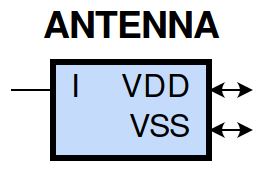
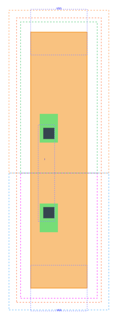

====================================
gf180mcu_fd_sc_mcu9t5v0__antenna
====================================

**gf180mcu_fd_sc_mcu9t5v0__antenna symbol**

**gf180mcu_fd_sc_mcu9t5v0__antenna schematic**

.. image:: sc9_sch/ANTENNA_sch.png
    :height: 250px
    :width: 450 px
    :align: center
    :alt: gf180mcu_fd_sc_mcu9t5v0__antenna schematic

**gf180mcu_fd_sc_mcu9t5v0__antenna layout**

.. include:: images.rst
| ANTENNA is an antenna cell

|
| Attributes

============= =====================
**Attribute** **Value**
area          5.644800 µm\ :sup:`2`
============= =====================

|
| FUNCTIONAL SCHEMATIC

| |image53|

| PIN CAPACITANCE (pf)

======= ======== ====================
**Pin** **Type** **Capacitance (pf)**
I       input    0.0011
======= ======== ====================

|
| DYNAMIC ENERGY

============= ================== ============ ===================
**Input Pin** **When Condition** **Tin (ns)** **Energy (uW/MHz)**
I(LH)         default            0.0100       -0.0092
I(HL)         default            0.0100       0.0092
============= ================== ============ ===================

|
| LEAKAGE POWER

================== ==============
**When Condition** **Power (nW)**
!I                 0.0500
!I                 0.0750
I                  0.0750
I                  0.0500
================== ==============

