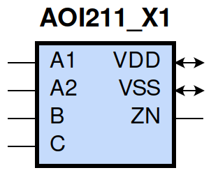

====================================
gf180mcu_fd_sc_mcu9t5v0__aoi211_x1
====================================

**gf180mcu_fd_sc_mcu9t5v0__aoi211_x1 symbol**

**gf180mcu_fd_sc_mcu9t5v0__aoi211_x1 schematic**

.. image:: sc9_sch/AOI211_X1_sch.png
    :height: 250px
    :width: 450 px
    :align: center
    :alt: gf180mcu_fd_sc_mcu9t5v0__aoi211_x1 schematic

**gf180mcu_fd_sc_mcu9t5v0__aoi211_x1 layout**

.. image:: sc9_lay/AOI211_X1_lay.png
    :height: 300px
    :width: 500 px
    :align: center
    :alt: gf180mcu_fd_sc_mcu9t5v0__aoi211_x1 layout

.. include:: images.rst
| AOI211_X1 is a 2-input AND into 3-input NOR with 1X drive strength

|
| Attributes

============= ======================
**Attribute** **Value**
area          28.224000 µm\ :sup:`2`
============= ======================

|
| OUTPUT FUNCTIONS

============== =====================================
**Output Pin** **Function**
ZN             (((!A1)&(!B)&(!C))|((!A2)&(!B)&(!C)))
============== =====================================

|
| TRUTH TABLE FOR ZN

====== ====== ===== ===== ======
**A1** **A2** **B** **C** **ZN**
0      ?      0     0     1
?      0      0     0     1
1      1      ?     ?     0
?      ?      1     ?     0
?      ?      ?     1     0
====== ====== ===== ===== ======

|
| FUNCTIONAL SCHEMATIC

| |image56|

| PIN CAPACITANCE (pf)

======= ======== ====================
**Pin** **Type** **Capacitance (pf)**
A2      input    0.0068
A1      input    0.0070
B       input    0.0056
C       input    0.0056
======= ======== ====================

|
| DELAY AND OUTPUT TRANSITION TIME corresponding to min slew and load

+---------------+------------+--------------------+--------------+-------------------+----------------+---------------+
| **Input Pin** | **Output** | **When Condition** | **Tin (ns)** | **Out Load (pf)** | **Delay (ns)** | **Tout (ns)** |
+---------------+------------+--------------------+--------------+-------------------+----------------+---------------+
| A2(HL)        | ZN(LH)     | A1&!B&!C           | 0.0100       | 0.0010            | 0.1687         | 0.1685        |
+---------------+------------+--------------------+--------------+-------------------+----------------+---------------+
| A2(LH)        | ZN(HL)     | A1&!B&!C           | 0.0100       | 0.0010            | 0.0784         | 0.0397        |
+---------------+------------+--------------------+--------------+-------------------+----------------+---------------+
| A1(HL)        | ZN(LH)     | A2&!B&!C           | 0.0100       | 0.0010            | 0.1285         | 0.1265        |
+---------------+------------+--------------------+--------------+-------------------+----------------+---------------+
| A1(LH)        | ZN(HL)     | A2&!B&!C           | 0.0100       | 0.0010            | 0.0675         | 0.0397        |
+---------------+------------+--------------------+--------------+-------------------+----------------+---------------+
| B(LH)         | ZN(HL)     | !A1&!A2&!C         | 0.0100       | 0.0010            | 0.1175         | 0.0697        |
+---------------+------------+--------------------+--------------+-------------------+----------------+---------------+
| B(LH)         | ZN(HL)     | !A1&A2&!C          | 0.0100       | 0.0010            | 0.0968         | 0.0603        |
+---------------+------------+--------------------+--------------+-------------------+----------------+---------------+
| B(LH)         | ZN(HL)     | A1&!A2&!C          | 0.0100       | 0.0010            | 0.1056         | 0.0781        |
+---------------+------------+--------------------+--------------+-------------------+----------------+---------------+
| B(HL)         | ZN(LH)     | !A1&!A2&!C         | 0.0100       | 0.0010            | 0.1848         | 0.1433        |
+---------------+------------+--------------------+--------------+-------------------+----------------+---------------+
| B(HL)         | ZN(LH)     | !A1&A2&!C          | 0.0100       | 0.0010            | 0.2075         | 0.1353        |
+---------------+------------+--------------------+--------------+-------------------+----------------+---------------+
| B(HL)         | ZN(LH)     | A1&!A2&!C          | 0.0100       | 0.0010            | 0.2586         | 0.1738        |
+---------------+------------+--------------------+--------------+-------------------+----------------+---------------+
| C(HL)         | ZN(LH)     | !A1&!A2&!B         | 0.0100       | 0.0010            | 0.2082         | 0.1435        |
+---------------+------------+--------------------+--------------+-------------------+----------------+---------------+
| C(HL)         | ZN(LH)     | !A1&A2&!B          | 0.0100       | 0.0010            | 0.2305         | 0.1356        |
+---------------+------------+--------------------+--------------+-------------------+----------------+---------------+
| C(HL)         | ZN(LH)     | A1&!A2&!B          | 0.0100       | 0.0010            | 0.2816         | 0.1738        |
+---------------+------------+--------------------+--------------+-------------------+----------------+---------------+
| C(LH)         | ZN(HL)     | !A1&!A2&!B         | 0.0100       | 0.0010            | 0.1307         | 0.0833        |
+---------------+------------+--------------------+--------------+-------------------+----------------+---------------+
| C(LH)         | ZN(HL)     | !A1&A2&!B          | 0.0100       | 0.0010            | 0.1017         | 0.0725        |
+---------------+------------+--------------------+--------------+-------------------+----------------+---------------+
| C(LH)         | ZN(HL)     | A1&!A2&!B          | 0.0100       | 0.0010            | 0.1129         | 0.0928        |
+---------------+------------+--------------------+--------------+-------------------+----------------+---------------+

|
| DYNAMIC ENERGY

+---------------+--------------------+--------------+------------+-------------------+---------------------+
| **Input Pin** | **When Condition** | **Tin (ns)** | **Output** | **Out Load (pf)** | **Energy (uW/MHz)** |
+---------------+--------------------+--------------+------------+-------------------+---------------------+
| C             | !A1&!A2&!B         | 0.0100       | ZN(LH)     | 0.0010            | 0.3319              |
+---------------+--------------------+--------------+------------+-------------------+---------------------+
| C             | !A1&A2&!B          | 0.0100       | ZN(LH)     | 0.0010            | 0.2987              |
+---------------+--------------------+--------------+------------+-------------------+---------------------+
| C             | A1&!A2&!B          | 0.0100       | ZN(LH)     | 0.0010            | 0.3560              |
+---------------+--------------------+--------------+------------+-------------------+---------------------+
| C             | !A1&!A2&!B         | 0.0100       | ZN(HL)     | 0.0010            | 0.1079              |
+---------------+--------------------+--------------+------------+-------------------+---------------------+
| C             | !A1&A2&!B          | 0.0100       | ZN(HL)     | 0.0010            | 0.0985              |
+---------------+--------------------+--------------+------------+-------------------+---------------------+
| C             | A1&!A2&!B          | 0.0100       | ZN(HL)     | 0.0010            | 0.0985              |
+---------------+--------------------+--------------+------------+-------------------+---------------------+
| A1            | A2&!B&!C           | 0.0100       | ZN(LH)     | 0.0010            | 0.1999              |
+---------------+--------------------+--------------+------------+-------------------+---------------------+
| B             | !A1&!A2&!C         | 0.0100       | ZN(HL)     | 0.0010            | 0.0757              |
+---------------+--------------------+--------------+------------+-------------------+---------------------+
| B             | !A1&A2&!C          | 0.0100       | ZN(HL)     | 0.0010            | 0.0657              |
+---------------+--------------------+--------------+------------+-------------------+---------------------+
| B             | A1&!A2&!C          | 0.0100       | ZN(HL)     | 0.0010            | 0.0658              |
+---------------+--------------------+--------------+------------+-------------------+---------------------+
| A2            | A1&!B&!C           | 0.0100       | ZN(LH)     | 0.0010            | 0.2497              |
+---------------+--------------------+--------------+------------+-------------------+---------------------+
| A1            | A2&!B&!C           | 0.0100       | ZN(HL)     | 0.0010            | 0.0044              |
+---------------+--------------------+--------------+------------+-------------------+---------------------+
| B             | !A1&!A2&!C         | 0.0100       | ZN(LH)     | 0.0010            | 0.2886              |
+---------------+--------------------+--------------+------------+-------------------+---------------------+
| B             | !A1&A2&!C          | 0.0100       | ZN(LH)     | 0.0010            | 0.2554              |
+---------------+--------------------+--------------+------------+-------------------+---------------------+
| B             | A1&!A2&!C          | 0.0100       | ZN(LH)     | 0.0010            | 0.3128              |
+---------------+--------------------+--------------+------------+-------------------+---------------------+
| A2            | A1&!B&!C           | 0.0100       | ZN(HL)     | 0.0010            | 0.0043              |
+---------------+--------------------+--------------+------------+-------------------+---------------------+
| B(HL)         | !A1&!A2&C          | 0.0100       | n/a        | n/a               | 0.0377              |
+---------------+--------------------+--------------+------------+-------------------+---------------------+
| B(HL)         | !A1&A2&C           | 0.0100       | n/a        | n/a               | 0.0376              |
+---------------+--------------------+--------------+------------+-------------------+---------------------+
| B(HL)         | A1&!A2&C           | 0.0100       | n/a        | n/a               | 0.0376              |
+---------------+--------------------+--------------+------------+-------------------+---------------------+
| B(HL)         | A1&A2&!C           | 0.0100       | n/a        | n/a               | 0.0597              |
+---------------+--------------------+--------------+------------+-------------------+---------------------+
| B(HL)         | A1&A2&C            | 0.0100       | n/a        | n/a               | 0.0358              |
+---------------+--------------------+--------------+------------+-------------------+---------------------+
| A2(LH)        | !A1&!B&!C          | 0.0100       | n/a        | n/a               | -0.0601             |
+---------------+--------------------+--------------+------------+-------------------+---------------------+
| A2(LH)        | !A1&!B&C           | 0.0100       | n/a        | n/a               | -0.0146             |
+---------------+--------------------+--------------+------------+-------------------+---------------------+
| A2(LH)        | !A1&B&!C           | 0.0100       | n/a        | n/a               | -0.0143             |
+---------------+--------------------+--------------+------------+-------------------+---------------------+
| A2(LH)        | !A1&B&C            | 0.0100       | n/a        | n/a               | -0.0143             |
+---------------+--------------------+--------------+------------+-------------------+---------------------+
| A2(LH)        | A1&!B&C            | 0.0100       | n/a        | n/a               | -0.0162             |
+---------------+--------------------+--------------+------------+-------------------+---------------------+
| A2(LH)        | A1&B&!C            | 0.0100       | n/a        | n/a               | -0.0161             |
+---------------+--------------------+--------------+------------+-------------------+---------------------+
| A2(LH)        | A1&B&C             | 0.0100       | n/a        | n/a               | -0.0161             |
+---------------+--------------------+--------------+------------+-------------------+---------------------+
| A1(LH)        | !A2&!B&!C          | 0.0100       | n/a        | n/a               | -0.0480             |
+---------------+--------------------+--------------+------------+-------------------+---------------------+
| A1(LH)        | !A2&!B&C           | 0.0100       | n/a        | n/a               | -0.0145             |
+---------------+--------------------+--------------+------------+-------------------+---------------------+
| A1(LH)        | !A2&B&!C           | 0.0100       | n/a        | n/a               | -0.0143             |
+---------------+--------------------+--------------+------------+-------------------+---------------------+
| A1(LH)        | !A2&B&C            | 0.0100       | n/a        | n/a               | -0.0143             |
+---------------+--------------------+--------------+------------+-------------------+---------------------+
| A1(LH)        | A2&!B&C            | 0.0100       | n/a        | n/a               | -0.0162             |
+---------------+--------------------+--------------+------------+-------------------+---------------------+
| A1(LH)        | A2&B&!C            | 0.0100       | n/a        | n/a               | -0.0161             |
+---------------+--------------------+--------------+------------+-------------------+---------------------+
| A1(LH)        | A2&B&C             | 0.0100       | n/a        | n/a               | -0.0161             |
+---------------+--------------------+--------------+------------+-------------------+---------------------+
| C(HL)         | !A1&!A2&B          | 0.0100       | n/a        | n/a               | 0.0596              |
+---------------+--------------------+--------------+------------+-------------------+---------------------+
| C(HL)         | !A1&A2&B           | 0.0100       | n/a        | n/a               | 0.0596              |
+---------------+--------------------+--------------+------------+-------------------+---------------------+
| C(HL)         | A1&!A2&B           | 0.0100       | n/a        | n/a               | 0.0596              |
+---------------+--------------------+--------------+------------+-------------------+---------------------+
| C(HL)         | A1&A2&!B           | 0.0100       | n/a        | n/a               | 0.0597              |
+---------------+--------------------+--------------+------------+-------------------+---------------------+
| C(HL)         | A1&A2&B            | 0.0100       | n/a        | n/a               | 0.0596              |
+---------------+--------------------+--------------+------------+-------------------+---------------------+
| A2(HL)        | !A1&!B&!C          | 0.0100       | n/a        | n/a               | 0.0657              |
+---------------+--------------------+--------------+------------+-------------------+---------------------+
| A2(HL)        | !A1&!B&C           | 0.0100       | n/a        | n/a               | 0.0158              |
+---------------+--------------------+--------------+------------+-------------------+---------------------+
| A2(HL)        | !A1&B&!C           | 0.0100       | n/a        | n/a               | 0.0159              |
+---------------+--------------------+--------------+------------+-------------------+---------------------+
| A2(HL)        | !A1&B&C            | 0.0100       | n/a        | n/a               | 0.0159              |
+---------------+--------------------+--------------+------------+-------------------+---------------------+
| A2(HL)        | A1&!B&C            | 0.0100       | n/a        | n/a               | 0.1006              |
+---------------+--------------------+--------------+------------+-------------------+---------------------+
| A2(HL)        | A1&B&!C            | 0.0100       | n/a        | n/a               | 0.0628              |
+---------------+--------------------+--------------+------------+-------------------+---------------------+
| A2(HL)        | A1&B&C             | 0.0100       | n/a        | n/a               | 0.0628              |
+---------------+--------------------+--------------+------------+-------------------+---------------------+
| B(LH)         | !A1&!A2&C          | 0.0100       | n/a        | n/a               | -0.0193             |
+---------------+--------------------+--------------+------------+-------------------+---------------------+
| B(LH)         | !A1&A2&C           | 0.0100       | n/a        | n/a               | -0.0193             |
+---------------+--------------------+--------------+------------+-------------------+---------------------+
| B(LH)         | A1&!A2&C           | 0.0100       | n/a        | n/a               | -0.0193             |
+---------------+--------------------+--------------+------------+-------------------+---------------------+
| B(LH)         | A1&A2&!C           | 0.0100       | n/a        | n/a               | -0.0438             |
+---------------+--------------------+--------------+------------+-------------------+---------------------+
| B(LH)         | A1&A2&C            | 0.0100       | n/a        | n/a               | -0.0356             |
+---------------+--------------------+--------------+------------+-------------------+---------------------+
| A1(HL)        | !A2&!B&!C          | 0.0100       | n/a        | n/a               | 0.0665              |
+---------------+--------------------+--------------+------------+-------------------+---------------------+
| A1(HL)        | !A2&!B&C           | 0.0100       | n/a        | n/a               | 0.0158              |
+---------------+--------------------+--------------+------------+-------------------+---------------------+
| A1(HL)        | !A2&B&!C           | 0.0100       | n/a        | n/a               | 0.0159              |
+---------------+--------------------+--------------+------------+-------------------+---------------------+
| A1(HL)        | !A2&B&C            | 0.0100       | n/a        | n/a               | 0.0159              |
+---------------+--------------------+--------------+------------+-------------------+---------------------+
| A1(HL)        | A2&!B&C            | 0.0100       | n/a        | n/a               | 0.1005              |
+---------------+--------------------+--------------+------------+-------------------+---------------------+
| A1(HL)        | A2&B&!C            | 0.0100       | n/a        | n/a               | 0.0628              |
+---------------+--------------------+--------------+------------+-------------------+---------------------+
| A1(HL)        | A2&B&C             | 0.0100       | n/a        | n/a               | 0.0628              |
+---------------+--------------------+--------------+------------+-------------------+---------------------+
| C(LH)         | !A1&!A2&B          | 0.0100       | n/a        | n/a               | -0.0527             |
+---------------+--------------------+--------------+------------+-------------------+---------------------+
| C(LH)         | !A1&A2&B           | 0.0100       | n/a        | n/a               | -0.0527             |
+---------------+--------------------+--------------+------------+-------------------+---------------------+
| C(LH)         | A1&!A2&B           | 0.0100       | n/a        | n/a               | -0.0527             |
+---------------+--------------------+--------------+------------+-------------------+---------------------+
| C(LH)         | A1&A2&!B           | 0.0100       | n/a        | n/a               | -0.0502             |
+---------------+--------------------+--------------+------------+-------------------+---------------------+
| C(LH)         | A1&A2&B            | 0.0100       | n/a        | n/a               | -0.0559             |
+---------------+--------------------+--------------+------------+-------------------+---------------------+

|
| LEAKAGE POWER

================== ==============
**When Condition** **Power (nW)**
!A1&!A2&!B&!C      0.1261
!A1&A2&!B&!C       0.1264
A1&!A2&!B&!C       0.1662
!A1&!A2&!B&C       0.1907
!A1&!A2&B&!C       0.1554
!A1&!A2&B&C        0.1554
!A1&A2&!B&C        0.1935
!A1&A2&B&!C        0.1583
!A1&A2&B&C         0.1583
A1&!A2&!B&C        0.1935
A1&!A2&B&!C        0.1583
A1&!A2&B&C         0.1583
A1&A2&!B&!C        0.1037
A1&A2&!B&C         0.1037
A1&A2&B&!C         0.1037
A1&A2&B&C          0.1037
================== ==============

