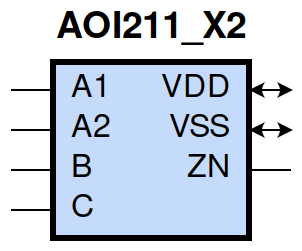
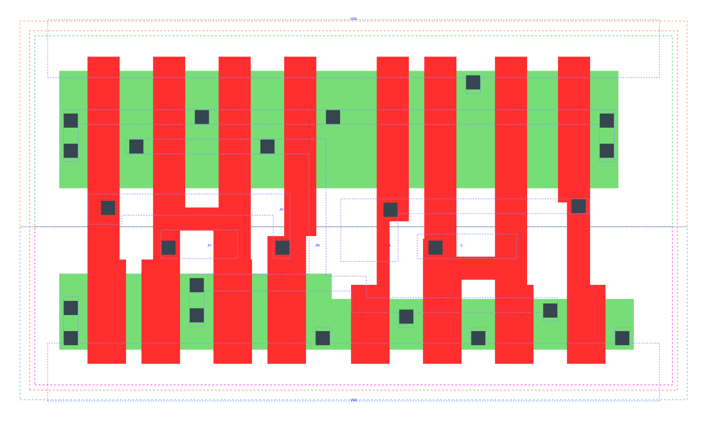

====================================
gf180mcu_fd_sc_mcu9t5v0__aoi211_x2
====================================

**gf180mcu_fd_sc_mcu9t5v0__aoi211_x2 symbol**

**gf180mcu_fd_sc_mcu9t5v0__aoi211_x2 schematic**

**gf180mcu_fd_sc_mcu9t5v0__aoi211_x2 layout**

.. include:: images.rst
| AOI211_X2 is a 2-input AND into 3-input NOR with 2X drive strength

|
| Attributes

============= ======================
**Attribute** **Value**
area          47.980800 µm\ :sup:`2`
============= ======================

|
| OUTPUT FUNCTIONS

============== =====================================
**Output Pin** **Function**
ZN             (((!A1)&(!B)&(!C))|((!A2)&(!B)&(!C)))
============== =====================================

|
| TRUTH TABLE FOR ZN

====== ====== ===== ===== ======
**A1** **A2** **B** **C** **ZN**
0      ?      0     0     1
?      0      0     0     1
1      1      ?     ?     0
?      ?      1     ?     0
?      ?      ?     1     0
====== ====== ===== ===== ======

|
| FUNCTIONAL SCHEMATIC

| |image59|

| PIN CAPACITANCE (pf)

======= ======== ====================
**Pin** **Type** **Capacitance (pf)**
A2      input    0.0137
A1      input    0.0133
B       input    0.0117
C       input    0.0111
======= ======== ====================

|
| DELAY AND OUTPUT TRANSITION TIME corresponding to min slew and load

+---------------+------------+--------------------+--------------+-------------------+----------------+---------------+
| **Input Pin** | **Output** | **When Condition** | **Tin (ns)** | **Out Load (pf)** | **Delay (ns)** | **Tout (ns)** |
+---------------+------------+--------------------+--------------+-------------------+----------------+---------------+
| A2(HL)        | ZN(LH)     | A1&!B&!C           | 0.0100       | 0.0010            | 0.1458         | 0.1484        |
+---------------+------------+--------------------+--------------+-------------------+----------------+---------------+
| A2(LH)        | ZN(HL)     | A1&!B&!C           | 0.0100       | 0.0010            | 0.0703         | 0.0330        |
+---------------+------------+--------------------+--------------+-------------------+----------------+---------------+
| A1(HL)        | ZN(LH)     | A2&!B&!C           | 0.0100       | 0.0010            | 0.1057         | 0.1054        |
+---------------+------------+--------------------+--------------+-------------------+----------------+---------------+
| A1(LH)        | ZN(HL)     | A2&!B&!C           | 0.0100       | 0.0010            | 0.0595         | 0.0331        |
+---------------+------------+--------------------+--------------+-------------------+----------------+---------------+
| B(LH)         | ZN(HL)     | !A1&!A2&!C         | 0.0100       | 0.0010            | 0.1105         | 0.0635        |
+---------------+------------+--------------------+--------------+-------------------+----------------+---------------+
| B(LH)         | ZN(HL)     | !A1&A2&!C          | 0.0100       | 0.0010            | 0.0886         | 0.0542        |
+---------------+------------+--------------------+--------------+-------------------+----------------+---------------+
| B(LH)         | ZN(HL)     | A1&!A2&!C          | 0.0100       | 0.0010            | 0.0976         | 0.0727        |
+---------------+------------+--------------------+--------------+-------------------+----------------+---------------+
| B(HL)         | ZN(LH)     | !A1&!A2&!C         | 0.0100       | 0.0010            | 0.1694         | 0.1300        |
+---------------+------------+--------------------+--------------+-------------------+----------------+---------------+
| B(HL)         | ZN(LH)     | !A1&A2&!C          | 0.0100       | 0.0010            | 0.1887         | 0.1184        |
+---------------+------------+--------------------+--------------+-------------------+----------------+---------------+
| B(HL)         | ZN(LH)     | A1&!A2&!C          | 0.0100       | 0.0010            | 0.2401         | 0.1562        |
+---------------+------------+--------------------+--------------+-------------------+----------------+---------------+
| C(HL)         | ZN(LH)     | !A1&!A2&!B         | 0.0100       | 0.0010            | 0.1899         | 0.1304        |
+---------------+------------+--------------------+--------------+-------------------+----------------+---------------+
| C(HL)         | ZN(LH)     | !A1&A2&!B          | 0.0100       | 0.0010            | 0.2093         | 0.1186        |
+---------------+------------+--------------------+--------------+-------------------+----------------+---------------+
| C(HL)         | ZN(LH)     | A1&!A2&!B          | 0.0100       | 0.0010            | 0.2606         | 0.1563        |
+---------------+------------+--------------------+--------------+-------------------+----------------+---------------+
| C(LH)         | ZN(HL)     | !A1&!A2&!B         | 0.0100       | 0.0010            | 0.1219         | 0.0760        |
+---------------+------------+--------------------+--------------+-------------------+----------------+---------------+
| C(LH)         | ZN(HL)     | !A1&A2&!B          | 0.0100       | 0.0010            | 0.0919         | 0.0646        |
+---------------+------------+--------------------+--------------+-------------------+----------------+---------------+
| C(LH)         | ZN(HL)     | A1&!A2&!B          | 0.0100       | 0.0010            | 0.1034         | 0.0858        |
+---------------+------------+--------------------+--------------+-------------------+----------------+---------------+

|
| DYNAMIC ENERGY

+---------------+--------------------+--------------+------------+-------------------+---------------------+
| **Input Pin** | **When Condition** | **Tin (ns)** | **Output** | **Out Load (pf)** | **Energy (uW/MHz)** |
+---------------+--------------------+--------------+------------+-------------------+---------------------+
| C             | !A1&!A2&!B         | 0.0100       | ZN(LH)     | 0.0010            | 0.6305              |
+---------------+--------------------+--------------+------------+-------------------+---------------------+
| C             | !A1&A2&!B          | 0.0100       | ZN(LH)     | 0.0010            | 0.5640              |
+---------------+--------------------+--------------+------------+-------------------+---------------------+
| C             | A1&!A2&!B          | 0.0100       | ZN(LH)     | 0.0010            | 0.6790              |
+---------------+--------------------+--------------+------------+-------------------+---------------------+
| C             | !A1&!A2&!B         | 0.0100       | ZN(HL)     | 0.0010            | 0.2082              |
+---------------+--------------------+--------------+------------+-------------------+---------------------+
| C             | !A1&A2&!B          | 0.0100       | ZN(HL)     | 0.0010            | 0.1893              |
+---------------+--------------------+--------------+------------+-------------------+---------------------+
| C             | A1&!A2&!B          | 0.0100       | ZN(HL)     | 0.0010            | 0.1892              |
+---------------+--------------------+--------------+------------+-------------------+---------------------+
| A1            | A2&!B&!C           | 0.0100       | ZN(LH)     | 0.0010            | 0.3576              |
+---------------+--------------------+--------------+------------+-------------------+---------------------+
| B             | !A1&!A2&!C         | 0.0100       | ZN(HL)     | 0.0010            | 0.1573              |
+---------------+--------------------+--------------+------------+-------------------+---------------------+
| B             | !A1&A2&!C          | 0.0100       | ZN(HL)     | 0.0010            | 0.1375              |
+---------------+--------------------+--------------+------------+-------------------+---------------------+
| B             | A1&!A2&!C          | 0.0100       | ZN(HL)     | 0.0010            | 0.1377              |
+---------------+--------------------+--------------+------------+-------------------+---------------------+
| A2            | A1&!B&!C           | 0.0100       | ZN(LH)     | 0.0010            | 0.4591              |
+---------------+--------------------+--------------+------------+-------------------+---------------------+
| A1            | A2&!B&!C           | 0.0100       | ZN(HL)     | 0.0010            | 0.0073              |
+---------------+--------------------+--------------+------------+-------------------+---------------------+
| B             | !A1&!A2&!C         | 0.0100       | ZN(LH)     | 0.0010            | 0.5437              |
+---------------+--------------------+--------------+------------+-------------------+---------------------+
| B             | !A1&A2&!C          | 0.0100       | ZN(LH)     | 0.0010            | 0.4773              |
+---------------+--------------------+--------------+------------+-------------------+---------------------+
| B             | A1&!A2&!C          | 0.0100       | ZN(LH)     | 0.0010            | 0.5923              |
+---------------+--------------------+--------------+------------+-------------------+---------------------+
| A2            | A1&!B&!C           | 0.0100       | ZN(HL)     | 0.0010            | 0.0069              |
+---------------+--------------------+--------------+------------+-------------------+---------------------+
| B(HL)         | !A1&!A2&C          | 0.0100       | n/a        | n/a               | 0.0623              |
+---------------+--------------------+--------------+------------+-------------------+---------------------+
| B(HL)         | !A1&A2&C           | 0.0100       | n/a        | n/a               | 0.0620              |
+---------------+--------------------+--------------+------------+-------------------+---------------------+
| B(HL)         | A1&!A2&C           | 0.0100       | n/a        | n/a               | 0.0620              |
+---------------+--------------------+--------------+------------+-------------------+---------------------+
| B(HL)         | A1&A2&!C           | 0.0100       | n/a        | n/a               | 0.1193              |
+---------------+--------------------+--------------+------------+-------------------+---------------------+
| B(HL)         | A1&A2&C            | 0.0100       | n/a        | n/a               | 0.0692              |
+---------------+--------------------+--------------+------------+-------------------+---------------------+
| A2(LH)        | !A1&!B&!C          | 0.0100       | n/a        | n/a               | -0.1199             |
+---------------+--------------------+--------------+------------+-------------------+---------------------+
| A2(LH)        | !A1&!B&C           | 0.0100       | n/a        | n/a               | -0.0292             |
+---------------+--------------------+--------------+------------+-------------------+---------------------+
| A2(LH)        | !A1&B&!C           | 0.0100       | n/a        | n/a               | -0.0289             |
+---------------+--------------------+--------------+------------+-------------------+---------------------+
| A2(LH)        | !A1&B&C            | 0.0100       | n/a        | n/a               | -0.0289             |
+---------------+--------------------+--------------+------------+-------------------+---------------------+
| A2(LH)        | A1&!B&C            | 0.0100       | n/a        | n/a               | -0.0321             |
+---------------+--------------------+--------------+------------+-------------------+---------------------+
| A2(LH)        | A1&B&!C            | 0.0100       | n/a        | n/a               | -0.0320             |
+---------------+--------------------+--------------+------------+-------------------+---------------------+
| A2(LH)        | A1&B&C             | 0.0100       | n/a        | n/a               | -0.0320             |
+---------------+--------------------+--------------+------------+-------------------+---------------------+
| A1(LH)        | !A2&!B&!C          | 0.0100       | n/a        | n/a               | -0.0961             |
+---------------+--------------------+--------------+------------+-------------------+---------------------+
| A1(LH)        | !A2&!B&C           | 0.0100       | n/a        | n/a               | -0.0292             |
+---------------+--------------------+--------------+------------+-------------------+---------------------+
| A1(LH)        | !A2&B&!C           | 0.0100       | n/a        | n/a               | -0.0289             |
+---------------+--------------------+--------------+------------+-------------------+---------------------+
| A1(LH)        | !A2&B&C            | 0.0100       | n/a        | n/a               | -0.0289             |
+---------------+--------------------+--------------+------------+-------------------+---------------------+
| A1(LH)        | A2&!B&C            | 0.0100       | n/a        | n/a               | -0.0320             |
+---------------+--------------------+--------------+------------+-------------------+---------------------+
| A1(LH)        | A2&B&!C            | 0.0100       | n/a        | n/a               | -0.0319             |
+---------------+--------------------+--------------+------------+-------------------+---------------------+
| A1(LH)        | A2&B&C             | 0.0100       | n/a        | n/a               | -0.0319             |
+---------------+--------------------+--------------+------------+-------------------+---------------------+
| C(HL)         | !A1&!A2&B          | 0.0100       | n/a        | n/a               | 0.1191              |
+---------------+--------------------+--------------+------------+-------------------+---------------------+
| C(HL)         | !A1&A2&B           | 0.0100       | n/a        | n/a               | 0.1191              |
+---------------+--------------------+--------------+------------+-------------------+---------------------+
| C(HL)         | A1&!A2&B           | 0.0100       | n/a        | n/a               | 0.1191              |
+---------------+--------------------+--------------+------------+-------------------+---------------------+
| C(HL)         | A1&A2&!B           | 0.0100       | n/a        | n/a               | 0.1191              |
+---------------+--------------------+--------------+------------+-------------------+---------------------+
| C(HL)         | A1&A2&B            | 0.0100       | n/a        | n/a               | 0.1191              |
+---------------+--------------------+--------------+------------+-------------------+---------------------+
| A2(HL)        | !A1&!B&!C          | 0.0100       | n/a        | n/a               | 0.1312              |
+---------------+--------------------+--------------+------------+-------------------+---------------------+
| A2(HL)        | !A1&!B&C           | 0.0100       | n/a        | n/a               | 0.0315              |
+---------------+--------------------+--------------+------------+-------------------+---------------------+
| A2(HL)        | !A1&B&!C           | 0.0100       | n/a        | n/a               | 0.0316              |
+---------------+--------------------+--------------+------------+-------------------+---------------------+
| A2(HL)        | !A1&B&C            | 0.0100       | n/a        | n/a               | 0.0316              |
+---------------+--------------------+--------------+------------+-------------------+---------------------+
| A2(HL)        | A1&!B&C            | 0.0100       | n/a        | n/a               | 0.1938              |
+---------------+--------------------+--------------+------------+-------------------+---------------------+
| A2(HL)        | A1&B&!C            | 0.0100       | n/a        | n/a               | 0.1312              |
+---------------+--------------------+--------------+------------+-------------------+---------------------+
| A2(HL)        | A1&B&C             | 0.0100       | n/a        | n/a               | 0.1312              |
+---------------+--------------------+--------------+------------+-------------------+---------------------+
| B(LH)         | !A1&!A2&C          | 0.0100       | n/a        | n/a               | -0.0380             |
+---------------+--------------------+--------------+------------+-------------------+---------------------+
| B(LH)         | !A1&A2&C           | 0.0100       | n/a        | n/a               | -0.0381             |
+---------------+--------------------+--------------+------------+-------------------+---------------------+
| B(LH)         | A1&!A2&C           | 0.0100       | n/a        | n/a               | -0.0381             |
+---------------+--------------------+--------------+------------+-------------------+---------------------+
| B(LH)         | A1&A2&!C           | 0.0100       | n/a        | n/a               | -0.0872             |
+---------------+--------------------+--------------+------------+-------------------+---------------------+
| B(LH)         | A1&A2&C            | 0.0100       | n/a        | n/a               | -0.0706             |
+---------------+--------------------+--------------+------------+-------------------+---------------------+
| A1(HL)        | !A2&!B&!C          | 0.0100       | n/a        | n/a               | 0.1327              |
+---------------+--------------------+--------------+------------+-------------------+---------------------+
| A1(HL)        | !A2&!B&C           | 0.0100       | n/a        | n/a               | 0.0314              |
+---------------+--------------------+--------------+------------+-------------------+---------------------+
| A1(HL)        | !A2&B&!C           | 0.0100       | n/a        | n/a               | 0.0316              |
+---------------+--------------------+--------------+------------+-------------------+---------------------+
| A1(HL)        | !A2&B&C            | 0.0100       | n/a        | n/a               | 0.0315              |
+---------------+--------------------+--------------+------------+-------------------+---------------------+
| A1(HL)        | A2&!B&C            | 0.0100       | n/a        | n/a               | 0.1939              |
+---------------+--------------------+--------------+------------+-------------------+---------------------+
| A1(HL)        | A2&B&!C            | 0.0100       | n/a        | n/a               | 0.1313              |
+---------------+--------------------+--------------+------------+-------------------+---------------------+
| A1(HL)        | A2&B&C             | 0.0100       | n/a        | n/a               | 0.1312              |
+---------------+--------------------+--------------+------------+-------------------+---------------------+
| C(LH)         | !A1&!A2&B          | 0.0100       | n/a        | n/a               | -0.1061             |
+---------------+--------------------+--------------+------------+-------------------+---------------------+
| C(LH)         | !A1&A2&B           | 0.0100       | n/a        | n/a               | -0.1062             |
+---------------+--------------------+--------------+------------+-------------------+---------------------+
| C(LH)         | A1&!A2&B           | 0.0100       | n/a        | n/a               | -0.1062             |
+---------------+--------------------+--------------+------------+-------------------+---------------------+
| C(LH)         | A1&A2&!B           | 0.0100       | n/a        | n/a               | -0.0997             |
+---------------+--------------------+--------------+------------+-------------------+---------------------+
| C(LH)         | A1&A2&B            | 0.0100       | n/a        | n/a               | -0.1120             |
+---------------+--------------------+--------------+------------+-------------------+---------------------+

|
| LEAKAGE POWER

================== ==============
**When Condition** **Power (nW)**
!A1&!A2&!B&!C      0.2023
!A1&A2&!B&!C       0.2029
A1&!A2&!B&!C       0.2824
!A1&!A2&!B&C       0.3314
!A1&!A2&B&!C       0.2609
!A1&!A2&B&C        0.2609
!A1&A2&!B&C        0.3371
!A1&A2&B&!C        0.2666
!A1&A2&B&C         0.2666
A1&!A2&!B&C        0.3371
A1&!A2&B&!C        0.2666
A1&!A2&B&C         0.2666
A1&A2&!B&!C        0.1574
A1&A2&!B&C         0.1574
A1&A2&B&!C         0.1574
A1&A2&B&C          0.1574
================== ==============

