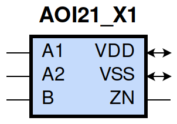
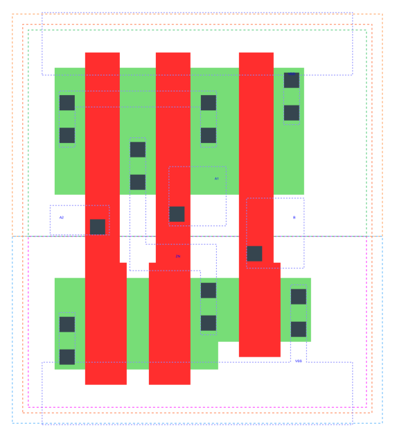

====================================
gf180mcu_fd_sc_mcu9t5v0__aoi21_x1
====================================

**gf180mcu_fd_sc_mcu9t5v0__aoi21_x1 symbol**

**gf180mcu_fd_sc_mcu9t5v0__aoi21_x1 schematic**

.. image:: sc9_sch/AOI21_X1_sch.png
    :height: 250px
    :width: 450 px
    :align: center
    :alt: gf180mcu_fd_sc_mcu9t5v0__aoi21_x1 schematic

**gf180mcu_fd_sc_mcu9t5v0__aoi21_x1 layout**

.. include:: images.rst
| AOI21_X1 is a 2-input AND into 2-input NOR with 1X drive strength

|
| Attributes

============= ======================
**Attribute** **Value**
area          22.579200 µm\ :sup:`2`
============= ======================

|
| OUTPUT FUNCTIONS

============== ===========================
**Output Pin** **Function**
ZN             (((!A1)&(!B))|((!A2)&(!B)))
============== ===========================

|
| TRUTH TABLE FOR ZN

====== ====== ===== ======
**A1** **A2** **B** **ZN**
0      ?      0     1
?      0      0     1
1      1      ?     0
?      ?      1     0
====== ====== ===== ======

|
| FUNCTIONAL SCHEMATIC

| |image65|

| PIN CAPACITANCE (pf)

======= ======== ====================
**Pin** **Type** **Capacitance (pf)**
A2      input    0.0069
A1      input    0.0072
B       input    0.0059
======= ======== ====================

|
| DELAY AND OUTPUT TRANSITION TIME corresponding to min slew and load

+---------------+------------+--------------------+--------------+-------------------+----------------+---------------+
| **Input Pin** | **Output** | **When Condition** | **Tin (ns)** | **Out Load (pf)** | **Delay (ns)** | **Tout (ns)** |
+---------------+------------+--------------------+--------------+-------------------+----------------+---------------+
| A2(HL)        | ZN(LH)     | A1&!B              | 0.0100       | 0.0010            | 0.1224         | 0.0996        |
+---------------+------------+--------------------+--------------+-------------------+----------------+---------------+
| A2(LH)        | ZN(HL)     | A1&!B              | 0.0100       | 0.0010            | 0.0656         | 0.0298        |
+---------------+------------+--------------------+--------------+-------------------+----------------+---------------+
| A1(HL)        | ZN(LH)     | A2&!B              | 0.0100       | 0.0010            | 0.0890         | 0.0687        |
+---------------+------------+--------------------+--------------+-------------------+----------------+---------------+
| A1(LH)        | ZN(HL)     | A2&!B              | 0.0100       | 0.0010            | 0.0543         | 0.0298        |
+---------------+------------+--------------------+--------------+-------------------+----------------+---------------+
| B(LH)         | ZN(HL)     | !A1&!A2            | 0.0100       | 0.0010            | 0.0932         | 0.0539        |
+---------------+------------+--------------------+--------------+-------------------+----------------+---------------+
| B(LH)         | ZN(HL)     | !A1&A2             | 0.0100       | 0.0010            | 0.0740         | 0.0458        |
+---------------+------------+--------------------+--------------+-------------------+----------------+---------------+
| B(LH)         | ZN(HL)     | A1&!A2             | 0.0100       | 0.0010            | 0.0818         | 0.0641        |
+---------------+------------+--------------------+--------------+-------------------+----------------+---------------+
| B(HL)         | ZN(LH)     | !A1&!A2            | 0.0100       | 0.0010            | 0.1073         | 0.0695        |
+---------------+------------+--------------------+--------------+-------------------+----------------+---------------+
| B(HL)         | ZN(LH)     | !A1&A2             | 0.0100       | 0.0010            | 0.1256         | 0.0718        |
+---------------+------------+--------------------+--------------+-------------------+----------------+---------------+
| B(HL)         | ZN(LH)     | A1&!A2             | 0.0100       | 0.0010            | 0.1656         | 0.1007        |
+---------------+------------+--------------------+--------------+-------------------+----------------+---------------+

|
| DYNAMIC ENERGY

+---------------+--------------------+--------------+------------+-------------------+---------------------+
| **Input Pin** | **When Condition** | **Tin (ns)** | **Output** | **Out Load (pf)** | **Energy (uW/MHz)** |
+---------------+--------------------+--------------+------------+-------------------+---------------------+
| A1            | A2&!B              | 0.0100       | ZN(LH)     | 0.0010            | 0.1666              |
+---------------+--------------------+--------------+------------+-------------------+---------------------+
| B             | !A1&!A2            | 0.0100       | ZN(HL)     | 0.0010            | 0.0739              |
+---------------+--------------------+--------------+------------+-------------------+---------------------+
| B             | !A1&A2             | 0.0100       | ZN(HL)     | 0.0010            | 0.0641              |
+---------------+--------------------+--------------+------------+-------------------+---------------------+
| B             | A1&!A2             | 0.0100       | ZN(HL)     | 0.0010            | 0.0640              |
+---------------+--------------------+--------------+------------+-------------------+---------------------+
| A2            | A1&!B              | 0.0100       | ZN(LH)     | 0.0010            | 0.2257              |
+---------------+--------------------+--------------+------------+-------------------+---------------------+
| A1            | A2&!B              | 0.0100       | ZN(HL)     | 0.0010            | 0.0034              |
+---------------+--------------------+--------------+------------+-------------------+---------------------+
| B             | !A1&!A2            | 0.0100       | ZN(LH)     | 0.0010            | 0.2570              |
+---------------+--------------------+--------------+------------+-------------------+---------------------+
| B             | !A1&A2             | 0.0100       | ZN(LH)     | 0.0010            | 0.2237              |
+---------------+--------------------+--------------+------------+-------------------+---------------------+
| B             | A1&!A2             | 0.0100       | ZN(LH)     | 0.0010            | 0.2897              |
+---------------+--------------------+--------------+------------+-------------------+---------------------+
| A2            | A1&!B              | 0.0100       | ZN(HL)     | 0.0010            | 0.0033              |
+---------------+--------------------+--------------+------------+-------------------+---------------------+
| B(HL)         | A1&A2              | 0.0100       | n/a        | n/a               | 0.0597              |
+---------------+--------------------+--------------+------------+-------------------+---------------------+
| A2(LH)        | !A1&!B             | 0.0100       | n/a        | n/a               | -0.0601             |
+---------------+--------------------+--------------+------------+-------------------+---------------------+
| A2(LH)        | !A1&B              | 0.0100       | n/a        | n/a               | -0.0144             |
+---------------+--------------------+--------------+------------+-------------------+---------------------+
| A2(LH)        | A1&B               | 0.0100       | n/a        | n/a               | -0.0161             |
+---------------+--------------------+--------------+------------+-------------------+---------------------+
| A1(LH)        | !A2&!B             | 0.0100       | n/a        | n/a               | -0.0450             |
+---------------+--------------------+--------------+------------+-------------------+---------------------+
| A1(LH)        | !A2&B              | 0.0100       | n/a        | n/a               | -0.0144             |
+---------------+--------------------+--------------+------------+-------------------+---------------------+
| A1(LH)        | A2&B               | 0.0100       | n/a        | n/a               | -0.0161             |
+---------------+--------------------+--------------+------------+-------------------+---------------------+
| A2(HL)        | !A1&!B             | 0.0100       | n/a        | n/a               | 0.0665              |
+---------------+--------------------+--------------+------------+-------------------+---------------------+
| A2(HL)        | !A1&B              | 0.0100       | n/a        | n/a               | 0.0159              |
+---------------+--------------------+--------------+------------+-------------------+---------------------+
| A2(HL)        | A1&B               | 0.0100       | n/a        | n/a               | 0.0648              |
+---------------+--------------------+--------------+------------+-------------------+---------------------+
| B(LH)         | A1&A2              | 0.0100       | n/a        | n/a               | -0.0465             |
+---------------+--------------------+--------------+------------+-------------------+---------------------+
| A1(HL)        | !A2&!B             | 0.0100       | n/a        | n/a               | 0.0673              |
+---------------+--------------------+--------------+------------+-------------------+---------------------+
| A1(HL)        | !A2&B              | 0.0100       | n/a        | n/a               | 0.0159              |
+---------------+--------------------+--------------+------------+-------------------+---------------------+
| A1(HL)        | A2&B               | 0.0100       | n/a        | n/a               | 0.0648              |
+---------------+--------------------+--------------+------------+-------------------+---------------------+

|
| LEAKAGE POWER

================== ==============
**When Condition** **Power (nW)**
!A1&!A2&!B         0.1007
!A1&A2&!B          0.1011
A1&!A2&!B          0.1408
!A1&!A2&B          0.1554
!A1&A2&B           0.1583
A1&!A2&B           0.1583
A1&A2&!B           0.1037
A1&A2&B            0.1037
================== ==============

