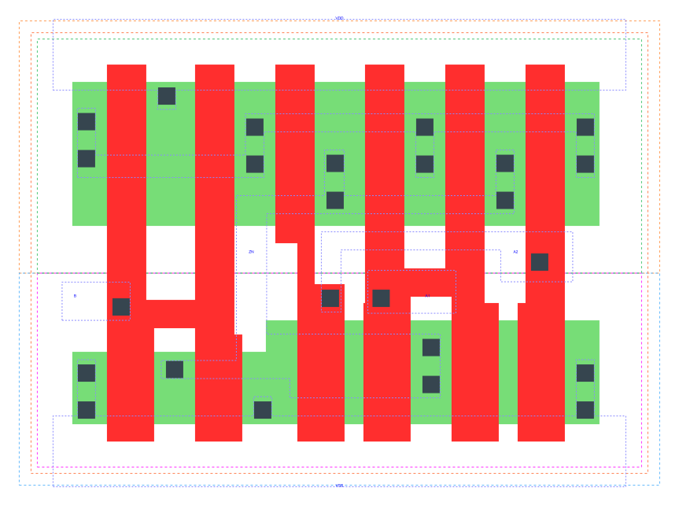

====================================
gf180mcu_fd_sc_mcu9t5v0__aoi21_x2
====================================

**gf180mcu_fd_sc_mcu9t5v0__aoi21_x2 symbol**

.. image:: sc9_sym/AOI21_X2_sym.png
    :height: 200px
    :width: 400 px
    :align: center
    :alt: gf180mcu_fd_sc_mcu9t5v0__aoi21_x2 symbol

**gf180mcu_fd_sc_mcu9t5v0__aoi21_x2 schematic**

.. image:: sc9_sch/AOI21_X2_sch.png
    :height: 250px
    :width: 450 px
    :align: center
    :alt: gf180mcu_fd_sc_mcu9t5v0__aoi21_x2 schematic

**gf180mcu_fd_sc_mcu9t5v0__aoi21_x2 layout**

.. include:: images.rst
| AOI21_X2 is a 2-input AND into 2-input NOR with 2X drive strength

|
| Attributes

============= ======================
**Attribute** **Value**
area          36.691200 µm\ :sup:`2`
============= ======================

|
| OUTPUT FUNCTIONS

============== ===========================
**Output Pin** **Function**
ZN             (((!A1)&(!B))|((!A2)&(!B)))
============== ===========================

|
| TRUTH TABLE FOR ZN

====== ====== ===== ======
**A1** **A2** **B** **ZN**
0      ?      0     1
?      0      0     1
1      1      ?     0
?      ?      1     0
====== ====== ===== ======

|
| FUNCTIONAL SCHEMATIC

| |image68|

| PIN CAPACITANCE (pf)

======= ======== ====================
**Pin** **Type** **Capacitance (pf)**
B       input    0.0116
A2      input    0.0143
A1      input    0.0139
======= ======== ====================

|
| DELAY AND OUTPUT TRANSITION TIME corresponding to min slew and load

+---------------+------------+--------------------+--------------+-------------------+----------------+---------------+
| **Input Pin** | **Output** | **When Condition** | **Tin (ns)** | **Out Load (pf)** | **Delay (ns)** | **Tout (ns)** |
+---------------+------------+--------------------+--------------+-------------------+----------------+---------------+
| B(LH)         | ZN(HL)     | !A1&!A2            | 0.0100       | 0.0010            | 0.0909         | 0.0519        |
+---------------+------------+--------------------+--------------+-------------------+----------------+---------------+
| B(LH)         | ZN(HL)     | !A1&A2             | 0.0100       | 0.0010            | 0.0717         | 0.0437        |
+---------------+------------+--------------------+--------------+-------------------+----------------+---------------+
| B(LH)         | ZN(HL)     | A1&!A2             | 0.0100       | 0.0010            | 0.0795         | 0.0616        |
+---------------+------------+--------------------+--------------+-------------------+----------------+---------------+
| B(HL)         | ZN(LH)     | !A1&!A2            | 0.0100       | 0.0010            | 0.1037         | 0.0669        |
+---------------+------------+--------------------+--------------+-------------------+----------------+---------------+
| B(HL)         | ZN(LH)     | !A1&A2             | 0.0100       | 0.0010            | 0.1207         | 0.0685        |
+---------------+------------+--------------------+--------------+-------------------+----------------+---------------+
| B(HL)         | ZN(LH)     | A1&!A2             | 0.0100       | 0.0010            | 0.1594         | 0.0966        |
+---------------+------------+--------------------+--------------+-------------------+----------------+---------------+
| A2(HL)        | ZN(LH)     | A1&!B              | 0.0100       | 0.0010            | 0.1174         | 0.0951        |
+---------------+------------+--------------------+--------------+-------------------+----------------+---------------+
| A2(LH)        | ZN(HL)     | A1&!B              | 0.0100       | 0.0010            | 0.0635         | 0.0282        |
+---------------+------------+--------------------+--------------+-------------------+----------------+---------------+
| A1(HL)        | ZN(LH)     | A2&!B              | 0.0100       | 0.0010            | 0.0849         | 0.0651        |
+---------------+------------+--------------------+--------------+-------------------+----------------+---------------+
| A1(LH)        | ZN(HL)     | A2&!B              | 0.0100       | 0.0010            | 0.0527         | 0.0283        |
+---------------+------------+--------------------+--------------+-------------------+----------------+---------------+

|
| DYNAMIC ENERGY

+---------------+--------------------+--------------+------------+-------------------+---------------------+
| **Input Pin** | **When Condition** | **Tin (ns)** | **Output** | **Out Load (pf)** | **Energy (uW/MHz)** |
+---------------+--------------------+--------------+------------+-------------------+---------------------+
| A1            | A2&!B              | 0.0100       | ZN(LH)     | 0.0010            | 0.3353              |
+---------------+--------------------+--------------+------------+-------------------+---------------------+
| B             | !A1&!A2            | 0.0100       | ZN(HL)     | 0.0010            | 0.1430              |
+---------------+--------------------+--------------+------------+-------------------+---------------------+
| B             | !A1&A2             | 0.0100       | ZN(HL)     | 0.0010            | 0.1232              |
+---------------+--------------------+--------------+------------+-------------------+---------------------+
| B             | A1&!A2             | 0.0100       | ZN(HL)     | 0.0010            | 0.1231              |
+---------------+--------------------+--------------+------------+-------------------+---------------------+
| A2            | A1&!B              | 0.0100       | ZN(LH)     | 0.0010            | 0.4506              |
+---------------+--------------------+--------------+------------+-------------------+---------------------+
| A1            | A2&!B              | 0.0100       | ZN(HL)     | 0.0010            | 0.0108              |
+---------------+--------------------+--------------+------------+-------------------+---------------------+
| B             | !A1&!A2            | 0.0100       | ZN(LH)     | 0.0010            | 0.5206              |
+---------------+--------------------+--------------+------------+-------------------+---------------------+
| B             | !A1&A2             | 0.0100       | ZN(LH)     | 0.0010            | 0.4541              |
+---------------+--------------------+--------------+------------+-------------------+---------------------+
| B             | A1&!A2             | 0.0100       | ZN(LH)     | 0.0010            | 0.5827              |
+---------------+--------------------+--------------+------------+-------------------+---------------------+
| A2            | A1&!B              | 0.0100       | ZN(HL)     | 0.0010            | 0.0105              |
+---------------+--------------------+--------------+------------+-------------------+---------------------+
| B(HL)         | A1&A2              | 0.0100       | n/a        | n/a               | 0.1189              |
+---------------+--------------------+--------------+------------+-------------------+---------------------+
| A2(LH)        | !A1&!B             | 0.0100       | n/a        | n/a               | -0.1200             |
+---------------+--------------------+--------------+------------+-------------------+---------------------+
| A2(LH)        | !A1&B              | 0.0100       | n/a        | n/a               | -0.0283             |
+---------------+--------------------+--------------+------------+-------------------+---------------------+
| A2(LH)        | A1&B               | 0.0100       | n/a        | n/a               | -0.0317             |
+---------------+--------------------+--------------+------------+-------------------+---------------------+
| A1(LH)        | !A2&!B             | 0.0100       | n/a        | n/a               | -0.0938             |
+---------------+--------------------+--------------+------------+-------------------+---------------------+
| A1(LH)        | !A2&B              | 0.0100       | n/a        | n/a               | -0.0283             |
+---------------+--------------------+--------------+------------+-------------------+---------------------+
| A1(LH)        | A2&B               | 0.0100       | n/a        | n/a               | -0.0316             |
+---------------+--------------------+--------------+------------+-------------------+---------------------+
| A2(HL)        | !A1&!B             | 0.0100       | n/a        | n/a               | 0.1327              |
+---------------+--------------------+--------------+------------+-------------------+---------------------+
| A2(HL)        | !A1&B              | 0.0100       | n/a        | n/a               | 0.0312              |
+---------------+--------------------+--------------+------------+-------------------+---------------------+
| A2(HL)        | A1&B               | 0.0100       | n/a        | n/a               | 0.1214              |
+---------------+--------------------+--------------+------------+-------------------+---------------------+
| B(LH)         | A1&A2              | 0.0100       | n/a        | n/a               | -0.0919             |
+---------------+--------------------+--------------+------------+-------------------+---------------------+
| A1(HL)        | !A2&!B             | 0.0100       | n/a        | n/a               | 0.1344              |
+---------------+--------------------+--------------+------------+-------------------+---------------------+
| A1(HL)        | !A2&B              | 0.0100       | n/a        | n/a               | 0.0312              |
+---------------+--------------------+--------------+------------+-------------------+---------------------+
| A1(HL)        | A2&B               | 0.0100       | n/a        | n/a               | 0.1214              |
+---------------+--------------------+--------------+------------+-------------------+---------------------+

|
| LEAKAGE POWER

================== ==============
**When Condition** **Power (nW)**
!A1&!A2&!B         0.1514
!A1&A2&!B          0.1521
A1&!A2&!B          0.2316
!A1&!A2&B          0.2609
!A1&A2&B           0.2667
A1&!A2&B           0.2667
A1&A2&!B           0.1574
A1&A2&B            0.1572
================== ==============

